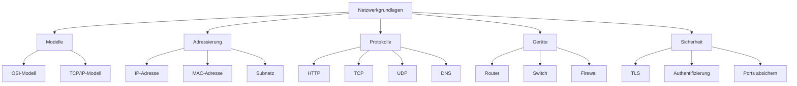
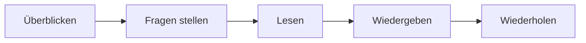
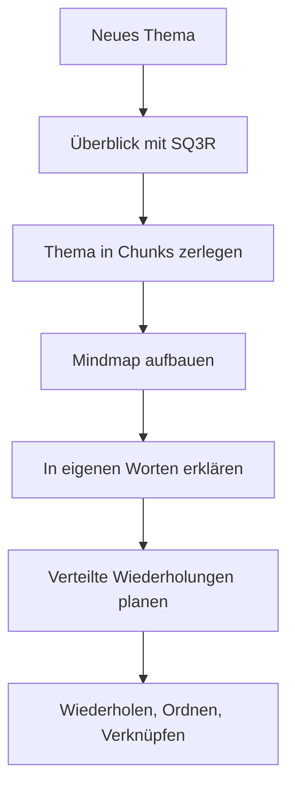

###### Themen

Lerntechniken

- Erstellung und Anwendung von Mindmaps zur Strukturierung von Lerninhalten
- Anwendung der SQ3R-Methode zum Erschließen von Texten und Lernmaterialien
- Zerlegung komplexer Informationen mit der Chunking-Methode

Wissen langfristig sichern

- Einsatz von Spaced Repetition für nachhaltige Wissenssicherung
- Wiederholen, Ordnen und Verknüpfen als Lernstrategie

   
# 🧠 Lerntechniken sinnvoll einsetzen

Wenn du Lernstoff wirklich verstehen und später wieder abrufen willst, reicht bloßes Lesen fast nie aus. Gerade bei **Core Tech Fundamentals** — also Themen wie Rechnerarchitektur, Netzwerke, Betriebssysteme, Datenstrukturen, Web-Grundlagen oder Programmierkonzepte — ist es wichtig, Informationen **aktiv zu strukturieren, zu vereinfachen und mehrfach sinnvoll zu verarbeiten**.

Die drei Methoden, die du genannt hast, greifen genau dort an:

- **Gedankenkarten (Mindmaps)** helfen dir, Stoff sichtbar zu ordnen.
- **SQ3R** hilft dir, Texte und Lernmaterialien aktiv zu erschließen.
- **Chunking** hilft dir, komplexe Inhalte in verdauliche Bausteine zu zerlegen.

Das Entscheidende ist: Diese Methoden sind keine isolierten Tricks. Sie unterstützen unterschiedliche Phasen des Lernens. Die eine Methode hilft beim **Verstehen**, die andere beim **Strukturieren**, die nächste beim **Behalten**.

   
## 🗺️ Gedankenkarten (Mindmaps) zur Strukturierung von Lerninhalten

Eine **Mindmap** ist eine visuelle Darstellung von Wissen. In der Mitte steht ein zentrales Thema, und davon ausgehend verzweigen sich Unterthemen, Begriffe, Zusammenhänge und Beispiele. Statt Informationen nur untereinander aufzuschreiben, ordnest du sie **räumlich und hierarchisch**.

Der große Vorteil: Dein Gehirn verarbeitet Informationen leichter, wenn es nicht nur linearen Text bekommt, sondern auch **Beziehungen zwischen Dingen** erkennt. Genau das leisten Mindmaps besonders gut.

### Was eine Mindmap beim Lernen so wertvoll macht

Viele Lernende schreiben beim Lernen lange Notizen. Das Problem dabei: Solche Notizen sind oft linear, also wie ein Fließtext aufgebaut. Fachliche Themen sind aber meistens **nicht linear**, sondern bestehen aus Ebenen, Abhängigkeiten und Zusammenhängen.

Ein Beispiel aus der Technik:  
Wenn du das Thema **„Wie funktioniert das Internet?“** lernst, dann hängt nicht alles nur in einer einzigen Reihenfolge zusammen. Du brauchst Begriffe wie:

- IP-Adresse
- DNS
- HTTP
- TCP
- Router
- Server
- Client

Diese Begriffe stehen in Beziehung zueinander. Eine Mindmap macht genau solche Beziehungen sichtbar.

### Wie du eine Mindmap erstellst

Der Aufbau ist einfach, wenn du systematisch vorgehst.

#### 1. Das Kernthema in die Mitte setzen

In die Mitte kommt das Hauptthema, zum Beispiel:

- Betriebssystem
- HTTP
- Datenbanken
- Git
- CPU und Speicher
- Netzwerke

Dieses Thema ist der Ausgangspunkt.

#### 2. Hauptäste anlegen

Danach legst du die wichtigsten Unterbereiche an. Beim Thema **Betriebssystem** könnten das zum Beispiel sein:

- Prozesse
- Speicherverwaltung
- Dateisystem
- Benutzer und Rechte
- Scheduling
- Geräteverwaltung

Diese Hauptäste sind die groben Blöcke des Themas.

#### 3. Unteräste ergänzen

Dann gehst du tiefer. Unter **Prozesse** könnten zum Beispiel stehen:

- Prozess vs. Thread
- Prozesszustände
- Kontextwechsel
- PID
- Nebenläufigkeit

Unter **Speicherverwaltung** vielleicht:

- RAM
- virtueller Speicher
- Paging
- Stack und Heap

#### 4. Mit Schlüsselwörtern statt langen Sätzen arbeiten

Eine gute Mindmap lebt von **Begriffen**, nicht von ganzen Absätzen. Statt zu schreiben:

> „Ein Prozess ist ein laufendes Programm mit eigenem Speicherbereich“

schreibst du eher:

- laufendes Programm
- eigener Adressraum
- Ressourcen
- Prozess-ID

Warum? Weil die Mindmap nicht das Denken ersetzen soll, sondern es **anstoßen** soll.

#### 5. Beziehungen sichtbar machen

Wenn zwei Bereiche zusammenhängen, darfst du zusätzliche Verbindungen einzeichnen. Das ist besonders hilfreich bei technischen Themen.

Beispiel:

- **HTTP** hängt mit **Client-Server-Modell** zusammen.
- **DNS** hängt mit **Namensauflösung** zusammen.
- **TCP** hängt mit **zuverlässiger Übertragung** zusammen.

Dadurch wird aus einer Sammlung von Begriffen ein **Wissensnetz**.

### Wofür Mindmaps besonders gut geeignet sind

Mindmaps sind besonders nützlich, wenn du:

- einen Überblick über ein neues Thema brauchst,
- ein großes Kapitel strukturieren willst,
- Zusammenhänge erkennen willst,
- vor einer Wiederholung schnell das große Ganze sehen möchtest,
- Fachbegriffe ordnen willst.

Weniger gut sind sie, wenn es um extrem genaue lineare Abläufe oder Rechenschritte geht. Dafür sind Tabellen, Prozessdiagramme oder gezielte Notizen oft besser.

### Ein einfaches Beispiel aus den Core Tech Fundamentals

Angenommen, du lernst **Netzwerkgrundlagen**. Dann könnte eine Mindmap so aussehen:

So eine Darstellung zeigt dir auf einen Blick, welche Teilgebiete zusammengehören.

### Wie du Mindmaps richtig anwendest

Eine Mindmap ist dann am besten, wenn sie **nicht nur abgeschrieben**, sondern **aktiv aufgebaut** wird. Genau dieser Prozess ist bereits Lernen.

Wenn du eine Mindmap erstellst, passiert im Kopf Folgendes:

- Du entscheidest, was wichtig ist.
- Du ordnest Informationen nach Ebenen.
- Du erkennst Über- und Unterbegriffe.
- Du stellst Beziehungen her.
- Du formulierst Inhalte in eigene Wörter um.

Das ist viel wertvoller, als passiv Text zu markieren.

### Typische Fehler bei Mindmaps

Ein häufiger Fehler ist, die Mindmap mit zu viel Text zu überladen. Dann wird sie nur zu einer schlecht lesbaren Mitschrift in Baumform.

Ein anderer Fehler ist, alles auf einer Ebene zu notieren. Wenn keine Hierarchie sichtbar wird, geht der eigentliche Nutzen verloren.

Außerdem sollte eine Mindmap nicht bloß „schön“ sein. Farben und Symbole können helfen, aber nur dann, wenn sie eine Funktion haben — zum Beispiel zur Unterscheidung von Kategorien.

   
## 📖 Die SQ3R-Methode zum Erschließen von Texten und Lernmaterialien

Die **SQ3R-Methode** ist eine klassische Lesestrategie für systematisches Lernen. Das Kürzel steht für:

- **S**urvey
- **Q**uestion
- **R**ead
- **R**ecite
- **R**eview

Im Deutschen kann man das sinnvoll als **Überblicken, Fragen stellen, Lesen, Wiedergeben und Wiederholen** übersetzen. Die Methode wurde entwickelt, um Texte nicht nur zu lesen, sondern **aktiv zu verarbeiten** ([SQ3R](https://www.britannica.com/topic/SQ3R)).

Gerade bei Fachtexten ist das enorm wichtig. Wenn du zum Beispiel ein Kapitel über Betriebssysteme, eine Dokumentation über HTTP oder einen Artikel über Datenbanken liest, bringt es wenig, den Text einfach nur von oben nach unten zu konsumieren. Du musst mit dem Text arbeiten.

### Warum SQ3R so wirkungsvoll ist

Die Methode zwingt dich dazu, vor dem Lesen ein mentales Gerüst aufzubauen. Dadurch liest du nicht blind, sondern mit einem Ziel.

Das ist besonders nützlich bei technischen Inhalten, weil diese oft:

- viele neue Begriffe enthalten,
- dichte Informationen haben,
- Definitionen und Prozesse vermischen,
- ohne Vorstruktur schnell überfordernd wirken.

SQ3R macht aus passivem Lesen einen **aktiven Lernprozess**.

### Die fünf Schritte verständlich erklärt

| Schritt | Bedeutung | Was du konkret machst | Beispiel bei einem Tech-Text |
|---|---|---|---|
| Survey | Überblicken | Kapitel, Überschriften, Grafiken, Zusammenfassungen ansehen | Du schaust dir in einem Kapitel zu TCP/IP erst die Abschnittstitel und Diagramme an |
| Question | Fragen stellen | Aus Überschriften echte Fragen machen | „Was ist der Unterschied zwischen TCP und UDP?“ |
| Read | Lesen | Den Text gezielt lesen, um Antworten zu finden | Du liest mit Fokus auf deine Fragen |
| Recite | Wiedergeben | Das Gelesene in eigenen Worten wiedergeben | Du erklärst ohne Buch: „TCP ist verbindungsorientiert, UDP nicht“ |
| Review | Wiederholen | Später erneut prüfen und festigen | Du gehst die Fragen noch einmal durch und ergänzt Lücken |

### 🔍 Survey – Überblick gewinnen

Bevor du richtig liest, verschaffst du dir einen ersten Überblick. Du schaust auf:

- Titel
- Zwischenüberschriften
- fett markierte Begriffe
- Diagramme
- Tabellen
- Zusammenfassungen
- Fragen am Kapitelende

Dieser Schritt ist extrem wichtig, weil dein Gehirn dadurch schon eine erste Landkarte bekommt. Du weißt dann, worum es geht und welche Begriffe wahrscheinlich zentral sind.

Wenn du zum Beispiel eine API-Dokumentation liest, würdest du zunächst ansehen:

- Welche Endpunkte gibt es?
- Welche HTTP-Methoden kommen vor?
- Welche Datenformate werden verwendet?
- Gibt es Fehlercodes oder Authentifizierung?

Du liest noch nicht tief, sondern baust erst Orientierung auf.

### ❓ Question – Fragen aus dem Material ableiten

Jetzt wandelst du Überschriften in Fragen um. Das ist ein zentraler Schritt, weil Fragen deinen Blick beim Lesen schärfen.

Aus der Überschrift **„Speicherhierarchie“** werden zum Beispiel Fragen wie:

- Warum gibt es verschiedene Speicherebenen?
- Was ist der Unterschied zwischen Cache, RAM und SSD?
- Warum ist schneller Speicher teurer oder kleiner?

Aus **„DNS“** werden etwa:

- Wozu braucht man DNS?
- Wie läuft eine Namensauflösung ab?
- Was passiert, wenn ein DNS-Server nicht antwortet?

Mit diesen Fragen liest du ganz anders. Du suchst nicht mehr nur nach „Inhalt“, sondern nach **Antworten**.

### 📘 Read – Gezielt lesen

Jetzt liest du den Text wirklich. Aber eben nicht passiv, sondern mit dem Ziel, deine Fragen zu beantworten.

Beim Lesen markierst du idealerweise nicht alles, sondern nur:

- Definitionen,
- Schlüsselbegriffe,
- Ursache-Wirkung-Beziehungen,
- Abläufe,
- Unterschiede,
- Beispiele.

Wenn du beim Lesen merkst, dass du einen Abschnitt nicht verstanden hast, ist das kein Zeichen von Schwäche. Es bedeutet nur, dass du noch keinen tragfähigen mentalen Anker gefunden hast. Dann hilft es oft, den Abschnitt in einfachere Sprache zu übersetzen oder in kleinere Teile zu zerlegen.

### 🗣️ Recite – In eigenen Worten wiedergeben

Das ist einer der stärksten Teile der Methode. Nach einem Abschnitt hältst du an und versuchst, den Inhalt **ohne Vorlage** wiederzugeben.

Zum Beispiel:

> „Ein Prozess ist ein laufendes Programm mit eigenem Adressraum. Ein Thread ist eine Ausführungseinheit innerhalb eines Prozesses. Mehrere Threads können sich Speicher teilen.“

Wenn du das sauber formulieren kannst, hast du nicht nur gelesen, sondern verarbeitet.

Wenn du ins Stocken gerätst, zeigt dir das sehr ehrlich, wo noch Verständnislücken sind. Genau deshalb ist dieser Schritt so wertvoll.

### 🔁 Review – Wiederholen und festigen

Am Ende gehst du noch einmal durch die Fragen, Begriffe und Kernaussagen. So verhinderst du, dass der Stoff nach kurzer Zeit wieder verblasst.

Wichtig ist: Review heißt nicht einfach „noch mal lesen“. Es heißt:

- noch mal aktiv abrufen,
- Lücken erkennen,
- Begriffe ordnen,
- offene Fragen klären.

Gerade bei technischen Themen solltest du hier auch prüfen, ob du die Inhalte **anwenden** könntest. Verstehst du also nur die Wörter oder auch den Zusammenhang?

### Ein praktisches Beispiel mit einem Techniktext

Nehmen wir an, du liest einen Abschnitt über **HTTP**.

#### Survey
Du siehst Überschriften wie:

- Request und Response
- Methoden
- Statuscodes
- Header
- Zustandslosigkeit

#### Question
Daraus machst du Fragen:

- Was ist eine HTTP-Request?
- Was ist der Unterschied zwischen GET und POST?
- Warum gibt es Statuscodes?
- Was bedeutet zustandslos?

#### Read
Jetzt liest du mit Fokus auf genau diese Fragen.

#### Recite
Danach erklärst du:

> „HTTP ist ein Protokoll für die Kommunikation zwischen Client und Server. Eine Request enthält Methode, URL, Header und eventuell einen Body. Der Server antwortet mit Statuscode, Headern und Body.“

#### Review
Später prüfst du erneut:

- Kann ich 200, 404 und 500 unterscheiden?
- Weiß ich, wann GET oder POST sinnvoll ist?
- Kann ich den Ablauf einer Anfrage skizzieren?

So wird aus Lesen echtes Lernen.

### Typische Fehler bei SQ3R

Ein häufiger Fehler ist, die Methode zu mechanisch anzuwenden. SQ3R ist kein starres Ritual, sondern ein Werkzeug. Wenn ein Text sehr kurz ist, brauchst du nicht jeden Schritt riesig auszubauen.

Ein weiterer Fehler ist, das **Recite** zu überspringen. Genau dort zeigt sich aber, ob du wirklich verstanden hast.

Außerdem verwechseln viele **Review** mit erneutem Durchlesen. Wirkliches Wiederholen heißt: **abrufen, rekonstruieren, prüfen**.

   
## 🧩 Stückelung in Lerneinheiten (Chunking) zur Zerlegung komplexer Informationen

**Chunking** bedeutet, viele einzelne Informationen zu **sinnvollen Gruppen oder Blöcken** zusammenzufassen. Statt isolierte Details zu lernen, baust du größere Bedeutungseinheiten.

Die klassische Gedächtnisforschung beschreibt, dass Informationen leichter verarbeitet werden können, wenn sie als sinnvolle Einheiten organisiert werden statt als lose Einzelteile ([The Magical Number Seven, Plus or Minus Two](https://psychclassics.yorku.ca/Miller/)).

Gerade bei komplexen technischen Themen ist Chunking extrem hilfreich, weil dort oft viele Begriffe gleichzeitig auf dich einprasseln.

### Was Chunking eigentlich leistet

Stell dir vor, du lernst folgenden Ablauf:

- Browser
- DNS
- IP-Adresse
- TCP-Verbindung
- TLS-Handshake
- HTTP-Request
- Serverantwort
- Rendering

Wenn du diese Punkte nur als einzelne Wörter lernst, wirkt alles schnell unübersichtlich. Wenn du sie aber sinnvoll bündelst, entstehen größere Einheiten.

Zum Beispiel:

- **Adressauflösung**: DNS, IP-Adresse
- **Verbindungsaufbau**: TCP, TLS
- **Datenübertragung**: HTTP-Request, Response
- **Darstellung im Browser**: Rendering

So wird aus einer langen Liste ein strukturierter Prozess.

### Warum Chunking gerade bei Tech-Themen so wichtig ist

Viele technische Systeme bestehen aus:

- Schichten,
- Komponenten,
- Abläufen,
- Zuständen,
- Rollen,
- Ein- und Ausgaben.

Wenn du jedes Detail einzeln speicherst, wird dein Kopf sehr schnell voll. Wenn du aber erkennst, welche Details zusammengehören, reduzierst du die kognitive Last.

Das heißt nicht, dass du weniger lernst. Du lernst **intelligenter organisiert**.

### So chunkst du sinnvoll

#### 1. Nach Funktion gruppieren

Frage dich: Welche Teile erfüllen dieselbe Aufgabe?

Beispiel beim Thema Rechner:

- **Verarbeitung**: CPU, Register, ALU
- **Kurzfristiger Speicher**: Cache, RAM
- **Langfristiger Speicher**: SSD, HDD

#### 2. Nach Ablauf gruppieren

Bei Prozessen oder Protokollen kannst du nach Phasen gliedern.

Beispiel bei Git:

- Änderungen erstellen
- Änderungen vormerken
- Commit erstellen
- Synchronisieren mit Remote

#### 3. Nach Hierarchie gruppieren

Gerade bei Architekturthemen hilfreich.

Beispiel Datenbank:

- Datenbank
  - Tabellen
    - Zeilen
    - Spalten
      - Datentypen
      - Constraints

#### 4. Nach Unterschiedspaaren gruppieren

Vergleiche sind starke Chunks.

Beispiele:

- RAM vs. SSD
- Prozess vs. Thread
- TCP vs. UDP
- Compiler vs. Interpreter
- statisch vs. dynamisch

Solche Paare helfen, Begriffe klar voneinander zu trennen.

### Ein Beispiel: Chunking beim Thema HTTP-Anfrage

Statt viele Einzelbegriffe unverbunden zu lernen, kannst du das Thema so zerlegen:

| Chunk | Inhalt | Leitfrage |
|---|---|---|
| Adressierung | URL, Domain, DNS, IP | Wohin geht die Anfrage? |
| Verbindung | TCP, TLS | Wie wird sicher und zuverlässig verbunden? |
| Anfrage | Methode, Header, Body | Was möchte der Client? |
| Antwort | Statuscode, Header, Body | Was liefert der Server zurück? |
| Darstellung | HTML, CSS, Browser-Rendering | Wie wird das Ergebnis sichtbar? |

So bekommst du ein stabiles Grundgerüst. Erst danach gehst du in Details.

### Chunking ist nicht bloß Vereinfachung

Ein wichtiger Punkt: Chunking bedeutet nicht, Informationen künstlich zu verkürzen. Es bedeutet, sie **in sinnvolle Einheiten zu überführen**.

Ein guter Chunk hat deshalb drei Eigenschaften:

- Er gehört inhaltlich zusammen.
- Er hat eine erkennbare Funktion.
- Er lässt sich mit einer Frage oder Überschrift benennen.

Wenn du einen Block nicht benennen kannst, ist er oft noch nicht sauber gechunked.

### Wie du Chunking konkret anwendest

Wenn du ein neues Thema lernst, kannst du dir immer diese Fragen stellen:

- Welche 3 bis 7 Hauptblöcke hat das Thema?
- Welche Details gehören zu welchem Block?
- In welcher Reihenfolge hängen die Blöcke zusammen?
- Welche Begriffe muss ich unterscheiden?
- Welche Begriffe kann ich zusammenfassen?

Gerade bei Skripten, Dokumentationen und Architekturthemen ist das Gold wert.

### Typische Fehler beim Chunking

Ein häufiger Fehler ist, zu grob zu chunking. Dann wird ein Block zu groß und unpräzise, etwa einfach nur „Netzwerk“. Das hilft wenig.

Ein anderer Fehler ist, zu fein zu chunking. Dann hast du am Ende wieder nur viele Einzelteile.

Die Kunst liegt darin, eine Ebene zu finden, auf der der Stoff **übersichtlich, aber noch bedeutungsvoll** bleibt.

   
# 💾 Wissen langfristig sichern

Verstehen allein reicht nicht. Wenn Wissen dauerhaft verfügbar sein soll, musst du es so bearbeiten, dass es **auch nach Tagen, Wochen und Monaten** noch abrufbar bleibt.

Genau hier kommen **Spaced Repetition** sowie die Strategie **Wiederholen, Ordnen und Verknüpfen** ins Spiel.

   
## ⏱️ Verteiltes Wiederholen (Spaced Repetition) für nachhaltige Wissenssicherung

**Spaced Repetition** bedeutet, dass du Lerninhalte **nicht auf einmal massiert**, sondern **in sinnvollen Abständen wiederholst**. Die Lernforschung zeigt seit Langem, dass verteiltes Wiederholen zu deutlich besserer langfristiger Behaltensleistung führt als geballtes Pauken in einer einzigen Sitzung ([Improving Students’ Learning With Effective Learning Techniques](https://journals.sagepub.com/doi/10.1177/1529100612453266); [Distributed Practice in Verbal Recall Tasks](https://journals.sagepub.com/doi/10.1111/j.1467-9280.2006.01693.x)).

Das ist einer der wichtigsten Punkte überhaupt:  
**Ein Stoff, den du heute lernst und dann nie wieder aktiv abrufst, wird sehr schnell unscharf.**  
Ein Stoff, den du mehrmals mit Abstand erneut abrufst, wird deutlich stabiler.

### Warum verteiltes Wiederholen so gut funktioniert

Wenn du etwas direkt nach dem Lernen noch einmal anschaust, fühlt es sich oft leicht an. Aber das ist trügerisch. Du erkennst den Stoff nur wieder, statt ihn wirklich zu erinnern.

Bei Spaced Repetition passiert etwas Besseres: Zwischen zwei Wiederholungen vergeht genug Zeit, damit der Abruf etwas anstrengender wird. Genau diese Abrufanstrengung stärkt die Erinnerung.

Das bedeutet praktisch:

- Sofortiges Wiederlesen fühlt sich gut an, bringt aber oft weniger.
- Späteres aktives Erinnern fühlt sich schwerer an, wirkt aber nachhaltiger.

### So setzt du Spaced Repetition sinnvoll ein

Du brauchst dafür nicht zwingend eine App. Das Prinzip kannst du auch analog anwenden.

Ein typischer Ablauf könnte so aussehen:

| Zeitpunkt | Ziel |
|---|---|
| Am selben Tag | Erste Festigung |
| Nach 1 Tag | Frühe Stabilisierung |
| Nach 3 Tagen | Erneuter Abruf mit leichtem Abstand |
| Nach 7 Tagen | Mittelfristige Festigung |
| Nach 14 Tagen | Weitere Stabilisierung |
| Nach 30 Tagen | Langfristiger Abruf |

Diese Abstände sind kein starres Gesetz. Sie sind ein praktisches Muster. Je schwieriger ein Thema ist, desto enger dürfen die ersten Wiederholungen liegen.

### Was du bei einer Wiederholung tun solltest

Wiederholen heißt nicht automatisch „noch mal lesen“. Besser ist:

- aus dem Kopf erklären,
- Begriffe definieren,
- Zusammenhänge skizzieren,
- kleine Karten mit Fragen nutzen,
- ein Diagramm ohne Vorlage nachzeichnen,
- Unterschiede benennen,
- einen Ablauf rekonstruieren.

Bei Technikthemen könnten gute Wiederholungsfragen sein:

- Was ist der Unterschied zwischen RAM und Cache?
- Wie läuft eine DNS-Auflösung ab?
- Was macht ein Betriebssystem beim Prozesswechsel?
- Wofür braucht man TCP, wenn es schon IP gibt?
- Wie unterscheiden sich Stack und Heap?

Das sind Fragen, die **Abruf** verlangen, nicht bloß Wiedererkennen.

### Spaced Repetition bei Core Tech Fundamentals

Gerade Grundlagenwissen in der Technik profitiert stark von Spaced Repetition, weil solche Inhalte später aufeinander aufbauen.

Wenn du heute nicht stabil verstehst und erinnerst, was etwa diese Begriffe bedeuten:

- Prozess
- Thread
- Port
- Protokoll
- IP-Adresse
- Dateisystem
- Hashing
- Rekursion

dann wird dir später fortgeschrittener Stoff viel schwerer fallen.

Spaced Repetition sorgt dafür, dass Basiskonzepte nicht wieder wegrutschen.

### Eine einfache visuelle Vorstellung

### Womit du Spaced Repetition kombinieren solltest

Spaced Repetition ist besonders stark, wenn du es mit **aktivem Abruf** verbindest. Also nicht nur „ansehen“, sondern:

- beantworten,
- erklären,
- zeichnen,
- unterscheiden,
- ordnen.

Bei technischem Lernen sind Karteikarten dann gut, wenn sie nicht nur nach Definitionen fragen, sondern auch nach Beziehungen und Anwendungen.

Schlechtere Karte:
> Was ist DNS?

Bessere Karte:
> Welche Rolle spielt DNS zwischen Browser-Eingabe und Serveranfrage?

Noch bessere Karte:
> Beschreibe in 4 Schritten, wie ein Domainname in eine IP-Adresse aufgelöst wird.

### Typische Fehler bei Spaced Repetition

Ein häufiger Fehler ist, viel zu viel Stoff in dasselbe Wiederholungssystem zu packen. Dann verkommt alles zu einer Flut isolierter Karten.

Ein weiterer Fehler ist, nur Definitionen auswendig zu lernen. Gerade in der Technik musst du nicht nur Wörter kennen, sondern **Systeme verstehen**.

Außerdem wird Spaced Repetition oft mit bloßem Wiederlesen verwechselt. Der eigentliche Nutzen entsteht aber beim **Abrufen aus dem Gedächtnis**.

   
## 🔗 Wiederholen, Ordnen und Verknüpfen als Lernstrategie

Diese drei Tätigkeiten gehören eng zusammen:

- **Wiederholen** stabilisiert Wissen.
- **Ordnen** macht Wissen übersichtlich.
- **Verknüpfen** macht Wissen bedeutungsvoll.

Erst zusammen entsteht belastbares Lernen.

### 🔁 Wiederholen – damit Wissen abrufbar bleibt

Wiederholen bedeutet, dass du Inhalte mehrfach zurückholst. Nicht, weil du „es schon wieder vergessen hast“, sondern weil Erinnerungen durch Nutzung stärker werden.

Beim Wiederholen sollte dein Ziel nicht sein, alles möglichst oft anzusehen, sondern möglichst oft sinnvoll zu **rekonstruieren**.

Gerade in technischen Themen hilft es, wenn du wiederholt dieselben Konzepte aus verschiedenen Perspektiven anschaust:

- definieren,
- vergleichen,
- in Abläufe einordnen,
- mit Beispielen verbinden.

So wird aus einem losen Begriff ein belastbares Konzept.

### 🗂️ Ordnen – damit Wissen nicht chaotisch bleibt

Ordnen heißt, Stoff so zu strukturieren, dass du ihn innerlich „ablegen“ kannst.

Das kann bedeuten:

- Ober- und Unterbegriffe zu bilden,
- Prozesse in Phasen einzuteilen,
- Unterschiede klar zu trennen,
- Zusammengehöriges zu gruppieren,
- Ursache und Wirkung sichtbar zu machen.

Ordnen ist deshalb so wichtig, weil das Gehirn Wissen nicht wie eine unsortierte Kiste speichert. Es speichert leichter, wenn Inhalte in Strukturen eingebettet sind.

Bei Core Tech Fundamentals könnte Ordnen so aussehen:

| Thema | Sinnvolle Ordnung |
|---|---|
| Netzwerke | Schichten, Protokolle, Geräte, Adressierung |
| Betriebssysteme | Prozesse, Speicher, Dateisystem, Scheduling |
| Web-Grundlagen | Client, Server, Anfrage, Antwort, Rendering |
| Programmierung | Datentypen, Kontrollfluss, Funktionen, Speicher |
| Datenbanken | Tabellen, Beziehungen, Abfragen, Indizes |

Wenn du so ordnest, baust du mentale Regale.

### 🌐 Verknüpfen – damit neues Wissen mit altem Wissen zusammenwächst

Verknüpfen ist einer der wichtigsten Schritte überhaupt. Neues Wissen bleibt deutlich besser hängen, wenn es an bereits Bekanntes angeschlossen wird.

Wenn du zum Beispiel schon weißt, was eine **Adresse** im Alltag ist, kannst du eine **IP-Adresse** als Netzwerkadresse verstehen. Wenn du schon verstehst, was eine **Bibliothek** ist, kannst du dir eine **Code-Library** leichter vorstellen: eine Sammlung wiederverwendbarer Bausteine.

Verknüpfen kann auf mehreren Ebenen passieren:

#### Mit Vorwissen
Du verbindest Neues mit Dingen, die du schon verstehst.

#### Mit Beispielen
Abstrakte Begriffe werden durch konkrete Fälle greifbar.

#### Mit Gegensätzen
Ein Begriff wird klarer, wenn du ihn von einem ähnlichen abgrenzt.

#### Mit Systemen
Ein Einzelbegriff bekommt Bedeutung durch seine Rolle im Gesamtablauf.

### Ein Beispiel: „Prozess“ wirklich lernen

Wenn du nur auswendig lernst:

> Ein Prozess ist ein laufendes Programm.

dann hast du eine Definition.

Wenn du aber **wiederholst, ordnest und verknüpfst**, passiert mehr:

- Du **wiederholst** die Definition mehrfach.
- Du **ordnest** den Prozess im Betriebssystem ein, neben Thread, Speicher und Scheduling.
- Du **verknüpfst** ihn mit realen Beispielen wie Browser, Editor, Terminal oder Spiel.

Dann wird aus einem Satz ein echtes mentales Modell.

### Warum diese Strategie so stark ist

Viele Lernprobleme entstehen nicht, weil jemand „zu wenig liest“, sondern weil Wissen im Kopf nicht stabil organisiert ist.

Wenn du nur wiederholst, aber nicht ordnest, entsteht oft ein Haufen Einzelwissen.

Wenn du nur ordnest, aber nicht wiederholst, bleibt die Struktur zwar schön, aber das Wissen verblasst.

Wenn du nur verknüpfst, aber nie aktiv abrufst, wirkt alles verständlich, ist aber später trotzdem nicht verfügbar.

Die Stärke liegt im Zusammenspiel.

   
## ⚙️ Die Methoden gemeinsam beim Lernen von Core Tech Fundamentals einsetzen

Diese Methoden entfalten ihren größten Nutzen, wenn du sie **kombinierst**.

Ein sinnvoller Ablauf könnte so aussehen:

### Ein konkreter Lernablauf am Beispiel „DNS“

Nehmen wir an, du willst **DNS** lernen.

#### 1. SQ3R für den ersten Zugang
Du schaust dir zuerst Überschriften, Diagramme und Kernbegriffe an. Dann stellst du Fragen wie:

- Wofür braucht man DNS?
- Wie läuft eine Namensauflösung ab?
- Welche Server sind beteiligt?

#### 2. Chunking für die Struktur
Dann zerlegst du das Thema in sinnvolle Blöcke:

- Zweck von DNS
- Ablauf der Auflösung
- beteiligte Server
- Caching
- typische Fehlerquellen

#### 3. Mindmap für das Gesamtbild
Danach baust du eine Mindmap:

- DNS in der Mitte
- davon Zweige zu Funktion, Ablauf, Caching, Fehlersuche, Sicherheit

#### 4. Wiedergeben in eigenen Worten
Jetzt erklärst du ohne Vorlage:

> „DNS übersetzt Domainnamen in IP-Adressen. Der Client fragt meist erst lokale oder zwischengespeicherte Informationen ab und geht dann schrittweise weiter, bis eine passende Antwort gefunden wird.“

#### 5. Spaced Repetition
Dann wiederholst du das Thema nach 1 Tag, 3 Tagen, 1 Woche und später erneut.

#### 6. Ordnen und Verknüpfen
Zum Schluss verknüpfst du DNS mit anderen Themen:

- Browser-Anfrage
- HTTP
- IP-Adresse
- Netzwerkkommunikation
- Caching

Jetzt hängt DNS nicht mehr isoliert im Kopf, sondern sitzt im gesamten Netzwerkmodell.

### Was dabei im Kopf passiert

Wenn du diese Methoden kombinierst, passiert etwas sehr Wichtiges:

- **SQ3R** sorgt dafür, dass du aktiv in Texte hineingehst.
- **Chunking** reduziert Komplexität.
- **Mindmaps** machen Beziehungen sichtbar.
- **Spaced Repetition** sorgt für langfristige Stabilität.
- **Wiederholen, Ordnen und Verknüpfen** baut aus Wissen ein belastbares Netzwerk.

Das ist genau die Art von Lernen, die bei technischen Grundlagen stark funktioniert — weil technische Themen selten nur aus Fakten bestehen. Sie bestehen aus **Systemen, Beziehungen, Abhängigkeiten und Abläufen**.

Wenn du diese Methoden sauber einsetzt, lernst du nicht nur mehr. Du lernst vor allem **klarer, tiefer und dauerhafter**.