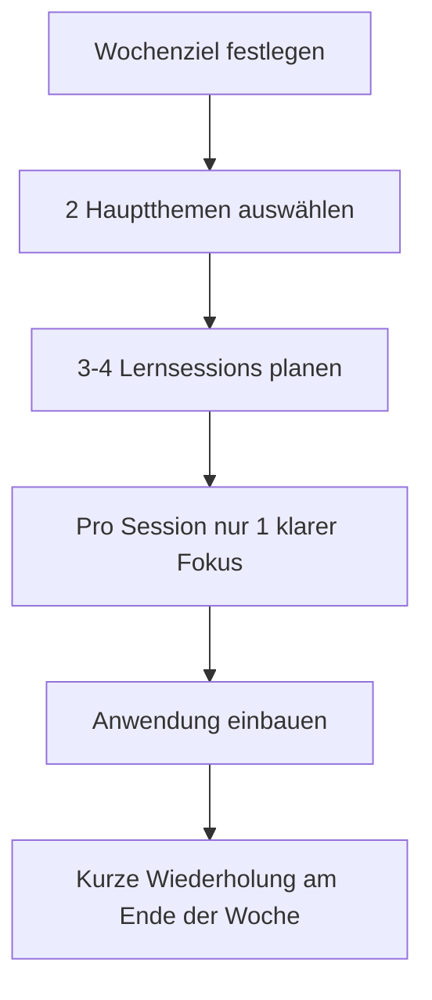
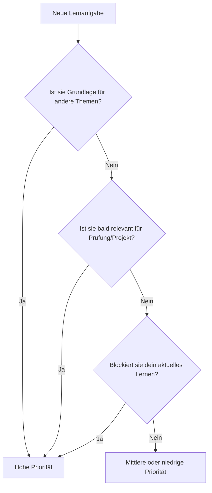

###### Themen

Zeitmanagement

- Entwickeln eines persönlichen Lernplans
- Priorisierung von Lernaufgaben
- Realistische Planung von Lernphasen und Pausen

Lernumgebung gestalten

- Optimierung des Arbeitsplatzes (digital und analog)
- Minimieren von Störungen und Aufbau von Fokussierungsstrategien

   

# ⏰ Zeitmanagement

Zeitmanagement beim Lernen bedeutet **nicht**, jeden Tag jede Minute perfekt zu verplanen. Es bedeutet vor allem, dass du deine Zeit **bewusst** so einteilst, dass Lernen regelmäßig, realistisch und ohne ständigen Stress möglich wird. Gerade bei **Core Tech Fundamentals** – also zum Beispiel Programmieren, Netzwerke, Betriebssysteme, Git, Datenbanken oder Web-Grundlagen – ist das wichtig, weil diese Themen nicht nur aus Lesen bestehen, sondern aus **Verstehen, Anwenden, Wiederholen und Fehlerfinden**.

Viele unterschätzen genau das: In technischen Themen reicht es selten, etwas einmal anzuschauen. Du musst Begriffe verstehen, Zusammenhänge erkennen, selbst etwas ausprobieren und später noch einmal darauf zurückkommen. Dass verteiltes Lernen über mehrere Einheiten hinweg deutlich wirksamer ist als alles auf einmal „durchzuballern“, wird in der Lernforschung seit Jahren klar gezeigt ([Improving Students’ Learning With Effective Learning Techniques](https://journals.sagepub.com/doi/10.1177/1529100612453266)).

Deshalb besteht gutes Zeitmanagement beim Lernen aus drei Dingen:

1. Du brauchst einen **persönlichen Lernplan**.
2. Du musst **wichtige Lernaufgaben priorisieren**.
3. Du solltest **Lernphasen und Pausen realistisch planen**.

---

   

## 🗺️ Einen persönlichen Lernplan entwickeln

Ein persönlicher Lernplan ist dein **Navigationssystem**. Ohne Plan lernst du oft nach Lust, Stimmung oder Zufall. Das fühlt sich kurzfristig locker an, führt aber häufig dazu, dass du einfache oder angenehme Dinge zu oft machst und anstrengende oder wichtige Themen aufschiebst.

Ein guter Lernplan beantwortet im Kern vier Fragen:

- **Was** lerne ich?
- **Warum** lerne ich das?
- **Wann** lerne ich es?
- **Woran merke ich**, dass ich es wirklich kann?

Gerade im Technikbereich ist der letzte Punkt entscheidend. „Ich habe das Video gesehen“ ist **kein** belastbarer Lernfortschritt. „Ich kann ein Git-Repository initialisieren, committen, branchen und einen Merge-Konflikt lösen“ ist ein echter Lernfortschritt.

   

### 🎯 Was ein Lernplan leisten soll

Dein Lernplan soll nicht nur Termine enthalten. Er soll dein Lernen **strukturieren**. Dazu gehören:

- **Lernziele**
- **Themenblöcke**
- **Zeitfenster**
- **Wiederholungen**
- **Praxisanteile**
- **Pufferzeiten**

Warum Puffer so wichtig sind: Menschen planen Aufgaben regelmäßig zu optimistisch. Dieses Phänomen ist als **Planungsfehlschluss** bekannt – wir unterschätzen Dauer, Aufwand und Hindernisse systematisch ([Maps of Bounded Rationality: Psychology for Behavioral Economics](https://www.aeaweb.org/articles?id=10.1257/000282803322655392)). Beim Lernen ist das besonders häufig der Fall, weil „Thema verstanden“ etwas anderes ist als „Thema wirklich anwenden können“.

---

   

### 🧱 Bausteine eines guten Lernplans

Hier siehst du, aus welchen Teilen ein sauberer Lernplan bestehen sollte:

| Baustein | Bedeutung | Beispiel im Tech-Kontext |
|---|---|---|
| Lernziel | Was du am Ende können willst | „Ich kann SQL-SELECTs mit WHERE, ORDER BY und JOIN schreiben“ |
| Themenpaket | Ein sinnvoll abgegrenzter Inhaltsblock | „Grundlagen SQL-Abfragen“ |
| Lernformat | Wie du lernst | Lesen, Video, Notizen, Coding, Karteikarten, Mini-Projekt |
| Zeitfenster | Wann du lernst | Mo, Mi, Fr jeweils 18:00–19:30 |
| Erfolgskriterium | Woran du Können erkennst | „Ich löse 5 Aufgaben ohne Vorlage“ |
| Wiederholung | Wann du zurückkehrst | 1 Tag später, 1 Woche später |
| Puffer | Reserve für Verzögerungen | Samstag 60 Minuten offen |

---

   

### 🧠 So entwickelst du deinen persönlichen Lernplan Schritt für Schritt

#### 1. Starte mit einem klaren Lernziel

Ein vages Ziel wie „Ich will besser in Programmieren werden“ ist zu ungenau. Besser ist:

- „Ich will in 6 Wochen Python-Grundlagen sicher anwenden.“
- „Ich will Git im Alltag ohne Angst vor der Konsole nutzen.“
- „Ich will TCP/IP, DNS und HTTP auf Grundlagen-Niveau erklären können.“

Je klarer dein Ziel, desto leichter kannst du passende Lernaufgaben auswählen.

#### 2. Zerlege das Ziel in kleine Lerneinheiten

Große Themen machen schnell Druck. Zerlege sie lieber in kleine Blöcke.

Beispiel für **Git**:

1. Repository und Commit verstehen  
2. Status, Add, Commit sicher nutzen  
3. Branches verstehen  
4. Merge und Konflikte lösen  
5. Remote-Repositories mit GitHub  
6. Typischer Workflow im Alltag

So wird aus einem „riesigen Thema“ eine Reihe machbarer Schritte.

#### 3. Plane nicht nur Input, sondern auch Anwendung

Viele Lernpläne scheitern, weil sie fast nur aus Konsum bestehen: lesen, Videos schauen, Tutorials anklicken. In technischen Fächern brauchst du aber **aktive Verarbeitung**. Die Lernforschung zeigt, dass aktives Abrufen und Anwenden deutlich wirksamer ist als bloßes Wiederlesen ([Improving Students’ Learning With Effective Learning Techniques](https://journals.sagepub.com/doi/10.1177/1529100612453266)).

Plane deshalb für jedes Thema mindestens diese drei Arten von Einheiten:

- **Verstehen**: Grundlagen aufnehmen
- **Anwenden**: selbst ausprobieren
- **Wiederholen**: ohne Hilfe erinnern und erklären

#### 4. Nutze feste Zeitfenster statt nur Vorsätze

„Ich lerne irgendwann am Abend“ ist unsicher. „Ich lerne Montag und Mittwoch von 19:00 bis 20:30“ ist viel verbindlicher.

Feste Zeitfenster entlasten dein Gehirn, weil du nicht jeden Tag neu entscheiden musst. Du reduzierst also Entscheidungsmüdigkeit und machst Lernen eher zur Gewohnheit.

#### 5. Plane weniger, als du theoretisch schaffen könntest

Das klingt erstmal falsch, ist aber sehr klug. Ein überladener Plan scheitert schnell. Ein realistischer Plan hält länger.

Wenn du glaubst, du könntest 10 Stunden pro Woche lernen, plane vielleicht erst 6 bis 7 Stunden fest ein. So bleibt Raum für Müdigkeit, Alltag, Krankheit, unerwartete Termine oder schwierige Themen.

---

   

### 🛠️ Beispiel für einen realistischen Wochen-Lernplan

Angenommen, du lernst **Python-Grundlagen und Git** neben Schule, Studium oder Arbeit.

Und als konkreter Plan:

| Tag | Zeit | Fokus | Art der Einheit |
|---|---:|---|---|
| Montag | 18:30–19:45 | Python: Variablen, Datentypen, Input/Output | Verstehen + kleine Übungen |
| Mittwoch | 18:30–19:45 | Python: if/else und Schleifen | Anwenden |
| Freitag | 18:00–19:15 | Git: init, add, commit, log | Praxis an einem Testprojekt |
| Samstag | 11:00–11:45 | Wiederholung Python + Git | Abrufen ohne Unterlagen |
| Samstag | 12:00–12:45 | Puffer | Offene Fragen oder Nachholen |

Wichtig ist hier nicht die perfekte Form, sondern die Logik dahinter:
- wenige Themen,
- feste Zeiten,
- konkrete Ziele,
- Wiederholung,
- Puffer.

---

   

## 🎯 Lernaufgaben priorisieren

Priorisieren bedeutet: Du entscheidest bewusst, **was zuerst** gelernt wird und **was später**. Das ist extrem wichtig, weil du nie unbegrenzt Zeit, Energie und Aufmerksamkeit hast.

Viele machen den Fehler, nach Gefühl zu priorisieren:

- „Darauf habe ich gerade Lust.“
- „Das sieht einfach aus.“
- „Das ist schnell erledigt.“
- „Das habe ich gestern schon gemacht, also mache ich weiter.“

Das ist menschlich, aber nicht immer sinnvoll. Beim guten Lernen solltest du stattdessen fragen:

- **Wie wichtig ist das Thema für mein Gesamtverständnis?**
- **Ist es eine Grundlage für andere Themen?**
- **Muss ich es bald anwenden?**
- **Blockiert mich dieses Thema gerade?**

Gerade in Core Tech Fundamentals sind manche Inhalte **Basiswissen**, auf dem viel anderes aufbaut. Wenn du zum Beispiel Variablen, Bedingungen und Schleifen nicht verstehst, bringen dir kompliziertere Python-Themen wenig. Wenn du DNS, IP und HTTP nicht grob verstehst, bleiben viele Web-Themen diffus.

---

   

### 🧭 Nach welchen Kriterien du Lernaufgaben ordnen solltest

Eine gute Priorisierung folgt meist diesen vier Kriterien:

| Kriterium | Frage | Warum wichtig |
|---|---|---|
| Relevanz | Wie wichtig ist das Thema für dein Ziel? | Nicht alles ist gleich wichtig |
| Abhängigkeit | Brauchen spätere Themen dieses Wissen? | Grundlagen zuerst |
| Dringlichkeit | Gibt es Prüfung, Abgabe oder Projektbezug? | Zeitkritische Themen zuerst |
| Schwierigkeitsgrad | Wie viel Denkarbeit braucht das Thema? | Schwere Themen brauchen gute Zeitfenster |

Wenn ein Thema **relevant, grundlegend und zeitkritisch** ist, gehört es weit nach oben.

---

   

### 🧱 Eine einfache Priorisierungslogik für Technik-Themen

Du kannst Lernaufgaben in drei Gruppen teilen:

#### A-Aufgaben: zuerst lernen
Das sind Themen, die grundlegend oder aktuell entscheidend sind.

Beispiele:
- Verständnis von Variablen, Schleifen, Funktionen
- Grundlagen von Git
- SQL-Basisabfragen
- Netzwerkkonzepte wie IP, DNS, HTTP

#### B-Aufgaben: danach lernen
Wichtige Themen, die aber nicht sofort alles blockieren.

Beispiele:
- Fortgeschrittenere String-Manipulation
- Git Rebase
- SQL-Unterabfragen
- Basis von Linux-Dateirechten

#### C-Aufgaben: später oder ergänzend
Nützlich, aber aktuell nicht kritisch.

Beispiele:
- Editor-Themes perfektionieren
- exotische Tool-Features
- komplizierte Shortcuts, die du noch nicht brauchst

Das ist wichtig: **Priorisieren heißt nicht, dass C unwichtig ist.** Es heißt nur, dass A zuerst drankommt.

---

   

### ⚙️ So priorisierst du in der Praxis

Stell dir vor, du lernst Web-Grundlagen und hast diese To-dos:

- HTTP-Methoden verstehen
- CSS-Animationen ausprobieren
- DNS erklären können
- GitHub-Profil schöner machen
- Browser-DevTools benutzen lernen
- HTML-Formulare verstehen

Dann wäre eine sinnvolle Reihenfolge eher:

1. DNS verstehen  
2. HTTP-Methoden verstehen  
3. HTML-Formulare verstehen  
4. DevTools benutzen lernen  
5. CSS-Animationen  
6. GitHub-Profil verschönern  

Warum? Weil die ersten Punkte mehr mit **technischem Grundverständnis** zu tun haben und spätere Themen darauf aufbauen oder häufiger praktisch relevant sind.

---

   

### 🧠 Warum falsche Priorisierung so oft passiert

Ein häufiger Grund ist, dass wir zu Tätigkeiten greifen, die sich „produktiv“ anfühlen, aber kognitiv leichter sind. Dazu gehören zum Beispiel:

- Notizen hübsch machen
- Ordner sortieren
- Videos weiterschauen
- kleine Nebenthemen recherchieren

Das Problem: Du verbringst Zeit, aber baust nicht unbedingt das zentrale Können auf.

Außerdem ist häufiges Wechseln zwischen Aufgaben ungünstig, weil ein Teil deiner Aufmerksamkeit bei der vorigen Aufgabe hängen bleibt. Dieses Phänomen nennt man **Attention Residue** ([Why Is It So Hard to Do My Work? The Challenge of Attention Residue When Switching Between Work Tasks](https://journals.aom.org/doi/10.5465/amj.2009.44261638)). Für dein Lernen heißt das: Wenn du dauernd zwischen fünf Themen springst, sinkt oft die Qualität deiner Konzentration.

---

   

### 🔀 Ein einfaches Entscheidungsdiagramm zur Priorisierung

Diese Logik ist bewusst simpel. Sie reicht in der Praxis oft völlig aus.

---

   

## ⏳ Lernphasen und Pausen realistisch planen

Realistisch planen heißt: Du akzeptierst, dass Lernen geistige Energie kostet. Du bist keine Maschine. Besonders beim Lernen technischer Themen brauchst du Konzentration, Frustrationstoleranz und Zeit zum Verarbeiten.

Viele planen so:

- 4 Stunden am Stück lernen
- keine Pausen
- jedes Thema hintereinander
- kein Puffer
- schwere Themen spät abends

Das klingt ehrgeizig, ist aber oft unklug.

Verteiltes Lernen ist wirksamer als massiertes Lernen in einem einzigen langen Block ([Improving Students’ Learning With Effective Learning Techniques](https://journals.sagepub.com/doi/10.1177/1529100612453266)). Das bedeutet nicht, dass längere Sessions grundsätzlich schlecht sind – aber mehrere passende Einheiten über die Woche sind meistens lernpsychologisch sinnvoller als ein Marathon am Sonntag.

---

   

### ⌛ Wie lang sollte eine Lernphase sein?

Die perfekte Länge gibt es nicht, weil sie von Thema, Tagesform und Erfahrung abhängt. Aber als praktische Orientierung:

| Lernart | Sinnvolle Länge | Typische Nutzung |
|---|---:|---|
| Kurze Wiederholung | 15–30 Min | Karteikarten, Begriffe abrufen, Code lesen |
| Normale Lerneinheit | 45–90 Min | Neues Thema verstehen und anwenden |
| Tiefe Praxisphase | 90–120 Min | Programmieren, Debugging, Mini-Projekt |
| Sehr lange Sitzung | ab 2+ Std | Nur mit geplanter Pause und klarem Ziel |

Für Einsteiger sind **45 bis 90 Minuten** oft ein sehr guter Bereich. Das ist lang genug, um in ein Thema hineinzukommen, aber kurz genug, um geistig nicht komplett auszubrennen.

---

   

### ☕ Warum Pausen keine Zeitverschwendung sind

Pausen sind nicht das Gegenteil von produktivem Lernen. Sie sind ein Teil davon.

Wenn du ohne Pause immer weiter machst, sinken oft:
- Aufmerksamkeit,
- Genauigkeit,
- Geduld,
- Fehlersensibilität.

Gerade in technischen Themen merkst du das daran, dass du plötzlich einfache Syntaxfehler übersiehst, Dokumentation nicht mehr sauber liest oder bei einem Problem gedanklich im Kreis läufst.

Eine Pause ist besonders sinnvoll, wenn du bemerkst:

- du liest denselben Absatz mehrfach,
- du klickst hektisch herum,
- du wirst ungeduldig,
- du kopierst Dinge, die du nicht mehr verstehst,
- du schweifst ständig ab.

Dann ist eine Pause oft produktiver als „noch härter drücken“.

---

   

### 🧩 So planst du Lernphasen realistisch

#### Für neue, schwere Themen
Plane lieber:
- **60–90 Minuten Lernen**
- danach **10–20 Minuten Pause**

#### Für Wiederholungen
Oft reichen:
- **20–45 Minuten**
- ohne riesige Vorbereitungszeit

#### Für Coding- oder Projektarbeit
Hier kannst du auch länger arbeiten, aber mit bewusstem Checkpoint:
- nach **60–90 Minuten kurz stoppen**
- prüfen: Bin ich noch fokussiert? Mache ich Fortschritt? Hänge ich fest?

---

   

### 📅 Ein sinnvolles Rhythmus-Modell

Ein gutes Wochenmuster könnte so aussehen:

- **2 bis 4 Hauptsessions** pro Woche für neue Inhalte
- **2 kurze Wiederholungen**
- **1 Pufferfenster**
- **1 Praxisblock**

So kombinierst du Verständnis, Anwendung und Wiederholung statt nur Input.

Genau diese zeitliche Verteilung unterstützt stabiles Behalten besser als einmaliges intensives Lernen ([Improving Students’ Learning With Effective Learning Techniques](https://journals.sagepub.com/doi/10.1177/1529100612453266)).

---

   

# 🧠 Lernumgebung gestalten

Deine Lernumgebung beeinflusst stärker, als viele denken, **wie leicht oder schwer Konzentration wird**. Wenn dein Arbeitsplatz chaotisch ist, dein Handy blinkt, zehn Tabs offen sind und du zwischen Discord, Browser, YouTube und Editor springst, kostet das nicht nur Zeit – es kostet Denkenergie.

Beim Lernen technischer Grundlagen ist deine Umgebung besonders wichtig, weil du oft mit **hoher kognitiver Last** arbeitest: neue Begriffe, komplexe Zusammenhänge, Fehleranalyse, exaktes Denken. Eine gute Lernumgebung soll deshalb vor allem eines tun: **Reibung senken und Fokus erleichtern**.

---

   

## 🖥️ Den Arbeitsplatz optimieren (digital und analog)

Ein guter Arbeitsplatz muss nicht perfekt aussehen. Er muss dir helfen, **ruhig, klar und lange genug konzentriert** arbeiten zu können.

Dabei gibt es zwei Ebenen:

1. den **analogen Arbeitsplatz**  
2. den **digitalen Arbeitsplatz**

Beide sollten so aufgebaut sein, dass du schnell ins Lernen kommst und nicht ständig suchen, umräumen oder umschalten musst.

---

   

### 🪑 Den analogen Arbeitsplatz verbessern

Beim analogen Arbeitsplatz geht es um Tisch, Stuhl, Licht, Sitzposition und Materialien. Das Ziel ist nicht Luxus, sondern Funktion.

Wichtige Punkte:

- **Der Bildschirm sollte gut sichtbar vor dir stehen**, nicht verdreht.
- **Tastatur und Maus** sollten so liegen, dass Schultern und Handgelenke entspannt bleiben.
- **Der Stuhl** sollte dich stabil sitzen lassen.
- **Licht** sollte hell genug sein, ohne stark zu blenden.
- Häufig genutzte Materialien sollten **griffbereit** liegen.

Praktische ergonomische Hinweise wie Bildschirmhöhe, Sitzposition und Armhaltung werden z. B. von der Mayo Clinic gut beschrieben ([Office ergonomics: Your how-to guide](https://www.mayoclinic.org/healthy-lifestyle/adult-health/in-depth/office-ergonomics/art-20046169)).

Wichtig für dich als Lernender: Wenn dein Arbeitsplatz körperlich unangenehm ist, wird Lernen schneller anstrengend. Du verlierst dann nicht nur Komfort, sondern oft auch Geduld und Konzentration.

---

   

### 💻 Den digitalen Arbeitsplatz verbessern

Der digitale Arbeitsplatz ist für Tech-Lernen oft noch wichtiger als der physische. Hier geht es um:

- Dateistruktur
- Browser-Tabs
- Benachrichtigungen
- Lernmaterialien
- Editor/IDE
- Notizen
- Aufgabenverwaltung

Ein schlechter digitaler Arbeitsplatz sieht oft so aus:
- 27 offene Tabs
- Downloads-Ordner als Chaoszone
- zwei verschiedene Notiz-Apps ohne Struktur
- dauernde Pop-ups
- Lernmaterialien irgendwo verteilt

Ein guter digitaler Arbeitsplatz dagegen ist **klar und minimal**.

#### Sinnvolle Grundstruktur

| Bereich | Gute Praxis |
|---|---|
| Ordner | Pro Thema ein sauberer Hauptordner |
| Notizen | Eine zentrale Notiz-Struktur statt 5 verstreuter Orte |
| Projekte | Jedes Lernprojekt in eigenem Ordner/Repository |
| Tabs | Nur Tabs offen lassen, die du in dieser Session brauchst |
| Editor | Nur relevante Dateien offen |
| Aufgaben | Eine kleine To-do-Liste pro Session |

Für Core Tech Fundamentals ist das besonders hilfreich, weil du sonst bei jeder Session erst überlegen musst:
- Wo lag nochmal der Code?
- Welche Doku war wichtig?
- In welchem Tab war das Tutorial?
- Wo habe ich meine Fehler notiert?

Jede dieser Mini-Unterbrechungen kostet Fokus.

---

   

### 🧰 Was auf dem Arbeitsplatz liegen sollte – und was nicht

Eine gute Faustregel lautet:

**Alles, was du für diese Lernsession brauchst, sollte leicht erreichbar sein. Alles andere sollte aus deinem Sichtfeld verschwinden.**

Für eine Python-Session könnte das heißen:

**Sinnvoll sichtbar:**
- Laptop
- Editor/IDE
- Terminal
- Kursunterlage oder Doku
- kleines Notizblatt für Fragen

**Lieber weg:**
- Handy
- unnötige Geräte
- offene Chatfenster
- Tabs zu anderen Themen
- Gegenstände, mit denen du automatisch „nebenbei“ spielst

Das klingt banal, ist aber stark wirksam. Schon die bloße Anwesenheit des Smartphones kann kognitive Kapazität verringern – selbst wenn es nicht benutzt wird ([Brain Drain: The Mere Presence of One’s Own Smartphone Reduces Available Cognitive Capacity](https://www.journals.uchicago.edu/doi/10.1086/691462)).

---

   

## 🔕 Störungen minimieren und Fokussierungsstrategien aufbauen

Eine gute Lernumgebung ist nicht nur ordentlich. Sie schützt deinen Fokus.

Störungen gibt es in zwei Formen:

- **äußere Störungen**: Handy, Nachrichten, Lärm, Menschen, Mails
- **innere Störungen**: Gedanken, Unruhe, Lust auf Ablenkung, Impuls zum Tab-Wechsel

Beides musst du ernst nehmen. Gerade bei anspruchsvollen Lerninhalten reicht schon eine kleine Unterbrechung, um den Denkfaden zu verlieren.

---

   

### 🚫 Warum Multitasking beim Lernen schlecht funktioniert

Was viele „Multitasking“ nennen, ist in Wahrheit schnelles Wechseln zwischen Aufgaben. Das kostet kognitive Energie. Beim Wechsel bleibt oft ein Teil deiner Aufmerksamkeit an der vorherigen Aufgabe hängen ([Why Is It So Hard to Do My Work? The Challenge of Attention Residue When Switching Between Work Tasks](https://journals.aom.org/doi/10.5465/amj.2009.44261638)).

Für dich bedeutet das:

Wenn du beim Lernen ständig wechselst zwischen
- Code,
- Chat,
- Browser,
- Video,
- Musik-App,
- Notifications,

dann arbeitest du meist nicht effizienter, sondern zersplitterter.

Bei technischen Themen ist das besonders problematisch, weil du oft einen **mentalen Zustand tiefer Bearbeitung** brauchst:
- Zusammenhänge aufbauen,
- Syntax verstehen,
- Fehler analysieren,
- Konzepte verknüpfen.

---

   

### 📵 Konkrete Maßnahmen, um Störungen zu reduzieren

Hier helfen klare, einfache Regeln oft mehr als Motivation.

#### Handy-Regel
Lege das Smartphone:
- außer Reichweite,
- mit stummem Modus,
- idealerweise nicht sichtbar.

Wie erwähnt, kann allein die Nähe des Smartphones Aufmerksamkeit kosten ([Brain Drain: The Mere Presence of One’s Own Smartphone Reduces Available Cognitive Capacity](https://www.journals.uchicago.edu/doi/10.1086/691462)).

#### Benachrichtigungen ausschalten
Schalte für Lernzeiten ab:
- Messenger-Pop-ups
- Mail-Hinweise
- Social-Media-Badges
- Desktop-Benachrichtigungen

#### Ein-Fenster-Prinzip
Arbeite möglichst mit einem klaren Hauptfenster:
- Code/Editor
- Lernplattform
- Notizen

Nicht alles gleichzeitig sichtbar.

#### Tab-Diät
Öffne nur:
- die aktuelle Aufgabe,
- die nötige Dokumentation,
- maximal ein Nachschlagefenster.

#### Feste Fokus-Zeit
Setze eine klare Startzeit:
- „Von 19:00 bis 19:45 nur SQL.“
- „Von 20:00 bis 21:00 nur Git-Praxis.“

Nicht: „Ich lerne mal und schaue, was passiert.“

---

   

### 🧠 Fokussierungsstrategien, die wirklich helfen

Fokus ist nicht nur Disziplin. Fokus ist oft das Ergebnis einer klugen Umgebung und eines klaren Ablaufs.

#### 1. Startritual aufbauen
Ein Startritual signalisiert deinem Gehirn: Jetzt beginnt Lernen.

Zum Beispiel:
- Wasser hinstellen
- Handy weglegen
- alle unnötigen Tabs schließen
- Lernziel für die Session aufschreiben
- Timer starten

Wenn du dieses Ritual oft wiederholst, wird der Einstieg leichter.

#### 2. Ein klares Sessionsziel setzen
Nicht:
- „Ich mache heute Python.“

Sondern:
- „Ich schreibe heute 8 kleine Beispiele mit if/else.“
- „Ich lerne heute, was `git status`, `git add` und `git commit` genau tun.“

Klare Ziele reduzieren innere Unruhe, weil du weißt, worauf du dich konzentrieren sollst.

#### 3. Hürden für Ablenkung erhöhen
Mach Ablenkung etwas unbequemer:
- Social Media ausloggen
- Website-Blocker nutzen
- Handy in einen anderen Raum legen
- Arbeitsmodus am Computer aktivieren

#### 4. Offene Gedanken auslagern
Wenn dir während der Session etwas einfällt wie:
- „Ich muss noch antworten“
- „Das sollte ich später googeln“
- „Daran muss ich denken“

dann notiere es kurz auf einem Zettel oder in einer Inbox-Datei und kehre zurück. So musst du es nicht im Kopf behalten.

#### 5. Bei Unruhe mit Mini-Einstiegen arbeiten
Wenn der Einstieg schwerfällt, setze die Hürde extrem niedrig:
- 10 Minuten anfangen
- nur eine Aufgabe öffnen
- nur einen Begriff erklären
- nur ein kleines Beispiel coden

Oft ist der Start der schwerste Teil. Sobald du drin bist, wird Fokus leichter.

---

   

### 🎧 Was ist mit Musik, Geräuschen und Hintergrundinput?

Das hängt stark von dir und der Art der Aufgabe ab. Als grobe Regel:

- Bei **einfachen, routinierten Tätigkeiten** kann ruhige Hintergrundmusik für manche okay sein.
- Bei **anspruchsvollem Verstehen**, Debugging oder neuem Stoff ist Stille oder sehr zurückhaltender Hintergrund oft besser.

Wenn du beim Lesen ständig Textstellen noch einmal lesen musst, ist dein Audio-Setup wahrscheinlich nicht hilfreich.

Besonders ungünstig sind oft:
- Musik mit Text,
- Videos nebenbei,
- Streams im Hintergrund,
- „nur kurz“ Social Media offen.

Denn dann hat dein Gehirn mehrere konkurrierende Informationsquellen.

---

   

### 🧪 Eine gute Lernumgebung erkennst du an diesen Signalen

Deine Lernumgebung funktioniert wahrscheinlich gut, wenn du:

- innerhalb weniger Minuten anfangen kannst,
- selten etwas suchen musst,
- weniger Tab-Wechsel hast,
- weniger ans Handy denkst,
- länger bei einer Sache bleibst,
- nach einer Session klar sagen kannst, was du gemacht hast.

Wenn du dagegen ständig:
- aufstehst,
- klickst,
- suchst,
- umsortierst,
- zwischen Tools springst,
- dich ablenken lässt,

dann liegt das Problem oft nicht an „fehlender Motivation“, sondern an einer schlecht gestalteten Umgebung.

---

   

### 🧭 Verbindung von Zeitmanagement und Lernumgebung

Zeitmanagement und Lernumgebung gehören eng zusammen.

Ein Lernplan nützt wenig, wenn deine Umgebung voller Störungen ist.  
Und ein perfekter Arbeitsplatz nützt wenig, wenn du nicht weißt, woran du wann arbeitest.

Die stärkste Kombination ist deshalb:

| Bereich | Ziel |
|---|---|
| Lernplan | Klar festlegen, was wann gelernt wird |
| Priorisierung | Das Richtige zuerst lernen |
| Lernphasen | Konzentration und Pausen realistisch planen |
| Arbeitsplatz | Reibung und körperliche Belastung senken |
| Fokusstrategie | Unterbrechungen und Ablenkungen reduzieren |

Genau dann entsteht eine Lernpraxis, die besonders für **technische Grundlagen** stark ist: regelmäßig, klar, praktisch und nachhaltig.