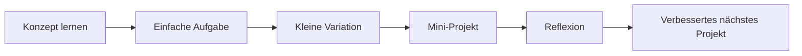
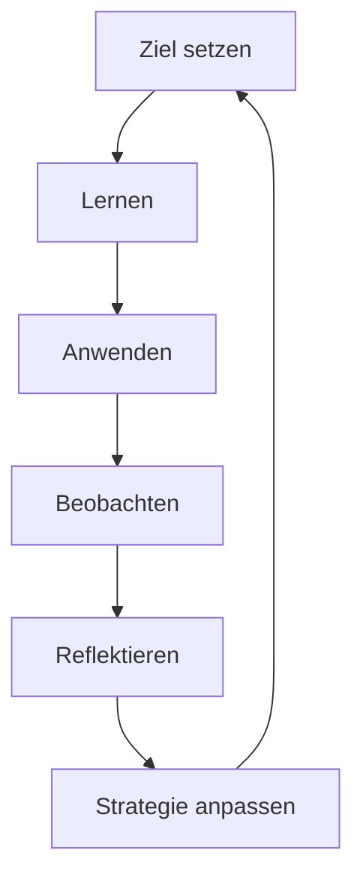

###### Themen

Lerntransfer in die Praxis

- Eigene Lernziele formulieren
- Gelerntes Wissen auf einfache reale Aufgaben anwenden
- Lerninhalte in kleinen Übungsprojekten umsetzen

Reflexion und Weiterentwicklung

- Eigene Erfahrungen mit Lernmethoden analysieren
- Individuelle Lernstrategien überprüfen und anpassen

   
# 🚀 Lerntransfer in die Praxis

Lerntransfer bedeutet: Du nimmst etwas, das du gelernt hast, und setzt es **außerhalb der Lernsituation** sinnvoll ein. Also nicht nur „Ich habe das verstanden“, sondern: **„Ich kann es benutzen.“** Genau dieser Schritt ist im technischen Lernen entscheidend. Gerade bei Core Tech Fundamentals bringt dir Wissen erst dann wirklich etwas, wenn du es auf echte Situationen übertragen kannst — zum Beispiel auf eine kleine Automatisierung, ein Skript, eine API-Anfrage, eine Dateistruktur, ein Git-Repository oder einen Fehler in einem Programm.

Aus der Lernforschung weiß man, dass Transfer besser gelingt, wenn Wissen nicht nur isoliert auswendig gelernt, sondern in **verschiedenen Kontexten verstanden und angewendet** wird ([How People Learn II: Learners, Contexts, and Cultures](https://nap.nationalacademies.org/catalog/24783/how-people-learn-ii-learners-contexts-and-cultures)). Genau darum geht es in den drei Punkten dieses Bereichs: gute Lernziele setzen, das Gelernte auf kleine reale Aufgaben übertragen und daraus kleine Projekte bauen.

   
## 🎯 Eigene Lernziele formulieren

Ein Lernziel ist nicht einfach nur ein Wunsch wie „Ich will besser in Python werden“ oder „Ich will endlich Netzwerke verstehen“. Das klingt zwar motivierend, ist aber für die Praxis zu ungenau. Ein gutes Lernziel beschreibt, **was du können willst, woran du erkennst, dass du es kannst, und in welchem Kontext du es anwenden willst**.

Das ist wichtig, weil unser Gehirn mit klaren Zielen viel besser arbeiten kann. Forschung zur Zielsetzung zeigt, dass **konkrete und anspruchsvolle Ziele** die Leistung oft stärker verbessern als vage Vorsätze wie „Ich gebe mir Mühe“ ([Building a Practically Useful Theory of Goal Setting and Task Motivation](https://doi.org/10.1037/0003-066X.57.9.705)).

Ein gutes Lernziel im technischen Bereich hat meistens vier Bestandteile:

1. **Thema oder Fähigkeit**  
   Was genau willst du lernen?
2. **sichtbares Ergebnis**  
   Woran sieht man, dass du es kannst?
3. **Anwendungskontext**  
   Wo oder wofür willst du es nutzen?
4. **Rahmen oder Zeitraum**  
   Bis wann oder in welchem Umfang?

Statt also zu sagen:

> „Ich lerne Git.“

ist es viel hilfreicher zu sagen:

> „Ich will Git so sicher verstehen, dass ich ein kleines Projekt initialisieren, Änderungen committen, Branches anlegen und einen Merge ohne Anleitung durchführen kann.“

Oder bei Programmierung:

> „Ich will Schleifen und Bedingungen so verstehen, dass ich ein kleines Skript schreiben kann, das Dateien prüft und je nach Dateityp unterschiedlich verarbeitet.“

So ein Ziel ist viel nützlicher, weil es direkt in Handlung übersetzt werden kann.

   
### 🧭 Woran du ein gutes Lernziel erkennst

Ein starkes Lernziel ist:

| Merkmal | Bedeutung | Schwaches Beispiel | Starkes Beispiel |
|---|---|---|---|
| konkret | Das Thema ist klar eingegrenzt | „Ich will Webentwicklung lernen“ | „Ich will verstehen, wie ein Browser eine HTTP-GET-Anfrage an eine API sendet und die Antwort verarbeitet“ |
| beobachtbar | Man kann prüfen, ob du es kannst | „Ich will Arrays verstehen“ | „Ich kann ein Array durchlaufen, filtern und die Ergebnisse ausgeben“ |
| praxisnah | Es ist an eine reale Tätigkeit gekoppelt | „Ich lerne SQL“ | „Ich kann mit SQL Datensätze filtern, sortieren und aggregieren“ |
| realistisch | Es passt zu deinem aktuellen Stand | „Ich baue in zwei Tagen eine komplette Cloud-Plattform“ | „Ich deploye eine kleine statische Website auf einen Hosting-Dienst“ |
| fokussiert | Es ist nicht zu breit | „Ich lerne Informatik“ | „Ich verstehe den Unterschied zwischen Stack und Heap auf Einsteigerniveau“ |

Der große Fehler vieler Lernender ist, Ziele nach Themen zu formulieren statt nach Fähigkeiten. Themen sind Überschriften. Fähigkeiten sind das, was du am Ende wirklich brauchst.

„TCP/IP lernen“ ist ein Thema.  
„Nachvollziehen können, warum ein Browser eine Adresse per DNS auflöst, dann eine Verbindung herstellt und erst danach Daten lädt“ ist eine Fähigkeit.

   
### 🛠️ Eine einfache Formel für gute Lernziele

Eine sehr brauchbare Formulierung ist:

> **Ich will [Thema] so gut verstehen, dass ich [konkrete Aufgabe] in [Kontext] selbstständig umsetzen oder erklären kann.**

Beispiele:

- „Ich will Variablen, Datentypen und Bedingungen so gut verstehen, dass ich ein kleines Eingabeprogramm mit Plausibilitätsprüfung schreiben kann.“
- „Ich will HTTP so gut verstehen, dass ich Request, Response, Statuscode und Header in einem einfachen API-Beispiel erklären kann.“
- „Ich will Git so gut verstehen, dass ich einen typischen Arbeitsablauf mit clone, branch, commit, merge und push sauber durchführen kann.“

Diese Art von Ziel ist deshalb stark, weil sie Lernen mit Können verbindet.

   
### 🧱 Warum Lernziele im Techniklernen so wichtig sind

In technischen Fächern entsteht schnell das Gefühl: „Ich habe das Tutorial gesehen, also kann ich es.“ Dieses Gefühl ist oft trügerisch. Man nennt das manchmal eine **Verstehensillusion**. Erst wenn du ein Ziel hast, das eine echte Handlung verlangt, merkst du, ob das Wissen schon tragfähig ist.

Wenn dein Ziel lautet:

> „Ich möchte REST verstehen“

dann kannst du lange Videos schauen und dich trotzdem unsicher fühlen.

Wenn dein Ziel aber lautet:

> „Ich will eine öffentliche API anfragen, JSON-Daten lesen und zwei Werte im Terminal ausgeben“

dann wird das Lernen plötzlich konkret. Du weißt, worauf du hinarbeitest, und kannst deinen Fortschritt realistisch einschätzen.

   
## 🧪 Gelerntes Wissen auf einfache reale Aufgaben anwenden

Das ist der entscheidende Schritt zwischen „lernen“ und „können“. Du solltest neues Wissen möglichst früh auf **kleine echte Aufgaben** anwenden. Nicht erst dann, wenn du „alles“ verstanden hast. Genau dieses frühe Anwenden macht Lernen stabil.

Die Lernforschung zeigt, dass Wissen besser verfügbar wird, wenn es aktiv abgerufen und in passenden Situationen genutzt wird, statt nur wiederholt gelesen zu werden ([Improving Students’ Learning With Effective Learning Techniques](https://journals.sagepub.com/doi/10.1177/1529100612453266)). Im technischen Bereich heißt das: nicht nur Notizen lesen, sondern etwas Kleines damit tun.

Wichtig ist dabei das Wort **einfach**. Reale Aufgaben müssen am Anfang nicht groß, beeindruckend oder produktionsreif sein. Es reicht, wenn sie echt genug sind, um einen praktischen Nutzen oder eine klare Funktion zu haben.

   
### 🔩 Was eine „einfache reale Aufgabe“ ist

Eine gute reale Aufgabe hat drei Merkmale:

- Sie kommt aus einem echten Nutzungskontext.
- Sie ist klein genug, um überschaubar zu bleiben.
- Sie verlangt, dass du Wissen **anwendest**, nicht nur wiederholst.

Beispiele aus Core Tech Fundamentals:

| Lerninhalt | Einfache reale Aufgabe | Warum das sinnvoll ist |
|---|---|---|
| Variablen, Bedingungen, Eingaben | Ein kleines Programm, das Alter oder Passwortlänge prüft | verbindet Logik mit echter Eingabeverarbeitung |
| Schleifen | Dateien in einem Ordner zählen oder Namen aus einer Liste verarbeiten | zeigt, warum Wiederholung praktisch ist |
| Funktionen | Ein Stück Code in wiederverwendbare Funktionen aufteilen | trainiert Struktur statt nur Syntax |
| HTTP und APIs | Eine öffentliche API aufrufen und einen Wert ausgeben | verbindet Netzwerkgrundlagen mit Programmierung |
| JSON | Antwortdaten lesen und bestimmte Felder extrahieren | macht Datenformate konkret |
| Git | Ein lokales Projekt initialisieren und Versionsstände speichern | zeigt echten Nutzen von Versionskontrolle |
| Dateisystem | Dateien erstellen, umbenennen, verschieben | stärkt den Bezug zur Betriebssystempraxis |
| Fehlerbehandlung | Auf falsche Eingaben reagieren | macht Software robuster und realistischer |

Diese Aufgaben sind deshalb so gut, weil sie nah an der Praxis sind, aber nicht gleich die volle Komplexität eines echten Produkts verlangen.

   
### 🌍 Warum reale Aufgaben stärker wirken als reine Theorie

Wenn du etwas nur theoretisch lernst, bleibt es oft an die ursprüngliche Lernsituation gebunden. Du kennst dann vielleicht den Begriff, aber nicht seine Verwendung. Reale Aufgaben zwingen dich dazu,

- Begriffe in Entscheidungen zu übersetzen,
- Wissen in Reihenfolgen umzusetzen,
- Fehler zu bemerken,
- Annahmen zu überprüfen,
- und Zusammenhänge praktisch zu erleben.

Ein Beispiel:  
Du kannst auswendig wissen, dass ein HTTP-Request aus Methode, URL, Headern und Body bestehen kann. Aber erst wenn du selbst eine API anfragst und eine 404- oder 401-Antwort siehst, verstehst du, warum Pfade, Authentifizierung oder Header in der Praxis wichtig sind.

Genau solche Verknüpfungen fördern Transfer, weil Wissen dann nicht mehr nur als Definition, sondern als **Werkzeug** abgespeichert wird ([How People Learn II: Learners, Contexts, and Cultures](https://nap.nationalacademies.org/catalog/24783/how-people-learn-ii-learners-contexts-and-cultures)).

   
### ⚖️ Der richtige Schwierigkeitsgrad

Eine reale Aufgabe darf dich fordern, aber nicht überrollen. Wenn sie zu leicht ist, lernst du wenig Neues. Wenn sie zu schwer ist, verbringst du deine Energie damit, Komplexität zu bekämpfen, statt den eigentlichen Lerninhalt zu festigen.

Für gutes Lernen ist der Bereich ideal, in dem du:

- die Grundidee verstanden hast,
- aber noch Entscheidungen selbst treffen musst,
- kleine Fehler machst,
- und den Lösungsweg nicht vollständig kopierst.

Gerade am Anfang ist **naher Transfer** wichtiger als sofortiger Sprung in komplexe Anwendung.  
Das bedeutet: Erst verwandte Aufgaben lösen, dann schrittweise weiter weg vom Beispiel gehen.

Beispiel:

1. Du lernst `if`-Bedingungen.
2. Dann baust du eine Eingabeprüfung.
3. Danach verknüpfst du Bedingungen mit Schleifen.
4. Später setzt du beides in ein kleines Menüprogramm um.

So entsteht aus einem kleinen Konzept nach und nach echte Handlungskompetenz.

   
## 🧩 Lerninhalte in kleinen Übungsprojekten umsetzen

Ein Übungsprojekt ist der nächste Schritt nach der einzelnen Aufgabe. Während eine Aufgabe oft nur einen klaren Punkt testet, verbindet ein kleines Projekt mehrere Bausteine miteinander. Dadurch merkst du, ob dein Wissen schon zusammenarbeitet.

Das ist im Techniklernen enorm wichtig. Viele Dinge wirken einzeln verständlich — Variablen, Funktionen, Dateien, Requests, Git — aber die eigentliche Kompetenz entsteht erst, wenn diese Teile in einem kleinen Ganzen zusammenspielen.

Ein gutes Übungsprojekt ist **klein, begrenzt und zielklar**. Es geht nicht darum, ein beeindruckendes Portfolio-Stück zu bauen. Es geht darum, einen Lerninhalt so umzusetzen, dass du seine praktische Struktur verstehst.

   
### 🧱 Was ein gutes kleines Übungsprojekt ausmacht

Ein sinnvolles Mini-Projekt hat meist:

- **ein Hauptziel**, nicht fünf gleichzeitig,
- **einen klaren Output**,
- **einen begrenzten Umfang**,
- **ein sichtbares Ende**,
- und **einen Bezug zu echtem Gebrauch**.

Beispiele:

| Thema | Mini-Projekt | Was du dabei wirklich lernst |
|---|---|---|
| Python-Grundlagen | Konsolenprogramm für eine Einkaufsliste | Variablen, Listen, Schleifen, Eingaben |
| Dateiverarbeitung | Log-Datei lesen und Fehlerzeilen filtern | Dateien, Strings, Bedingungen |
| Web-Grundlagen | Kleine HTML/CSS-Profilseite | Struktur, Styling, Dateiaufbau |
| JavaScript | To-do-Liste im Browser | DOM, Events, Zustand |
| APIs | Wetter- oder Länderdaten abrufen und anzeigen | HTTP, JSON, Fehlerbehandlung |
| Git | Lernnotizen versionieren und Änderungen dokumentieren | Commits, Historie, Branches |
| SQL | Kleine Datenbank mit Abfragen für Aufgaben oder Bücher | Tabellen, SELECT, WHERE, ORDER BY |

Hier geht es nicht darum, „die Welt zu bauen“, sondern einen klaren Lernkern umzusetzen.

   
### 🧭 Warum kleine Projekte besser sind als zu große Vorhaben

Viele Lernende machen denselben Fehler: Sie lernen gerade ein Grundkonzept und starten sofort ein riesiges Projekt. Das klingt motivierend, führt aber oft zu Frust. Dann kämpfst du nicht mehr mit dem Lerninhalt, sondern mit hundert Nebenproblemen gleichzeitig.

Ein kleines Projekt schützt dich davor, weil es den Fokus hält. Es zwingt dich, Prioritäten zu setzen:

- Was ist hier der eigentliche Lerngegenstand?
- Was ist nur Zusatz?
- Welche Teile sind für jetzt unnötig?

Wenn du zum Beispiel gerade Funktionen, Eingaben und Listen lernst, dann ist ein einfacher Konsolen-Task-Manager völlig ausreichend. Du brauchst dafür keine Benutzerverwaltung, keine Cloud-Synchronisation und kein Frontend. Das wäre nur Komplexität ohne zusätzlichen Lerngewinn.

   
### 🔄 Wie aus Lernen schrittweise Praxis wird

Diese Reihenfolge ist didaktisch stark, weil sie Überforderung vermeidet und trotzdem stetig mehr Selbstständigkeit verlangt.

Je öfter du so arbeitest, desto mehr passiert etwas Wichtiges: Du beginnst, neues Wissen nicht mehr als isolierte Kapitel zu sehen, sondern als kombinierbare Werkzeuge.

   
### 🧠 Woran du erkennst, dass ein Übungsprojekt seinen Zweck erfüllt

Ein Mini-Projekt war lernwirksam, wenn du danach nicht nur sagen kannst „Es funktioniert“, sondern auch:

- warum du bestimmte Bausteine gewählt hast,
- wo Probleme aufgetreten sind,
- was du beim zweiten Mal sauberer machen würdest,
- und welche Konzepte dabei wirklich verstanden wurden.

Dann war das Projekt nicht nur Beschäftigung, sondern ein echter Transfer-Schritt.

   
# 🔍 Reflexion und Weiterentwicklung

Lernen endet nicht mit dem Anwenden. Wer dauerhaft besser werden will, muss auch beobachten, **wie** er lernt. Genau das ist Reflexion. Du schaust nicht nur auf den Inhalt, sondern auf deinen eigenen Lernprozess.

In der Bildungsforschung spricht man hier oft von **Metakognition** und **selbstreguliertem Lernen**. Gemeint ist die Fähigkeit, das eigene Lernen zu planen, zu überwachen und anzupassen. Diese Fähigkeit hat nachweislich einen starken Einfluss auf Lernerfolg ([Metacognition and Self-regulated Learning](https://educationendowmentfoundation.org.uk/education-evidence/guidance-reports/metacognition)).

Gerade im technischen Lernen ist das besonders wichtig, weil man dort schnell viel Zeit in ineffektive Methoden investieren kann — etwa passives Konsumieren von Tutorials, zu frühes Copy-Paste oder das ständige Wiederlesen von Notizen ohne Abruf und Anwendung.

   
## 🪞 Eigene Erfahrungen mit Lernmethoden analysieren

Die entscheidende Frage ist nicht:  
**„Was habe ich gemacht?“**  
sondern:  
**„Was hat mir wirklich geholfen, etwas zu verstehen, zu behalten und anzuwenden?“**

Viele Lernmethoden fühlen sich gut an, sind aber nicht besonders wirksam. Wiederlesen und Markieren geben oft ein Gefühl von Vertrautheit, aber dieses Gefühl ist nicht dasselbe wie echtes Können. Forschung zu Lerntechniken zeigt, dass Methoden wie **aktives Abrufen** und **verteiltes Wiederholen** meist deutlich wirksamer sind als bloßes erneutes Lesen ([Improving Students’ Learning With Effective Learning Techniques](https://journals.sagepub.com/doi/10.1177/1529100612453266)).

Wenn du deine Lernmethoden analysierst, unterscheidest du idealerweise zwischen drei Ebenen:

1. **Aufwand**  
   Wie viel Zeit und Energie hat die Methode gekostet?
2. **subjektives Gefühl**  
   Hat sie sich klar, leicht oder motivierend angefühlt?
3. **echte Wirkung**  
   Konntest du danach erklären, erinnern und anwenden?

Gerade die dritte Ebene ist entscheidend.

   
### 🔬 Was du bei Lernmethoden wirklich beobachten solltest

Eine Lernmethode ist dann nützlich, wenn sie dir hilft, mindestens eines davon zu verbessern:

- **Verständnis**  
  Kannst du die Idee in eigenen Worten erklären?
- **Abrufbarkeit**  
  Fällt dir das Wissen später noch ein?
- **Anwendung**  
  Kannst du etwas Praktisches damit tun?
- **Fehlererkennung**  
  Merkst du schneller, wo dein Verständnis Lücken hat?
- **Transfer**  
  Kannst du das Gelernte in leicht veränderten Situationen nutzen?

Wenn du zum Beispiel ein Tutorial gesehen hast und dich danach sicher fühlst, aber ohne Vorlage nichts aufbauen kannst, war die Methode vielleicht angenehm, aber noch nicht stark genug. Wenn du dagegen nach dem Lernen eine kleine Aufgabe lösen konntest und dabei deine Lücken bemerkt hast, war das oft wesentlich wertvoller.

   
### ⚠️ Typische Fehleinschätzungen beim Lernen

Beim Analysieren eigener Lernmethoden tauchen oft dieselben Denkfehler auf:

| Fehleinschätzung | Warum sie problematisch ist |
|---|---|
| „Ich erkenne es wieder, also kann ich es.“ | Wiedererkennen ist viel leichter als freies Anwenden |
| „Das Video war verständlich, also habe ich es gelernt.“ | Verstehen beim Zuschauen ist nicht dasselbe wie eigenes Umsetzen |
| „Ich habe lange gelernt, also war es produktiv.“ | Zeitaufwand ist kein Beweis für Lernerfolg |
| „Wenn es schwer war, war es schlecht.“ | Gewisse Anstrengung ist oft ein Zeichen von aktivem Lernen |
| „Wenn es leicht war, war es effizient.“ | Leichtigkeit kann auch bloße Oberflächenvertrautheit sein |

Gerade technisches Lernen braucht also nicht nur Motivation, sondern auch ehrliche Beobachtung: Welche Methode produziert bei dir tatsächlich Können?

   
### 🧠 Analyse bedeutet nicht Selbstkritik, sondern Mustererkennung

Reflexion ist nicht dazu da, dich hart zu bewerten. Sie ist ein Werkzeug, um Muster zu erkennen. Vielleicht stellst du fest:

- Du verstehst Konzepte gut durch Lesen,  
  **aber** du vergisst sie schnell ohne Abruf.
- Du kannst Syntax aus Tutorials nachbauen,  
  **aber** freie Aufgaben fallen dir schwer.
- Du lernst motiviert mit Videos,  
  **aber** echte Sicherheit entsteht erst nach Mini-Projekten.

Solche Muster sind Gold wert. Denn dann weißt du, wo deine Lernmethode ergänzt werden muss.

   
## ⚙️ Individuelle Lernstrategien überprüfen und anpassen

Eine Lernstrategie ist mehr als eine einzelne Methode. Sie ist dein persönliches System:  
**Wie planst du Lernen, wie wiederholst du, wie testest du Verständnis, wie gehst du mit Fehlern um und wie bringst du Wissen in die Praxis?**

Dieses System sollte nicht starr sein. Gute Lernende passen es an, wenn sie merken, dass ein Teil davon nicht funktioniert. Genau das ist selbstreguliertes Lernen: planen, beobachten, bewerten und nachsteuern ([Metacognition and Self-regulated Learning](https://educationendowmentfoundation.org.uk/education-evidence/guidance-reports/metacognition)).

   
### 🔧 Wann eine Lernstrategie angepasst werden sollte

Du solltest deine Strategie überdenken, wenn solche Signale auftauchen:

- Du verstehst Inhalte während des Lernens, kannst sie später aber nicht mehr abrufen.
- Du kannst Theorie erklären, aber praktische Aufgaben nicht lösen.
- Du kommst nur mit Vorlage weiter.
- Du machst immer wieder dieselben Fehler.
- Du lernst viel, aber dein Gefühl von Sicherheit wächst kaum.
- Du verzettelst dich ständig in zu großen Projekten.

Dann liegt das Problem oft nicht an mangelnder Begabung, sondern an einer unpassenden Strategie.

   
### 🧩 Wie Anpassung konkret aussieht

Hier ist der wichtige Punkt: Strategieanpassung bedeutet nicht, alles komplett umzuwerfen. Meist reicht es, **gezielt ein fehlendes Element einzubauen**.

| Problem | Mögliche Anpassung |
|---|---|
| Du vergisst Inhalte schnell | Mehr verteilte Wiederholung statt einmaliger Intensiv-Sessions |
| Du verstehst passiv, aber kannst nicht frei arbeiten | Mehr Abruf ohne Unterlagen und kleine Anwendungsaufgaben |
| Du kennst einzelne Konzepte, aber keine Verbindung | Mehr Mini-Projekte mit 2–3 kombinierten Bausteinen |
| Du bist oft überfordert | Kleinere Lernziele und kleinere Projektumfänge |
| Du bleibst zu lange in Theorie hängen | Frühere Anwendung auf reale Mikro-Aufgaben |
| Du machst Fortschritte, bemerkst sie aber nicht | Sichtbare Kriterien für Lernziele definieren |

Das ist didaktisch sehr wichtig: Probleme im Lernen lassen sich oft nicht durch „mehr machen“, sondern durch **anders machen** lösen.

   
### 🔄 Ein sinnvoller Lernkreislauf

Dieser Kreislauf ist besonders stark, weil er verhindert, dass du monatelang mit einer ineffektiven Methode weiterarbeitest. Stattdessen lernst du adaptiv.

   
### 🧭 Beispiele für sinnvolle Strategieanpassungen im Techniklernen

Wenn du bei Core Tech Fundamentals lernst, können Anpassungen sehr konkret aussehen.

**Fall 1: Du schaust viele Tutorials, kannst aber nicht frei programmieren.**  
Dann fehlt dir vermutlich nicht noch mehr Erklärung, sondern mehr **aktive Anwendung**. Das bedeutet: weniger nur konsumieren, mehr selbst schreiben, selbst entscheiden, selbst debuggen.

**Fall 2: Du kannst Grundlagen erklären, aber keine realen Probleme lösen.**  
Dann brauchst du vermutlich mehr **Transferaufgaben**. Also Aufgaben, die nicht exakt wie das Lernbeispiel aussehen, aber dasselbe Grundprinzip verlangen.

**Fall 3: Du startest ständig große Projekte und brichst ab.**  
Dann ist deine Strategie vielleicht zu ambitioniert skaliert. Hier helfen kleinere Übungsprojekte mit nur einem Hauptziel.

**Fall 4: Du verstehst beim Lernen alles, vergisst es aber nach wenigen Tagen.**  
Dann fehlt wahrscheinlich strukturierte Wiederholung. Verteiltes Lernen ist dafür meist wirksamer als massiertes Wiederholen in einer einzigen langen Sitzung ([Improving Students’ Learning With Effective Learning Techniques](https://journals.sagepub.com/doi/10.1177/1529100612453266)).

   
### 🌱 Was „individuell“ hier wirklich bedeutet

Individuelle Lernstrategien bedeuten nicht, dass für jede Person völlig andere Naturgesetze gelten. Es gibt durchaus robuste Prinzipien des Lernens, etwa aktiven Abruf, Anwendung, Verteilung über die Zeit und Reflexion. Individuell wird es dort, wo du entscheidest,

- welche Form der Anwendung dir hilft,
- wie groß dein idealer Projektumfang ist,
- wie viel Anleitung du am Anfang brauchst,
- und an welcher Stelle du am häufigsten scheiterst.

Mit anderen Worten:  
Die Grundprinzipien sind oft allgemein, aber die **Umsetzung** muss zu deinem aktuellen Stand, deinem Fachgebiet und deiner Art zu arbeiten passen.

Gerade deshalb ist Reflexion so wertvoll. Sie hilft dir, allgemeine Lernprinzipien in ein persönliches, funktionierendes System zu übersetzen.