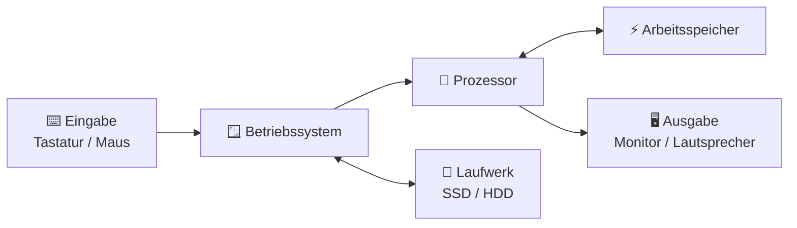

###### Themen

Computerhardware

- Komponenten eines Computers kennenlernen: Prozessor, Arbeitsspeicher, Laufwerke und Peripherie
- Grundlegende Funktionsweise eines Computers im Überblick

Betriebssystem-Oberfläche

- Zentrale Bedienelemente erkennen und nutzen: Desktop, Taskleiste und Startmenü
- Fensterverwaltung und grundlegende Navigation im Betriebssystem

Elementare Systemeinstellungen

- Uhrzeit, Sprache und Anzeigeoptionen anpassen
- An- und Abmeldung am System sowie Herunterfahren und Neustarten

   
# 🖥️ Computerhardware

Wenn du Computerhardware verstehen willst, hilft ein einfaches Bild: **Ein Computer funktioniert wie ein Team**. Jedes Teil hat eine bestimmte Aufgabe. Erst zusammen wird daraus ein nutzbares System.

   
## 🧩 Die wichtigsten Bestandteile eines Computers

Die vier Grundbereiche, die du genannt hast, sind besonders wichtig:

- **Prozessor**
- **Arbeitsspeicher**
- **Laufwerke**
- **Peripherie**

Diese Teile erfüllen unterschiedliche Rollen. Manche **rechnen**, manche **merken sich kurzfristig Daten**, manche **speichern dauerhaft**, und manche sind dafür da, dass du **Eingaben machen** oder **Ergebnisse sehen** kannst.

   
### 🧠 Der Prozessor (CPU)

Der **Prozessor** oder die **CPU** ist die Recheneinheit des Computers. Er verarbeitet Befehle, führt Berechnungen aus und steuert viele Abläufe. Deshalb wird er oft als das „Gehirn“ des Computers bezeichnet ([Central processing unit](https://www.britannica.com/technology/central-processing-unit)).

Einfach gesagt:  
Wenn du ein Programm öffnest, einen Text schreibst oder ein Video startest, dann bekommt der Prozessor ständig Aufgaben. Er entscheidet nicht „selbst“, was sinnvoll ist, aber er **arbeitet Befehle extrem schnell und in der richtigen Reihenfolge ab**.

Wichtige Punkte dazu:

- Der Prozessor arbeitet in sehr kleinen Rechenschritten.
- Er verarbeitet Daten, die ihm vom Betriebssystem und von Programmen gegeben werden.
- Je nach Modell hat er mehrere **Kerne**. Mehr Kerne bedeuten, dass mehrere Aufgaben besser gleichzeitig bearbeitet werden können.
- Die Geschwindigkeit wird oft mit **GHz** angegeben. Das ist aber nur ein Teil der Leistung. Auch Architektur, Cache und Kernanzahl spielen eine Rolle.

Ein alltagsnaher Vergleich:  
Der Prozessor ist wie ein **Koch in einer Küche**. Er bereitet die Gerichte zu. Aber damit er schnell arbeiten kann, müssen die Zutaten griffbereit liegen. Genau dafür braucht er den Arbeitsspeicher.

   
### ⚡ Der Arbeitsspeicher (RAM)

Der **Arbeitsspeicher**, meist **RAM** genannt, ist der kurzfristige Speicher des Computers. Dort liegen gerade benötigte Daten und Programme, damit der Prozessor schnell darauf zugreifen kann ([RAM](https://www.britannica.com/technology/RAM)).

Das ist ein sehr wichtiger Punkt:  
**RAM ist schnell, aber nicht dauerhaft.** Wenn der Computer ausgeschaltet wird, geht der Inhalt des Arbeitsspeichers verloren. Deshalb speichert man Dokumente nicht „im RAM“, sondern auf einem Laufwerk.

Warum ist RAM so wichtig?

Wenn du gleichzeitig

- einen Browser,
- ein Textprogramm,
- Musik
- und vielleicht noch einen Videoanruf

offen hast, dann müssen all diese aktiven Daten irgendwo schnell bereitliegen. Genau das macht der Arbeitsspeicher.

Ein anschauliches Bild:  
RAM ist wie die **Arbeitsfläche auf deinem Schreibtisch**. Was du gerade benutzt, liegt offen vor dir. Wenn der Schreibtisch zu klein ist, musst du ständig Dinge wegräumen und wieder holen. Dann wird alles langsamer.

   
### 💾 Die Laufwerke (dauerhafter Speicher)

**Laufwerke** sind die Bauteile, auf denen Daten **dauerhaft** gespeichert werden. Dort liegen zum Beispiel:

- das Betriebssystem
- Programme
- Dokumente
- Bilder
- Videos
- Downloads

Heute gibt es vor allem zwei wichtige Arten:

#### **SSD**
Eine **SSD** speichert Daten elektronisch und hat keine beweglichen Teile. Sie ist deutlich schneller als eine klassische Festplatte, leiser und oft robuster ([Solid-State-Drive](https://de.wikipedia.org/wiki/Solid-State-Drive)).

#### **HDD**
Eine **HDD** ist die klassische Festplatte. Sie speichert Daten auf rotierenden Magnetscheiben. Sie ist meist günstiger pro Gigabyte, aber langsamer und mechanisch empfindlicher ([Festplattenlaufwerk](https://de.wikipedia.org/wiki/Festplattenlaufwerk)).

Für den Alltag bedeutet das:

- Mit einer **SSD** startet Windows schneller.
- Programme öffnen sich schneller.
- Der Rechner fühlt sich insgesamt direkter und flüssiger an.

Der Unterschied zu RAM ist entscheidend:

- **RAM** = schnell, aber nur vorübergehend
- **Laufwerk** = dauerhaft, aber langsamer als RAM

Ein Vergleich hilft:  
Das Laufwerk ist wie ein **Aktenschrank oder Lagerraum**. Dort bleibt alles erhalten, auch wenn du Feierabend machst. Der RAM ist dagegen nur die aktuelle Arbeitsfläche.

   
### 🖨️ Die Peripherie (Ein- und Ausgabegeräte)

**Peripherie** sind Geräte, die mit dem Computer verbunden sind und die Ein- oder Ausgabe von Daten ermöglichen ([Peripheral device](https://www.britannica.com/technology/peripheral-device)).

Dazu gehören zum Beispiel:

- **Tastatur** – Texte und Befehle eingeben
- **Maus** – Zeigen, Klicken, Auswählen
- **Monitor** – Bildausgabe
- **Drucker** – Ausdrucke
- **Lautsprecher/Kopfhörer** – Tonausgabe
- **Mikrofon** – Spracheingabe
- **Webcam** – Bildaufnahme
- **USB-Stick** oder externe Festplatte – zusätzlicher Speicher

Peripheriegeräte sind also die Verbindung zwischen dir und dem Computer.  
Ohne sie könnte der Rechner zwar intern rechnen, aber du könntest kaum sinnvoll mit ihm arbeiten.

   
### 📋 Die Komponenten im direkten Vergleich

| Bestandteil | Hauptaufgabe | Speichert Daten? | Wie lange? | Einfaches Bild |
|---|---|---:|---|---|
| **Prozessor (CPU)** | Rechnen und Steuern | Nein, nicht als eigentlicher Speicher | – | Gehirn / Koch |
| **Arbeitsspeicher (RAM)** | Aktive Daten schnell bereithalten | Ja | Nur solange Strom da ist | Schreibtisch |
| **Laufwerk (SSD/HDD)** | Daten dauerhaft speichern | Ja | Auch ohne Strom | Aktenschrank |
| **Peripherie** | Ein- und Ausgabe ermöglichen | Teilweise, je nach Gerät | Unterschiedlich | Verbindung zur Außenwelt |

   
## 🔄 Die grundlegende Funktionsweise eines Computers im Überblick

Jetzt kommt der entscheidende Zusammenhang:  
Ein Computer funktioniert nicht dadurch, dass eine einzige Komponente alles macht. Stattdessen werden Aufgaben **in einer Kette** abgearbeitet.

Ganz vereinfacht läuft es so:

1. Du gibst etwas ein.  
   Zum Beispiel klickst du auf ein Programm.

2. Das Betriebssystem erkennt die Eingabe.  
   Es weiß, welches Programm geöffnet werden soll.

3. Das Programm wird vom Laufwerk geladen.  
   Die nötigen Daten kommen von SSD oder HDD.

4. Die Daten landen im Arbeitsspeicher.  
   Dort stehen sie schnell bereit.

5. Der Prozessor verarbeitet diese Daten.  
   Er führt die Programmbefehle aus.

6. Das Ergebnis wird ausgegeben.  
   Zum Beispiel erscheint ein Fenster auf dem Monitor.

Das ist die Grundidee hinter fast allem, was am Computer passiert.

   
### 🔌 Was beim Einschalten passiert

Wenn du den Computer einschaltest, passiert im Hintergrund schon einiges:

Zuerst wird die Hardware mit Strom versorgt. Dann startet eine grundlegende Firmware, meist **BIOS** oder **UEFI**. Diese prüft, ob die wichtigsten Geräte vorhanden sind, und startet den Bootvorgang. Danach wird das Betriebssystem vom Laufwerk geladen und in den Arbeitsspeicher gebracht. Erst dann erscheint die Anmeldeoberfläche oder der Desktop.

Wichtig ist dabei:  
Das Betriebssystem wird nicht „aus dem Nichts“ aktiv. Es muss **vom dauerhaften Speicher gelesen** und **im RAM bereitgestellt** werden, damit der Prozessor damit arbeiten kann.

   
### 🔁 Das Zusammenspiel der Teile

Hier siehst du das Zusammenspiel sehr vereinfacht:

Diese Grafik zeigt etwas sehr Wichtiges:

- **Du arbeitest nicht direkt mit der Hardware**, sondern meist über das Betriebssystem.
- Das **Betriebssystem organisiert** die Zusammenarbeit.
- Der **Prozessor rechnet**.
- Der **RAM hält aktuelle Daten bereit**.
- Das **Laufwerk speichert dauerhaft**.
- **Peripheriegeräte** bringen Daten hinein oder zeigen Ergebnisse an.

Genau deshalb kann ein Computer nur dann flüssig arbeiten, wenn diese Bauteile gut zusammenspielen.

   
# 🪟 Betriebssystem-Oberfläche

Die Hardware allein wäre für die meisten Menschen schwer zu bedienen. Deshalb gibt es ein **Betriebssystem**. Es ist die grundlegende Software, die Hardware verwaltet, Programme startet und eine Bedienoberfläche bereitstellt ([Operating system](https://www.britannica.com/technology/operating-system)).

Da du nach **Desktop**, **Taskleiste** und **Startmenü** fragst, erkläre ich diesen Teil am Beispiel von **Windows**.

   
## 🧭 Was ein Betriebssystem überhaupt macht

Ein Betriebssystem ist so etwas wie der **Organisator und Vermittler** des Computers.

Es übernimmt unter anderem diese Aufgaben:

- Es erkennt und verwaltet Hardware.
- Es startet Programme.
- Es verwaltet Dateien und Ordner.
- Es sorgt dafür, dass mehrere Programme gleichzeitig laufen können.
- Es zeigt dir eine Oberfläche, mit der du arbeiten kannst.

Ohne Betriebssystem müsstest du Hardware sehr direkt und technisch ansprechen. Für normale Nutzung wäre das unpraktisch. Das Betriebssystem macht aus den vielen technischen Einzelteilen eine **bedienbare Arbeitsumgebung**.

   
## 🖼️ Desktop, Taskleiste und Startmenü erkennen und nutzen

Diese drei Elemente sind das Zentrum der Bedienung in Windows. Wenn du sie verstehst, findest du dich im System schon sehr gut zurecht.

   
### 🖥️ Der Desktop (die Arbeitsoberfläche)

Der **Desktop** ist die große Fläche, die du nach der Anmeldung siehst. Man nennt ihn auch **Arbeitsoberfläche**.

Dort findest du häufig:

- den Hintergrund
- Verknüpfungen zu Programmen
- eventuell Dateien oder Ordner
- den Papierkorb

Der Desktop ist also gewissermaßen dein **Arbeitsraum**.  
Hier landen Fenster, hier kannst du Symbole anklicken, und von hier aus startest du oft Programme oder öffnest Dateien.

Wichtig zu verstehen ist:  
Ein Symbol auf dem Desktop ist oft **nicht das Programm selbst**, sondern nur eine **Verknüpfung**. Diese zeigt auf das eigentliche Programm oder auf eine Datei.

   
### 📌 Die Taskleiste

Die **Taskleiste** befindet sich bei Windows meistens unten am Bildschirm. Sie ist eines der wichtigsten Bedienelemente.

Typische Bestandteile sind:

- der **Startknopf**
- angeheftete Programme
- Symbole geöffneter Programme
- der Infobereich mit Netzwerk, Lautstärke, Akku
- Uhrzeit und Datum

Die Taskleiste ist besonders praktisch, weil du dort:

- Programme starten kannst
- zwischen geöffneten Fenstern wechseln kannst
- schnell sehen kannst, was gerade aktiv ist
- wichtige Systeminfos im Blick hast

Wenn ein Programm geöffnet ist, erscheint es in der Taskleiste. Du kannst also sehr schnell zwischen mehreren Anwendungen hin- und herspringen.

   
### 🚪 Das Startmenü

Das **Startmenü** öffnest du über den Startknopf in der Taskleiste oder über die Windows-Taste auf der Tastatur.

Dort findest du in der Regel:

- installierte Programme
- Suchfunktion
- Einstellungen
- Ein/Aus-Optionen
- manchmal zuletzt verwendete Dateien oder Empfehlungen

Das Startmenü ist sozusagen der **zentrale Eingang** zu Windows.  
Wenn du etwas suchst und nicht weißt, wo es liegt, ist das Startmenü oft der beste Startpunkt.

Ein guter Grundsatz ist:  
**Wenn du ein Programm, eine Einstellung oder eine Systemfunktion suchst, schau zuerst ins Startmenü oder nutze dort die Suche.**

   
### 🧾 Die Elemente im Überblick

| Element | Woran du es erkennst | Wofür du es nutzt |
|---|---|---|
| **Desktop** | Große Fläche mit Hintergrund und Symbolen | Arbeitsfläche, Dateien und Verknüpfungen |
| **Taskleiste** | Leiste meist am unteren Bildschirmrand | Programme starten, wechseln, Status sehen |
| **Startmenü** | Menü hinter dem Startknopf | Programme, Suche, Einstellungen, Herunterfahren |

   
## 🪟 Fensterverwaltung und grundlegende Navigation im Betriebssystem

Sobald du Programme öffnest, arbeitest du meist mit **Fenstern**. Diese Fenster zu verstehen ist einer der wichtigsten Grundschritte am Computer.

   
### 📐 Fenster steuern

Ein Fenster ist der sichtbare Bereich eines geöffneten Programms oder Ordners.

Oben rechts findest du meistens drei wichtige Schaltflächen:

- **Minimieren** – das Fenster verschwindet aus dem Sichtbereich, bleibt aber geöffnet
- **Maximieren** – das Fenster füllt fast den ganzen Bildschirm
- **Schließen** – das Fenster bzw. Programm wird beendet

Oft gibt es zusätzlich die Möglichkeit, ein Fenster:

- zu **verschieben**  
  indem du die Titelleiste anklickst und ziehst

- in der Größe zu **verändern**  
  indem du am Rand oder an der Ecke ziehst

- wieder zu **verkleinern** oder aus der Vollansicht zurückzuholen

Das klingt simpel, ist aber im Alltag extrem wichtig. Wenn du mehrere Dinge gleichzeitig machst, brauchst du diese Fenstersteuerung ständig.

   
### 🔄 Zwischen Fenstern wechseln

Wenn mehrere Programme geöffnet sind, musst du zwischen ihnen wechseln können.

Das geht typischerweise über:

- **Klick auf das Programmsymbol in der Taskleiste**
- **Alt + Tab** zum Wechseln zwischen geöffneten Fenstern
- direkte Auswahl des sichtbaren Fensters mit der Maus

Der Sinn dahinter:  
Ein Computer kann mehrere Programme gleichzeitig geöffnet haben, aber du arbeitest immer nur mit dem Fenster, das gerade **aktiv** ist. Das aktive Fenster liegt im Vordergrund.

   
### 🗂️ Grundlegende Navigation im System

Mit „Navigation“ ist gemeint, dass du dich im System bewegst und Dinge gezielt findest.

Dazu gehören:

- Programme öffnen
- Ordner öffnen
- Dateien finden
- durch Menüs und Einstellungen gehen
- zwischen Ansichten wechseln

Wichtige Grundhandlungen sind:

- **Einfachklick** – auswählen
- **Doppelklick** – öffnen
- **Rechtsklick** – Kontextmenü mit weiteren Aktionen
- **Scrollen** – in Listen, Webseiten oder Dokumenten nach oben und unten
- **Ziehen und Ablegen** – verschieben oder anordnen

Besonders wichtig ist dabei der **Datei-Explorer**. Er ist das Programm, mit dem du auf Ordner, Laufwerke und Dateien zugreifst. Wenn du also etwas „auf dem Computer suchst“, landest du sehr oft im Explorer.

Du kannst dir das so merken:  
Das Betriebssystem ist die ganze Umgebung. Der Explorer ist das Werkzeug, mit dem du dich durch deine gespeicherten Inhalte bewegst.

   
### 🧠 Warum Fensterverwaltung so wichtig ist

Viele Anfänger unterschätzen diesen Teil, aber hier entsteht ein Großteil der Sicherheit im Umgang mit Computern.

Wenn du verstanden hast,

- was geöffnet ist,
- was nur minimiert wurde,
- was aktiv ist,
- wie du zurück zum Desktop kommst,
- und wie du Programme gezielt schließt,

dann fühlst du dich am System nicht mehr „verloren“.

Genau deshalb gehört Fensterverwaltung zu den echten Grundfähigkeiten am Computer.

   
# ⚙️ Elementare Systemeinstellungen

Neben der normalen Bedienung solltest du auch einfache Grundeinstellungen anpassen können. Das sind keine Spezialfunktionen, sondern Dinge, die den Computer an **deine Sprache, deine Zeit und deinen Bildschirm** anpassen.

In Windows findest du viele davon in der App **Einstellungen**.

   
## 🕒 Uhrzeit, Sprache und Anzeigeoptionen anpassen

Diese drei Bereiche gehören zu den häufigsten Grundeinstellungen.

   
### 🕰️ Uhrzeit und Datum anpassen

Die richtige Uhrzeit ist wichtiger, als es auf den ersten Blick wirkt.

Sie beeinflusst zum Beispiel:

- Dateizeitstempel
- Kalender und Termine
- E-Mails
- manche Sicherheitsfunktionen
- korrekte Zeitzonenanzeige

Typische Einstellungen sind:

- **Uhrzeit automatisch setzen**
- **Zeitzone auswählen**
- **Datum und Uhrzeit manuell ändern**
- **Zeitformat anpassen**

Wenn die Uhrzeit falsch ist, kann das im Alltag zu Verwirrung führen, etwa bei Terminen oder bei Dateien, die plötzlich mit falschem Datum angezeigt werden.

   
### 🌍 Sprache und Tastatur anpassen

Hier muss man zwei Dinge unterscheiden:

1. **Anzeigesprache**  
   Das ist die Sprache, in der Menüs, Schaltflächen und Systemtexte erscheinen.

2. **Tastaturlayout**  
   Das bestimmt, welche Zeichen welche Taste erzeugt.

Das ist wichtig, weil Sprache und Tastatur nicht immer dasselbe sind.  
Du könntest zum Beispiel ein deutsches Windows nutzen, aber ein englisches Tastaturlayout eingestellt haben. Dann liegen Zeichen wie **Z** und **Y** anders, und Sonderzeichen erscheinen an ungewohnten Stellen.

Typische Anpassungen sind:

- Systemsprache ändern
- weitere Sprachen hinzufügen
- Tastaturlayout auswählen
- Eingabesprachen wechseln

Gerade bei gemeinsam genutzten Geräten oder internationalen Umgebungen ist das ein häufiger Punkt.

   
### 🖥️ Anzeigeoptionen anpassen

Die Anzeigeoptionen steuern, **wie Inhalte auf dem Bildschirm dargestellt werden**.

Dazu gehören zum Beispiel:

- **Auflösung**  
  Wie viele Bildpunkte angezeigt werden

- **Skalierung**  
  Wie groß Texte, Symbole und Fenster wirken

- **Helligkeit**  
  Besonders bei Laptops wichtig

- **Ausrichtung**  
  Quer- oder Hochformat

- **Mehrere Bildschirme**  
  Erweitern, duplizieren oder nur auf einem Bildschirm anzeigen

Die zwei wichtigsten Begriffe für Anfänger sind meist:

#### **Auflösung**
Eine höhere Auflösung bedeutet in der Regel ein schärferes Bild, aber Elemente können kleiner wirken.

#### **Skalierung**
Die Skalierung vergrößert oder verkleinert die Darstellung von Texten und Bedienelementen, ohne dass du die physische Bildschirmgröße änderst. Das ist besonders hilfreich bei hochauflösenden Displays.

Praktisch bedeutet das:  
Wenn dir alles **zu klein** vorkommt, ist oft nicht die Auflösung das Hauptproblem, sondern die **Skalierung**.

   
## 🔐 An- und Abmeldung am System sowie Herunterfahren und Neustarten

Diese Funktionen klingen einfach, werden aber oft durcheinandergebracht. Es lohnt sich, sie sauber zu unterscheiden.

   
### 👤 Anmeldung am System

Die **Anmeldung** bedeutet, dass du dich als Benutzer am Computer einloggst.

Dabei kann die Anmeldung zum Beispiel erfolgen über:

- Passwort
- PIN
- Fingerabdruck
- Gesichtserkennung
- in Firmennetzen auch über Benutzerkonto und Domäne

Was passiert dabei?

Nach der Anmeldung lädt das System dein **Benutzerprofil**. Dazu gehören zum Beispiel:

- dein Desktop
- deine persönlichen Einstellungen
- gespeicherte Konten
- deine Ordner
- deine Berechtigungen

Das bedeutet:  
Der Computer weiß nach der Anmeldung, **wer du bist** und **welche Umgebung für dich geladen werden soll**.

   
### 🚪 Abmeldung vom System

Die **Abmeldung** beendet deine Benutzersitzung, aber der Computer selbst bleibt eingeschaltet.

Das ist sinnvoll, wenn:

- ein anderer Benutzer den Rechner übernehmen soll
- du dein Konto sauber verlassen willst
- du an einem gemeinsam genutzten Gerät arbeitest

Wichtig ist:  
Beim Abmelden werden geöffnete Programme normalerweise geschlossen. Nicht gespeicherte Änderungen können verloren gehen. Deshalb sollte man vorher speichern.

   
### ⏻ Herunterfahren

**Herunterfahren** bedeutet, dass das Betriebssystem seine Arbeit beendet und der Computer ausgeschaltet wird.

Dabei sollten offene Programme zuerst geschlossen und Daten gespeichert werden. Danach wird das System beendet, und der Rechner geht aus.

Das Herunterfahren ist sinnvoll, wenn:

- du den Computer für längere Zeit nicht brauchst
- du ihn transportieren willst
- du Energie sparen möchtest
- du nach der Arbeit komplett schließen willst

Wichtig dabei:  
Der Arbeitsspeicher verliert beim Ausschalten seinen Inhalt. Alles, was nicht gespeichert wurde, ist dann weg. Genau deshalb ist Speichern vor dem Herunterfahren so wichtig.

   
### 🔄 Neustarten

**Neustarten** bedeutet: Der Computer wird nicht einfach nur ausgeschaltet, sondern fährt kontrolliert herunter und startet direkt wieder neu.

Das ist besonders sinnvoll:

- nach Software- oder Systemupdates
- nach Treiberinstallationen
- wenn sich das System „verschluckt“ hat
- wenn ein Programm oder ein Dienst nicht mehr sauber reagiert

Ein Neustart löst viele kleinere Probleme, weil Prozesse sauber beendet und neu geladen werden. Deshalb ist „Hast du schon neu gestartet?“ kein Witz, sondern oft tatsächlich ein sinnvoller erster Schritt.

   
### 📊 Die Unterschiede sauber voneinander trennen

| Aktion | Was passiert? | Bleibt der Computer an? | Typischer Zweck |
|---|---|---:|---|
| **Anmelden** | Deine Benutzersitzung wird gestartet | Ja | Mit deinem Konto arbeiten |
| **Abmelden** | Deine Benutzersitzung wird beendet | Ja | Benutzerwechsel, sauberes Verlassen |
| **Herunterfahren** | System wird beendet und Gerät ausgeschaltet | Nein | Arbeit beenden, Energie sparen |
| **Neustarten** | System beendet sich und startet direkt neu | Kurz nein, dann wieder ja | Updates, Fehlerbehebung |

   
### 🧭 Wo du diese Funktionen meist findest

In Windows erreichst du viele dieser Funktionen über das **Startmenü**:

- **Benutzersymbol** oder Kontobereich → An- oder Abmelden
- **Ein/Aus-Symbol** → Herunterfahren oder Neustarten

Zusätzlich findest du einige Optionen auch:

- auf dem Anmeldebildschirm
- über Tastenkombinationen
- per Rechtsklick auf den Startknopf
- in den Einstellungen

Die genaue Darstellung kann sich je nach Windows-Version leicht unterscheiden, aber die Grundidee bleibt gleich.

   
### 🛡️ Warum dieser Bereich im Alltag so wichtig ist

Gerade beim richtigen Lernen von Computergrundlagen ist das entscheidend:  
Man sollte nicht nur wissen, **wo** man klickt, sondern auch **was die Aktion technisch und praktisch bedeutet**.

Zum Beispiel:

Wenn du nur „Fenster schließen“ und „abmelden“ verwechselst, kann das zu Datenverlust oder Verwirrung führen. Wenn du „Herunterfahren“ und „Neustarten“ gleichsetzt, verstehst du nicht, warum manche Updates erst nach einem Neustart vollständig wirksam werden. Und wenn du nicht weißt, dass Sprache und Tastaturlayout getrennte Dinge sind, suchst du Fehler an der falschen Stelle.

Genau aus solchen Gründen gehören diese scheinbar einfachen Funktionen zu den echten **Fundamenten sicherer Computerbenutzung**.