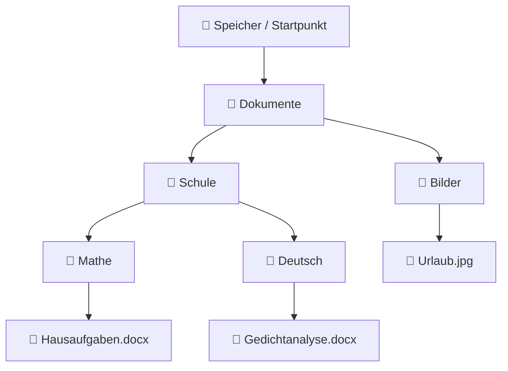

###### Themen

Dateisystem-Grundlagen

- Ordnerstruktur und Hierarchie verstehen
- Unterschied zwischen Dateien und Ordnern erkennen

Dateioperationen

- Dateien und Ordner erstellen, benennen und speichern
- Dateien und Ordner kopieren, verschieben und löschen

Arbeiten mit Anwendungen

- Einfache Dokumente öffnen, speichern und drucken
- Einfache Berechnungen mit dem Taschenrechner durchführen

   
# 🗂️ Dateisystem-Grundlagen

Wenn du mit einem Computer arbeitest, arbeitest du fast immer mit einem **Dateisystem**. Das Dateisystem ist vereinfacht gesagt das Ordnungssystem, mit dem ein Betriebssystem Dateien und Ordner auf einem Speichermedium verwaltet. Es sorgt also dafür, dass Daten nicht einfach „irgendwo“ liegen, sondern an festen Orten gespeichert, wiedergefunden, umbenannt, kopiert oder gelöscht werden können. Genau das ist die Grundlage für fast alles, was du am Computer tust – egal ob du ein Dokument speicherst, ein Bild öffnest oder eine Präsentation druckst. Moderne Betriebssysteme organisieren Dateien in einer hierarchischen Struktur aus Ordnern und Unterordnern ([File Systems](https://learn.microsoft.com/en-us/windows/win32/fileio/file-systems)).

   
## 🌳 Ordnerstruktur und Hierarchie verstehen

Am einfachsten kannst du dir die Ordnerstruktur wie einen **Baum** oder wie ein **Regalsystem** vorstellen.

Ganz oben gibt es einen Ausgangspunkt. Von dort aus führen Wege in verschiedene Ordner. In diesen Ordnern können weitere Unterordner liegen. Und in diesen Unterordnern wiederum Dateien. Genau das meint man mit **Hierarchie**: Es gibt übergeordnete und untergeordnete Ebenen.

Ein typisches Beispiel wäre:

- Ein Hauptordner namens `Schule`
- darin ein Unterordner `Mathe`
- darin eine Datei `Hausaufgaben.docx`

Die Datei liegt also **nicht einfach direkt auf dem Computer**, sondern an einem bestimmten Platz innerhalb einer Struktur.

Ein Ordner kann andere Ordner enthalten, und dadurch entsteht eine Art verschachteltes Ordnungssystem. Das ist hilfreich, weil du deine Daten thematisch sortieren kannst, statt alles in einen einzigen großen Sammelordner zu werfen. Genau dieses Prinzip beschreiben grundlegende Einführungen in die Computerbedienung: Dateien werden in Ordnern gespeichert, und Ordner können weitere Unterordner enthalten ([Understanding Files, Folders, and Drives](https://edu.gcfglobal.org/en/computerbasics/understanding-files-folders-and-drives/1/)).

Ein wichtiger Gedanke dabei ist: **Der Speicherort ist Teil der Information.** Zwei Dateien können denselben Namen haben, solange sie in unterschiedlichen Ordnern liegen. Zum Beispiel:

- `Dokumente/Deutsch/Notizen.txt`
- `Dokumente/Geschichte/Notizen.txt`

Beide heißen `Notizen.txt`, aber sie liegen an verschiedenen Orten.

Damit du diese Hierarchie besser siehst, hilft diese einfache Visualisierung:

In so einer Struktur gilt:

- **oben** = allgemeiner
- **weiter unten** = genauer
- **Dateien** liegen meist am Ende eines Zweigs
- **Ordner** dienen als Behälter und Ordnungsebenen

Sehr wichtig ist außerdem der Begriff **Pfad**. Ein Pfad beschreibt, **wo genau** sich eine Datei oder ein Ordner befindet. Ein Pfad ist also eine Art Wegbeschreibung im Dateisystem. Unter Windows sehen Pfade oft etwa so aus:

`C:\Benutzer\Anna\Dokumente\Schule\Mathe\Hausaufgaben.docx`

Unter macOS oder Linux eher so:

`/Users/Anna/Documents/Schule/Mathe/Hausaufgaben.docx`

Auch wenn die Schreibweise unterschiedlich ist, ist die Idee immer dieselbe: Ein Pfad zeigt die Hierarchie vom Ausgangspunkt bis zur konkreten Datei. Die Regeln für Dateinamen und Pfade sind betriebssystemabhängig; unter Windows sind zum Beispiel bestimmte Zeichen wie `\ / : * ? " < > |` in Dateinamen nicht erlaubt ([Naming Files, Paths, and Namespaces](https://learn.microsoft.com/en-us/windows/win32/fileio/naming-a-file)).

   
### 📍 Warum eine gute Ordnerstruktur so wichtig ist

Viele Anfänger unterschätzen das. Aber eine gute Struktur spart dir später unglaublich viel Zeit.

Wenn du Dateien logisch ablegst, dann:

- findest du sie schneller wieder,
- vermeidest du Verwechslungen,
- arbeitest du sauberer,
- und reduzierst das Risiko, etwas versehentlich doppelt oder an der falschen Stelle zu speichern.

Statt alles direkt auf dem Desktop abzulegen, ist es meistens sinnvoller, Themen oder Projekte in klar benannten Ordnern zu sammeln. Zum Beispiel:

- `Schule`
- `Privat`
- `Bewerbung`
- `Fotos`
- `Rechnungen`

Innerhalb dieser Ordner kannst du weiter unterteilen, etwa nach Jahr, Fach oder Projekt.

   
### 🧭 Eine hilfreiche Denkweise für Anfänger

Wenn du nicht sicher bist, wo eine Datei liegt, stell dir immer diese drei Fragen:

1. **In welchem Hauptbereich suche ich?**  
   Zum Beispiel: Dokumente, Downloads, Bilder.

2. **In welchem Ordner könnte sie thematisch liegen?**  
   Zum Beispiel: Schule, Arbeit, Privat.

3. **Wie könnte die Datei heißen?**  
   Zum Beispiel: `Referat.docx`, `Notizen.pdf`, `Rechnung_Mai.pdf`.

So trainierst du, den Computer nicht als „magische Kiste“, sondern als geordnetes System zu verstehen. Genau dieses Verständnis ist ein Kernbereich von digitalen Grundlagen.

   
## 📄 Unterschied zwischen Dateien und Ordnern erkennen

Eine **Datei** ist ein einzelnes gespeichertes Objekt mit Inhalt. Das kann zum Beispiel ein Textdokument, ein Bild, ein Video, eine Tabelle, eine Musikdatei oder ein PDF sein. Eine Datei enthält also die eigentlichen Daten. Eine **Directory** bzw. ein **Ordner** dagegen ist ein Container, der Dateien und oft auch weitere Ordner enthält ([Computer file](https://en.wikipedia.org/wiki/Computer_file), [Directory (computing)](https://en.wikipedia.org/wiki/Directory_(computing))).

Einfach gesagt:

- **Datei = Inhalt**
- **Ordner = Behälter für Inhalte**

Das ist der wichtigste Unterschied.

Wenn du ein Foto speicherst, ist das Foto eine Datei.  
Wenn du einen Ordner `Urlaub 2025` anlegst und alle Urlaubsfotos dort hineinlegst, dann ist `Urlaub 2025` der Ordner und die einzelnen Fotos sind Dateien.

Hier siehst du den Unterschied übersichtlich:

| Merkmal | Datei | Ordner |
|---|---|---|
| Zweck | Speichert Inhalt | Ordnet Inhalte |
| Kann Text/Bild/Audio enthalten | Ja | Nein, nur indirekt über enthaltene Dateien |
| Kann andere Elemente enthalten | Nein | Ja |
| Hat oft eine Dateiendung | Ja | Normalerweise nein |
| Beispiel | `Brief.docx`, `Foto.jpg`, `Musik.mp3` | `Dokumente`, `Bilder`, `Rechnungen` |

Ein sehr nützliches Erkennungsmerkmal bei Dateien ist die **Dateiendung**. Das ist der Teil hinter dem Punkt im Dateinamen, zum Beispiel:

- `.docx` = Word-Dokument
- `.pdf` = PDF-Datei
- `.jpg` = Bild
- `.txt` = Textdatei
- `.xlsx` = Excel-Datei

Die Dateiendung hilft dem Betriebssystem und den Anwendungen zu erkennen, **welcher Dateityp** vorliegt und womit er geöffnet werden kann. Wenn du also eine Datei namens `Lebenslauf.pdf` siehst, weißt du sofort: Das ist kein Ordner, sondern ein PDF-Dokument.

Ordner haben meistens **keine** solche Endung. Sie erscheinen stattdessen mit einem Ordnersymbol und einem Namen wie `Projekte`, `Schule` oder `Fotos`.

Ein häufiger Anfängerfehler ist, Datei und Ordner zu verwechseln, weil beide als Symbole angezeigt werden. Darum lohnt sich diese Grundregel:

> Eine Datei ist meist das eigentliche Arbeitsobjekt.  
> Ein Ordner ist die Umgebung, in der solche Arbeitsobjekte gesammelt und sortiert werden.

   
### 🔍 Woran du Dateien und Ordner in der Praxis erkennst

In Dateiverwaltungen wie dem Windows-Explorer oder dem Finder auf dem Mac gibt es mehrere Hinweise:

- **Symbol**: Ordner haben meist ein Ordnersymbol, Dateien je nach Typ ein anderes Symbol.
- **Name**: Dateien haben oft eine Endung, Ordner meist nicht.
- **Öffnungsverhalten**:  
  - Ein Ordner zeigt beim Öffnen seinen Inhalt.  
  - Eine Datei wird meist in einer passenden Anwendung geöffnet.
- **Größe**: Dateien haben meist direkt eine klar erkennbare Dateigröße. Ordner eher nicht oder nur als zusammengefassten Wert.

Wenn du einen Ordner öffnest und darin weitere Elemente siehst, dann ist das der sichere Hinweis: Es handelt sich um eine Organisationsstruktur, nicht um den eigentlichen Inhalt selbst.

   
# 🛠️ Dateioperationen

Sobald du verstehst, was Dateien und Ordner sind und wie sie angeordnet sind, kommt der nächste Schritt: **Du musst mit ihnen arbeiten können.** Zu den wichtigsten Dateioperationen gehören:

- erstellen
- benennen
- speichern
- kopieren
- verschieben
- löschen

Diese sechs Dinge sind absolute Grundlagen. Wer sie sicher beherrscht, kann sich in fast jeder Anwendung und auf fast jedem Betriebssystem orientieren.

   
## ✏️ Dateien und Ordner erstellen, benennen und speichern

Beginnen wir mit dem Erstellen.

Einen **Ordner erstellen** bedeutet, an einem bestimmten Ort einen neuen Behälter für Inhalte anzulegen. Das machst du meistens per Rechtsklick und dann über einen Menüpunkt wie **„Neuer Ordner“** oder **„Neu“ > „Ordner“**. Auf dem Mac oder in Linux-Oberflächen gibt es sehr ähnliche Funktionen. Das Ziel ist immer gleich: Du legst einen neuen Ort an, in dem du Inhalte organisiert ablegen kannst.

Eine **Datei erstellen** passiert oft über eine Anwendung. Wenn du zum Beispiel ein Textprogramm öffnest und etwas schreibst, dann existiert der Inhalt zunächst nur im Arbeitsbereich der Anwendung. Erst wenn du speicherst, wird daraus eine echte Datei auf dem Speichermedium.

Das ist ein ganz wichtiger Unterschied:

- **erstellen** = etwas anlegen
- **speichern** = den aktuellen Stand dauerhaft auf dem Gerät sichern

Solange du nicht speicherst, können deine Änderungen verloren gehen, zum Beispiel wenn das Programm abstürzt oder geschlossen wird.

Beim **Benennen** solltest du möglichst klare und verständliche Namen verwenden. Gute Dateinamen helfen dir später enorm beim Wiederfinden. Statt `Dokument1.docx` ist zum Beispiel `Bewerbung_Mueller_2026.docx` viel hilfreicher.

Gute Namen sind:

- eindeutig,
- kurz, aber aussagekräftig,
- logisch aufgebaut,
- und möglichst ohne unnötige Sonderzeichen.

Besonders praktisch ist oft ein Namensschema wie:

- `Thema_Datum`
- `Projekt_Version`
- `Fach_Inhalt_Jahr`

Zum Beispiel:

- `Mathe_Formelsammlung_2026.pdf`
- `Rechnung_2026-03.pdf`
- `Praktikum_Bericht_V2.docx`

Unter Windows sind bestimmte Zeichen in Dateinamen nicht erlaubt, etwa `\ / : * ? " < > |` ([Naming Files, Paths, and Namespaces](https://learn.microsoft.com/en-us/windows/win32/fileio/naming-a-file)). Auch wenn andere Systeme teilweise mehr erlauben, ist es in der Praxis sinnvoll, Dateinamen möglichst schlicht zu halten. Dann vermeidest du Kompatibilitätsprobleme.

Beim **Speichern** entscheidest du oft drei Dinge gleichzeitig:

1. **Wo** die Datei gespeichert wird  
2. **Wie** sie heißen soll  
3. **In welchem Format** sie gespeichert wird

Gerade dieser erste Punkt ist enorm wichtig. Viele Anfänger klicken beim Speichern einfach schnell auf „OK“ oder „Speichern“, ohne zu beachten, *wo* die Datei landet. Dann ist die Datei zwar da, aber später „verschwunden“, weil sie an einem unerwarteten Ort liegt.

Darum gilt beim Speichern immer:

- erst Speicherort prüfen,
- dann Dateinamen prüfen,
- dann Format prüfen,
- erst danach speichern.

Wenn du eine Datei später erneut speicherst, wird oft einfach die bestehende Version überschrieben. Wenn du dagegen eine neue Version behalten willst, nutzt du **„Speichern unter“**. Damit erstellst du bewusst eine neue Datei mit anderem Namen, Format oder Speicherort.

   
### 🧱 Typischer Ablauf: Eine Datei sauber anlegen

Ein sinnvoller Arbeitsablauf sieht oft so aus:

1. Zuerst einen passenden Ordner wählen oder erstellen  
   Zum Beispiel: `Dokumente > Schule > Biologie`

2. Dann die Anwendung öffnen  
   Zum Beispiel ein Textprogramm

3. Inhalt erstellen  
   Etwa einen kurzen Bericht schreiben

4. Frühzeitig speichern  
   Nicht erst ganz am Ende

5. Einen klaren Dateinamen vergeben  
   Zum Beispiel: `Referat_Zelle.docx`

So gewöhnst du dir von Anfang an ein sauberes digitales Arbeiten an.

   
### 🗃️ Datei und Ordner: Erstellen im Vergleich

| Vorgang | Datei | Ordner |
|---|---|---|
| Wie entsteht er? | Meist über eine Anwendung | Meist direkt im Dateimanager |
| Inhalt | Eigentliche Daten | Enthält Dateien und Unterordner |
| Benennung | Mit Dateiname, oft plus Endung | Mit Ordnername |
| Speicherort wichtig? | Ja | Ja |
| Typischer Fehler | Falsch gespeichert oder schlecht benannt | Am falschen Ort angelegt |

Der Kernpunkt ist: Eine Datei ist meist das Ergebnis deiner Arbeit, ein Ordner die Struktur dafür.

   
## 📦 Dateien und Ordner kopieren, verschieben und löschen

Diese drei Operationen klingen ähnlich, bedeuten aber etwas Unterschiedliches. Genau hier passieren in der Praxis die meisten Missverständnisse.

### Kopieren

**Kopieren** bedeutet: Du erzeugst eine **zusätzliche** Version an einem anderen Ort. Das Original bleibt bestehen.

Wenn du also eine Datei aus `Dokumente` nach `USB-Stick` kopierst, dann gibt es sie danach an **zwei Orten**:

- im ursprünglichen Ordner
- und auf dem USB-Stick

Kopieren ist ideal, wenn du eine Sicherung brauchst oder dieselbe Datei an mehreren Orten verfügbar sein soll. Beim Kopieren bleibt das Original erhalten; beim Verschieben wird es an den neuen Ort verlagert ([Managing Files and Folders](https://edu.gcfglobal.org/en/computerbasics/managing-files-and-folders/1/)).

### Verschieben

**Verschieben** bedeutet: Die Datei oder der Ordner wird **an einen neuen Ort verlagert**. Danach liegt sie nicht mehr am alten Ort, sondern nur noch am neuen.

Das ist eher so, als würdest du einen Ordner physisch aus einem Regal nehmen und in ein anderes Regal stellen. Er wird nicht dupliziert, sondern umgesetzt.

### Löschen

**Löschen** bedeutet: Du entfernst eine Datei oder einen Ordner aus ihrem bisherigen Speicherort. Auf vielen Systemen landet das Gelöschte zunächst im Papierkorb oder Papierkorb-ähnlichen Bereich und ist oft noch wiederherstellbar. In anderen Fällen – etwa bei bestimmten Tastenkombinationen, Netzlaufwerken oder externen Speichern – kann das Löschen direkter und endgültiger sein. Deshalb sollte man beim Löschen immer bewusst handeln.

Hier ist der Unterschied sehr klar:

| Aktion | Was passiert mit dem Original? | Ergebnis |
|---|---|---|
| Kopieren | Bleibt erhalten | Es gibt zusätzlich eine Kopie |
| Verschieben | Wechselt den Ort | Es gibt danach nur den neuen Speicherort |
| Löschen | Wird entfernt | Datei/Ordner ist nicht mehr normal verfügbar |

Ein typischer Anfängerfehler ist, **Kopieren und Verschieben zu verwechseln**. Deshalb lohnt sich diese einfache Merkhilfe:

- **Kopieren = verdoppeln**
- **Verschieben = verlagern**
- **Löschen = entfernen**

   
### 🖱️ Wie diese Aktionen praktisch ausgeführt werden

In den meisten grafischen Oberflächen gibt es mehrere Wege:

- per **Rechtsklick-Menü**
- mit **Tastenkombinationen**
- durch **Ziehen mit der Maus**
- über Schaltflächen im Menüband oder in der Symbolleiste

Die bekanntesten Tastenkombinationen sind:

- **Strg + C** = kopieren
- **Strg + X** = ausschneiden / zum Verschieben vorbereiten
- **Strg + V** = einfügen
- **Entf** = löschen

Auf dem Mac wird statt `Strg` häufig die `Cmd`-Taste verwendet.

Das Wichtige ist nicht nur, welche Taste du drückst, sondern dass du verstehst, **was logisch passiert**:

- Bei **Kopieren + Einfügen** entsteht eine zweite Version.
- Bei **Ausschneiden + Einfügen** wird dasselbe Objekt an einen anderen Ort gesetzt.
- Beim **Löschen** entfernst du es aus der aktuellen Struktur.

Wenn du per Maus ziehst, hängt das genaue Verhalten manchmal davon ab, **wohin** du ziehst – etwa innerhalb desselben Laufwerks oder auf ein anderes Gerät. Darum ist für Anfänger das Arbeiten über Rechtsklick oder bekannte Tastenkombinationen oft klarer, weil die Absicht eindeutiger ist.

   
### ♻️ Was du über Löschen wirklich verstehen solltest

Löschen heißt nicht immer sofort „für immer weg“. Oft gibt es einen Zwischenschritt:

1. Datei wird gelöscht
2. Sie landet im Papierkorb
3. Dort kann sie bei Bedarf wiederhergestellt werden
4. Erst beim endgültigen Leeren ist sie normal nicht mehr direkt zugänglich

Das ist praktisch, weil man versehentlich gelöschte Dateien oft retten kann.

Aber Achtung: Wenn du einen Ordner löschst, werden in der Regel auch die darin enthaltenen Dateien und Unterordner mit entfernt. Deshalb solltest du vor dem Löschen eines Ordners kurz prüfen, was darin liegt.

Ein guter Grundsatz ist:

> Nie aus Gewohnheit löschen.  
> Immer zuerst lesen, *was* markiert ist.

   
### 🧠 Typische Denkfehler bei Dateioperationen

Einige Missverständnisse tauchen immer wieder auf:

**„Ich habe die Datei verschoben, aber sie ist weg.“**  
Oft ist sie nicht weg, sondern nur an einem anderen Ort.

**„Ich habe sie kopiert, warum ist jetzt alles doppelt?“**  
Weil Kopieren absichtlich eine zweite Version erzeugt.

**„Ich habe den Ordner gelöscht, aber nur die eine Datei sollte weg.“**  
Dann wurde der Behälter statt des Inhalts entfernt.

**„Ich finde mein Dokument nicht mehr.“**  
Oft wurde es entweder falsch gespeichert oder verschoben.

Diese Fehler sind normal. Entscheidend ist, dass du den inneren Mechanismus verstehst. Dann wirken Dateioperationen nicht mehr zufällig, sondern logisch.

   
# 💻 Arbeiten mit Anwendungen

Dateisystem-Grundlagen und Dateioperationen sind die Basis. Jetzt kommt der nächste Schritt: **mit Anwendungen sinnvoll arbeiten**.

Eine Anwendung ist ein Programm, mit dem du bestimmte Aufgaben ausführst, zum Beispiel:

- Texte schreiben
- PDFs lesen
- Bilder ansehen
- rechnen
- drucken

Wichtig ist dabei: Anwendungen und Dateien sind nicht dasselbe.

Die Anwendung ist das Werkzeug.  
Die Datei ist meist das Arbeitsprodukt.

Ein Textprogramm öffnet also zum Beispiel eine Textdatei. Der Taschenrechner führt Berechnungen aus, erzeugt aber in vielen Fällen gar keine klassische Datei.

   
## 📝 Einfache Dokumente öffnen, speichern und drucken

Wenn du mit Dokumenten arbeitest, läuft der Prozess fast immer in drei Schritten ab:

1. **öffnen**
2. **bearbeiten oder ansehen**
3. **speichern oder drucken**

### Dokumente öffnen

Ein Dokument zu öffnen bedeutet, dass eine passende Anwendung die Datei lädt und anzeigt. Wenn du doppelt auf eine Datei klickst, versucht das Betriebssystem normalerweise automatisch, die passende Anwendung zu starten.

Ein paar typische Beispiele:

- `.docx` → Textverarbeitung
- `.pdf` → PDF-Programm oder Browser
- `.txt` → einfacher Texteditor
- `.jpg` → Bildanzeige

Wenn das richtige Programm nicht automatisch startet, kannst du oft **„Öffnen mit …“** wählen und die passende Anwendung selbst festlegen.

Wichtig ist: Beim Öffnen veränderst du die Datei noch nicht automatisch. Erst wenn du Inhalt bearbeitest und danach speicherst, wird die Datei tatsächlich geändert.

### Dokumente speichern

Sobald du ein Dokument bearbeitest, solltest du früh speichern. Das ist eine der wichtigsten Gewohnheiten überhaupt. Speichern bedeutet, dass der aktuelle Stand dauerhaft auf das Speichermedium geschrieben wird.

Hier musst du zwei Fälle unterscheiden:

**Normales Speichern**  
Du aktualisierst dieselbe Datei.

**Speichern unter**  
Du legst eine neue Datei an, zum Beispiel mit anderem Namen, anderem Format oder an anderem Ort.

Das ist besonders nützlich, wenn du:

- eine Vorlage nicht überschreiben willst,
- verschiedene Versionen behalten möchtest,
- ein Dokument zusätzlich als PDF speichern willst.

Ein klassisches Beispiel:

Du schreibst einen Brief in einem Textprogramm.  
Dann speicherst du zunächst als `Brief_Entwurf.docx`.  
Später möchtest du die endgültige Fassung verschicken und speicherst zusätzlich als `Brief_final.pdf`.

So bleiben beide Varianten erhalten.

### Dokumente drucken

Beim Drucken wird der Dokumentinhalt an einen Drucker gesendet. In fast allen Anwendungen geht das über:

- **Datei > Drucken**
- oder die Tastenkombination **Strg + P**  
  auf dem Mac meist **Cmd + P**

Vor dem eigentlichen Druck erscheint normalerweise ein Druckdialog. Dort kannst du wichtige Einstellungen prüfen:

- Welcher Drucker verwendet wird
- Wie viele Seiten gedruckt werden
- Ob nur eine Auswahl oder das ganze Dokument gedruckt wird
- Ob in Farbe oder Schwarzweiß gedruckt wird
- Ob Hoch- oder Querformat verwendet wird
- Wie viele Kopien gedruckt werden

Gerade Anfänger klicken oft zu schnell auf „Drucken“, ohne diese Einstellungen zu prüfen. Dann wird vielleicht die falsche Seitenzahl, der falsche Drucker oder das falsche Format verwendet.

Ein guter, ruhiger Ablauf sieht so aus:

1. Dokument öffnen
2. Inhalt kontrollieren
3. Speichern, falls noch Änderungen nötig waren
4. Druckdialog öffnen
5. Druckeinstellungen prüfen
6. Erst dann drucken

Das spart Papier, Zeit und Nerven.

   
### 📂 Häufige Situationen beim Öffnen und Speichern

Es gibt einige Alltagssituationen, die du sicher erkennen solltest.

**Fall 1: Du öffnest eine bestehende Datei und änderst sie.**  
Dann speicherst du normalerweise dieselbe Datei erneut.

**Fall 2: Du willst das Original behalten.**  
Dann nutzt du **„Speichern unter“** und vergibst einen neuen Namen.

**Fall 3: Du findest dein Dokument nicht.**  
Dann liegt das Problem oft nicht in der Anwendung, sondern im Speicherort. Du musst also im Dateisystem suchen, nicht im Programm.

**Fall 4: Die Datei lässt sich nicht öffnen.**  
Dann passt möglicherweise das Dateiformat nicht zur Anwendung oder die Datei ist beschädigt.

Diese Unterscheidung ist wichtig, weil Anfänger oft glauben, eine Datei „lebt“ nur in der Anwendung. In Wirklichkeit liegt sie an einem Ort im Dateisystem und wird von der Anwendung nur benutzt.

   
### 🖨️ Druckbegriffe, die du kennen solltest

| Begriff | Bedeutung |
|---|---|
| Drucker | Das Gerät, das den Ausdruck erstellt |
| Druckdialog | Fenster mit Druckeinstellungen |
| Seitenbereich | Welche Seiten gedruckt werden sollen |
| Kopien | Wie oft das Dokument gedruckt wird |
| Hochformat | Seite steht „normal“ aufrecht |
| Querformat | Seite ist seitlich gedreht |
| Vorschau | Zeigt vorab, wie der Ausdruck aussehen wird |

Wenn eine Druckvorschau verfügbar ist, solltest du sie möglichst nutzen. Sie zeigt dir oft sofort, ob etwas abgeschnitten wird oder ob das Layout nicht stimmt.

   
## 🧮 Einfache Berechnungen mit dem Taschenrechner durchführen

Der Taschenrechner ist eine der einfachsten, aber auch nützlichsten Anwendungen auf dem Computer. Er eignet sich für schnelle Alltagsrechnungen, ohne dass du dafür ein Tabellenprogramm brauchst.

Mit dem Taschenrechner kannst du vor allem diese Grundrechenarten durchführen:

- **Addition** `+`
- **Subtraktion** `-`
- **Multiplikation** `×` oder `*`
- **Division** `÷` oder `/`

Einige Taschenrechner-Apps haben zusätzlich Funktionen wie:

- Prozentrechnung
- Wurzel
- Speicherfunktionen
- wissenschaftliche Funktionen
- Datums- oder Umrechnungsfunktionen

Für den Einstieg reichen aber die vier Grundrechenarten völlig aus.

### So funktioniert eine einfache Berechnung

Angenommen, du willst `25 + 17` berechnen.

Dann gibst du ein:

1. `25`
2. `+`
3. `17`
4. `=`

Das Ergebnis ist `42`.

Für `80 - 19` gehst du genauso vor:

1. `80`
2. `-`
3. `19`
4. `=`

Bei Multiplikation und Division entsprechend:

- `6 × 7 = 42`
- `84 ÷ 2 = 42`

Wichtig ist, dass du die Symbolsprache des Taschenrechners erkennst. Manchmal sieht Multiplikation wie `×` aus, manchmal wie `*`. Division erscheint oft als `÷`, manchmal als `/`.

### Prozentrechnung einfach verstehen

Viele Taschenrechner haben auch eine `%`-Taste. Damit kannst du typische Alltagsfragen lösen, zum Beispiel:

- Wie viel sind 10 % von 200?
- Wie hoch ist ein Rabatt?
- Wie viel Mehrwertsteuer kommt hinzu?

Beispiel:  
10 % von 200 sind 20.

Je nach Taschenrechner gibst du das etwas unterschiedlich ein. Manche Programme rechnen direkt mit der `%`-Taste, andere verlangen die Umformung:

`200 × 10 ÷ 100 = 20`

Das ist oft die sicherste Denkweise, weil du so auch ohne Spezialtaste verstehst, was mathematisch passiert.

### Wichtige Bedienelemente

Fast jeder Taschenrechner hat einige Grundtasten:

| Taste | Funktion |
|---|---|
| `C` oder `AC` | Löscht die Eingabe |
| `=` | Zeigt das Ergebnis |
| `+` | Addieren |
| `-` | Subtrahieren |
| `×` oder `*` | Multiplizieren |
| `÷` oder `/` | Dividieren |
| `.` oder `,` | Dezimalzahl eingeben |
| `%` | Prozentfunktion |

Wenn du dich vertippst, kannst du die Eingabe meist mit `C` oder `AC` zurücksetzen. Manche Taschenrechner haben zusätzlich eine Rücktaste, mit der nur die letzte Ziffer gelöscht wird.

### Typische Fehler beim Rechnen mit dem Taschenrechner

Ein häufiger Fehler ist, die falsche Rechenart zu wählen. Zum Beispiel wird statt Division versehentlich Multiplikation gedrückt. Ein anderer häufiger Fehler ist ein Zahlendreher, etwa `250` statt `205`. Deshalb lohnt es sich, Eingaben kurz zu prüfen, bevor du `=` drückst.

Auch bei Dezimalzahlen solltest du aufmerksam sein. Je nach Anwendung oder Systemeinstellung wird manchmal ein Punkt und manchmal ein Komma verwendet. Inhaltlich meinen beide dasselbe: die Trennung zwischen Ganzzahl und Nachkommastellen.

### Warum der Taschenrechner trotzdem eine wichtige Grundanwendung ist

Der Taschenrechner wirkt simpel, aber er vermittelt etwas sehr Wertvolles: Du lernst, mit einer Anwendung zielgerichtet zu arbeiten.

Du gibst Daten ein,  
die Anwendung verarbeitet sie,  
und du interpretierst das Ergebnis.

Das ist ein Grundmuster vieler Programme:

- Eingabe
- Verarbeitung
- Ausgabe

Wenn du das beim Taschenrechner verstehst, verstehst du auch besser, wie andere Software grundsätzlich arbeitet.

   
### 🔄 Verbindung zwischen Anwendung und Dateisystem

Zum Schluss ist ein Punkt besonders wichtig: Nicht jede Anwendung arbeitet gleich stark mit Dateien, aber fast jede steht **in Beziehung zum Dateisystem**.

- Ein Textprogramm öffnet und speichert Dateien.
- Ein Bildprogramm lädt und exportiert Dateien.
- Ein PDF-Programm öffnet, anzeigt und druckt Dateien.
- Der Taschenrechner arbeitet oft direkt ohne klassische Datei.

Deshalb gehören Dateisystem-Grundlagen und Arbeiten mit Anwendungen immer zusammen. Du lernst nicht nur „welchen Knopf man drückt“, sondern du verstehst, **wo Informationen liegen, wie sie organisiert werden und wie Programme damit arbeiten**. Genau das ist die eigentliche digitale Grundkompetenz.