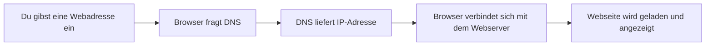
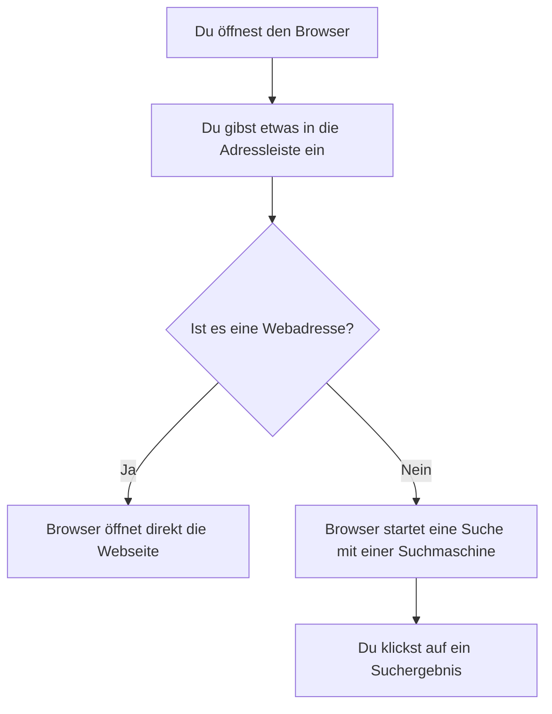
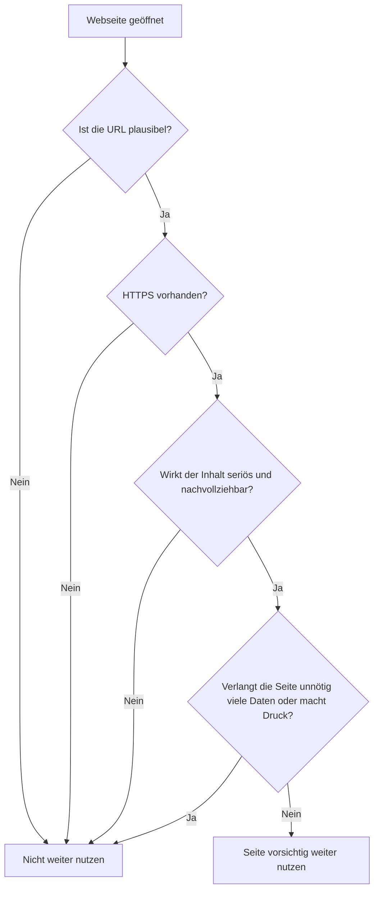
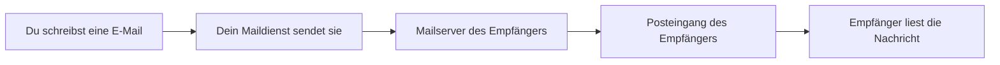

###### Themen

Internet-Grundlagen

- Einen Webbrowser öffnen und grundlegend bedienen
- Suchmaschinen für einfache Recherchen nutzen

Sicher im Internet unterwegs

- Sichere und unsichere Webseiten erkennen
- Grundlegende Datenschutz- und Vorsichtsmaßnahmen beim Surfen beachten

E-Mail-Grundlagen

- Aufbau und Zweck von E-Mails verstehen
- E-Mails schreiben, versenden und empfangen
- Anhänge zu E-Mails hinzufügen und speichern

   
# 🌐 Internet-Grundlagen

Wenn du das Internet sinnvoll nutzen willst, brauchst du zuerst ein klares Bild von den Grundbegriffen. Viele verwechseln zum Beispiel **Webbrowser** und **Suchmaschine**. Das ist normal, aber wichtig zu unterscheiden.

Ein **Webbrowser** ist das Programm, mit dem du Webseiten öffnest, also zum Beispiel Google Chrome, Mozilla Firefox, Microsoft Edge oder Safari. Ein Browser ist sozusagen dein „Fenster ins Web“ ([What is a browser?](https://www.mozilla.org/en-US/firefox/browsers/what-is-a-browser/)).

Eine **Suchmaschine** dagegen ist ein Dienst im Internet, mit dem du Informationen suchst, zum Beispiel Google, Bing oder DuckDuckGo. Die Suchmaschine läuft **im Browser**. Das heißt: Du öffnest zuerst den Browser und nutzt darin dann eine Suchmaschine.

Damit du dir das leicht merken kannst:

| Begriff | Was es ist | Beispiele |
|---|---|---|
| Webbrowser | Ein Programm zum Öffnen von Webseiten | Chrome, Firefox, Edge, Safari |
| Suchmaschine | Ein Suchdienst für Inhalte im Web | Google, Bing, DuckDuckGo |

   
## 🧭 Einen Webbrowser öffnen und grundlegend bedienen

Einen Browser zu öffnen ist der erste praktische Schritt ins Internet. Auf einem Computer klickst du dazu meist auf ein Symbol in der Taskleiste, auf dem Desktop oder im Startmenü. Auf dem Smartphone oder Tablet tippst du auf die Browser-App.

Wenn der Browser geöffnet ist, siehst du normalerweise oben eine **Adressleiste**. Dort kannst du entweder:

- eine **Webadresse** eingeben, zum Beispiel `www.wikipedia.org`
- oder direkt einen **Suchbegriff** eintippen, zum Beispiel `Wetter Berlin`

Das ist praktisch, weil moderne Browser beides in derselben Leiste erlauben.

### 🧩 Die wichtigsten Teile eines Browsers

Damit du dich sicher fühlst, ist es gut, die wichtigsten Elemente zu kennen.

| Element | Bedeutung | Wofür du es brauchst |
|---|---|---|
| Adressleiste | Zeigt die aktuelle Webadresse | Webseite direkt aufrufen oder Suchbegriff eingeben |
| Zurück-Button | Geht zur vorherigen Seite zurück | Wenn du versehentlich woanders gelandet bist |
| Vorwärts-Button | Geht wieder nach vorne | Wenn du zurückgegangen bist |
| Neu laden | Lädt die Seite erneut | Wenn etwas nicht richtig angezeigt wird |
| Tabs | Mehrere Seiten gleichzeitig geöffnet | Zum Vergleichen oder parallelen Arbeiten |
| Lesezeichen | Gespeicherte Webseiten | Für Seiten, die du öfter brauchst |
| Menü | Zusätzliche Einstellungen | Verlauf, Downloads, Druck, Einstellungen |

### 🌍 Was passiert, wenn du eine Webseite öffnest?

Wenn du eine Webadresse eingibst, passiert im Hintergrund mehr, als man denkt. Der Browser muss zuerst herausfinden, auf welchem Server die Seite liegt. Dafür wird häufig das **Domain Name System (DNS)** genutzt. DNS übersetzt einen Namen wie `example.com` in eine technische IP-Adresse, damit der Browser den richtigen Server findet ([What is DNS? | How DNS works](https://www.cloudflare.com/learning/dns/what-is-dns/)).

Danach fordert der Browser die Inhalte an und zeigt sie dir als lesbare Webseite an.

### 🗂️ Mit Tabs arbeiten

**Tabs** sind Reiter im Browser. Sie helfen dir, mehrere Seiten gleichzeitig offen zu haben. Das ist im Alltag extrem nützlich. Du kannst zum Beispiel in einem Tab einen Artikel lesen und in einem anderen Tab nach einer Erklärung für ein Wort suchen.

Wichtig ist dabei: Je mehr Tabs offen sind, desto schneller verlierst du den Überblick. Für gutes Lernen ist es oft besser, nur wenige Tabs gleichzeitig offen zu haben und sie bewusst zu benennen oder unnötige Tabs zu schließen.

### ⭐ Lesezeichen, Verlauf und Downloads

Ein **Lesezeichen** speichert eine Webseite, damit du sie später schnell wiederfindest. Das ist sinnvoll für Lernseiten, Behördenportale, Online-Banking oder E-Mail-Dienste.

Der **Verlauf** speichert, welche Seiten du besucht hast. Das ist hilfreich, wenn du eine Seite versehentlich geschlossen hast und sie wiederfinden willst.

Der Bereich **Downloads** zeigt dir Dateien, die du aus dem Internet heruntergeladen hast, zum Beispiel PDFs, Bilder oder Formulare. Genau hier solltest du besonders aufmerksam sein, denn nicht jede heruntergeladene Datei ist sicher.

   
## 🔎 Suchmaschinen für einfache Recherchen nutzen

Eine Suchmaschine durchsucht nicht „live“ das ganze Internet in diesem Moment, sondern arbeitet meist mit einem vorher aufgebauten Index. Das ist vereinfacht gesagt eine riesige Sammlung von erfassten Webseiten, die durchsucht werden kann.

Für dich im Alltag bedeutet das: Du gibst Suchbegriffe ein und bekommst eine Liste mit Ergebnissen, die möglichst gut zu deiner Anfrage passen.

### 📝 Gute Suchanfragen formulieren

Viele Menschen suchen zu ungenau. Dann bekommen sie zwar viele Ergebnisse, aber oft nicht die richtigen. Gute Recherche beginnt deshalb mit einer guten Suchanfrage.

Statt einfach nur `Laptop` zu suchen, ist besser:

- `Laptop für Studium unter 800 Euro`
- `Was ist ein Webbrowser einfach erklärt`
- `PDF Grundgesetz deutsch`

Je genauer deine Suchbegriffe sind, desto besser wird das Ergebnis.

Auch einfache Suchtechniken helfen sehr. Viele Suchmaschinen unterstützen zum Beispiel:

- **Anführungszeichen** für eine genaue Wortgruppe: `"digitale Kompetenz"`
- **Minuszeichen** zum Ausschließen: `jaguar -auto`
- **site:** für Ergebnisse nur auf einer bestimmten Webseite: `Datenschutz site:bsi.bund.de`

Solche Verfeinerungen werden von Google in den Suchhilfen beschrieben ([Refine web searches](https://support.google.com/websearch/answer/2466433?hl=en)).

### 📄 Suchergebnisse richtig lesen

Ein Suchergebnis besteht meist aus drei Teilen:

| Teil | Bedeutung |
|---|---|
| Titel | Name oder Überschrift der Seite |
| URL | Die Webadresse |
| Beschreibung | Kurzer Vorschautext zur Seite |

Du solltest Suchergebnisse nie nur nach der Position beurteilen. Eine Seite ganz oben ist nicht automatisch die beste oder vertrauenswürdigste. Oft sind unter den ersten Treffern auch Anzeigen oder Seiten, die gut für Suchmaschinen optimiert sind, aber nicht unbedingt fachlich am besten.

Achte deshalb auf diese Fragen:

- **Wer ist der Herausgeber der Seite?**
- **Ist es eine offizielle Stelle, eine Bildungseinrichtung, ein Unternehmen oder ein privater Blog?**
- **Ist die Information aktuell?**
- **Passt die Seite wirklich zu deiner Frage?**

Wenn du nach zuverlässigen Informationen suchst, sind häufig diese Quellenarten besonders gut:

- offizielle Behördenseiten
- Hochschulen und Forschungseinrichtungen
- seriöse Fachportale
- bekannte Software- oder Herstellerdokumentationen bei Technikthemen

### 🧠 Der Unterschied zwischen „etwas finden“ und „etwas verstehen“

Für richtiges Lernen reicht es nicht, nur schnell eine Antwort zu googeln. Du solltest versuchen, Suchergebnisse in einer sinnvollen Reihenfolge zu nutzen:

1. **Erst Überblick gewinnen**
2. **Dann Begriffe klären**
3. **Dann mehrere Quellen vergleichen**
4. **Dann in eigenen Worten erklären**

Genau so lernst du nachhaltiger. Wenn du einen Begriff nur kopierst, vergisst du ihn schnell. Wenn du ihn in eigenen Worten erklären kannst, hast du ihn verstanden.

### 🔍 Browser und Suchmaschine noch einmal klar getrennt

Weil das so wichtig ist, hier noch eine sehr einfache Gegenüberstellung:

   
# 🛡️ Sicher im Internet unterwegs

Das Internet ist nützlich, aber nicht jede Seite und nicht jede Nachricht ist vertrauenswürdig. Deshalb ist es wichtig, nicht nur „wie man klickt“ zu lernen, sondern auch **wie man Risiken erkennt**.

Sicherheit im Internet bedeutet nicht, alles zu misstrauen. Es bedeutet, aufmerksam zu sein, typische Warnsignale zu kennen und gute Gewohnheiten zu entwickeln.

   
## 🔒 Sichere und unsichere Webseiten erkennen

Ein wichtiges Merkmal sicherer Webseiten ist die Nutzung von **HTTPS**. HTTPS sorgt dafür, dass die Daten zwischen deinem Browser und der Webseite verschlüsselt übertragen werden ([What is HTTPS?](https://www.cloudflare.com/learning/ssl/what-is-https/)).

Du erkennst HTTPS meist daran, dass die Adresse mit `https://` beginnt und der Browser ein Schloss-Symbol anzeigt.

Aber hier ist ein ganz wichtiger Punkt: **HTTPS allein bedeutet nicht automatisch, dass die Webseite seriös oder ehrlich ist.** Es bedeutet vor allem, dass die Verbindung verschlüsselt ist. Auch betrügerische Seiten können HTTPS nutzen ([How to recognize and avoid phishing scams](https://consumer.ftc.gov/articles/how-recognize-and-avoid-phishing-scams)).

### ✅ Woran du eher sichere Webseiten erkennst

Eine Webseite wirkt eher vertrauenswürdig, wenn mehrere Dinge zusammenpassen:

| Merkmal | Warum es sinnvoll ist |
|---|---|
| `https://` und Schloss-Symbol | Die Verbindung ist verschlüsselt |
| Saubere, verständliche URL | Weniger Risiko für Tippfehler- oder Fake-Seiten |
| Kein aggressives Popup-Dauerfeuer | Wirkt seriöser und weniger manipulativ |
| Klare Angaben zum Anbieter | Du weißt, wer hinter der Seite steht |
| Verständliche Inhalte ohne Druck | Typisch für seriöse Seiten |
| Offizielle Domain oder bekannte Organisation | Erhöht die Vertrauenswürdigkeit |

### ⚠️ Warnsignale für unsichere Webseiten

Misstrauisch solltest du werden, wenn du eines oder mehrere dieser Zeichen siehst:

- Die Adresse wirkt merkwürdig, zum Beispiel mit Schreibfehlern wie `paypaI.com` statt `paypal.com`
- Die Seite setzt dich unter Zeitdruck: „Nur noch 3 Minuten!“
- Es gibt extreme Versprechen: „iPhone gratis“, „100 % sicherer Gewinn“
- Es werden ungewöhnlich viele persönliche Daten verlangt
- Dein Browser zeigt eine Sicherheitswarnung
- Das Design wirkt kopiert, unfertig oder voller Sprachfehler
- Downloads starten plötzlich automatisch

Gerade gefälschte Seiten versuchen oft, bekannte Marken nachzuahmen. Phishing-Angriffe arbeiten häufig mit gefälschten Login-Seiten oder Nachrichten, die Druck erzeugen, zum Beispiel: „Dein Konto wird gesperrt, wenn du nicht sofort klickst“ ([How to recognize and avoid phishing scams](https://consumer.ftc.gov/articles/how-recognize-and-avoid-phishing-scams)).

### 🧭 Eine Webseite bewusst prüfen

Statt sofort zu klicken, geh gedanklich kurz diese Reihenfolge durch:

### 🏢 Warum die URL so wichtig ist

Die **URL** ist die Internetadresse einer Seite. Genau dort verstecken sich viele Fälschungen. Schau deshalb nicht nur auf das Logo oder das Aussehen der Seite, sondern immer auf die Adresse.

Beispiel:

- echt: `https://www.sparkasse.de`
- verdächtig: `https://sparkasse-login-sicher.net`

Die zweite Adresse sieht vielleicht glaubwürdig aus, gehört aber möglicherweise gar nicht zur echten Organisation.

### 📢 Browserwarnungen solltest du ernst nehmen

Wenn der Browser meldet, dass eine Verbindung nicht sicher ist oder ein Zertifikatsproblem vorliegt, dann ist das kein kleines Detail. Solche Warnungen solltest du nicht einfach wegklicken. Gerade Anfänger machen oft den Fehler, Browserwarnungen als „nervige Technikmeldung“ zu behandeln. In Wahrheit sollen sie dich schützen.

   
## 🕵️ Grundlegende Datenschutz- und Vorsichtsmaßnahmen beim Surfen beachten

Datenschutz heißt im Alltag vor allem: **nicht mehr Daten preisgeben als nötig**. Viele Webseiten, Apps und Dienste sammeln Informationen über dein Verhalten, deine Geräte oder deine Interessen. Ein bewusster Umgang damit ist ein wichtiger Teil digitaler Grundbildung.

### 👤 Gib persönliche Daten sparsam weiter

Bevor du irgendwo Daten eingibst, frag dich:

- Warum will die Seite diese Information?
- Ist diese Angabe wirklich notwendig?
- Würdest du diese Information auch einer fremden Person geben?

Besonders vorsichtig solltest du sein bei:

- vollständiger Adresse
- Telefonnummer
- Geburtsdatum
- Ausweisdaten
- Bankdaten
- Passwörtern

Ein seriöser Dienst fragt nur das ab, was für seinen Zweck nötig ist.

### 🍪 Cookies und Einwilligungen verstehen

Viele Seiten zeigen dir beim ersten Besuch einen Cookie-Hinweis. **Cookies** sind kleine Daten, die eine Webseite im Browser speichert. Manche sind technisch notwendig, andere dienen der Analyse oder Werbung.

Wichtig für dich: Nicht jede Zustimmung ist Pflicht. Du solltest Einwilligungsfenster bewusst lesen und nicht automatisch alles akzeptieren.

### 🕶️ Privater Modus ist nicht „unsichtbar“

Viele denken, der Inkognito- oder Privatmodus mache sie anonym. Das stimmt so nicht. Der private Modus verhindert vor allem, dass dein Browser lokal Verlauf, Suchverlauf oder Formulardaten speichert. Webseiten, Arbeitgeber, Schule oder Internetanbieter können dein Verhalten dadurch aber nicht automatisch nicht mehr sehen ([Private Browsing - Use Firefox without saving history](https://support.mozilla.org/en-US/kb/private-browsing-use-firefox-without-history)).

Das ist ein typischer Irrtum, den man früh verstehen sollte.

### 🔐 Sichere Gewohnheiten beim Surfen

Ein großer Teil der Sicherheit entsteht nicht durch Expertenwissen, sondern durch einfache Gewohnheiten:

- Öffne wichtige Seiten möglichst direkt über die bekannte Adresse oder ein Lesezeichen
- Klicke nicht unüberlegt auf Links aus Nachrichten oder Popups
- Lade Programme nur von offiziellen Herstellerseiten herunter
- Melde dich auf fremden Geräten nach der Nutzung immer ab
- Speichere Passwörter nicht auf öffentlichen Geräten
- Achte darauf, ob du wirklich auf der richtigen Seite bist, bevor du dich einloggst

### 🔄 Warum Updates wichtig sind

Browser, Betriebssysteme und Programme sollten regelmäßig aktualisiert werden. Sicherheitsupdates schließen bekannte Schwachstellen und helfen, Angriffe zu verhindern ([Understanding Patches and Software Updates](https://www.cisa.gov/news-events/news/understanding-patches-and-software-updates)).

Das klingt technisch, ist aber ganz praktisch: Ein veralteter Browser ist oft leichter angreifbar als ein aktueller.

### 📶 Vorsicht bei öffentlichen Netzwerken

Öffentliche WLANs, zum Beispiel in Cafés, Hotels oder Bahnhöfen, sind praktisch, aber du solltest dort besonders vorsichtig sein. Erledige sensible Dinge wie Online-Banking oder wichtige Kontoänderungen lieber nur in vertrauenswürdigen Netzen oder achte besonders darauf, dass die Verbindung verschlüsselt ist und du wirklich auf der richtigen Seite bist.

### 🧠 Die wichtigste Schutzregel überhaupt

Wenn etwas im Internet **zu dringend, zu gut oder zu merkwürdig** wirkt, dann ist eine Pause oft die beste Sicherheitsmaßnahme. Betrug funktioniert oft deshalb, weil Menschen unter Druck schnell handeln. Wer kurz stoppt und prüft, schützt sich deutlich besser.

   
# 📧 E-Mail-Grundlagen

E-Mails gehören zu den wichtigsten digitalen Grundfertigkeiten. Sie werden für private Kommunikation, Schule, Studium, Arbeit, Behördenkontakte, Bewerbungen und Online-Dienste genutzt.

Eine E-Mail ist im Grunde eine digitale Nachricht. Sie funktioniert ähnlich wie ein Brief, nur schneller. Statt Briefkasten und Post nutzt du ein E-Mail-Programm oder einen Webdienst.

   
## ✉️ Aufbau und Zweck von E-Mails verstehen

Damit du E-Mails sicher und sinnvoll nutzen kannst, solltest du zuerst den Aufbau kennen.

### 🧱 Die wichtigsten Bestandteile einer E-Mail

| Bestandteil | Bedeutung |
|---|---|
| Von | Der Absender der E-Mail |
| An | Der Hauptempfänger |
| Cc | Weitere Empfänger, die die Nachricht sichtbar mitbekommen |
| Bcc | Weitere Empfänger, die für andere unsichtbar bleiben |
| Betreff | Kurze Überschrift der Nachricht |
| Nachrichtentext | Der eigentliche Inhalt |
| Anhang | Zusätzliche Datei, zum Beispiel PDF oder Bild |
| Signatur | Abschluss mit Name und ggf. Kontaktdaten |

Der **Betreff** ist besonders wichtig. Er hilft dem Empfänger sofort zu verstehen, worum es geht. Eine gute Betreffzeile ist klar und konkret, zum Beispiel:

- `Terminbestätigung für Montag`
- `Unterlagen zur Anmeldung`
- `Frage zur Rechnung 2024-18`

Ein Betreff wie `Hallo` oder `Wichtig!!!` ist oft zu ungenau.

### 🎯 Wofür E-Mails gedacht sind

E-Mails sind besonders gut für:

- formellere Nachrichten
- Informationen, die schriftlich festgehalten werden sollen
- Nachrichten mit Anhängen
- Kommunikation, bei der der andere nicht sofort antworten muss

Für sehr kurze spontane Absprachen nutzen viele Menschen heute eher Messenger. Aber bei allem, was dokumentiert, nachvollziehbar oder offiziell sein soll, ist E-Mail oft die bessere Wahl.

### 📬 Wie E-Mails grob funktionieren

Im Hintergrund läuft eine E-Mail nicht direkt von Person zu Person wie ein Live-Chat. Sie wird über Mailserver vermittelt.

Das ist der Grund, warum eine Mail manchmal nicht sofort ankommt, sondern mit leichter Verzögerung.

   
## 🖊️ E-Mails schreiben, versenden und empfangen

Das Schreiben einer E-Mail folgt fast immer demselben einfachen Ablauf. Wenn du das einmal sauber verstanden hast, kannst du fast jeden Maildienst bedienen.

### 📝 Eine E-Mail schreiben

Typischerweise klickst du auf **„Schreiben“**, **„Neue Nachricht“** oder ein Plus-Symbol. Danach füllst du die Felder aus:

1. **Empfänger eintragen**  
   In das Feld „An“ kommt die E-Mail-Adresse der Person, die die Nachricht bekommen soll.

2. **Betreff eintragen**  
   Schreibe kurz und konkret, worum es geht.

3. **Text schreiben**  
   Formuliere deine Nachricht. Bei formelleren Mails sind Begrüßung und Abschluss sinnvoll.

4. **Anhang hinzufügen**, falls nötig  
   Zum Beispiel ein Dokument oder ein Bild.

5. **Senden**  
   Erst wenn du auf „Senden“ klickst, wird die Nachricht wirklich verschickt.

Google beschreibt diesen grundlegenden Ablauf in der Hilfe zum Schreiben von E-Mails ([Write an email](https://support.google.com/mail/answer/6580?hl=en)).

### 💬 Wie eine gut lesbare E-Mail aussieht

Eine verständliche E-Mail hat meistens diese Form:

- **Anrede**: „Hallo Frau Müller,“ oder „Guten Tag,“
- **Einleitung**: Worum geht es?
- **Hauptteil**: Die eigentliche Information oder Frage
- **Abschluss**: „Viele Grüße“ oder „Mit freundlichen Grüßen“
- **Name**

Das klingt einfach, macht aber einen großen Unterschied. Eine E-Mail ohne klare Struktur wirkt schnell unhöflich oder verwirrend.

### 📥 E-Mails empfangen und lesen

Eingehende Nachrichten landen meist im **Posteingang**. Dort kannst du sie anklicken und lesen. Viele Maildienste sortieren Nachrichten zusätzlich in Bereiche wie:

- Posteingang
- Gesendet
- Entwürfe
- Papierkorb
- Spam oder Junk

Der **Spam-Ordner** ist wichtig. Dort landen unerwünschte oder verdächtige Nachrichten. Allerdings kann es passieren, dass auch echte Mails dort landen. Wenn du also auf eine wichtige Nachricht wartest, lohnt sich ein Blick in diesen Ordner.

### ↩️ Antworten, allen antworten, weiterleiten

Wenn du eine E-Mail erhalten hast, gibt es meist drei häufige Aktionen:

| Funktion | Bedeutung |
|---|---|
| Antworten | Nur dem Absender zurückschreiben |
| Allen antworten | Allen ursprünglichen Empfängern antworten |
| Weiterleiten | Mail an eine andere Person schicken |

Gerade **„Allen antworten“** solltest du bewusst verwenden. Sonst bekommen unnötig viele Personen deine Nachricht.

### 🚨 Vorsicht bei verdächtigen E-Mails

Nicht jede E-Mail ist harmlos. Besonders vorsichtig solltest du sein, wenn:

- du den Absender nicht kennst
- die Nachricht Druck macht
- du auf einen Link klicken sollst
- ein unerwarteter Anhang enthalten ist
- Bankdaten, Passwörter oder Codes verlangt werden

Solche Merkmale sind typisch für Phishing-Nachrichten ([How to recognize and avoid phishing scams](https://consumer.ftc.gov/articles/how-recognize-and-avoid-phishing-scams)).

Ein besonders guter Schutz ist: **Nicht direkt aus der Mail heraus auf sensible Links klicken**, sondern wichtige Dienste lieber selbst im Browser aufrufen.

   
## 📎 Anhänge zu E-Mails hinzufügen und speichern

Anhänge sind Dateien, die du zusammen mit einer E-Mail verschickst. Das können zum Beispiel sein:

- PDFs
- Bilder
- Word-Dateien
- Tabellen
- Präsentationen

### 📤 Einen Anhang hinzufügen

In fast allen Maildiensten gibt es dafür ein **Büroklammer-Symbol**. Du klickst darauf, wählst eine Datei von deinem Gerät aus und fügst sie zur E-Mail hinzu. Dieser Vorgang wird in der Gmail-Hilfe so beschrieben ([Send attachments with your Gmail message](https://support.google.com/mail/answer/6584?hl=en)).

Wichtig ist: Prüfe vor dem Senden, ob du wirklich die richtige Datei angehängt hast. Das passiert im Alltag erstaunlich oft, dass man die falsche Version oder sogar eine ganz andere Datei verschickt.

### 📁 Typische Dateitypen verstehen

| Dateiendung | Typ | Typischer Inhalt |
|---|---|---|
| `.pdf` | Dokument | Formulare, Unterlagen, Artikel |
| `.jpg` / `.png` | Bild | Fotos, Screenshots |
| `.docx` | Textdokument | Briefe, Aufgaben, Berichte |
| `.xlsx` | Tabelle | Listen, Zahlen, Auswertungen |
| `.pptx` | Präsentation | Folien und Vorträge |
| `.zip` | Archivdatei | Mehrere Dateien zusammengepackt |

Wenn du Dateiendungen erkennst, kannst du Anhänge besser einschätzen.

### 📥 Einen Anhang speichern

Wenn du eine E-Mail mit Anhang erhältst, kannst du die Datei meist anklicken oder herunterladen. Sie landet dann oft im Download-Ordner deines Geräts oder an dem Ort, den du auswählst.

Für gutes Arbeiten ist es sinnvoll, Anhänge nicht einfach irgendwo liegen zu lassen, sondern bewusst zu speichern, zum Beispiel in Ordnern wie:

- `Dokumente/Schule`
- `Dokumente/Bewerbung`
- `Dokumente/Rechnungen`

Das spart später sehr viel Suchzeit.

### ⚠️ Anhänge nicht blind öffnen

Anhänge sind praktisch, aber auch ein klassischer Weg für Schadsoftware und Betrugsversuche. Öffne daher keine Anhänge, wenn:

- du den Absender nicht kennst
- du die Nachricht nicht erwartet hast
- die Datei seltsam benannt ist
- die Mail verdächtig wirkt
- du zu schnellem Handeln gedrängt wirst

Besonders vorsichtig solltest du bei ausführbaren Dateien oder komischen Archivdateien sein. Wenn du unsicher bist, frag lieber nach oder öffne die Datei nicht.

### 🧾 Gute Gewohnheiten bei Anhängen

Im Alltag helfen dir diese einfachen Regeln:

- Benenne Dateien klar, bevor du sie verschickst  
  Statt `Dokument_neu_final2.pdf` besser `Anmeldung_Max_Mustermann.pdf`

- Prüfe, ob der Anhang zur Nachricht passt  
  Im Text sollte klar erwähnt werden, was angehängt ist

- Öffne nur Anhänge aus vertrauenswürdigen Quellen  
  Im Zweifel erst prüfen, dann klicken

- Speichere wichtige Anhänge geordnet ab  
  Sonst findest du sie später nicht wieder

- Achte auf Dateigröße und Format  
  Nicht jeder Empfänger kann jedes Format problemlos öffnen

### 🧠 Warum E-Mail-Kompetenz so wichtig ist

E-Mails wirken auf den ersten Blick altmodisch, sind aber digital gesehen ein Grundpfeiler. Wenn du sauber mit Browser, Suchmaschine, Webseitenprüfung und E-Mail umgehen kannst, beherrschst du bereits einen großen Teil der praktischen digitalen Grundkompetenz.

Diese Fähigkeiten sind nicht nur „Computerwissen“. Sie helfen dir dabei,

- Informationen zuverlässig zu finden,
- Risiken besser zu erkennen,
- klar zu kommunizieren
- und digitale Werkzeuge bewusst statt zufällig zu nutzen.
