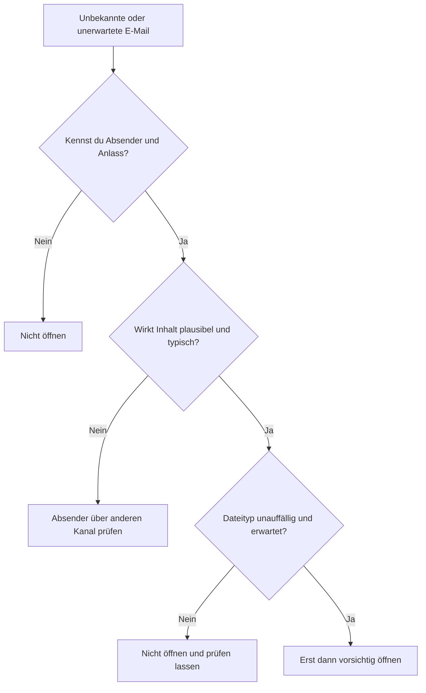
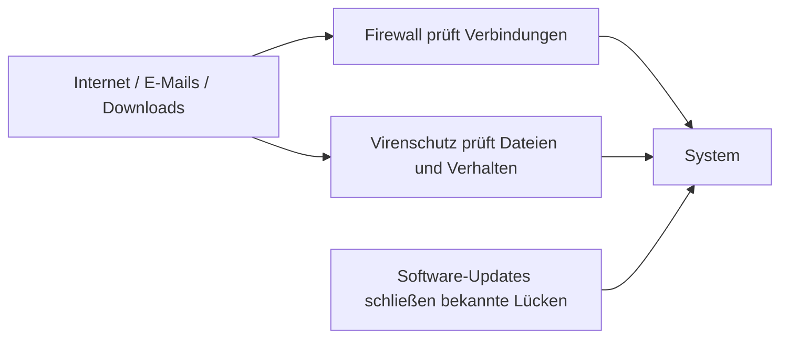

###### Themen

Grundlagen der IT-Sicherheit

- Merkmale sicherer Passwörter verstehen
- Persönliche Daten schützen und sensibel mit Informationen umgehen
- Vorsichtsmaßnahmen beim Öffnen unbekannter Anhänge beachten

Schutz und Pflege des Systems

- Unterschied zwischen Virenschutz, Firewall und Software-Updates grundlegend verstehen
- Programme sicher installieren und deinstallieren
- Software-Updates durchführen und ihre Bedeutung erkennen

   
# 🔐 Grundlagen der IT-Sicherheit

IT-Sicherheit beginnt nicht erst bei großen Firmen oder komplizierten Netzwerken. Sie beginnt bei deinem ganz normalen Verhalten: Wie gehst du mit Passwörtern um? Welche Informationen gibst du preis? Öffnest du Anhänge einfach oder prüfst du erst? Viele Sicherheitsprobleme entstehen nicht, weil Technik komplett versagt, sondern weil Menschen zu schnell vertrauen, zu bequem werden oder Risiken unterschätzen.

Man kann sich IT-Sicherheit wie mehrere Schutzschichten vorstellen. Ein gutes Passwort schützt den Zugang. Vorsicht im Umgang mit Informationen schützt deine Privatsphäre. Misstrauen gegenüber unbekannten Anhängen schützt dein Gerät vor Schadsoftware. Diese Schichten ergänzen sich gegenseitig.

   
## 🔑 Merkmale sicherer Passwörter verstehen

Ein Passwort ist wie der Schlüssel zu deinem digitalen Raum. Wenn dieser Schlüssel leicht nachzumachen ist, kann jemand sehr schnell hineinkommen. Genau deshalb ist ein gutes Passwort nicht einfach nur „irgendwas, das ich mir merken kann“, sondern eine bewusste Sicherheitsentscheidung.

Das Bundesamt für Sicherheit in der Informationstechnik empfiehlt, Passwörter **lang**, **einzigartig** und möglichst schwer vorhersehbar zu wählen und nicht dasselbe Passwort für mehrere Dienste zu verwenden ([Passwörter](https://www.bsi.bund.de/DE/Themen/Verbraucherinnen-und-Verbraucher/Informationen-und-Empfehlungen/Onlinekommunikation/Passwoerter/passwoerter_node.html)).

Ein sicheres Passwort hat vor allem diese Eigenschaften:

- Es ist **lang**. Länge ist einer der wichtigsten Faktoren.
- Es ist **einzigartig**. Für jedes wichtige Konto sollte es ein eigenes Passwort geben.
- Es ist **nicht leicht erratbar**. Also keine Namen, Geburtsdaten oder einfache Muster.
- Es wird **nicht mehrfach verwendet**.

Wenn Menschen von „starken Passwörtern“ sprechen, denken sie oft nur an Sonderzeichen. Die Wahrheit ist etwas anders: Ein langes Passwort oder noch besser eine lange **Passphrase** ist oft stärker und leichter zu merken als ein kurzes, künstlich kompliziertes Passwort.

Ein Beispiel:

- Schwach: `Sommer2024`
- Stärker: `KaffeeZugMondWiese19`
- Noch besser als Prinzip: eine lange, zufällige Passphrase, die du **nur für diesen einen Dienst** verwendest

Der Grund ist einfach: Angreifer probieren häufig zuerst bekannte Wörter, Namen, Jahreszahlen und typische Muster aus. Kurze oder vorhersehbare Passwörter fallen schnell. Lange und einzigartige Kombinationen sind viel schwerer zu knacken.

   
### 🧠 Was ein Passwort wirklich sicher macht

Hier ist eine einfache Übersicht:

| Merkmal | Unsicher | Sicherer |
|---|---|---|
| Länge | kurz, z. B. 6–8 Zeichen | deutlich länger, am besten als Passphrase |
| Vorhersehbarkeit | Name, Geburtstag, `123456`, `qwertz` | zufällige oder ungewöhnliche Wortkombination |
| Wiederverwendung | gleiches Passwort für viele Konten | jedes Konto hat ein eigenes Passwort |
| Bezug zu dir | Haustiername, Lieblingsverein | keine leicht erratbaren persönlichen Bezüge |

Das Problem bei wiederverwendeten Passwörtern ist besonders groß. Stell dir vor, ein Onlineshop, bei dem du mal registriert warst, wird gehackt. Wenn du dort dasselbe Passwort benutzt hast wie für dein E-Mail-Konto, können Angreifer dieses Passwort auch an anderer Stelle ausprobieren. Das nennt man oft **Credential Stuffing**: einmal gestohlene Zugangsdaten werden automatisiert bei vielen Diensten getestet.

Dein E-Mail-Konto ist dabei besonders kritisch. Wer Zugriff auf deine E-Mails hat, kann oft Passwörter anderer Dienste zurücksetzen. Deshalb sollte gerade dort dein Passwort besonders stark sein.

   
### 🚫 Was du bei Passwörtern vermeiden solltest

Viele schlechte Passwörter sehen auf den ersten Blick „gar nicht so unsicher“ aus. Typische Fehler sind:

- Vorname oder Nachname
- Geburtsdatum
- `Passwort123`
- `Hallo123!`
- Name + Jahr
- dieselbe Kombination überall

Auch kleine Abwandlungen helfen oft kaum. Wenn du aus `Sommer2024` einfach `Sommer2024!` machst, ist das zwar minimal besser, aber immer noch vorhersehbar. Angreifer kennen genau solche Muster.

   
### 🛠️ Wie du im Alltag gute Passwörter praktisch nutzt

Ein häufiges Problem ist: Gute Passwörter sind sicher, aber schwer zu merken. Genau hier helfen **Passwortmanager**. Sie speichern deine Passwörter sicher und erzeugen für jeden Dienst eigene, starke Kennwörter. Dann musst du dir nicht zwanzig komplizierte Passwörter selbst merken, sondern nur noch ein starkes Master-Passwort.

Zusätzlich ist **Zwei-Faktor-Authentifizierung** sehr sinnvoll. Dabei reicht nicht nur das Passwort, sondern du musst einen zweiten Nachweis geben, zum Beispiel einen Code aus einer App. Dadurch wird ein Konto selbst dann deutlich besser geschützt, wenn das Passwort einmal bekannt wird.

Merke dir also das Prinzip:

- **lang statt nur kompliziert**
- **einzigartig statt wiederverwendet**
- **Passwortmanager statt Zettel oder Notiz-App ohne Schutz**
- **2-Faktor-Authentifizierung dort, wo es möglich ist**

   
## 🕵️ Persönliche Daten schützen und sensibel mit Informationen umgehen

Persönliche Daten sind Informationen, die etwas über dich verraten oder mit dir in Verbindung gebracht werden können. Dazu gehören offensichtliche Dinge wie dein Name, deine Adresse und deine Telefonnummer, aber auch Informationen, die viele unterschätzen: dein Standort, deine Schule oder Firma, dein Tagesablauf, Fotos deiner Wohnung, Reisepläne oder Antworten auf typische Sicherheitsfragen.

Das Entscheidende ist: Nicht jede einzelne Information ist für sich allein gefährlich. Aber viele kleine Informationen zusammen ergeben oft ein sehr genaues Bild von dir. Genau das machen sich Betrüger, Datensammler und Angreifer zunutze.

Wenn du zum Beispiel öffentlich postest:

- wo du arbeitest,
- wann du im Urlaub bist,
- wie dein Haustier heißt,
- wie deine Kinder heißen,
- wann du Geburtstag hast,

dann kann daraus schnell Material für Betrugsversuche, Identitätsdiebstahl oder das Erraten von Sicherheitsfragen werden.

Man nennt das oft **Datensparsamkeit**: Gib nur so viele Informationen preis, wie wirklich nötig sind. Nicht jede Website, jede App und jede Person braucht alles über dich zu wissen.

   
### 📂 Welche Daten besonders sensibel sind

Manche Daten sind besonders schützenswert, weil ihr Missbrauch direkte Folgen haben kann.

| Datenart | Beispiel | Warum sensibel |
|---|---|---|
| Zugangsdaten | E-Mail, Passwort, PIN | ermöglichen direkten Zugriff auf Konten |
| Finanzdaten | IBAN, Kreditkartendaten | können zu Geldverlust führen |
| Identitätsdaten | Ausweisfoto, Geburtsdatum, Adresse | können für Identitätsdiebstahl missbraucht werden |
| Gesundheitsdaten | Diagnosen, Arztberichte | sehr privat und missbrauchsanfällig |
| Standort- und Alltagsdaten | Live-Standort, Reisepläne | verraten Gewohnheiten und Abwesenheiten |
| Arbeits- oder Schuldaten | interne Infos, Dokumente | können dich oder andere gefährden |

Wichtig ist: Sensibel sind nicht nur „geheime“ Daten. Auch ganz normale Informationen können in der falschen Kombination problematisch werden.

   
### 🤝 Was „sensibel mit Informationen umgehen“ konkret bedeutet

Sensibel mit Informationen umzugehen heißt nicht, paranoid zu sein. Es heißt, bewusst zu entscheiden:

- **Wer soll diese Information wirklich bekommen?**
- **Warum wird sie verlangt?**
- **Ist es nötig, alles anzugeben?**
- **Was könnte passieren, wenn diese Information weitergegeben wird?**

Ein typischer Fehler ist, Informationen aus Gewohnheit zu teilen. Viele klicken bei Formularen schnell weiter, erlauben Apps unnötige Zugriffe oder beantworten Nachrichten, ohne zu prüfen, wer eigentlich fragt.

Ein paar typische Alltagssituationen:

**In sozialen Netzwerken:**  
Nicht alles, was wahr ist, muss öffentlich sein. Fotos von Ausweisen, Flugtickets, Schülerausweisen, Krankmeldungen oder Paketscheinen solltest du niemals einfach posten. Auch Hintergrunddetails auf Fotos können viel verraten, zum Beispiel Adressen, Bildschirminhalte oder Namensschilder.

**Bei Anrufen oder Nachrichten:**  
Nur weil jemand freundlich klingt oder dringend wirkt, ist die Person nicht automatisch vertrauenswürdig. Betrüger arbeiten oft mit Druck: „Sofort handeln“, „Konto gesperrt“, „Wir brauchen kurz Ihre Daten“. Genau in solchen Momenten solltest du langsamer werden statt schneller.

**Bei Online-Konten:**  
Fülle nur Pflichtfelder aus, wenn zusätzliche Angaben nicht nötig sind. Wenn ein Dienst dein Geburtsdatum nicht wirklich braucht, musst du dich fragen, warum du es angeben solltest.

   
### 🛡️ Wie du persönliche Daten besser schützt

Im Alltag helfen dir ein paar einfache Gewohnheiten enorm:

- Teile persönliche Informationen bewusst und sparsam.
- Prüfe Privatsphäre-Einstellungen in Apps und sozialen Netzwerken.
- Gib sensible Daten nie leichtfertig per E-Mail oder Chat weiter.
- Sei vorsichtig mit Fotos, Screenshots und Dokumenten.
- Nutze starke Passwörter und 2-Faktor-Authentifizierung.
- Prüfe, ob eine Website vertrauenswürdig wirkt, bevor du Daten eingibst.

Besonders wichtig ist dabei die Kombination aus Technik und Verhalten. Ein starkes Passwort hilft dir wenig, wenn du gleichzeitig zu viele persönliche Informationen öffentlich machst. Und umgekehrt schützt vorsichtiges Verhalten nicht vollständig, wenn dein Konto mit einem schwachen Passwort abgesichert ist.

   
## 📎 Vorsichtsmaßnahmen beim Öffnen unbekannter Anhänge beachten

Unbekannte Anhänge sind ein klassischer Angriffsweg. Viele Schadprogramme gelangen nicht über spektakuläre Hackerangriffe auf Geräte, sondern ganz banal über E-Mails. Das BSI warnt, dass Phishing-Nachrichten oft Druck, Täuschung und gefälschte Absender nutzen, um Menschen zum Klicken auf Anhänge oder Links zu bringen ([Phishing](https://www.bsi.bund.de/DE/Themen/Verbraucherinnen-und-Verbraucher/Informationen-und-Empfehlungen/Onlinekommunikation/Phishing/phishing_node.html)). Schadprogramme können sich genau über solche Anhänge verbreiten ([Schadprogramme](https://www.bsi.bund.de/DE/Themen/Verbraucherinnen-und-Verbraucher/Informationen-und-Empfehlungen/Cyber-Sicherheit/Schadprogramme/schadprogramme_node.html)).

Ein Anhang ist nicht allein deshalb sicher, weil er von einer bekannten Person zu kommen scheint. Absenderadressen können gefälscht werden, Konten können gehackt sein, und manchmal verschicken Schadprogramme automatisch Nachrichten aus echten Postfächern.

Deshalb gilt: Öffne einen Anhang nicht, weil du neugierig bist, sondern erst, wenn du Grund hast, ihm zu vertrauen.

   
### 🔍 Woran du verdächtige Anhänge erkennst

Achte besonders auf diese Warnsignale:

- Die Nachricht kommt unerwartet.
- Der Inhalt erzeugt Druck: „dringend“, „sofort“, „letzte Mahnung“.
- Die Sprache wirkt untypisch, holprig oder allgemein.
- Der Absender ist leicht verändert, etwa mit vertauschten Buchstaben.
- Du sollst eine Rechnung, Mahnung oder Bewerbung öffnen, obwohl das nicht zu dir passt.
- Der Dateityp wirkt ungewöhnlich oder versteckt.

Besonders vorsichtig solltest du bei Dateiendungen sein. Manche Formate sind harmloser, andere potenziell gefährlicher. Problematisch sind vor allem Dateien, die Programme oder Makros ausführen können, zum Beispiel bestimmte Office-Dokumente mit aktiven Inhalten oder ausführbare Dateien.

Wenn du die Dateiendung nicht sehen kannst, ist das schon ein Problem. Denn Angreifer tarnen Dateien gern, etwa so, dass sie wie ein PDF aussehen, in Wahrheit aber etwas anderes sind.

   
### 🧭 So gehst du richtig vor, bevor du etwas öffnest

Die wichtigste Regel lautet: **prüfen, dann öffnen**.

Stell dir bei jeder unerwarteten E-Mail diese Fragen:

1. **Erwarte ich diese Nachricht überhaupt?**
2. **Passt der Absender wirklich?**
3. **Passt der Inhalt zur Situation?**
4. **Ist der Anhang in diesem Kontext logisch?**
5. **Kann ich beim Absender über einen anderen Weg nachfragen?**

Wenn du zum Beispiel von einer Kollegin plötzlich eine komische Datei bekommst, schreibe nicht einfach auf dieselbe verdächtige Mail zurück, sondern frage sie über einen anderen sicheren Kanal nach, ob sie dir diese Datei wirklich geschickt hat.

Hier als einfache Entscheidungslogik:

Diese Logik wirkt simpel, ist aber extrem wirksam. Viele Angriffe scheitern bereits dann, wenn Menschen kurz innehalten statt reflexhaft zu klicken.

   
### 🚫 Was du bei Anhängen niemals tun solltest

Ein paar Dinge solltest du grundsätzlich vermeiden:

- Anhänge öffnen, nur weil die Betreffzeile dringend klingt
- Makros aktivieren, wenn du nicht ganz genau weißt, warum
- Dateiformate ausführen, die du nicht kennst
- Sicherheitswarnungen einfach wegklicken
- „Nur mal kurz schauen“, obwohl dir die Nachricht komisch vorkommt

Gerade das „nur mal kurz“ ist gefährlich. Viele Schadprogramme brauchen nur einen einzigen unüberlegten Klick.

   
# 🛡️ Schutz und Pflege des Systems

IT-Sicherheit besteht nicht nur aus Vorsicht beim Benutzerverhalten, sondern auch aus einem gepflegten System. Selbst wenn du sehr aufmerksam bist, bleiben Geräte angreifbar, wenn Schutzprogramme fehlen oder Software veraltet ist.

Dabei musst du drei Dinge auseinanderhalten können:

- **Virenschutz** erkennt oder blockiert Schadsoftware.
- **Firewall** kontrolliert Netzwerkverbindungen.
- **Updates** schließen Schwachstellen und verbessern Programme.

Viele verwechseln diese Begriffe oder denken, eines davon reiche allein aus. In Wirklichkeit erfüllen sie unterschiedliche Aufgaben.

   
## 🧱 Unterschied zwischen Virenschutz, Firewall und Aktualisierungen grundlegend verstehen

Am besten stellst du dir diese drei Bausteine wie unterschiedliche Sicherheitsrollen vor.

Der **Virenschutz** oder das Antivirenprogramm schaut vor allem darauf, ob Dateien, Programme oder Prozesse verdächtig sind. Es versucht also, Schadsoftware zu erkennen, zu blockieren oder zu entfernen. Das BSI beschreibt Schadprogramme als Programme, die unerwünschte und schädliche Funktionen ausführen können ([Schadprogramme](https://www.bsi.bund.de/DE/Themen/Verbraucherinnen-und-Verbraucher/Informationen-und-Empfehlungen/Cyber-Sicherheit/Schadprogramme/schadprogramme_node.html)).

Die **Firewall** überwacht den Netzwerkverkehr. Sie entscheidet vereinfacht gesagt, welche Verbindungen erlaubt sind und welche nicht. Sie ist also eher eine Art Türsteher für Datenverkehr zwischen deinem Gerät und anderen Systemen.

**Software-Updates** beziehungsweise **Aktualisierungen** sorgen dafür, dass Fehler und Sicherheitslücken in Programmen geschlossen werden. Das ist besonders wichtig, weil Angreifer bekannte Schwachstellen gezielt ausnutzen. Das BSI betont, dass Updates und Patches Sicherheitslücken schließen und die Stabilität verbessern ([Updates und Patches](https://www.bsi.bund.de/DE/Themen/Verbraucherinnen-und-Verbraucher/Informationen-und-Empfehlungen/Cyber-Sicherheit/Updates-und-Patches/updates-und-patches_node.html)).

   
### 🧩 Die Unterschiede auf einen Blick

| Schutzmaßnahme | Hauptaufgabe | Typische Frage |
|---|---|---|
| Virenschutz | Schadsoftware erkennen und blockieren | „Ist diese Datei oder dieses Verhalten verdächtig?“ |
| Firewall | Netzwerkverbindungen kontrollieren | „Darf diese Verbindung rein oder raus?“ |
| Updates | Schwachstellen beheben | „Ist die Software auf aktuellem Sicherheitsstand?“ |

Wichtig ist: Keine dieser Maßnahmen ersetzt die andere.

Ein Beispiel:

- Die Firewall kann helfen, unerwünschte Verbindungen zu blockieren.
- Der Virenschutz kann eine schädliche Datei erkennen.
- Das Update verhindert im Idealfall, dass eine bekannte Lücke überhaupt ausgenutzt werden kann.

Wenn du nur einen Virenschutz hast, aber seit Monaten keine Updates installierst, bleibt dein System trotzdem angreifbar. Wenn du nur Updates installierst, aber unbekannte Anhänge sorglos öffnest, kann trotzdem ein Problem entstehen. Gute Sicherheit ist immer ein Zusammenspiel mehrerer Schutzschichten.

   
### 🏰 Bildlich erklärt

Diese Darstellung zeigt gut: Die Werkzeuge arbeiten an unterschiedlichen Stellen.

   
## 📦 Programme sicher installieren und deinstallieren

Programme zu installieren klingt banal, ist aber sicherheitstechnisch ein sensibler Moment. Denn mit jeder Installation gibst du Software Zugriff auf dein System. Wenn das Programm unsicher, manipuliert oder unnötig ist, schaffst du dir möglicherweise selbst ein Problem.

Darum ist die wichtigste Regel bei Installationen: **Nur aus vertrauenswürdigen Quellen installieren**.

Vertrauenswürdig sind in der Regel:

- offizielle Herstellerseiten
- offizielle App-Stores oder Paketquellen
- in Unternehmen: freigegebene interne Softwarequellen

Weniger vertrauenswürdig sind:

- dubiose Download-Portale
- Dateianhänge aus Mails oder Chats
- Links aus Foren oder Kommentaren ohne Prüfung
- „gecrackte“ oder illegal veränderte Programme

Der Grund ist einfach: Bei inoffiziellen Quellen weißt du oft nicht, ob die Datei unverändert und sauber ist.

   
### 🔍 Worauf du vor der Installation achten solltest

Bevor du auf „Installieren“ klickst, prüfe:

- **Brauchst du das Programm wirklich?**
- **Kommt es aus einer vertrauenswürdigen Quelle?**
- **Passt der Herstellername?**
- **Will das Programm ungewöhnlich viele Rechte?**
- **Wird Zusatzsoftware mitinstalliert?**

Viele unsaubere Programme fallen nicht durch klassische Viren auf, sondern durch Beigaben: Toolbars, Werbesoftware, Browser-Änderungen oder unnötige Hintergrunddienste. Deshalb solltest du Installationsdialoge nicht einfach blind durchklicken.

Achte besonders auf Häkchen wie:

- „Empfohlene Zusatzsoftware installieren“
- „Startseite ändern“
- „Standard-Suchmaschine ändern“
- „Testversion zusätzlicher Sicherheitssoftware installieren“

Diese Dinge sind nicht immer direkt Schadsoftware, aber oft unerwünscht und störend.

   
### 🛠️ So installierst du Programme sicher

Ein sauberer Installationsprozess sieht ungefähr so aus:

1. Lade das Programm aus einer offiziellen Quelle herunter.
2. Prüfe, ob Name, Hersteller und Version plausibel sind.
3. Lies bei der Installation die Optionen aufmerksam.
4. Entferne unnötige Zusatzhäkchen.
5. Erteile nur Berechtigungen, die sinnvoll erscheinen.
6. Starte das System bei Bedarf neu.
7. Prüfe danach, ob sich unerwartet etwas verändert hat, etwa Browser-Startseite, Suchmaschine oder neue Hintergrundprogramme.

Wenn du unsicher bist, ob ein Programm seriös ist, installiere es nicht sofort „auf gut Glück“. Gerade bei Systemtools, Treibern, Reinigungsprogrammen und angeblichen Optimierern ist Vorsicht sinnvoll. Solche Programme versprechen oft viel und bringen wenig, manchmal sogar Risiken.

   
### 🗑️ Programme sicher deinstallieren

Deinstallieren bedeutet nicht einfach, den Programmordner zu löschen. Wenn du nur Dateien manuell entfernst, bleiben oft Einträge, Dienste oder Reste im System bestehen.

Sicher deinstallieren heißt:

- Nutze die normale Deinstallationsfunktion des Betriebssystems oder den offiziellen Uninstaller.
- Schließe das Programm vorher vollständig.
- Starte das Gerät bei Bedarf neu.
- Prüfe danach, ob Autostart-Einträge, Browser-Erweiterungen oder Zusatzprogramme übrig geblieben sind.

Warum ist das wichtig? Weil unerwünschte Software sich manchmal an mehreren Stellen einnistet. Eine saubere Deinstallation hilft dabei, Ordnung und Sicherheit im System zu erhalten.

Außerdem gilt: Je weniger unnötige Software auf einem Gerät installiert ist, desto kleiner ist die Angriffsfläche. Jedes zusätzliche Programm kann Fehler, Sicherheitslücken oder unerwünschte Funktionen mitbringen.

   
## 🔄 Software-Updates durchführen und ihre Bedeutung erkennen

Updates werden von vielen als lästig empfunden, sind aber eine der wichtigsten Sicherheitsmaßnahmen überhaupt. Ein Update ist nicht bloß „Kosmetik“ oder „eine neue Farbe im Menü“. Oft behebt es Fehler, schließt Sicherheitslücken, verbessert Stabilität oder macht Programme kompatibler mit anderen Komponenten.

Das BSI weist ausdrücklich darauf hin, dass Updates und Patches Schwachstellen schließen und deshalb zeitnah installiert werden sollten ([Updates und Patches](https://www.bsi.bund.de/DE/Themen/Verbraucherinnen-und-Verbraucher/Informationen-und-Empfehlungen/Cyber-Sicherheit/Updates-und-Patches/updates-und-patches_node.html)).

Der wichtigste Gedanke ist dabei:  
**Nicht nur neue Programme brauchen Pflege, sondern auch funktionierende Programme.**  
Viele Menschen sagen: „Warum updaten? Es läuft doch.“ Genau darin liegt das Problem. Eine Software kann äußerlich völlig normal laufen und trotzdem intern eine bekannte Sicherheitslücke haben.

   
### 🧨 Warum veraltete Software gefährlich ist

Angreifer suchen gezielt nach bekannten Schwachstellen. Wenn eine Lücke öffentlich bekannt ist und der Hersteller bereits ein Update bereitgestellt hat, dann sind ungepatchte Systeme besonders attraktiv. Denn dort ist das Problem bekannt, aber nicht behoben.

Das ist ein bisschen so, als ob ein Hersteller meldet: „Das Schloss an dieser Tür hat einen Fehler, hier ist die Reparatur“, und manche lassen die Tür trotzdem unverändert.

Veraltete Software ist besonders problematisch bei:

- Betriebssystemen
- Webbrowsern
- E-Mail-Programmen
- Office-Anwendungen
- PDF-Readern
- Apps mit Internetzugang
- Routern und anderer Netzwerktechnik

Viele vergessen zum Beispiel den Router. Auch dort laufen Programme, auch dort gibt es Sicherheitslücken, und auch dort sind Updates wichtig.

   
### ⚙️ Welche Arten von Updates es gibt

Nicht jedes Update ist gleich, aber grundsätzlich lassen sie sich so verstehen:

| Update-Typ | Bedeutung |
|---|---|
| Sicherheitsupdate | schließt Sicherheitslücken |
| Fehlerbehebung | beseitigt Bugs oder Abstürze |
| Funktionsupdate | bringt neue Funktionen |
| Treiberupdate | verbessert Hardware-Ansteuerung |
| Firmware-Update | aktualisiert Geräte wie Router, Drucker oder SSDs |

Für die IT-Sicherheit sind besonders **Sicherheitsupdates** wichtig. Aber auch andere Updates können indirekt relevant sein, weil Stabilitätsprobleme oder Fehler ebenfalls Risiken verursachen können.

   
### 🕒 Wie du Updates sinnvoll im Alltag handhabst

Am besten fährst du mit einem klaren System:

- Aktiviere automatische Updates, wo es sinnvoll ist.
- Prüfe regelmäßig manuell nach, wenn automatische Updates nicht möglich sind.
- Installiere Sicherheitsupdates zeitnah.
- Verschiebe Updates nicht wochenlang ohne guten Grund.
- Starte Geräte nach Updates neu, wenn das verlangt wird.
- Halte nicht nur das Betriebssystem aktuell, sondern auch Browser, Apps und wichtige Werkzeuge.

Gerade Browser und Betriebssysteme sind zentrale Ziele für Angriffe. Wenn diese aktuell sind, ist schon sehr viel gewonnen.

   
### 🧯 Was du vor größeren Updates beachten solltest

Auch wenn Updates wichtig sind, darf man sie mit gesundem Menschenverstand durchführen. Vor größeren Aktualisierungen ist es sinnvoll:

- wichtige Daten zu sichern
- genügend Akkuleistung oder Stromversorgung sicherzustellen
- Updates nicht mitten in einer kritischen Aufgabe zu starten
- offizielle Update-Wege zu nutzen und keine dubiosen „Treiber-Updater“ oder „System-Booster“

Solche Drittprogramme versprechen oft, Updates einfacher zu machen, sind aber häufig unnötig oder sogar problematisch. Der sicherste Weg ist fast immer der offizielle Aktualisierungsmechanismus des Betriebssystems oder des Herstellers.

Wenn ein Gerät oder Programm gar keine Sicherheitsupdates mehr bekommt, ist das ebenfalls eine wichtige Information. Dann ist es nicht einfach „alt, aber okay“, sondern möglicherweise ein dauerhaftes Risiko.

   
### 🧠 Das eigentliche Lernziel hinter Updates

Das Wichtigste ist nicht nur zu wissen, **wie** man Updates klickt, sondern **warum** man sie ernst nehmen muss. Updates sind keine Nebensache der IT, sondern ein zentraler Teil von Systempflege. Sie halten ein System nicht nur modern, sondern vor allem widerstandsfähig.

Wenn du diesen Gedanken verinnerlichst, triffst du im Alltag automatisch bessere Entscheidungen:

- Du ignorierst Warnhinweise nicht.
- Du lässt Geräte nicht monatelang ungepflegt.
- Du verstehst, dass Sicherheit ein Prozess ist, kein einmaliger Zustand.

Genau das ist der Kern guter IT-Grundlagen: nicht blind Regeln befolgen, sondern die Logik dahinter verstehen.