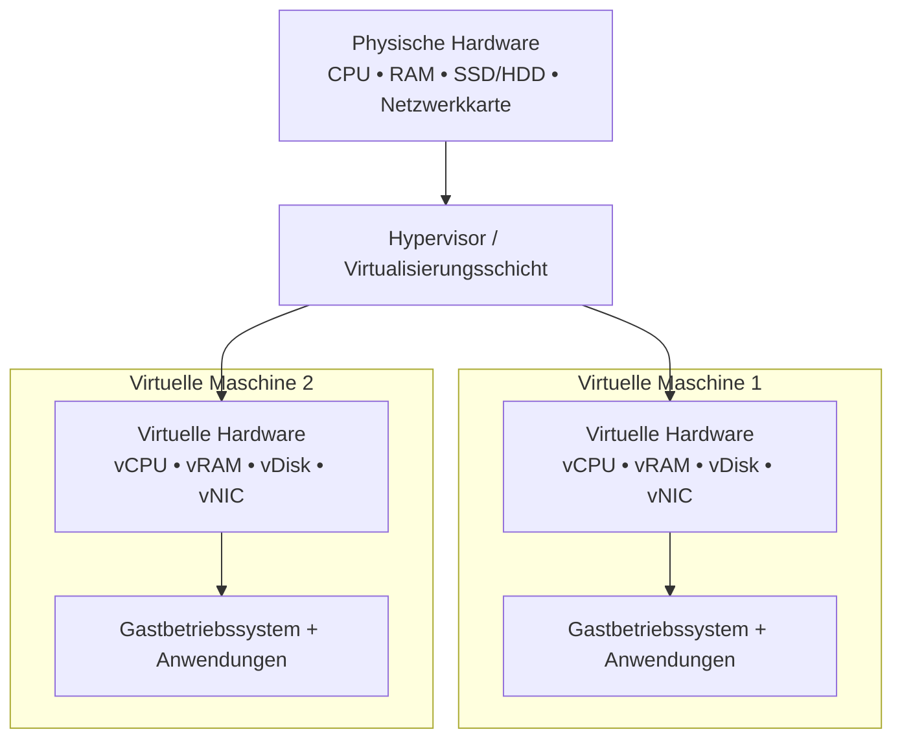
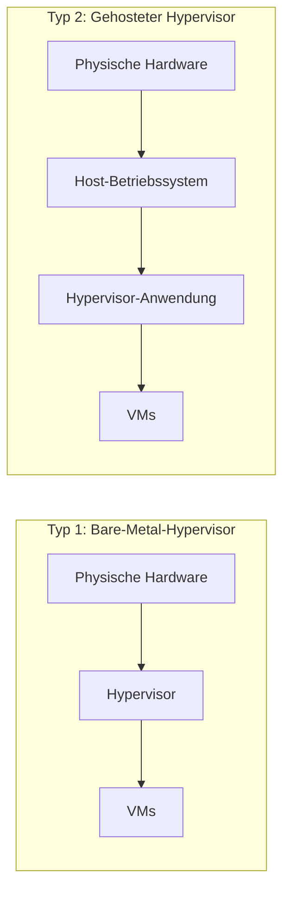
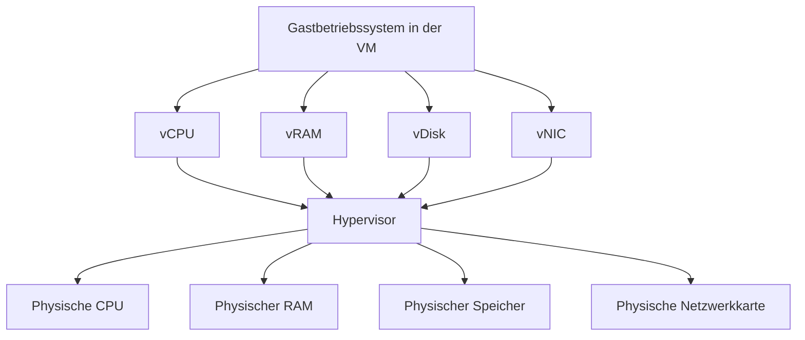

###### Themen

Grundlagen der Virtualisierung

- Definition und Bedeutung von Virtualisierung
- Unterschied zwischen physischer und virtueller Hardware
- Typische Einsatzgebiete von Virtualisierung
- Vorteile von Virtualisierung für Anwender und Unternehmen

Hypervisoren und virtuelle Hardware

- Unterschied zwischen Hypervisor Typ 1 und Typ 2 im Überblick
- Beispiele für Virtualisierungssoftware
- Virtuelle CPU, Arbeitsspeicher, Festplatte und Netzwerkkarte grundlegend verstehen

   
# 🧠 Grundlagen der Virtualisierung

Virtualisierung ist eines der wichtigsten Grundkonzepte in der modernen IT. Wenn du sie einmal wirklich verstanden hast, werden dir viele andere Themen viel leichter fallen: Server, Cloud, Container, Testumgebungen, Netzwerke und sogar IT-Sicherheit. Der Kern der Idee ist überraschend einfach: **Aus einem echten physischen Computer werden per Software mehrere „virtuelle Computer“ gemacht**, die sich wie eigene, unabhängige Systeme verhalten. Genau diese softwarebasierte Abstraktion von Rechenressourcen ist der Kern von Virtualisierung ([What is virtualization?](https://www.redhat.com/en/topics/virtualization/what-is-virtualization)).

Man kann sich das wie ein großes Mehrfamilienhaus vorstellen. Die **physische Hardware** ist das Gebäude selbst. Die **virtuellen Maschinen** sind die Wohnungen darin. Jede Wohnung wirkt nach außen wie ein eigener, vollständiger Bereich mit eigener Nutzung, obwohl alle dasselbe Gebäude teilen. In der IT bedeutet das: Mehrere virtuelle Systeme teilen sich dieselbe CPU, denselben Arbeitsspeicher, dieselbe Festplatte und dieselbe Netzwerkanbindung eines realen Rechners, ohne dass sie für den Benutzer wie „geteilt“ aussehen müssen ([Virtualization](https://www.ibm.com/think/topics/virtualization)).

   
## 📘 Definition und Bedeutung von Virtualisierung

Virtualisierung bedeutet, dass **Hardware-Ressourcen nicht mehr nur direkt und exklusiv von einem einzigen Betriebssystem genutzt werden**, sondern dass eine zusätzliche Software-Schicht diese Ressourcen aufteilt, verwaltet und mehreren virtuellen Systemen zur Verfügung stellt. Diese Schicht heißt in der Regel **Hypervisor**. Durch sie kann auf einem einzigen physischen Rechner mehr als ein Betriebssystem gleichzeitig laufen, zum Beispiel Windows, Linux und ein weiteres Linux nebeneinander ([What is virtualization?](https://www.redhat.com/en/topics/virtualization/what-is-virtualization)).

Die Bedeutung von Virtualisierung ist riesig, weil sie mehrere Probleme gleichzeitig löst:

Ein physischer Server ist oft **nicht vollständig ausgelastet**. Früher wurde für viele Anwendungen ein eigener Server gekauft. Das führte oft dazu, dass ein Server vielleicht nur 10 bis 20 Prozent seiner Leistung wirklich nutzte. Mit Virtualisierung kann man mehrere Systeme auf einem Server zusammenfassen und die Hardware viel effizienter ausnutzen ([Virtualization](https://www.ibm.com/think/topics/virtualization)).

Außerdem schafft Virtualisierung **Flexibilität**. Eine virtuelle Maschine ist am Ende im Grunde eine softwaredefinierte Umgebung. Dadurch kann sie leichter kopiert, verschoben, gesichert, neu gestartet oder für Tests neu erstellt werden als ein kompletter physischer Rechner ([What is virtualization?](https://www.redhat.com/en/topics/virtualization/what-is-virtualization)).

Noch wichtiger: Virtualisierung ist eine **Grundlage des Cloud Computings**. Wenn du in der Cloud einen Server „buchst“, bekommst du sehr oft nicht direkt nackte Hardware, sondern eine virtuelle Maschine, die auf echter Hardware in einem Rechenzentrum läuft ([Virtualization](https://www.ibm.com/think/topics/virtualization)).

Wenn du das technisch in einem Satz merken willst, dann so:

**Virtualisierung trennt die Sicht des Betriebssystems auf Hardware von der echten, physischen Hardware.**  
Das Betriebssystem „glaubt“, es habe einen eigenen Computer — tatsächlich arbeitet es aber in einer virtuellen Umgebung.

   
## 🖥️ Unterschied zwischen physischer und virtueller Hardware

Der Unterschied zwischen physischer und virtueller Hardware ist einer der wichtigsten Punkte überhaupt.

**Physische Hardware** ist alles, was tatsächlich als echtes Bauteil vorhanden ist:  
ein echter Prozessor, echte RAM-Module, echte SSDs oder HDDs, echte Netzwerkkarten, echte Mainboards.

**Virtuelle Hardware** dagegen ist eine **softwareseitig bereitgestellte Nachbildung oder Abstraktion** dieser Komponenten. Die virtuelle Maschine sieht zum Beispiel eine CPU, Arbeitsspeicher, eine Festplatte und eine Netzwerkkarte. Diese Geräte sind aber nicht unbedingt „eigene echte Bauteile“, sondern werden vom Hypervisor bereitgestellt und auf die echte Hardware abgebildet ([What is virtualization?](https://www.redhat.com/en/topics/virtualization/what-is-virtualization)).

Das ist wichtig:  
Die virtuelle Maschine arbeitet **so, als hätte sie einen echten Computer vor sich**. Für das Gastbetriebssystem macht das im Alltag oft kaum einen Unterschied. Windows oder Linux in der VM installiert Treiber, nutzt Speicher, schreibt auf Festplatten und sendet Netzwerkpakete — aber all das läuft über die Virtualisierungsschicht.

Eine einfache Gegenüberstellung hilft:

| Aspekt | Physische Hardware | Virtuelle Hardware |
|---|---|---|
| Existenz | Echt als Bauteil vorhanden | Per Software bereitgestellt |
| Zugriff | Betriebssystem greift direkt oder fast direkt darauf zu | Zugriff läuft über Hypervisor |
| Anzahl | Meist genau einmal vorhanden | Kann in viele virtuelle Instanzen aufgeteilt werden |
| Flexibilität | Umbauten oft manuell | Konfiguration meist per Klick oder Datei |
| Portabilität | Gerät muss physisch bewegt werden | VM kann oft als Datei oder Image verschoben werden |
| Typische Sicht des OS | „Das ist mein echter Rechner“ | „Das ist mein Rechner“ – obwohl er nur virtuell ist |

Ein klassisches Beispiel:  
Ein physischer Server hat vielleicht **32 CPU-Kerne und 128 GB RAM**. Darauf können dann zum Beispiel **acht virtuelle Maschinen** laufen. Eine VM bekommt 4 vCPUs und 16 GB RAM, eine andere 8 vCPUs und 32 GB RAM, eine dritte nur 2 vCPUs und 4 GB RAM. Keine dieser VMs „weiß“ zwingend, wie der gesamte physische Server aussieht. Jede sieht nur die ihr zugewiesene virtuelle Hardware.

Das folgende Schaubild zeigt die Schichten:

   
### 🧱 Schichtenmodell: Von echter zu virtueller Hardware

Die wichtigste Lernidee dabei ist:  
**Virtuelle Hardware ist keine Fantasiehardware, sondern eine kontrollierte, softwaregesteuerte Sicht auf echte Ressourcen.**

   
## 🏢 Typische Einsatzgebiete von Virtualisierung

Virtualisierung wird nicht nur in großen Rechenzentren verwendet. Sie begegnet dir in sehr vielen Situationen.

Ein zentrales Einsatzgebiet ist die **Server-Konsolidierung**. Dabei werden mehrere bisher getrennte Server als virtuelle Maschinen auf weniger physische Hosts zusammengelegt. Das spart Hardware, Strom, Platz und Verwaltungsaufwand ([Virtualization](https://www.ibm.com/think/topics/virtualization)).

Ein weiteres großes Feld sind **Test- und Entwicklungsumgebungen**. Entwickler, Administratoren und Lernende können schnell eine neue VM erstellen, dort Software ausprobieren, Fehler reproduzieren oder riskante Änderungen testen, ohne ihren eigentlichen Rechner oder produktive Systeme zu gefährden. Genau deshalb sind Virtualisierer auf Desktop-Systemen wie VirtualBox oder VMware Workstation in Ausbildung und Entwicklung so beliebt ([Oracle VM VirtualBox User Manual, Chapter 1. First steps](https://www.virtualbox.org/manual/ch01.html)).

Auch **alte oder spezielle Software** wird oft virtualisiert. Manche Anwendungen laufen nur auf bestimmten Betriebssystemversionen oder benötigen eine ältere Umgebung. Statt dafür einen alten physischen PC weiterzupflegen, kann man die nötige Umgebung als VM betreiben.

Im Unternehmensumfeld ist außerdem **Desktop-Virtualisierung** wichtig. Dabei arbeitet ein Benutzer nicht direkt auf einem lokalen PC, sondern auf einem virtuellen Desktop im Rechenzentrum. Das erleichtert Verwaltung, Standardisierung und Sicherheit.

Sehr wichtig ist auch die **Cloud**. Viele Cloud-Server sind virtuelle Maschinen. Wenn ein Unternehmen in wenigen Minuten zehn neue Server bereitstellen will, geschieht das oft durch das Starten neuer VMs auf vorhandener Hardware.

Einige typische Einsatzgebiete im Überblick:

| Einsatzgebiet | Warum Virtualisierung hier nützlich ist |
|---|---|
| Serverbetrieb | Mehrere Dienste auf weniger Hardware |
| Entwicklung & Test | Schnell neue Umgebungen erzeugen |
| Schulung & Lernen | Gefahrloses Ausprobieren |
| Legacy-Systeme | Alte Software weiter nutzbar halten |
| Cloud-Infrastruktur | Schnelle Bereitstellung von Servern |
| Desktop-Virtualisierung | Zentrale Verwaltung von Arbeitsplätzen |
| IT-Sicherheit | Isolierte Analyse- oder Sandbox-Umgebungen |

Gerade für das Lernen ist Virtualisierung extrem wertvoll. Du kannst mehrere Betriebssysteme auf einem einzigen Rechner betreiben, Netzwerke simulieren, Serverdienste ausprobieren und Fehler machen, ohne gleich dein Hauptsystem zu beschädigen. Das ist einer der größten praktischen Vorteile für Einsteiger und Fortgeschrittene.

   
## 🌟 Vorteile von Virtualisierung für Anwender und Unternehmen

Virtualisierung hat Vorteile auf zwei Ebenen: für einzelne Anwender und für Unternehmen.

Für **Anwender** ist der größte Vorteil meist die **Flexibilität**. Du kannst auf demselben Rechner mehrere Betriebssysteme parallel nutzen. Wenn du zum Beispiel Windows als Hauptsystem hast, kannst du zusätzlich Linux in einer VM betreiben. Das ist ideal zum Lernen, Entwickeln oder Testen.

Ein weiterer Vorteil ist die **Isolation**. Wenn in einer virtuellen Maschine etwas schiefgeht — etwa ein Softwarefehler, ein Fehlversuch bei einer Konfiguration oder sogar Schadsoftware in einer Testumgebung — dann bleibt das Hauptsystem oft besser geschützt, weil die VM in ihrer eigenen Umgebung läuft. Virtualisierung unterstützt diese Trennung von Workloads ausdrücklich ([What is virtualization?](https://www.redhat.com/en/topics/virtualization/what-is-virtualization)).

Außerdem sind VMs oft **einfacher zu sichern, zu kopieren und zu klonen** als physische Systeme, weil sie softwarebasiert sind ([Virtualization](https://www.ibm.com/think/topics/virtualization)). Das ist für Lernende, Entwickler und Admins enorm praktisch.

Für **Unternehmen** liegen die Vorteile zusätzlich in Wirtschaftlichkeit und Betrieb:

| Perspektive | Vorteil | Erklärung |
|---|---|---|
| Anwender | Mehrere Systeme gleichzeitig | Ein Rechner kann mehrere Betriebssysteme beherbergen |
| Anwender | Sichere Testumgebungen | Änderungen bleiben eher lokal in der VM |
| Anwender | Einfaches Lernen | Server, Netzwerke und Clients lassen sich simulieren |
| Unternehmen | Bessere Hardware-Auslastung | Weniger Leerlauf auf Servern |
| Unternehmen | Geringere Kosten | Weniger Geräte, Strom, Platz, Kühlung |
| Unternehmen | Schnellere Bereitstellung | Neue VMs lassen sich in Minuten anlegen |
| Unternehmen | Einfachere Verwaltung | Standardisierte Images und zentrale Steuerung |
| Unternehmen | Höhere Agilität | Systeme lassen sich schneller an neue Anforderungen anpassen |

Ein besonders wichtiger Punkt ist die **Skalierbarkeit**. Wenn zusätzliche Ressourcen gebraucht werden, kann man einer VM oft mehr RAM, mehr CPUs oder mehr Speicherplatz zuweisen, ohne sofort neue physische Hardware einzubauen — solange der Host genug Reserven hat.

Ebenso wichtig ist die **Verfügbarkeit**. In vielen professionellen Virtualisierungsplattformen können VMs leichter verschoben, neu gestartet oder in Sicherungskonzepte eingebunden werden als physische Einzelsysteme. Das macht den Betrieb robuster und schneller administrierbar.

Aber: Virtualisierung ist **kein kostenloser Zaubertrick**. Alle VMs teilen sich echte Ressourcen. Wenn der Host überlastet ist, leiden alle VMs mit. Virtualisierung erhöht also die Effizienz — sie erschafft aber keine zusätzliche physische Leistung aus dem Nichts. Genau das ist ein wichtiger Denkfehler, den man früh vermeiden sollte.

   
# ⚙️ Hypervisoren und virtuelle Hardware

Wenn Virtualisierung die Grundidee ist, dann ist der **Hypervisor** die technische Schlüsselschicht, die alles zusammenhält. Er erstellt und verwaltet virtuelle Maschinen und sorgt dafür, dass diese CPU, Arbeitsspeicher, Festplatten und Netzwerke nutzen können, ohne direkt unkontrolliert auf die echte Hardware zuzugreifen ([Hyper-V technology overview](https://learn.microsoft.com/en-us/windows-server/virtualization/hyper-v/hyper-v-technology-overview)).

   
## 🧭 Was ein Hypervisor eigentlich macht

Ein Hypervisor hat mehrere Aufgaben gleichzeitig:

Er **stellt virtuelle Hardware bereit**.  
Er **verteilt physische Ressourcen** auf verschiedene VMs.  
Er **trennt die VMs voneinander**, damit sie sich nicht direkt gegenseitig stören.  
Er **verwaltet Start, Stopp, Konfiguration und oft auch Snapshots oder Migrationen**.

Anders gesagt:  
Der Hypervisor ist wie ein sehr intelligenter Ressourcenmanager zwischen echter Hardware und virtuellen Maschinen.

Ohne Hypervisor gäbe es zwar Emulation oder andere Speziallösungen, aber keine klassische, moderne Virtualisierung in dem Sinne, wie sie heute in Rechenzentren, auf Desktop-Rechnern oder in der Cloud eingesetzt wird.

   
## ⚖️ Unterschied zwischen Hypervisor Typ 1 und Typ 2 im Überblick

Der Unterschied zwischen **Typ 1** und **Typ 2** ist vor allem eine Frage der Architektur.

Ein **Typ-1-Hypervisor** läuft **direkt auf der physischen Hardware**. Er sitzt also ganz unten auf dem System und verwaltet darüber die virtuellen Maschinen. Deshalb nennt man ihn oft auch **Bare-Metal-Hypervisor**. Microsoft beschreibt Hyper-V als Virtualisierungstechnologie, die eine Hypervisor-basierte Architektur nutzt ([Hyper-V technology overview](https://learn.microsoft.com/en-us/windows-server/virtualization/hyper-v/hyper-v-technology-overview)).

Ein **Typ-2-Hypervisor** läuft **nicht direkt auf der Hardware**, sondern auf einem bereits installierten Host-Betriebssystem wie Windows, Linux oder macOS. Oracle beschreibt VirtualBox genau als Virtualisierungsanwendung, die auf bestehenden Host-Betriebssystemen läuft ([Oracle VM VirtualBox User Manual, Chapter 1. First steps](https://www.virtualbox.org/manual/ch01.html)).

Das klingt erst einmal nach einem kleinen Unterschied, ist aber in der Praxis sehr wichtig.

Beim Typ 1 ist die Kette vereinfacht:

**Hardware → Hypervisor → Virtuelle Maschinen**

Beim Typ 2 ist die Kette länger:

**Hardware → Host-Betriebssystem → Hypervisor-Anwendung → Virtuelle Maschinen**

Das kann man sich so vorstellen:

   
### 🧱 Architekturvergleich: Typ 1 und Typ 2

Der praktische Unterschied ist folgender:

Ein Typ-1-Hypervisor ist meist stärker auf **Leistung, Stabilität und professionellen Betrieb** ausgelegt. Deshalb ist er typisch für Rechenzentren, Serverfarmen und Cloud-Umgebungen.

Ein Typ-2-Hypervisor ist besonders praktisch für **Desktop-Nutzung, Lernen, Entwicklung und Tests**, weil er sich einfach wie eine normale Anwendung installieren und nutzen lässt.

Hier die Unterschiede sauber nebeneinander:

| Merkmal | Typ 1 | Typ 2 |
|---|---|---|
| Läuft auf | Direkt auf der Hardware | Auf einem Host-Betriebssystem |
| Typischer Einsatz | Server, Rechenzentrum, Produktion | Desktop, Test, Lernen, Entwicklung |
| Leistung | Meist effizienter und näher an der Hardware | Etwas mehr Overhead durch Host-OS |
| Verwaltung | Professioneller, oft zentralisiert | Einfacher Einstieg, oft lokal |
| Beispielidee | „Server-Virtualisierung“ | „VM als Programm auf meinem PC“ |

Wichtig ist:  
**Typ 2 ist nicht „schlecht“.** Er ist nur anders gedacht. Für Lernen, Labore, Demo-Umgebungen und Softwaretests ist Typ 2 oft sogar die praktischere Wahl. Für hochverfügbare Unternehmensplattformen ist Typ 1 in der Regel die passendere Lösung.

   
### 🧠 Warum der Unterschied wichtig ist

Wenn du gerade erst lernst, hilft dir folgende Faustregel:

- **Willst du auf deinem eigenen Rechner einfach VMs starten?**  
  Dann begegnet dir oft ein Typ-2-Hypervisor.

- **Willst du verstehen, wie Unternehmen viele Server zentral virtualisieren?**  
  Dann arbeitest du gedanklich eher mit Typ-1-Hypervisoren.

Der Unterschied beeinflusst auch Dinge wie Leistung, Sicherheitsmodell, Ressourcenverwaltung und Professionalität des Betriebs. Je näher die Virtualisierungsschicht an der echten Hardware sitzt, desto direkter und kontrollierter kann sie arbeiten.

   
## 🛠️ Beispiele für Virtualisierungssoftware

Es gibt viele Virtualisierungslösungen. Einige sind eher für Rechenzentren gedacht, andere eher für Arbeitsplatzrechner.

Im professionellen Serverumfeld sind besonders verbreitet:

- **VMware vSphere / ESXi**, eine etablierte Plattform für Server-Virtualisierung ([VMware vSphere Documentation](https://docs.vmware.com/en/VMware-vSphere/index.html))
- **Microsoft Hyper-V**, stark im Windows- und Windows-Server-Umfeld ([Hyper-V technology overview](https://learn.microsoft.com/en-us/windows-server/virtualization/hyper-v/hyper-v-technology-overview))
- **KVM**, eine im Linux-Kernel verankerte Virtualisierungstechnologie ([Kernel-based Virtual Machine (KVM)](https://www.kernel.org/doc/html/latest/virt/kvm/index.html))

Auf Desktop- und Testsystemen sind häufig:

- **Oracle VM VirtualBox**, sehr beliebt zum Lernen und für private Labore ([Oracle VM VirtualBox User Manual, Chapter 1. First steps](https://www.virtualbox.org/manual/ch01.html))
- **VMware Workstation** oder **VMware Fusion**
- **Parallels Desktop** auf macOS

Eine sinnvolle Einordnung ist:

| Software | Typische Einordnung | Häufiger Einsatz |
|---|---|---|
| VMware ESXi | Eher Typ 1 | Rechenzentrum, Serverbetrieb |
| Microsoft Hyper-V | Typ 1-orientiert | Windows-Server, Unternehmen |
| KVM | Kernelnahe Virtualisierung | Linux-Server, Cloud, Hosting |
| Oracle VirtualBox | Typ 2 | Lernen, Entwicklung, Tests |
| VMware Workstation | Typ 2 | Desktop-Virtualisierung |
| Parallels Desktop | Typ 2 | macOS-Desktop mit Gast-OS |

Wenn du gerade mit dem Thema beginnst, ist VirtualBox oder eine ähnliche Desktop-Lösung oft der leichteste Einstieg. Wenn du dagegen das Unternehmensumfeld verstehen willst, solltest du dir Hyper-V, ESXi oder KVM anschauen.

   
## 🧩 Virtuelle CPU, Arbeitsspeicher, Festplatte und Netzwerkkarte grundlegend verstehen

Virtuelle Maschinen wirken nur deshalb wie echte Computer, weil ihnen **virtuelle Hardware-Komponenten** zugewiesen werden. Die wichtigsten davon sind:

- virtuelle CPU
- virtueller Arbeitsspeicher
- virtuelle Festplatte
- virtuelle Netzwerkkarte

Das Gastbetriebssystem sieht diese Komponenten so, als wären sie echte Geräte. Der Hypervisor sorgt dann im Hintergrund dafür, dass diese virtuellen Geräte mit den echten physischen Ressourcen verbunden werden.

   
### 🔢 Virtuelle CPU (vCPU)

Die **vCPU** ist die virtuelle Form eines Prozessors, die einer VM zugewiesen wird. Wenn du einer VM zum Beispiel **2 vCPUs** gibst, dann sieht das Gastbetriebssystem typischerweise zwei logische Prozessoren, mit denen es arbeiten kann.

Wichtig ist dabei:  
Eine vCPU ist **nicht automatisch dasselbe wie ein fest reservierter physischer CPU-Kern**. Vielmehr plant und verteilt der Hypervisor Rechenzeit auf den echten Prozessoren. Die vCPU ist also in erster Linie eine **virtuelle Recheneinheit**, die vom Hypervisor auf reale CPU-Zeit abgebildet wird.

Das ist ein ganz typischer Anfängerfehler:  
Viele denken, „4 vCPUs“ bedeute immer „4 echte Kerne nur für diese VM“. Das muss nicht so sein. Es kann so konfiguriert sein, ist aber nicht die Standardbedeutung.

Praktisch bedeutet das:

- Mehr vCPUs können einer VM mehr parallele Rechenarbeit ermöglichen.
- Zu viele vCPUs können aber auch unnötig sein, wenn die Anwendung sie gar nicht nutzt.
- Wenn viele VMs gleichzeitig CPU benötigen, konkurrieren sie um die echte Prozessorleistung des Hosts.

Du kannst dir eine vCPU wie einen **Arbeitsplatz in einer Werkstatt** vorstellen. Viele Arbeitsplätze können vorhanden sein, aber am Ende müssen sie alle von den real vorhandenen Maschinen und Ressourcen der Werkstatt bedient werden.

   
### 🧠 Virtueller Arbeitsspeicher (vRAM)

Der **virtuelle Arbeitsspeicher** ist der RAM, den du einer VM zuweist. Wenn du einer VM 8 GB RAM gibst, dann sieht das Gastbetriebssystem diese 8 GB so, als wären sie der eingebaute Hauptspeicher des Rechners.

Auch hier gilt:  
Die VM arbeitet mit einer **virtuellen Sicht** auf Speicher, aber dahinter steht echter physischer RAM des Hosts.

Der Arbeitsspeicher ist oft einer der entscheidenden Engpässe bei Virtualisierung. CPU kann man zeitlich verteilen, aber RAM muss tatsächlich irgendwo vorhanden sein. Wenn du zu viele VMs mit zu viel RAM startest, kommt selbst ein starker Host schnell an seine Grenzen.

Für das Verständnis reicht zunächst diese Denkweise:

- **vRAM ist der aus Sicht der VM verfügbare Arbeitsspeicher**
- **physischer RAM ist der tatsächlich im Host eingebaute Speicher**
- der Hypervisor vermittelt zwischen beiden

Wenn du einer VM zu wenig RAM gibst, wird das Gastbetriebssystem langsam. Wenn du zu viel RAM vergibst, fehlt dieser Speicher möglicherweise anderen VMs oder dem Host selbst.

   
### 💾 Virtuelle Festplatte (vDisk)

Die **virtuelle Festplatte** ist für die VM das, was eine echte SSD oder HDD für einen physischen Rechner ist. Auf ihr liegen Betriebssystem, Programme, Konfigurationsdateien und Nutzdaten.

Für die VM fühlt sich das an wie ein normales Laufwerk. Sie kann es partitionieren, formatieren und Daten darauf speichern. In Wirklichkeit steckt dahinter aber oft einfach eine **Datei auf dem Hostsystem** oder ein durch den Hypervisor bereitgestellter Speicherbereich.

Typische Dateiformate virtueller Festplatten sind zum Beispiel:

| Format | Häufiges Umfeld |
|---|---|
| VDI | VirtualBox |
| VMDK | VMware |
| VHD / VHDX | Microsoft |
| qcow2 | KVM/QEMU |

Wichtig zu verstehen ist:

Die virtuelle Festplatte ist **kein „Scheinlaufwerk“**, sondern aus Sicht des Gastbetriebssystems ein ganz normales Blockspeichergerät. Der Unterschied ist nur, dass dieses Gerät softwareseitig abgebildet wird.

Die Leistung einer VM hängt dabei oft stark vom darunterliegenden echten Speicher ab. Eine VM mit schneller virtueller Festplatte auf langsamer physischer HDD wird trotzdem langsam sein. Die virtuelle Ebene kann also viel abstrahieren, aber die physische Realität bleibt entscheidend.

   
### 🌐 Virtuelle Netzwerkkarte (vNIC)

Die **virtuelle Netzwerkkarte** — oft **vNIC** genannt — ist die Netzwerkverbindung der VM. Für das Gastbetriebssystem sieht sie wie eine normale Netzwerkkarte aus. Die VM kann damit IP-Adressen nutzen, Pakete senden, Serverdienste anbieten oder auf andere Systeme zugreifen.

Im Hintergrund verbindet der Hypervisor diese virtuelle Netzwerkkarte mit einem **virtuellen Switch** oder direkt mit bestimmten Netzwerkmodi. VirtualBox dokumentiert zum Beispiel verschiedene Netzwerkmodi wie NAT, Bridged und Host-only ([Oracle VM VirtualBox User Manual, Chapter 6. Virtual networking](https://www.virtualbox.org/manual/ch06.html)).

Die Grundidee dieser Modi ist:

| Modus | Einfach erklärt |
|---|---|
| NAT | Die VM kommt ins Netzwerk über den Host, ähnlich wie hinter einem Router |
| Bridged | Die VM hängt direkter im gleichen Netz wie andere Geräte |
| Host-only | Die VM kommuniziert nur mit dem Host oder einem isolierten virtuellen Netz |
| Internes Netzwerk | Nur VMs untereinander, ohne externen Zugriff |

Für das Grundverständnis reicht Folgendes:

- Die VM hat eine virtuelle Netzwerkkarte.
- Diese Karte wird an eine virtuelle Netzwerkinfrastruktur des Hypervisors angebunden.
- Darüber gelangt die VM ins Internet, in ein Firmennetz oder in ein isoliertes Testnetz.

Gerade für Lernumgebungen ist das mächtig. Du kannst mit wenigen Klicks ein kleines virtuelles Netzwerk aus mehreren Maschinen aufbauen, ohne zusätzliche echte Hardware zu kaufen.

   
### 🔄 Wie diese virtuelle Hardware zusammenspielt

Erst das Zusammenspiel macht aus einer VM einen „vollständigen Computer“:

- Die **vCPU** verarbeitet Anweisungen.
- Der **vRAM** hält laufende Daten und Programme bereit.
- Die **vDisk** speichert Daten dauerhaft.
- Die **vNIC** verbindet die VM mit Netzwerken.

Das Gastbetriebssystem merkt im Alltag meist nicht, dass es auf virtueller statt physischer Hardware läuft. Es bootet, lädt Treiber, startet Dienste und arbeitet mit Dateien und Netzwerkverbindungen fast so, wie es das auch auf echter Hardware tun würde.

Das folgende Schaubild fasst dieses Zusammenspiel gut zusammen:

   
### 🧩 Zusammenspiel der virtuellen Komponenten

Wenn du dieses Bild im Kopf behältst, verstehst du schon einen sehr großen Teil der Virtualisierung:

**Die VM bekommt keine „magischen“ Ressourcen, sondern virtuelle Stellvertreter echter Hardware.**  
Der Hypervisor ist die Übersetzungs- und Verwaltungsschicht dazwischen.

Das ist genau der Punkt, an dem Virtualisierung technisch greifbar wird — und ab hier lassen sich später auch fortgeschrittene Themen wie Snapshots, Live-Migration, Speicher-Overcommitment, virtuelle Switches oder Cloud-Instanzen viel leichter verstehen.