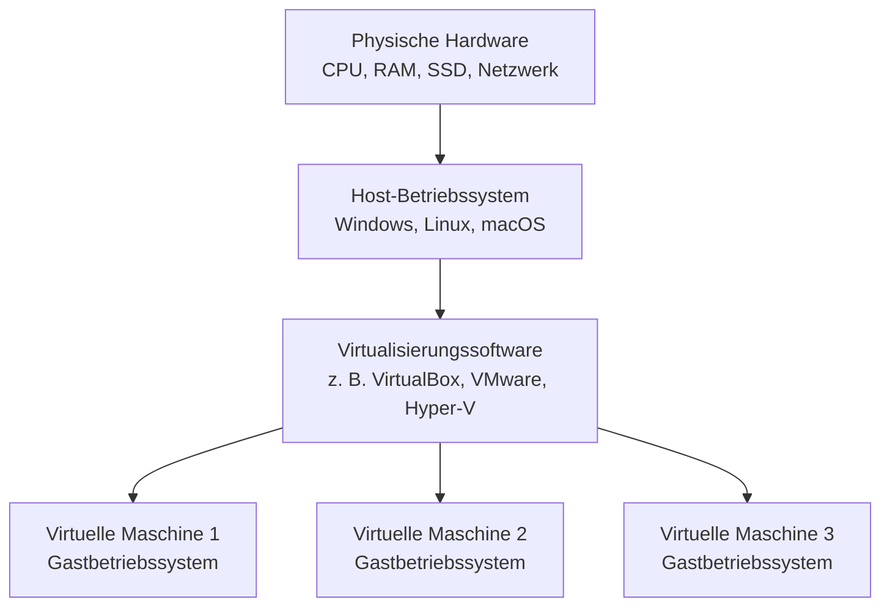
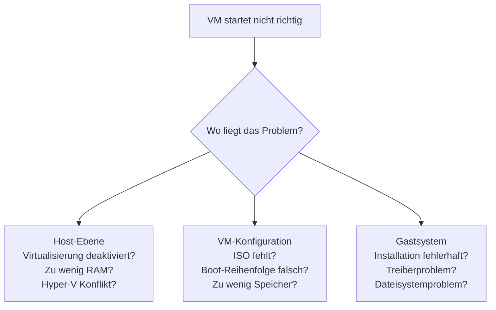

###### Themen

Virtualisierungssoftware einrichten

- Download und Installation einer Virtualisierungssoftware
- Grundlegende Voraussetzungen für den Einsatz auf dem eigenen System

Virtuelle Maschinen erstellen und konfigurieren

- Eine neue virtuelle Maschine anlegen
- CPU, RAM, Festplatte und Netzwerk zuweisen
- Grundlegende VM-Einstellungen anpassen

Erste Arbeiten mit der virtuellen Maschine

- Gastbetriebssystem starten und nutzen
- Einfache Konfigurations- und Startprobleme erkennen

   
# 🖥️ Virtualisierungssoftware einrichten

Virtualisierung bedeutet, dass du auf deinem echten Rechner – dem **Host-System** – einen oder mehrere **virtuelle Computer** laufen lässt. Diese virtuellen Computer nennt man **virtuelle Maschinen** oder kurz **VMs**. Jede VM verhält sich fast wie ein eigener echter PC: Sie kann ein eigenes Betriebssystem haben, eigene Programme ausführen und eigene Netzwerkeinstellungen nutzen.

Das Grundprinzip ist wichtig, weil es dir hilft, fast alle späteren Einstellungen zu verstehen:

Die Virtualisierungssoftware sitzt also **zwischen deinem echten Rechner und der virtuellen Maschine**. Sie verteilt Hardware-Ressourcen wie Arbeitsspeicher, Prozessorzeit, Festplattenspeicher und Netzwerk an die VM.

Virtualisierung ist besonders nützlich, wenn du:

- ein anderes Betriebssystem testen willst,
- sauber und isoliert lernen möchtest,
- Software gefahrlos ausprobieren willst,
- Server, Netzwerke oder Entwicklungsumgebungen nachbauen möchtest.

Dass VirtualBox verschiedene Host- und Gastbetriebssysteme unterstützt, wird direkt im offiziellen Handbuch beschrieben ([Oracle VM VirtualBox User Manual – Introduction](https://www.virtualbox.org/manual/UserManual.html)). Auch Microsoft beschreibt den Einsatz von virtuellen Maschinen und Hyper-V als Möglichkeit, mehrere Betriebssysteme auf einem Gerät auszuführen ([What is Hyper-V on Windows?](https://learn.microsoft.com/windows-server/virtualization/hyper-v/hyper-v-overview)).

   
## 📥 Download und Installation einer Virtualisierungssoftware

Bevor du eine VM anlegen kannst, brauchst du eine passende Virtualisierungssoftware. Für Einsteiger sind vor allem diese Lösungen relevant:

| Software | Geeignet für | Besonderheiten |
|---|---|---|
| **Oracle VM VirtualBox** | Windows, Linux, macOS | Sehr verbreitet, gut zum Lernen, grafisch einfach |
| **VMware Workstation Player / Pro** | Vor allem Windows und Linux | Sehr stabil, oft im professionellen Umfeld genutzt |
| **Hyper-V** | Windows Pro, Enterprise, Education | In Windows integriert, gut für Microsoft-Umgebungen |
| **KVM/QEMU** | Vor allem Linux | Sehr leistungsfähig, eher technischer |

Wenn du gerade lernst, ist **VirtualBox** oft die einfachste Wahl, weil die Oberfläche übersichtlich ist und viele Lerninhalte dazu existieren. Die offizielle Installations- und Grundbeschreibung findest du im VirtualBox-Handbuch ([Oracle VM VirtualBox User Manual](https://www.virtualbox.org/manual/UserManual.html)).

### Wie du die passende Software auswählst

Die Auswahl hängt stark von deinem Host-System ab:

- **Windows Home**: VirtualBox ist oft am einfachsten, weil Hyper-V dort meist nicht vollständig verfügbar ist.
- **Windows Pro/Enterprise/Education**: Du kannst Hyper-V oder VirtualBox nutzen.
- **Linux**: VirtualBox oder KVM/QEMU sind üblich.
- **macOS**: VirtualBox ist möglich, bei neueren Apple-Silicon-Systemen gelten aber zusätzliche Einschränkungen je nach Tool. Hier ist sorgfältiges Prüfen der jeweiligen Herstellerdokumentation wichtig.

Wichtig ist: Nicht jede Virtualisierungssoftware arbeitet auf jedem System gleich gut. Gerade auf Windows kann **Hyper-V** Einfluss auf andere Virtualisierungslösungen haben. Microsoft beschreibt, dass Hyper-V eine eigene Virtualisierungsplattform bereitstellt ([Introduction to Hyper-V on Windows](https://learn.microsoft.com/windows-server/virtualization/hyper-v/get-started/Install-Hyper-V)).

### Typischer Ablauf beim Download und bei der Installation

In der Praxis läuft die Installation fast immer ähnlich ab:

1. Du gehst auf die offizielle Herstellerseite.
2. Du lädst die Version für dein Host-Betriebssystem herunter.
3. Du startest die Installationsdatei.
4. Du bestätigst Standardoptionen, wenn du noch keine besonderen Anforderungen hast.
5. Du erlaubst gegebenenfalls die Installation von Netzwerktreibern oder Host-Komponenten.
6. Nach Abschluss startest du die Software.

Gerade bei VirtualBox ist es normal, dass während der Installation zusätzliche Komponenten wie Netzwerkadapter-Treiber eingerichtet werden. Diese werden benötigt, damit VMs später eigene virtuelle Netzwerkschnittstellen nutzen können ([Oracle VM VirtualBox User Manual – Networking](https://www.virtualbox.org/manual/ch06.html)).

### Was bei der Installation oft auffällt

Manche Nutzer wundern sich, dass während der Installation kurz die Netzwerkverbindung neu aufgebaut wird. Das ist normal, weil virtuelle Netzwerktreiber eingebunden werden. Die Software erzeugt dabei virtuelle Netzwerkadapter oder Dienste, damit eine VM später zum Beispiel:

- ins Internet kommt,
- mit dem Host kommuniziert,
- in einem isolierten Testnetz läuft.

Wenn die Installation abgeschlossen ist, solltest du die Software einmal leer starten, also noch ohne VM. So prüfst du, ob sie grundsätzlich korrekt läuft.

   
## ⚙️ Grundlegende Voraussetzungen für den Einsatz auf dem eigenen System

Nicht jeder Rechner ist automatisch gut für Virtualisierung geeignet. Eine VM ist zwar „virtuell“, aber sie nutzt **echte** Ressourcen deines Computers. Genau deshalb sind die Voraussetzungen so wichtig.

### Hardware-Virtualisierung: VT-x, AMD-V, SLAT

Moderne Virtualisierung braucht in der Regel Hardware-Unterstützung durch den Prozessor. Bei Intel heißt diese Technik meist **Intel VT-x**, bei AMD **AMD-V**. Microsoft nennt außerdem **Second Level Address Translation (SLAT)** als wichtige Voraussetzung für Hyper-V ([System requirements for Hyper-V on Windows](https://learn.microsoft.com/windows-server/virtualization/hyper-v/host-hardware-requirements)).

Einfach gesagt bedeutet das:

- Der Prozessor muss Virtualisierung **unterstützen**.
- Die Funktion muss oft im **BIOS/UEFI aktiviert** sein.
- Ohne diese Funktion startet manche VM gar nicht oder nur sehr eingeschränkt.

Wenn du also beim Erstellen oder Starten einer VM Fehlermeldungen wie „VT-x is disabled“ oder „AMD-V unavailable“ siehst, liegt das oft **nicht** an der VM selbst, sondern an einer Host-Einstellung.

### Arbeitsspeicher: Der häufigste Engpass

Eine VM braucht eigenen RAM. Dieser Speicher wird aus dem Arbeitsspeicher deines echten Rechners genommen. Wenn dein Rechner insgesamt 8 GB RAM hat und du einer VM 4 GB gibst, bleiben für das Host-System und andere Programme nur noch etwa 4 GB übrig.

Das führt schnell zu Problemen:

- Host-System wird langsam,
- VM läuft träge,
- Programme frieren ein,
- Festplatte wird wegen Auslagerung stark belastet.

Darum gilt als Grundregel:

- **4 GB RAM gesamt**: nur sehr kleine Tests sinnvoll
- **8 GB RAM gesamt**: einfache Linux-VMs gehen oft gut
- **16 GB RAM gesamt**: deutlich angenehmer für Lernzwecke
- **32 GB und mehr**: gut für mehrere VMs oder schwerere Systeme

### Prozessorleistung

Auch CPU-Kerne sind wichtig. Eine VM bekommt virtuelle Prozessoren zugewiesen, aber die Rechenleistung stammt immer vom echten Prozessor. Wenn dein Host nur wenige Kerne hat, solltest du nicht zu viele virtuelle CPUs vergeben.

Ein häufiger Anfängerfehler ist: „Ich gebe der VM einfach so viel wie möglich.“ Das ist fast immer schlecht. Der Host braucht ebenfalls Reserven. Wenn du dem Gast zu viel nimmst, leiden am Ende **beide**.

### Festplatte und Speicherplatz

Eine VM braucht Speicherplatz für:

- die virtuelle Festplattendatei,
- das Gastbetriebssystem,
- Updates,
- Programme,
- temporäre Dateien,
- eventuell Snapshots.

Die virtuelle Festplatte ist meist eine Datei auf deinem Host-System. Bei VirtualBox sind VDI-Dateien üblich, daneben werden auch andere Formate unterstützt ([Oracle VM VirtualBox User Manual – Virtual Storage](https://www.virtualbox.org/manual/ch05.html)).

Besonders wichtig:

- Eine **SSD** macht VMs deutlich schneller als eine HDD.
- Plane immer **Reserveplatz** ein.
- Wenn du Snapshots nutzt, steigt der Speicherverbrauch oft stark.

### BIOS/UEFI-Einstellungen

Falls Virtualisierung nicht funktioniert, solltest du im BIOS/UEFI nach Begriffen wie diesen suchen:

- Intel Virtualization Technology
- VT-x
- Intel VT-d
- SVM Mode
- AMD-V

Nicht jede Einstellung ist gleich wichtig, aber VT-x bzw. AMD-V ist meistens entscheidend.

### Host-Betriebssystem und Konflikte

Auf Windows kann es vorkommen, dass Funktionen wie **Hyper-V**, **Windows Hypervisor Platform** oder **Virtual Machine Platform** andere Virtualisierungslösungen beeinflussen. Microsoft dokumentiert, dass Hyper-V die Hypervisor-Schicht des Systems bereitstellt ([Hyper-V architecture](https://learn.microsoft.com/windows-server/virtualization/hyper-v/hyper-v-architecture)). Das ist wichtig, weil manche Tools dann nicht mehr direkt auf die Hardware zugreifen oder anders arbeiten als erwartet.

### Praktische Mindestprüfung vor dem Start

Bevor du überhaupt eine VM installierst, solltest du für dich diese Fragen beantworten:

| Frage | Warum sie wichtig ist |
|---|---|
| Unterstützt meine CPU Virtualisierung? | Sonst läuft die VM eventuell nicht |
| Ist Virtualisierung im BIOS/UEFI aktiviert? | Häufige Ursache bei Startfehlern |
| Habe ich genug RAM? | Sonst werden Host und VM sehr langsam |
| Habe ich genug SSD-/Festplattenspeicher? | Betriebssystem und Updates brauchen Platz |
| Gibt es Konflikte mit Hyper-V oder ähnlichen Funktionen? | Kann VirtualBox/VMware beeinflussen |
| Habe ich ein Installationsmedium für das Gast-OS? | Ohne ISO-Datei keine Installation |

Wenn diese Voraussetzungen sauber geklärt sind, sparst du dir später viele Fehlersuchen.

   
# 🧱 Virtuelle Maschinen erstellen und konfigurieren

Jetzt geht es um den eigentlichen Kern: Du legst eine neue virtuelle Maschine an und gibst ihr eine Form. Eine VM ist am Anfang nur ein leerer Container. Erst durch die richtige Konfiguration wird daraus ein nutzbarer virtueller Rechner.

Die genaue Oberfläche ist je nach Software etwas anders, aber die Grundidee ist fast überall gleich.

   
## 🆕 Eine neue virtuelle Maschine anlegen

Wenn du in einer Virtualisierungssoftware auf **Neu** oder **Create New Virtual Machine** klickst, wirst du normalerweise Schritt für Schritt durch einen Assistenten geführt.

### Name, Typ und Version

Zuerst gibst du meist einen Namen ein, zum Beispiel:

- `Ubuntu-Lernsystem`
- `Windows-TestVM`
- `Debian-Webserver`

Der Name ist nicht nur Kosmetik. Gute Namen helfen dir, später mehrere VMs auseinanderzuhalten. Gerade beim Lernen ist es sinnvoll, VMs nach Zweck zu benennen.

Danach wählst du aus, welches Gastbetriebssystem installiert werden soll, zum Beispiel:

- Linux
- Windows
- BSD
- Other

Und oft zusätzlich die Version, etwa Ubuntu 64-bit oder Windows 11. Diese Auswahl ist wichtig, weil die Virtualisierungssoftware dadurch passende Standardwerte setzt. VirtualBox beschreibt, dass bestimmte Standardkonfigurationen abhängig vom gewählten Betriebssystemtyp voreingestellt werden ([Oracle VM VirtualBox User Manual – Creating a Virtual Machine](https://www.virtualbox.org/manual/ch01.html#gui-createvm)).

### Das Installationsmedium: ISO-Datei

Eine neue VM ist leer. Damit du ein Betriebssystem installieren kannst, brauchst du normalerweise eine **ISO-Datei**. Das ist ein Abbild einer Installations-DVD oder eines Installationsmediums.

Beispiele:

- Ubuntu-ISO
- Debian-ISO
- Windows-ISO

Die ISO-Datei wird in der VM wie ein virtuelles DVD-Laufwerk eingebunden. Wenn die VM startet, bootet sie davon und beginnt die Installation des Gastbetriebssystems.

### Warum der VM-Typ wichtig ist

Ein Linux-Gast und ein Windows-Gast brauchen oft unterschiedliche Voreinstellungen. Dazu gehören zum Beispiel:

- empfohlene RAM-Menge,
- Standard-Chipsatz,
- Boot-Modus,
- Controller-Einstellungen,
- mögliche Grafikoptionen.

Wenn du aus Versehen den falschen Typ auswählst, ist das meist nicht katastrophal – aber es kann zu unnötigen Problemen oder schlechten Standardwerten führen.

### Sinnvolle Benennung für Lernzwecke

Gerade wenn du Core-Tech-Fundamentals aufbaust, solltest du von Anfang an Ordnung halten. Statt `VM1` oder `Test` sind bessere Namen etwa:

- `ubuntu-cli-grundlagen`
- `windows-lab-update-test`
- `debian-netzwerk-lernen`

So lernst du nicht nur Virtualisierung, sondern gleichzeitig auch **sauberes technisches Arbeiten**.

   
## 🧠 CPU, RAM, Festplatte und Netzwerk zuweisen

Das ist der wichtigste Schritt bei der Konfiguration. Hier entscheidest du, wie viel von deinem echten Rechner die virtuelle Maschine bekommt.

### CPU zuweisen

Eine VM kann eine oder mehrere virtuelle CPUs erhalten. Diese orientieren sich an den echten CPU-Kernen oder Threads deines Host-Systems.

Die goldene Regel lautet: **Gib der VM genug, aber nicht zu viel**.

Wenn dein Host zum Beispiel 8 logische CPUs hat, sind für eine einfache Lern-VM oft **1 bis 2 virtuelle CPUs** sinnvoll. Für schwerere Aufgaben können es auch mehr sein, aber du solltest dem Host immer genug Leistung lassen.

Warum zu viele CPUs schlecht sein können:

- Der Host hat zu wenig Reserven.
- Das Scheduling wird unnötig komplex.
- Die VM wird nicht automatisch schneller.
- Das ganze System kann unruhig oder verzögert reagieren.

### RAM zuweisen

RAM ist meistens der spürbarste Faktor. Zu wenig RAM macht eine VM langsam oder instabil. Zu viel RAM schadet dem Host.

Ein paar praxisnahe Richtwerte:

| Gastbetriebssystem | Typische Lern-Konfiguration |
|---|---|
| Kleine Linux-VM ohne GUI | 1–2 GB |
| Linux mit Desktop | 2–4 GB |
| Windows 10/11 zu Lernzwecken | 4–8 GB |
| Mehrere Dienste oder Entwicklungsumgebung | eher mehr, je nach Zweck |

Wichtig ist immer der Zusammenhang mit deinem Host. Eine Windows-VM mit 8 GB RAM ist nur dann sinnvoll, wenn dein echter Rechner selbst genug Speicher übrig hat.

### Virtuelle Festplatte erstellen

Fast jede VM braucht eine virtuelle Festplatte. Dabei legst du fest:

- **Dateiformat** der virtuellen Festplatte,
- **Speichergröße**,
- **dynamisch wachsend** oder **feste Größe**.

#### Dynamisch wachsend

Bei einer dynamisch wachsenden Platte wird nicht sofort der komplette Speicherplatz auf dem Host belegt. Die Datei wächst, wenn im Gast tatsächlich Daten geschrieben werden.

Vorteile:

- spart anfangs Speicherplatz,
- praktisch für Lernumgebungen,
- schnell eingerichtet.

Nachteil:

- kann bei sehr intensiver Nutzung etwas weniger vorhersehbar sein.

#### Feste Größe

Hier wird der gewählte Speicherplatz direkt reserviert.

Vorteile:

- oft etwas berechenbarer,
- in manchen Fällen performanter.

Nachteil:

- belegt sofort viel Speicherplatz.

VirtualBox beschreibt die Arbeit mit virtuellen Speichermedien und Festplattenformaten im Abschnitt zu Virtual Storage ([Oracle VM VirtualBox User Manual – Virtual Storage](https://www.virtualbox.org/manual/ch05.html)).

### Wie groß sollte die virtuelle Festplatte sein?

Das hängt stark vom Gastbetriebssystem ab:

- Kleine Linux-Testsysteme: oft **20–30 GB**
- Linux mit Desktop und Tools: **30–50 GB**
- Windows-Lernsysteme: eher **64 GB oder mehr**

Wichtig ist nicht nur die Erstinstallation. Betriebssystem-Updates, Log-Dateien, Browser-Caches und Programme brauchen mit der Zeit deutlich mehr Platz.

### Netzwerk zuweisen

Netzwerk klingt am Anfang kompliziert, lässt sich aber in einfachen Modi gut verstehen. Die wichtigsten Modi sind:

| Netzwerkmodus | Bedeutung | Typischer Einsatz |
|---|---|---|
| **NAT** | VM nutzt das Netzwerk des Hosts indirekt | Einfacher Internetzugang |
| **Bridged Adapter** | VM erscheint wie eigener Rechner im Netzwerk | Testen im echten LAN |
| **Host-Only** | Verbindung nur zwischen Host und VM | Isolierte Lernumgebung |
| **Internal Network** | Verbindung nur zwischen VMs | Labor-Netzwerke |

VirtualBox dokumentiert diese Netzwerkarten offiziell im Networking-Kapitel ([Oracle VM VirtualBox User Manual – Networking Modes](https://www.virtualbox.org/manual/ch06.html)).

#### NAT einfach erklärt

**NAT** ist für Einsteiger meist der beste Start. Die VM kommt ins Internet, aber ist im lokalen Netzwerk nicht so sichtbar wie ein eigener physischer Rechner. Das ist praktisch, weil es einfach funktioniert und relativ sicher für erste Tests ist.

#### Bridged einfach erklärt

Beim **Bridged-Modus** bekommt die VM eine stärkere Eigenständigkeit im echten Netzwerk. Sie wirkt dort eher wie ein eigener Computer. Das ist nützlich, wenn du Netzwerkdienste, Server oder Kommunikation mit anderen Geräten testen willst.

#### Host-Only einfach erklärt

**Host-Only** ist super zum Lernen in einer kontrollierten Umgebung. Die VM kann mit dem Host sprechen, aber nicht direkt ins Internet, wenn du keine zusätzliche Netzwerkkarte konfigurierst. Das eignet sich gut für saubere Laborumgebungen.

### Ein guter Start für Anfänger

Für eine erste Lern-VM ist diese Konfiguration meist sinnvoll:

- **1–2 vCPUs**
- **2–4 GB RAM** bei Linux, **4–8 GB** bei Windows
- **dynamische Festplatte**
- **20–50 GB** je nach Gast
- **NAT** als Netzwerkmodus

So bekommst du eine stabile, einfache und gut beherrschbare Basis.

   
## 🛠️ Grundlegende VM-Einstellungen anpassen

Nachdem die VM erstellt wurde, kannst du oft noch weitere Einstellungen anpassen. Diese wirken zunächst technisch, sind aber sehr wichtig.

### Boot-Reihenfolge

Die **Boot Order** bestimmt, wovon die VM beim Start zuerst bootet:

- optisches Laufwerk / ISO
- Festplatte
- Netzwerk

Für die Installation ist es sinnvoll, dass die ISO bzw. das virtuelle DVD-Laufwerk zuerst kommt. Nach erfolgreicher Installation kann es sinnvoll sein, die virtuelle Festplatte an erste Stelle zu setzen, damit die VM nicht jedes Mal wieder vom Installationsmedium booten will.

### EFI/UEFI oder Legacy BIOS

Moderne Betriebssysteme nutzen oft **UEFI** statt klassischem BIOS. Manche Virtualisierungslösungen erlauben dir, den Boot-Modus zu wählen. Wenn ein aktuelles Gastbetriebssystem Probleme beim Start hat, kann diese Einstellung relevant sein.

### Grafik und Anzeige

Gerade bei Desktop-Gastsystemen spielen Grafikoptionen eine Rolle:

- Videospeicher
- 2D-/3D-Beschleunigung
- Bildschirmauflösung
- Mehrere Monitore

Zu aggressive Grafikoptionen sind nicht immer besser. Für einfache Lernsysteme reichen oft konservative Standardeinstellungen. Wenn eine grafische Linux- oder Windows-VM ruckelt oder schwarz bleibt, lohnt sich ein Blick auf diese Optionen.

### Controller und virtuelle Hardware

Du kannst oft einstellen, welche virtuelle Hardware emuliert wird, etwa:

- SATA-Controller
- NVMe-Controller
- Audio
- USB-Unterstützung
- Zwischenablage
- Gemeinsame Ordner

Für Lernzwecke ist es sinnvoll, erstmal nur die Dinge zu aktivieren, die du wirklich brauchst. Jede zusätzliche Funktion erhöht ein wenig die Komplexität.

### Gemeinsame Zwischenablage und Drag & Drop

Viele Programme erlauben Komfortfunktionen zwischen Host und Gast, zum Beispiel:

- Text kopieren zwischen Host und VM,
- Dateien per Drag & Drop übertragen,
- gemeinsame Ordner nutzen.

Diese Funktionen sind praktisch, aber technisch gesehen durchbrechen sie ein Stück weit die saubere Trennung zwischen Host und Gast. In Lern- und Testumgebungen ist das okay, aber du solltest verstehen, dass es die Isolation reduziert.

### Guest Additions oder Tools

Viele Virtualisierungsprogramme bieten Zusatzpakete für das Gastbetriebssystem an, zum Beispiel:

- **VirtualBox Guest Additions**
- **VMware Tools**

Diese verbessern meist:

- Mausintegration,
- Bildschirmauflösung,
- Treiber,
- Zwischenablage,
- Ordnerfreigaben,
- teils Performance.

Oracle beschreibt die Guest Additions als Erweiterungen für bessere Integration zwischen Host und Gast ([Oracle VM VirtualBox User Manual – Guest Additions](https://www.virtualbox.org/manual/ch04.html)).

### Snapshots: Sehr nützlich beim Lernen

Ein **Snapshot** ist wie ein Zwischenstand deiner VM. Du kannst damit den Zustand zu einem bestimmten Zeitpunkt speichern und später wieder dahin zurückkehren.

Das ist extrem nützlich, wenn du:

- Software testen willst,
- Konfigurationen ausprobierst,
- Fehler provozierst, um daraus zu lernen,
- ein System vor Änderungen sichern willst.

Aber wichtig: Snapshots sind kein vollständiger Ersatz für Backups. VMware erklärt Snapshots als Möglichkeit, den Zustand einer VM zu einem bestimmten Zeitpunkt zu erfassen ([VMware Workstation Pro Documentation](https://docs.vmware.com/en/VMware-Workstation-Pro/index.html)).

   
# 🚀 Erste Arbeiten mit der virtuellen Maschine

Wenn die VM erstellt und konfiguriert ist, beginnt der praktische Teil. Jetzt startest du die Maschine, installierst oder nutzt das Gastbetriebssystem und lernst, erste Probleme zu erkennen.

Gerade hier entsteht das eigentliche technische Verständnis: Du beobachtest, wie Booten, Hardwarezuweisung, Netzwerk und Gastbetriebssystem zusammenspielen.

   
## 🖱️ Gastbetriebssystem starten und nutzen

Wenn du die VM startest, läuft im Hintergrund ein virtueller Boot-Prozess ab – ähnlich wie bei einem echten PC.

### Typischer Startablauf

Der Ablauf sieht meistens so aus:

1. Die Virtualisierungssoftware startet die VM.
2. Die VM prüft ihre virtuelle Hardware.
3. Das virtuelle BIOS oder UEFI sucht ein Boot-Medium.
4. Wenn eine ISO eingebunden ist, startet der Installer.
5. Nach der Installation startet die VM von der virtuellen Festplatte.
6. Das Gastbetriebssystem lädt Treiber und Oberfläche.

Das ist ein wichtiger Lernpunkt: Eine VM ist kein „Programmfenster mit Linux oder Windows“, sondern wirklich ein **virtueller Rechner mit Bootvorgang**.

### Installation des Gastbetriebssystems

Wenn du eine ISO eingebunden hast, startet meist ein Installationsprogramm. Dieses funktioniert fast genauso wie auf echter Hardware:

- Sprache wählen
- Tastatur einstellen
- Partitionierung bestätigen
- Benutzer anlegen
- Passwort setzen
- Installation abschließen
- Neustart durchführen

Nach dem ersten erfolgreichen Neustart solltest du darauf achten, dass die VM jetzt **von der virtuellen Festplatte** startet und nicht erneut den Installer öffnet.

### Maus- und Tastatursteuerung

Ein häufiger Punkt bei Einsteigern: Die VM „fängt“ Maus und Tastatur ein. Das bedeutet, dass Eingaben in das VM-Fenster gehen.

Viele Virtualisierungslösungen verwenden eine **Host-Taste**, mit der du Maus und Tastatur wieder an den echten Rechner zurückgibst. Bei VirtualBox ist dieses Konzept dokumentiert, damit Nutzer Eingaben kontrolliert zwischen Host und Gast wechseln können ([Oracle VM VirtualBox User Manual – First Steps](https://www.virtualbox.org/manual/ch01.html)).

### Typische erste Aufgaben in der VM

Nach der Installation solltest du als erste sinnvolle Schritte meistens Folgendes tun:

- prüfen, ob das System normal bootet,
- Sprache und Zeitzone kontrollieren,
- Netzwerkverbindung testen,
- Updates ausführen,
- Guest Additions bzw. Tools installieren,
- Bildschirmauflösung anpassen.

Diese Schritte sind kein „Extra“, sondern helfen dir zu prüfen, ob die VM technisch sauber läuft.

### Was du beim Nutzen beobachten solltest

Beim Arbeiten in der VM solltest du lernen, diese Fragen automatisch mitzudenken:

- Reagiert das System flüssig?
- Hat die VM Netzwerkzugriff?
- Passt die Uhrzeit?
- Funktioniert die Auflösung sauber?
- Ist die CPU-Auslastung auffällig hoch?
- Ist genügend Festplattenspeicher vorhanden?

Solche Beobachtungen sind Teil von gutem technischem Lernen. Du arbeitest nicht nur „irgendwie“ mit der VM, sondern analysierst bewusst, wie das System sich verhält.

   
## 🩺 Einfache Konfigurations- und Startprobleme erkennen

Gerade am Anfang treten oft Probleme auf. Das ist normal. Entscheidend ist, dass du lernst, **systematisch** zu erkennen, wo das Problem liegt.

Ein guter Denkansatz ist dieser:

### Problem 1: Die VM startet gar nicht

Wenn beim Start sofort eine Fehlermeldung erscheint, sind typische Ursachen:

- Hardware-Virtualisierung ist im BIOS/UEFI deaktiviert.
- Eine andere Virtualisierungsfunktion blockiert den Zugriff.
- Die VM ist für die Host-Hardware falsch konfiguriert.
- Es gibt nicht genug freien RAM.

Besonders Hinweise auf **VT-x**, **AMD-V**, **virtualization disabled** oder **Hypervisor** zeigen oft in Richtung Host-System und nicht zum Gastbetriebssystem.

### Problem 2: Schwarzer Bildschirm oder kein Booten

Wenn die VM zwar startet, aber nicht sinnvoll bootet, prüfe vor allem:

- Ist eine ISO-Datei korrekt eingebunden?
- Ist die Boot-Reihenfolge richtig?
- Ist die virtuelle Festplatte vorhanden?
- Wurde das Gastbetriebssystem überhaupt schon installiert?
- Passt BIOS/UEFI zum Gast?

Ein leerer schwarzer Bildschirm bedeutet oft: Es gibt kein bootfähiges Medium oder die VM findet es nicht.

### Problem 3: Der Installer startet immer wieder von vorn

Das passiert oft, wenn die ISO nach der Installation weiter eingebunden bleibt und die Boot-Reihenfolge noch das virtuelle DVD-Laufwerk bevorzugt.

Lösung:

- ISO auswerfen oder entfernen,
- Festplatte in der Boot-Reihenfolge nach oben setzen,
- VM neu starten.

### Problem 4: Die VM ist extrem langsam

Das ist einer der häufigsten Fälle. Ursachen sind oft:

- zu wenig RAM,
- zu viele oder unpassende CPU-Einstellungen,
- Host-System überlastet,
- VM liegt auf langsamer HDD statt SSD,
- Guest Additions/Tools fehlen,
- im Hintergrund laufen Updates oder Indizierungen.

Langsamkeit ist also selten „mystisch“, sondern meist ein Ressourcen- oder Treiberproblem.

### Problem 5: Kein Netzwerk in der VM

Wenn die VM kein Internet oder keine Verbindung ins Netz hat, prüfe diese Punkte:

- Welcher Netzwerkmodus ist eingestellt?
- Ist der virtuelle Netzwerkadapter aktiv?
- Hat das Gastbetriebssystem eine IP-Adresse erhalten?
- Funktioniert das Netzwerk auf dem Host?
- Ist NAT oder Bridged passend gewählt?

Bei **NAT** ist Internetzugang meist am einfachsten. Wenn du im Bridged-Modus Probleme hast, kann es am physischen Adapter, WLAN-Verhalten oder an Netzwerkrichtlinien liegen.

### Problem 6: Maus, Auflösung oder Anzeige verhalten sich seltsam

Typische Symptome:

- Maus springt ungenau,
- Auflösung lässt sich nicht anpassen,
- Bildschirm bleibt klein,
- Grafik wirkt ruckelig.

Dann solltest du prüfen:

- Sind Guest Additions bzw. Tools installiert?
- Ist genug Videospeicher gesetzt?
- Ist eine experimentelle 3D-Beschleunigung aktiviert, die Probleme macht?
- Passt der ausgewählte Grafikcontroller?

### Problem 7: Nicht genug Speicherplatz

Wenn die VM plötzlich Fehlermeldungen zeigt, Updates abbrechen oder das System instabil wird, fehlt oft Festplattenspeicher im Gast oder auf dem Host.

Hier musst du **beide Ebenen** unterscheiden:

- **Host-Speicher voll**: Die Festplattendatei der VM kann nicht weiter wachsen.
- **Gast-Speicher voll**: Das Betriebssystem in der VM hat keinen Platz mehr.

Das ist ein typischer Denkfehler am Anfang: Viele prüfen nur die VM, obwohl eigentlich die SSD des Host-Rechners vollgelaufen ist.

### So denkst du bei Problemen richtig

Beim Troubleshooting hilft eine saubere Reihenfolge:

#### 1. Host prüfen

Frage dich zuerst:

- Läuft die Virtualisierungssoftware überhaupt normal?
- Hat der Host genug RAM, CPU und Speicherplatz?
- Ist Virtualisierung aktiviert?
- Gibt es Konflikte mit anderen Hypervisor-Funktionen?

#### 2. VM-Konfiguration prüfen

Dann prüfst du die Einstellungen der VM:

- CPU
- RAM
- virtuelle Festplatte
- ISO
- Boot-Reihenfolge
- Netzwerkmodus

#### 3. Gastbetriebssystem prüfen

Erst dann schaust du in das Gastbetriebssystem selbst:

- Ist das System korrekt installiert?
- Gibt es Treiberprobleme?
- Ist das Dateisystem beschädigt?
- Läuft der Netzwerkdienst?
- Sind Updates fehlgeschlagen?

Diese Denkweise ist enorm wichtig für Core-Tech-Fundamentals: Du lernst, **Schichten voneinander zu trennen**. Genau das unterscheidet strukturiertes technisches Arbeiten von reinem Herumprobieren.

### Ein praktisches Diagnose-Schema

| Symptom | Wahrscheinliche Ebene | Typische Ursache |
|---|---|---|
| Fehlermeldung zu VT-x/AMD-V | Host | Virtualisierung deaktiviert oder blockiert |
| Schwarzer Bildschirm direkt nach Start | VM-Konfiguration | Kein bootfähiges Medium |
| Installer startet immer wieder | VM-Konfiguration | ISO noch eingebunden |
| Kein Internet in der VM | VM/Gast | Falscher Netzwerkmodus oder Gast-Konfiguration |
| VM sehr langsam | Host + VM | Zu wenig RAM, langsame Platte, Überlast |
| Schlechte Auflösung | Gast | Tools/Additions fehlen |

### Warum diese Fehler normal sind

Fast alle Anfängerprobleme bei virtuellen Maschinen entstehen aus einem von drei Mustern:

- **Ressourcen falsch eingeschätzt**
- **Boot-/Installationslogik nicht verstanden**
- **Host, VM und Gast nicht sauber getrennt**

Wenn du diese drei Bereiche begriffen hast, wirst du bei der Arbeit mit VMs sehr schnell sicherer. Und genau das ist der eigentliche Lerngewinn: Nicht nur eine VM „zum Laufen bringen“, sondern verstehen, **warum** sie läuft – oder warum sie eben nicht läuft.