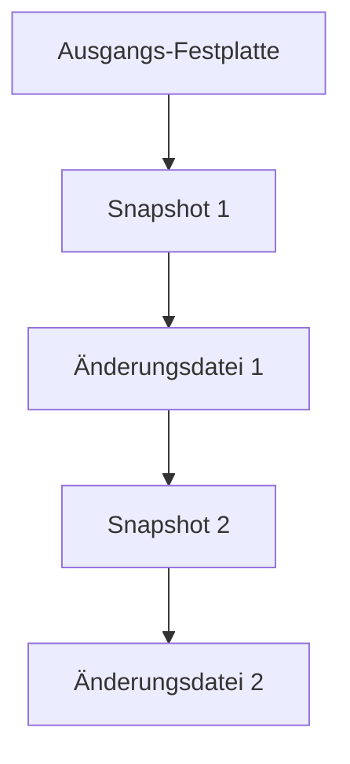
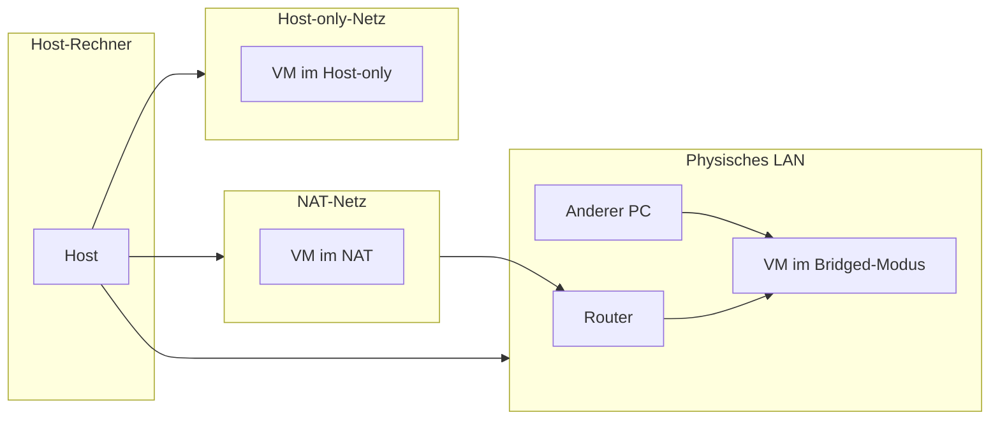

###### Themen

Arbeiten mit virtuellen Maschinen

- Snapshots grundlegend verstehen und nutzen
- Virtuelle Maschinen klonen sowie importieren und exportieren

Virtuelle Netzwerke

- NAT, Bridged und Host-only grundlegend unterscheiden
- Kommunikation von virtuellen Maschinen im Netzwerk verstehen
- Einfache Sicherheitsaspekte virtueller Netzwerke kennenlernen

   

# 🖥️ Arbeiten mit virtuellen Maschinen

Virtuelle Maschinen, oft einfach **VMs** genannt, sind im Kern **komplette Computer in Software**. Sie haben eine virtuelle CPU, virtuellen Arbeitsspeicher, virtuelle Festplatten und virtuelle Netzwerkkarten. Ein sogenannter **Hypervisor** stellt diese virtuelle Hardware bereit, also zum Beispiel VirtualBox, VMware oder Hyper-V. Microsoft beschreibt Hyper-V genau so: als Virtualisierungstechnologie, mit der man mehrere isolierte Betriebssysteme auf einem physischen Host ausführen kann ([What is Hyper-V on Windows?](https://learn.microsoft.com/en-us/virtualization/hyper-v-on-windows/about/)).

Damit du das Thema sauber verstehst, ist ein Denkmodell besonders hilfreich:

- **Der Host** ist dein echter Rechner.
- **Der Gast** ist die virtuelle Maschine.
- **Die VM besteht aus Zustand, Konfiguration und virtuellen Datenträgern.**

Genau diese drei Dinge sind wichtig, wenn man über **Snapshots**, **Klonen**, **Import/Export** und **virtuelle Netzwerke** spricht.

   

## 📸 Snapshots grundlegend verstehen und nutzen

Ein **Snapshot** ist eine Art **Wiederherstellungspunkt** für eine virtuelle Maschine. Er merkt sich, wie die VM zu einem bestimmten Zeitpunkt aussah. Je nach Hypervisor kann das den Zustand der virtuellen Festplatten, die Konfiguration und sogar den Inhalt des Arbeitsspeichers umfassen. Bei Hyper-V heißt dieses Konzept **Checkpoint**, und Microsoft erklärt, dass dabei der Zustand, die Daten und die Hardwarekonfiguration einer VM erfasst werden können ([Manage Hyper-V checkpoints](https://learn.microsoft.com/en-us/windows-server/virtualization/hyper-v/manage/manage-checkpoints)).

Wichtig ist: Ein Snapshot ist **nicht einfach nur eine Datei-Kopie der ganzen VM**. In vielen Virtualisierungssystemen funktioniert das technisch so, dass nach dem Snapshot **Änderungen in zusätzliche Differenz-Dateien** geschrieben werden. Der ursprüngliche Stand bleibt erhalten, und neue Änderungen kommen obendrauf. Deshalb kann man später zu einem alten Zeitpunkt zurückspringen.

   

### 🧠 Was ein Snapshot in der Praxis bedeutet

Stell dir vor, du hast eine VM mit Linux oder Windows und möchtest ein riskantes Update testen. Dann gehst du so vor:

1. VM in einen sauberen Zustand bringen.
2. Snapshot erstellen.
3. Update oder neue Software installieren.
4. Wenn etwas kaputtgeht: Snapshot zurückspielen.

Das ist der große Vorteil: Du kannst **schnell experimentieren**, ohne die VM komplett neu aufsetzen zu müssen.

Ein Snapshot ist also ideal, wenn du:

- ein Betriebssystem-Update testen willst,
- neue Software ausprobieren willst,
- Konfigurationsänderungen machen möchtest,
- Malware-Analyse oder Labore in isolierten Umgebungen durchführst,
- vor einem Unterrichts- oder Demo-Stand einen sicheren Ausgangspunkt brauchst.

   

### ⚙️ Was genau gespeichert wird

Je nach Hypervisor und Einstellung kann ein Snapshot verschiedene Dinge umfassen:

| Bestandteil | Wird oft gespeichert? | Bedeutung |
|---|---:|---|
| Zustand der virtuellen Festplatte | Ja | Welche Dateien und Daten auf der VM vorhanden waren |
| VM-Konfiguration | Ja | RAM-Zuweisung, Geräte, Netzwerkkarten usw. |
| Arbeitsspeicher-Inhalt | Optional bzw. oft möglich | Die VM läuft später exakt an derselben Stelle weiter |
| Laufender Zustand | Häufig | Ob die VM gerade an, aus oder pausiert war |

Wenn auch der Arbeitsspeicher gespeichert wird, ist das besonders bequem: Nach dem Wiederherstellen wirkt es so, als hätte man den Rechner **eingefroren und später exakt dort wieder aufgetaut**.

   

### 🪜 Wie Snapshots intern oft funktionieren

Hier ist ein vereinfachtes Bild:

Die Idee dahinter: Der alte Zustand bleibt erhalten, und neue Änderungen landen in zusätzlichen Dateien. Das ist praktisch, hat aber auch Folgen:

- mehr Speicherbedarf mit der Zeit,
- mehr Komplexität,
- potenziell schlechtere Leistung bei langen Snapshot-Ketten.

Oracle beschreibt im VirtualBox-Handbuch allgemein, dass Snapshots den Zustand einer VM zu einem bestimmten Zeitpunkt festhalten und dass man zu diesem Zustand zurückkehren kann ([Oracle VM VirtualBox User Manual](https://www.virtualbox.org/manual/UserManual.html)).

   

### ✅ Wann Snapshots sinnvoll sind

Snapshots sind besonders gut für **kurzfristige Sicherungspunkte** innerhalb eines Lern-, Test- oder Admin-Workflows.

Typische sinnvolle Situationen:

- **Vor Updates**: z. B. vor einem großen Windows- oder Kernel-Update
- **Vor Softwareinstallation**: etwa Datenbank, Webserver, Treiber, Entwicklungsumgebung
- **Vor Konfigurationsänderungen**: Netzwerk, Firewall, Benutzerrechte, Dienste
- **Vor Experimenten im Labor**: Sicherheits-Tests, Automatisierung, Skripte, neue Tools

Gerade beim Lernen sind Snapshots extrem wertvoll, weil du Dinge **angstfrei ausprobieren** kannst. Wenn du weißt, dass du jederzeit zurück kannst, lernst du aktiver und mutiger.

   

### ⚠️ Was Snapshots nicht sind

Ein ganz zentraler Punkt: **Snapshots sind kein Ersatz für Backups.** Microsoft weist bei Hyper-V ausdrücklich darauf hin, dass Checkpoints keine Ersatzlösung für ein Backup sind ([Manage Hyper-V checkpoints](https://learn.microsoft.com/en-us/windows-server/virtualization/hyper-v/manage/manage-checkpoints)).

Warum nicht?

Weil ein Snapshot meist stark an die ursprüngliche VM-Struktur gekoppelt ist. Wenn die VM-Dateien beschädigt werden, der Host ausfällt oder die Datenträger verloren gehen, hilft dir der Snapshot oft nicht wie ein echtes externes Backup.

Der Unterschied ist wichtig:

| Snapshot | Backup |
|---|---|
| Schneller Wiederherstellungspunkt | Vollständige Datensicherung |
| Für Tests und kurzfristige Rollbacks | Für Ausfall, Verlust, Wiederherstellung |
| Oft innerhalb derselben VM-Struktur | Idealerweise getrennt gespeichert |
| Nicht für langfristige Aufbewahrung gedacht | Genau dafür gedacht |

Merksatz: **Snapshot = Rücksprungpunkt. Backup = echte Absicherung.**

   

### 🚫 Typische Fehler mit Snapshots

Viele Anfänger machen bei Snapshots ähnliche Fehler. Die wichtigsten sind:

**1. Zu viele Snapshots behalten**  
Eine lange Kette von Snapshots macht die VM unübersichtlich und kann Leistung und Speicherverbrauch verschlechtern.

**2. Snapshot als Backup behandeln**  
Das ist einer der gefährlichsten Denkfehler.

**3. Vor produktiven Datenbanken blind verwenden**  
Besonders bei stark schreibenden Diensten oder Datenbanken muss man wissen, wie der jeweilige Hypervisor und das Gastbetriebssystem mit Konsistenz umgehen. Sonst ist zwar technisch ein Zustand gespeichert, aber nicht unbedingt ein sauberer Anwendungspunkt.

**4. Ohne Namenskonzept arbeiten**  
„Snapshot 1“, „Test“, „Neu“ sind schlechte Namen. Besser:  
`Vor Apache-Installation 2026-03-24` oder `Vor Kernel-Update Debian-Lab`.

   

### 🧭 Gute Praxis für Snapshots

Ein sauberer Lern- und Admin-Stil sieht so aus:

- Snapshot **vor** riskanten Änderungen
- Kurze, klare Beschreibung vergeben
- Nach erfolgreichem Test unnötige Snapshots wieder entfernen
- Keine endlosen Snapshot-Ketten erzeugen
- Für echte Sicherung zusätzlich exportieren oder regulär sichern

Das ist eine sehr typische **Core-Tech-Fundamentals-Denkweise**: Du trennst sauber zwischen  
**Testpunkt**, **Kopie**, **Archiv** und **Backup**.

   

## 🧬 Virtuelle Maschinen klonen sowie importieren und exportieren

Wenn du eine VM **klonst**, erzeugst du aus einer vorhandenen VM eine weitere VM. Diese neue VM basiert auf dem Original, ist aber danach meist als eigenes System nutzbar.

Das ist sehr praktisch, wenn du z. B.:

- mehrere Testsysteme aus einer Basis-VM erzeugen willst,
- eine vorbereitete Schulungsumgebung verteilen möchtest,
- ein goldenes Basis-System für verschiedene Rollen brauchst,
- ein Labornetz mit mehreren ähnlichen Maschinen aufbauen willst.

   

### 🪞 Was Klonen bedeutet

Beim Klonen wird aus einer bestehenden VM eine neue Instanz erzeugt. Diese kann denselben Ausgangszustand haben, aber anschließend unabhängig weiterlaufen.

Es gibt dabei zwei wichtige Grundformen.

   

### 🧱 Vollständiger Klon

Ein **vollständiger Klon** erstellt eine **komplette unabhängige Kopie** der VM, inklusive virtueller Datenträger. Die neue VM ist danach eigenständig und hängt nicht mehr vom Original ab.

Das ist die sichere und saubere Variante, wenn du wirklich unabhängig arbeiten willst.

Vorteile:

- unabhängig vom Original,
- stabil und leicht verständlich,
- gut für langfristige Nutzung,
- gut für Weitergabe oder Archivierung.

Nachteile:

- braucht mehr Speicherplatz,
- dauert länger.

   

### 🔗 Verknüpfter Klon

Ein **verknüpfter Klon** oder **Linked Clone** nutzt das Original oder einen Snapshot als gemeinsame Basis. Die neue VM speichert dann nur die Änderungen separat.

Vorteile:

- schnell erstellt,
- spart Speicher,
- gut für kurze Testzwecke.

Nachteile:

- hängt oft vom Original oder Basissnapshot ab,
- weniger robust für langfristige Nutzung,
- komplizierter, wenn man Dateien verschiebt oder Basisdaten löscht.

Gerade beim Lernen solltest du den Unterschied wirklich verstehen:  
**Vollständiger Klon = eigene komplette Maschine.**  
**Verknüpfter Klon = abgeleitete Maschine mit Abhängigkeit.**

   

### 🆔 Wichtige Stolperfallen beim Klonen

Wenn du eine VM klonst, entsteht nicht automatisch ein „perfekt neues“ System im logischen Sinn. Manche Identitäten müssen geprüft oder neu erzeugt werden.

Typische Punkte sind:

- **Hostname**
- **IP-Adresse**
- **MAC-Adresse**
- **Maschinen-IDs**
- **SSH-Hostkeys**
- **Domänen-/Directory-Beziehungen**
- **Lokale Zertifikate oder Tokens**

Wenn du zwei geklonte Systeme gleichzeitig im selben Netzwerk betreibst und sie dieselbe Identität behalten, kann das zu Konflikten führen. Besonders problematisch sind doppelte IP-Adressen oder ungewollt identische Systemkennungen.

Das ist in der Praxis ein ganz wichtiger Lernpunkt:  
**Eine geklonte VM ist technisch kopiert, aber administrativ oft noch nicht sauber individualisiert.**

   

### 📦 Importieren und Exportieren: Worum geht es dabei?

**Exportieren** bedeutet, eine VM so zu verpacken, dass sie auf ein anderes System übertragen oder archiviert werden kann.  
**Importieren** bedeutet, eine solche verpackte VM wieder in einen Hypervisor einzulesen und dort als VM anzulegen.

Das ist nicht dasselbe wie ein Snapshot und auch nicht ganz dasselbe wie ein Klon.

Ein Export ist eher wie ein **transportfähiges Paket**.

Sehr oft wird dafür das Format **OVF/OVA** verwendet. Die DMTF beschreibt OVF als ein standardisiertes Format zum Verpacken und Verteilen virtueller Appliances ([Open Virtualization Format](https://www.dmtf.org/standards/ovf)).

Kurz gesagt:

- **OVF** ist eher eine Beschreibung plus Begleitdateien
- **OVA** ist oft ein einzelnes Archiv, das alles zusammenfasst

   

### 🔄 Unterschied zwischen Klonen, Snapshot und Export

| Funktion | Hauptzweck | Typischer Einsatz |
|---|---|---|
| Snapshot | Zustand merken und zurückspringen | Vor Änderungen, Tests |
| Klonen | Neue VM aus vorhandener VM erzeugen | Labore, Mehrfachsysteme |
| Export | VM transportieren oder archivieren | Weitergabe, Migration |
| Import | Exportierte VM wieder nutzbar machen | Übernahme auf anderem Host |

Das ist einer der wichtigsten Begriffsunterschiede überhaupt. Wenn du den sauber beherrschst, bist du in Virtualisierung schon deutlich sicherer unterwegs.

   

### 🚚 Wann Export und Import besonders sinnvoll sind

Export/Import ist nützlich, wenn du:

- eine VM auf einen anderen Rechner mitnehmen willst,
- eine vorbereitete Lernumgebung weitergeben möchtest,
- einen sauberen VM-Stand archivieren willst,
- zwischen Hypervisoren oder Hosts migrieren willst, soweit Format und Kompatibilität passen.

Microsoft beschreibt für Hyper-V, dass man virtuelle Maschinen exportieren und später wieder importieren kann, um sie zu verschieben oder erneut bereitzustellen ([Export and import virtual machines](https://learn.microsoft.com/en-us/windows-server/virtualization/hyper-v/deploy/export-and-import-virtual-machines)).

   

### 🧹 Worauf du vor dem Export achten solltest

Vor dem Export solltest du überlegen, ob die VM sensible Daten enthält. Sehr oft exportiert man nämlich unbeabsichtigt auch:

- gespeicherte Passwörter,
- API-Schlüssel,
- Browser-Daten,
- SSH-Schlüssel,
- Zertifikate,
- Token,
- Testdaten oder personenbezogene Daten.

Ein Export ist deshalb nicht nur Technik, sondern auch **Sicherheits- und Datenschutzthema**.

Wenn du eine VM teilen willst, ist es oft sinnvoll, sie vorher zu „bereinigen“:

- temporäre Dateien entfernen,
- vertrauliche Schlüssel löschen,
- Benutzerkonten prüfen,
- Log-Dateien prüfen,
- Hostnamen und Netzwerkkonfiguration neutralisieren.

   

### 🧠 Ein gutes mentales Modell

Du kannst es dir so merken:

- **Snapshot** = „Ich will zurückspringen können.“
- **Klon** = „Ich will eine weitere VM auf Basis dieser VM.“
- **Export** = „Ich will die VM transportieren oder weitergeben.“
- **Import** = „Ich will so ein Paket wieder in Betrieb nehmen.“

Das klingt simpel, aber genau diese Unterscheidung trennt oft sauberes Arbeiten von chaotischem Arbeiten.

   

# 🌐 Virtuelle Netzwerke

Ein virtueller Rechner ist erst dann wirklich realistisch nutzbar, wenn er mit anderen Systemen kommunizieren kann. Deshalb gehört Networking zu den wichtigsten Grundlagen.

Eine VM besitzt meist eine oder mehrere **virtuelle Netzwerkkarten**. Diese werden vom Hypervisor an ein virtuelles Netzwerk angeschlossen. Dieses virtuelle Netzwerk kann dann unterschiedlich mit dem echten Netzwerk des Hosts verbunden sein.

Die wichtigsten Modi, die du kennen musst, sind:

- **NAT**
- **Bridged**
- **Host-only**

Oracle beschreibt diese Netzwerkmodi im VirtualBox-Handbuch als grundlegende Varianten virtueller Netzwerkanbindung ([Oracle VM VirtualBox User Manual](https://www.virtualbox.org/manual/UserManual.html)).

   

## 🔀 NAT, Bridged und Host-only grundlegend unterscheiden

Diese drei Modi verfolgen unterschiedliche Ziele. Wenn du sie sauber unterscheiden kannst, verstehst du schon einen großen Teil von virtuellem Networking.

   

### 🌍 NAT (Netzwerkadressübersetzung)

**NAT** steht für **Network Address Translation**, auf Deutsch **Netzwerkadressübersetzung**. Dabei hängt die VM in einem privaten virtuellen Netz, und der Host bzw. der Hypervisor übersetzt die Verbindungen nach außen. Private Adressbereiche sind in RFC 1918 beschrieben, also zum Beispiel `10.0.0.0/8`, `172.16.0.0/12` und `192.168.0.0/16` ([Address Allocation for Private Internets](https://datatracker.ietf.org/doc/html/rfc1918)).

Praktisch bedeutet das:

- Die VM kommt meist **nach außen** ins Netzwerk oder Internet.
- Geräte im physischen LAN sehen die VM oft **nicht direkt**.
- Eingehende Verbindungen von außen zur VM sind standardmäßig oft **nicht direkt möglich**, außer mit Portweiterleitung.

Das ist ähnlich wie bei vielen Heimroutern: Mehrere interne Geräte benutzen intern private IPs, nach außen wirkt die Kommunikation aber über eine übersetzte Verbindung.

**Typischer Lernfall:**  
Du willst in einer VM Software installieren, Updates laden oder im Browser arbeiten, aber die VM soll nicht direkt als eigener Rechner im LAN auftauchen.

   

### 🌉 Bridged (Netzwerkbrücke)

Im **Bridged-Modus** wird die VM stärker so behandelt, als wäre sie ein **eigener echter Rechner im selben physischen Netzwerk** wie der Host. Die VM erscheint dann im LAN oft mit einer eigenen MAC-Adresse und erhält typischerweise eine eigene IP-Adresse aus demselben Netz wie andere Geräte.

Praktisch heißt das:

- Die VM ist im Netzwerk direkt sichtbar.
- Andere Geräte im LAN können sie eher direkt erreichen.
- Die VM verhält sich viel realistischer wie ein normaler Computer im Netzwerk.

Das ist nützlich, wenn du Serverdienste testen willst, etwa:

- Webserver
- SSH-Server
- Datenbank im LAN
- Netzwerkdiagnose
- Active-Directory- oder Client/Server-Szenarien

Aber genau diese Direktheit macht Bridged auch sensibler aus Sicherheitssicht.

   

### 🧪 Host-only (Nur-Host)

Im **Host-only-Modus** entsteht ein Netzwerk, in dem **Host und VM miteinander kommunizieren** können, ohne dass die VM automatisch direkten Zugang zum externen physischen Netzwerk hat.

Das bedeutet oft:

- Host ↔ VM funktioniert
- VM ↔ VM im selben Host-only-Netz funktioniert
- VM ↛ Internet standardmäßig oft nicht direkt
- Externe Geräte ↛ VM ebenfalls nicht direkt

Das ist ideal für:

- isolierte Lernumgebungen,
- Malware-Labore,
- lokale Server-Tests nur zwischen Host und Gästen,
- sichere Experimente ohne LAN-Exponierung.

Host-only ist deshalb ein sehr guter Modus für kontrolliertes Lernen.

   

### 📊 Direkter Vergleich der drei Modi

| Modus | Internetzugang | Im LAN direkt sichtbar | Host kann VM erreichen | Gut geeignet für |
|---|---|---:|---:|---|
| NAT | Ja, meist problemlos ausgehend | Eher nein | Eingeschränkt bzw. über spezielle Konfiguration | Sicheres Standard-Lab, Updates, normales Arbeiten |
| Bridged | Ja | Ja | Ja | Realistische Netzwerktests, Server im LAN |
| Host-only | Standardmäßig nein | Nein | Ja | Isolierte Labore, lokale Tests |

   

### 🖼️ Visuelles Bild der Modi

Das Bild soll dir vor allem eines zeigen:  
**Der Netzmodus entscheidet, wer wen direkt sehen und erreichen kann.**

   

## 💬 Kommunikation von virtuellen Maschinen im Netzwerk verstehen

Damit zwei Systeme im Netzwerk miteinander sprechen können, reicht es nicht, dass „irgendwie Netzwerk an“ ist. Es müssen mehrere Ebenen zusammenpassen.

Die wichtigsten Fragen sind:

1. **Sind die Systeme überhaupt im passenden Netzmodus verbunden?**
2. **Haben sie gültige IP-Adressen?**
3. **Sind sie im selben Subnetz oder gibt es Routing?**
4. **Erlauben Firewalls die Kommunikation?**
5. **Läuft auf dem Zielsystem wirklich ein Dienst auf dem gewünschten Port?**

Das ist eine der wichtigsten Networking-Grundlagen überhaupt:  
**Netzwerkkommunikation scheitert selten an nur einem Punkt, sondern oft an einer Kette von Bedingungen.**

   

### 🧭 Wie Kommunikation zwischen VMs typischerweise funktioniert

Es gibt mehrere typische Fälle.

   

### 🖥️ VM zu Internet

Das funktioniert am einfachsten mit **NAT** oder **Bridged**.

- Bei **NAT** geht die Verbindung meist problemlos nach außen.
- Bei **Bridged** ist die VM wie ein eigener Teilnehmer im LAN und kommt darüber ebenfalls nach außen.

Host-only ist dafür standardmäßig nicht gedacht.

   

### 🖥️ Host zu VM

Das hängt stark vom Modus ab:

- **Host-only**: sehr gut geeignet
- **Bridged**: meist ebenfalls gut möglich
- **NAT**: oft nicht direkt, außer mit zusätzlicher Portweiterleitung oder hypervisorspezifischen Mechanismen

Genau deshalb ist Host-only so beliebt für lokale Webserver- oder SSH-Tests: Der Host kann die VM erreichen, aber das restliche LAN nicht unbedingt.

   

### 🖥️ VM zu VM auf demselben Host

Wenn beide VMs im **gleichen virtuellen Netz** hängen, können sie miteinander sprechen. Das gilt z. B. für:

- zwei VMs im selben Host-only-Netz,
- zwei VMs im selben NAT-Netz, sofern der Hypervisor das zulässt,
- zwei VMs im Bridged-Modus im selben physischen LAN.

Der wichtige Lernpunkt ist:  
**„Beide sind virtuell“ reicht nicht. Sie müssen logisch im selben oder routbar verbundenen Netz sein.**

   

### 🌐 VM zu Gerät im echten LAN

Das klappt am direktesten mit **Bridged**, weil die VM dann selbst Teilnehmer im LAN ist.

Mit **NAT** ist das standardmäßig typischerweise schwieriger, weil die VM hinter einer Übersetzung verborgen ist. Man kann in vielen Hypervisoren zwar gezielt Ports weiterleiten, aber das ist bewusst restriktiver.

Beispiel:  
Wenn du in einer NAT-VM einen Webserver betreibst, kannst du z. B. Port 8080 des Hosts auf Port 80 der VM weiterleiten. Dann ruft man auf dem Host oder eventuell auch auf andere Weise den Host-Port auf, und dieser wird zur VM durchgereicht. Das ist ein klassischer Fall für **Port Forwarding**.

   

### 📡 Warum pingen manchmal nicht funktioniert

Viele Lernende testen Netzwerk immer zuerst mit `ping`. Das ist sinnvoll, aber nicht perfekt.

`ping` verwendet **ICMP**, und das kann durch Firewalls blockiert sein. Dann ist das Ziel vielleicht erreichbar, antwortet aber nicht auf Ping. Das heißt:

- **Ping erfolgreich** → Verbindung ist sehr wahrscheinlich vorhanden
- **Ping scheitert** → nicht automatisch tot, vielleicht nur ICMP blockiert

Darum schaut man zusätzlich auf:

- IP-Konfiguration
- Routing
- DNS
- offene Ports
- Firewall-Regeln
- tatsächlich laufende Dienste

   

### 🧱 Kommunikation passiert auf mehreren Schichten

Für richtiges Lernen ist dieses Modell sehr wertvoll:

| Ebene | Frage |
|---|---|
| Physisch / virtuell | Ist die Netzwerkkarte verbunden? |
| Layer 2 | Sind die Systeme im passenden virtuellen Netz? |
| Layer 3 | Haben sie IP-Adressen und Routing? |
| Layer 4 | Ist der benötigte Port offen? |
| Anwendung | Läuft der Dienst wirklich? |

Wenn du dieses Schichten-Denken beherrschst, wirst du Netzwerkprobleme sehr viel systematischer lösen.

   

### 🔁 Beispiel: Zwei VMs sollen miteinander reden

Nehmen wir an, du hast:

- **VM A** als Webserver
- **VM B** als Client

Dann müssen mindestens diese Dinge stimmen:

1. Beide sind im selben Netzwerk oder über Routing verbunden.
2. Beide haben gültige IP-Adressen.
3. VM B kennt die Zieladresse von VM A.
4. Die Firewall auf VM A erlaubt den Web-Port.
5. Auf VM A läuft tatsächlich ein Webserver.

Erst dann funktioniert ein Aufruf wie `http://IP-von-VM-A`.

Das klingt banal, ist aber genau die Art von strukturiertem Denken, die Core-Tech-Fundamentals ausmacht.

   

## 🔐 Einfache Sicherheitsaspekte virtueller Netzwerke kennenlernen

Virtuelle Netzwerke sind nicht automatisch „sicher“, nur weil sie virtuell sind. Isolation ist möglich, aber man muss sie bewusst konfigurieren.

Ein großer Vorteil von Virtualisierung ist, dass man Netzwerke **gezielt einschränken** kann. Genau darin liegt auch ein Sicherheitsgewinn: Du entscheidest, **wie sichtbar** und **wie erreichbar** eine VM ist.

   

### 🛡️ Sicherheitswirkung der Netzwerkmodi

Jeder Netzwerkmodus hat typische Sicherheitsfolgen.

| Modus | Sicherheitswirkung |
|---|---|
| NAT | Gute Standardwahl, wenn die VM Internet braucht, aber nicht offen im LAN sichtbar sein soll |
| Bridged | Höhere Sichtbarkeit und damit größere Angriffsfläche im LAN |
| Host-only | Gute Isolation für Tests zwischen Host und VM |
 
Das bedeutet nicht, dass NAT „sicher“ und Bridged „unsicher“ ist. Es bedeutet:  
**Je direkter eine VM im echten Netzwerk sichtbar ist, desto sorgfältiger musst du sie absichern.**

   

### 🚪 Bridged erhöht die direkte Erreichbarkeit

Im Bridged-Modus ist die VM im LAN oft wie ein normaler Rechner sichtbar. Das ist praktisch, aber auch heikel:

- andere Geräte können Ports scannen,
- Dienste können direkt erreichbar sein,
- Fehlkonfigurationen wirken sofort ins Netzwerk hinein,
- unsichere Testsysteme können echten Schaden anrichten.

Wenn du also ein unsicheres, altes oder experimentelles System betreibst, ist Bridged oft **nicht** die beste erste Wahl.

   

### 🔒 Host-only für Labore und kontrollierte Umgebungen

Host-only ist aus Lernsicht sehr stark, weil du damit ein kleines, kontrolliertes Labor bauen kannst. Der Host kann mit den VMs sprechen, aber die VMs hängen nicht automatisch offen im LAN oder Internet.

Das ist ideal für:

- lokale Serverübungen,
- Exploit- oder Malware-Analyse in abgesicherter Umgebung,
- Testen von Firewall-Regeln,
- Dienste, die nicht im echten Netzwerk auftauchen sollen.

Host-only ist aber kein magischer Schutzschild. Wenn du zusätzlich Freigaben, Zwischenablage, gemeinsame Ordner oder Portfreigaben aktivierst, vergrößerst du die Angriffsfläche wieder. Solche Integrationsfunktionen sind in vielen Hypervisoren verfügbar und sollten bewusst eingesetzt werden ([Oracle VM VirtualBox User Manual](https://www.virtualbox.org/manual/UserManual.html)).

   

### 🔌 Portweiterleitungen bewusst sparsam verwenden

Bei NAT kann man einzelne Dienste von außen erreichbar machen, indem man **Portweiterleitungen** einrichtet. Das ist praktisch, aber du solltest das gezielt tun.

Gute Praxis:

- nur die wirklich benötigten Ports freigeben,
- nur so lange wie nötig,
- dokumentieren, welche Weiterleitung wofür existiert,
- nach dem Test wieder entfernen.

Sicherheit entsteht hier vor allem durch **Reduktion**: möglichst wenig offen, möglichst wenig sichtbar.

   

### 🧬 Klone und Sicherheit: identische Systeme können problematisch sein

Sicherheit betrifft nicht nur Netzmodi, sondern auch geklonte VMs. Wenn du Systeme klonst, können versehentlich identische Kennungen oder Konfigurationen übernommen werden.

Gefährlich sind zum Beispiel:

- gleiche SSH-Hostkeys,
- gleiche lokale Zertifikate,
- gespeicherte Admin-Logins,
- API-Tokens,
- feste IP-Adressen,
- gleiche Hostnamen,
- alte Logs mit sensiblen Daten.

Gerade wenn eine VM exportiert oder an andere Menschen weitergegeben wird, muss man sich fragen:  
**Welche Geheimnisse reisen mit?**

Das ist eine der wichtigsten professionellen Denkweisen im Umgang mit VMs.

   

### 🧯 Minimales Sicherheitsprinzip: so viel Netzwerk wie nötig, so wenig wie möglich

Ein sehr gutes Grundprinzip lautet:

> **Wähle immer den am wenigsten offenen Netzwerkmodus, der für dein Ziel noch ausreicht.**

Beispiele:

- Du willst nur Updates laden → **NAT**
- Du willst nur lokal mit dem Host testen → **Host-only**
- Du willst, dass andere Geräte im LAN direkt auf die VM zugreifen → **Bridged**

Dieses Prinzip nennt man im Geist oft **Least Exposure** oder allgemein das Denken in minimaler Angriffsfläche.

   

### 🧹 Weitere einfache Schutzmaßnahmen

Neben dem Netzmodus gibt es ein paar sehr praktische Sicherheitsregeln:

- Gastbetriebssystem aktuell halten
- Nicht benötigte Dienste deaktivieren
- Firewall im Gast aktivieren
- Standardpasswörter vermeiden
- Gemeinsame Ordner nur bei Bedarf aktivieren
- Freigaben und Portweiterleitungen regelmäßig prüfen
- Imports aus unbekannten Quellen nicht blind vertrauen

Gerade importierte Appliances oder fremde VMs sollte man kritisch behandeln. Ein importiertes System ist am Ende ein komplettes fremdes Betriebssystem mit eigener Konfiguration. Das sollte man nie naiv behandeln.

   

### 🧠 Das richtige Lernmodell für Sicherheit in virtuellen Netzwerken

Wenn du dir nur eine Sache merken willst, dann diese:

**Sicherheit in virtuellen Netzwerken entsteht vor allem durch bewusste Sichtbarkeit, klare Grenzen und minimale Freigaben.**

Oder noch einfacher:

- Wer darf die VM sehen?
- Wer darf sie erreichen?
- Welche Dienste sind offen?
- Muss das wirklich so sein?

Wenn du so denkst, lernst du Virtualisierung nicht nur technisch, sondern auch professionell.