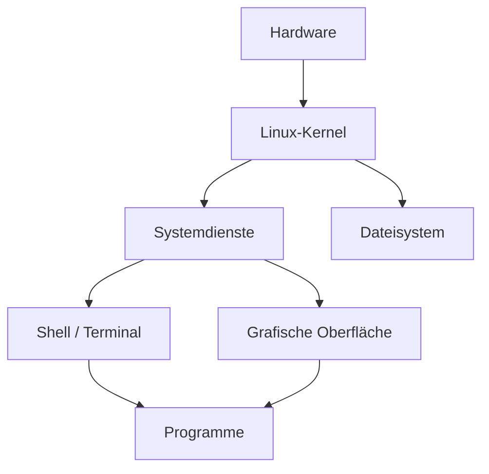
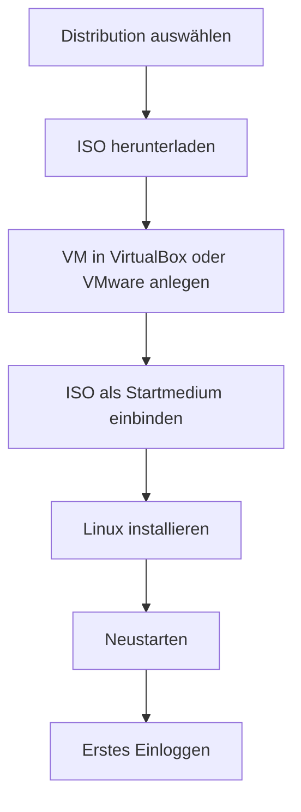
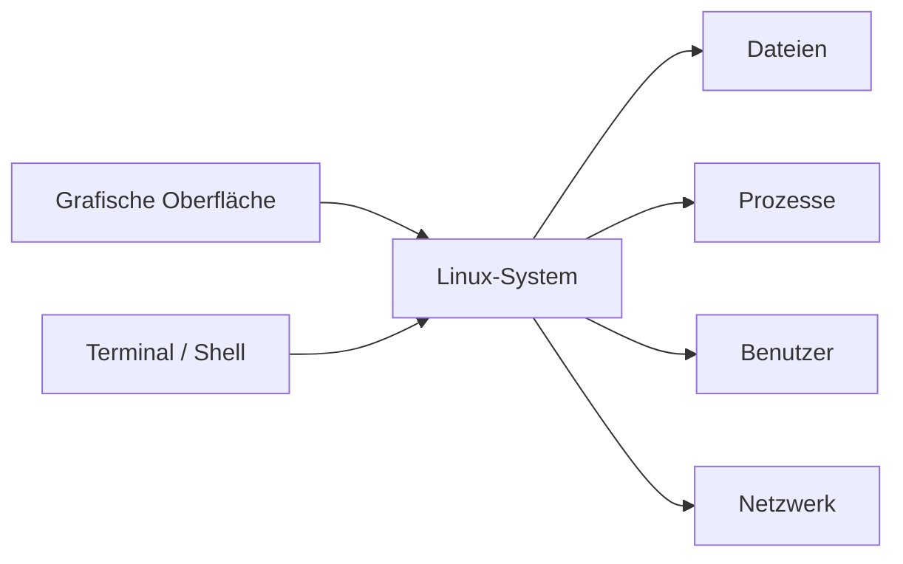

###### Themen

Linux-Grundlagen

- Überblick über Linux und typische Einsatzgebiete
- Wichtige Unterschiede zwischen Linux und anderen Betriebssystemen

Linux-Distributionen

- Beispiele gebräuchlicher Distributionen für Desktop und Server
- Einfache Auswahlkriterien für Distributionen

Installation und erste Schritte

- Installation einer Linux-Distribution in einer virtuellen Maschine
- Erstes Einloggen und Benutzeranmeldung

Grafische Benutzeroberfläche und Terminal

- Navigation in der grafischen Oberfläche
- Terminal öffnen und grundlegende Bedienung verstehen
- Wechsel zwischen grafischer Oberfläche und Terminal

<br><br><br>
# 🐧 Linux-Grundlagen

<br><br><br>
## 🌍 Überblick über Linux und typische Einsatzgebiete

Wenn von **Linux** gesprochen wird, meinen viele im Alltag das komplette Betriebssystem. **Technisch genau** ist Linux aber zunächst der **Kernel**, also der Betriebssystemkern. Dieser Kernel steuert grundlegende Dinge wie Prozesse, Speicher, Geräte, Dateisysteme und die Kommunikation mit der Hardware. Erst zusammen mit weiteren Werkzeugen, Programmen, Bibliotheken und oft einer grafischen Oberfläche entsteht das, was du als „Linux-System“ benutzt ([What is Linux?](https://www.redhat.com/en/topics/linux/what-is-linux)).

Das ist wichtig, weil du dadurch besser verstehst, warum Linux so viele verschiedene Formen haben kann. Es gibt nicht **das eine Linux**, sondern viele Varianten, die auf demselben Kernel basieren. Deshalb sieht ein Linux auf einem Server oft ganz anders aus als ein Linux auf einem Laptop.

Linux ist heute in sehr vielen Bereichen im Einsatz:

- **Server und Rechenzentren**: Webseiten, Datenbanken, Mailserver, Webanwendungen und Cloud-Dienste laufen sehr häufig auf Linux.
- **Cloud und Container**: Viele Container-Technologien und Cloud-Plattformen basieren auf Linux-Grundlagen.
- **Softwareentwicklung**: Entwickler arbeiten oft mit Linux, weil viele Werkzeuge aus der Programmierung und Systemadministration dort sehr gut unterstützt sind.
- **Netzwerk- und Sicherheitsumgebungen**: Firewalls, Router, Monitoring-Systeme oder Security-Tools laufen oft auf Linux.
- **Embedded Systems und IoT**: Linux steckt in vielen Geräten, zum Beispiel in Routern, Fernsehern, Industrieanlagen oder kleinen Einplatinencomputern.
- **Desktop-Systeme**: Auch als normales Arbeits- oder Lernsystem kann Linux genutzt werden.
- **Supercomputer**: In der Hochleistungsrechenwelt ist Linux besonders stark vertreten, weil es sich gut an Spezialhardware und wissenschaftliche Anforderungen anpassen lässt ([TOP500](https://www.top500.org/)).

Der große Vorteil von Linux liegt darin, dass es **flexibel, stabil, anpassbar und in vielen Varianten verfügbar** ist. Für Lernende ist das besonders interessant: Du kannst mit einem einfachen Desktop starten und dich später in Richtung Server, Netzwerke, Automatisierung oder Cybersecurity weiterentwickeln, ohne das Grundkonzept komplett neu lernen zu müssen.

<br><br><br>
### 🧱 Wie ein Linux-System grob aufgebaut ist



Dieses Bild hilft beim Lernen: Das Terminal ist **kein Extra-System**, sondern nur **eine andere Art**, mit dem Betriebssystem zu sprechen. Die grafische Oberfläche ist ebenfalls nur eine Bedienform auf demselben System.

<br><br><br>
## ⚖️ Wichtige Unterschiede zwischen Linux und anderen Betriebssystemen

Linux unterscheidet sich in mehreren Punkten deutlich von Windows und teilweise auch von macOS. Diese Unterschiede sind für den Einstieg wichtig, weil viele Anfänger sonst unbewusst erwarten, dass Linux „genau wie Windows“ funktioniert.

<br><br><br>
### 🔓 Offenheit und Aufbau

Linux ist in weiten Teilen **Open Source**. Das bedeutet: Der Quellcode vieler zentraler Bestandteile ist öffentlich einsehbar und kann von der Community oder Firmen weiterentwickelt werden. Das erklärt auch, warum es so viele Distributionen gibt und warum Linux stark anpassbar ist ([What is Linux?](https://www.redhat.com/en/topics/linux/what-is-linux)).

Bei Windows gibt es im Alltag im Wesentlichen **eine zentrale Plattform** von Microsoft. Bei Linux gibt es viele Varianten mit unterschiedlicher Zielsetzung. Das führt zu mehr Freiheit, aber auch dazu, dass man sich früher mit Begriffen wie **Distribution**, **Paketmanager** oder **Desktop-Umgebung** beschäftigen muss.

<br><br><br>
### 🧩 Distributionen statt eines einzigen Systems

Bei Linux installierst du nicht einfach nur „Linux“, sondern eine **Distribution**. Eine Distribution kombiniert den Linux-Kernel mit:

- Programmen und Systemwerkzeugen
- einem Paketmanager
- Repositories für Software
- optional einer grafischen Oberfläche
- Update-Mechanismen
- einer eigenen Philosophie oder Zielgruppe

Deshalb kann ein Ubuntu-System sehr einsteigerfreundlich wirken, während Arch Linux viel stärker auf manuelle Einrichtung setzt.

<br><br><br>
### 📁 Dateisystem und Verzeichnisstruktur

Ein sehr wichtiger Unterschied ist die Struktur des Dateisystems. Unter Linux beginnt alles bei **`/`**, dem sogenannten **Wurzelverzeichnis**. Es gibt nicht standardmäßig Laufwerksbuchstaben wie `C:` oder `D:`. Stattdessen werden Datenträger in die Verzeichnisstruktur **eingehängt**.

Typische Verzeichnisse sind:

- **`/home`** – persönliche Dateien der Benutzer
- **`/etc`** – Konfigurationsdateien
- **`/var`** – variable Daten wie Logs
- **`/bin`**, **`/usr/bin`** – Programme
- **`/tmp`** – temporäre Dateien

Das wirkt anfangs ungewohnt, ist aber sehr logisch aufgebaut. Wenn du Linux langfristig lernen willst, ist dieses Verständnis extrem wichtig.

<br><br><br>
### 👤 Benutzerrechte und Sicherheit

Linux trennt sehr klar zwischen normalen Benutzern und administrativen Rechten. Ein Benutzer arbeitet normalerweise **nicht dauerhaft als Administrator**. Verwaltungsaufgaben werden gezielt mit erhöhten Rechten ausgeführt, oft über **`sudo`**. Das ist ein wichtiger Sicherheitsmechanismus und gehört zu den typischen Linux-Grundlagen ([RootSudo](https://help.ubuntu.com/community/RootSudo)).

Das unterscheidet sich vom früheren Alltagsgefühl vieler Windows-Nutzer, die lange Zeit eher daran gewöhnt waren, häufiger mit administrativen Rechten zu arbeiten. Moderne Windows-Versionen sind hier zwar ebenfalls strenger geworden, aber unter Linux ist dieses Prinzip besonders zentral.

<br><br><br>
### 📦 Softwareinstallation über Paketmanager

Unter Linux installierst du Programme oft nicht, indem du auf irgendeiner Webseite eine `.exe` herunterlädst, sondern über einen **Paketmanager**. Bekannte Beispiele sind:

- **APT** bei Debian und Ubuntu
- **DNF** bei Fedora
- **Zypper** bei openSUSE
- **Pacman** bei Arch Linux

Diese Paketmanager greifen auf geprüfte Paketquellen zu und können Programme mitsamt Abhängigkeiten installieren, aktualisieren und entfernen. Das ist ein großer Unterschied zur klassischen Softwareinstallation unter Windows und gehört zu den praktischsten Linux-Konzepten ([Package management](https://documentation.ubuntu.com/server/explanation/software/package-management/)).

<br><br><br>
### ⌨️ Das Terminal hat einen höheren Stellenwert

Unter Linux ist das **Terminal** besonders wichtig. Das bedeutet nicht, dass du alles nur mit schwarzem Bildschirm und Text machen musst. Aber viele Aufgaben lassen sich im Terminal:

- schneller,
- präziser,
- reproduzierbar
- und automatisierbar

erledigen.

Gerade im Bereich **Core Tech Fundamentals** ist das ein riesiger Vorteil. Wenn du lernst, wie das System auf Kommandoebene funktioniert, verstehst du später auch Server, Skripting, DevOps, Container und viele Security-Themen deutlich leichter.

<br><br><br>
### 🖥️ Anpassbarkeit und Oberfläche

Windows kommt mit einer relativ festen Benutzererfahrung. Linux kann dagegen sehr unterschiedlich aussehen, je nach **Desktop-Umgebung**. Du kannst zum Beispiel GNOME, KDE Plasma oder XFCE verwenden. Das bedeutet: Nicht jedes Linux sieht gleich aus, obwohl der Kern darunter ähnlich ist.

Das ist einerseits mächtig, kann Einsteiger aber auch verwirren. Deshalb ist es sinnvoll, am Anfang nicht zu viele Varianten gleichzeitig auszuprobieren.

<br><br><br>
### 📊 Linux, Windows und macOS im Vergleich

| Thema | Linux | Windows | macOS |
|---|---|---|---|
| Grundidee | Viele Distributionen, stark anpassbar | Zentrale Plattform von Microsoft | Zentrale Plattform von Apple |
| Quellcode | Viele Teile offen | Weitgehend proprietär | Weitgehend proprietär |
| Softwareinstallation | Häufig Paketmanager + Repositories | Oft Installer von Webseiten oder Store | App Store + Installer |
| Rechteverwaltung | Stark benutzer- und rollenorientiert | Ebenfalls Benutzerrechte, aber andere Alltagskultur | Unix-basiert, ähnliche Grundidee wie Linux in Teilen |
| Terminal-Bedeutung | Sehr hoch | Mittel | Relativ wichtig, aber im Alltag oft weniger zentral |
| Oberfläche | Frei wählbar | Einheitlicher | Stark vorgegeben |
| Typische Stärke | Server, Entwicklung, Infrastruktur, Flexibilität | Desktop-Kompatibilität, Gaming, Unternehmensumfeld | Integration ins Apple-Ökosystem |

---

<br><br><br>
# 📦 Linux-Distributionen

<br><br><br>
## 🧩 Beispiele gebräuchlicher Distributionen für Desktop und Server

Eine **Linux-Distribution** ist ein fertig zusammengestelltes Linux-System. Sie entscheidet zum Beispiel:

- welche Software vorinstalliert ist,
- wie Updates verteilt werden,
- welcher Paketmanager benutzt wird,
- ob der Schwerpunkt eher auf Stabilität, Einfachheit oder Aktualität liegt.

Das ist für Anfänger entscheidend: Du lernst Linux leichter, wenn du eine Distribution wählst, die zu deinem Ziel passt.

<br><br><br>
### 🖥️ Typische Desktop-Distributionen

**Ubuntu Desktop** ist eine der bekanntesten Einsteiger-Distributionen. Sie ist weit verbreitet, gut dokumentiert und hat viel Community-Support. Canonical bietet offizielle Installations- und Einsteigerdokumentation an ([Install Ubuntu desktop](https://ubuntu.com/tutorials/install-ubuntu-desktop)).

**Linux Mint** wird häufig empfohlen, wenn jemand von Windows kommt und eine eher vertraute Desktop-Erfahrung möchte. Die Oberfläche wirkt für viele Nutzer sofort zugänglich.

**Fedora Workstation** ist modern, aktuell und technisch sehr sauber. Fedora bringt oft neuere Softwarestände als Ubuntu oder Debian und ist gerade bei Entwicklern beliebt ([Fedora Workstation](https://fedoraproject.org/workstation/)).

**Debian** ist bekannt für Stabilität und eine sehr wichtige Rolle in der Linux-Welt. Viele andere Distributionen bauen auf Debian auf oder übernehmen Konzepte daraus ([What is Debian?](https://www.debian.org/intro/about)).

**openSUSE** ist ebenfalls eine starke Desktop- und Server-Option, besonders wenn man strukturierte Systemverwaltung und gute Werkzeuge schätzt.

<br><br><br>
### 🗄️ Typische Server-Distributionen

**Ubuntu Server** ist auf Servern und in Cloud-Umgebungen weit verbreitet. Es ist besonders beliebt, weil es leicht zugänglich, gut dokumentiert und in vielen Hosting- und Cloud-Szenarien verfügbar ist ([Ubuntu Server documentation](https://documentation.ubuntu.com/server/)).

**Debian** ist auch im Serverbereich sehr verbreitet, vor allem wegen seiner Stabilität und seines konservativen Ansatzes.

**Red Hat Enterprise Linux (RHEL)** ist im Unternehmensumfeld sehr wichtig. Es richtet sich stark an professionelle und geschäftskritische Einsätze und bietet kommerziellen Support ([Red Hat Enterprise Linux](https://www.redhat.com/en/technologies/linux-platforms/enterprise-linux)).

**AlmaLinux** und **Rocky Linux** sind besonders interessant, wenn man ein RHEL-nahes System für Lern- oder Serverzwecke will.

**SUSE Linux Enterprise Server** spielt ebenfalls im professionellen Unternehmensbereich eine wichtige Rolle.

<br><br><br>
### 🧭 Nicht jede Distribution ist gleich gut für Anfänger

Theoretisch kannst du auch mit Arch Linux, Gentoo oder Kali Linux anfangen. Praktisch ist das für die meisten Lernenden keine gute Idee.

- **Arch Linux** ist exzellent zum tiefen Lernen, aber eher dann, wenn du die Grundlagen schon verstanden hast.
- **Gentoo** ist sehr speziell und stark auf manuelle Kontrolle ausgelegt.
- **Kali Linux** ist kein normales Einsteiger-Desktop-System, sondern eine Spezialdistribution für Security- und Penetration-Testing-Aufgaben. Sie ist nicht als allgemeine Lernumgebung für Linux-Grundlagen gedacht ([Kali Linux Documentation](https://www.kali.org/docs/)).

Wenn du Linux sauber und nachhaltig lernen willst, ist ein stabiles, gut dokumentiertes System meistens der bessere Einstieg.

<br><br><br>
### 📋 Desktop- und Server-Distributionen im Überblick

| Distribution | Typischer Einsatz | Für Anfänger geeignet? | Besonderheit |
|---|---|---:|---|
| Ubuntu Desktop | Desktop, Lernen, Alltag | Ja | Sehr große Community |
| Linux Mint | Desktop, Umstieg von Windows | Ja | Benutzerfreundliche Oberfläche |
| Fedora Workstation | Desktop, Entwicklung | Eher ja | Moderne Softwarestände |
| Debian | Desktop und Server | Ja, mit etwas Geduld | Stabil und traditionsreich |
| Ubuntu Server | Server, Cloud, Labs | Ja | Gute Dokumentation |
| RHEL | Unternehmensserver | Eher indirekt | Professioneller Enterprise-Fokus |
| AlmaLinux / Rocky Linux | Server, Lab, RHEL-nahe Systeme | Ja, wenn Server-Fokus | Gut für Enterprise-Lernpfade |
| openSUSE | Desktop und Server | Ja | Gute Admin-Werkzeuge |
| Arch Linux | Fortgeschrittenes Lernen | Eher nein | Sehr manuell, sehr lehrreich |

<br><br><br>
## 🎯 Einfache Auswahlkriterien für Distributionen

Die beste Distribution gibt es nicht allgemein. Es gibt nur die Distribution, die **zu deinem Ziel** passt.

Wenn du gerade mit Linux anfängst, solltest du nicht nach der „coolsten“ oder „härtesten“ Distribution suchen, sondern nach einer, mit der du **sauber lernen** kannst.

<br><br><br>
### 🎓 Frage 1: Was willst du eigentlich lernen?

Wenn du vor allem:

- **Linux-Grundlagen**
- **Dateisystem**
- **Benutzerverwaltung**
- **Terminal**
- **Paketverwaltung**
- **einfache Administration**

lernen willst, dann sind **Ubuntu**, **Linux Mint** oder **Debian** sehr gute Startpunkte.

Wenn du eher Richtung:

- **Enterprise-Linux**
- **Serverbetrieb**
- **RHEL-nahe Umgebungen**
- **Administration im Firmenkontext**

gehen willst, dann sind **Rocky Linux**, **AlmaLinux**, **RHEL** oder **SUSE** sinnvoll.

Wenn du besonders an:

- **aktueller Entwickler-Software**
- **modernen Toolchains**
- **nah am Upstream**
- **Experimentierfreude**

interessiert bist, passt **Fedora** sehr gut.

<br><br><br>
### 🧠 Frage 2: Wie wichtig sind Dokumentation und Community?

Für Einsteiger ist das extrem wichtig. Ein System ist nicht nur dann gut, wenn es technisch stark ist, sondern auch dann, wenn du bei Problemen schnell Hilfe findest.

Distributionen mit besonders guter Lern- und Community-Lage sind:

- Ubuntu
- Debian
- Fedora
- Linux Mint
- Arch Linux Wiki als Wissensquelle, auch wenn Arch selbst kein typisches Anfängersystem ist ([ArchWiki](https://wiki.archlinux.org/))

Gerade für richtiges Lernen ist gute Dokumentation fast wichtiger als jede einzelne technische Besonderheit.

<br><br><br>
### ⚖️ Frage 3: Stabilität oder Aktualität?

Hier gibt es einen wichtigen Zielkonflikt:

- **Stabile Distributionen** aktualisieren Software vorsichtiger. Das ist gut für Verlässlichkeit.
- **Aktuellere Distributionen** liefern schneller neue Softwareversionen. Das ist gut für neue Features und moderne Hardwareunterstützung.

Für Anfänger ist zu viel Aktualität nicht automatisch besser. Ein Lernsystem sollte vor allem **vorhersehbar und stabil** sein. Deshalb ist Ubuntu LTS oder Debian oft ein sehr guter Start.

<br><br><br>
### 💻 Frage 4: Wie gut passt die Distribution zu deiner Hardware?

Nicht jede grafische Oberfläche ist gleich ressourcenschonend. Ein älterer Laptop kommt zum Beispiel oft besser mit **XFCE** oder **MATE** zurecht als mit einer besonders aufwendigen Oberfläche.

Das heißt: Man wählt nicht nur die Distribution, sondern auch oft die **Desktop-Umgebung** passend zur Hardware.

<br><br><br>
### 🧰 Eine einfache Entscheidungshilfe

| Dein Ziel | Gute Wahl |
|---|---|
| Einfach in Linux einsteigen | Ubuntu Desktop, Linux Mint |
| Solide Grundlagen lernen | Ubuntu, Debian |
| Moderne Entwicklerumgebung | Fedora Workstation |
| Server-Lernen im Home-Lab | Ubuntu Server, Debian |
| Enterprise-/Admin-Richtung | AlmaLinux, Rocky Linux, RHEL-nah |
| Ältere Hardware | Xubuntu, Linux Mint XFCE, Debian mit XFCE |

---

<br><br><br>
# 💿 Installation und erste Schritte

<br><br><br>
## 🖥️ Installation einer Linux-Distribution in einer virtuellen Maschine

Eine **virtuelle Maschine** ist ein nachgebildeter Computer, der als Programm auf deinem eigentlichen Rechner läuft. Fürs Lernen ist das ideal, weil du Linux ausprobieren kannst, **ohne deinen Hauptrechner umzubauen**. Wenn etwas schiefgeht, löschst du die virtuelle Maschine einfach oder setzt sie zurück.

Bekannte Programme dafür sind:

- **VirtualBox**
- **VMware Workstation / Player**
- **Hyper-V** unter Windows
- **UTM** oder andere Lösungen auf macOS

VirtualBox ist für Einsteiger oft ein guter Start und offiziell dokumentiert im Handbuch von Oracle ([Oracle VM VirtualBox User Manual](https://www.virtualbox.org/manual/UserManual.html)).

<br><br><br>
### 🧱 Was du für die Installation brauchst

Für eine Linux-Installation in einer VM brauchst du normalerweise:

1. ein Virtualisierungsprogramm,
2. eine **ISO-Datei** der gewünschten Distribution,
3. genügend Arbeitsspeicher und Speicherplatz,
4. etwas Geduld für die ersten Schritte.

Die ISO-Datei ist ein Installationsabbild, also vereinfacht gesagt die „digitale DVD“ des Systems.

Für einen einfachen Test reichen oft ungefähr:

- **2 CPUs**
- **2 bis 4 GB RAM**
- **20 bis 30 GB virtueller Speicher**

Für Server-Übungen ohne grafische Oberfläche kann auch weniger genügen. Für Desktop-Umgebungen sind etwas mehr Ressourcen angenehmer.

<br><br><br>
### 📥 Schritt 1: ISO-Datei herunterladen

Lade die ISO immer von der **offiziellen Webseite** der Distribution herunter, zum Beispiel von Ubuntu, Debian oder Fedora. Das ist wichtig für Sicherheit und Aktualität.

Bei Ubuntu findest du offizielle Installationsanleitungen und Downloads direkt auf der Ubuntu-Seite ([Install Ubuntu desktop](https://ubuntu.com/tutorials/install-ubuntu-desktop)).

Fortgeschrittene Nutzer prüfen zusätzlich die **Prüfsumme** der ISO-Datei. Für den allerersten Einstieg ist das noch nicht zwingend, aber es ist eine gute Gewohnheit, die man später übernehmen sollte.

<br><br><br>
### 🖥️ Schritt 2: Virtuelle Maschine anlegen

In VirtualBox oder einem ähnlichen Tool legst du nun eine neue VM an. Dabei stellst du typischerweise ein:

- **Name der VM**, zum Beispiel `Ubuntu-Lab`
- **Typ des Systems**, zum Beispiel Linux
- **RAM**
- **Anzahl virtueller CPUs**
- **Größe der virtuellen Festplatte**

Wichtig ist: Die virtuelle Festplatte ist zunächst nur eine Datei auf deinem echten Rechner. Innerhalb der VM wirkt sie aber wie eine normale Festplatte.

<br><br><br>
### 💽 Schritt 3: ISO in die VM einbinden

Danach bindest du die ISO-Datei als virtuelles Installationsmedium ein. Die VM startet dann nicht von einer echten DVD, sondern von dieser eingebundenen ISO-Datei.

Beim ersten Start bootet die VM also in das Installationsprogramm der Distribution.

<br><br><br>
### ⚙️ Schritt 4: Linux installieren

Der genaue Installer sieht je nach Distribution etwas anders aus, aber das Grundprinzip ist ähnlich:

- Sprache wählen
- Tastaturlayout wählen
- Netzwerk bestätigen
- Benutzerkonto anlegen
- Zeitzone einstellen
- Installationsziel wählen
- Installation starten

In einer virtuellen Maschine ist es für den Einstieg völlig in Ordnung, die vorgeschlagenen Standardoptionen zu akzeptieren. Du musst am Anfang keine komplizierte Partitionierung lernen, wenn dein Ziel erst einmal die Grundlagen sind.

<br><br><br>
### 🔁 Schritt 5: Neustart und erstes Booten

Nach der Installation fordert dich das System meist zu einem Neustart auf. Danach muss die VM von der frisch installierten virtuellen Festplatte starten und nicht mehr vom ISO-Abbild. Viele Virtualisierungsprogramme machen das automatisch, manchmal musst du das Installationsmedium aber manuell entfernen.

Dann erscheint der Login-Bildschirm oder – bei Server-Installationen – eine Textanmeldung.

<br><br><br>
### 🧭 Warum eine VM didaktisch so sinnvoll ist

Für richtiges Lernen ist die VM fast ideal:

- Du kannst gefahrlos experimentieren.
- Du kannst Snapshots nutzen und Zustände zurücksetzen.
- Du lernst echte Systemkonzepte.
- Du beschädigst nicht dein Hauptsystem.
- Du kannst mehrere Distributionen parallel vergleichen.

Genau für Linux-Grundlagen ist das ein sehr guter Lernweg.

<br><br><br>
### 🗺️ Der Installationsablauf als Überblick



<br><br><br>
## 🔐 Erstes Einloggen und Benutzeranmeldung

Nach dem ersten Start musst du dich am System anmelden. Dabei ist es wichtig, die Rollen im Linux-System zu verstehen.

<br><br><br>
### 👤 Benutzerkonto und Passwort

Bei der Installation hast du in der Regel einen **Benutzernamen** und ein **Passwort** festgelegt. Dieses Benutzerkonto ist dein normales Arbeitskonto.

Das ist gut so, denn unter Linux arbeitet man im Alltag normalerweise **nicht permanent als Root**. Stattdessen benutzt man ein normales Konto und führt nur bei Bedarf administrative Befehle mit erhöhten Rechten aus. Das ist sicherer und sauberer ([RootSudo](https://help.ubuntu.com/community/RootSudo)).

<br><br><br>
### 👑 Was ist Root?

**Root** ist der Administrator des Systems. Root darf praktisch alles:

- Systemdateien ändern
- Benutzer verwalten
- Software systemweit installieren
- Dienste steuern
- Berechtigungen verändern

Genau deshalb solltest du Root-Rechte nur bewusst einsetzen. Ein falscher Befehl mit zu hohen Rechten kann viel kaputtmachen.

Auf vielen modernen Distributionen meldet man sich nicht direkt als Root an, sondern nutzt bei Bedarf **`sudo`**.

Beispiel:

```bash
sudo apt update
```

Das bedeutet: „Führe diesen Befehl mit administrativen Rechten aus.“

<br><br><br>
### 🏠 Dein Home-Verzeichnis

Nach dem Login landest du als normaler Benutzer in deinem persönlichen Bereich, dem **Home-Verzeichnis**. Das liegt meist unter:

```bash
/home/deinbenutzername
```

Dort speichert Linux typischerweise:

- deine Dokumente,
- Downloads,
- Einstellungen,
- persönliche Dateien.

Das ist ein wichtiger Unterschied zu Systemverzeichnissen wie `/etc` oder `/usr`, die eher dem gesamten System gehören.

<br><br><br>
### 💬 Was du nach dem Login siehst

Je nach System kann das unterschiedlich aussehen:

- Bei einem **Desktop-System** erscheint eine grafische Oberfläche mit Anmeldeschirm.
- Bei einem **Server-System** landest du oft direkt in einer Textanmeldung.

In der grafischen Oberfläche meldest du dich über einen Login-Bildschirm an, der von einem **Display Manager** verwaltet wird. Bei einer reinen Textanmeldung gibst du Benutzername und Passwort direkt im Terminal ein.

<br><br><br>
### 🧾 Die Shell-Eingabeaufforderung verstehen

Wenn du im Terminal angemeldet bist, siehst du oft eine Eingabeaufforderung wie:

```bash
max@ubuntu:~$
```

Das bedeutet typischerweise:

- **`max`** = Benutzername
- **`ubuntu`** = Rechnername
- **`~`** = aktuelles Verzeichnis, hier dein Home-Verzeichnis
- **`$`** = normaler Benutzer

Wenn stattdessen ein **`#`** erscheint, arbeitest du meist mit Root-Rechten. Das ist ein wichtiges Warnsignal: Jetzt solltest du besonders aufmerksam sein.

---

<br><br><br>
# 🖱️ Grafische Benutzeroberfläche und Terminal

<br><br><br>
## 🧭 Navigation in der grafischen Oberfläche

Linux kann eine ganz normale grafische Oberfläche haben – mit Fenstern, Symbolen, Menüs, Dateimanager und Einstellungen. Je nach Distribution und Desktop-Umgebung sieht diese Oberfläche etwas anders aus.

Bekannte Desktop-Umgebungen sind:

- **GNOME**
- **KDE Plasma**
- **XFCE**
- **MATE**
- **Cinnamon**

Eine Desktop-Umgebung ist also nicht das Betriebssystem selbst, sondern die grafische Schicht, mit der du arbeitest.

<br><br><br>
### 🪟 Typische Elemente der Oberfläche

Auch wenn die Optik variiert, findest du meistens diese Grundbestandteile:

- **Anwendungsmenü oder Launcher**
- **Taskleiste oder Dock**
- **Dateimanager**
- **Systemeinstellungen**
- **Benachrichtigungsbereich**
- **Arbeitsflächen / Workspaces**

Wenn du Windows gewohnt bist, ist der Umstieg oft kleiner als viele denken. Die Begriffe sind teilweise anders, aber die Grundidee ist bekannt: Programme öffnen, Dateien verwalten, Einstellungen ändern.

<br><br><br>
### 📂 Dateimanager nutzen

Der Dateimanager ist dein grafisches Werkzeug für Ordner und Dateien. Dort kannst du:

- Verzeichnisse öffnen
- Dateien kopieren oder verschieben
- neue Ordner anlegen
- externe Datenträger ansehen
- Dateinamen ändern

Wichtig für dein Linux-Verständnis ist aber: Der Dateimanager zeigt dir letztlich nur die grafische Sicht auf dasselbe Dateisystem, das du später auch im Terminal verwendest.

Wenn du grafisch zu deinem Home-Ordner gehst und im Terminal `cd ~` eingibst, meinst du denselben Ort.

<br><br><br>
### ⚙️ Systemeinstellungen verstehen

In den Einstellungen kannst du zum Beispiel ändern:

- Netzwerk
- Sprache
- Bildschirm
- Tastatur
- Energieoptionen
- Benutzer
- Audio
- Hintergrundbild

Für Anfänger ist das praktisch, weil du viele Dinge erst einmal grafisch kennenlernen kannst. Später wirst du merken, dass sich viele Einstellungen zusätzlich oder alternativ auch über Konfigurationsdateien und Befehle steuern lassen.

<br><br><br>
### 🧠 Didaktisch wichtig: GUI ist bequem, Terminal ist präzise

Die grafische Oberfläche ist ideal, um dich zu orientieren und schnell produktiv zu sein. Das Terminal ist dagegen ideal, um systematisch zu verstehen, **was genau passiert**.

Beides gehört zusammen. Wer Linux gut lernen will, sollte nicht „GUI gegen Terminal“ denken, sondern:

- GUI zum Entdecken und Arbeiten
- Terminal zum Verstehen, Kontrollieren und Automatisieren

<br><br><br>
## ⌨️ Terminal öffnen und grundlegende Bedienung verstehen

Das **Terminal** ist ein Fenster, in dem du Befehle eingeben kannst. Es ist also zunächst nur die **Benutzeroberfläche für Texteingaben**. Im Terminal läuft normalerweise eine **Shell**, also ein Programm, das deine Eingaben interpretiert und ausführt. Sehr häufig ist das die **Bash**.

<br><br><br>
### 🚪 Wie du das Terminal öffnest

Je nach Desktop-Umgebung geht das zum Beispiel so:

- über das Anwendungsmenü nach **„Terminal“** suchen,
- per Rechtsklick in bestimmten Bereichen,
- oder oft mit einer Tastenkombination wie **`Ctrl` + `Alt` + `T`**.

Der genaue Weg hängt von der Distribution und der Desktop-Umgebung ab, aber das Prinzip bleibt gleich.

<br><br><br>
### 🧾 Was das Terminal eigentlich macht

Das Terminal ist nicht „der Computer selbst“, sondern eine Schnittstelle. Es zeigt dir Text an und nimmt Eingaben entgegen. Die Shell darin verarbeitet deine Befehle.

Wenn du einen Befehl eingibst wie:

```bash
pwd
```

fragt die Shell das System: „In welchem Verzeichnis befinde ich mich gerade?“  
Die Ausgabe könnte zum Beispiel sein:

```bash
/home/max
```

Das heißt: Du befindest dich gerade in deinem Home-Verzeichnis.

<br><br><br>
### 🛠️ Die ersten Grundbefehle verstehen

Ein paar Befehle sind für den Einstieg besonders wichtig:

```bash
pwd
ls
cd
clear
man
```

**`pwd`** zeigt das aktuelle Verzeichnis an.  
**`ls`** listet Dateien und Ordner auf.  
**`cd`** wechselt das Verzeichnis.  
**`clear`** leert die Terminalansicht.  
**`man`** zeigt das Handbuch zu einem Befehl.

Beispiele:

```bash
pwd
ls
cd Dokumente
cd ..
man ls
```

Hier steckt schon viel Linux-Denken drin:

- Du arbeitest bewusst mit Verzeichnissen.
- Du steuerst das System präzise.
- Du lernst, wie man Informationen direkt vom System abfragt.

<br><br><br>
### 🧭 Pfade und Navigation im Terminal

Besonders wichtig sind diese Schreibweisen:

- **`.`** = aktuelles Verzeichnis
- **`..`** = eine Ebene höher
- **`~`** = dein Home-Verzeichnis
- **`/`** = Wurzelverzeichnis

Beispiele:

```bash
cd ~
cd /etc
cd ..
```

Das wirkt anfangs abstrakt, wird aber sehr schnell natürlich. Gerade wenn du später mit Servern arbeitest, ist dieses Verständnis unverzichtbar.

<br><br><br>
### ⌛ Warum das Terminal anfangs schwer, später aber stark ist

Anfangs fühlt sich das Terminal oft ungewohnt an, weil du dir Befehle merken musst. Aber der große Vorteil ist: Befehle sind **eindeutig, wiederholbar und dokumentierbar**.

Wenn du zehnmal denselben Vorgang brauchst, klickst du in einer GUI oft zehnmal dieselben Menüs durch. Im Terminal genügt oft ein einziger Befehl oder später sogar ein Skript.

Das ist einer der Gründe, warum das Terminal in Technikberufen so wichtig ist.

<br><br><br>
### 🧰 Sehr praktische Bedienregeln im Terminal

Ein paar Grundlagen helfen sofort:

- Mit **Pfeil nach oben** holst du frühere Befehle zurück.
- Mit **Tab** kannst du Namen automatisch vervollständigen.
- Mit **`Ctrl + C`** brichst du einen laufenden Befehl ab.
- Mit **`q`** verlässt du oft Seitenansichten wie `man`.
- Linux unterscheidet meist zwischen **Groß- und Kleinschreibung**.

Das Letzte ist besonders wichtig:  
`Datei.txt` und `datei.txt` sind unter Linux in der Regel **zwei verschiedene Namen**.

<br><br><br>
## 🔄 Wechsel zwischen grafischer Oberfläche und Terminal

Für Linux ist es ganz normal, dass du zwischen grafischer Bedienung und textbasierter Bedienung wechselst. Das ist keine Notlösung, sondern ein Kernmerkmal des Systems.

<br><br><br>
### 🪟 Terminal innerhalb der grafischen Oberfläche

Die einfachste Form ist: Du bist ganz normal im Desktop angemeldet und öffnest dort ein Terminalfenster. Dann arbeitest du gleichzeitig mit:

- grafischen Programmen
- und Textbefehlen

Das ist im Alltag der häufigste Fall.

<br><br><br>
### 🖥️ Virtuelle Konsolen ohne grafische Oberfläche

Linux bietet zusätzlich sogenannte **virtuelle Konsolen** oder **TTYs**. Damit kannst du auf Textanmeldungen außerhalb der grafischen Oberfläche wechseln. Auf vielen Distributionen geht das mit Tastenkombinationen wie:

- **`Ctrl` + `Alt` + `F3`**
- **`Ctrl` + `Alt` + `F4`**
- usw.

Zur grafischen Sitzung kommst du oft mit **`Ctrl` + `Alt` + `F1`** oder **`Ctrl` + `Alt` + `F2`** zurück – das hängt von Distribution und Konfiguration ab ([Linux console](https://wiki.archlinux.org/title/Linux_console)).

Das ist sehr nützlich, wenn:

- die grafische Oberfläche Probleme macht,
- du Systemdiagnosen durchführen willst,
- du wie auf einem Server textbasiert arbeiten möchtest.

<br><br><br>
### 🔧 Warum dieser Wechsel so wichtig ist

Dieser Wechsel zeigt dir etwas Grundsätzliches über Linux:

Die grafische Oberfläche ist **nicht das ganze System**, sondern nur eine Schicht darauf. Das System kann oft weiterlaufen, auch wenn die grafische Oberfläche gerade nicht verfügbar ist.

Gerade beim Lernen von Core Tech Fundamentals ist das enorm wertvoll, weil du dadurch begreifst:

- Das Betriebssystem ist mehr als nur Fenster und Menüs.
- Dienste, Prozesse und Benutzerverwaltung funktionieren auch ohne Desktop.
- Ein Linux-Server hat oft gar keine grafische Oberfläche und ist trotzdem vollständig nutzbar.

<br><br><br>
### 🔗 GUI und Terminal gehören zusammen



Die wichtige Lernbotschaft ist:  
**GUI und Terminal sprechen mit demselben System.**  
Du nutzt nur unterschiedliche Zugänge.

Wenn du im Dateimanager einen Ordner öffnest oder im Terminal mit `cd` dorthin wechselst, arbeitest du letztlich mit derselben Struktur. Wenn du in der GUI ein Programm startest oder im Terminal den Programmnamen eingibst, greifst du auf dieselben Systemmechanismen zu.

<br><br><br>
### 🧠 Der beste Lernansatz für den Einstieg

Für den Anfang ist diese Reihenfolge besonders sinnvoll:

1. **In der GUI orientieren**, damit du dich nicht verlierst.
2. **Parallel das Terminal öffnen**, um dieselben Orte und Vorgänge textbasiert nachzuvollziehen.
3. **Einfache Befehle bewusst mit der grafischen Oberfläche verknüpfen**.

Beispiel:

- Öffne deinen Home-Ordner im Dateimanager.
- Öffne daneben das Terminal.
- Gib `pwd` ein.
- Vergleiche die angezeigte Position mit dem, was du grafisch siehst.

So lernst du Linux nicht nur oberflächlich, sondern strukturell. Genau das ist die richtige Grundlage für alles, was später kommt: Administration, Server, Netzwerke, Scripting, DevOps oder Security.