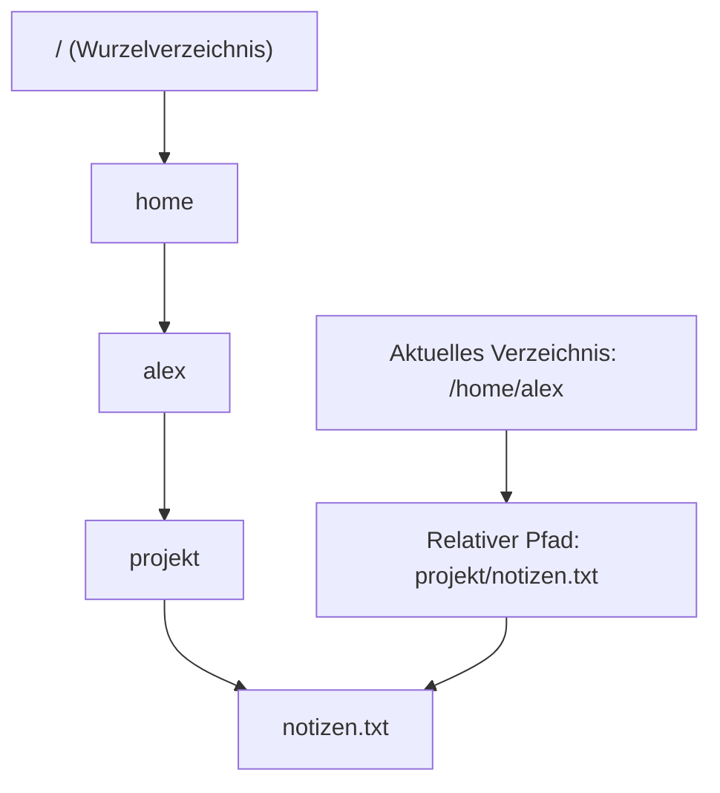
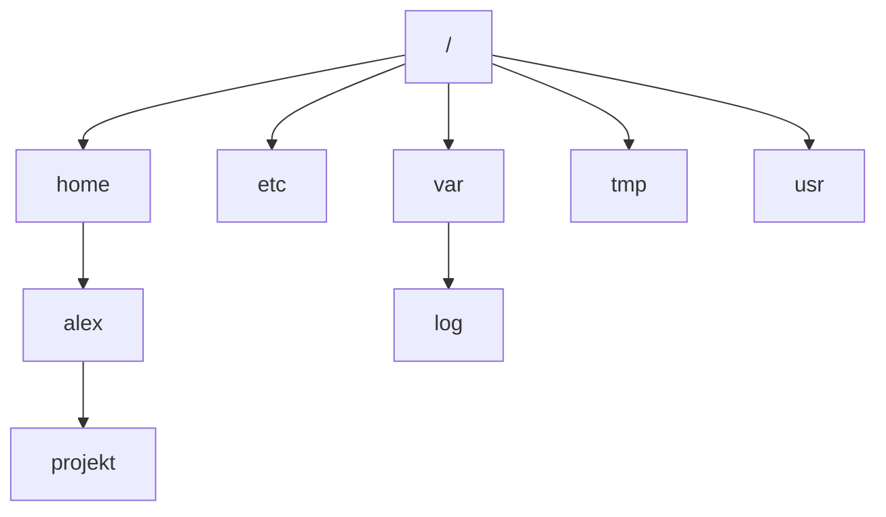
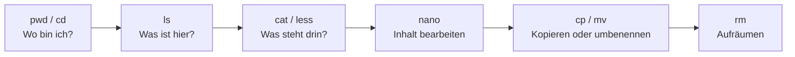

###### Themen

Arbeiten mit der Linux-Shell

- Navigieren im Dateisystem mit relativen und absoluten Pfaden
- Verzeichnisinhalte und Dateien mit ls, cat und less anzeigen

Umgang mit Dateien und Verzeichnissen

- Dateien und Verzeichnisse mit mkdir, cp, mv und rm erstellen und verwalten
- Grundlegende Struktur des Linux-Dateisystems verstehen

Textbearbeitung auf der Kommandozeile

- Dateien mit nano öffnen, bearbeiten und speichern
- Einfache Navigation und Suche innerhalb einer Datei

Praktische Übungen

- Gelerntes in einfachen Alltagsaufgaben anwenden
- Häufige Fehler bei Kommandos erkennen und beheben

<br><br><br>
# 🐧 Arbeiten mit der Linux-Shell

Die Linux-Shell ist die textbasierte Arbeitsoberfläche eines Linux-Systems. Statt auf Symbole und Fenster zu klicken, gibst du Befehle ein. Das wirkt am Anfang nüchtern, ist aber extrem mächtig: Du kannst sehr schnell Dateien ansehen, verschieben, umbenennen, bearbeiten und ganze Arbeitsabläufe sauber reproduzierbar machen.

Wichtig ist dabei, dass die Shell fast immer **im aktuellen Verzeichnis** arbeitet. Viele Befehle beziehen sich also darauf, **wo du dich gerade im Dateisystem befindest**. Genau deshalb sind Pfade, Navigation und ein gutes Verständnis der Dateisystemstruktur absolute Grundlagen.

<br><br><br>
## 📍 Navigieren im Dateisystem mit relativen und absoluten Pfaden

Ein **Pfad** beschreibt den Ort einer Datei oder eines Verzeichnisses im Dateisystem. Dabei gibt es zwei grundlegende Arten:

- **absolute Pfade**
- **relative Pfade**

Ein **absoluter Pfad** beginnt immer bei der Wurzel des Dateisystems, also bei `/`. Er beschreibt einen Ort eindeutig, egal in welchem Verzeichnis du dich gerade befindest.

Beispiel:

```bash
/home/alex/projekt/notizen.txt
```

Das bedeutet: Geh von `/` aus nach `home`, dann `alex`, dann `projekt`, dann zur Datei `notizen.txt`.

Ein **relativer Pfad** beginnt **nicht** bei `/`, sondern wird vom aktuellen Verzeichnis aus interpretiert. Wenn du dich gerade in `/home/alex` befindest, dann zeigt dieser relative Pfad:

```bash
projekt/notizen.txt
```

auf dieselbe Datei wie der absolute Pfad oben.

<br><br><br>
### 🧭 Das aktuelle Verzeichnis verstehen

Die Shell arbeitet immer in einem sogenannten **aktuellen Arbeitsverzeichnis**. Um es anzuzeigen, verwendet man meist `pwd`. `pwd` gibt den vollständigen Pfad des aktuellen Verzeichnisses aus ([pwd invocation](https://www.gnu.org/software/coreutils/manual/html_node/pwd-invocation.html)).

```bash
pwd
```

Beispielausgabe:

```bash
/home/alex
```

Wenn du jetzt einen relativen Pfad benutzt, bezieht er sich auf genau dieses Verzeichnis.

<br><br><br>
### 🪜 Wichtige Bestandteile relativer Pfade

In der Shell begegnen dir sehr häufig diese Kurzschreibweisen:

| Schreibweise | Bedeutung |
|---|---|
| `.` | das aktuelle Verzeichnis |
| `..` | das übergeordnete Verzeichnis |
| `~` | dein Home-Verzeichnis |

Die Tilde `~` wird von der Shell normalerweise zum Home-Verzeichnis des Benutzers erweitert ([Bash Reference Manual – Tilde Expansion](https://www.gnu.org/software/bash/manual/bash.html#Tilde-Expansion)).

Beispiele:

```bash
cd .
```

Du bleibst im aktuellen Verzeichnis.

```bash
cd ..
```

Du gehst eine Ebene nach oben.

```bash
cd ~
```

Du wechselst in dein Home-Verzeichnis.

```bash
cd ~/projekt
```

Du gehst in den Ordner `projekt` innerhalb deines Home-Verzeichnisses.

`cd` ist dabei der Befehl zum Wechseln des Verzeichnisses; in der Bash ist `cd` ein eingebauter Shell-Befehl ([Bash Reference Manual – Bourne Shell Builtins](https://www.gnu.org/software/bash/manual/bash.html#Bourne-Shell-Builtins)).

<br><br><br>
### 🌳 So kannst du dir absolute und relative Pfade vorstellen



Der absolute Pfad startet immer oben bei `/`. Der relative Pfad startet dort, wo du gerade bist.

<br><br><br>
### 🧠 Typische Denkweise beim Navigieren

Wenn du mit Pfaden arbeitest, stell dir immer diese Frage:

**„Von wo aus wird dieser Pfad gerade gelesen?“**

- Beginnt er mit `/` → absolut
- Beginnt er ohne `/` → relativ zum aktuellen Verzeichnis
- Beginnt er mit `~` → relativ zu deinem Home-Verzeichnis

Diese Denkweise verhindert sehr viele Anfängerfehler.

<br><br><br>
## 👀 Verzeichnisinhalte und Dateien mit `ls`, `cat` und `less` anzeigen

Diese drei Befehle gehören zu den wichtigsten Werkzeugen in der Shell.

<br><br><br>
### 📂 `ls` – Verzeichnisinhalte anzeigen

`ls` listet Dateien und Verzeichnisse auf ([ls invocation](https://www.gnu.org/software/coreutils/manual/html_node/ls-invocation.html)).

```bash
ls
```

Damit siehst du den Inhalt des aktuellen Verzeichnisses.

Du kannst aber auch ein anderes Verzeichnis angeben:

```bash
ls /home/alex
```

Sehr nützliche Varianten sind:

```bash
ls -l
```

Die Ausgabe zeigt mehr Details, zum Beispiel Dateirechte, Besitzer, Größe und Änderungsdatum.

```bash
ls -a
```

Damit siehst du auch **versteckte Dateien**. Unter Linux gelten Dateien als versteckt, wenn ihr Name mit einem Punkt beginnt, etwa `.bashrc`.

```bash
ls -la
```

Das ist eine sehr häufige Kombination: ausführliche Liste inklusive versteckter Dateien.

#### Was du aus `ls -l` lernen kannst

Eine typische Zeile könnte so aussehen:

```bash
-rw-r--r-- 1 alex alex 2450 Mär 24 10:15 notizen.txt
```

Das bedeutet grob:

| Teil | Bedeutung |
|---|---|
| `-` | Es ist eine Datei |
| `rw-r--r--` | Rechte |
| `alex alex` | Besitzer und Gruppe |
| `2450` | Größe in Byte |
| `Mär 24 10:15` | Änderungszeit |
| `notizen.txt` | Dateiname |

Für den Einstieg reicht es, wenn du erst einmal erkennst: `ls -l` zeigt dir **mehr als nur Namen**.

<br><br><br>
### 📄 `cat` – Dateiinhalt direkt ausgeben

`cat` liest Dateien und gibt ihren Inhalt auf der Konsole aus ([cat invocation](https://www.gnu.org/software/coreutils/manual/html_node/cat-invocation.html)).

```bash
cat notizen.txt
```

Das ist praktisch für **kurze Textdateien**.

Wenn die Datei sehr lang ist, läuft der Inhalt allerdings einfach durch das Terminal. Dann wird `cat` schnell unübersichtlich.

Wofür `cat` gut ist:

- kleine Konfigurationsdateien schnell ansehen
- mehrere Dateien hintereinander ausgeben
- Inhalte in einfache Shell-Abläufe einbauen

Beispiel:

```bash
cat datei1.txt datei2.txt
```

Die Inhalte werden nacheinander ausgegeben.

Wichtig: `cat` ist kein bequemer Leser für lange Dateien. Dafür ist `less` besser.

<br><br><br>
### 📖 `less` – lange Dateien seitenweise lesen

`less` ist ein sogenannter **Pager**. Es zeigt Text dateiweise beziehungsweise seitenweise an und erlaubt Navigation und Suche innerhalb der Anzeige ([less(1) — Linux manual page](https://man7.org/linux/man-pages/man1/less.1.html)).

```bash
less notizen.txt
```

Jetzt kannst du dich durch die Datei bewegen, statt dass alles auf einmal ins Terminal geschrieben wird.

Wichtige Tasten in `less`:

| Taste | Wirkung |
|---|---|
| `Pfeil runter` | eine Zeile nach unten |
| `Pfeil hoch` | eine Zeile nach oben |
| `Leertaste` | eine Seite weiter |
| `b` | eine Seite zurück |
| `/suchwort` | vorwärts suchen |
| `n` | nächsten Treffer finden |
| `q` | `less` verlassen |

`less` ist für Logs, Konfigurationsdateien und längere Textdateien meist viel angenehmer als `cat`.

<br><br><br>
### 🔍 Wann `ls`, `cat` und `less` jeweils sinnvoll sind

| Befehl | Wofür er gedacht ist | Typischer Einsatz |
|---|---|---|
| `ls` | Inhalte von Verzeichnissen anzeigen | „Was liegt hier?“ |
| `cat` | kurze Dateien direkt ausgeben | „Zeig mir schnell den Inhalt.“ |
| `less` | lange Dateien komfortabel lesen | „Ich will lesen, scrollen und suchen.“ |

Ein typischer Ablauf in der Praxis ist:

```bash
ls
less config.txt
cat kurze_notiz.txt
```

Das wirkt simpel, ist aber genau die Art von Routine, aus der sich sauberes Arbeiten in der Shell entwickelt.

<br><br><br>
# 📁 Umgang mit Dateien und Verzeichnissen

Wenn du mit der Shell arbeitest, verwaltest du Dateien nicht per Maus, sondern mit Befehlen. Das klingt erst einmal technischer, ist aber oft klarer und kontrollierter.

<br><br><br>
## 🏗️ Dateien und Verzeichnisse mit `mkdir`, `cp`, `mv` und `rm` erstellen und verwalten

<br><br><br>
### 🧱 `mkdir` – Verzeichnisse erstellen

`mkdir` erstellt Verzeichnisse ([mkdir invocation](https://www.gnu.org/software/coreutils/manual/html_node/mkdir-invocation.html)).

```bash
mkdir projekt
```

Dadurch entsteht im aktuellen Verzeichnis ein neuer Ordner namens `projekt`.

Wenn du gleich mehrere Ebenen auf einmal anlegen willst, ist `-p` sehr praktisch:

```bash
mkdir -p projekt/notizen/2026
```

Mit `-p` werden fehlende Zwischenverzeichnisse automatisch mit erstellt ([mkdir invocation](https://www.gnu.org/software/coreutils/manual/html_node/mkdir-invocation.html)).

Ohne `-p` würdest du eine Fehlermeldung bekommen, wenn `projekt/notizen` noch gar nicht existiert.

<br><br><br>
### 📋 `cp` – Dateien und Verzeichnisse kopieren

`cp` kopiert Dateien und, mit passender Option, auch Verzeichnisse ([cp invocation](https://www.gnu.org/software/coreutils/manual/html_node/cp-invocation.html)).

Eine Datei kopieren:

```bash
cp notizen.txt sicherung.txt
```

Jetzt existieren beide Dateien.

Eine Datei in ein anderes Verzeichnis kopieren:

```bash
cp notizen.txt projekt/
```

Ein ganzes Verzeichnis kopierst du rekursiv, zum Beispiel mit `-r`:

```bash
cp -r projekt projekt_backup
```

Das ist wichtig: Ohne rekursive Option kopiert `cp` Verzeichnisse nicht vollständig.

`cp` verändert die Originaldatei nicht. Es erzeugt eine Kopie.

<br><br><br>
### 🚚 `mv` – Dateien verschieben oder umbenennen

`mv` verschiebt Dateien und Verzeichnisse oder benennt sie um ([mv invocation](https://www.gnu.org/software/coreutils/manual/html_node/mv-invocation.html)).

Datei umbenennen:

```bash
mv notizen.txt ideen.txt
```

Datei verschieben:

```bash
mv ideen.txt projekt/
```

Ob `mv` als **Umbenennen** oder als **Verschieben** wirkt, hängt vom Ziel ab. Inhaltlich ist es derselbe Befehl: Das Objekt bekommt einen neuen Pfad.

Ein Verzeichnis verschieben funktioniert genauso:

```bash
mv projekt archiv/
```

Wenn `archiv/` existiert, wird `projekt` dorthin verschoben.

<br><br><br>
### 🗑️ `rm` – Dateien und Verzeichnisse löschen

`rm` entfernt Dateien; mit rekursiver Option kann es auch Verzeichnisse samt Inhalt entfernen ([rm invocation](https://www.gnu.org/software/coreutils/manual/html_node/rm-invocation.html)).

Datei löschen:

```bash
rm notizen.txt
```

Verzeichnis samt Inhalt löschen:

```bash
rm -r projekt
```

Sehr wichtig: `rm` verschiebt Dateien normalerweise **nicht in einen Papierkorb**, sondern entfernt sie direkt aus dem Dateisystemkontext des Benutzers ([rm invocation](https://www.gnu.org/software/coreutils/manual/html_node/rm-invocation.html)). Deshalb sollte man mit `rm` besonders vorsichtig sein.

Wenn du eine Rückfrage möchtest, ist `-i` hilfreich:

```bash
rm -i notizen.txt
```

Dann fragt das System vor dem Löschen nach.

<br><br><br>
### ⚠️ Warum `rm -r` so gefährlich sein kann

`rm -r` löscht rekursiv alles unterhalb eines Verzeichnisses. Wenn du dich im Pfad vertippst oder ein unerwartetes Leerzeichen einbaust, kann das sehr viel mehr entfernen als gedacht.

Beispiel für sauberes Arbeiten:

1. erst mit `pwd` prüfen, wo du bist
2. mit `ls` prüfen, was vorhanden ist
3. dann erst `rm` ausführen

Das ist kein Formalismus, sondern gute Betriebspraxis.

<br><br><br>
## 🗂️ Die grundlegende Struktur des Linux-Dateisystems verstehen

Linux organisiert Dateien in einer **einzigen Verzeichnisstruktur**, die bei `/` beginnt. Anders als bei Windows gibt es nicht typischerweise getrennte Laufwerksbuchstaben wie `C:` oder `D:` als Hauptmodell. Alles hängt unterhalb der Wurzel `/`.

Die standardisierte Verzeichnisstruktur wird durch den **Filesystem Hierarchy Standard** beschrieben ([Filesystem Hierarchy Standard](https://refspecs.linuxfoundation.org/FHS_3.0/fhs/index.html)).

<br><br><br>
### 🌐 Wichtige Verzeichnisse im Überblick

| Verzeichnis | Bedeutung |
|---|---|
| `/` | Wurzel des gesamten Dateisystems |
| `/home` | Home-Verzeichnisse der Benutzer |
| `/root` | Home-Verzeichnis des Administrators `root` |
| `/etc` | Systemweite Konfigurationsdateien |
| `/var` | Veränderliche Daten, z. B. Logs |
| `/tmp` | Temporäre Dateien |
| `/usr` | Programme, Bibliotheken, Dokumentation |
| `/bin` | Wichtige Programme |
| `/sbin` | Wichtige Systemprogramme |
| `/dev` | Gerätedateien |
| `/proc` | Informationen über Kernel und Prozesse |

Viele dieser Verzeichnisse sind im FHS beschrieben, zum Beispiel `/etc` für Host-spezifische Systemkonfiguration und `/var` für variable Daten wie Logs oder Spool-Dateien ([Filesystem Hierarchy Standard](https://refspecs.linuxfoundation.org/FHS_3.0/fhs/index.html)).

<br><br><br>
### 🏠 Besonders wichtig für den Alltag: `/home`

Für normales Arbeiten ist `/home` das wichtigste Verzeichnis. Dort liegen die persönlichen Dateien der Benutzer.

Beispiel:

```bash
/home/alex
```

Dort speicherst du typischerweise:

- Dokumente
- Projekte
- Downloads
- eigene Konfigurationsdateien

Das ist der Bereich, in dem du als normaler Benutzer am häufigsten arbeitest.

<br><br><br>
### ⚙️ Warum `/etc` und `/var` wichtig sind

`/etc` enthält meist Konfigurationsdateien für das System und installierte Dienste. Wenn du später mit Servern, Netzwerken oder Entwicklungsumgebungen arbeitest, wirst du dort sehr oft nachsehen ([Filesystem Hierarchy Standard](https://refspecs.linuxfoundation.org/FHS_3.0/fhs/index.html)).

`/var` enthält Daten, die sich laufend ändern, zum Beispiel Log-Dateien. Gerade beim Fehlerfinden ist das relevant, weil viele Programme dort ihre Protokolle ablegen ([Filesystem Hierarchy Standard](https://refspecs.linuxfoundation.org/FHS_3.0/fhs/index.html)).

<br><br><br>
### 🧠 Gute mentale Karte des Dateisystems

Du musst am Anfang nicht jedes Verzeichnis auswendig können. Viel wichtiger ist dieses Grundverständnis:

- `/` ist der Anfang von allem
- unter `/home` liegt dein persönlicher Arbeitsbereich
- unter `/etc` liegt Konfiguration
- unter `/var` liegen oft Logs und laufende Daten
- Pfade beschreiben immer einen Ort in dieser Baumstruktur

Wenn du dieses Modell verinnerlichst, wird die Shell viel logischer.



<br><br><br>
# ✍️ Textbearbeitung auf der Kommandozeile

Eine große Stärke der Shell ist, dass du Dateien nicht nur verwalten, sondern auch direkt bearbeiten kannst. Für den Einstieg ist `nano` ein sehr guter Editor, weil er bewusst einfach gehalten ist.

<br><br><br>
## 📝 Dateien mit `nano` öffnen, bearbeiten und speichern

`nano` ist ein terminalbasierter Texteditor. Er kann Dateien öffnen, bearbeiten und speichern; Befehle werden unten im Editor eingeblendet ([GNU nano](https://www.nano-editor.org/dist/latest/nano.html)).

Datei öffnen:

```bash
nano notizen.txt
```

Wenn die Datei existiert, wird sie geöffnet. Wenn sie noch nicht existiert, kannst du sie neu anlegen und später speichern.

Beim Start von `nano` siehst du unten oft eine Leiste mit Befehlen wie:

- `^O` für Speichern
- `^X` für Beenden
- `^W` für Suchen

Das Zeichen `^` bedeutet **Strg**. Also heißt `^O`: **Strg + O**.

<br><br><br>
### 💾 Speichern in `nano`

Wenn du Änderungen gemacht hast, speicherst du mit:

```text
Strg + O
```

Danach fragt `nano` normalerweise nach dem Dateinamen. Wenn der vorgeschlagene Name korrekt ist, bestätigst du einfach mit **Enter** ([GNU nano](https://www.nano-editor.org/dist/latest/nano.html)).

Beenden:

```text
Strg + X
```

Wenn noch ungespeicherte Änderungen vorhanden sind, fragt `nano`, ob gespeichert werden soll.

Das ist für Einsteiger sehr angenehm, weil `nano` ziemlich direkt sagt, was als Nächstes zu tun ist.

<br><br><br>
### ✏️ Bearbeiten in `nano`

Das Bearbeiten selbst ist unkompliziert: Du bewegst den Cursor an die gewünschte Stelle und tippst. Löschen funktioniert wie gewohnt mit Backspace oder Entf.

`nano` ist absichtlich nicht so komplex wie `vim` oder `emacs`. Für einfache Konfigurationsdateien, Notizen oder kleine Skripte ist es ideal.

<br><br><br>
## 🔎 Einfache Navigation und Suche innerhalb einer Datei

Wenn eine Datei länger wird, brauchst du zwei Dinge:

- bewegen innerhalb des Texts
- gezielt nach Inhalt suchen

Beides kann `nano`.

<br><br><br>
### 🧭 Navigation in `nano`

Du kannst dich mit den Pfeiltasten durch den Text bewegen. Das reicht in vielen Fällen schon völlig aus.

Zusätzlich gibt es nützliche Tastenkombinationen, die in der Dokumentation von `nano` beschrieben sind ([GNU nano](https://www.nano-editor.org/dist/latest/nano.html)):

| Taste | Wirkung |
|---|---|
| Pfeiltasten | Cursor bewegen |
| `Strg + A` | an den Zeilenanfang |
| `Strg + E` | ans Zeilenende |
| `Strg + V` | eine Seite vor |
| `Strg + Y` | eine Seite zurück |

Für den Einstieg musst du nicht alles auswendig kennen. Die Pfeiltasten plus Speichern, Beenden und Suchen reichen am Anfang vollkommen.

<br><br><br>
### 🔍 Suchen in `nano`

Suche starten:

```text
Strg + W
```

Dann gibst du den Suchbegriff ein und bestätigst mit **Enter** ([GNU nano](https://www.nano-editor.org/dist/latest/nano.html)).

Das ist besonders praktisch bei:

- Konfigurationsdateien
- Log-Ausschnitten
- längeren Notizen
- Quellcode mit vielen Zeilen

Wenn du später systemnah arbeitest, wirst du oft eine Datei öffnen und gezielt nach einem Schlüsselwort suchen, statt alles von oben bis unten zu lesen.

<br><br><br>
### 🪄 Typischer Ablauf mit `nano`

Ein einfacher, sehr realistischer Ablauf sieht so aus:

```bash
nano todo.txt
```

Dann:

1. Text eingeben
2. mit `Strg + O` speichern
3. mit Enter bestätigen
4. mit `Strg + X` beenden

Genau solche kleinen Abläufe sind wichtig, weil sie Routine erzeugen. In der Shell ist Routine oft wertvoller als bloßes Auswendiglernen.

<br><br><br>
# 🧰 Gelerntes in einfachen Alltagsaufgaben anwenden

Du wolltest auch den praktischen Bezug. Da du keine Übungen brauchst, zeige ich dir stattdessen typische **Alltagssituationen**, in denen die genannten Befehle ganz natürlich zusammenarbeiten.

<br><br><br>
## 🛠️ Typische Alltagsabläufe in der Shell

Stell dir vor, du möchtest ein kleines Arbeitsverzeichnis anlegen, eine Datei erstellen, sie lesen, umbenennen und später bereinigen.

Ein realistischer Ablauf wäre:

```bash
mkdir projekt
cd projekt
nano notizen.txt
ls
cat notizen.txt
mv notizen.txt ideen.txt
cp ideen.txt backup.txt
less ideen.txt
rm backup.txt
```

Was dabei passiert:

- `mkdir projekt` erstellt deinen Arbeitsordner
- `cd projekt` wechselt hinein
- `nano notizen.txt` legt eine Textdatei an oder öffnet sie
- `ls` zeigt dir, was im Verzeichnis liegt
- `cat notizen.txt` zeigt den Inhalt direkt an
- `mv` benennt die Datei um
- `cp` erstellt eine Sicherung
- `less` zeigt längere Inhalte bequem an
- `rm` entfernt die Sicherung wieder

Daran siehst du: Shell-Arbeit besteht oft nicht aus einem einzelnen „magischen“ Befehl, sondern aus **kleinen, klaren Schritten**, die sich logisch aneinanderreihen.

<br><br><br>
### 🧠 Richtig lernen: nicht nur Befehle merken, sondern Muster erkennen

Gerade bei Core Tech Fundamentals ist es sinnvoll, nicht bloß Kommandos auswendig zu lernen, sondern das zugrunde liegende Muster zu verstehen:

- **Wo bin ich gerade?** → `pwd`
- **Was liegt hier?** → `ls`
- **Wie komme ich woanders hin?** → `cd`
- **Wie sehe ich Inhalt?** → `cat`, `less`
- **Wie ändere ich Struktur?** → `mkdir`, `cp`, `mv`, `rm`
- **Wie bearbeite ich Text?** → `nano`

Wenn du diese Fragen automatisch im Kopf hast, wirst du Befehle viel sicherer einsetzen.

<br><br><br>
## 🚨 Häufige Fehler bei Kommandos erkennen und beheben

Fehler in der Shell sind normal. Wichtig ist, dass du lernst, **Fehlermeldungen als Hinweise** zu lesen, nicht als Niederlage.

<br><br><br>
### ❌ Häufige Fehlerbilder

| Fehlermeldung oder Problem | Typische Ursache | Was du prüfen solltest |
|---|---|---|
| `No such file or directory` | Pfad falsch geschrieben oder falsches aktuelles Verzeichnis | `pwd`, `ls`, Schreibweise prüfen |
| `Permission denied` | fehlende Rechte | Bist du im richtigen Verzeichnis? Hast du Zugriffsrechte? |
| `Is a directory` | Datei-Befehl auf Verzeichnis angewendet | Prüfen, ob Ziel Datei oder Ordner ist |
| `Not a directory` | ein Teil des Pfads ist keine Verzeichnisebene | Pfad Stück für Stück prüfen |
| `rm: cannot remove ...` | Datei existiert nicht oder Rechte fehlen | Name, Pfad und Rechte prüfen |
| `cp: -r not specified` | du willst ein Verzeichnis ohne rekursive Option kopieren | `cp -r` verwenden |

Viele GNU-Werkzeuge dokumentieren ihr Verhalten sehr klar in ihren Handbüchern, etwa dass `cp` für Verzeichnisse rekursiv arbeiten muss ([cp invocation](https://www.gnu.org/software/coreutils/manual/html_node/cp-invocation.html)) und `rm` für das Entfernen von Verzeichnissen rekursive Optionen braucht ([rm invocation](https://www.gnu.org/software/coreutils/manual/html_node/rm-invocation.html)).

<br><br><br>
### 🔬 Der häufigste Anfängerfehler: im falschen Verzeichnis arbeiten

Das ist wirklich der Klassiker. Du denkst, du arbeitest in `~/projekt`, bist aber tatsächlich noch in `~` oder schon in einem ganz anderen Ordner.

Darum ist diese Mini-Routine so wertvoll:

```bash
pwd
ls
```

Erst prüfen, dann handeln.

Wenn ein Befehl „nicht funktioniert“, liegt es erstaunlich oft gar nicht am Befehl selbst, sondern daran, dass der Pfad nicht zu deinem aktuellen Verzeichnis passt.

<br><br><br>
### 🔠 Der zweithäufigste Fehler: Tippfehler und Groß-/Kleinschreibung

Linux unterscheidet zwischen Groß- und Kleinschreibung. `Datei.txt` und `datei.txt` sind zwei verschiedene Namen.

Wenn du also schreibst:

```bash
cat Datei.txt
```

die Datei aber eigentlich `datei.txt` heißt, bekommst du eine Fehlermeldung.

Darum ist `ls` so nützlich: Es zeigt dir die echten Namen.

<br><br><br>
### 🧨 Der gefährlichste Fehler: zu schnell löschen

Ein Befehl wie:

```bash
rm -r irgendwas
```

sollte nie „blind“ ausgeführt werden. Prüfe vorher:

```bash
pwd
ls
```

und schau genau, welcher Pfad gemeint ist.

Wenn du unsicher bist, arbeite erst mit eindeutigen Pfaden, zum Beispiel:

```bash
rm -r ~/projekt/testdaten
```

Das ist oft sicherer als ein relativer Pfad, wenn du gerade nicht hundertprozentig weißt, wo du dich befindest.

<br><br><br>
### 🩹 So gehst du systematisch bei Fehlern vor

Wenn ein Kommando nicht klappt, geh in dieser Reihenfolge vor:

1. **Fehlermeldung genau lesen**
2. **aktuelles Verzeichnis prüfen** mit `pwd`
3. **Inhalt prüfen** mit `ls`
4. **Pfad Zeichen für Zeichen prüfen**
5. **prüfen, ob Datei oder Verzeichnis gemeint ist**
6. **bei langen Dateien lieber `less` statt `cat` nutzen**
7. **bei Änderungen an Dateien lieber vorher eine Kopie anlegen** mit `cp`

Das ist genau die Art von ruhigem, technischem Denken, die in den Grundlagen zählt.

<br><br><br>
## 🔄 Zusammenspiel der wichtigsten Befehle

Zum Schluss noch eine kompakte visuelle Sicht auf den typischen Ablauf beim Arbeiten in der Shell:



Diese Reihenfolge ist nicht zwingend, aber sie zeigt das Grundmuster sehr gut: **orientieren, ansehen, bearbeiten, organisieren, bereinigen**.