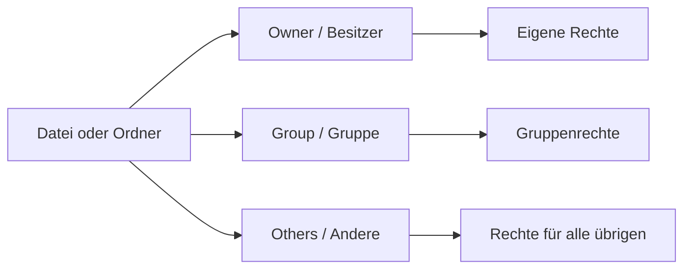

###### Themen

Dateiberechtigungen in Linux

- Grundprinzip von owner, group und others verstehen
- Les-, Schreib- und Ausführrechte grundlegend einordnen
- Berechtigungen mit ls -l anzeigen und mit chmod einfach anpassen

Softwareverwaltung unter Linux

- Programme über die Paketverwaltung installieren und entfernen
- Softwarepakete aktualisieren
- Bedeutung von Paketquellen und Updates im Alltag verstehen

Sicheres und effizientes Arbeiten

- Wichtige Terminal-Regeln für sicheres Arbeiten
- Nützliche Tastatur-Shortcuts und einfache Arbeitsroutinen im Linux-Alltag

<br><br><br>
# 🔐 Dateiberechtigungen in Linux

Linux behandelt Dateien und Ordner nicht einfach nur als „da“ oder „nicht da“, sondern ordnet ihnen Rechte zu. Diese Rechte entscheiden, **wer** etwas **lesen**, **ändern** oder **ausführen** darf. Genau dieses Modell ist einer der wichtigsten Gründe, warum Linux im Mehrbenutzerbetrieb so robust ist. Das Grundprinzip besteht aus drei Rollen: **owner** (Besitzer), **group** (Gruppe) und **others** (alle anderen Benutzer) ([Ubuntu Community Help Wiki: FilePermissions](https://help.ubuntu.com/community/FilePermissions)).


<br><br><br>
## 👤 Grundprinzip: Besitzer, Gruppe und Andere

Stell dir eine Datei wie einen Gegenstand mit Namensschild vor. Linux speichert zu jeder Datei, **wem** sie gehört und **welcher Gruppe** sie zugeordnet ist. Daraus ergeben sich drei Sichtweisen:

- **Owner / Besitzer**: der Benutzer, dem die Datei gehört
- **Group / Gruppe**: eine Benutzergruppe, die auf die Datei bestimmte Rechte haben kann
- **Others / Andere**: alle übrigen Benutzer auf dem System

Wenn du also eine Datei erstellst, bist du normalerweise ihr Besitzer. Gleichzeitig bekommt die Datei auch eine Gruppe zugewiesen. Alle Benutzer, die weder Besitzer noch Mitglied dieser Gruppe sind, fallen in die Kategorie „others“ ([Ubuntu Community Help Wiki: FilePermissions](https://help.ubuntu.com/community/FilePermissions)).

Das ist wichtig, weil Linux so Rechte sehr fein abstufen kann. Du kannst zum Beispiel festlegen:

- Du selbst darfst alles
- deine Arbeitsgruppe darf lesen
- alle anderen dürfen gar nichts

So entsteht ein klares, einfaches Sicherheitsmodell.




<br><br><br>
## 📖 Les-, Schreib- und Ausführrechte richtig einordnen

Die drei grundlegenden Rechte heißen:

- **r = read = lesen**
- **w = write = schreiben**
- **x = execute = ausführen**

Auf den ersten Blick klingt das simpel. In Linux ist aber wichtig, ob sich diese Rechte auf eine **Datei** oder auf ein **Verzeichnis** beziehen. Genau da passieren bei Einsteigern oft Missverständnisse.

<br><br><br>
### 📄 Rechte bei normalen Dateien

Bei einer normalen Datei bedeuten die Rechte:

| Recht | Bedeutung |
|---|---|
| `r` | Inhalt lesen |
| `w` | Inhalt verändern oder überschreiben |
| `x` | Datei als Programm oder Skript ausführen |

Wenn eine Textdatei also `r--` für dich hat, darfst du sie lesen, aber nicht ändern. Wenn ein Skript `x` hat, kann es ausgeführt werden, sofern der Inhalt dafür geeignet ist.

<br><br><br>
### 📁 Rechte bei Verzeichnissen

Bei Ordnern ist die Bedeutung etwas anders:

| Recht | Bedeutung bei Verzeichnissen |
|---|---|
| `r` | Dateinamen im Ordner auflisten |
| `w` | Einträge anlegen, löschen oder umbenennen |
| `x` | In den Ordner „hineingehen“ bzw. ihn betreten/durchqueren |

Gerade das **x-Recht auf Verzeichnissen** ist sehr wichtig. Ohne `x` kannst du den Ordner nicht sinnvoll betreten, selbst wenn `r` gesetzt ist. Das wird oft als **search**- oder **traverse**-Recht beschrieben ([Ubuntu Community Help Wiki: FilePermissions](https://help.ubuntu.com/community/FilePermissions)).

Ein typischer Denkfehler ist: „Ich habe Schreibrecht auf die Datei, also kann ich sie löschen.“ Unter Linux hängt das Löschen aber bei Dateien in einem Ordner vor allem von den **Rechten des Verzeichnisses** ab, nicht nur von denen der Datei. Das ist ein sehr wichtiges Detail im Alltag.

<br><br><br>
### 🧠 Wie Linux Rechte intern darstellt

Rechte werden in Dreierblöcken gespeichert:

- **owner**
- **group**
- **others**

Jeder dieser Blöcke kann `r`, `w`, `x` enthalten oder eben nicht.

Beispiel:

```text
rwxr-x---
```

Das bedeutet:

- `rwx` → Besitzer darf lesen, schreiben, ausführen
- `r-x` → Gruppe darf lesen und ausführen
- `---` → Andere dürfen nichts

Man kann sich das so merken:

| Zeichen | Wert |
|---|---|
| `r` | 4 |
| `w` | 2 |
| `x` | 1 |

Dadurch lassen sich Rechte auch als Zahlen schreiben:

| Kombination | Zahl |
|---|---|
| `---` | 0 |
| `--x` | 1 |
| `-w-` | 2 |
| `-wx` | 3 |
| `r--` | 4 |
| `r-x` | 5 |
| `rw-` | 6 |
| `rwx` | 7 |

Darum bedeutet etwa:

- **`644`** → `rw-r--r--`
- **`755`** → `rwxr-xr-x`
- **`600`** → `rw-------`

Diese Zahlenschreibweise ist besonders praktisch bei `chmod` ([GNU Coreutils: chmod invocation](https://www.gnu.org/software/coreutils/manual/html_node/chmod-invocation.html)).


<br><br><br>
## 🔎 Berechtigungen mit `ls -l` anzeigen

Mit `ls -l` zeigt Linux unter anderem **Dateityp**, **Rechte**, **Eigentümer**, **Gruppe**, **Größe** und **Zeitstempel** an ([GNU Coreutils: What information is listed](https://www.gnu.org/software/coreutils/manual/html_node/What-information-is-listed.html)).

Ein Beispiel:

```bash
ls -l
```

Mögliche Ausgabe:

```text
-rwxr-x--- 1 anna dev 4096 Mar 24 14:10 script.sh
```

Das kann man so lesen:

| Teil | Bedeutung |
|---|---|
| `-` | Dateityp: normale Datei |
| `rwxr-x---` | Rechte |
| `1` | Anzahl harter Links |
| `anna` | Besitzer |
| `dev` | Gruppe |
| `4096` | Größe |
| `Mar 24 14:10` | Änderungszeit |
| `script.sh` | Dateiname |

Beim ersten Zeichen ist besonders wichtig:

| Zeichen | Bedeutung |
|---|---|
| `-` | normale Datei |
| `d` | Verzeichnis |
| `l` | symbolischer Link |

Ein Verzeichnis könnte also so aussehen:

```text
drwxr-xr-x 2 anna dev 4096 Mar 24 14:20 projekt
```

Hier steht das `d` am Anfang für ein Verzeichnis.

Wenn du nur schnell sehen willst, **wer was darf**, dann ist `ls -l` das Standardwerkzeug. Im Alltag gehört dieser Befehl zu den wichtigsten ersten Prüfungen, bevor du Rechte änderst.


<br><br><br>
## 🛠️ Berechtigungen mit `chmod` einfach anpassen

Mit `chmod` änderst du Rechte. Das geht auf zwei Arten:

- **symbolisch**: mit Buchstaben wie `u`, `g`, `o`, `+`, `-`, `=`
- **numerisch**: mit Zahlen wie `644` oder `755`

Beides ist richtig. Für Anfänger ist die symbolische Variante oft verständlicher, die numerische oft schneller.

<br><br><br>
### ✍️ Symbolische Schreibweise

Die Kürzel bedeuten:

| Kürzel | Bedeutung |
|---|---|
| `u` | user / Besitzer |
| `g` | group / Gruppe |
| `o` | others / Andere |
| `a` | all / alle |
| `+` | Recht hinzufügen |
| `-` | Recht entfernen |
| `=` | Rechte genau setzen |

Beispiele:

```bash
chmod u+x script.sh
```

Der Besitzer bekommt Ausführrecht.

```bash
chmod g-w datei.txt
```

Der Gruppe wird Schreibrecht entzogen.

```bash
chmod o-r geheim.txt
```

Andere dürfen die Datei nicht mehr lesen.

```bash
chmod a+r info.txt
```

Alle dürfen lesen.

```bash
chmod u=rw,go=r datei.txt
```

Besitzer darf lesen und schreiben, Gruppe und Andere dürfen nur lesen.

Diese symbolische Form ist sehr gut, wenn du gezielt kleine Änderungen machen willst ([GNU Coreutils: chmod invocation](https://www.gnu.org/software/coreutils/manual/html_node/chmod-invocation.html)).

<br><br><br>
### 🔢 Numerische Schreibweise

Bei der numerischen Form addierst du die Werte:

- `r = 4`
- `w = 2`
- `x = 1`

Beispiele:

```bash
chmod 644 datei.txt
```

Ergebnis: `rw-r--r--`

```bash
chmod 755 script.sh
```

Ergebnis: `rwxr-xr-x`

```bash
chmod 600 geheim.txt
```

Ergebnis: `rw-------`

Das ist im Alltag sehr verbreitet, weil man typische Werte schnell erkennt:

| Modus | Typischer Einsatzzweck |
|---|---|
| `644` | normale Datei, allgemein lesbar |
| `600` | private Datei |
| `755` | Skript oder Ordner, allgemein lesbar und betretbar |
| `700` | privater Ordner oder privates Skript |

<br><br><br>
### ⚠️ Vorsicht bei rekursiven Änderungen

Mit `chmod -R` änderst du Rechte **rekursiv**, also in einem ganzen Ordnerbaum. Das ist mächtig, aber auch gefährlich:

```bash
chmod -R 755 projekt/
```

Damit bekommen sehr viele Dateien und Ordner neue Rechte. Das kann funktionieren, kann aber auch zu viele Rechte vergeben. Besonders problematisch ist es, wenn normale Dateien unnötig ein Ausführrecht bekommen.

Darum gilt im Alltag: **erst mit `ls -l` prüfen, dann gezielt ändern**. Das ist sicherer als „einfach mal rekursiv alles auf 777 setzen“. Letzteres ist fast nie eine gute Idee.


<br><br><br>
# 📦 Softwareverwaltung unter Linux

Unter Linux installiert man Programme meistens nicht, indem man irgendwo eine `.exe` herunterlädt und doppelklickt. Stattdessen verwendet man eine **Paketverwaltung**. Sie kümmert sich darum, Programme aus vertrauenswürdigen Quellen zu laden, Abhängigkeiten mitzuinstallieren und Updates sauber einzuspielen. Genau dieses Konzept ist ein großer Vorteil von Linux im Alltag ([Debian Wiki: AptCLI](https://wiki.debian.org/AptCLI)).


<br><br><br>
## 🧰 Programme über die Paketverwaltung installieren und entfernen

Ein **Paketmanager** ist das Werkzeug, mit dem deine Distribution Software verwaltet. Je nach Linux-System heißt er anders:

| Distribution | Häufiger Paketmanager |
|---|---|
| Debian / Ubuntu | `apt` |
| Fedora / RHEL | `dnf` |
| Arch Linux | `pacman` |

Das Grundprinzip ist aber ähnlich: installieren, entfernen, aktualisieren.

Für Debian- und Ubuntu-Systeme sind die typischen Befehle:

```bash
sudo apt install paketname
```

installiert ein Paket,

```bash
sudo apt remove paketname
```

entfernt das Paket, lässt aber oft Konfigurationsdateien stehen,

und

```bash
sudo apt purge paketname
```

entfernt zusätzlich Konfigurationsdateien, soweit sie paketverwaltet sind ([Debian Wiki: AptCLI](https://wiki.debian.org/AptCLI)).

Beispiele:

```bash
sudo apt install curl
sudo apt remove curl
sudo apt purge curl
```

Unter Fedora oder RHEL sieht das sehr ähnlich aus:

```bash
sudo dnf install paketname
sudo dnf remove paketname
```

Wichtig ist: Die Paketverwaltung kümmert sich nicht nur um das eigentliche Programm, sondern auch um **Abhängigkeiten**. Wenn ein Programm andere Bibliotheken oder Hilfspakete braucht, werden diese mit berücksichtigt. Genau dadurch ist Softwareinstallation auf Linux oft sauberer und reproduzierbarer als wildes manuelles Herunterladen einzelner Dateien.


<br><br><br>
## 🔄 Softwarepakete aktualisieren

Hier ist ein ganz wichtiger Unterschied, den viele am Anfang verwechseln:

```bash
sudo apt update
```

bedeutet **nicht**, dass schon Pakete aktualisiert werden. Dieser Befehl aktualisiert zuerst nur die **Paketlisten**, also die Information darüber, welche Versionen in den Paketquellen verfügbar sind ([Debian Wiki: AptCLI](https://wiki.debian.org/AptCLI)).

Erst danach kommt zum Beispiel:

```bash
sudo apt upgrade
```

Damit werden installierte Pakete auf neuere verfügbare Versionen aktualisiert, sofern das ohne problematische Paketentfernungen oder größere Umstellungen möglich ist ([Debian Wiki: AptCLI](https://wiki.debian.org/AptCLI)).

Ein typischer Ablauf ist also:

```bash
sudo apt update
sudo apt upgrade
```

Man kann sich das so merken:

- **`apt update`** → „Welche neuen Versionen gibt es?“
- **`apt upgrade`** → „Installiere diese neuen Versionen.“

In manchen Situationen gibt es auch:

```bash
sudo apt full-upgrade
```

Dieser Befehl darf, falls nötig, auch Pakete entfernen oder zusätzliche Änderungen an Abhängigkeiten vornehmen, um ein vollständiges Upgrade zu ermöglichen ([Debian Wiki: AptCLI](https://wiki.debian.org/AptCLI)).

Im Alltag sind Updates wichtig, weil sie nicht nur neue Funktionen bringen, sondern vor allem:

- Sicherheitslücken schließen
- Fehler beheben
- Stabilität verbessern
- Kompatibilität erhalten

Gerade auf Systemen, die mit dem Internet verbunden sind, sind regelmäßige Updates keine Kür, sondern Teil guter Grundhygiene.


<br><br><br>
## 🌐 Bedeutung von Paketquellen und Updates im Alltag verstehen

Eine **Paketquelle** oder ein **Repository** ist der Ort, von dem deine Paketverwaltung Informationen und Software bezieht. Bei APT werden diese Quellen in Dateien wie `sources.list` und im Verzeichnis `sources.list.d` definiert ([sources.list(5)](https://manpages.debian.org/bookworm/apt/sources.list.5.en.html)).

Das bedeutet praktisch: Dein System weiß nicht „von selbst“, woher es Software laden soll. Es vertraut auf eingetragene Quellen.

Das hat im Alltag mehrere Folgen:

1. **Offizielle Quellen sind meist am sichersten.**  
   Sie sind auf die Distribution abgestimmt und werden gepflegt.

2. **Drittanbieter-Quellen erweitern die Auswahl, erhöhen aber das Risiko.**  
   Sie können neuere Software liefern, aber auch Konflikte, inkompatible Versionen oder Vertrauensprobleme mitbringen.

3. **Updates kommen über diese Quellen.**  
   Wenn eine Quelle veraltet, deaktiviert oder unseriös ist, kann das zu Problemen führen.

APT verwendet dabei ein Sicherheitsmodell mit signierten Repository-Metadaten, damit die Herkunft von Paketinformationen überprüft werden kann ([apt-secure(8)](https://manpages.debian.org/bookworm/apt/apt-secure.8.en.html)). Genau deshalb ist es im Alltag sinnvoll, möglichst bei vertrauenswürdigen Quellen zu bleiben.

Ein sehr typisches Praxisverständnis ist dieses:

- **Paketquellen** sind die „Läden“
- **Paketlisten** sind der aktuelle Katalog
- **Pakete** sind die eigentlichen Programme
- **`apt update`** holt den neuen Katalog
- **`apt upgrade`** kauft sozusagen die neueren vorhandenen Versionen ein

Wenn du das verstanden hast, wird Softwareverwaltung unter Linux sehr logisch.


<br><br><br>
# 🛡️ Sicheres und effizientes Arbeiten

Linux ist sehr angenehm im Terminal, aber genau dort kann man auch schnell Dinge kaputtmachen, wenn man unachtsam arbeitet. Die gute Nachricht ist: Mit ein paar klaren Regeln und einigen Shortcuts arbeitest du nicht nur sicherer, sondern auch deutlich schneller.


<br><br><br>
## ⚠️ Wichtige Terminal-Regeln für sicheres Arbeiten

Eine der wichtigsten Regeln lautet: **Verstehe einen Befehl, bevor du ihn ausführst.** Das klingt banal, ist aber im Terminal entscheidend. Ein falscher Befehl wirkt oft sofort.

<br><br><br>
### 📍 Regel 1: Immer wissen, wo du gerade bist

Bevor du Dateien löschst, verschiebst oder Rechte änderst, prüfe dein aktuelles Verzeichnis:

```bash
pwd
ls
ls -l
```

`pwd` zeigt dein aktuelles Arbeitsverzeichnis. `ls` und `ls -l` zeigen dir, womit du gerade arbeitest. Diese kleine Gewohnheit verhindert viele Fehler.

Gerade Einsteiger verwechseln schnell:

- das eigene Home-Verzeichnis
- ein Projektverzeichnis
- Systempfade wie `/etc`, `/usr`, `/var`

Ein Befehl im falschen Verzeichnis kann völlig andere Auswirkungen haben als gedacht.

<br><br><br>
### 🔑 Regel 2: `sudo` bewusst einsetzen

`sudo` führt Befehle mit erhöhten Rechten aus, typischerweise als Administrator. Genau deshalb solltest du `sudo` nicht automatisch vor alles setzen. Wenn ein Befehl ohne `sudo` fehlschlägt, ist die richtige Frage nicht immer „Wie mache ich ihn als root?“, sondern zuerst: **Sollte ich das überhaupt tun?**

Viele Anfänger gewöhnen sich ein gefährliches Muster an:

```bash
sudo irgendwas
```

nur weil es sonst nicht klappt. Besser ist:

- erst verstehen, was der Befehl macht
- dann prüfen, ob Admin-Rechte wirklich nötig sind
- erst dann mit `sudo` ausführen

Das schützt vor versehentlichen Systemänderungen.

<br><br><br>
### 🗑️ Regel 3: Bei `rm` besonders vorsichtig sein

`rm` löscht Dateien. Anders als in grafischen Oberflächen gibt es dabei normalerweise keinen Papierkorb. Die GNU-Dokumentation beschreibt `rm` als Werkzeug zum Entfernen von Dateien und optional auch Verzeichnissen; mit Optionen wie `-r` und `-f` wird es sehr mächtig ([GNU Coreutils: rm invocation](https://www.gnu.org/software/coreutils/manual/html_node/rm-invocation.html)).

Besonders riskant sind Kombinationen wie:

```bash
rm -r ordner/
rm -f datei
rm -rf irgendwas
```

Noch gefährlicher wird es mit Platzhaltern:

```bash
rm *.log
```

Das kann sinnvoll sein, aber nur, wenn du genau weißt, **welche Dateien `*` gerade trifft**.

Eine gute Arbeitsroutine ist:

```bash
ls *.log
rm *.log
```

Also zuerst anzeigen lassen, was betroffen wäre, und erst danach löschen.

<br><br><br>
### ✨ Regel 4: Platzhalter und Leerzeichen ernst nehmen

Die Shell verarbeitet Zeichen wie `*`, `?` und Leerzeichen besonders. Darum solltest du Dateinamen mit Leerzeichen sauber behandeln, zum Beispiel mit Anführungszeichen:

```bash
cat "mein dokument.txt"
```

oder per Tab-Vervollständigung arbeiten. Das ist sicherer und bequemer.

Ein häufiger Anfängerfehler ist:

```bash
rm mein dokument.txt
```

Die Shell interpretiert das als zwei getrennte Argumente. Mit Anführungszeichen oder Maskierung vermeidest du genau solche Probleme.

<br><br><br>
### 📚 Regel 5: Hilfe verwenden statt raten

Fast jeder wichtige Befehl bringt Hilfe mit:

```bash
man ls
man chmod
ls --help
chmod --help
```

Das ist keine Nebensache. Gerade im Terminal ist die Fähigkeit, Hilfe selbst nachzuschlagen, eine Kernkompetenz.

Wenn du dir bei einer Option unsicher bist, ist Nachschlagen fast immer besser als Ausprobieren auf gut Glück.

<br><br><br>
### 📝 Regel 6: Umleitungen mit Bedacht benutzen

Ein einzelnes `>` überschreibt eine Datei, während `>>` an eine Datei anhängt. Diese Unterscheidung ist klein, aber im Alltag sehr wichtig.

Beispiel:

```bash
echo "neu" > datei.txt
```

überschreibt den bisherigen Inhalt.

```bash
echo "mehr" >> datei.txt
```

hängt an.

Gerade bei Logs, Konfigurationsschnipseln oder Ausgaben aus Skripten solltest du genau wissen, welches Verhalten du willst.

<br><br><br>
### 🌍 Regel 7: Keine zufälligen Internet-Befehle blind kopieren

Ein Terminalbefehl aus einem Blog, Forum oder Video kann nützlich sein, aber auch gefährlich. Besonders kritisch sind Einzeiler, die direkt Skripte aus dem Internet ausführen.

Die goldene Regel lautet: **erst lesen, dann verstehen, dann ausführen**. Wenn du nicht erklären kannst, was ein Befehl ungefähr tut, solltest du ihn nicht ungeprüft starten.


<br><br><br>
## ⌨️ Nützliche Tastatur-Shortcuts im Linux-Alltag

Viele Shortcuts im Terminal basieren auf den GNU-Readline-Funktionen, die in Bash für die Eingabe und Bearbeitung von Befehlszeilen verwendet werden ([GNU Bash Manual: Commands For Moving](https://www.gnu.org/software/bash/manual/html_node/Commands-For-Moving.html), [GNU Bash Manual: Commands For Killing](https://www.gnu.org/software/bash/manual/html_node/Commands-For-Killing.html)).

Diese Shortcuts sparen jeden Tag Zeit.

| Shortcut | Wirkung |
|---|---|
| `Tab` | automatische Vervollständigung |
| `↑` / `↓` | Befehlsverlauf durchgehen |
| `Ctrl + R` | rückwärts im Verlauf suchen |
| `Ctrl + C` | laufenden Befehl abbrechen |
| `Ctrl + D` | Eingabeende / oft Shell verlassen |
| `Ctrl + L` | Bildschirm leeren |
| `Ctrl + A` | zum Zeilenanfang |
| `Ctrl + E` | zum Zeilenende |
| `Ctrl + U` | vom Cursor bis zum Zeilenanfang löschen |
| `Ctrl + K` | vom Cursor bis zum Zeilenende löschen |

<br><br><br>
### 🔎 Die wichtigsten davon wirklich verstehen

**`Tab`** ist einer der nützlichsten Helfer überhaupt. Statt lange Pfade oder Dateinamen komplett zu tippen, tippst du nur den Anfang und ergänzt mit `Tab`. Das spart Zeit und vermeidet Tippfehler.

**`Ctrl + R`** ist Gold wert, wenn du einen früheren Befehl noch einmal brauchst. Du suchst nicht manuell mit der Pfeiltaste durch 100 alte Befehle, sondern tippst einfach einen Teil des Befehls.

**`Ctrl + C`** beendet normalerweise einen laufenden Vordergrundprozess. Das ist wichtig, wenn ein Befehl hängt, zu lange läuft oder du ihn versehentlich gestartet hast.

**`Ctrl + A`** und **`Ctrl + E`** sind sehr praktisch, wenn du lange Befehle bearbeitest. Statt umständlich mit den Pfeiltasten durch die ganze Zeile zu laufen, springst du sofort an Anfang oder Ende.

**`Ctrl + U`** und **`Ctrl + K`** helfen beim schnellen Bearbeiten. Gerade wenn du eine lange Zeile korrigieren willst, sind sie deutlich schneller als mehrmaliges Backspace.

Wenn du diese paar Shortcuts regelmäßig benutzt, wirkt Terminalarbeit plötzlich viel flüssiger.


<br><br><br>
## 🧭 Einfache Arbeitsroutinen für den Linux-Alltag

Effizienz entsteht nicht nur durch Befehle, sondern durch Gewohnheiten. Gute Arbeitsroutinen machen dich sicherer und schneller.

<br><br><br>
### 📂 Routine 1: Vor Änderungen immer erst schauen

Bevor du etwas änderst:

```bash
pwd
ls
ls -l
```

Diese drei Befehle kosten nur Sekunden, verhindern aber viele Fehler. Das ist eine sehr gute Standardroutine.

<br><br><br>
### 🧪 Routine 2: Erst anzeigen, dann zerstörerisch arbeiten

Bevor du mit Platzhaltern löschst oder verschiebst, zeige die Auswahl erst an:

```bash
ls *.tmp
rm *.tmp
```

oder:

```bash
ls projekt/*.log
mv projekt/*.log archiv/
```

Damit überprüfst du, ob dein Muster wirklich die richtigen Dateien trifft.

<br><br><br>
### 🏷️ Routine 3: Mit klaren Dateinamen arbeiten

Dateinamen ohne unnötige Leerzeichen und Sonderzeichen sind im Terminal einfacher. Statt

```text
Mein neues Dokument final wirklich final.txt
```

ist oft praktischer:

```text
mein-neues-dokument-final.txt
```

Das ist kein Muss, aber im Alltag oft angenehmer.

<br><br><br>
### 🔄 Routine 4: System regelmäßig aktualisieren

Wer Linux produktiv nutzt, sollte Updates nicht monatelang aufschieben. Regelmäßige Updates halten System und Programme sicherer und stabiler. Besonders Browser, Netzwerkanwendungen und systemnahe Pakete profitieren davon.

Eine einfache Routine auf Debian/Ubuntu ist:

```bash
sudo apt update
sudo apt upgrade
```

Nicht täglich aus Zwang, aber regelmäßig und bewusst.

<br><br><br>
### 🧠 Routine 5: Befehle wiederverwenden statt neu tippen

Nutze Verlauf und Suche:

- Pfeiltasten für letzte Befehle
- `Ctrl + R` für ältere Befehle
- `Tab` für Namen und Pfade

Das spart nicht nur Zeit, sondern reduziert auch Tippfehler. Sehr viele fortgeschrittene Linux-Nutzer wirken schnell, weil sie weniger tippen, nicht weil sie mehr Befehle kennen.

<br><br><br>
### 🛑 Routine 6: Root-Rechte als Ausnahme behandeln

Arbeite möglichst als normaler Benutzer und nutze `sudo` nur für konkrete Verwaltungsaufgaben. Das ist eine einfache, aber sehr wirksame Sicherheitsroutine. Viele Fehler sind harmloser, solange sie ohne Admin-Rechte passieren.

Ein praktischer Hinweis: In vielen Shell-Prompts erkennst du root auch am `#` statt am `$`. Das ist kein universelles Gesetz, aber ein häufiges Signal, aufmerksamer zu sein.

<br><br><br>
### 📁 Routine 7: Ordnung im Home-Verzeichnis halten

Lege dir klare Arbeitsordner an, zum Beispiel:

```text
~/projekte
~/downloads
~/scripts
~/notizen
```

Das klingt banal, hilft aber enorm. Wenn Dateien sinnvoll organisiert sind, arbeitest du schneller, löschst seltener versehentlich etwas Falsches und findest Rechteprobleme leichter.