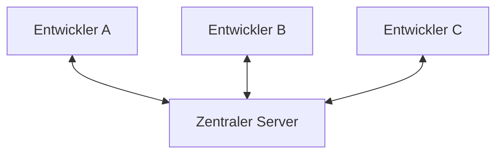
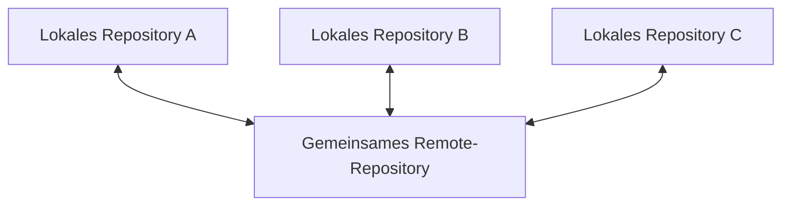

###### Themen

Grundlagen der Versionskontrolle

- Prinzipien von Versionskontrollsystemen
- Unterschied zwischen zentralisierter und verteilter Versionskontrolle
- Nutzen von Versionskontrolle im Arbeitsalltag

Git-Installation und Einrichtung

- Installation von Git
- Grundkonfiguration von Git mit user.name und user.email

Erste Schritte mit Git

- Ein neues Git-Repository initialisieren
- Git-Hilfe und grundlegende Selbsthilfeoptionen nutzen

<br><br><br>

# 📚 Grundlagen der Versionskontrolle

Versionskontrolle bedeutet ganz einfach: Du speicherst nicht nur den aktuellen Stand deiner Dateien, sondern auch ihre **Entwicklung über die Zeit**. Statt also Dateien wie `projekt_final`, `projekt_final_neu`, `projekt_final_wirklich_final` anzulegen, verwaltet ein Versionskontrollsystem die Änderungen sauber, nachvollziehbar und strukturiert. Genau dafür sind Systeme wie Git da. Die Grundidee hinter Versionskontrolle ist in der offiziellen Git-Einführung sehr gut beschrieben: Änderungen sollen historisch nachvollziehbar bleiben, frühere Stände sollen wiederherstellbar sein und Zusammenarbeit soll kontrolliert möglich werden ([Getting Started - About Version Control](https://git-scm.com/book/en/v2/Getting-Started-About-Version-Control)).

Ein Versionskontrollsystem ist damit nicht einfach nur ein Speicherort für Dateien. Es ist eher ein **Zeitprotokoll** für ein Projekt. Du kannst sehen:

- **was** geändert wurde,
- **wann** es geändert wurde,
- **von wem** es geändert wurde,
- und oft auch **warum**, wenn sinnvolle Commit-Nachrichten geschrieben wurden.

Das ist in der Praxis extrem wichtig, weil Softwareentwicklung selten geradlinig verläuft. Man probiert etwas aus, verwirft eine Idee, verbessert einen Ansatz oder behebt einen Fehler. Ohne Versionskontrolle wird so ein Verlauf schnell chaotisch. Mit Versionskontrolle bleibt er geordnet.

<br><br><br>

## 🧠 Prinzipien von Versionskontrollsystemen

Damit du Versionskontrolle wirklich verstehst, lohnt sich ein Blick auf die wichtigsten Grundprinzipien.

<br><br><br>

### 🗂️ 1. Ein Projekt bekommt eine nachvollziehbare Historie

Das Herzstück eines Versionskontrollsystems ist die **Historie**. Jedes Mal, wenn du einen sinnvollen Stand speicherst, entsteht ein neuer Eintrag in dieser Geschichte. In Git heißt so ein gespeicherter Stand **Commit**.

Ein Commit ist nicht einfach nur „Datei gespeichert“. Ein Commit enthält typischerweise:

- den Zustand der Dateien zu diesem Zeitpunkt,
- Metadaten wie Autor, E-Mail und Zeitstempel,
- eine Commit-Nachricht,
- eine Referenz auf vorherige Commits.

Dadurch entsteht eine Kette von Zuständen. Du kannst jederzeit zurückschauen und verstehen, wie das Projekt zu seinem heutigen Zustand gekommen ist.

<br><br><br>

### 📸 2. Git denkt in Schnappschüssen, nicht nur in einzelnen Dateidifferenzen

Ein wichtiger fachlicher Punkt: Git behandelt Daten konzeptionell als **Snapshots**. Das heißt: Bei einem Commit merkt sich Git nicht einfach nur „Zeile 7 wurde geändert“, sondern speichert den Zustand der verfolgten Dateien so, als würdest du einen Schnappschuss des Projekts machen. Die Git-Dokumentation erklärt ausdrücklich, dass Git eher in Snapshots als in klassischen zeilenbasierten Deltas denkt ([Getting Started - What is Git?](https://git-scm.com/book/en/v2/Getting-Started-What-is-Git%3F)).

Das ist wichtig, weil viele Anfänger glauben, Git speichere nur „Änderungslisten“. Praktisch gesehen kannst du Änderungen natürlich vergleichen, aber das interne Modell von Git ist näher an einem Satz von Momentaufnahmen.

Das hilft auch beim Verständnis von Branches, Merges und Wiederherstellung: Git arbeitet nicht mit losen Dateikopien, sondern mit verknüpften Zuständen deines Projekts.

<br><br><br>

### 🧪 3. Änderungen werden bewusst festgeschrieben

Ein gutes Versionskontrollsystem speichert nicht jede zufällige Zwischenbewegung automatisch als offiziellen Projektstand. Stattdessen entscheidest **du**, wann ein Stand wichtig genug ist, um festgehalten zu werden.

In Git läuft das oft in diesem Denkmodell ab:


Das bedeutet:

- Im **Arbeitsverzeichnis** bearbeitest du Dateien ganz normal.
- Im **Staging-Bereich** sammelst du gezielt die Änderungen, die in den nächsten Commit sollen.
- Mit einem **Commit** machst du daraus einen festen Punkt in der Historie.

Gerade dieses bewusste Festschreiben ist didaktisch wichtig: Es zwingt dich dazu, Arbeitsschritte sinnvoll zu strukturieren. Gute Commits machen Projekte verständlicher.

<br><br><br>

### 🔍 4. Änderungen bleiben vergleichbar

Versionskontrolle ist nicht nur ein Archiv, sondern auch ein **Vergleichswerkzeug**. Du kannst anschauen:

- welche Zeilen sich geändert haben,
- welche Datei hinzugekommen oder entfernt wurde,
- wie zwei Versionen voneinander abweichen.

Diese Vergleichbarkeit ist im Alltag Gold wert. Wenn plötzlich ein Fehler auftaucht, kannst du gezielt nachsehen, **ab wann** er entstanden ist und **welche Änderung** ihn wahrscheinlich verursacht hat.

<br><br><br>

### 🌿 5. Paralleles Arbeiten wird möglich

Ein weiteres Grundprinzip moderner Versionskontrollsysteme ist, dass man **nicht immer direkt auf derselben Hauptversion weiterarbeiten muss**. Gerade Git ist stark darin, parallele Entwicklungszweige zu verwalten. Diese nennt man **Branches**.

Ein Branch ist vereinfacht gesagt eine alternative Entwicklungslinie. Du kannst dort gefahrlos an einem Feature arbeiten, ohne den stabilen Hauptstand sofort zu verändern. Später werden diese Arbeiten wieder zusammengeführt.

Auch wenn du Branching hier noch nicht im Detail brauchst, gehört es zu den Prinzipien von Versionskontrolle: **Änderungen sollen isoliert ausprobierbar und später integrierbar sein**.

<br><br><br>

### 🛡️ 6. Integrität und Nachvollziehbarkeit sind zentrale Ziele

Git wurde so gebaut, dass Daten sehr zuverlässig nachvollziehbar bleiben. Inhalte werden intern mit Prüfsummen identifiziert. Das sorgt dafür, dass Git Änderungen eindeutig erkennt und Manipulationen oder Beschädigungen leichter auffallen würden. Die Git-Einführung hebt genau diese Integrität ausdrücklich hervor ([Getting Started - What is Git?](https://git-scm.com/book/en/v2/Getting-Started-What-is-Git%3F)).

Für dich als Lernender heißt das vor allem: Git ist nicht nur bequem, sondern auch technisch darauf ausgelegt, Projektzustände sauber und konsistent zu verwalten.

<br><br><br>

## ⚖️ Unterschied zwischen zentralisierter und verteilter Versionskontrolle

Es gibt zwei große Denkmodelle bei Versionskontrollsystemen: **zentralisiert** und **verteilt**.

<br><br><br>

### 🏢 Zentralisierte Versionskontrolle

Bei der **zentralisierten Versionskontrolle** gibt es typischerweise **einen zentralen Server**, auf dem die offizielle Projektgeschichte liegt. Die Entwickler arbeiten mit Arbeitskopien und kommunizieren ständig mit diesem Server. Klassische Vertreter sind zum Beispiel Subversion (SVN) oder ältere Systeme wie CVS. Das grundlegende Modell wird in der Git-Einführung als Gegensatz zu verteilten Systemen beschrieben ([Getting Started - About Version Control](https://git-scm.com/book/en/v2/Getting-Started-About-Version-Control)).

Das Prinzip sieht ungefähr so aus:



Die Vorteile dabei:

- Es gibt eine klare „zentrale Wahrheit“.
- Verwaltung und Rechtevergabe sind oft einfach.
- Das Modell ist konzeptionell leicht zu verstehen.

Die Nachteile:

- Wenn der Server ausfällt, wird Zusammenarbeit schwierig oder unmöglich.
- Viele Operationen hängen von der Verbindung zum Server ab.
- Die lokale Arbeitskopie enthält oft nicht die vollständige Projektgeschichte.
- Das System ist weniger flexibel für moderne verteilte Arbeitsweisen.

<br><br><br>

### 🌍 Verteilte Versionskontrolle

Bei der **verteilten Versionskontrolle** hat jeder Entwickler lokal eine **vollständige Kopie des Repositories inklusive Historie**. Git ist das bekannteste Beispiel dafür. Die Git-Dokumentation beschreibt genau diesen Unterschied: Bei verteilten Systemen wird nicht nur eine Arbeitskopie geholt, sondern ein vollständiger lokaler Klon des Projekts ([Getting Started - About Version Control](https://git-scm.com/book/en/v2/Getting-Started-About-Version-Control)).

Das Modell sieht eher so aus:



Wichtig ist: Auch bei Git gibt es im Team oft ein gemeinsames Remote-Repository, zum Beispiel auf GitHub, GitLab oder Bitbucket. **Aber technisch ist dieses Remote nicht die einzige vollständige Quelle**. Jeder Klon enthält bereits eine komplette Historie.

Die Vorteile:

- Viele Aktionen funktionieren lokal und sehr schnell.
- Du kannst auch ohne Netzwerk weiterarbeiten.
- Jeder Klon ist zugleich eine Art zusätzliche Sicherheitskopie der Historie.
- Branching und Merging sind sehr leistungsfähig.
- Flexible Team-Workflows werden möglich.

Die Nachteile:

- Das Modell ist am Anfang gedanklich etwas anspruchsvoller.
- Begriffe wie lokal, remote, push, pull, fetch oder merge muss man sauber verstehen.
- Ohne klares Teamvorgehen kann es organisatorisch unübersichtlich werden.

<br><br><br>

### 📋 Direkter Vergleich in einer Tabelle

| Aspekt | Zentralisiert | Verteilt |
|---|---|---|
| Projekt-Historie | Vor allem auf dem zentralen Server | Vollständig lokal vorhanden |
| Arbeiten ohne Netzwerk | Stark eingeschränkt | Gut möglich |
| Geschwindigkeit vieler Befehle | Oft serverabhängig | Häufig sehr schnell lokal |
| Ausfall des Servers | Kritischer Engpass | Weniger kritisch für lokale Arbeit |
| Typische Systeme | SVN, CVS | Git, Mercurial |
| Branching und Merging | Oft umständlicher | Meist sehr stark unterstützt |

Für dein Verständnis ist der wichtigste Punkt dieser: **Git ist verteilt**. Das prägt fast alles, was man mit Git macht.

<br><br><br>

## 💼 Nutzen von Versionskontrolle im Arbeitsalltag

Im Arbeitsalltag ist Versionskontrolle nicht bloß „nice to have“, sondern in fast jedem professionellen technischen Umfeld ein Grundwerkzeug.

<br><br><br>

### 🧯 Fehler rückgängig machen

Der vielleicht direkt spürbarste Nutzen ist: Du kannst Fehler sauber zurückverfolgen und oft auch rückgängig machen. Wenn eine Änderung etwas kaputt macht, musst du nicht in Panik geraten oder alte ZIP-Dateien durchsuchen. Stattdessen schaust du in die Historie und findest heraus, welcher Stand vorher funktioniert hat.

Das verändert die Arbeitsweise enorm. Menschen arbeiten mutiger und strukturierter, wenn sie wissen, dass Änderungen nachvollziehbar bleiben.

<br><br><br>

### 👥 Zusammenarbeit ohne gegenseitiges Überschreiben

Wenn mehrere Personen an denselben Dateien arbeiten, wird es ohne Versionskontrolle schnell chaotisch. Einer überschreibt die Änderungen des anderen, Änderungen gehen verloren oder man weiß nicht mehr, welche Datei jetzt „die richtige“ ist.

Versionskontrolle löst dieses Problem, indem sie Änderungen zusammenführt, Konflikte sichtbar macht und eine gemeinsame Historie erzeugt. Genau deshalb ist Versionskontrolle ein Kernbestandteil professioneller Softwareentwicklung.

<br><br><br>

### 🧾 Dokumentation durch die Projektgeschichte

Ein gutes Repository ist auch eine Form technischer Dokumentation. Wenn Commits sinnvoll benannt sind, kannst du später nachvollziehen:

- wann ein Feature eingeführt wurde,
- wann ein Bug behoben wurde,
- warum eine bestimmte technische Entscheidung getroffen wurde.

Das ist besonders wertvoll, wenn du nach Wochen oder Monaten auf ein Projekt zurückblickst. In echten Teams passiert das ständig.

<br><br><br>

### 🔄 Sicher experimentieren

Mit Versionskontrolle kannst du neue Ideen ausprobieren, ohne den stabilen Stand des Projekts direkt zu gefährden. Das ist didaktisch wie praktisch wichtig: Gute Entwickler arbeiten selten nur linear. Sie probieren aus, vergleichen Ansätze und verwerfen Dinge wieder.

Versionskontrolle macht dieses Experimentieren kontrollierbar.

<br><br><br>

### 🧠 Besser lernen und sauberer denken

Gerade für den Lernkontext ist Git mehr als ein Tool. Es unterstützt eine wichtige Denkweise:

- Arbeit in nachvollziehbare Schritte zerlegen
- Änderungen bewusst bündeln
- Entscheidungen dokumentieren
- eigene Fehler analysieren statt verstecken

Dadurch lernst du nicht nur Git, sondern auch eine saubere technische Arbeitsweise. Und genau das ist im Bereich **Core Tech Fundamentals** besonders wertvoll.

<br><br><br>

### 🧰 Versionskontrolle ist nicht nur für Quellcode nützlich

Obwohl Git vor allem mit Quellcode verbunden wird, kann Versionskontrolle auch für andere textbasierte Inhalte nützlich sein:

- Konfigurationsdateien
- Infrastrukturdefinitionen
- Dokumentation
- Skripte
- Markdown-Notizen

Sobald Inhalte sich entwickeln und nachvollziehbar bleiben sollen, ist Versionskontrolle sinnvoll.

<br><br><br>

# 🛠️ Git-Installation und Einrichtung

Bevor du mit Git arbeitest, brauchst du zwei Dinge:

1. Git muss auf deinem System installiert sein.
2. Git sollte so eingerichtet werden, dass deine Commits korrekt deinen Namen und deine E-Mail-Adresse tragen.

Die offiziellen Installationswege werden auf der Git-Website und im Pro-Git-Buch beschrieben ([Downloads - Git](https://git-scm.com/downloads), [Getting Started - Installing Git](https://git-scm.com/book/en/v2/Getting-Started-Installing-Git)).

<br><br><br>

## 💻 Installation von Git

Die Installation hängt vom Betriebssystem ab. Das Prinzip bleibt aber immer gleich: Git installieren und anschließend prüfen, ob der Befehl `git` verfügbar ist.

<br><br><br>

### 🪟 Git auf Windows installieren

Unter Windows ist der häufigste Weg der offizielle Installer von **Git for Windows** über die Git-Downloadseite ([Downloads - Git](https://git-scm.com/downloads)).

Typischer Ablauf:

- Installer herunterladen
- Setup ausführen
- Standardoptionen meist beibehalten
- danach Terminal oder Git Bash öffnen
- Installation prüfen:

```bash
git --version
```

Wenn Git korrekt installiert ist, bekommst du eine Ausgabe wie zum Beispiel:

```bash
git version 2.x.x
```

Unter Windows ist oft auch **Git Bash** dabei. Das ist praktisch, weil viele Git-Anleitungen mit Shell-Befehlen arbeiten, die dort direkt nutzbar sind.

<br><br><br>

### 🍎 Git auf macOS installieren

Auf macOS gibt es mehrere gängige Wege. Häufig genutzt werden:

- **Homebrew**
- **Xcode Command Line Tools**
- oder die offizielle Git-Quelle

Mit Homebrew lautet der Befehl typischerweise:

```bash
brew install git
```

Auch hier prüfst du anschließend:

```bash
git --version
```

Die offiziellen Git-Quellen nennen diese Wege ebenfalls als typische Installationsoptionen ([Getting Started - Installing Git](https://git-scm.com/book/en/v2/Getting-Started-Installing-Git)).

<br><br><br>

### 🐧 Git auf Linux installieren

Unter Linux wird Git meistens über den Paketmanager deiner Distribution installiert. Je nach System sehen die Befehle unterschiedlich aus. Beispiele:

**Debian/Ubuntu:**

```bash
sudo apt update
sudo apt install git
```

**Fedora:**

```bash
sudo dnf install git
```

**Arch Linux:**

```bash
sudo pacman -S git
```

Auch danach gilt wieder:

```bash
git --version
```

Die Git-Dokumentation empfiehlt ebenfalls die distributionsabhängige Installation über den jeweiligen Paketmanager ([Getting Started - Installing Git](https://git-scm.com/book/en/v2/Getting-Started-Installing-Git)).

<br><br><br>

### ✅ Woran du erkennst, dass Git funktioniert

Wenn der Befehl

```bash
git --version
```

eine Versionsnummer zurückgibt, ist Git grundsätzlich installiert und ausführbar.

Wenn stattdessen eine Fehlermeldung wie „command not found“ erscheint, liegt meistens eines dieser Probleme vor:

- Git ist noch nicht installiert
- die Installation ist fehlerhaft
- Git liegt nicht im `PATH`
- das Terminal wurde nach der Installation noch nicht neu gestartet

Gerade am Anfang ist diese Überprüfung wichtig, weil viele spätere Fehler in Wahrheit gar keine Git-Probleme sind, sondern reine Installations- oder Pfadprobleme.

<br><br><br>

## ⚙️ Grundkonfiguration von Git mit `user.name` und `user.email`

Nach der Installation solltest du Git sagen, **wer du bist**. Diese Angaben landen in deinen Commits. Git speichert bei jedem Commit den Autor und die zugehörige E-Mail-Adresse. Die offizielle Git-Dokumentation beschreibt genau diese erste Einrichtung mit `git config` als grundlegenden Startschritt ([Getting Started - First-Time Git Setup](https://git-scm.com/book/en/v2/Getting-Started-First-Time-Git-Setup)).

<br><br><br>

### 🧾 Warum `user.name` und `user.email` wichtig sind

Wenn du einen Commit erstellst, speichert Git Metadaten wie:

- Name des Autors
- E-Mail-Adresse des Autors
- Zeitpunkt
- Commit-Nachricht

Ohne korrekte Angaben werden Commits zwar manchmal trotzdem erzeugt, aber deine Historie ist dann unsauber oder fehlerhaft zugeordnet. In Teamprojekten ist das besonders problematisch.

Diese Angaben sind also nicht bloß Formalität. Sie sind Teil der Nachvollziehbarkeit.

<br><br><br>

### 🌍 Die übliche globale Konfiguration

Am Anfang setzt man Name und E-Mail meist **global**, also benutzerweit für alle Repositories auf diesem Rechner:

```bash
git config --global user.name "Max Mustermann"
git config --global user.email "max@example.com"
```

`--global` bedeutet: Diese Werte werden standardmäßig für alle deine lokalen Git-Projekte verwendet.

Wenn du danach einen Commit machst, verwendet Git diese Identität, sofern im jeweiligen Repository nichts anderes gesetzt wurde.

<br><br><br>

### 🏷️ Was „global“ fachlich bedeutet

Git kennt mehrere Konfigurationsebenen. Die offizielle Dokumentation erklärt diese Ebenen als **system**, **global** und **local** ([Getting Started - First-Time Git Setup](https://git-scm.com/book/en/v2/Getting-Started-First-Time-Git-Setup)).

| Ebene | Bedeutung |
|---|---|
| `--system` | Gilt systemweit für alle Nutzer auf dem Rechner |
| `--global` | Gilt für deinen Benutzer |
| `--local` | Gilt nur in einem bestimmten Repository |

Für den Einstieg ist `--global` fast immer die richtige Wahl.

Wenn du später in einem einzelnen Projekt eine andere E-Mail brauchst, kannst du sie lokal überschreiben:

```bash
git config user.email "andere-adresse@example.com"
```

Ohne `--global` wird die Einstellung dann nur im aktuellen Repository gesetzt.

<br><br><br>

### 🔎 Konfiguration prüfen

Du kannst kontrollieren, ob die Werte gesetzt wurden:

```bash
git config --global user.name
git config --global user.email
```

Oder du lässt dir mehrere Werte anzeigen:

```bash
git config --global --list
```

Wenn du sehen willst, welche Werte im aktuellen Repository tatsächlich aktiv sind, ist auch das hilfreich:

```bash
git config --list
```

Das ist eine wichtige kleine Selbsthilfe-Technik: Bevor man rätselt, warum Commits „falsch“ signiert erscheinen, sollte man zuerst die Konfiguration prüfen.

<br><br><br>

### 🧠 Typischer Denkfehler am Anfang

Viele glauben, `user.name` und `user.email` hätten automatisch etwas mit einem GitHub- oder GitLab-Login zu tun. Das stimmt so nicht. Diese Werte sind zunächst einmal **Commit-Metadaten in Git selbst**.

Plattformen wie GitHub können Commits deinem Konto zuordnen, wenn die verwendete E-Mail-Adresse dort bekannt ist. Aber technisch gesehen speichert Git diese Informationen unabhängig von einer Online-Plattform.

Das ist ein wichtiger Unterschied: **Git ist das Versionskontrollsystem, GitHub ist nur ein Hosting-Dienst für Git-Repositories.**

<br><br><br>

# 🚀 Erste Schritte mit Git

Wenn Git installiert und eingerichtet ist, kannst du dein erstes eigenes Repository anlegen und lernen, wie du dir selbst mit Git-Hilfe-Funktionen weiterhilfst.

<br><br><br>

## 📁 Ein neues Git-Repository initialisieren

Ein **Repository** ist der Ort, an dem Git die Versionsgeschichte eines Projekts verwaltet. Ein neues Repository zu initialisieren bedeutet: Du sagst Git, dass ein bestimmter Ordner ab jetzt unter Versionskontrolle stehen soll. Der offizielle Befehl dafür ist `git init` ([git-init Documentation](https://git-scm.com/docs/git-init)).

<br><br><br>

### 🏗️ Was `git init` eigentlich macht

Wenn du in einem Ordner `git init` ausführst, legt Git dort intern die nötige Repository-Struktur an. Normalerweise entsteht dabei ein versteckter Ordner namens `.git`. Genau dort speichert Git unter anderem:

- Konfiguration für dieses Repository
- Referenzen auf Branches
- Objektdatenbank
- Commit-Historie
- interne Verwaltungsdaten

Der Befehl selbst wird in der offiziellen Dokumentation knapp beschrieben: Er erzeugt ein leeres Git-Repository oder initialisiert ein bestehendes neu ([git-init Documentation](https://git-scm.com/docs/git-init)).

Wichtig zu verstehen ist: **Der Ordner mit deinen eigentlichen Dateien ist nicht dasselbe wie der `.git`-Ordner.**  
Deine Projektdateien bleiben dort, wo sie sind. Git ergänzt nur seine eigene Verwaltungsstruktur.

<br><br><br>

### 📦 Typischer Ablauf: neues Projekt als Repository anlegen

Ein häufiger Ablauf sieht so aus:

```bash
mkdir mein-projekt
cd mein-projekt
git init
```

Danach ist der Ordner `mein-projekt` ein Git-Repository.

Du kannst Git dann meist sofort mit einem Hinweis wie diesem antworten sehen:

```text
Initialized empty Git repository in ...
```

Das bedeutet aber noch nicht, dass bereits eine Historie existiert. Es heißt nur: Git ist jetzt bereit, Änderungen zu verfolgen.

<br><br><br>

### 🗃️ Bestehenden Projektordner nachträglich unter Versionskontrolle stellen

Du kannst `git init` auch in einem Ordner ausführen, in dem bereits Dateien liegen:

```bash
cd bestehendes-projekt
git init
```

Das ist in der Praxis sehr häufig. Man startet nicht immer mit einem leeren Verzeichnis. Oft gibt es bereits Dateien, und erst dann entscheidet man sich, Git zu verwenden.

Git löscht oder verändert deine Dateien dabei nicht automatisch. Es richtet nur die Versionskontrolle ein.

<br><br><br>

### 🧭 Was nach `git init` als Nächstes logisch kommt

Auch wenn du hier noch keine komplette Commit-Einführung brauchst, ist es wichtig, das Grundprinzip zu verstehen:

1. `git init` richtet das Repository ein.
2. Dateien werden von Git erfasst bzw. vorbereitet.
3. Ein erster Commit erzeugt den ersten echten Punkt in der Historie.

Ohne Commit existiert zwar ein Repository, aber noch keine inhaltliche Projektgeschichte.

Das ist ein typischer Anfängerpunkt: **`git init` allein speichert noch keine Version deiner Arbeit.**

<br><br><br>

### 🕵️ Woran du erkennst, ob du in einem Repository bist

Wenn du unsicher bist, hilft dir oft schon:

```bash
git status
```

Bist du in einem Git-Repository, zeigt Git den Zustand des Repositories an. Bist du außerhalb, erhältst du eine Fehlermeldung wie sinngemäß „not a git repository“.

`git status` ist deshalb eines der wichtigsten Orientierungswerkzeuge überhaupt. Wenn du nicht weißt, was gerade los ist, ist `git status` fast immer ein guter erster Blick.

<br><br><br>

## 🆘 Git-Hilfe und grundlegende Selbsthilfeoptionen nutzen

Ein riesiger Vorteil von Git ist: Das Werkzeug bringt bereits sehr gute eingebaute Hilfe mit. Wer Git richtig lernen will, sollte nicht nur Befehle auswendig lernen, sondern auch verstehen, wie man sich **selbst** hilft.

Die offizielle Dokumentation zu `git help` beschreibt die eingebauten Hilfemechanismen direkt ([git-help Documentation](https://git-scm.com/docs/git-help)).

<br><br><br>

### 📘 `git help` als zentrale Einstiegshilfe

Der Grundbefehl lautet:

```bash
git help
```

Damit bekommst du allgemeine Hilfe zu Git.

Noch wichtiger ist aber die Hilfe zu einem konkreten Befehl:

```bash
git help init
git help config
git help status
```

Das öffnet die jeweilige Dokumentation zu genau diesem Befehl.

Alternativ geht auch:

```bash
git init --help
git config --help
```

Beides ist im Alltag sehr nützlich.

<br><br><br>

### ✂️ Kurze Hilfe mit `-h`

Wenn du nicht die komplette Dokumentation willst, sondern nur eine kurze Befehlsübersicht, ist oft dieses Format angenehmer:

```bash
git init -h
git config -h
```

Das zeigt dir eine kompaktere Kommandohilfe direkt im Terminal.

Didaktisch ist das ein sehr guter Unterschied, den man früh verstehen sollte:

- `--help` = ausführlicher
- `-h` = kürzer und schneller

<br><br><br>

### 🧾 Verfügbare Befehle anzeigen

Wenn du einen Überblick suchst, kannst du dir Git-Befehle anzeigen lassen:

```bash
git help -a
```

Das zeigt eine Liste vieler verfügbarer Unterbefehle.

Für Lernende ist das hilfreich, weil man Git dann nicht als magische Blackbox erlebt, sondern als Werkzeugkasten mit klaren Teilwerkzeugen.

<br><br><br>

### 🧭 `git status` als wichtigste Alltags-Selbsthilfe

Streng genommen ist `git status` kein Hilfebefehl, aber im Alltag ist er oft die **praktischste Selbsthilfeoption überhaupt**.

```bash
git status
```

Dieser Befehl beantwortet dir viele typische Anfangsfragen:

- Bin ich in einem Repository?
- Welche Dateien wurden geändert?
- Welche Dateien sind noch untracked?
- Welche Änderungen sind für den nächsten Commit vorgemerkt?
- Auf welchem Branch bin ich?

Gerade wenn du verwirrt bist, gilt oft diese Faustregel:

1. `git status`
2. `git diff`
3. `git log`

Mit diesen drei Befehlen kannst du schon sehr viele Situationen selbst verstehen.

<br><br><br>

### 🔍 Hilfe gezielt mit Dokumentation kombinieren

Ein sehr guter Lernweg ist dieser:

Wenn du einen Befehl siehst, den du noch nicht verstehst, schau sofort nach:

```bash
git help <befehl>
```

Zum Beispiel:

```bash
git help init
```

Dann achte besonders auf diese Teile der Doku:

- **NAME** – Was macht der Befehl grundsätzlich?
- **SYNOPSIS** – Wie lautet die Grundform?
- **DESCRIPTION** – Was passiert genauer?
- **OPTIONS** – Welche Zusatzoptionen gibt es?

Damit lernst du Git nicht als Sammlung einzelner Tricks, sondern als konsistentes System.

<br><br><br>

### 🧠 Warum Selbsthilfe in Git so wichtig ist

Git ist ein sehr mächtiges Werkzeug. Gerade deshalb kommt man langfristig nicht weit, wenn man nur einzelne Copy-Paste-Befehle auswendig lernt.

Professionelles Arbeiten mit Git bedeutet auch:

- Begrifflichkeiten sauber lesen
- Terminalausgaben ernst nehmen
- Dokumentation nutzen
- vor einem Befehl verstehen, was er tut

Das ist nicht nur für Git wichtig, sondern allgemein für technisches Lernen. Wer früh lernt, eingebaute Hilfe zu verwenden, wird deutlich unabhängiger und sicherer.

<br><br><br>

### 🛑 Was du am Anfang vermeiden solltest

Am Anfang ist die größte Gefahr nicht, „zu wenig Befehle“ zu kennen, sondern zu schnell Befehle auszuführen, deren Wirkung man nicht versteht.

Deshalb ist dieses Prinzip sinnvoll:

Wenn du unsicher bist:

- zuerst `git status`
- dann `git help <befehl>`
- erst dann den Befehl ausführen

Das klingt simpel, ist aber in der Praxis eine sehr starke Lernstrategie.

<br><br><br>

### 🧱 Ein sauberes mentales Grundmodell für den Start

Wenn du diese ersten Punkte verinnerlichst, hast du bereits ein sehr gutes Fundament:

- Ein **Repository** ist der verwaltete Projektkontext.
- `git init` macht einen Ordner zu einem Git-Repository.
- Git speichert Projektzustände als nachvollziehbare Historie.
- `user.name` und `user.email` gehören zu den Commit-Metadaten.
- `git help` und `git status` sind zentrale Werkzeuge zur Orientierung.

Genau dieses Grundmodell ist wichtig, weil spätere Themen wie `add`, `commit`, `branch`, `merge`, `clone`, `push` und `pull` darauf aufbauen.