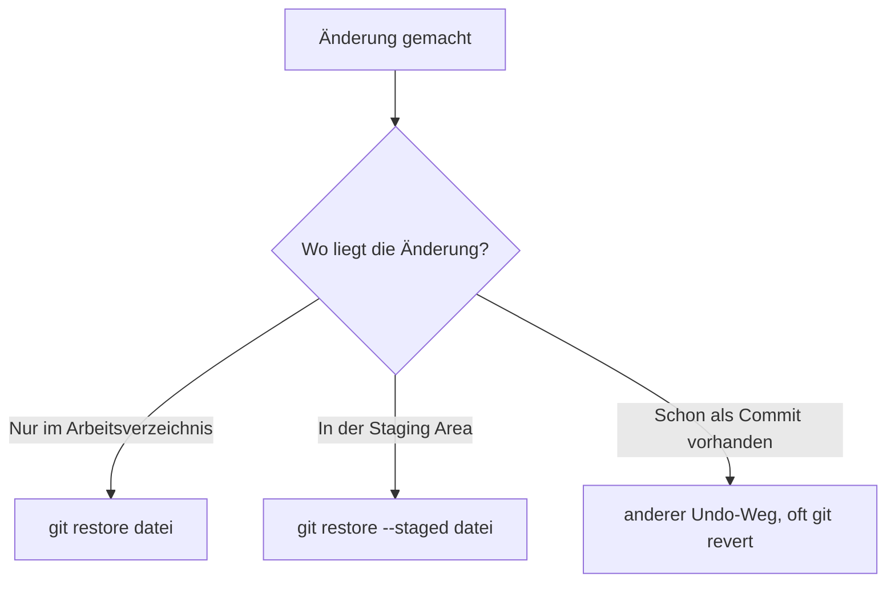
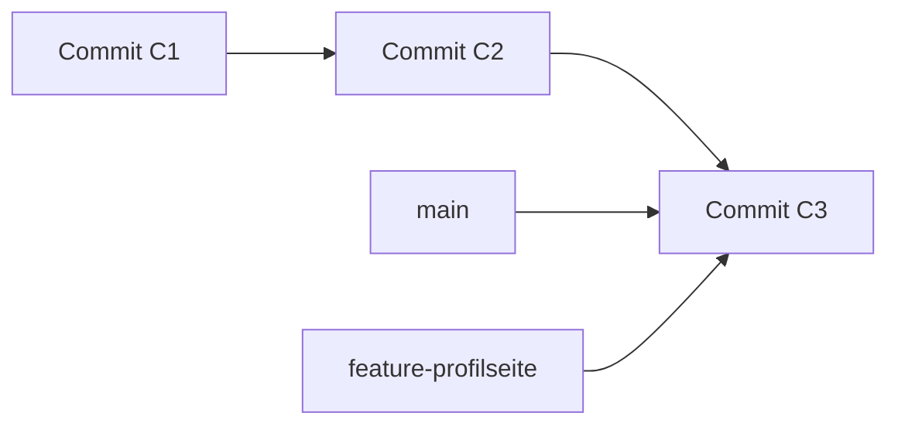
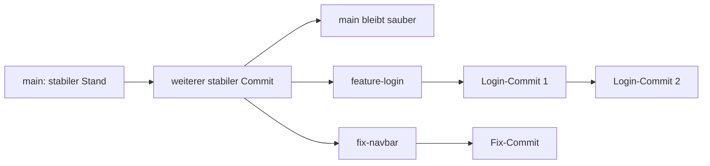

###### Themen

Dateien und Änderungen nachverfolgen

- Dateien ins Repository aufnehmen
- Änderungen mit Commits sichern

Arbeitsstatus und Historie prüfen

- Den aktuellen Status eines Repositories prüfen
- Änderungen und Commit-Historie anzeigen

Änderungen einfach rückgängig machen

- Nicht gespeicherte Änderungen mit git restore zurücksetzen
- Grundidee von Rückgängig-Funktionen in Git verstehen

Branch-Management

- Branches anzeigen und erstellen
- Zwischen Branches wechseln
- Den Zweck von Branches im Arbeitsalltag verstehen

<br><br><br>
# 📦 Dateien und Änderungen nachverfolgen

Git zu verstehen wird viel leichter, wenn du nicht nur einzelne Befehle auswendig lernst, sondern das **Modell dahinter** erkennst. Genau das ist bei Git entscheidend: Git ist nicht einfach nur ein Werkzeug zum „Speichern“, sondern ein System, das **Zustände deines Projekts** nachvollziehbar festhält.

Eine ganz wichtige Grundlage ist: Git speichert dein Projekt im Kern nicht wie ein Texteditor mit „letzter Stand überschreibt alten Stand“, sondern arbeitet mit **Snapshots**, also festgehaltenen Projektzuständen ([Pro Git – What is Git?](https://git-scm.com/book/en/v2/Getting-Started-What-is-Git%3F)).

Damit du die nächsten Befehle wirklich verstehst, solltest du diese drei Bereiche im Kopf haben:

- **Arbeitsverzeichnis**: Das sind die Dateien, an denen du gerade arbeitest.
- **Staging Area** (auch **Index** genannt): Eine Art Vorbereitungsbereich für den nächsten Commit.
- **Repository**: Die eigentliche Git-Historie mit deinen Commits.

<br><br><br>
## 🧠 Das Grundmodell: Arbeitsverzeichnis, Staging Area und Repository

Wenn du eine Datei bearbeitest, passiert das zuerst nur in deinem **Arbeitsverzeichnis**. Git weiß dann zwar oft schon, dass sich etwas verändert hat, aber diese Änderung ist noch nicht automatisch im nächsten Commit enthalten.

Mit `git add` legst du fest, **welche Änderungen in den nächsten Commit aufgenommen werden sollen**. Technisch fügt `git add` Dateiinhalte zur **Index-/Staging-Area** hinzu ([git-add Documentation](https://git-scm.com/docs/git-add)).

Erst mit `git commit` wird aus dem Inhalt der Staging Area ein echter, neuer Eintrag in der Projektgeschichte. `git commit` erstellt also einen Commit aus dem aktuellen Inhalt des Index ([git-commit Documentation](https://git-scm.com/docs/git-commit)).


Das ist die wichtigste Denkweise für Git:

- **Bearbeiten** ist noch nicht **vormerken**
- **Vormerken** ist noch nicht **dauerhaft sichern**
- **Committen** ist das eigentliche Festhalten in der Historie

Wenn du dieses Modell sauber verstanden hast, werden fast alle Git-Befehle logisch.

<br><br><br>
## 📁 Dateien ins Repository aufnehmen

Wenn du eine neue Datei erstellt hast, kennt Git sie zunächst oft noch gar nicht. Solche Dateien nennt Git **untracked files**, also „nicht verfolgte Dateien“. Das kannst du mit `git status` sehen; dieser Befehl zeigt den Zustand des Arbeitsverzeichnisses und der Staging Area an ([git-status Documentation](https://git-scm.com/docs/git-status)).

Angenommen, du hast eine Datei `app.js` erstellt. Dann ist der typische Ablauf:

```bash
git status
git add app.js
git status
```

Vor `git add` ist die Datei meist **untracked**. Nach `git add` ist sie für den nächsten Commit **vorgemerkt**.

Wichtig ist hier eine sehr präzise Unterscheidung, weil sie Anfänger oft verwirrt:

- Umgangssprachlich sagt man oft: „Ich habe die Datei ins Repository aufgenommen.“
- Technisch sauber gesagt passiert mit `git add` erst einmal:  
  **Die Datei wird in die Staging Area aufgenommen.**
- Erst mit `git commit` landet dieser Zustand wirklich in der **Repository-Historie**.

Ein vollständiges Beispiel sieht so aus:

```bash
git add app.js
git commit -m "Füge app.js hinzu"
```

Danach ist die Datei nicht nur Git bekannt, sondern auch als Teil eines konkreten Commits gespeichert.

<br><br><br>
### 📄 Typische Dateizustände in Git

Diese Zustände solltest du kennen:

| Zustand | Bedeutung |
|---|---|
| **untracked** | Datei existiert, wird aber von Git noch nicht verfolgt |
| **modified** | Datei wird verfolgt, wurde aber verändert |
| **staged** | Änderung ist für den nächsten Commit vorgemerkt |
| **committed** | Änderung ist bereits in einem Commit gespeichert |

Ein wichtiger Lernhinweis: Denke bei Git nicht zuerst in Befehlen, sondern in **Zuständen**. Frage dich immer:

1. Liegt die Änderung nur im Arbeitsverzeichnis?
2. Ist sie schon in der Staging Area?
3. Ist sie schon in einem Commit?

Wer diese drei Fragen beantworten kann, versteht Git meistens deutlich besser als jemand, der nur Befehle auswendig kennt.

<br><br><br>
## 💾 Änderungen mit Commits sichern

Ein **Commit** ist ein festgehaltener Projektzustand mit einer Nachricht, die beschreibt, was geändert wurde. Git erstellt dabei einen neuen Commit aus dem Inhalt, der aktuell in der Staging Area liegt ([git-commit Documentation](https://git-scm.com/docs/git-commit)).

Ein klassischer Ablauf sieht so aus:

```bash
git add app.js
git commit -m "Ergänze erste Version der Anwendung"
```

Das bedeutet:

- `git add app.js` markiert die Änderung für den nächsten Commit
- `git commit -m "..."` speichert genau diesen vorgemerkten Stand in der Git-Historie

Sehr wichtig: Ein Commit enthält **nicht automatisch alle geänderten Dateien**, sondern standardmäßig nur das, was du vorher gestaged hast. Das ist einer der großen Vorteile von Git: Du kannst bewusst entscheiden, welche Änderungen zusammengehören.

Wenn du zum Beispiel gleichzeitig

- einen Rechtschreibfehler behebst
- und eine neue Funktion einbaust

dann kannst du diese Änderungen getrennt committen, obwohl sie im selben Arbeitszeitraum entstanden sind. Das macht die Historie später viel verständlicher.

<br><br><br>
### 📝 Gute Commit-Nachrichten verstehen

Eine Commit-Nachricht sollte kurz und klar sagen, **was** geändert wurde. Gute Commit-Nachrichten helfen dir später enorm beim Nachvollziehen.

Beispiele:

```bash
git commit -m "Behebe Fehler in der Passwortprüfung"
git commit -m "Füge Formularvalidierung hinzu"
git commit -m "Benenne Konfigurationsdatei um"
```

Weniger gut wären unklare Nachrichten wie:

```bash
git commit -m "Update"
git commit -m "Änderungen"
git commit -m "fix"
```

Je sauberer deine Commits formuliert sind, desto leichter wird das spätere Verstehen deiner Historie.

<br><br><br>
# 🔍 Arbeitsstatus und Historie prüfen

Bei Git reicht es nicht, nur Änderungen zu machen. Du musst auch lesen können, **was gerade los ist**. Genau dafür gibt es Befehle wie `git status`, `git diff` und `git log`.

Das ist im Arbeitsalltag extrem wichtig, weil du sonst schnell den Überblick verlierst:

- Welche Dateien wurden geändert?
- Was ist schon gestaged?
- Was ist noch ungesichert?
- Welche Commits gibt es bereits?

<br><br><br>
## 📌 Den aktuellen Status eines Repositories prüfen

Der wichtigste Alltagsbefehl dafür ist:

```bash
git status
```

Dieser Befehl zeigt dir den Status des Arbeitsverzeichnisses und der Staging Area ([git-status Documentation](https://git-scm.com/docs/git-status)).

Wenn du `git status` regelmäßig benutzt, bekommst du fast immer sofort Antworten auf diese Fragen:

- Auf welchem Branch bin ich gerade?
- Gibt es neue Dateien?
- Gibt es geänderte Dateien?
- Was ist schon für den Commit vorgemerkt?
- Gibt es noch nicht gestagte Änderungen?

Ein typischer Denkprozess ist:

1. Ich habe etwas geändert.
2. Ich prüfe mit `git status`, was Git davon sieht.
3. Ich entscheide, was ich stagen will.
4. Ich committe bewusst.

Das ist wesentlich besser, als „einfach mal irgendwas zu committen“.

<br><br><br>
### 🧾 Beispiel: `git status` richtig lesen

Ein mögliches Beispiel:

```bash
On branch main
Changes to be committed:
  modified:   app.js

Changes not staged for commit:
  modified:   style.css

Untracked files:
  notes.txt
```

Das bedeutet:

- `app.js` ist bereits **gestaged**
- `style.css` wurde verändert, aber noch **nicht gestaged**
- `notes.txt` ist neu und Git verfolgt sie noch **nicht**

Du siehst daran sehr schön, dass Git unterschiedliche Zustände gleichzeitig verwalten kann.

Wenn du eine kompaktere Ausgabe willst, kannst du oft auch die Kurzform verwenden:

```bash
git status -s
```

Dann erscheinen Zustände in einer verkürzten Form, was im Alltag oft angenehmer ist.

<br><br><br>
## 🕰️ Änderungen und Commit-Historie anzeigen

Es gibt zwei eng verwandte, aber unterschiedliche Fragen:

1. **Welche Änderungen habe ich gerade in Dateien gemacht?**
2. **Welche Commits gibt es bereits in der Historie?**

Für die erste Frage ist `git diff` wichtig. `git diff` zeigt Unterschiede zwischen verschiedenen Zuständen an, zum Beispiel zwischen Arbeitsverzeichnis und Staging Area oder zwischen Staging Area und letztem Commit ([git-diff Documentation](https://git-scm.com/docs/git-diff)).

Für die zweite Frage ist `git log` wichtig. `git log` zeigt die Commit-Historie an ([git-log Documentation](https://git-scm.com/docs/git-log)).

<br><br><br>
### 🔎 Aktuelle Änderungen mit `git diff` ansehen

Typische Varianten:

```bash
git diff
```

Das zeigt normalerweise Änderungen, die **noch nicht gestaged** sind.

```bash
git diff --staged
```

Das zeigt Änderungen, die **bereits gestaged** sind und im nächsten Commit landen würden.

Das ist fachlich sehr wichtig, weil viele Anfänger `git status` und `git diff` verwechseln:

- `git status` sagt dir **welche Dateien** in welchem Zustand sind
- `git diff` zeigt dir **den genauen Inhalt der Änderungen**

Wenn du also wissen willst, *welche Zeilen* sich verändert haben, brauchst du `git diff`.

<br><br><br>
### 📚 Commit-Historie mit `git log` lesen

Der einfachste Befehl ist:

```bash
git log
```

Dann siehst du mehrere Commits mit Commit-Hash, Autor, Datum und Nachricht.

Im Alltag ist oft diese kompakte Form angenehmer:

```bash
git log --oneline
```

Sehr nützlich ist auch:

```bash
git log --oneline --graph --decorate --all
```

Damit bekommst du eine kompakte, oft sehr verständliche Darstellung der Historie mit Branch-Hinweisen.

Ein Beispiel:

```bash
a1b2c3d Füge Formularvalidierung hinzu
9f8e7d6 Behebe CSS-Abstand im Header
5d4c3b2 Initialer Projektaufbau
```

So kannst du gut nachvollziehen, **was nacheinander passiert ist**.

<br><br><br>
### 🧠 Warum `status`, `diff` und `log` zusammengehören

Diese drei Befehle bilden im Alltag eine starke Kombination:

| Frage | Passender Befehl |
|---|---|
| Was ist gerade der Zustand? | `git status` |
| Was genau wurde in Dateien geändert? | `git diff` |
| Welche gespeicherten Schritte gibt es schon? | `git log` |

Wenn du Git sauber lernen willst, solltest du diese drei Befehle fast schon als „Grundblick“ auf ein Projekt sehen.

<br><br><br>
# ↩️ Änderungen einfach rückgängig machen

Rückgängig machen ist in Git ein eigenes Thema, weil Git je nach Zustand unterschiedliche Werkzeuge bietet. Die wichtigste Grundregel lautet:

**Bevor du etwas rückgängig machst, musst du wissen, wo die Änderung gerade liegt.**

Denn eine Änderung kann

- nur im Arbeitsverzeichnis liegen
- schon gestaged sein
- schon in einem Commit gespeichert sein

Je nachdem braucht man einen anderen Befehl.

<br><br><br>
## 🧹 Nicht gespeicherte Änderungen mit `git restore` zurücksetzen

`git restore` dient dazu, Inhalte im Arbeitsverzeichnis wiederherzustellen; es kann auch mit Optionen die Staging Area beeinflussen ([git-restore Documentation](https://git-scm.com/docs/git-restore)).

Wenn du eine Datei verändert hast, diese Änderung aber **noch nicht committen** willst und sie einfach verwerfen möchtest, kannst du zum Beispiel Folgendes nutzen:

```bash
git restore app.js
```

Das bedeutet praktisch:

- Die Datei `app.js` wird auf den Stand zurückgesetzt, den Git als aktuellen Ausgangspunkt kennt.
- Deine **nicht gespeicherten** Änderungen in dieser Datei gehen dabei verloren.

Das ist wichtig: `git restore` ist kein „magisches Zurück“. Wenn du lokale Änderungen verwerfst, sind sie in der Regel weg, sofern sie nicht irgendwo anders gesichert wurden.

<br><br><br>
### ⚠️ Was genau bei `git restore` passiert

Angenommen, du hast in `app.js` experimentiert und willst alles seit dem letzten gespeicherten Stand verwerfen:

```bash
git restore app.js
```

Dann wird `app.js` wieder so hergestellt, wie Git sie gerade aus dem letzten bekannten Zustand ableiten kann.

Wenn du mehrere Dateien zurücksetzen willst:

```bash
git restore .
```

Dabei ist Vorsicht nötig, denn dann verwirfst du potenziell viele ungespeicherte Änderungen auf einmal.

<br><br><br>
### 🗂️ Unterschied zwischen Arbeitsverzeichnis und Staging Area

Hier wird Git für viele zum ersten Mal wirklich klar:

- `git restore datei` betrifft typischerweise Änderungen im **Arbeitsverzeichnis**
- `git restore --staged datei` entfernt eine Änderung aus der **Staging Area**, ohne die Datei selbst zwingend inhaltlich zu löschen ([git-restore Documentation](https://git-scm.com/docs/git-restore))

Beispiel:

```bash
git restore --staged app.js
```

Das heißt:

- `app.js` ist nicht mehr für den nächsten Commit vorgemerkt
- Die Änderungen in der Datei selbst können weiterhin im Arbeitsverzeichnis vorhanden sein

Das ist extrem nützlich, wenn du aus Versehen etwas mit `git add` gestaged hast, das noch nicht in den nächsten Commit gehört.

<br><br><br>
## 🧭 Grundidee von Rückgängig-Funktionen in Git verstehen

Das Wichtigste beim Thema „rückgängig machen“ ist nicht, möglichst viele Befehle zu kennen, sondern die **Logik** dahinter zu verstehen.

Die Kernfrage lautet immer:

**Was genau willst du rückgängig machen?**

- Nur lokale, ungespeicherte Dateiänderungen?
- Nur etwas aus der Staging Area entfernen?
- Einen bereits erstellten Commit rückgängig machen?

Daraus ergibt sich dann das passende Werkzeug.

<br><br><br>
### 🧠 Die zentrale Entscheidungslogik

| Situation | Typischer Gedanke | Passender Git-Weg |
|---|---|---|
| Datei lokal verändert, aber noch nicht commitet | „Ich will meine lokalen Änderungen verwerfen“ | `git restore datei` |
| Datei versehentlich gestaged | „Soll noch nicht in den nächsten Commit“ | `git restore --staged datei` |
| Commit existiert schon und soll fachlich rückgängig gemacht werden | „Ich will die Wirkung eines Commits zurücknehmen“ | oft `git revert` |

Wenn ein Commit bereits existiert und besonders wenn er schon geteilt wurde, ist `git revert` oft der sichere Weg, weil dabei ein neuer Commit erstellt wird, der einen früheren Commit rückgängig macht ([git-revert Documentation](https://git-scm.com/docs/git-revert)).

Für dein aktuelles Lernziel reicht aber vor allem diese Einsicht:

- **`restore`** arbeitet stark auf Ebene von Dateiinhalt und Staging
- **spätere Undo-Befehle** arbeiten eher auf Ebene der Commit-Historie

Diese Trennung ist ein Kernprinzip von Git.



Wenn du Git richtig lernen willst, ist das eine sehr gute Merkhilfe:  
**Git macht nicht „alles gleich“, sondern abhängig davon, auf welcher Ebene du arbeitest.**

<br><br><br>
# 🌿 Branch-Management

Branches gehören zu den wichtigsten Git-Konzepten überhaupt. Viele Anfänger sehen Branches zuerst nur als technische Zusatzfunktion, aber im Alltag sind sie ein zentrales Werkzeug, um **parallel**, **geordnet** und **risikoarm** zu arbeiten.

Ein Branch ist in Git im Kern ein beweglicher Zeiger auf einen Commit ([Pro Git – Branches in a Nutshell](https://git-scm.com/book/en/v2/Git-Branching-Branches-in-a-Nutshell)). Das klingt erst einmal abstrakt, wird aber gleich sehr praktisch.

Wenn du auf einem Branch weiterarbeitest und neue Commits erzeugst, wandert dieser Zeiger einfach weiter.

<br><br><br>
## 🌱 Branches anzeigen und erstellen

Um vorhandene Branches anzuzeigen, verwendest du:

```bash
git branch
```

Dieser Befehl listet Branches auf; mit ihm lassen sich auch Branches erstellen ([git-branch Documentation](https://git-scm.com/docs/git-branch)).

Die Ausgabe könnte so aussehen:

```bash
* main
  feature-login
  fix-header
```

Das Sternchen `*` zeigt dir, auf welchem Branch du dich gerade befindest. In diesem Beispiel also auf `main`.

Einen neuen Branch erstellst du so:

```bash
git branch feature-profilseite
```

Dadurch wird ein neuer Branch angelegt. Du bist danach aber **noch nicht automatisch auf diesem Branch**, sondern bleibst zunächst auf deinem aktuellen Branch.

Das ist eine wichtige Stolperfalle für Einsteiger.

<br><br><br>
### 🌿 Was beim Erstellen eines Branches technisch passiert

Wenn du einen Branch erzeugst, kopiert Git nicht dein ganzes Projekt in einen neuen Ordner. Stattdessen wird im Wesentlichen ein neuer Name erzeugt, der auf denselben Commit zeigt wie dein aktueller Branch ([Pro Git – Branches in a Nutshell](https://git-scm.com/book/en/v2/Git-Branching-Branches-in-a-Nutshell)).

Das macht Branches in Git sehr leichtgewichtig und schnell.



Nach dem Erstellen zeigen also oft zunächst beide Branches auf denselben Commit. Erst wenn du auf einem Branch neue Commits machst, entwickeln sie sich auseinander.

<br><br><br>
## 🔀 Zwischen Branches wechseln

Zum Wechseln zwischen Branches ist heute oft `git switch` die klarere Variante. Dieser Befehl dient zum Wechseln von Branches ([git-switch Documentation](https://git-scm.com/docs/git-switch)).

Beispiel:

```bash
git switch feature-profilseite
```

Danach arbeitest du auf diesem Branch weiter.

Wenn du Branch erstellen und direkt dorthin wechseln willst, ist das besonders praktisch:

```bash
git switch -c feature-profilseite
```

Das bedeutet:

- neuen Branch `feature-profilseite` anlegen
- sofort auf diesen Branch wechseln

Ältere Anleitungen verwenden oft noch `git checkout`, aber für das reine Wechseln von Branches ist `git switch` häufig leichter verständlich.

<br><br><br>
### 📍 Was beim Wechseln eines Branches passiert

Wenn du den Branch wechselst, ändert Git deinen Arbeitskontext auf den Zustand, den dieser Branch repräsentiert.

Das heißt praktisch:

- Der aktuelle Branch-Zeiger ändert sich
- Dateien im Arbeitsverzeichnis werden gegebenenfalls angepasst
- du arbeitest ab dann auf einer anderen Entwicklungslinie

Man kann sich das vorstellen wie verschiedene Projektspuren:

- `main` = stabiler Hauptstand
- `feature-login` = neue Login-Funktion
- `fix-header` = kleine Fehlerbehebung am Layout

Dadurch kannst du Dinge getrennt entwickeln, ohne alles in einen einzigen chaotischen Verlauf zu mischen.

<br><br><br>
## 🛠️ Den Zweck von Branches im Arbeitsalltag verstehen

Der eigentliche Wert von Branches liegt nicht im Befehl selbst, sondern im **Arbeitsprinzip**.

Branches helfen dir dabei,

- neue Features getrennt zu entwickeln
- Fehlerbehebungen isoliert umzusetzen
- Risiken vom Hauptstand fernzuhalten
- parallel an mehreren Themen zu arbeiten

Das ist im echten Entwickleralltag extrem wichtig.

Stell dir vor, du hast einen stabilen Stand auf `main`. Jetzt möchtest du eine neue Profilseite bauen. Wenn du direkt auf `main` arbeitest und mittendrin etwas kaputt ist, befindet sich der Hauptstand ebenfalls in einem unfertigen Zustand.

Mit einem Branch wie `feature-profilseite` bleibt `main` sauber, während du auf dem Feature-Branch frei experimentieren kannst.

<br><br><br>
### 🧩 Ein realistisches Alltagsbeispiel

Du hast folgendes Setup:

- `main` enthält den aktuell stabilen Stand
- `feature-login` ist für eine neue Login-Funktion
- `fix-navbar` behebt einen Darstellungsfehler in der Navigation

Ablauf:

1. Du wechselst auf `main`
2. Du erstellst einen neuen Branch für eine Aufgabe
3. Du arbeitest dort mit eigenen Commits
4. Später wird dieser Branch wieder integriert

So bleibt die Arbeit strukturiert. Genau deshalb sind Branches kein Luxus, sondern ein Kernwerkzeug professioneller Entwicklung.



<br><br><br>
### 🧠 Branches richtig lernen: die mentale Sicht

Viele merken sich Branches zuerst als „Nebenkopie eines Projekts“. Das ist als grobe Vorstellung nicht völlig falsch, aber technisch etwas ungenau.

Besser ist diese Denkweise:

- Ein Branch ist **kein extra Projektordner**
- Ein Branch ist eine **eigene Entwicklungslinie**
- Git kann leicht zwischen diesen Linien wechseln, weil Branches intern nur auf Commits zeigen ([Pro Git – Branches in a Nutshell](https://git-scm.com/book/en/v2/Git-Branching-Branches-in-a-Nutshell))

Das hilft dir später auch beim Verstehen von Merge, Rebase und Team-Workflows.

<br><br><br>
## 🧪 Typische Befehle für den Alltag im Überblick

Hier siehst du die Befehle aus deinen Themen sauber zusammengefasst:

| Aufgabe | Befehl |
|---|---|
| Status prüfen | `git status` |
| Datei vormerken | `git add datei` |
| Commit erstellen | `git commit -m "Nachricht"` |
| Ungestagte Änderungen anzeigen | `git diff` |
| Gestagte Änderungen anzeigen | `git diff --staged` |
| Historie anzeigen | `git log` |
| Historie kompakt anzeigen | `git log --oneline` |
| Lokale Änderungen verwerfen | `git restore datei` |
| Datei aus Staging entfernen | `git restore --staged datei` |
| Branches anzeigen | `git branch` |
| Branch erstellen | `git branch name` |
| Branch wechseln | `git switch name` |
| Branch erstellen und wechseln | `git switch -c name` |

Wenn du diese Befehle nicht nur mechanisch, sondern mit dem dahinterliegenden Modell lernst, baust du ein sehr solides Fundament für Git auf. Genau das ist bei Core-Tech-Grundlagen entscheidend: nicht möglichst viele Befehle kennen, sondern die **Struktur des Systems** verstehen.