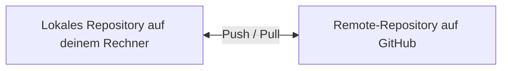
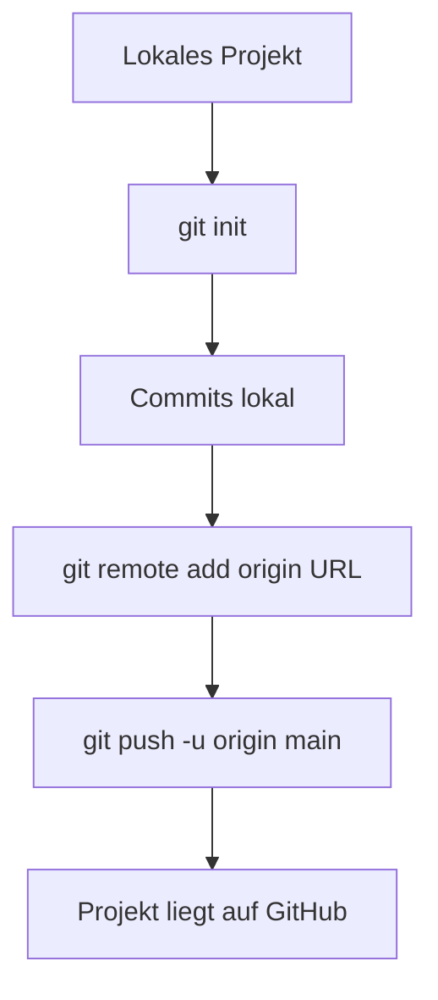
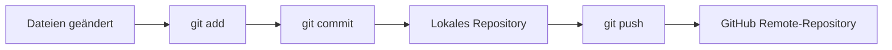
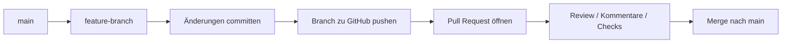

###### Themen

Arbeiten mit Remote-Repositories auf GitHub

- Ein GitHub-Konto anlegen und nutzen
- Ein lokales Repository mit einem Remote-Repository verbinden
- Ein bestehendes Repository klonen

Synchronisation mit GitHub

- Änderungen in ein Remote-Repository übertragen
- Änderungen aus einem Remote-Repository abrufen und integrieren

Zusammenarbeit mit GitHub

- Grundprinzip von Pull Requests verstehen
- Einfache Merge-Konflikte erkennen

Dokumentation auf GitHub

- Grundlegende Navigation in der GitHub-Weboberfläche
- README.md zur einfachen Projektdokumentation nutzen

<br><br><br>
# 🌐 Arbeiten mit entfernten Repositories auf GitHub

Wenn du mit Git und GitHub arbeitest, musst du dir zuerst ein sehr wichtiges Grundbild merken:

Ein **lokales Repository** liegt auf deinem Rechner. Dort bearbeitest du Dateien, machst Commits und experimentierst in Ruhe.  
Ein **Remote-Repository** liegt auf einem Server, zum Beispiel bei GitHub. Dort wird dein Projekt online gespeichert, geteilt und mit anderen synchronisiert. GitHub beschreibt ein Remote-Repository genau als die online gehostete Version deines Projekts, mit der dein lokales Git-Repository verbunden werden kann ([About remote repositories](https://docs.github.com/en/get-started/git-basics/about-remote-repositories)).

Eine einfache Denkweise ist:

- **Lokal** = dein Arbeitsplatz
- **Remote** = gemeinsamer, zentraler Ablageort
- **Git** = das System, das Änderungen sauber verfolgt
- **GitHub** = die Plattform, auf der du diese Git-Repositories online verwaltest

| Begriff | Einfach erklärt | Typischer Ort |
|---|---|---|
| Lokales Repository | Deine Projektkopie mit kompletter Git-Historie | Dein Computer |
| Remote-Repository | Online-Version deines Projekts | GitHub |
| Commit | Ein gespeicherter Entwicklungsschritt | Lokal, später auch Remote |
| Branch | Ein Entwicklungszweig | Lokal und/oder Remote |



Dieses Grundverständnis ist extrem wichtig. Viele Git-Probleme entstehen nicht, weil Git „kompliziert“ wäre, sondern weil man nicht sauber trennt zwischen:

1. dem Arbeitsstand in deinen Dateien,
2. dem Git-Stand im lokalen Repository,
3. dem Stand auf GitHub.


<br><br><br>
## 👤 Ein GitHub-Konto anlegen und nutzen

Damit du GitHub verwenden kannst, brauchst du ein persönliches Konto. GitHub führt die Kontoerstellung direkt über die Registrierungsseite durch; dabei werden Benutzername, E-Mail und Passwort festgelegt ([Creating an account on GitHub](https://docs.github.com/en/get-started/start-your-journey/creating-an-account-on-github)).

### So läuft die Kontoerstellung typischerweise ab

1. Du gehst auf **github.com**.
2. Du klickst auf **Sign up**.
3. Du wählst:
   - einen **Benutzernamen**
   - eine **E-Mail-Adresse**
   - ein **Passwort**
4. Du bestätigst deine E-Mail-Adresse.
5. Danach kannst du Repositories erstellen, anderen Projekten folgen und eigene Projekte veröffentlichen.

### Wofür du dein GitHub-Konto konkret nutzt

Mit deinem Konto kannst du:

- eigene Repositories anlegen
- bestehende Projekte online speichern
- Projekte als **public** oder **private** verwalten
- mit anderen zusammenarbeiten
- Pull Requests erstellen
- Issues verwalten
- Dokumentation über README-Dateien anzeigen

GitHub unterscheidet Repositories grundsätzlich danach, ob sie öffentlich oder privat sind; öffentliche Repositories sind sichtbar für alle, private nur für berechtigte Personen ([About repositories](https://docs.github.com/en/repositories/creating-and-managing-repositories/about-repositories)).

### Wichtiger Praxispunkt: Anmeldung für Git-Befehle

Wenn du über die Kommandozeile mit GitHub arbeitest, reicht dein GitHub-Passwort für Git-Operationen über HTTPS nicht mehr aus. GitHub verlangt dafür sichere Authentifizierungsverfahren wie **Personal Access Tokens**, Browser-Anmeldung oder **SSH-Schlüssel** ([About authentication to GitHub](https://docs.github.com/en/authentication/keeping-your-account-and-data-secure/about-authentication-to-github)).

Das ist wichtig, weil viele Anfänger denken:

> „Ich habe doch ein GitHub-Konto, warum klappt `git push` nicht mit meinem Passwort?“

Die Antwort ist: Für Git-Zugriffe gelten andere Authentifizierungsregeln als für die normale Web-Anmeldung.

### HTTPS oder SSH?

Für die Verbindung zu GitHub gibt es zwei übliche Wege:

| Methode | Für wen gut geeignet? | Besonderheit |
|---|---|---|
| HTTPS | Einfach für den Einstieg | Authentifizierung über Token oder Anmeldedialog |
| SSH | Sehr angenehm auf Dauer | Einmal SSH-Key einrichten, danach oft bequemer |

GitHub dokumentiert beide Varianten und erklärt die SSH-Einrichtung separat ([Connecting to GitHub with SSH](https://docs.github.com/en/authentication/connecting-to-github-with-ssh)).

Wenn du gerade erst anfängst, ist **HTTPS** oft leichter zu verstehen. Wenn du regelmäßig mit GitHub arbeitest, ist **SSH** langfristig oft angenehmer.


<br><br><br>
## 🔗 Ein lokales Repository mit einem Remote-Repository verbinden

Das ist einer der wichtigsten Schritte überhaupt.

Du hast dabei meist diese Situation:

- Du hast schon ein Projekt auf deinem Rechner.
- Dieses Projekt ist vielleicht schon mit Git initialisiert.
- Jetzt willst du dieses lokale Projekt mit einem GitHub-Repository verbinden.

GitHub erklärt das Verwalten solcher Verbindungen über sogenannte **Remotes**; ein Remote ist also die gespeicherte Adresse eines externen Repositories ([Managing remote repositories](https://docs.github.com/en/get-started/git-basics/managing-remote-repositories)).

### Das Grundprinzip

Dein lokales Repository kennt GitHub erst dann, wenn du ihm sagst:

> „Dieses Online-Repository dort ist mein Remote.“

Dafür wird meist der Name **origin** verwendet.  
**origin** ist kein magisches Wort, sondern einfach nur ein verbreiteter Standardname für den Haupt-Remote.

### Typischer Ablauf

Angenommen, du hast lokal schon ein Projektordner:

```bash
git init
git add .
git commit -m "Erster Commit"
```

Dann erstellst du auf GitHub ein neues Repository, zum Beispiel `mein-projekt`.

Danach verbindest du dein lokales Repository mit GitHub:

```bash
git remote add origin https://github.com/DEIN-NAME/mein-projekt.git
```

Mit diesem Befehl speicherst du die URL des Remote-Repositories unter dem Namen `origin`.

Du kannst prüfen, ob die Verbindung gesetzt wurde:

```bash
git remote -v
```

Dann siehst du die hinterlegte URL für `fetch` und `push`.

### Was bedeutet `origin` genau?

`origin` ist der Name des Remote-Ziels.  
Du könntest theoretisch auch schreiben:

```bash
git remote add github https://github.com/DEIN-NAME/mein-projekt.git
```

Das würde technisch funktionieren. In der Praxis benutzt fast jeder aber `origin`, weil das verständlich und standardisiert ist.

### Erster Push zum Remote-Repository

Wenn dein lokales Projekt mit GitHub verbunden ist, musst du deine lokale Historie zum ersten Mal hochladen:

```bash
git branch -M main
git push -u origin main
```

Dabei passiert Folgendes:

- `git branch -M main` benennt deinen aktuellen Hauptbranch in `main` um
- `git push -u origin main` lädt den Branch `main` zu GitHub hoch
- das `-u` setzt eine Verknüpfung, damit Git später weiß, welcher Remote-Branch zu deinem lokalen Branch gehört

GitHub dokumentiert das Pushen lokaler Commits zu einem Remote-Repository genau für solche Fälle ([Pushing commits to a remote repository](https://docs.github.com/en/get-started/using-git/pushing-commits-to-a-remote-repository)).

### Sehr wichtiger Anfängerhinweis

Wenn du auf GitHub beim Erstellen des Repositories schon eine `README.md`, `.gitignore` oder Lizenzdatei erzeugen lässt, dann hat das Remote-Repository bereits einen ersten Commit. Wenn dein lokales Repository ebenfalls schon eigene Commits hat, können lokale und entfernte Historien voneinander abweichen. Dann kann der erste Push nicht einfach direkt funktionieren, weil Git erst klären muss, wie beide Historien zusammengeführt werden sollen. Das ist kein Fehler „von GitHub“, sondern eine Schutzfunktion von Git.

Für Anfänger ist deshalb oft die sauberste Methode:

- **entweder**: erst lokal anfangen und auf GitHub ein **leeres** Repository anlegen
- **oder**: erst auf GitHub anlegen und danach **klonen**

### Nützliches Bild dazu




<br><br><br>
## 📥 Ein bestehendes Repository klonen

**Klonen** bedeutet: Du holst ein bestehendes Repository von GitHub komplett auf deinen Rechner. Dabei bekommst du nicht nur die aktuellen Dateien, sondern auch die Git-Historie. GitHub beschreibt `git clone` genau als das Erstellen einer lokalen Kopie eines bestehenden Repositories ([Cloning a repository](https://docs.github.com/en/repositories/creating-and-managing-repositories/cloning-a-repository)).

### Wann du klonen benutzt

Klonen ist der richtige Weg, wenn:

- das Repository schon auf GitHub existiert
- du an einem fremden oder bereits bestehenden Projekt arbeiten willst
- du die komplette Historie lokal brauchst
- du nicht erst manuell ein leeres Verzeichnis anlegen willst

### So funktioniert es

Auf GitHub gehst du in ein Repository und klickst auf den grünen **Code**-Button. Dort bekommst du die URL, zum Beispiel:

```bash
git clone https://github.com/DEIN-NAME/mein-projekt.git
```

Danach erstellt Git einen neuen Ordner mit dem Projektnamen, lädt die Dateien und richtet automatisch die Remote-Verbindung `origin` ein.

Das ist wichtig:  
Beim Klonen musst du `git remote add origin ...` normalerweise **nicht** selbst ausführen, weil Git das bereits für dich erledigt.

### Was nach dem Klonen automatisch da ist

Nach einem erfolgreichen Klon hast du:

- einen lokalen Projektordner
- die vollständige Commit-Historie
- den Standard-Remote `origin`
- die Information, welcher Branch standardmäßig ausgecheckt wird

Du kannst das prüfen mit:

```bash
git remote -v
```

### HTTPS-Klonen oder SSH-Klonen

Beispiele:

```bash
git clone https://github.com/DEIN-NAME/mein-projekt.git
```

oder

```bash
git clone git@github.com:DEIN-NAME/mein-projekt.git
```

Der Unterschied ist vor allem die Art der Authentifizierung. Für SSH brauchst du passende Schlüssel, die GitHub akzeptiert ([Connecting to GitHub with SSH](https://docs.github.com/en/authentication/connecting-to-github-with-ssh)).

### Das mentale Modell beim Klonen

Klonen ist im Grunde:

> „Mach mir eine vollständige lokale Arbeitskopie dieses Online-Projekts.“

Nicht verwechseln mit „Dateien herunterladen“.  
Wenn du nur ein ZIP herunterlädst, bekommst du zwar die Dateien, aber **nicht** die Git-Historie und auch keine echte Git-Verbindung zum Repository.


<br><br><br>
# 🔄 Synchronisation mit GitHub

Synchronisation bedeutet, dass dein lokaler Stand und der Stand auf GitHub aufeinander abgestimmt werden.

Es gibt dabei zwei Richtungen:

- **lokal → GitHub**: du sendest deine Änderungen hoch
- **GitHub → lokal**: du holst Änderungen herunter

Viele Lernende denken bei Git nur an „Dateien hochladen“. Das ist aber zu kurz gedacht. In Git synchronisierst du vor allem **Commits** und **Branch-Stände**, nicht einfach lose Dateien.


<br><br><br>
## ⬆️ Änderungen in ein Remote-Repository übertragen

Damit Änderungen auf GitHub landen, brauchst du normalerweise diese Reihenfolge:

1. Dateien ändern
2. Änderungen stagen
3. Commit erstellen
4. Commit pushen

### Der Standardablauf

```bash
git status
git add .
git commit -m "Beschreibung der Änderung"
git push
```

### Was passiert in jedem Schritt?

#### `git status`

Zeigt dir, was sich geändert hat. Das ist einer der wichtigsten Befehle überhaupt, weil du damit siehst:

- welche Dateien verändert wurden
- welche Dateien bereits gestaged sind
- auf welchem Branch du bist
- ob dein Branch vor oder hinter dem Remote-Branch liegt

#### `git add .`

Damit legst du fest, welche Änderungen in den nächsten Commit aufgenommen werden.

#### `git commit -m "..."`

Damit speicherst du einen Entwicklungsschritt im lokalen Repository.

Ganz wichtig:  
Ein Commit liegt zunächst **nur lokal**. Er ist noch nicht auf GitHub.

#### `git push`

Erst jetzt sendest du deine lokalen Commits an das Remote-Repository. GitHub erklärt `push` genau als das Übertragen lokaler Commits in ein Remote-Repository ([Pushing commits to a remote repository](https://docs.github.com/en/get-started/using-git/pushing-commits-to-a-remote-repository)).

### Ein sehr häufiger Denkfehler

Viele Anfänger glauben:

> `git add` oder `git commit` lädt schon etwas zu GitHub hoch.

Das stimmt nicht.

- `git add` bereitet Änderungen vor
- `git commit` speichert sie lokal
- `git push` überträgt sie zum Remote

Diese Trennung ist zentral.



### Wenn `git push` nicht funktioniert

Häufige Ursachen sind:

- du bist nicht korrekt authentifiziert
- dein Remote-Branch hat neuere Änderungen
- du pushst auf einen geschützten Branch
- du hast noch keinen Upstream gesetzt

Dann bekommst du oft Hinweise wie:

- `rejected`
- `non-fast-forward`
- `authentication failed`

Gerade `non-fast-forward` bedeutet meist:  
Auf GitHub gibt es bereits Änderungen, die du lokal noch nicht hast. Dann musst du zuerst den Remote-Stand holen und integrieren.

### Push auf einen bestimmten Branch

Wenn du nicht auf `main`, sondern auf einem Feature-Branch arbeitest, sieht das zum Beispiel so aus:

```bash
git push -u origin feature-login
```

Das ist im Teamalltag sehr üblich, weil Änderungen oft über separate Branches und Pull Requests laufen.


<br><br><br>
## ⬇️ Änderungen aus einem Remote-Repository abrufen und integrieren

Hier musst du zwei Git-Befehle sauber unterscheiden:

- `git fetch`
- `git pull`

Diese Unterscheidung ist enorm wichtig, weil sie dir viel Kontrolle gibt.

### `git fetch`: Abrufen ohne Einbauen

Mit `git fetch` holst du neue Informationen und Commits vom Remote-Repository, aber Git integriert sie noch nicht automatisch in deinen aktuellen Arbeitsbranch. Das ist die saubere, vorsichtige Variante, und genau so beschreibt Git es auch in der offiziellen Git-Dokumentation ([git-fetch Documentation](https://git-scm.com/docs/git-fetch)).

Beispiel:

```bash
git fetch origin
```

Danach weiß dein lokales Repository, was auf GitHub passiert ist, aber deine aktuellen Dateien wurden noch nicht verändert.

Das ist praktisch, wenn du erst schauen willst:

- Was wurde geändert?
- Ist mein Branch hinter dem Remote?
- Will ich mergen oder erst prüfen?

### `git pull`: Abrufen und direkt integrieren

`git pull` ist im Normalfall eine Kombination aus `fetch` und anschließendem `merge` oder je nach Konfiguration `rebase`. Die Git-Dokumentation beschreibt `git pull` genau so: Es ruft Änderungen ab und integriert sie in den aktuellen Branch ([git-pull Documentation](https://git-scm.com/docs/git-pull)).

Beispiel:

```bash
git pull origin main
```

Das bedeutet:

> „Hol den aktuellen Stand von `main` vom Remote `origin` und integriere ihn in meinen aktuellen Branch.“

### Der praktische Unterschied

| Befehl | Was passiert? | Wann sinnvoll? |
|---|---|---|
| `git fetch` | Holt Änderungen, integriert sie aber nicht automatisch | Wenn du erst prüfen willst |
| `git pull` | Holt Änderungen und baut sie direkt ein | Wenn du direkt synchronisieren willst |

### Warum Anfänger `fetch` oft zu selten nutzen

`git pull` ist bequem, aber manchmal zu „automatisch“.  
Wenn du verstehen willst, was passiert, ist `git fetch` pädagogisch oft besser. Du lernst dadurch:

- Was ist schon lokal?
- Was ist nur auf GitHub?
- Wann entsteht ein Merge?
- Warum kann ein Konflikt auftreten?

Gerade für Core-Tech-Fundamentals ist dieses Verständnis sehr wertvoll.

### Typischer sicherer Ablauf

Wenn du sauber arbeiten willst, ist oft dieser Ablauf sinnvoll:

```bash
git fetch origin
git status
git pull origin main
```

Oder noch kontrollierter:

```bash
git fetch origin
git log --oneline --graph --all
```

Dann kannst du die Historie prüfen, bevor du integrierst.

### Was „integrieren“ genau bedeutet

Integrieren heißt:  
Die Änderungen aus dem Remote-Repository werden in deinen lokalen Entwicklungsstand übernommen. Das kann einfach und problemlos sein, oder es kann zu Konflikten kommen, wenn dieselben Stellen unterschiedlich verändert wurden.

Genau hier beginnt der nächste wichtige Bereich: Zusammenarbeit.


<br><br><br>
# 🤝 Zusammenarbeit mit GitHub

GitHub ist nicht nur ein Speicherort für Code. Die Plattform ist vor allem für Zusammenarbeit gebaut. Besonders wichtig dafür sind:

- Branches
- Pull Requests
- Reviews
- Merge-Vorgänge
- Konflikterkennung

Wenn du diesen Teil verstehst, verstehst du den eigentlichen Mehrwert von GitHub.


<br><br><br>
## 🔀 Grundprinzip von Pull Requests verstehen

Ein **Pull Request** ist auf GitHub der übliche Weg, um Änderungen aus einem Branch in einen anderen Branch vorzuschlagen. GitHub beschreibt Pull Requests genau als Vorschläge für Änderungen, die geprüft, diskutiert und anschließend zusammengeführt werden können ([About pull requests](https://docs.github.com/en/pull-requests/collaborating-with-pull-requests/proposing-changes-with-pull-requests/about-pull-requests)).

### Warum Pull Requests wichtig sind

Stell dir vor, mehrere Menschen arbeiten an demselben Projekt.  
Wenn jeder direkt auf `main` pushen würde, gäbe es schnell Chaos.

Deshalb nutzt man oft dieses Prinzip:

1. Der stabile Hauptstand liegt auf `main`.
2. Für eine neue Änderung wird ein eigener Branch erstellt.
3. In diesem Branch wird entwickelt.
4. Der Branch wird zu GitHub gepusht.
5. Dann wird ein Pull Request geöffnet.
6. Andere können die Änderungen ansehen und kommentieren.
7. Erst danach wird gemergt.

### Das Grundbild

Ein Pull Request ist **kein** Befehl in Git selbst, sondern ein GitHub-Workflow über Branch-Vergleiche.

Typischer Ablauf:



### Was du in einem Pull Request siehst

GitHub zeigt in einem Pull Request normalerweise:

- welche Dateien geändert wurden
- welche Zeilen hinzugefügt oder entfernt wurden
- wer was kommentiert hat
- ob automatische Checks erfolgreich waren
- ob Konflikte vorliegen
- ob der Branch mergebar ist

### Wichtige Begriffe

| Begriff | Bedeutung |
|---|---|
| Base branch | Der Zielbranch, meist `main` |
| Compare branch | Der Branch mit deinen Änderungen |
| Review | Prüfung der Änderung durch andere |
| Merge | Zusammenführen der Branches |

### Warum Pull Requests fachlich so wichtig sind

Ein Pull Request trennt **Code schreiben** von **Code freigeben**.

Das ist didaktisch und technisch sehr sinnvoll, weil dadurch:

- Änderungen überprüfbar werden
- Diskussionen an konkreten Codezeilen stattfinden
- Fehler früher auffallen
- der Hauptbranch stabiler bleibt

Selbst wenn du alleine arbeitest, sind Pull Requests nützlich. Sie zwingen dich dazu, deine Änderung als abgeschlossene, überprüfbare Einheit zu betrachten.

### Typischer Minimalablauf in der Praxis

Du arbeitest lokal auf einem neuen Branch:

```bash
git checkout -b feature-readme
```

Dann bearbeitest du Dateien und pushst:

```bash
git add .
git commit -m "README verbessert"
git push -u origin feature-readme
```

Danach gehst du auf GitHub und öffnest einen Pull Request von `feature-readme` nach `main`.

Das ist ein sehr typischer Workflow.


<br><br><br>
## ⚠️ Einfache Merge-Konflikte erkennen

Ein **Merge-Konflikt** entsteht, wenn Git Änderungen nicht automatisch zusammenführen kann. GitHub erklärt, dass Konflikte typischerweise dann auftreten, wenn dieselben Zeilen in konkurrierenden Branches unterschiedlich bearbeitet wurden oder wenn eine Datei in einem Branch gelöscht und in einem anderen geändert wurde ([About merge conflicts](https://docs.github.com/en/pull-requests/collaborating-with-pull-requests/addressing-merge-conflicts/about-merge-conflicts)).

### Das einfache Grundprinzip

Git ist sehr gut darin, Änderungen automatisch zu kombinieren, **solange sie sich nicht logisch in die Quere kommen**.

Beispiel ohne Konflikt:

- Person A ändert `README.md`
- Person B ändert `app.js`

Das kann Git meist problemlos zusammenführen.

Beispiel mit Konflikt:

- Person A ändert in `README.md` Zeile 5
- Person B ändert dieselbe Zeile 5 anders

Dann weiß Git nicht, welche Version richtig ist.

### So sieht ein Konflikt aus

Wenn Git einen Konflikt in einer Datei markiert, erscheinen oft solche Marker:

```txt
<<<<<<< HEAD
Hallo Welt
=======
Hallo GitHub
>>>>>>> feature-begruessung
```

Das bedeutet:

- der obere Teil ist eine Version
- der untere Teil ist die andere Version
- Git fordert dich auf, selbst zu entscheiden

### Wie du einen einfachen Konflikt gedanklich liest

`<<<<<<< HEAD`  
Hier beginnt die Version deines aktuellen Branches.

`=======`  
Hier trennt Git beide Versionen.

`>>>>>>> feature-begruessung`  
Hier endet die Version aus dem anderen Branch.

### Was du dann tun musst

Du bearbeitest die Datei manuell so, wie sie am Ende aussehen soll.  
Zum Beispiel:

```txt
Hallo Welt auf GitHub
```

Dann entfernst du die Konfliktmarker komplett und speicherst die Datei.

Danach markierst du die Lösung und schließt den Merge ab:

```bash
git add README.md
git commit
```

### Woran du Konflikte früh erkennst

Konflikte treten besonders oft auf, wenn:

- viele Personen an denselben Dateien arbeiten
- lange Branches nicht regelmäßig aktualisiert werden
- große Änderungen zu spät gemergt werden
- zentrale Dateien wie `README.md`, Konfigurationsdateien oder Hauptkomponenten oft parallel bearbeitet werden

### Gute Lernregel

Je länger ein Branch vom Hauptbranch getrennt bleibt, desto größer wird das Konfliktrisiko.

Deshalb ist es oft sinnvoll:

- kleinere Änderungen zu machen
- häufiger zu synchronisieren
- Pull Requests nicht ewig offen zu lassen

### Konflikte auf GitHub oder lokal?

Konflikte können sowohl:

- **lokal beim Merge oder Pull**
- als auch **auf GitHub beim Pull Request**

sichtbar werden.

GitHub zeigt bei Pull Requests oft direkt an, ob ein Branch konfliktfrei gemergt werden kann. Das ist sehr hilfreich, ersetzt aber nicht das Verständnis dafür, was lokal wirklich passiert.


<br><br><br>
# 📝 Dokumentation auf GitHub

Ein gutes Repository besteht nicht nur aus funktionierendem Code. Es braucht auch verständliche Dokumentation. Auf GitHub ist die wichtigste Einstiegsdokumentation fast immer die `README.md`.

Dokumentation ist nicht „Extra-Arbeit“, sondern Teil guter Softwareentwicklung. Sie hilft dir selbst genauso wie anderen.


<br><br><br>
## 🧭 Grundlegende Navigation in der GitHub-Weboberfläche

Wenn du ein Repository auf GitHub öffnest, siehst du die Weboberfläche des Projekts. GitHub beschreibt Repositories als zentrale Orte, an denen du Code, Dateien, Versionen und Zusammenarbeit verwaltest ([About repositories](https://docs.github.com/en/repositories/creating-and-managing-repositories/about-repositories)).

### Die wichtigsten Bereiche auf einen Blick

Auf einer typischen Repository-Seite findest du oben oder im oberen Bereich mehrere Reiter.

| Bereich | Wofür er da ist |
|---|---|
| **Code** | Dateien, Ordner, Branch-Auswahl, Klonen, Commits |
| **Issues** | Aufgaben, Fehlerberichte, Diskussionen |
| **Pull requests** | Änderungsvorschläge und Reviews |
| **Actions** | Automatisierungen und CI/CD-Workflows |
| **Projects** | Projektorganisation |
| **Wiki** | Zusätzliche Dokumentation |
| **Security** | Sicherheitsbezogene Hinweise |
| **Insights** | Statistiken und Aktivitätsdaten |

Je nach Repository sind nicht immer alle Reiter aktiv, aber `Code`, `Issues` und `Pull requests` sind besonders zentral.

### Was du im Reiter „Code“ findest

Der Reiter **Code** ist die Standardansicht. Dort siehst du:

- die aktuelle Branch-Auswahl
- die Dateiliste
- den grünen **Code**-Button zum Klonen
- oft die `README.md`
- Informationen zu letzten Commits

Das ist praktisch der zentrale Einstiegspunkt ins Repository.

### Wichtige Bedienelemente

#### Branch-Auswahl

Oben kannst du zwischen Branches wechseln. Das ist wichtig, weil ein Repository mehrere Entwicklungsstände gleichzeitig enthalten kann.

#### Code-Button

Über den grünen **Code**-Button kannst du:

- die HTTPS-URL kopieren
- die SSH-URL kopieren
- das Repository lokal klonen
- teils auch direkt in Tools öffnen

#### Commit-Historie

Wenn du auf die Anzahl der Commits klickst oder eine Datei öffnest und deren Historie ansiehst, erkennst du:

- wer wann etwas geändert hat
- welche Nachricht der Commit hatte
- wie sich die Datei entwickelt hat

### Navigation im Pull-Request-Bereich

Im Reiter **Pull requests** kannst du:

- offene Pull Requests sehen
- geschlossene Pull Requests einsehen
- eigene Änderungsvorschläge öffnen
- Diskussionen und Code-Reviews verfolgen

Das ist der Ort, an dem Zusammenarbeit besonders sichtbar wird.

### Navigation im Issues-Bereich

Unter **Issues** werden häufig Aufgaben, Bugs und Verbesserungsvorschläge verwaltet.  
Ein Anfängerfehler ist, Issues mit Pull Requests zu verwechseln:

- **Issue** = Problem, Aufgabe oder Idee
- **Pull Request** = konkrete Codeänderung als Vorschlag

### Warum diese Navigation lerntechnisch wichtig ist

Wenn du GitHub nur als „Ort zum Hochladen“ siehst, nutzt du vielleicht 20 % der Plattform.  
Wenn du lernst, dich in Code, Branches, Pull Requests, Issues und Dokumentation zu orientieren, verstehst du GitHub als vollständige Arbeitsumgebung.

Das ist ein entscheidender Schritt vom bloßen Anwender hin zu einem wirklich sicheren Entwickler-Workflow.


<br><br><br>
## 📘 README.md zur einfachen Projektdokumentation nutzen

Die Datei `README.md` ist die Standard-Einstiegsdokumentation eines Repositories. GitHub zeigt README-Dateien an prominenter Stelle auf der Startseite eines Repositories an, wenn sie an den erwarteten Orten liegen, zum Beispiel im Wurzelverzeichnis ([About READMEs](https://docs.github.com/en/repositories/managing-your-repositorys-settings-and-features/customizing-your-repository/about-readmes)).

### Was ist `README.md`?

- `README` bedeutet sinngemäß: „Lies mich zuerst“
- `.md` steht für **Markdown**
- Markdown ist eine einfache Auszeichnungssprache für strukturierte Textformatierung auf GitHub ([Basic writing and formatting syntax](https://docs.github.com/en/get-started/writing-on-github/getting-started-with-writing-and-formatting-on-github/basic-writing-and-formatting-syntax))

### Warum die README so wichtig ist

Wenn jemand dein Repository öffnet, ist die README oft das Erste, was gelesen wird.  
Sie beantwortet grundlegende Fragen wie:

- Was ist das für ein Projekt?
- Wofür ist es gedacht?
- Wie startet man es?
- Welche Technologien werden verwendet?
- Wie nutzt man es?

Ohne README ist ein Projekt oft unnötig schwer verständlich, selbst wenn der Code gut ist.

### Was in eine einfache README hineingehört

Eine gute einfache README enthält oft:

| Abschnitt | Inhalt |
|---|---|
| Projektname | Wie das Projekt heißt |
| Beschreibung | Was das Projekt macht |
| Ziel oder Zweck | Warum es existiert |
| Installation | Wie man es lokal startet |
| Nutzung | Wie man es verwendet |
| Struktur | Wichtige Ordner oder Dateien |
| Status | z. B. in Entwicklung |
| Kontakt oder Mitwirkung | Falls andere beitragen sollen |

### Einfaches Beispiel einer README

```md
# Mein Projekt

Ein kleines Beispielprojekt zum Lernen von Git und GitHub.

## Ziel
Dieses Projekt zeigt, wie man ein lokales Repository mit GitHub verbindet.

## Installation
```bash
git clone https://github.com/dein-name/mein-projekt.git
cd mein-projekt
```

## Nutzung
Öffne das Projekt im Editor und starte die Anwendung wie in der Dokumentation beschrieben.

## Technologien
- Git
- GitHub
- Markdown

### Wichtige Markdown-Bausteine

Markdown ist bewusst einfach gehalten. Ein paar Bausteine reichen schon weit:

| Markdown | Wirkung |
|---|---|
| `# Überschrift` | Große Überschrift |
| `## Unterüberschrift` | Kleinere Überschrift |
| `- Punkt` | Aufzählung |
| `` `code` `` | Inline-Code |
| ``` ``` | Codeblock |
| `[Text](URL)` | Link |

GitHub unterstützt diese grundlegenden Formatierungen direkt in README-Dateien ([Basic writing and formatting syntax](https://docs.github.com/en/get-started/writing-on-github/getting-started-with-writing-and-formatting-on-github/basic-writing-and-formatting-syntax)).

### Was eine README gut macht

Eine gute README ist nicht möglichst lang, sondern möglichst nützlich.  
Sie hilft Leserinnen und Lesern dabei, schnell zu verstehen:

- **Was ist das?**
- **Wie bekomme ich es zum Laufen?**
- **Was ist der aktuelle Stand?**

### Praktischer Anfängerhinweis

Viele schreiben in die README nur einen Titel und vielleicht einen Satz. Das ist besser als nichts, aber oft zu wenig.  
Gerade bei Lernprojekten lohnt sich eine README besonders, weil du dadurch selbst gezwungen wirst, dein Projekt klar zu formulieren.

Das hat einen starken Lerneffekt:  
Sobald du etwas verständlich dokumentieren kannst, hast du es meist deutlich besser verstanden.

### README direkt auf GitHub bearbeiten

Du kannst eine `README.md` nicht nur lokal bearbeiten, sondern auch direkt über die GitHub-Weboberfläche. Das ist praktisch für kleine Textänderungen. Für größere Änderungen ist die lokale Bearbeitung meist angenehmer, weil du dort Editor, Vorschau und Git-Befehle besser im Griff hast.

### Gute Reihenfolge beim Dokumentieren

Für kleine bis mittlere Projekte ist oft diese Reihenfolge sinnvoll:

1. Projektname und Kurzbeschreibung
2. Zweck des Projekts
3. Start- oder Installationshinweise
4. Wichtige Nutzungsschritte
5. Eventuell Projektstruktur oder Besonderheiten

So wird dein Repository auf GitHub nicht nur technisch korrekt, sondern auch für andere wirklich lesbar und benutzbar.