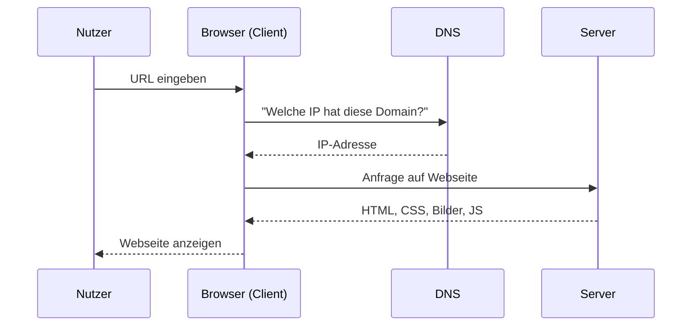
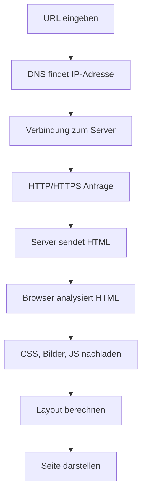

###### Themen

Das Web verstehen

- Grundlegende Funktionsweise des Internets: Client, Server und Übertragungswege
- HTTP und HTTPS in einfacher Form verstehen
- Aufbau und Anzeige einer Webseite im Browser nachvollziehen

Grundaufbau von HTML

- Aufbau eines minimalen HTML-Dokuments mit doctype, html, head und body
- Bedeutung von title und meta grundlegend verstehen

Textstruktur in HTML

- Überschriften, Absätze und Textauszeichnungen mit h1 bis h6, p, strong und em verwenden
- Zeilenumbrüche und horizontale Linien einfach einsetzen

<br><br><br>
# 🌐 Das Web verstehen

Wenn man „das Web“ verstehen will, hilft ein ganz einfaches Bild: Du sitzt an deinem Gerät, gibst eine Adresse ein, dein Browser fragt irgendwo im Internet nach einer Ressource, und ein anderer Computer schickt sie zurück. Aus dieser scheinbar kleinen Aktion entstehen dann HTML, Bilder, CSS, JavaScript und am Ende die sichtbare Webseite.

Wichtig ist dabei: **Das Internet** und **das Web** sind nicht dasselbe. Das Internet ist die technische Grundlage, also ein weltweites Netzwerk aus vielen verbundenen Netzwerken. Das **World Wide Web** ist nur **ein Dienst**, der auf dem Internet läuft und Webseiten per HTTP oder HTTPS zugänglich macht ([How does the Internet work?](https://developer.mozilla.org/en-US/docs/Learn/Common_questions/Web_mechanics/How_does_the_Internet_work)).


<br><br><br>
## 🧭 Grundlegende Funktionsweise des Internets: Client, Server und Übertragungswege

Im Kern funktioniert das Internet nach einem einfachen Prinzip: **Ein Client fragt etwas an, ein Server antwortet darauf**. Dazwischen gibt es Übertragungswege und Geräte, die die Daten weiterleiten.

Stell dir das wie ein Paketversand vor:

- Du gibst eine Bestellung auf.
- Die Bestellung wird an ein Lager geschickt.
- Das Lager schickt dir das Paket zurück.
- Auf dem Weg dazwischen gibt es Straßen, Verteilerzentren und Transportregeln.

Im Web ist es ähnlich, nur dass statt Kartons **Datenpakete** verschickt werden.


<br><br><br>
### 💻 Was ist ein Client?

Ein **Client** ist das Gerät oder Programm, das eine Anfrage stellt. In der Praxis ist das oft dein **Webbrowser** wie Chrome, Firefox, Safari oder Edge.

Wenn du `https://example.com` eingibst, ist dein Browser der Client. Er fordert vom Server die Webseite an. Ein Client muss nicht immer ein Browser sein. Auch eine App auf dem Smartphone oder ein Programm auf deinem Rechner kann ein Client sein, solange es Daten von einem Server anfordert ([How does the Internet work?](https://developer.mozilla.org/en-US/docs/Learn/Common_questions/Web_mechanics/How_does_the_Internet_work)).

Einfach gesagt:  
**Client = fragt an**


<br><br><br>
### 🗄️ Was ist ein Server?

Ein **Server** ist ein Computer oder ein Dienst, der auf Anfragen wartet und darauf antwortet. Wenn jemand eine Webseite öffnet, liefert der Server zum Beispiel HTML-Dateien, Bilder, CSS-Dateien oder Daten aus einer Datenbank zurück ([What is a web server?](https://developer.mozilla.org/en-US/docs/Learn/Common_questions/Web_mechanics/What_is_a_web_server)).

Wichtig: Ein Server ist nicht automatisch „ein riesiger Supercomputer“. Ein Server ist vor allem eine **Rolle** im Netzwerk. Er stellt etwas bereit.

Einfach gesagt:  
**Server = liefert zurück**


<br><br><br>
### 📦 Wie kommen die Daten von A nach B?

Daten reisen im Internet normalerweise nicht als „ein großer Block“, sondern werden in **kleinere Pakete** aufgeteilt. Diese Pakete werden über verschiedene Netzwerke transportiert und am Ziel wieder zusammengesetzt. Das ist ein Grundprinzip des Internets ([How does the Internet work?](https://developer.mozilla.org/en-US/docs/Learn/Common_questions/Web_mechanics/How_does_the_Internet_work)).

Zwischen Client und Server liegen oft mehrere Stationen:

- dein WLAN oder Mobilfunknetz
- dein Router
- dein Internetanbieter
- weitere Netzknoten im Internet
- der Zielserver

Die Geräte, die entscheiden, wohin ein Datenpaket als Nächstes geschickt wird, nennt man **Router**. Sie wählen Wege durch das Netzwerk, damit die Daten ihr Ziel erreichen ([How does the Internet work?](https://developer.mozilla.org/en-US/docs/Learn/Common_questions/Web_mechanics/How_does_the_Internet_work)).

Die **Übertragungswege** können ganz unterschiedlich sein:

- Kupferkabel
- Glasfaserkabel
- WLAN
- Mobilfunk
- Unterseekabel zwischen Kontinenten

Das heißt: Wenn du eine Webseite öffnest, laufen deine Daten nicht „magisch“ direkt von deinem Laptop zum Server, sondern über viele Zwischenschritte.


<br><br><br>
### 🧭 Warum braucht man überhaupt eine Adresse?

Computer im Netzwerk sprechen am Ende über **IP-Adressen** miteinander. Menschen merken sich aber lieber Namen wie `wikipedia.org` statt Zahlenfolgen. Deshalb gibt es das **Domain Name System (DNS)**. DNS übersetzt einen Domainnamen in eine IP-Adresse, damit dein Browser weiß, zu welchem Server er verbinden muss ([How does the Internet work?](https://developer.mozilla.org/en-US/docs/Learn/Common_questions/Web_mechanics/How_does_the_Internet_work)).

Das bedeutet:

- Du merkst dir `example.com`
- DNS findet die passende IP-Adresse
- Der Browser kann dann mit dem richtigen Server sprechen

Ohne DNS wäre das Web für Menschen sehr unpraktisch.


<br><br><br>
### 📋 Die Rollen im Überblick

| Begriff | Bedeutung | Einfaches Bild |
|---|---|---|
| Client | Fordert Daten an | Du bestellst etwas |
| Server | Liefert Daten zurück | Das Lager verschickt etwas |
| Router | Leitet Daten weiter | Verteilerzentrum |
| DNS | Übersetzt Domain in IP | Telefonbuch / Adresssuche |
| Übertragungsweg | Transportiert Daten | Straße, Schiene, Luftweg |


<br><br><br>
### 🔄 So läuft eine typische Anfrage ab



Dieses Bild ist absichtlich vereinfacht, aber für den Anfang sehr hilfreich. Wenn du das verstanden hast, hast du schon ein starkes Grundmodell im Kopf.


<br><br><br>
## 🔐 HTTP und HTTPS in einfacher Form verstehen

Sobald Client und Server miteinander sprechen, brauchen sie **Regeln**, damit beide wissen, wie Anfragen und Antworten aussehen müssen. Eine dieser wichtigsten Regeln im Web ist **HTTP**.

HTTP steht für **HyperText Transfer Protocol** und ist ein Protokoll für die Übertragung von Ressourcen im Web ([An overview of HTTP](https://developer.mozilla.org/en-US/docs/Web/HTTP/Overview)).

Einfach gesagt:  
**HTTP regelt, wie Browser und Server im Web miteinander reden.**


<br><br><br>
### 📬 Was passiert bei HTTP?

Wenn du eine Webseite öffnest, sendet der Browser eine **HTTP-Anfrage** an den Server. Der Server schickt eine **HTTP-Antwort** zurück. Dieses Prinzip nennt man **Request-Response-Modell** ([An overview of HTTP](https://developer.mozilla.org/en-US/docs/Web/HTTP/Overview)).

Eine Anfrage enthält zum Beispiel:

- welche Ressource gewünscht wird
- welche Methode verwendet wird, etwa `GET`
- zusätzliche Informationen in sogenannten Headern

Eine Antwort enthält zum Beispiel:

- einen Statuscode wie `200 OK` oder `404 Not Found`
- Header mit Zusatzinformationen
- oft einen Inhalt, zum Beispiel HTML

Wenn du eine Startseite lädst, kann das so aussehen:

1. Browser fordert `/` an  
2. Server antwortet mit HTML  
3. Browser entdeckt im HTML weitere Dateien  
4. Browser fordert CSS, Bilder und JavaScript nach  
5. Server liefert auch diese Dateien zurück

Das ist ein wichtiger Denkpunkt: **Eine Webseite besteht oft aus mehreren einzelnen Anfragen**, nicht nur aus einer einzigen.


<br><br><br>
### 📌 Typische HTTP-Begriffe, die du kennen solltest

| Begriff | Einfache Bedeutung |
|---|---|
| Request | Anfrage vom Client |
| Response | Antwort vom Server |
| GET | „Gib mir diese Ressource“ |
| Statuscode | Ergebnis der Anfrage |
| Header | Zusatzinformationen |
| Body | Der eigentliche Inhalt der Nachricht |

Ein paar typische Statuscodes:

- **200 OK** → alles hat geklappt
- **404 Not Found** → die Ressource wurde nicht gefunden
- **500 Internal Server Error** → auf dem Server ist ein Fehler passiert

Diese Codes sind standardisierte Bestandteile von HTTP ([HTTP response status codes](https://developer.mozilla.org/en-US/docs/Web/HTTP/Status)).


<br><br><br>
### 🔒 Was ist der Unterschied zwischen HTTP und HTTPS?

**HTTPS** ist im Grunde **HTTP mit Sicherheitsschutz**. Genauer gesagt: HTTPS ist HTTP über eine verschlüsselte Verbindung, die normalerweise durch **TLS** abgesichert wird ([HTTPS](https://developer.mozilla.org/en-US/docs/Glossary/HTTPS)).

Das bedeutet drei sehr wichtige Dinge:

- **Verschlüsselung:** Andere sollen die übertragenen Daten nicht einfach mitlesen können.
- **Integrität:** Daten sollen unterwegs nicht unbemerkt verändert werden.
- **Authentizität:** Der Browser kann prüfen, ob er wirklich mit der beabsichtigten Webseite spricht und nicht mit einer gefälschten Seite ([HTTPS](https://developer.mozilla.org/en-US/docs/Glossary/HTTPS)).

Darum ist HTTPS heute praktisch Standard, besonders bei Logins, Formularen, Online-Shops und eigentlich allgemein im modernen Web.


<br><br><br>
### 🧠 Einfaches Bild für HTTP vs. HTTPS

Stell dir vor, du schickst einen Brief:

- **HTTP** ist wie eine Postkarte. Der Inhalt ist leicht lesbar.
- **HTTPS** ist wie ein verschlossener Umschlag mit Siegel.

Das Bild ist vereinfacht, aber es hilft sehr gut beim Einstieg.

Wichtig dabei: HTTPS bedeutet nicht automatisch, dass eine Webseite „gut“ oder „seriös“ ist. Es bedeutet in erster Linie, dass die Verbindung technisch abgesichert ist ([HTTPS](https://developer.mozilla.org/en-US/docs/Glossary/HTTPS)).


<br><br><br>
### 📊 HTTP und HTTPS im Vergleich

| Merkmal | HTTP | HTTPS |
|---|---|---|
| Verschlüsselung | Nein | Ja |
| Standard-Port | 80 | 443 |
| Schutz vor Mitlesen | Gering | Hoch |
| Schutz vor Manipulation | Gering | Deutlich besser |
| Zertifikat nötig | Nein | Ja, typischerweise TLS-Zertifikat |

Die Portnummern gehören zu den üblichen Standardkonventionen im Netzwerkverkehr. Für das Grundverständnis reicht es, wenn du weißt: **HTTP ist unverschlüsselt, HTTPS ist geschützt**.


<br><br><br>
## 🖥️ Aufbau und Anzeige einer Webseite im Browser nachvollziehen

Viele Anfänger denken: „Ich tippe eine Adresse ein, und dann ist die Seite einfach da.“ Tatsächlich macht der Browser dabei ziemlich viel Arbeit.

Der Ablauf sieht vereinfacht so aus:

1. Du gibst eine URL ein.  
2. Der Browser findet per DNS die passende IP-Adresse.  
3. Der Browser baut eine Verbindung zum Server auf.  
4. Bei HTTPS wird zusätzlich eine sichere Verbindung eingerichtet.  
5. Der Browser schickt eine HTTP-Anfrage.  
6. Der Server schickt HTML zurück.  
7. Der Browser liest das HTML und lädt weitere Dateien nach.  
8. Der Browser berechnet das Layout und zeichnet die Seite auf den Bildschirm.

Dieses Grundprinzip ist fachlich korrekt, auch wenn im echten Browser noch viele Zwischenschritte passieren.


<br><br><br>
### 🔍 Schritt 1: Die URL verstehen

Eine URL ist die Adresse einer Ressource im Web. Sie enthält oft:

- das Protokoll, zum Beispiel `https`
- den Domainnamen, zum Beispiel `example.com`
- eventuell einen Pfad, zum Beispiel `/about`

Beispiel:

```text
https://example.com/about
```

Hier bedeutet:

- `https` → verwende HTTPS
- `example.com` → auf welchem Server bzw. welcher Domain
- `/about` → welche konkrete Ressource

Solche Adressen sind zentral für das Web ([What is a URL?](https://developer.mozilla.org/en-US/docs/Learn/Common_questions/Web_mechanics/What_is_a_URL)).


<br><br><br>
### 🌍 Schritt 2: DNS sucht die IP-Adresse

Bevor der Browser einen Server erreichen kann, muss er wissen, unter welcher IP-Adresse dieser erreichbar ist. Dafür fragt er DNS. Erst danach kann die eigentliche Verbindung aufgebaut werden ([How does the Internet work?](https://developer.mozilla.org/en-US/docs/Learn/Common_questions/Web_mechanics/How_does_the_Internet_work)).


<br><br><br>
### 🤝 Schritt 3: Verbindung aufbauen

Der Browser baut dann eine Netzwerkverbindung zum Zielserver auf. Bei HTTPS kommt zusätzlich die Absicherung mit TLS dazu, damit die Kommunikation verschlüsselt stattfinden kann ([HTTPS](https://developer.mozilla.org/en-US/docs/Glossary/HTTPS)).


<br><br><br>
### 📄 Schritt 4: HTML laden

Der Server schickt meistens zuerst ein HTML-Dokument zurück. Dieses HTML ist die Grundstruktur der Seite. Darin steht zum Beispiel:

- welche Überschrift es gibt
- wo Absätze stehen
- welche Bilder eingebunden sind
- welche CSS-Datei geladen werden soll
- welche JavaScript-Datei geladen werden soll

Der Browser liest HTML von oben nach unten und baut daraus ein internes Strukturmodell des Dokuments auf, den **DOM** – den Document Object Model-Baum ([Introduction to the DOM](https://developer.mozilla.org/en-US/docs/Web/API/Document_Object_Model/Introduction)).


<br><br><br>
### 🎨 Schritt 5: CSS, Bilder und JavaScript nachladen

Im HTML stehen oft Verweise auf andere Dateien. Zum Beispiel:

- CSS für das Aussehen
- Bilder für Inhalte oder Gestaltung
- JavaScript für Interaktivität

Diese Dateien werden vom Browser zusätzlich angefragt. Deshalb lädt eine Webseite oft nicht „alles auf einmal“, sondern in mehreren Schritten.

CSS beschreibt, **wie** etwas aussehen soll. JavaScript kann verändern, **wie** sich eine Seite verhält. Bilder und Medien liefern sichtbare Inhalte.


<br><br><br>
### 🧱 Schritt 6: DOM, CSSOM, Layout und Rendering

Für das Grundverständnis hilft dieses vereinfachte Modell:

- Aus HTML entsteht der **DOM**
- Aus CSS entsteht eine Struktur für die Formatierung
- Daraus berechnet der Browser, **welches Element wo und wie groß** angezeigt werden soll
- Danach wird die Seite gezeichnet

Dieser Prozess gehört zum sogenannten Rendering des Browsers und ist ein zentrales Fundament moderner Webentwicklung ([How browsers work](https://web.dev/articles/howbrowserswork)).

Du musst diese Fachbegriffe nicht sofort perfekt auswendig können. Wichtig ist zuerst die Logik:  
**HTML gibt Struktur, CSS gibt Aussehen, der Browser setzt beides sichtbar um.**


<br><br><br>
### 🧭 Vereinfachter Ablauf als Grafik



Dieses Modell ist genau die Art von mentalem Grundgerüst, die beim Lernen wirklich hilft: Du lernst nicht nur einzelne Begriffe, sondern den **Ablauf**.


<br><br><br>
# 🧱 Grundaufbau von HTML

HTML ist die Sprache, mit der der Inhalt und die Struktur einer Webseite beschrieben werden. HTML steht für **HyperText Markup Language** ([HTML: HyperText Markup Language](https://developer.mozilla.org/en-US/docs/Web/HTML)).

Wichtig ist: HTML ist **keine Programmiersprache** im klassischen Sinn. HTML beschreibt vor allem **Struktur und Bedeutung** von Inhalten. Es sagt zum Beispiel: „Das hier ist eine Überschrift“, „das hier ist ein Absatz“ oder „das hier ist eine Liste“.


<br><br><br>
## 📄 Aufbau eines minimalen HTML-Dokuments mit doctype, html, head und body

Ein minimales HTML-Dokument sieht so aus:

```html
<!doctype html>
<html lang="de">
  <head>
    <meta charset="UTF-8" />
    <title>Meine erste Webseite</title>
  </head>
  <body>
    <h1>Hallo Welt</h1>
    <p>Das ist meine erste HTML-Seite.</p>
  </body>
</html>
```

Dieses Dokument ist klein, aber es enthält bereits die wichtigsten Bausteine.


<br><br><br>
### 📌 `<!doctype html>` – der Dokumenttyp

Die Zeile `<!doctype html>` teilt dem Browser mit, dass das Dokument als modernes HTML verarbeitet werden soll. Sie hilft dem Browser, den sogenannten Standardmodus zu verwenden ([Doctype](https://developer.mozilla.org/en-US/docs/Glossary/Doctype)).

Für Anfänger ist die wichtigste Merkhilfe:

- Diese Zeile steht ganz oben.
- Sie gehört zu einem sauberen HTML-Dokument dazu.

Sie ist kein normales HTML-Tag wie `<p>` oder `<h1>`, sondern eine Deklaration.


<br><br><br>
### 🌐 `<html>` – das Wurzelelement

Das `<html>`-Element ist das äußerste Element des HTML-Dokuments. Alles andere liegt darin ([`<html>`: The HTML Document / Root element](https://developer.mozilla.org/en-US/docs/Web/HTML/Element/html)).

Oft sieht man darin auch ein Sprachkennzeichen:

```html
<html lang="de">
```

`lang="de"` sagt, dass der Inhalt auf Deutsch ist. Das ist nützlich für Browser, Suchmaschinen und Hilfstechnologien wie Screenreader.


<br><br><br>
### 🧠 `<head>` – Informationen über das Dokument

Im `<head>` stehen Informationen **über** die Seite, die meistens nicht direkt als sichtbarer Inhalt im eigentlichen Seitenbereich erscheinen. Dazu gehören zum Beispiel:

- Zeichencodierung
- Seitentitel
- Meta-Angaben
- Verknüpfungen zu CSS-Dateien

Der `<head>` enthält also vor allem **Metadaten**, also Daten über Daten ([`<head>`: The Document Metadata element](https://developer.mozilla.org/en-US/docs/Web/HTML/Element/head)).

Viele Anfänger denken zuerst: „Im Head steht doch nichts Sichtbares, also ist er unwichtig.“ Das Gegenteil ist der Fall. Der Head ist technisch sehr wichtig, weil er dem Browser erklärt, wie das Dokument behandelt werden soll.


<br><br><br>
### 👀 `<body>` – der sichtbare Seiteninhalt

Im `<body>` steht der Inhalt, den Nutzer auf der Seite sehen: Überschriften, Texte, Bilder, Listen, Links, Formulare und vieles mehr ([`<body>`: The Document Body element](https://developer.mozilla.org/en-US/docs/Web/HTML/Element/body)).

Kurz gesagt:

- **Head** = Informationen über das Dokument
- **Body** = sichtbarer Inhalt des Dokuments

Das ist eine der wichtigsten Grundunterscheidungen in HTML.


<br><br><br>
### 🧩 Warum diese Struktur so wichtig ist

Ein sauberes HTML-Dokument hat eine klare Grundordnung. Diese Ordnung ist nicht nur „formal richtig“, sondern hilft auch:

- dem Browser beim korrekten Interpretieren
- Suchmaschinen beim Verstehen des Inhalts
- Screenreadern und anderen Hilfsmitteln
- dir selbst beim Lernen und beim Lesen des Codes

Gerade beim Einstieg in Webentwicklung ist diese Grundstruktur ein zentrales Fundament.


<br><br><br>
## 🏷️ Bedeutung von `title` und `meta` grundlegend verstehen

Die Elemente `<title>` und `<meta>` stehen im `<head>` und gehören zu den wichtigsten Metadaten in HTML.


<br><br><br>
### 🏷️ `<title>` – der Seitentitel

Das `<title>`-Element legt den Titel des Dokuments fest. Dieser Titel erscheint typischerweise im Browser-Tab und wird oft auch verwendet, wenn Seiten als Lesezeichen gespeichert werden ([`<title>`: The Document Title element](https://developer.mozilla.org/en-US/docs/Web/HTML/Element/title)).

Beispiel:

```html
<title>Kontakt – Meine Webseite</title>
```

Dieser Titel ist wichtig, weil er:

- Nutzern Orientierung gibt
- in Tabs sichtbar ist
- für Lesezeichen relevant ist
- auch für Suchmaschinen eine Rolle spielt

Ein guter Titel sollte knapp und verständlich sein.


<br><br><br>
### 🧾 `<meta>` – zusätzliche Informationen

Mit `<meta>` gibst du zusätzliche Informationen über das Dokument an. Meta-Tags sind meist nicht direkt sichtbar, aber sie sind für Browser und andere Systeme sehr wichtig ([`<meta>`: The metadata element](https://developer.mozilla.org/en-US/docs/Web/HTML/Element/meta)).

Ein sehr wichtiger Meta-Tag ist:

```html
<meta charset="UTF-8" />
```

Er legt die Zeichencodierung fest. `UTF-8` sorgt dafür, dass Zeichen wie `ä`, `ö`, `ü` oder `€` korrekt dargestellt werden ([`<meta>`: The metadata element](https://developer.mozilla.org/en-US/docs/Web/HTML/Element/meta)).

Ein weiterer häufiger Meta-Tag ist:

```html
<meta name="viewport" content="width=device-width, initial-scale=1.0" />
```

Er hilft Browsern auf mobilen Geräten dabei, die Seite sinnvoll zu skalieren und korrekt darzustellen ([Using the viewport meta element](https://developer.mozilla.org/en-US/docs/Web/HTML/Viewport_meta_tag)).

Du musst dir anfangs nicht alle Meta-Tags merken. Wichtig ist zuerst zu verstehen:

- `title` gibt der Seite einen Namen
- `meta` liefert technische Zusatzinformationen


<br><br><br>
### 📋 `title` und `meta` im direkten Vergleich

| Element | Zweck | Sichtbar für Nutzer? |
|---|---|---|
| `<title>` | Titel der Seite | Ja, meist im Browser-Tab |
| `<meta>` | Zusätzliche Dokumentinformationen | Meist nicht direkt sichtbar |


<br><br><br>
# ✍️ Textstruktur in HTML

HTML ist besonders stark darin, Text **strukturiert und sinnvoll** auszuzeichnen. Genau das ist wichtig für gutes Webdesign, Barrierefreiheit und sauberes Lernen: Du willst nicht nur etwas „irgendwie fett machen“, sondern ausdrücken, **was** ein Inhalt ist.


<br><br><br>
## 🔠 Überschriften, Absätze und Textauszeichnungen mit `h1` bis `h6`, `p`, `strong` und `em` verwenden

Diese Elemente gehören zu den wichtigsten Werkzeugen für Text in HTML.


<br><br><br>
### 🏗️ Überschriften mit `h1` bis `h6`

Die Elemente `h1` bis `h6` stehen für Überschriften verschiedener Ebenen. `h1` ist die höchste, `h6` die niedrigste Ebene ([Heading elements](https://developer.mozilla.org/en-US/docs/Web/HTML/Element/Heading_Elements)).

Beispiel:

```html
<h1>HTML lernen</h1>
<h2>Grundlagen</h2>
<h3>Überschriften</h3>
```

Wichtig ist hier nicht nur die Größe der Schrift, sondern die **Bedeutung**. Eine Überschrift ordnet Inhalte hierarchisch. Dadurch verstehen Browser, Suchmaschinen und Screenreader, wie deine Inhalte aufgebaut sind ([Heading elements](https://developer.mozilla.org/en-US/docs/Web/HTML/Element/Heading_Elements)).

Denke also nicht:

- `h1` = groß
- `h2` = etwas kleiner
- `h3` = noch kleiner

Sondern denke:

- `h1` = Hauptüberschrift
- `h2` = Abschnitt
- `h3` = Unterabschnitt

Die Optik kann man später mit CSS ändern. Die semantische Bedeutung bleibt aber wichtig.

Ein einfaches Beispiel für eine saubere Struktur:

```html
<h1>Meine Webseite</h1>
<h2>Über mich</h2>
<p>Ich lerne gerade HTML.</p>
<h2>Projekte</h2>
<p>Hier zeige ich meine ersten Seiten.</p>
```

So erkennt man sofort: Es gibt ein Hauptthema und darin mehrere Abschnitte.


<br><br><br>
### 📝 Absätze mit `p`

Das `<p>`-Element steht für einen Absatz ([`<p>`: The Paragraph element](https://developer.mozilla.org/en-US/docs/Web/HTML/Element/p)).

Beispiel:

```html
<p>HTML gibt Inhalten eine sinnvolle Struktur.</p>
<p>Browser können diese Struktur lesen und darstellen.</p>
```

Ein Absatz ist ein zusammenhängender Textblock. Wenn du normalen Fließtext schreibst, ist `<p>` fast immer das richtige Element.

Ein häufiger Anfängerfehler ist, einfach alles mit Zeilenumbrüchen zu trennen. Fachlich sauberer ist: **Für inhaltlich zusammengehörigen Fließtext nimmst du Absätze**.


<br><br><br>
### 💪 Wichtiger Text mit `strong`

Das `<strong>`-Element markiert Text von **starker Wichtigkeit**. Browser stellen ihn standardmäßig oft fett dar, aber die eigentliche Bedeutung ist **Wichtigkeit**, nicht bloß „fett“ ([`<strong>`: The Strong Importance element](https://developer.mozilla.org/en-US/docs/Web/HTML/Element/strong)).

Beispiel:

```html
<p><strong>Achtung:</strong> Speichere deine Datei als .html.</p>
```

Das ist ein sehr wichtiger Lernpunkt:  
In HTML solltest du möglichst **Bedeutung** markieren, nicht nur Aussehen.

Also:

- Nicht denken: `strong` = fett
- Sondern denken: `strong` = wichtig

Die visuelle Darstellung kann je nach Browser oder Stil später unterschiedlich sein.


<br><br><br>
### 🎯 Betonung mit `em`

Das `<em>`-Element steht für **Betonung** oder Hervorhebung innerhalb eines Satzes. Standardmäßig wird es oft kursiv dargestellt, aber die eigentliche Bedeutung ist sprachliche Betonung ([`<em>`: The Emphasis element](https://developer.mozilla.org/en-US/docs/Web/HTML/Element/em)).

Beispiel:

```html
<p>Du solltest HTML <em>wirklich</em> strukturell verstehen.</p>
```

Auch hier gilt:

- Nicht denken: `em` = kursiv
- Sondern denken: `em` = betont

Das klingt erst klein, ist aber für gutes Webverständnis enorm wichtig. HTML beschreibt im Idealfall den **Sinn** des Textes, CSS beschreibt später das **Aussehen**.


<br><br><br>
### 🧩 Zusammenspiel in einem Beispiel

```html
<h1>Webentwicklung lernen</h1>
<p>HTML ist die Grundlage für den Aufbau von Webseiten.</p>
<p><strong>Wichtig:</strong> Lerne zuerst die Struktur, nicht nur die Optik.</p>
<p>Eine gute HTML-Datei ist <em>klar</em> und sinnvoll aufgebaut.</p>
```

Hier sieht man sehr gut die unterschiedlichen Rollen:

- `h1` gibt die Hauptüberschrift
- `p` bildet Fließtext
- `strong` markiert Wichtiges
- `em` setzt sprachliche Betonung


<br><br><br>
### ♿ Warum diese Textstruktur mehr ist als nur „schöner Code“

Diese Struktur hilft nicht nur dir als Entwickler, sondern auch technischen Systemen:

- Screenreader können Überschriftenhierarchien nutzen
- Suchmaschinen verstehen Themen und Abschnitte besser
- Browser interpretieren Inhalte sinnvoller
- der Code bleibt leichter lesbar und wartbar

Das ist ein Kernprinzip von modernem HTML: **Semantik vor bloßer Optik**.


<br><br><br>
## ↩️ Zeilenumbrüche und horizontale Linien einfach einsetzen

Neben Absätzen und Überschriften gibt es noch zwei einfache Elemente, die oft früh gelernt werden: `<br>` und `<hr>`.

Beide sind nützlich, aber man sollte sie bewusst einsetzen.


<br><br><br>
### ↩️ Zeilenumbrüche mit `<br>`

Das `<br>`-Element erzwingt einen Zeilenumbruch innerhalb eines Textes ([`<br>`: The Line Break element](https://developer.mozilla.org/en-US/docs/Web/HTML/Element/br)).

Beispiel:

```html
<p>Max Mustermann<br>Beispielstraße 12<br>12345 Musterstadt</p>
```

Das ist sinnvoll bei Inhalten, bei denen ein echter Zeilenumbruch zur Bedeutung gehört, zum Beispiel:

- Adressen
- Gedichte
- Liedtexte
- feste Zeilen innerhalb eines kurzen Blocks

Weniger gut ist `<br>` für allgemeines Layout oder um größere Abstände zu erzeugen. Dafür verwendet man später eher CSS.

Ein häufiger Anfängerfehler ist also:  
**`<br>` nicht als Ersatz für saubere Struktur missbrauchen.**

Wenn du zwei inhaltlich getrennte Textblöcke hast, sind meistens zwei `<p>`-Elemente richtiger als viele `<br>`.


<br><br><br>
### ➖ Horizontale Linie mit `<hr>`

Das `<hr>`-Element steht für einen **thematischen Wechsel** oder eine inhaltliche Trennung zwischen Abschnitten ([`<hr>`: The Thematic Break element](https://developer.mozilla.org/en-US/docs/Web/HTML/Element/hr)).

Beispiel:

```html
<p>Abschnitt 1</p>
<hr>
<p>Abschnitt 2</p>
```

Viele sehen in `<hr>` nur eine Linie. Technisch und semantisch bedeutet es aber:  
**Hier beginnt ein neuer thematischer Abschnitt oder ein Bruch im Inhalt.**

Auch das ist wieder typisch HTML-Denken:

- nicht nur „es sieht nach Linie aus“
- sondern „welche Bedeutung hat dieses Element?“


<br><br><br>
### 🧱 `br` und `hr` im Vergleich

| Element | Zweck | Typischer Einsatz |
|---|---|---|
| `<br>` | Zeilenumbruch innerhalb eines Textblocks | Adresse, Gedicht, feste Zeile |
| `<hr>` | Thematischer Bruch zwischen Inhalten | Abschnittstrennung |

Ein kleines Beispiel mit beiden:

```html
<h1>Kontakt</h1>
<p>
  Max Mustermann<br>
  Beispielstraße 12<br>
  12345 Musterstadt
</p>

<hr>

<p><strong>Sprechzeiten:</strong> Montag bis Freitag, 9 bis 17 Uhr.</p>
```

Hier ist `<br>` sinnvoll, weil die Adresse zeilenweise dargestellt wird. `<hr>` ist sinnvoll, weil danach ein neuer inhaltlicher Teil beginnt.


<br><br><br>
### 🧠 Der wichtigste Lernblick auf HTML

Gerade bei allen Elementen in diesem Kapitel lohnt sich ein bestimmtes Denkmodell:

Frage dich nicht zuerst:  
„Wie sieht dieses Element aus?“

Frage dich zuerst:  
**„Welche Bedeutung hat dieser Inhalt?“**

Dann wählst du das passende HTML-Element:

- Hauptüberschrift → `h1`
- Abschnittsüberschrift → `h2`
- Fließtext → `p`
- wichtige Warnung → `strong`
- sprachliche Betonung → `em`
- Zeilenumbruch innerhalb eines kurzen Textblocks → `br`
- thematischer Bruch → `hr`

Genau dieses Denken ist die Grundlage für sauberes HTML und für ein wirklich tiefes Verständnis des Webs.