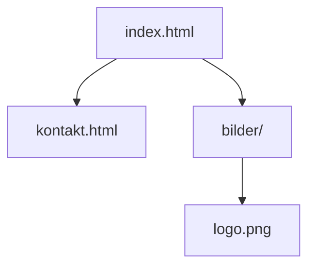
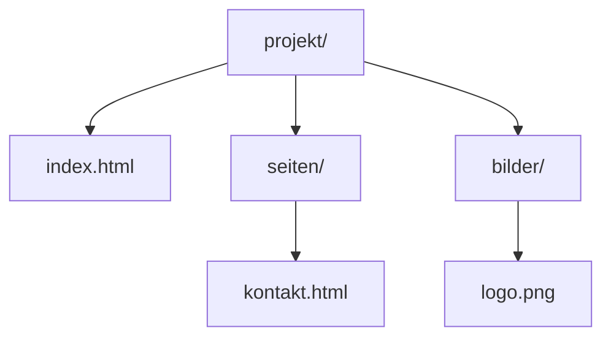
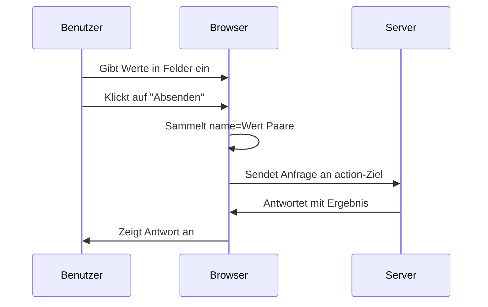

###### Themen

Listen und Links

- Geordnete und ungeordnete Listen mit ol, ul und li erstellen
- Hyperlinks mit a und href einfügen und verstehen
- Relative und absolute Verlinkungen grundlegend unterscheiden

Bilder einbinden

- Bilder mit img einfügen
- Attribute wie src, alt und title sinnvoll einsetzen
- Einfache Pfadangaben korrekt verwenden

Einfache Formulare erstellen

- Grundelemente eines Formulars mit form, input, label und button kennenlernen
- Einfache Formulare strukturiert aufbauen
- Grundidee des Sendens von Formulardaten verstehen

<br><br><br>

# 📚 Listen und Links

Listen und Links gehören zu den wichtigsten Grundlagen in HTML. Sie wirken auf den ersten Blick einfach, sind aber ein gutes Beispiel dafür, wie HTML **Inhalte strukturiert** und **Bedeutung vermittelt**. Genau das ist ein Kernpunkt von Core Tech Fundamentals: Du lernst nicht nur, *wie etwas aussieht*, sondern vor allem, *welche Rolle ein Inhalt im Dokument hat*. HTML beschreibt also die Struktur und Bedeutung einer Seite, nicht primär ihr Design ([HTML: HyperText Markup Language](https://developer.mozilla.org/en-US/docs/Web/HTML)).

Wenn du Listen und Links sauber verstehst, baust du bereits zwei zentrale Fähigkeiten auf:

1. **Informationen logisch ordnen**
2. **Inhalte miteinander verbinden**

Beides ist grundlegend für Webseiten, Dokumentationen, Navigationen und Formulare.


<br><br><br>

## 📝 Geordnete und ungeordnete Listen mit `ol`, `ul` und `li` erstellen

HTML kennt zwei grundlegende Listenarten:

- **ungeordnete Listen** mit `ul`
- **geordnete Listen** mit `ol`

Die einzelnen Listeneinträge werden jeweils mit `li` erstellt. Das `li` steht für **list item**, also Listenelement. Sowohl `ul` als auch `ol` verwenden `li` für ihre Einträge ([The Unordered List element](https://developer.mozilla.org/en-US/docs/Web/HTML/Element/ul)).

### Wann verwendet man welche Liste?

Eine **ungeordnete Liste (`ul`)** nutzt du, wenn die Reihenfolge der Punkte **nicht wichtig** ist. Typische Beispiele:

- Einkaufsliste
- Eigenschaften eines Produkts
- Navigation mit mehreren Menüpunkten

Eine **geordnete Liste (`ol`)** nutzt du, wenn die Reihenfolge **wichtig** ist. Typische Beispiele:

- Schritt-für-Schritt-Anleitung
- Ranglisten
- Installationsabläufe

### Beispiel für eine ungeordnete Liste

```html
<ul>
  <li>HTML lernen</li>
  <li>CSS verstehen</li>
  <li>JavaScript später hinzufügen</li>
</ul>
```

Der Browser zeigt typischerweise Aufzählungspunkte an. Wichtig ist aber: Der eigentliche Sinn ist nicht die Optik, sondern dass es sich semantisch um eine **Liste ohne feste Reihenfolge** handelt.

### Beispiel für eine geordnete Liste

```html
<ol>
  <li>Datei anlegen</li>
  <li>HTML-Grundgerüst schreiben</li>
  <li>Im Browser öffnen</li>
</ol>
```

Hier zeigt der Browser meist Zahlen an. Auch hier gilt: Nicht die Zahl ist das Entscheidende, sondern die Aussage, dass die Reihenfolge eine Rolle spielt.

### Die Beziehung zwischen `ul` / `ol` und `li`

Ein `li` gehört in der Regel in eine Liste. Du denkst also am besten so:

- `ul` = Rahmen für eine ungeordnete Liste
- `ol` = Rahmen für eine geordnete Liste
- `li` = einzelner Punkt innerhalb der Liste

### Typischer Denkfehler

Viele Anfänger schauen nur auf das Aussehen und denken:

> „Ich nehme `ol`, weil ich Zahlen sehen will.“

Besser ist:

> „Ich nehme `ol`, weil die Reihenfolge fachlich wichtig ist.“

Das ist ein sehr wichtiger Lernschritt. In HTML arbeitest du idealerweise **bedeutungsorientiert**, nicht rein optisch.

### Vergleich in einer Tabelle

| Element | Bedeutung | Typischer Einsatz |
|---|---|---|
| `ul` | Ungeordnete Liste | Merkmale, Menüs, Sammlungen |
| `ol` | Geordnete Liste | Schritte, Anleitungen, Abläufe |
| `li` | Einzelner Listeneintrag | Inhalt innerhalb von `ul` oder `ol` |

### Verschachtelte Listen

Listen können auch ineinander verschachtelt werden. Das ist nützlich, wenn du Hauptpunkte und Unterpunkte darstellen willst.

```html
<ul>
  <li>Frontend
    <ul>
      <li>HTML</li>
      <li>CSS</li>
      <li>JavaScript</li>
    </ul>
  </li>
  <li>Backend</li>
</ul>
```

Damit kannst du Hierarchien ausdrücken. Gerade beim Lernen von Technik ist das hilfreich, weil viele Themen nicht flach, sondern **baumartig** organisiert sind.


<br><br><br>

## 🔗 Hyperlinks mit `a` und `href` einfügen und verstehen

Hyperlinks sind das Herz des Webs. Das `<a>`-Element wird verwendet, um Links zu erzeugen. Das Attribut `href` gibt an, **wohin** der Link führt ([The Anchor element](https://developer.mozilla.org/en-US/docs/Web/HTML/Element/a)).

Ein einfacher Link sieht so aus:

```html
<a href="https://developer.mozilla.org/">MDN Web Docs</a>
```

### Was macht `a`?

Das `a`-Element ist der **Link selbst**. Der Text zwischen dem öffnenden und schließenden Tag ist das, was Benutzer anklicken können.

In diesem Beispiel:

```html
<a href="https://example.com">Zur Website</a>
```

ist:

- `a` das HTML-Element für einen Link
- `href` die Zieladresse
- `Zur Website` der sichtbare Linktext

### Was bedeutet `href`?

`href` steht für **Hypertext Reference**. Es enthält die Adresse, die aufgerufen werden soll. Ohne `href` ist ein `a`-Element normalerweise kein echter navigierbarer Link.

### Gute Linktexte sind wichtig

Ein Linktext sollte verständlich sagen, wohin oder wozu der Link führt. Also besser:

```html
<a href="kontakt.html">Zur Kontaktseite</a>
```

statt:

```html
<a href="kontakt.html">Hier klicken</a>
```

Das ist nicht nur verständlicher für Menschen, sondern auch besser für Barrierefreiheit und Orientierung ([The Anchor element](https://developer.mozilla.org/en-US/docs/Web/HTML/Element/a)).

### Links können auch auf interne Seiten zeigen

```html
<a href="about.html">Über uns</a>
```

Das bedeutet: Öffne die Datei `about.html`.

### Links können auch Bilder oder andere Inhalte enthalten

Ein Link muss nicht nur Text enthalten. Du kannst zum Beispiel auch ein Bild anklickbar machen:

```html
<a href="index.html">
  
</a>
```

### Grundidee: Ein Link ist eine Verbindung

Ein Hyperlink verbindet ein Dokument mit einem anderen Ziel. Dieses Ziel kann sein:

- eine andere Webseite
- eine Unterseite deines Projekts
- ein Bild
- ein Dokument
- ein Bereich innerhalb derselben Seite

Wenn du das einmal sauber verstanden hast, begreifst du einen Kernmechanismus des Webs: **Dokumente sind vernetzt**.


<br><br><br>

## 🧭 Relative und absolute Verlinkungen grundlegend unterscheiden

Das ist ein ganz wichtiger Punkt, weil viele Anfänger hier durcheinanderkommen.

### Absolute Verlinkung

Eine **absolute URL** enthält die vollständige Webadresse inklusive Protokoll und Domain, zum Beispiel:

```html
<a href="https://www.wikipedia.org/">Wikipedia</a>
```

Das ist eine komplett ausgeschriebene Adresse. Der Browser weiß genau, welches Ziel im Web gemeint ist.

### Relative Verlinkung

Eine **relative Verlinkung** beschreibt den Pfad **ausgehend von der aktuellen Datei oder Struktur deiner Website**. Beispiel:

```html
<a href="kontakt.html">Kontakt</a>
```

Hier wird keine komplette Internetadresse genannt. Stattdessen sagt der Link sinngemäß:

> „Gehe zur Datei `kontakt.html` im passenden Zusammenhang dieses Projekts.“

### Wann verwendet man was?

**Absolute Links** verwendest du meist, wenn du auf eine **externe Website** verweist.

**Relative Links** verwendest du meist, wenn du innerhalb deines **eigenen Projekts** verlinkst.

### Typische Beispiele

| Art | Beispiel | Bedeutung |
|---|---|---|
| Absolut | `https://example.com/about.html` | Vollständige Internetadresse |
| Relativ | `about.html` | Datei im selben Ordner |
| Relativ | `seiten/about.html` | Datei in einem Unterordner |
| Relativ | `../index.html` | Eine Ebene nach oben, dann zur Datei |

### Einfache Ordnerstruktur verstehen

Angenommen, dein Projekt sieht so aus:

```text
projekt/
├── index.html
├── kontakt.html
└── bilder/
    └── logo.png
```

Dann bedeutet:

- `kontakt.html` → Datei liegt im selben Ordner wie `index.html`
- `bilder/logo.png` → gehe in den Ordner `bilder`, dann zur Datei `logo.png`

### Visualisierung der Pfade



Wenn du dich in `index.html` befindest:

- `href="kontakt.html"` zeigt auf `kontakt.html`
- `src="bilder/logo.png"` zeigt auf das Bild im Unterordner

### Das Prinzip hinter relativen Pfaden

Relative Pfade sind sehr nützlich, weil dein Projekt dadurch **portabler** wird. Wenn du den ganzen Projektordner verschiebst, funktionieren die internen Verlinkungen oft weiterhin, solange die Ordnerstruktur gleich bleibt. Das ist ein grundlegender praktischer Vorteil sauberer Projektstrukturen.

### Ein häufiger Fehler

Ein sehr häufiger Anfängerfehler ist, Dateinamen und Ordner nicht exakt zu schreiben. HTML-Pfade sind empfindlich gegenüber:

- falschen Dateinamen
- falschen Ordnernamen
- Groß- und Kleinschreibung auf manchen Systemen
- fehlenden oder zu vielen `/`

Hier zeigt sich ein wichtiges Lernprinzip in der Technik: **Präzision schlägt Vermutung**. Wenn ein Link nicht funktioniert, prüfst du immer systematisch:

1. Liegt die Datei wirklich dort?
2. Ist der Name exakt richtig?
3. Stimmt der Pfad aus Sicht der aktuellen Datei?


<br><br><br>

# 🖼️ Bilder einbinden

Bilder machen eine Seite anschaulicher, aber in HTML geht es auch hier nicht nur darum, „etwas anzuzeigen“. Ein Bild braucht eine korrekte Quelle, eine verständliche Alternativbeschreibung und einen sinnvollen Pfad. Das `img`-Element bindet Bilder in Dokumente ein ([The Image Embed element](https://developer.mozilla.org/en-US/docs/Web/HTML/Element/img)).


<br><br><br>

## 🖼️ Bilder mit `img` einfügen

Ein einfaches Bild sieht so aus:

```html

```

### Was ist `img`?

`img` steht für **image**. Es ist das HTML-Element zum Einbinden eines Bildes.

Wichtig: `img` ist ein sogenanntes **leeres Element** bzw. **Void Element**. Es hat also normalerweise **kein schließendes Tag** wie `</img>` ([Void element](https://developer.mozilla.org/en-US/docs/Glossary/Void_element)).

### Die wichtigsten Bestandteile

- `src` sagt, **welche Bilddatei geladen werden soll**
- `alt` beschreibt das Bild als Text
- `title` kann zusätzliche Informationen anzeigen, oft als Hinweis beim Darüberfahren mit der Maus

### Beispiel mit allen drei Attributen

```html

```

### Warum `alt` so wichtig ist

Das `alt`-Attribut ist nicht einfach „optional netter Zusatztext“. Es ist wichtig für Barrierefreiheit und für Situationen, in denen das Bild nicht geladen werden kann. Screenreader nutzen den Alternativtext, um den Bildinhalt zu vermitteln ([The Image Embed element](https://developer.mozilla.org/en-US/docs/Web/HTML/Element/img)).

Wenn das Bild rein dekorativ ist und keine inhaltliche Bedeutung hat, wird oft ein leeres `alt=""` verwendet, damit Hilfstechnologien es überspringen können ([Images Tutorial](https://www.w3.org/WAI/tutorials/images/)).

### Was sollte in `alt` stehen?

Ein guter `alt`-Text beschreibt den **inhaltlichen Zweck** des Bildes, nicht einfach nur jede optische Kleinigkeit.

Beispiel:

```html

```

Nicht so hilfreich wäre:

```html

```

Denn „Bild“ sagt praktisch nichts.

### Was macht `title`?

`title` kann einen zusätzlichen Hinweis liefern, ist aber **kein Ersatz für `alt`**. Das ist wichtig. `title` wird von Browsern oft als Tooltip dargestellt, wenn man mit der Maus über das Element fährt, aber es ist nicht zuverlässig genug, um wichtige Informationen allein dort unterzubringen ([HTML title global attribute](https://developer.mozilla.org/en-US/docs/Web/HTML/Global_attributes/title)).

### Vergleich der Attribute

| Attribut | Aufgabe | Wichtigkeit |
|---|---|---|
| `src` | Pfad zur Bilddatei | Unverzichtbar |
| `alt` | Textalternative für Inhalt oder Zweck | Sehr wichtig |
| `title` | Zusätzlicher Hinweis | Optional |


<br><br><br>

## 🧩 Attribute wie `src`, `alt` und `title` sinnvoll einsetzen

Damit du diese Attribute nicht nur auswendig lernst, sondern wirklich verstehst, hilft diese Denkweise:

### `src` = Wo liegt die Datei?

Das `src`-Attribut enthält den Pfad zur Bilddatei.

```html

```

Hier sucht der Browser im Ordner `bilder` nach der Datei `teamfoto.jpg`.

### `alt` = Was bedeutet das Bild inhaltlich?

Das `alt`-Attribut beantwortet eher die Frage:

> „Was soll ein Mensch verstehen, wenn das Bild nicht sichtbar ist?“

Das ist eine sehr gute Denkregel.

### `title` = Zusätzlicher Hinweis, aber nicht Pflicht

Wenn du `title` verwendest, sollte er ergänzen, nicht wiederholen.

Weniger gut:

```html

```

Besser:

```html

```

Dann hat jedes Attribut eine eigene Aufgabe.

### Häufige Fehler bei Bildern

Einige typische Fehler sind:

- `alt` vergessen
- falschen Pfad in `src` verwenden
- `title` mit `alt` verwechseln
- Dateiendung falsch schreiben, etwa `.jpg` statt `.png`
- Leerzeichen oder Sonderzeichen in Dateinamen unüberlegt verwenden

Gerade bei Bildern merkst du schnell, wie wichtig saubere Dateistrukturen sind.


<br><br><br>

## 🧭 Einfache Pfadangaben korrekt verwenden

Pfadangaben bei Bildern funktionieren nach demselben Prinzip wie bei Links.

### Beispielstruktur

```text
projekt/
├── index.html
├── seiten/
│   └── kontakt.html
└── bilder/
    ├── logo.png
    └── team.jpg
```

### Bild aus derselben Ebene einbinden

Wenn `index.html` im Hauptordner liegt und das Bild in `bilder/logo.png`, dann:

```html

```

### Bild aus einem Unterordner heraus einbinden

Wenn du dich in `seiten/kontakt.html` befindest und das Bild liegt in `bilder/logo.png`, dann musst du erst eine Ebene nach oben gehen:

```html

```

`..` bedeutet: **eine Ordnerebene nach oben**.

### Visualisierung des Pfads



Von `kontakt.html` aus ist der Weg zu `logo.png` also:

1. hoch zu `projekt/`
2. in `bilder/`
3. dann `logo.png`

Darum lautet der Pfad:

```html
../bilder/logo.png
```

### Praktischer Lerntipp für Pfade

Wenn du Pfade lernst, denke nicht in abstrakten Zeichenketten, sondern wie bei einem Dateibaum:

- Wo bin ich gerade?
- Wo liegt das Ziel?
- Muss ich hoch, runter oder direkt zugreifen?

Das ist ein sehr solides mentales Modell und hilft auch später in CSS, JavaScript, Build-Tools und Backend-Projekten.


<br><br><br>

# 🧾 Einfache Formulare erstellen

Formulare sind die Schnittstelle zwischen Benutzer und Website. Immer wenn jemand Daten eingibt und absendet, steckt meist ein HTML-Formular dahinter. Das `form`-Element dient dazu, Benutzereingaben zu sammeln und zu senden ([The Form element](https://developer.mozilla.org/en-US/docs/Web/HTML/Element/form)).

Formulare sind ein besonders gutes Thema, um grundlegendes technisches Denken zu lernen, weil hier mehrere Ebenen zusammenkommen:

- Struktur in HTML
- Zuordnung von Beschriftungen
- Datenerfassung
- Senden an ein Ziel
- Unterschied zwischen Anzeige und Verarbeitung

Das ist also ein klassisches Core-Tech-Thema.


<br><br><br>

## 🧱 Grundelemente eines Formulars mit `form`, `input`, `label` und `button` kennenlernen

Ein sehr einfaches Formular kann so aussehen:

```html
<form>
  <label for="name">Name:</label>
  <input id="name" name="name" type="text">

  <button type="submit">Absenden</button>
</form>
```

### Was macht `form`?

`form` ist der Rahmen des gesamten Formulars. Alles, was zu diesem Eingabebereich gehört, liegt innerhalb dieses Elements.

### Was macht `input`?

`input` ist ein Eingabefeld. Je nach `type` kann es unterschiedliche Aufgaben haben, zum Beispiel:

- Text eingeben
- E-Mail-Adresse eingeben
- Passwort eingeben
- Checkbox auswählen

Beispiel:

```html
<input type="text">
<input type="email">
<input type="password">
```

Die möglichen Eingabetypen sind im HTML-Standard definiert, und Browser unterstützen je nach Typ teils passende Eingabehilfen und Validierungen ([The Input element](https://developer.mozilla.org/en-US/docs/Web/HTML/Element/input)).

### Was macht `label`?

`label` ist die Beschriftung eines Eingabefelds. Das ist extrem wichtig, weil Nutzer dadurch verstehen, **was sie eingeben sollen**. Außerdem verbessert ein korrekt verknüpftes `label` die Bedienbarkeit und Barrierefreiheit ([The Label element](https://developer.mozilla.org/en-US/docs/Web/HTML/Element/label)).

Die Verbindung funktioniert über:

- `for` im `label`
- `id` im passenden `input`

Beispiel:

```html
<label for="email">E-Mail:</label>
<input id="email" name="email" type="email">
```

Hier gehört das Label „E-Mail:“ genau zu diesem Eingabefeld.

### Was macht `button`?

Ein `button` ist eine Schaltfläche. In Formularen wird er oft zum Absenden genutzt.

```html
<button type="submit">Absenden</button>
```

`type="submit"` bedeutet: Das Formular soll gesendet werden.

### Warum `name` bei `input` wichtig ist

Obwohl in deiner Stichpunktliste vor allem `form`, `input`, `label` und `button` genannt werden, gehört ein Attribut unbedingt in das Grundverständnis hinein: `name`.

```html
<input id="name" name="name" type="text">
```

Der `name` ist der **Schlüssel**, unter dem der Wert beim Senden des Formulars übertragen wird. Ohne `name` wird der Feldwert in der Regel nicht als Formulardatum mitgesendet ([The Input element](https://developer.mozilla.org/en-US/docs/Web/HTML/Element/input)).

Das ist ein sehr wichtiger technischer Zusammenhang.


<br><br><br>

## 🏗️ Einfache Formulare strukturiert aufbauen

Ein Formular sollte nicht einfach aus zufällig aneinandergereihten Feldern bestehen. Ein guter Aufbau hilft bei Lesbarkeit, Bedienbarkeit und Wartbarkeit.

### Einfaches Beispiel eines strukturierten Formulars

```html
<form action="/senden" method="post">
  <div>
    <label for="vorname">Vorname:</label>
    <input id="vorname" name="vorname" type="text">
  </div>

  <div>
    <label for="email">E-Mail:</label>
    <input id="email" name="email" type="email">
  </div>

  <div>
    <button type="submit">Formular absenden</button>
  </div>
</form>
```

### Was ist hier strukturiert?

Jedes Feld besteht aus:

1. einer Beschriftung
2. einem Eingabeelement
3. einer klaren Gruppierung

Dadurch wird der Code leichter lesbar. Auch wenn das optisch zunächst schlicht aussieht, ist die HTML-Struktur bereits sauber.

### Warum `action` und `method` wichtig sind

Das `form`-Element kann zwei besonders wichtige Attribute haben:

- `action`
- `method`

Beispiel:

```html
<form action="/senden" method="post">
```

#### `action`

`action` gibt an, **wohin** die Formulardaten gesendet werden sollen.

#### `method`

`method` gibt an, **wie** gesendet wird. Die gebräuchlichsten Varianten sind `get` und `post` ([The Form element](https://developer.mozilla.org/en-US/docs/Web/HTML/Element/form)).

### Unterschied zwischen `get` und `post` grundlegend

#### `get`

Bei `get` werden die Daten normalerweise als Teil der URL übertragen. Das sieht oft so aus:

```text
/search?begriff=html
```

Das ist praktisch für Suchformulare oder Inhalte, die man als URL teilen kann.

#### `post`

Bei `post` werden die Daten im HTTP-Request-Körper übertragen, nicht direkt sichtbar in der URL. Das wird oft verwendet, wenn Formulare Daten wirklich absenden, etwa bei Registrierung, Login oder Kontaktformularen ([HTTP request methods](https://developer.mozilla.org/en-US/docs/Web/HTTP/Methods)).

Wichtig ist: `post` bedeutet nicht automatisch „sicher“, aber es zeigt Daten nicht direkt in der URL.

### Gute Grundstruktur für Anfänger

Für den Anfang ist diese Denkregel sehr hilfreich:

- `form` = gesamter Formularrahmen
- `label` = sagt, was erwartet wird
- `input` = nimmt die Eingabe auf
- `name` = Name des Datenfelds beim Senden
- `button` = startet eine Aktion, meist Absenden

Wenn du diese fünf Bausteine wirklich verstehst, hast du das Grundprinzip von Formularen schon sehr gut erfasst.


<br><br><br>

## 📤 Grundidee des Sendens von Formulardaten verstehen

Jetzt kommt der wichtigste konzeptionelle Schritt: Was bedeutet „Formular senden“ eigentlich?

Wenn ein Benutzer etwas in ein Formular eingibt und auf **Absenden** klickt, passiert vereinfacht gesagt Folgendes:

1. Der Browser sammelt die Werte der Formularfelder.
2. Er ordnet sie anhand ihrer `name`-Attribute zu.
3. Er sendet diese Daten an das in `action` angegebene Ziel.
4. Die Gegenstelle, meist ein Server, verarbeitet die Daten.

### Beispiel

```html
<form action="/anmeldung" method="post">
  <label for="benutzername">Benutzername:</label>
  <input id="benutzername" name="benutzername" type="text">

  <label for="email">E-Mail:</label>
  <input id="email" name="email" type="email">

  <button type="submit">Anmelden</button>
</form>
```

Wenn ein Benutzer eingibt:

- Benutzername: `max`
- E-Mail: `max@example.com`

dann werden im Kern Daten mit den Schlüsseln `benutzername` und `email` gesendet.

### Warum ist `name` dabei so entscheidend?

Der Server interessiert sich nicht für das `id` zur Beschriftung, sondern vor allem für die gesendeten Feldnamen. Genau deshalb ist `name` technisch so wichtig.

### Vereinfachter Datenfluss



### Ein konkretes GET-Beispiel

```html
<form action="/suche" method="get">
  <label for="q">Suche:</label>
  <input id="q" name="q" type="text">
  <button type="submit">Suchen</button>
</form>
```

Wenn jemand `html` eingibt, könnte daraus eine URL entstehen wie:

```text
/suche?q=html
```

Das Feld mit `name="q"` wird also zusammen mit dem eingegebenen Wert übertragen.

### Ein konkretes POST-Beispiel

```html
<form action="/kontakt" method="post">
  <label for="nachricht">Nachricht:</label>
  <input id="nachricht" name="nachricht" type="text">
  <button type="submit">Senden</button>
</form>
```

Hier werden die Daten an `/kontakt` gesendet, aber typischerweise nicht direkt sichtbar in der URL.

### Ganz wichtig für dein technisches Verständnis

Ein HTML-Formular **verarbeitet** die Daten nicht selbst. Es **sammelt und sendet** sie. Die eigentliche Verarbeitung passiert normalerweise an anderer Stelle, zum Beispiel:

- auf einem Server
- in einer Serveranwendung
- manchmal per JavaScript

Das ist ein zentraler Architekturgedanke im Web: HTML beschreibt und übergibt, aber rechnet oder speichert nicht eigenständig im Sinn einer Anwendungslogik.

### Häufige Anfängerfehler bei Formularen

Ein paar Fehler tauchen besonders oft auf:

- `label` ist nicht mit `input` verbunden
- `name` fehlt
- `button` hat nicht den gewünschten Typ
- `action` zeigt auf ein falsches Ziel
- `method` wird nicht bewusst gewählt
- Felder sind unklar beschriftet

### Gute Lernhaltung bei Formularen

Formulare sind ein perfektes Thema, um „richtiges Lernen“ im technischen Bereich zu üben. Statt nur Tags auswendig zu lernen, solltest du immer die Funktion jedes Teils verstehen:

- Was sammelt Daten?
- Was beschriftet Daten?
- Was benennt Daten?
- Was sendet Daten?
- Wohin werden Daten gesendet?
- In welcher Form werden Daten gesendet?

Wenn du so lernst, baust du echtes Systemverständnis auf. Und genau das ist langfristig viel wertvoller als bloßes Merken einzelner Syntaxfragmente.


<br><br><br>

## 🔧 Zusammenspiel aller Grundlagen in einem kleinen Gesamtbeispiel

Damit du die Themen zusammenhängend siehst, hier eine kleine HTML-Seite mit Liste, Link, Bild und Formular:

```html
<!DOCTYPE html>
<html lang="de">
<head>
  <meta charset="UTF-8">
  <title>HTML-Grundlagen</title>
</head>
<body>
  <h1>HTML-Grundlagen</h1>

  <h2>Themenliste</h2>
  <ul>
    <li>Listen verstehen</li>
    <li>Links setzen</li>
    <li>Bilder einbinden</li>
    <li>Formulare erstellen</li>
  </ul>

  <h2>Nützlicher Link</h2>
  <p>
    <a href="https://developer.mozilla.org/">Zur MDN-Dokumentation</a>
  </p>

  <h2>Bild</h2>
  

  <h2>Kontaktformular</h2>
  <form action="/kontakt" method="post">
    <div>
      <label for="name">Name:</label>
      <input id="name" name="name" type="text">
    </div>

    <div>
      <label for="email">E-Mail:</label>
      <input id="email" name="email" type="email">
    </div>

    <div>
      <button type="submit">Absenden</button>
    </div>
  </form>
</body>
</html>
```

An diesem Beispiel kannst du sehr gut erkennen:

- Listen strukturieren Inhalte
- Links verbinden Seiten oder Ressourcen
- Bilder binden Medien ein
- Formulare sammeln und senden Eingaben

Das sind keine isolierten Einzelthemen, sondern Bausteine derselben Grundidee: HTML beschreibt die **Bedeutung und Struktur** eines Webdokuments.