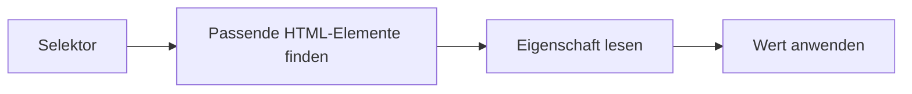
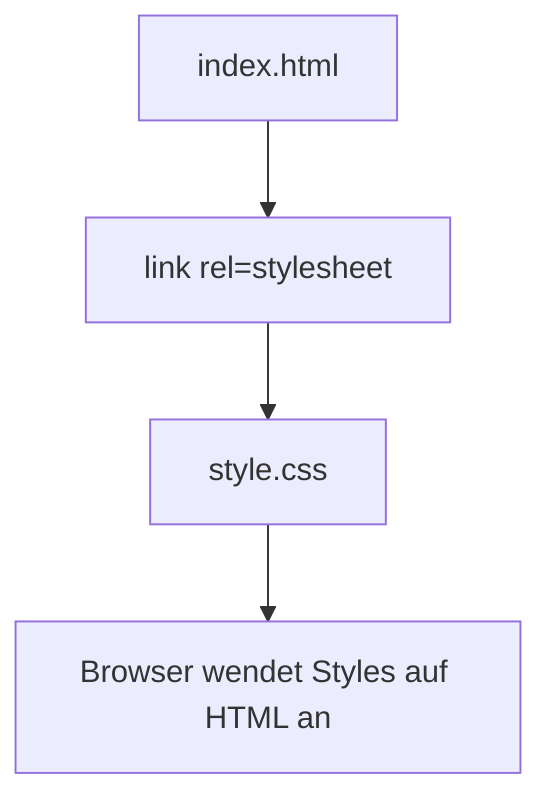

###### Themen

CSS-Grundlagen und Syntax

- Aufbau einer CSS-Regel mit Selektor, Eigenschaft und Wert verstehen
- CSS intern und extern in HTML einbinden

Grundlegende CSS-Selektoren und Farben

- Element-, Klassen- und ID-Selektoren anwenden
- Farben mit einfachen Farbwerten wie Namen, Hex oder RGB nutzen

Textgestaltung mit CSS

- Schriftgröße, Schriftstil, Schriftgewicht und Zeilenhöhe anpassen
- Texte mit CSS lesbarer und übersichtlicher gestalten

<br><br><br>
# 🎨 CSS-Grundlagen und Syntax

CSS steht für **Cascading Style Sheets** und ist die Sprache, mit der du das Aussehen von HTML-Inhalten gestaltest. HTML beschreibt also eher die **Struktur** einer Seite, CSS kümmert sich um die **Darstellung**: Farben, Abstände, Schriftgrößen, Layout und vieles mehr. CSS arbeitet dabei regelbasiert: Du schreibst Regeln, und der Browser wendet diese Regeln auf passende HTML-Elemente an ([What is CSS?](https://developer.mozilla.org/en-US/docs/Learn_web_development/Core/Styling_basics/What_is_CSS)).


<br><br><br>
## 🧱 Aufbau einer CSS-Regel mit Selektor, Eigenschaft und Wert verstehen

Eine CSS-Regel besteht im Kern aus drei Dingen:

1. **Selektor**
2. **Eigenschaft**
3. **Wert**

So sieht die Grundform aus:

```css
selektor {
  eigenschaft: wert;
}
```

Ein einfaches Beispiel:

```css
p {
  color: blue;
}
```

Hier bedeutet das:

- `p` ist der **Selektor**
- `color` ist die **Eigenschaft**
- `blue` ist der **Wert**

Die Regel sagt also:  
**„Alle `<p>`-Elemente sollen blau dargestellt werden.“** ([CSS Syntax](https://developer.mozilla.org/en-US/docs/Web/CSS/Syntax))


<br><br><br>
### 🔍 Die Bestandteile ganz einfach erklärt

| Bestandteil | Bedeutung | Beispiel | Erklärung |
|---|---|---|---|
| Selektor | Wählt aus, **welches HTML-Element** gestaltet werden soll | `p` | Alle Absätze |
| Eigenschaft | Legt fest, **was** verändert werden soll | `color` | Textfarbe |
| Wert | Legt fest, **wie** es aussehen soll | `blue` | Blaue Farbe |

Du kannst dir eine CSS-Regel also wie einen Satz vorstellen:

> **„Für dieses Element soll diese Eigenschaft diesen Wert bekommen.“**

Noch ein Beispiel:

```css
h1 {
  font-size: 32px;
}
```

Das bedeutet:  
Alle `<h1>`-Überschriften sollen eine Schriftgröße von `32px` bekommen ([font-size](https://developer.mozilla.org/en-US/docs/Web/CSS/font-size)).


<br><br><br>
### 🧩 So ist eine CSS-Regel aufgebaut

```css
p {
  color: red;
  font-size: 18px;
  line-height: 1.5;
}
```

Hier passiert gleich mehrere Male das gleiche Prinzip:

- `p` ist der Selektor
- `color: red;` ist eine Eigenschaft-Wert-Zuweisung
- `font-size: 18px;` ist eine weitere
- `line-height: 1.5;` ist noch eine weitere

Wichtig ist dabei:

- Die geschweiften Klammern `{ }` enthalten alle Stilregeln für den Selektor.
- Zwischen Eigenschaft und Wert steht **immer ein Doppelpunkt** `:`.
- Jede Zeile endet normalerweise mit einem **Semikolon** `;`.
- Mehrere Eigenschaften für denselben Selektor stehen untereinander in derselben Regel ([CSS Syntax](https://developer.mozilla.org/en-US/docs/Web/CSS/Syntax)).

Gerade am Anfang machen viele kleine Syntaxfehler, zum Beispiel ein vergessenes Semikolon oder eine fehlende schließende Klammer. Dann ignoriert der Browser manchmal Teile des Codes. Deshalb lohnt es sich, CSS immer sauber und ordentlich zu schreiben.


<br><br><br>
### 🧠 Ein Bild im Kopf: So arbeitet der Browser



Der Browser liest also vereinfacht gesagt:

1. **Wen soll ich gestalten?** → Selektor  
2. **Was soll ich verändern?** → Eigenschaft  
3. **Welchen Wert soll ich setzen?** → Wert


<br><br><br>
### ✍️ Ein komplettes Beispiel mit HTML und CSS

```html
<p>Das ist ein Absatz.</p>
```

```css
p {
  color: green;
  font-size: 20px;
}
```

Ergebnis:

- Der Text des Absatzes wird **grün**
- Die Schrift wird **größer**

Das Entscheidende ist:  
CSS verändert nicht den Inhalt selbst, sondern die **Darstellung** des Inhalts.


<br><br><br>
## 🔗 CSS intern und extern in HTML einbinden

Damit CSS überhaupt wirkt, muss es mit deinem HTML-Dokument verbunden werden. Für deine Grundlagen sind zwei Varianten besonders wichtig:

- **internes CSS**
- **externes CSS**


<br><br><br>
### 🏠 Internes CSS

Internes CSS schreibst du direkt in die HTML-Datei, und zwar innerhalb eines `<style>`-Elements, meistens im `<head>`-Bereich. Das `<style>`-Element ist genau dafür da, Stilinformationen in ein HTML-Dokument einzubetten ([The Style Information element](https://developer.mozilla.org/en-US/docs/Web/HTML/Element/style)).

Beispiel:

```html
<!DOCTYPE html>
<html lang="de">
<head>
  <meta charset="UTF-8">
  <title>Internes CSS</title>
  <style>
    p {
      color: blue;
      font-size: 18px;
    }
  </style>
</head>
<body>
  <p>Dieser Text ist blau.</p>
</body>
</html>
```

Hier liegt HTML und CSS also in **derselben Datei**.

**Wann ist internes CSS praktisch?**  
Zum Beispiel:

- wenn du etwas schnell testen willst
- bei sehr kleinen Beispielseiten
- beim Lernen, wenn du HTML und CSS direkt zusammen sehen möchtest

Für größere Projekte wird es aber schnell unübersichtlich, weil Struktur und Gestaltung dann stark vermischt werden.


<br><br><br>
### 🌍 Externes CSS

Externes CSS liegt in einer **eigenen Datei**, zum Beispiel `style.css`. Diese Datei bindest du dann mit einem `<link>`-Element in deine HTML-Seite ein. Das `<link>`-Element verbindet das HTML-Dokument mit einer externen Ressource wie einer Stylesheet-Datei ([The External Resource Link element](https://developer.mozilla.org/en-US/docs/Web/HTML/Element/link)).

HTML-Datei:

```html
<!DOCTYPE html>
<html lang="de">
<head>
  <meta charset="UTF-8">
  <title>Externes CSS</title>
  <link rel="stylesheet" href="style.css">
</head>
<body>
  <p>Dieser Text bekommt sein Styling aus einer externen CSS-Datei.</p>
</body>
</html>
```

CSS-Datei `style.css`:

```css
p {
  color: purple;
  font-size: 18px;
}
```

Das ist die **wichtigste und sauberste Variante** im echten Arbeiten, weil du damit Struktur und Gestaltung sauber trennst.

**Vorteile von externem CSS:**

- Der Code ist übersichtlicher.
- Mehrere HTML-Seiten können dieselbe CSS-Datei nutzen.
- Änderungen an einer CSS-Datei wirken direkt auf viele Seiten.
- Wartung und Erweiterung werden viel einfacher.

Gerade für richtiges Lernen ist externes CSS sehr hilfreich, weil du dabei früh verstehst, dass HTML und CSS unterschiedliche Aufgaben haben:  
HTML beschreibt **was etwas ist**, CSS beschreibt **wie es aussieht**.


<br><br><br>
### ⚖️ Interne und externe Einbindung im Vergleich

| Variante | Wo steht das CSS? | Vorteil | Nachteil |
|---|---|---|---|
| Intern | In derselben HTML-Datei im `<style>`-Block | Schnell für kleine Tests | Bei größeren Seiten unübersichtlich |
| Extern | In einer separaten `.css`-Datei | Sauber, wiederverwendbar, professionell | Du musst Datei und Pfad korrekt verknüpfen |

Wenn du ernsthaft CSS lernen willst, solltest du zwar **beides verstehen**, aber möglichst früh mit **externen CSS-Dateien** arbeiten.


<br><br><br>
### 🗺️ So hängen HTML und CSS zusammen



Der Browser lädt also zuerst dein HTML, findet dort den Verweis auf die CSS-Datei und nutzt diese Regeln dann zur Darstellung.


<br><br><br>
# 🎯 Grundlegende CSS-Selektoren und Farben

Sobald du weißt, wie CSS-Regeln aufgebaut sind, kommt die nächste wichtige Frage:

**Auf welche Elemente soll eine Regel angewendet werden?**

Genau dafür brauchst du **Selektoren**.  
Und wenn du die passenden Elemente ausgewählt hast, kannst du sie mit Eigenschaften wie `color` oder `background-color` gestalten.


<br><br><br>
## 🏷️ Element-, Klassen- und ID-Selektoren anwenden

Die drei wichtigsten Grundselektoren sind:

- **Element-Selektor**
- **Klassen-Selektor**
- **ID-Selektor**

Mit diesen drei kommst du am Anfang schon sehr weit.


<br><br><br>
### 📄 Element-Selektor

Ein Element-Selektor spricht direkt ein HTML-Element an, zum Beispiel `p`, `h1` oder `button`. Solche Selektoren heißen in CSS auch **Type Selectors** ([Type selectors](https://developer.mozilla.org/en-US/docs/Web/CSS/Type_selectors)).

Beispiel:

```css
p {
  color: black;
}
```

Das bedeutet:  
Alle `<p>`-Elemente auf der Seite werden angesprochen.

HTML:

```html
<p>Erster Absatz</p>
<p>Zweiter Absatz</p>
```

Beide Absätze bekommen dieselbe Regel.

Der Element-Selektor ist nützlich, wenn du **alle Elemente einer Sorte gleich gestalten** willst. Zum Beispiel:

- alle Absätze
- alle Überschriften einer bestimmten Ebene
- alle Listenpunkte


<br><br><br>
### 🧷 Klassen-Selektor

Ein Klassen-Selektor beginnt mit einem Punkt, also z. B. `.wichtig`. Er spricht Elemente an, die in HTML das passende `class`-Attribut besitzen ([Class selectors](https://developer.mozilla.org/en-US/docs/Web/CSS/Class_selectors)).

HTML:

```html
<p class="wichtig">Dieser Absatz ist wichtig.</p>
<p>Dieser Absatz ist normal.</p>
```

CSS:

```css
.wichtig {
  color: red;
  font-weight: bold;
}
```

Nur der Absatz mit `class="wichtig"` wird rot und fett dargestellt.

Klassen sind besonders wichtig, weil du sie **mehrfach wiederverwenden** kannst. Das `class`-Attribut ist genau dafür gedacht, Elemente in Gruppen einzuordnen und gemeinsam zu stylen ([class](https://developer.mozilla.org/en-US/docs/Web/HTML/Global_attributes/class)).

Das macht Klassen im Alltag extrem nützlich. Du kannst zum Beispiel mehrere Elemente als „wichtig“, „hinweis“, „button“ oder „karte“ markieren.


<br><br><br>
### 🆔 ID-Selektor

Ein ID-Selektor beginnt mit einer Raute, also z. B. `#header`. Er spricht ein Element an, das ein bestimmtes `id`-Attribut besitzt ([ID selectors](https://developer.mozilla.org/en-US/docs/Web/CSS/ID_selectors)).

HTML:

```html
<h1 id="haupttitel">Willkommen</h1>
```

CSS:

```css
#haupttitel {
  color: darkblue;
}
```

Wichtig dabei:  
Eine `id` soll innerhalb eines HTML-Dokuments **eindeutig** sein, also nur einmal vorkommen ([id](https://developer.mozilla.org/en-US/docs/Web/HTML/Global_attributes/id)).

Darum nutzt man IDs meist für einzelne, besondere Bereiche oder eindeutige Elemente, zum Beispiel:

- Hauptnavigation
- Seitenkopf
- ein bestimmter Abschnitt
- ein einzelner Titel


<br><br><br>
### 📊 Die drei Selektoren im direkten Vergleich

| Selektor-Typ | Schreibweise | Wählt aus | Typischer Einsatz |
|---|---|---|---|
| Element | `p` | Alle Elemente dieses Typs | Alle Absätze allgemein stylen |
| Klasse | `.info` | Alle Elemente mit dieser Klasse | Wiederverwendbare Gestaltungen |
| ID | `#logo` | Das eindeutige Element mit dieser ID | Einzelne spezielle Elemente |

Ein sehr wichtiger Lernpunkt ist hier:  
**Klassen sind für Wiederverwendung gedacht, IDs eher für Einmaligkeit.**  
Wenn du das früh verstehst, schreibst du meistens automatisch saubereres CSS.


<br><br><br>
### 🧪 Beispiel: Alle drei Selektoren zusammen

HTML:

```html
<h1 id="seite-titel">CSS lernen</h1>

<p>Das ist ein normaler Absatz.</p>
<p class="hinweis">Das ist ein Hinweis.</p>
<p class="hinweis">Noch ein Hinweis.</p>
```

CSS:

```css
p {
  color: #333;
}

.hinweis {
  color: orange;
  font-style: italic;
}

#seite-titel {
  color: navy;
}
```

Was passiert hier?

- Alle `<p>`-Elemente bekommen erst einmal eine dunkle Textfarbe.
- Alle Elemente mit der Klasse `.hinweis` werden zusätzlich orange und kursiv.
- Das Element mit der ID `#seite-titel` wird dunkelblau.

Hier siehst du schon ein wichtiges Grundprinzip:  
Mehrere Regeln können sich auf dasselbe Element auswirken. Welche Regel am Ende gewinnt, hängt unter anderem von der **Spezifität** ab. ID-Selektoren sind dabei spezifischer als Klassen-Selektoren, und Klassen wiederum spezifischer als Element-Selektoren ([Specificity](https://developer.mozilla.org/en-US/docs/Web/CSS/Specificity)).

Für den Einstieg reicht es, sich zu merken:

- Element = allgemein
- Klasse = gezielter
- ID = sehr gezielt


<br><br><br>
## 🌈 Farben mit einfachen Farbwerten wie Namen, Hex oder RGB nutzen

In CSS kannst du Farben auf verschiedene Arten angeben. Die Eigenschaft `color` setzt die **Textfarbe**, `background-color` die **Hintergrundfarbe** ([color](https://developer.mozilla.org/en-US/docs/Web/CSS/color), [background-color](https://developer.mozilla.org/en-US/docs/Web/CSS/background-color)).

Ein einfaches Beispiel:

```css
p {
  color: blue;
  background-color: lightgray;
}
```

Für Farbwerte gibt es viele Möglichkeiten. Für den Anfang sind diese drei besonders wichtig:

- **Farbnamen**
- **Hex-Werte**
- **RGB-Werte**


<br><br><br>
### 🎨 Farben über Namen

CSS kennt viele eingebaute Farbnamen wie `red`, `blue`, `green`, `black`, `white` oder `orange` ([Named colors](https://developer.mozilla.org/en-US/docs/Web/CSS/named-color)).

Beispiel:

```css
h1 {
  color: red;
}
```

Das ist sehr einfach zu lesen und gerade am Anfang angenehm. Der Nachteil ist, dass du damit nicht jede beliebige Nuance präzise festlegen kannst.


<br><br><br>
### 🧮 Farben mit Hex-Werten

Hex-Farben beginnen mit `#` und bestehen typischerweise aus sechs hexadezimalen Zeichen, zum Beispiel `#ff0000`. Dabei stehen immer zwei Zeichen für:

- Rot
- Grün
- Blau

`#ff0000` bedeutet also:

- Rot = `ff` = sehr viel Rot
- Grün = `00` = kein Grün
- Blau = `00` = kein Blau

Ergebnis: **reines Rot** ([hex-color](https://developer.mozilla.org/en-US/docs/Web/CSS/hex-color)).

Beispiele:

```css
p {
  color: #333333;
}

h1 {
  color: #0066cc;
}
```

Besonders häufig siehst du Hex-Werte bei:

- Textfarben
- Hintergrundfarben
- Markenfarben
- UI-Design

Hex ist in der Webentwicklung sehr verbreitet, weil es kompakt ist und sich gut kopieren, vergleichen und dokumentieren lässt.


<br><br><br>
### 🔢 Farben mit RGB-Werten

RGB steht für **Rot, Grün, Blau**. Du gibst dabei drei Zahlen an, jeweils meist im Bereich von `0` bis `255` ([rgb()](https://developer.mozilla.org/en-US/docs/Web/CSS/color_value/rgb)).

Beispiel:

```css
p {
  color: rgb(255, 0, 0);
}
```

Das bedeutet:

- Rot = 255
- Grün = 0
- Blau = 0

Also wieder: **Rot**

Ein weiteres Beispiel:

```css
h2 {
  color: rgb(0, 102, 204);
}
```

RGB ist besonders praktisch, wenn du Farben systematisch mischen oder in Design-Tools vergleichen willst.


<br><br><br>
### 🆚 Namen, Hex und RGB im Vergleich

| Schreibweise | Beispiel | Vorteil | Nachteil |
|---|---|---|---|
| Farbname | `blue` | Sehr leicht lesbar | Weniger präzise |
| Hex | `#0000ff` | Kompakt und sehr verbreitet | Für Einsteiger erst ungewohnt |
| RGB | `rgb(0, 0, 255)` | Gut nachvollziehbar und systematisch | Etwas länger zu schreiben |

Alle drei Varianten sind gültige CSS-Farbwerte ([<color>](https://developer.mozilla.org/en-US/docs/Web/CSS/color_value)).

Für den Start ist eine gute Lernreihenfolge:

1. Farbnamen verstehen
2. Hex lesen lernen
3. RGB als Farbmodell begreifen

So baust du nicht nur Syntaxwissen auf, sondern verstehst auch die Logik hinter digitalen Farben.


<br><br><br>
### 🖍️ Praktisches Farbbeispiel

HTML:

```html
<h1 class="titel">Willkommen</h1>
<p class="text">CSS macht Gestaltung möglich.</p>
```

CSS:

```css
.titel {
  color: #1d4ed8;
}

.text {
  color: rgb(55, 65, 81);
}
```

Hier bekommt der Titel einen kräftigen Blauton, während der Fließtext ein dunkles Grau erhält. Genau das ist in echten Projekten wichtig:  
Nicht jede Farbe soll laut sein. Gute Gestaltung arbeitet oft mit **klaren Kontrasten** und **ruhigen Textfarben**.


<br><br><br>
# ✍️ Textgestaltung mit CSS

Text ist auf vielen Webseiten der wichtigste Informationsträger. Gerade deshalb lohnt es sich, CSS bei Text nicht nur als „optisches Dekorieren“ zu sehen, sondern als Werkzeug für **Lesbarkeit**, **Struktur** und **Orientierung**.

Wenn Text schlecht gestaltet ist, wird eine Seite schnell anstrengend:

- zu klein
- zu eng
- zu hell
- zu fett
- zu unruhig

Mit wenigen CSS-Eigenschaften kannst du das stark verbessern.


<br><br><br>
## 🔤 Schriftgröße, Schriftstil, Schriftgewicht und Zeilenhöhe anpassen

Die wichtigsten Eigenschaften für deine Grundlagen sind:

- `font-size`
- `font-style`
- `font-weight`
- `line-height`


<br><br><br>
### 📏 `font-size` – Schriftgröße

Mit `font-size` legst du fest, wie groß der Text dargestellt wird ([font-size](https://developer.mozilla.org/en-US/docs/Web/CSS/font-size)).

Beispiel:

```css
p {
  font-size: 18px;
}
```

Das macht den Absatztext größer.

Typische Werte sind zum Beispiel:

- `16px` für normalen Fließtext
- `20px`, `24px`, `32px` oder mehr für Überschriften

Du wirst bei `font-size` häufig Einheiten wie `px`, `em` oder `rem` sehen. Für den Einstieg ist `px` am leichtesten zu verstehen, weil es direkt eine feste Größe angibt. Später lohnt es sich sehr, `rem` zu lernen, weil es in vielen Projekten flexibler und zugänglicher ist ([font-size](https://developer.mozilla.org/en-US/docs/Web/CSS/font-size)).

Wichtig ist:  
Schriftgröße ist nicht nur eine Designfrage, sondern auch eine Frage der Nutzbarkeit. Zu kleiner Text wird schnell mühsam zu lesen.


<br><br><br>
### 🖋️ `font-style` – Schriftstil

Mit `font-style` steuerst du zum Beispiel, ob Text normal oder kursiv dargestellt wird ([font-style](https://developer.mozilla.org/en-US/docs/Web/CSS/font-style)).

Beispiel:

```css
em {
  font-style: italic;
}
```

Oder:

```css
.hinweis {
  font-style: italic;
}
```

Häufige Werte sind:

- `normal`
- `italic`

Kursivschrift kann sinnvoll sein, um bestimmte Begriffe oder Hinweise hervorzuheben. Zu viel Kursivschrift macht längere Texte aber oft schwerer lesbar, besonders auf kleineren Bildschirmen.


<br><br><br>
### 💪 `font-weight` – Schriftgewicht

Mit `font-weight` legst du fest, wie dünn oder fett ein Text ist ([font-weight](https://developer.mozilla.org/en-US/docs/Web/CSS/font-weight)).

Beispiel:

```css
strong {
  font-weight: bold;
}
```

Oder mit Zahlenwerten:

```css
h1 {
  font-weight: 700;
}
```

Typische Werte sind:

- `normal`
- `bold`
- `400` entspricht oft normal
- `700` entspricht oft fett

Diese Zahlenwerte wirken zunächst technisch, sind aber sehr praktisch. Viele Schriftarten bieten mehrere Gewichtsstufen, und CSS kann diese gezielt ansprechen.

Wichtig für gutes Lernen:  
**Fett** sollte eine Funktion haben. Wenn alles fett ist, ist am Ende nichts mehr wirklich hervorgehoben.


<br><br><br>
### 📐 `line-height` – Zeilenhöhe

Mit `line-height` steuerst du den vertikalen Abstand zwischen Textzeilen ([line-height](https://developer.mozilla.org/en-US/docs/Web/CSS/line-height)).

Beispiel:

```css
p {
  line-height: 1.5;
}
```

Das ist eine sehr wichtige Eigenschaft für Lesbarkeit. Wenn Zeilen zu dicht aufeinander sitzen, wirkt Text gedrängt. Wenn sie zu weit auseinander stehen, verliert der Text seinen Zusammenhang.

MDN empfiehlt für Haupttext häufig mindestens `1.5`, weil das die Lesbarkeit verbessert ([line-height](https://developer.mozilla.org/en-US/docs/Web/CSS/line-height)).

Einheitlose Werte wie `1.5` sind in CSS besonders praktisch, weil sie sich an die jeweilige Schriftgröße anpassen. Das heißt:

- bei kleinerem Text wird die Zeilenhöhe passend kleiner
- bei größerem Text wird sie passend größer

Das ist oft eleganter als feste Pixelwerte.


<br><br><br>
### 🧾 Die wichtigsten Texteigenschaften im Überblick

| Eigenschaft | Zweck | Beispiel | Wirkung |
|---|---|---|---|
| `font-size` | Größe des Textes | `font-size: 18px;` | Text wird größer oder kleiner |
| `font-style` | Stil des Textes | `font-style: italic;` | Text wird kursiv |
| `font-weight` | Stärke des Textes | `font-weight: 700;` | Text wird fetter |
| `line-height` | Abstand zwischen Zeilen | `line-height: 1.5;` | Text wird luftiger und lesbarer |

Diese vier Eigenschaften gehören wirklich zu den Kernwerkzeugen in CSS. Wenn du sie gut beherrschst, kannst du Text schon sehr kontrolliert und sinnvoll gestalten.


<br><br><br>
### 🧪 Beispiel für Textgestaltung

```css
p {
  font-size: 18px;
  font-style: normal;
  font-weight: 400;
  line-height: 1.6;
}
```

Diese Kombination erzeugt meistens einen gut lesbaren normalen Absatztext:

- nicht zu klein
- nicht unnötig kursiv
- nicht zu fett
- mit angenehmem Zeilenabstand

Für Überschriften könnte es so aussehen:

```css
h1 {
  font-size: 32px;
  font-weight: 700;
  line-height: 1.2;
}
```

Warum ist die Zeilenhöhe hier kleiner?  
Weil Überschriften meist kurz sind. Sie brauchen oft weniger Zeilenabstand als Fließtext. Fließtext dagegen soll ruhig und angenehm lesbar sein.


<br><br><br>
## 📚 Texte mit CSS lesbarer und übersichtlicher gestalten

Gute Textgestaltung bedeutet nicht nur, irgendeine Schriftgröße zu setzen. Es geht darum, dass Menschen Inhalte **schnell erfassen**, **angenehm lesen** und **optisch einordnen** können.

Dafür helfen ein paar grundlegende Prinzipien sehr.


<br><br><br>
### 👀 1. Ausreichende Schriftgröße verwenden

Sehr kleiner Text wirkt oft modern oder „kompakt“, ist aber in der Praxis schnell unangenehm. Für normalen Fließtext ist eine gut lesbare Größe entscheidend. CSS gibt dir mit `font-size` genau dieses Werkzeug ([font-size](https://developer.mozilla.org/en-US/docs/Web/CSS/font-size)).

Beispiel:

```css
body {
  font-size: 16px;
}
```

Oder für noch etwas luftigeren Text:

```css
p {
  font-size: 18px;
}
```

Gerade auf Bildschirmen ist Lesbarkeit wichtiger als „möglichst klein alles unterbringen“.


<br><br><br>
### 📏 2. Genügend Zeilenabstand geben

Ein guter Zeilenabstand macht Text ruhiger. Bei längeren Absätzen ist das besonders wichtig. MDN weist ausdrücklich darauf hin, dass eine Zeilenhöhe von mindestens `1.5` für Haupttext die Lesbarkeit verbessert ([line-height](https://developer.mozilla.org/en-US/docs/Web/CSS/line-height)).

Beispiel:

```css
p {
  line-height: 1.5;
}
```

Oder etwas luftiger:

```css
p {
  line-height: 1.7;
}
```

Wenn du Texte liest und das Gefühl hast, „alles klebt zusammen“, ist die Zeilenhöhe oft zu klein.


<br><br><br>
### 🎯 3. Kontrast zwischen Text und Hintergrund beachten

Text muss sich gut vom Hintergrund abheben. Die WCAG-Richtlinien empfehlen für normalen Text in der Regel ein Kontrastverhältnis von mindestens **4.5:1**, für großen Text mindestens **3:1** ([Understanding Success Criterion 1.4.3: Contrast (Minimum)](https://www.w3.org/WAI/WCAG21/Understanding/contrast-minimum.html)).

Ein gutes Beispiel:

```css
body {
  color: #222;
  background-color: #fff;
}
```

Ein problematisches Beispiel wäre sehr hellgrauer Text auf weißem Hintergrund, weil der Unterschied dann zu klein ist.

Das ist nicht nur Design, sondern echte Zugänglichkeit. Menschen mit eingeschränktem Sehvermögen, schlechter Bildschirmqualität oder hellem Umgebungslicht profitieren direkt davon.


<br><br><br>
### 🧱 4. Überschriften und Fließtext klar unterscheiden

Wenn Überschriften und normaler Text fast gleich aussehen, verliert die Seite an Struktur. Mit `font-size` und `font-weight` kannst du klare Hierarchien schaffen.

Beispiel:

```css
h1 {
  font-size: 32px;
  font-weight: 700;
}

h2 {
  font-size: 24px;
  font-weight: 600;
}

p {
  font-size: 18px;
  font-weight: 400;
  line-height: 1.6;
}
```

So erkennt man sofort:

- Was ist die Hauptüberschrift?
- Was ist eine Zwischenüberschrift?
- Was ist normaler Lesetext?

Diese visuelle Ordnung ist ein zentraler Teil guter Informationsvermittlung.


<br><br><br>
### 🪶 5. Hervorhebungen sparsam einsetzen

CSS kann Text leicht fett, kursiv, farbig oder größer machen. Aber genau deshalb ist Zurückhaltung wichtig.

Wenn du zu viele Dinge gleichzeitig einsetzt, zum Beispiel:

- fett
- kursiv
- rot
- unterstrichen
- groß

dann wirkt der Text schnell chaotisch.

Viel besser ist:

- **fett** für wichtige Begriffe
- **größer** für Überschriften
- **Farbe** gezielt zur Unterstützung
- **kursiv** nur selten und bewusst

Gutes CSS macht Texte nicht lauter, sondern klarer.


<br><br><br>
### 📐 6. Textbreite begrenzen, damit Zeilen angenehm lesbar bleiben

Auch das ist ein oft unterschätzter Punkt: Wenn Textzeilen über die gesamte Bildschirmbreite laufen, werden sie anstrengender zu lesen. Mit CSS kannst du die Breite eines Textblocks begrenzen.

Beispiel:

```css
article {
  max-width: 65ch;
}
```

Die Einheit `ch` orientiert sich grob an der Breite des Zeichens „0“ und ist für Textbreiten oft sehr praktisch ([length](https://developer.mozilla.org/en-US/docs/Web/CSS/length)).

Warum hilft das?  
Weil das Auge beim Lesen nach jeder Zeile an den Anfang der nächsten Zeile zurückspringen muss. Wenn die Zeilen extrem lang sind, wird diese Orientierung mühsamer.


<br><br><br>
### 🧭 7. Abstände zwischen Textblöcken schaffen

Lesbarkeit entsteht nicht nur innerhalb einer Zeile, sondern auch zwischen Absätzen, Überschriften und anderen Textblöcken. Wenn alles zu dicht beieinander steht, wirkt die Seite eng und unstrukturiert.

Beispiel:

```css
p {
  line-height: 1.6;
  margin-bottom: 16px;
}

h2 {
  margin-top: 32px;
  margin-bottom: 12px;
}
```

Hier regelst du nicht direkt die Buchstaben, sondern die **visuelle Ordnung**. Genau das macht gutes CSS aus: Es sorgt nicht nur für hübsches Aussehen, sondern für verständliche Struktur.


<br><br><br>
### 🧪 Ein vollständiges Beispiel für gut lesbaren Text

```html
<article class="inhalt">
  <h1>CSS macht Text besser lesbar</h1>
  <p>
    Mit CSS kannst du Schriftgrößen, Zeilenhöhen und Hervorhebungen
    gezielt steuern. So wird ein Text nicht nur schöner, sondern vor
    allem klarer und angenehmer zu lesen.
  </p>
  <p class="hinweis">
    Besonders wichtig sind ausreichender Kontrast und ein guter
    Zeilenabstand.
  </p>
</article>
```

```css
.inhalt {
  max-width: 65ch;
  color: #222;
  background-color: #fff;
}

.inhalt h1 {
  font-size: 32px;
  font-weight: 700;
  line-height: 1.2;
}

.inhalt p {
  font-size: 18px;
  font-weight: 400;
  line-height: 1.6;
  margin-bottom: 16px;
}

.hinweis {
  color: #0f4c81;
  font-style: italic;
}
```

Was daran gut ist:

- Der Textblock ist nicht zu breit.
- Der Kontrast ist gut.
- Die Überschrift hebt sich klar ab.
- Die Absätze sind angenehm lesbar.
- Der Hinweis ist erkennbar anders gestaltet, aber nicht übertrieben.

Genau so solltest du CSS-Grundlagen auch gedanklich lernen:  
nicht als lose Einzelbefehle, sondern als Werkzeuge, die zusammen eine gute Darstellung erzeugen.


<br><br><br>
### 🧠 So solltest du dir diese CSS-Grundlagen merken

Wenn du CSS wirklich verstehen willst, hilft dieses Denkmodell:

- **Selektoren** beantworten: *Welches Element meine ich?*
- **Eigenschaften** beantworten: *Was will ich ändern?*
- **Werte** beantworten: *Wie genau soll es aussehen?*

Und bei Textgestaltung zusätzlich:

- **Schriftgröße** steuert die Wahrnehmbarkeit
- **Schriftgewicht** steuert Betonung
- **Schriftstil** steuert Ton und Hervorhebung
- **Zeilenhöhe** steuert Lesefluss
- **Farben** steuern Orientierung und Kontrast

Damit beginnst du, CSS nicht nur auswendig zu lernen, sondern wirklich als Gestaltungssystem zu verstehen.