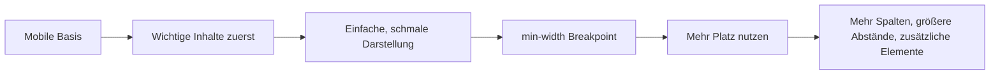

###### Themen

Responsives Webdesign

- Bedeutung von responsivem Design verstehen
- Grundidee von Mobile First kennenlernen
- Inhalte für unterschiedliche Bildschirmgrößen mit einfachen Mitteln anpassen

Layout mit Box-Modell und Flexbox

- Das Box-Modell mit Margin, Border, Padding und Content verstehen
- Einfache Layouts mit Flexbox aufbauen
- Ausrichtung und Anordnung von Elementen mit Flexbox steuern

<br><br><br>
# 📱 Responsives Webdesign

Responsives Webdesign bedeutet, dass sich eine Website an unterschiedliche Bildschirmgrößen und Geräteeigenschaften anpasst. Dieselbe Seite soll also auf einem kleinen Smartphone, auf einem Tablet, auf einem Laptop und auf einem großen Monitor sinnvoll aussehen und gut benutzbar bleiben. Das Ziel ist nicht einfach nur, dass „alles irgendwie kleiner oder größer wird“, sondern dass Inhalt, Abstände, Navigation und Anordnung so reagieren, dass Menschen die Seite bequem lesen und bedienen können ([Responsive design](https://developer.mozilla.org/en-US/docs/Learn/CSS/CSS_layout/Responsive_Design)).

Früher wurden Websites oft für eine feste Breite gebaut, zum Beispiel nur für Desktop-Bildschirme. Das führt heute schnell zu Problemen: Texte werden zu breit, Buttons zu klein, Bilder laufen aus dem Bildschirm heraus oder Menüs sind auf dem Handy kaum nutzbar. Responsives Design löst genau dieses Problem.

Ein ganz wichtiger technischer Grundbaustein ist dabei der sogenannte *Viewport*. Damit der Browser auf Mobilgeräten die Seite korrekt skaliert, gehört in den HTML-`<head>` normalerweise dieses Meta-Tag: ([Using the viewport meta tag](https://developer.mozilla.org/en-US/docs/Web/HTML/Viewport_meta_tag))

```html
<meta name="viewport" content="width=device-width, initial-scale=1.0">
```

Ohne dieses Tag tut sich der mobile Browser oft so, als wäre die Seite für einen viel breiteren Desktop-Bildschirm gedacht. Dann wirkt alles winzig.


<br><br><br>
## 📖 Bedeutung von responsivem Design verstehen

Im Kern heißt responsiv: **Das Layout ist flexibel statt starr.**

Eine responsive Website passt typischerweise diese Dinge an:

- die Breite von Bereichen
- die Anordnung von Spalten
- die Größe und Skalierung von Bildern
- die Schriftgrößen und Abstände
- die Navigation
- die Menge an gleichzeitig sichtbarem Inhalt

Stell dir eine Nachrichtenseite vor. Auf einem großen Bildschirm können vielleicht drei Spalten nebeneinander stehen: links Navigation, in der Mitte Artikel, rechts Zusatzinfos. Auf einem Smartphone wäre das unpraktisch. Dort zeigt man oft alles untereinander: zuerst den wichtigsten Inhalt, dann weitere Bereiche. Genau das ist responsives Denken.

Ein wichtiger Punkt dabei: **Responsiv bedeutet nicht automatisch „identisch auf allen Geräten“**. Es bedeutet eher: *gleichwertig nutzbar auf allen Geräten*. Die Darstellung darf sich ändern, solange die Nutzung sinnvoll bleibt.

Eine einfache Gegenüberstellung macht den Unterschied klar:

| Ansatz | Verhalten |
|---|---|
| Feste Website | Hat oft eine starre Breite, z. B. 1200px |
| Responsives Design | Reagiert auf verfügbare Breite und passt sich an |
| Desktop-zentriert | Wird am Handy häufig zu klein oder unübersichtlich |
| Nutzerzentriert | Ordnet Inhalte passend zur Gerätegröße neu an |

Ein zentrales Prinzip im responsiven Design ist: **Inhalte haben Vorrang vor Dekoration**. Zuerst muss lesbar und bedienbar sein, was wichtig ist. Erst danach kommen feinere visuelle Details.

Ein paar typische Mittel dafür sind:

- relative Breiten wie `%`
- flexible Einheiten wie `rem`, `vw` oder `clamp()`
- Bilder mit `max-width: 100%`
- Media Queries, um Layouts gezielt bei bestimmten Breiten zu ändern ([Using media queries](https://developer.mozilla.org/en-US/docs/Web/CSS/CSS_media_queries/Using_media_queries))

Ein ganz einfaches Beispiel für ein nicht responsives und ein responsives Bild:

```css
/* schlecht für kleine Geräte */
img {
  width: 900px;
}

/* deutlich besser */
img {
  max-width: 100%;
  height: auto;
}
```

Im zweiten Fall wird das Bild nie breiter als sein Container. Dadurch läuft es nicht aus dem Bildschirm heraus.


<br><br><br>
## 📲 Grundidee von Mobile First kennenlernen

**Mobile First** bedeutet: Du entwirfst und programmierst zuerst für kleine Bildschirme und erweiterst das Layout danach für größere. Diese Denkweise ist heute sehr verbreitet, weil kleine Displays den strengsten Rahmen setzen. Wenn etwas dort klar und benutzbar ist, lässt es sich für größere Geräte oft gut ausbauen ([Responsive design](https://developer.mozilla.org/en-US/docs/Learn/CSS/CSS_layout/Responsive_Design)).

Das Gegenteil wäre, zuerst eine komplexe Desktop-Version zu bauen und später mühsam zu versuchen, alles auf ein Smartphone „zusammenzustauchen“. Das führt oft zu unübersichtlichem CSS und schlechter Benutzerführung.

Bei Mobile First fragst du dich zuerst:

- Was ist der wichtigste Inhalt?
- Was muss sofort sichtbar sein?
- Welche Elemente brauchen wirklich Platz?
- Was kann auf größeren Bildschirmen ergänzt oder anders angeordnet werden?

Die technische Umsetzung passiert meistens so:

1. Du schreibst die Standardregeln für kleine Bildschirme.
2. Danach nutzt du `@media (min-width: ...)`, um das Layout ab einer bestimmten Breite zu erweitern ([Using media queries](https://developer.mozilla.org/en-US/docs/Web/CSS/CSS_media_queries/Using_media_queries)).

Ein typisches Muster sieht so aus:

```css
/* Standard: mobil */
.container {
  display: block;
}

/* ab 768px: Tablet/Desktop */
@media (min-width: 768px) {
  .container {
    display: flex;
    gap: 2rem;
  }
}
```

Der Browser liest hier: „Zuerst einfache mobile Darstellung. Wenn genug Platz da ist, dann nutze eine flexiblere Anordnung.“

Das ist die Grundlogik von Mobile First:



Warum ist Mobile First didaktisch und technisch so sinnvoll?

### Inhalte werden klar priorisiert

Auf kleinen Bildschirmen ist kein Platz für unnötige Dinge. Dadurch zwingt dich Mobile First dazu, sauber zu entscheiden, was wirklich wichtig ist. Das verbessert fast immer die Qualität des Designs.

### CSS bleibt oft sauberer

Wenn du klein beginnst und später ergänzt, schreibst du meistens weniger überschreibende Sonderregeln. Dein CSS wird klarer und besser wartbar.

### Performance profitiert oft

Wer mobile Geräte nutzt, hat nicht immer die beste Verbindung oder das schnellste Gerät. Ein einfacher, schlanker Einstieg ist deshalb oft die bessere Wahl. Das ist auch ein wichtiger Gedanke in der Web-Performance-Kultur von Google und web.dev ([Responsive web design basics](https://web.dev/responsive-web-design-basics/)).

### Mobile First heißt nicht „nur für Smartphones“

Das ist ein häufiges Missverständnis. Mobile First heißt nicht, dass Desktop unwichtig ist. Es heißt nur: Du startest mit der kleinsten sinnvollen Version und baust nach oben aus.


<br><br><br>
## 🧩 Inhalte für unterschiedliche Bildschirmgrößen mit einfachen Mitteln anpassen

Du brauchst für den Einstieg keine komplizierten Frameworks. Viele Anpassungen lassen sich mit wenigen, sehr grundlegenden CSS-Techniken lösen.

### Flüssige Breiten statt starre Pixelwerte

Wenn ein Container immer `1200px` breit ist, passt er auf kleinen Geräten nicht. Oft ist es besser, mit `width: 100%` und `max-width` zu arbeiten.

```css
.wrapper {
  width: 100%;
  max-width: 70rem;
  margin: 0 auto;
  padding: 1rem;
}
```

Das bedeutet:

- Der Bereich darf die ganze verfügbare Breite nutzen.
- Er wird aber nicht unendlich breit.
- Mit `margin: 0 auto` wird er mittig ausgerichtet.

### Bilder flexibel machen

```css
img {
  max-width: 100%;
  height: auto;
}
```

Damit schrumpfen Bilder mit, statt über den Rand hinauszulaufen. Genau dieses Prinzip ist eine der einfachsten und wichtigsten Responsiv-Techniken.

### Abstände und Schrift flexibel denken

Starre Schriftgrößen können auf kleinen oder sehr großen Bildschirmen unharmonisch wirken. Schon mit `rem` statt `px` wird vieles flexibler, weil sich `rem` an der Grundschriftgröße orientiert ([Values and units](https://developer.mozilla.org/en-US/docs/Learn/CSS/Building_blocks/Values_and_units)).

Ein modernes Beispiel ist `clamp()`:

```css
h1 {
  font-size: clamp(1.8rem, 4vw, 3rem);
}
```

Das heißt grob:

- nicht kleiner als `1.8rem`
- nicht größer als `3rem`
- dazwischen darf sich die Größe am Viewport orientieren

### Layouts per Media Query anpassen

Wenn Inhalte auf kleinen Bildschirmen untereinander stehen sollen und auf größeren nebeneinander, kannst du das mit einer Media Query steuern.

```css
.cards {
  display: flex;
  flex-direction: column;
  gap: 1rem;
}

@media (min-width: 48rem) {
  .cards {
    flex-direction: row;
  }
}
```

Hier werden Karten auf Mobilgeräten untereinander angezeigt und ab `48rem` nebeneinander.

### Navigation vereinfachen

Ein horizontales Menü mit vielen Punkten funktioniert auf kleinen Geräten oft schlecht. Dann kannst du z. B. auf schmalen Displays die Elemente untereinander anordnen oder ein kompakteres Menü nutzen.

```css
nav ul {
  display: flex;
  flex-direction: column;
  gap: 0.5rem;
  list-style: none;
  padding: 0;
}

@media (min-width: 50rem) {
  nav ul {
    flex-direction: row;
  }
}
```

### Inhalte umordnen, aber mit Bedacht

Mit CSS kannst du visuell die Reihenfolge verändern. Technisch bleibt aber die ursprüngliche HTML-Reihenfolge wichtig, unter anderem für Screenreader und Tastaturnavigation. Deshalb solltest du wichtige Inhalte schon im HTML in einer sinnvollen Reihenfolge schreiben und CSS nur vorsichtig zur Umordnung nutzen ([order](https://developer.mozilla.org/en-US/docs/Web/CSS/order)).

### Ein vollständiges, einfaches Beispiel

```html
<section class="layout">
  <article class="main">Hauptinhalt</article>
  <aside class="sidebar">Seitenleiste</aside>
</section>
```

```css
.layout {
  display: flex;
  flex-direction: column;
  gap: 1rem;
}

.main,
.sidebar {
  padding: 1rem;
  border: 1px solid #ccc;
}

@media (min-width: 60rem) {
  .layout {
    flex-direction: row;
  }

  .main {
    flex: 2;
  }

  .sidebar {
    flex: 1;
  }
}
```

Auf kleinen Geräten stehen beide Bereiche untereinander. Auf größeren Bildschirmen werden daraus zwei Spalten. Genau so arbeitet man in der Praxis sehr oft: klein starten, dann erweitern.

Ein wichtiger Gedanke zum Schluss dieses Abschnitts: **Passe nicht an Geräteklassen an, sondern an den Inhalt.** Es ist oft besser, einen Breakpoint dort zu setzen, wo das Layout „bricht“, statt starr nach „Smartphone“, „Tablet“ und „Desktop“ zu denken ([Responsive web design basics](https://web.dev/responsive-web-design-basics/)).


<br><br><br>
# 📦 Layout mit Box-Modell und Flexbox

Wenn du Websites gestalten willst, musst du verstehen, wie der Browser Elemente als Kästen behandelt. Fast alles in HTML ist im Layout ein Rechteck. Dieses Grundprinzip nennt man **Box-Modell**. Darauf baut sehr viel CSS-Verständnis auf. Und wenn du mehrere solcher Boxen flexibel nebeneinander oder untereinander anordnen willst, kommt **Flexbox** ins Spiel ([The box model](https://developer.mozilla.org/en-US/docs/Learn/CSS/Building_blocks/The_box_model), [Flexbox](https://developer.mozilla.org/en-US/docs/Learn/CSS/CSS_layout/Flexbox)).

Das Box-Modell erklärt, *wie groß* ein Element ist und *woraus* diese Größe besteht. Flexbox erklärt, *wie mehrere Elemente zueinander angeordnet werden*.


<br><br><br>
## 🧱 Das Box-Modell mit Margin, Border, Padding und Content verstehen

Jedes Element besteht im CSS-Layout im Wesentlichen aus vier Schichten:

1. **Content** – der eigentliche Inhalt
2. **Padding** – Innenabstand
3. **Border** – Rahmen
4. **Margin** – Außenabstand

Du kannst dir das wie verschachtelte Bereiche vorstellen:

```text
Margin
└── Border
    └── Padding
        └── Content
```

Oder in einer Tabelle:

| Bereich | Bedeutung | Typische Frage |
|---|---|---|
| Content | Der eigentliche Inhalt | Wie groß ist Text, Bild oder Inhalt? |
| Padding | Abstand zwischen Inhalt und Rand | Wie viel Luft soll innen sein? |
| Border | Sichtbarer Rahmen | Soll das Element begrenzt werden? |
| Margin | Abstand nach außen | Wie weit soll es von anderen Elementen entfernt sein? |

Schauen wir uns das einzeln an.


<br><br><br>
### 📄 Content

Der Content-Bereich ist das, was das Element inhaltlich ausmacht: Text, Bild, Formularfeld oder andere eingebettete Inhalte. Wenn du `width` und `height` setzt, beziehen sich diese Werte im Standard-Box-Modell zunächst auf den Content-Bereich ([The box model](https://developer.mozilla.org/en-US/docs/Learn/CSS/Building_blocks/The_box_model)).

Beispiel:

```css
.box {
  width: 200px;
  height: 100px;
}
```

Das heißt erst einmal: Der eigentliche Inhalt ist 200px breit und 100px hoch. Padding und Border kommen danach noch dazu.


<br><br><br>
### 🧸 Padding

`padding` ist der Innenabstand zwischen Inhalt und Rahmen. Es sorgt dafür, dass Text oder andere Inhalte nicht direkt am Rand kleben.

```css
.box {
  padding: 20px;
}
```

Wenn eine Box einen farbigen Hintergrund hat, dann reicht dieser Hintergrund in der Regel auch über das Padding. Das ist wichtig zu verstehen: Padding ist „innen“, nicht „außen“.

Typischer Einsatz: Buttons, Karten, Boxen mit Text, Eingabefelder. Fast alles wirkt besser lesbar, wenn genug Padding vorhanden ist.

Beispiel:

```css
button {
  padding: 0.75rem 1.25rem;
}
```

Hier sorgt Padding dafür, dass der Button nicht wie eine enge, gequetschte Textzeile aussieht.


<br><br><br>
### 🖼️ Border

`border` ist der Rahmen um Padding und Content.

```css
.box {
  border: 2px solid black;
}
```

Ein Border kann Breite, Stil und Farbe haben. Zum Beispiel:

- `1px solid #ccc`
- `3px dashed red`
- `4px dotted blue`

Border ist nicht nur Dekoration. Er hilft oft auch beim Debuggen. Wenn du ein Layout nicht verstehst, kannst du testweise Rahmen setzen, um die wirklichen Größen und Abstände sichtbar zu machen.

```css
* {
  outline: 1px solid red;
}
```

Das ist kein klassischer Border, aber ein nützlicher Trick beim Untersuchen von Layouts.


<br><br><br>
### ↔️ Margin

`margin` ist der Außenabstand eines Elements. Er bestimmt, wie viel Abstand zu anderen Elementen außen herum bleibt.

```css
.box {
  margin: 20px;
}
```

Wichtig ist der Unterschied:

- `padding` schafft Abstand **innerhalb** der Box
- `margin` schafft Abstand **außerhalb** der Box

Wenn zwei Absätze untereinander mehr Luft brauchen, gibst du meistens `margin-bottom`. Wenn Text innerhalb einer Karte mehr Luft zum Rand braucht, gibst du `padding`.

Ein klassisches Beispiel:

```css
.card {
  padding: 1rem;
  border: 1px solid #ddd;
  margin-bottom: 1rem;
}
```

Hier hat die Karte innen Luft durch Padding und nach unten Abstand zur nächsten Karte durch Margin.


<br><br><br>
### 🧮 Wie die tatsächliche Größe eines Elements entsteht

Das Standardmodell in CSS ist: Die gesetzte `width` beschreibt nur den Content. Padding und Border werden zusätzlich dazu gerechnet. Das kann überraschend sein ([box-sizing](https://developer.mozilla.org/en-US/docs/Web/CSS/box-sizing)).

Beispiel:

```css
.box {
  width: 200px;
  padding: 20px;
  border: 5px solid black;
}
```

Dann ist die tatsächliche Gesamtbreite nicht 200px, sondern:

- 200px Content
- 40px Padding links + rechts
- 10px Border links + rechts

Also insgesamt **250px**.

Genau deshalb verwenden sehr viele Entwickler diese Regel:

```css
*,
*::before,
*::after {
  box-sizing: border-box;
}
```

Mit `border-box` gilt: `width` und `height` schließen Padding und Border bereits mit ein. Das macht Größenberechnung meistens deutlich angenehmer ([box-sizing](https://developer.mozilla.org/en-US/docs/Web/CSS/box-sizing)).

Dann bedeutet:

```css
.box {
  width: 200px;
  padding: 20px;
  border: 5px solid black;
  box-sizing: border-box;
}
```

Jetzt bleibt die Gesamtbreite **200px**. Der Content-Bereich wird entsprechend etwas kleiner.

Das ist in der Praxis ein riesiger Vorteil, gerade bei responsiven Layouts.


<br><br><br>
## ↔️ Einfache Layouts mit Flexbox aufbauen

**Flexbox** ist ein CSS-Layout-Modell, mit dem du Elemente in einer Dimension sehr gut anordnen kannst: entweder in einer Zeile oder in einer Spalte. Es ist ideal für Navigationen, Kartenreihen, Toolbars, Button-Gruppen, einfache Seitenbereiche und viele responsive Layouts ([Flexbox](https://developer.mozilla.org/en-US/docs/Learn/CSS/CSS_layout/Flexbox)).

Der Grundgedanke ist einfach:

- Ein Element wird zum **Flex-Container**
- Seine direkten Kinder werden zu **Flex-Items**

Beispiel:

```html
<div class="container">
  <div>Box 1</div>
  <div>Box 2</div>
  <div>Box 3</div>
</div>
```

```css
.container {
  display: flex;
}
```

Sobald `display: flex` gesetzt ist, stehen die Kinder standardmäßig in einer Reihe nebeneinander.

### Hauptachse und Querachse

Flexbox arbeitet mit zwei Achsen:

- **Hauptachse** (*main axis*)
- **Querachse** (*cross axis*)

Wenn `flex-direction: row` aktiv ist, dann:

- Hauptachse = horizontal
- Querachse = vertikal

Wenn `flex-direction: column` aktiv ist, dann:

- Hauptachse = vertikal
- Querachse = horizontal

Das ist wichtig, weil sich viele Eigenschaften auf diese Achsen beziehen.

### Ein einfaches Layout mit Flexbox

```css
.container {
  display: flex;
  gap: 1rem;
}
```

Damit stehen die Kinder nebeneinander und haben einen Abstand von `1rem`.

Ein realistisches Beispiel für zwei Spalten:

```html
<div class="page">
  <main class="content">Inhalt</main>
  <aside class="sidebar">Sidebar</aside>
</div>
```

```css
.page {
  display: flex;
  gap: 1.5rem;
}

.content {
  flex: 2;
}

.sidebar {
  flex: 1;
}
```

`flex: 2` und `flex: 1` bedeuten hier vereinfacht: Der Inhalt bekommt doppelt so viel flexiblen Platz wie die Sidebar.

### Flexbox und Responsivität

Flexbox ist besonders stark, wenn sich ein Layout bei wenig Platz umbrechen soll. Dafür gibt es `flex-wrap`.

```css
.cards {
  display: flex;
  flex-wrap: wrap;
  gap: 1rem;
}

.card {
  flex: 1 1 250px;
}
```

Das heißt grob:

- `flex-grow: 1`
- `flex-shrink: 1`
- `flex-basis: 250px`

Die Karten versuchen also ungefähr 250px breit zu sein, dürfen aber wachsen und schrumpfen. Wenn nicht genug Platz da ist, brechen sie in die nächste Zeile um. Das ist für responsive Kartenlayouts extrem nützlich.

Ein einfaches Beispiel für Karten:

```html
<section class="cards">
  <article class="card">Karte 1</article>
  <article class="card">Karte 2</article>
  <article class="card">Karte 3</article>
</section>
```

```css
.cards {
  display: flex;
  flex-wrap: wrap;
  gap: 1rem;
}

.card {
  flex: 1 1 18rem;
  padding: 1rem;
  border: 1px solid #ccc;
}
```

Je nach verfügbarer Breite stehen hier ein, zwei oder mehrere Karten nebeneinander. Ohne komplizierte Berechnungen.


<br><br><br>
## 🎯 Ausrichtung und Anordnung von Elementen mit Flexbox steuern

Flexbox wird erst richtig mächtig, wenn du gezielt steuerst, **wo** Elemente sitzen und **wie** sie verteilt werden.

Die wichtigsten Eigenschaften sind diese:

| Eigenschaft | Wirkung |
|---|---|
| `flex-direction` | Richtung der Items: Zeile oder Spalte |
| `justify-content` | Verteilung entlang der Hauptachse |
| `align-items` | Ausrichtung entlang der Querachse |
| `align-self` | Einzelne Ausrichtung eines Items |
| `flex-wrap` | Umbruch in neue Zeilen/Spalten |
| `gap` | Abstand zwischen Items |
| `order` | Visuelle Reihenfolge eines Items |
| `flex` | Wachstums-, Schrumpf- und Basisverhalten |

Schauen wir uns das verständlich an.


<br><br><br>
### 🧭 `flex-direction`: In welche Richtung läuft das Layout?

```css
.container {
  display: flex;
  flex-direction: row;
}
```

`row` bedeutet: Die Elemente stehen horizontal nebeneinander.

```css
.container {
  display: flex;
  flex-direction: column;
}
```

`column` bedeutet: Die Elemente stehen vertikal untereinander.

Das ist oft der erste Hebel für responsive Layouts: mobil `column`, später `row`.

```css
.layout {
  display: flex;
  flex-direction: column;
}

@media (min-width: 60rem) {
  .layout {
    flex-direction: row;
  }
}
```


<br><br><br>
### ↔️ `justify-content`: Wie werden Elemente entlang der Hauptachse verteilt?

Wenn die Hauptachse horizontal ist, verteilt `justify-content` die Elemente horizontal. Wenn die Hauptachse vertikal ist, dann vertikal.

Beispiel:

```css
.container {
  display: flex;
  justify-content: center;
}
```

Die Elemente werden in der Mitte der Hauptachse platziert.

Wichtige Werte:

- `flex-start` – am Anfang
- `center` – in der Mitte
- `flex-end` – am Ende
- `space-between` – erster ganz links, letzter ganz rechts, dazwischen gleichmäßig verteilt
- `space-around` – um jedes Item herum Platz
- `space-evenly` – überall gleichmäßiger Abstand

Beispiel für eine Navigationsleiste:

```css
nav ul {
  display: flex;
  justify-content: space-between;
}
```


<br><br><br>
### ↕️ `align-items`: Wie werden Elemente auf der Querachse ausgerichtet?

Wenn die Hauptachse horizontal ist, dann ist die Querachse vertikal. `align-items` regelt dann also die vertikale Ausrichtung.

```css
.container {
  display: flex;
  align-items: center;
}
```

Damit werden die Kinder in der Querachse zentriert.

Häufige Werte:

- `stretch` – Standard, Elemente werden gestreckt
- `flex-start` – oben bzw. am Anfang der Querachse
- `center` – mittig
- `flex-end` – unten bzw. am Ende
- `baseline` – an Textgrundlinien ausgerichtet

Beispiel mit Buttons unterschiedlicher Höhe:

```css
.actions {
  display: flex;
  align-items: center;
  gap: 0.75rem;
}
```


<br><br><br>
### 🧩 `gap`: Saubere Abstände ohne Margin-Gefrickel

Früher wurden Abstände zwischen Flex-Items oft mit komplizierten Margin-Regeln gebaut. Heute ist `gap` die sauberere Lösung.

```css
.container {
  display: flex;
  gap: 1rem;
}
```

Damit bekommen alle direkten Flex-Items gleichmäßige Abstände. Das ist einfacher lesbar und meist robuster.

Gerade beim Lernen ist `gap` Gold wert, weil du Abstände klar dort definierst, wo die Gruppe gesteuert wird: im Container.


<br><br><br>
### 📏 `flex`: Wie stark darf ein Element wachsen oder schrumpfen?

Die Kurzschreibweise `flex` kombiniert drei Dinge:

```css
.item {
  flex: 1 1 200px;
}
```

Das bedeutet:

- `1` → darf wachsen
- `1` → darf schrumpfen
- `200px` → Start- oder Basisbreite

Wenn alle Items `flex: 1` bekommen, teilen sie sich den Platz gleichmäßig.

```css
.container {
  display: flex;
  gap: 1rem;
}

.item {
  flex: 1;
}
```

Dann werden alle Kinder gleich breit, sofern der verfügbare Platz das zulässt.

Wenn eins doppelt so viel Raum bekommen soll:

```css
.item-large {
  flex: 2;
}

.item-small {
  flex: 1;
}
```

Dann erhält das erste ungefähr doppelt so viel flexiblen Platz.


<br><br><br>
### 🔁 `flex-wrap`: Was passiert, wenn der Platz nicht reicht?

Standardmäßig versucht Flexbox, alles in einer Zeile oder Spalte zu halten. Das kann auf kleinen Bildschirmen zu eng werden. Mit `flex-wrap: wrap` dürfen Elemente umbrechen.

```css
.container {
  display: flex;
  flex-wrap: wrap;
  gap: 1rem;
}
```

Das ist besonders nützlich für:

- Karten
- Tag-Listen
- Button-Gruppen
- kleine Galerien

So verhinderst du, dass alles gequetscht wird.


<br><br><br>
### 🪄 `order`: Reihenfolge verändern

Mit `order` kannst du die visuelle Reihenfolge von Flex-Items ändern.

```css
.first {
  order: 2;
}

.second {
  order: 1;
}
```

Dann wird `.second` vor `.first` angezeigt.

Aber hier ist Vorsicht wichtig: Die HTML-Reihenfolge bleibt dieselbe. Screenreader, Tab-Reihenfolge und andere logische Abläufe orientieren sich oft weiter an der Dokumentstruktur. Deshalb sollte `order` eher sparsam und bewusst eingesetzt werden ([order](https://developer.mozilla.org/en-US/docs/Web/CSS/order)).


<br><br><br>
### 🏗️ Ein komplettes Beispiel: einfache responsive Leiste

```html
<header class="header">
  <div class="logo">Logo</div>
  <nav class="menu">
    <a href="#">Start</a>
    <a href="#">Kurse</a>
    <a href="#">Kontakt</a>
  </nav>
</header>
```

```css
.header {
  display: flex;
  flex-direction: column;
  gap: 1rem;
  padding: 1rem;
  border-bottom: 1px solid #ddd;
}

.menu {
  display: flex;
  flex-direction: column;
  gap: 0.5rem;
}

@media (min-width: 48rem) {
  .header {
    flex-direction: row;
    justify-content: space-between;
    align-items: center;
  }

  .menu {
    flex-direction: row;
    gap: 1rem;
  }
}
```

Was hier passiert:

- Auf kleinen Bildschirmen stehen Logo und Menü untereinander.
- Die Links im Menü stehen ebenfalls untereinander.
- Auf größeren Bildschirmen liegen Header-Inhalte nebeneinander.
- Das Menü wird horizontal.

Dieses Beispiel zeigt sehr schön, wie responsives Design, Box-Modell-Denken und Flexbox zusammenarbeiten.


<br><br><br>
## 🧠 Warum Box-Modell und Flexbox zusammengehören

Beim echten Layouten brauchst du fast immer beides gleichzeitig.

Das Box-Modell beantwortet Fragen wie:

- Warum ist dieses Element größer als gedacht?
- Woher kommt dieser Abstand?
- Ist das Padding zu groß?
- Addiert sich der Border zur Breite?

Flexbox beantwortet Fragen wie:

- Warum stehen diese Elemente nicht nebeneinander?
- Wie bekomme ich sie in die Mitte?
- Warum bricht das Layout nicht um?
- Wie verteile ich den Platz sinnvoll?

Wenn du diese beiden Themen sauber verstehst, kannst du schon sehr viele typische Web-Layouts bauen:

- horizontale und vertikale Navigationen
- Kartenlayouts
- zweispaltige Inhaltsbereiche
- Kopf- und Fußbereiche
- responsive Inhaltsgruppen
- einfache Dashboards

Genau deshalb gehören Box-Modell und Flexbox zu den wichtigsten Core-Tech-Fundamentals im Web.
