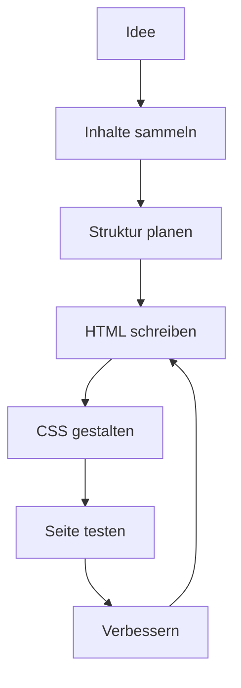
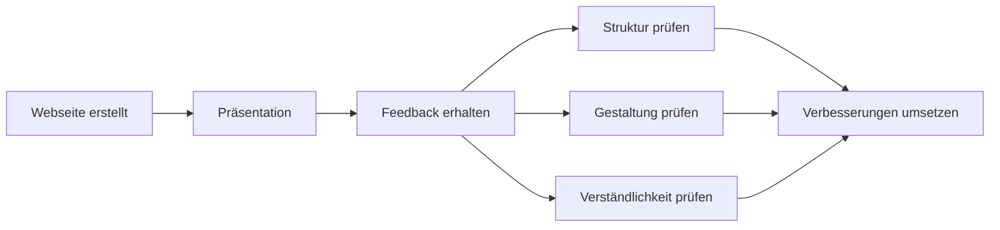

###### Themen

Projektumsetzung

- Planung und Entwicklung einer einfachen eigenen Webseite
- HTML- und CSS-Grundlagen in einem Mini-Projekt anwenden
- Inhalte strukturieren und gestalten

Präsentation und Reflexion

- Die eigene Projektarbeit kurz vorstellen
- Die eigene Umsetzung reflektieren
- Feedback zu Struktur, Gestaltung und Verständlichkeit austauschen

<br><br><br>

# 🚀 Projektumsetzung

Wenn du eine **einfache eigene Webseite** planst und umsetzt, geht es nicht nur darum, „irgendetwas mit HTML und CSS zu bauen“. Eigentlich lernst du dabei gleich mehrere sehr wichtige Grundlagen der Informatik und Webentwicklung auf einmal:

- **ein Projekt sinnvoll zu planen**
- **Inhalte logisch zu strukturieren**
- **mit HTML eine saubere Grundstruktur aufzubauen**
- **mit CSS das Aussehen gezielt zu gestalten**
- **Entscheidungen bewusst zu treffen und später erklären zu können**

Eine kleine Webseite ist deshalb ein sehr gutes Mini-Projekt, weil du an einem überschaubaren Beispiel den kompletten Ablauf eines technischen Projekts kennenlernst: von der Idee bis zur fertigen Präsentation.

Oft ist genau das der wichtigste Lernschritt: nicht nur Code zu schreiben, sondern zu verstehen, **warum du etwas auf eine bestimmte Weise aufbaust**.


<br><br><br>

## 🧭 Planung und Entwicklung einer einfachen eigenen Webseite

Bevor du HTML-Tags schreibst oder Farben auswählst, brauchst du einen **klaren Plan**. Gerade Anfänger machen oft den Fehler, sofort loszucoden. Das fühlt sich produktiv an, führt aber häufig dazu, dass die Seite später unübersichtlich wird oder man alles noch einmal umbauen muss.

Eine gute Planung bedeutet nicht, dass du stundenlang Theorie machen musst. Es reicht schon, wenn du dir drei einfache Fragen beantwortest:

1. **Worum geht es auf meiner Webseite?**
2. **Für wen ist die Webseite gedacht?**
3. **Welche Inhalte soll man sofort sehen und verstehen?**

Wenn du diese Fragen beantworten kannst, wird der Rest viel einfacher.

### 🧠 Was bei der Planung wichtig ist

Eine einfache Webseite braucht normalerweise einen klaren Kern. Zum Beispiel:

- eine persönliche Vorstellungsseite
- eine Hobby-Seite
- eine kleine Portfolio-Seite
- eine Infoseite über ein Thema
- eine Projektseite über ein selbst erstelltes Produkt oder Lernprojekt

Wichtig ist, dass du nicht zu viel auf einmal willst. Ein Mini-Projekt soll **überschaubar** sein. Das ist fachlich sinnvoll, weil man beim Lernen besonders gut vorankommt, wenn man sich auf wenige Kernkompetenzen konzentriert und diese sauber umsetzt.

Ein typischer Plan für eine kleine Webseite sieht so aus:

| Schritt | Frage | Ergebnis |
|---|---|---|
| Thema festlegen | Was ist das Thema der Seite? | Klare Projektidee |
| Ziel definieren | Was sollen Besucher verstehen oder tun? | Zweck der Seite |
| Inhalte sammeln | Welche Texte, Bilder, Infos brauche ich? | Rohmaterial |
| Struktur planen | Welche Bereiche braucht die Seite? | Seitenaufbau |
| Design grob festlegen | Welche Farben, Schriftgrößen, Abstände passen? | Visuelle Richtung |
| Umsetzen | HTML + CSS schreiben | Funktionierende Seite |
| Prüfen | Ist alles verständlich, lesbar und logisch? | Verbesserte Version |

### 🗂️ Typische Grundstruktur einer einfachen Webseite

Eine einfache Webseite besteht oft aus wenigen, klaren Bereichen. Genau das ist gut, weil es Besucherinnen und Besuchern hilft, sich schnell zurechtzufinden.

Zum Beispiel:

- **Kopfbereich** mit Titel oder Name
- **Einführung** mit kurzem Überblick
- **Hauptinhalt** mit Informationen
- **optional ein Bild oder eine kleine Galerie**
- **Kontakt oder Abschlussbereich**
- **Fußbereich** mit Zusatzinfos

In HTML gibt es dafür sogar semantische Elemente wie `<header>`, `<main>`, `<section>` und `<footer>`, die genau dazu dienen, die Struktur einer Seite verständlich zu beschreiben ([HTML elements reference](https://developer.mozilla.org/en-US/docs/Web/HTML/Element)).

Das ist wichtig, weil eine Webseite nicht nur für Menschen visuell gut aussehen soll, sondern auch für Browser, Suchmaschinen und Hilfstechnologien klar aufgebaut sein muss. Eine logisch strukturierte Seite ist also nicht nur „ordentlich“, sondern auch technisch sinnvoll.

### 🧱 Vom Plan zur Umsetzung

Die Entwicklung einer Webseite ist meist kein gerader Weg, sondern eher ein kleiner Kreislauf:



Das ist ein wichtiger Lernpunkt: **Webentwicklung ist iterativ**. Du baust etwas, schaust es dir an, entdeckst Probleme und verbesserst es. Genau so arbeiten auch Profis.

Wenn du z. B. merkst, dass deine Überschrift zu lang ist, der Textblock zu breit wirkt oder ein Bild nicht gut platziert ist, dann ist das kein Fehler im negativen Sinn, sondern ein normaler Teil des Entwicklungsprozesses.


<br><br><br>

## 🧩 HTML- und CSS-Grundlagen in einem Mini-Projekt anwenden

HTML und CSS haben unterschiedliche Aufgaben. Das sauber zu verstehen, ist eine der wichtigsten Grundlagen.

**HTML** ist für die **Struktur und Bedeutung** des Inhalts zuständig.  
**CSS** ist für das **Aussehen und Layout** zuständig.

MDN beschreibt HTML als Auszeichnungssprache zur Strukturierung von Inhalten und CSS als Sprache zur Beschreibung der Darstellung von Dokumenten ([HTML: HyperText Markup Language](https://developer.mozilla.org/en-US/docs/Web/HTML), [CSS: Cascading Style Sheets](https://developer.mozilla.org/en-US/docs/Web/CSS)).

Viele Anfänger vermischen diese beiden Ebenen gedanklich. Dabei wird Lernen deutlich einfacher, wenn du sie klar trennst:

- HTML beantwortet: **Was ist das?**
- CSS beantwortet: **Wie sieht das aus?**

### 🏗️ HTML-Grundlagen verständlich erklärt

HTML besteht aus Elementen, die den Inhalt gliedern. Typische Grundelemente sind:

- Überschriften wie `<h1>`, `<h2>`
- Absätze mit `<p>`
- Bilder mit ``
- Links mit `<a>`
- Listen mit `<ul>` oder `<ol>`
- Bereiche wie `<header>`, `<main>`, `<section>`, `<footer>`

Ein einfaches HTML-Grundgerüst könnte so aussehen:

```html
<!DOCTYPE html>
<html lang="de">
<head>
  <meta charset="UTF-8">
  <meta name="viewport" content="width=device-width, initial-scale=1.0">
  <title>Meine Webseite</title>
  <link rel="stylesheet" href="style.css">
</head>
<body>
  <header>
    <h1>Willkommen auf meiner Webseite</h1>
    <p>Hier stelle ich mein Projekt vor.</p>
  </header>

  <main>
    <section>
      <h2>Über mich</h2>
      <p>Ich interessiere mich für Webentwicklung und Gestaltung.</p>
    </section>

    <section>
      <h2>Mein Projekt</h2>
      <p>In diesem Mini-Projekt habe ich eine einfache Webseite erstellt.</p>
    </section>
  </main>

  <footer>
    <p>© 2026 Meine Webseite</p>
  </footer>
</body>
</html>
```

Hier sieht man gut den Unterschied zwischen Inhalt und Gestaltung: Das HTML legt fest, **welche Inhalte es gibt und wie sie gegliedert sind**, aber noch nicht, wie alles konkret aussieht.

### 🎨 CSS-Grundlagen verständlich erklärt

CSS gestaltet die HTML-Struktur. Du kannst damit z. B. festlegen:

- Farben
- Schriftarten
- Abstände
- Breiten
- Rahmen
- Hintergründe
- Anordnung von Elementen

Ein einfaches Beispiel:

```css
body {
  font-family: Arial, sans-serif;
  background-color: #f5f7fb;
  color: #222;
  margin: 0;
  padding: 0;
}

header, main, footer {
  max-width: 800px;
  margin: 0 auto;
  padding: 20px;
}

h1 {
  color: #1e3a8a;
}

section {
  background-color: white;
  padding: 16px;
  margin-bottom: 20px;
  border-radius: 10px;
}
```

Damit bekommt die Seite sofort ein angenehmeres Erscheinungsbild. Das zeigt sehr gut, wie stark CSS die Wirkung einer Webseite verändert, obwohl der Inhalt gleich bleibt.

### 🔍 Warum ein Mini-Projekt so hilfreich ist

Wenn du HTML und CSS isoliert lernst, also nur einzelne Tags oder einzelne Eigenschaften, bleibt vieles abstrakt. In einem Mini-Projekt erkennst du dagegen direkt den Sinn:

- Eine Überschrift ist nicht nur ein Tag, sondern hilft bei der Orientierung.
- Ein Absatz ist nicht nur Text, sondern transportiert Informationen.
- Ein Abstand ist nicht nur „dekorativ“, sondern verbessert die Lesbarkeit.
- Eine Farbe ist nicht nur hübsch, sondern beeinflusst die Wahrnehmung.
- Eine Navigationsstruktur entscheidet darüber, wie verständlich deine Seite ist.

Das ist didaktisch sehr wertvoll: Du lernst Technik nicht losgelöst, sondern im Zusammenhang.

### 🧭 Welche HTML- und CSS-Grundlagen du dabei wirklich anwendest

In einem einfachen Projekt nutzt du meist genau die Grundlagen, die am Anfang wirklich wichtig sind:

| Bereich | Typische Inhalte |
|---|---|
| HTML-Struktur | `html`, `head`, `body`, `title`, `meta` |
| Inhaltselemente | `h1` bis `h3`, `p`, `img`, `a`, `ul`, `li` |
| Semantische Elemente | `header`, `main`, `section`, `footer`, ggf. `nav` |
| CSS-Basics | `color`, `background-color`, `font-family`, `margin`, `padding` |
| Box-Modell | Abstand innen und außen, Breiten, Rahmen |
| einfache Layouts | Zentrierung, Spalten, Karten, Flexbox-Grundidee |

Gerade das **CSS-Box-Modell** ist ein zentrales Grundprinzip. Jedes Element besteht vereinfacht aus Inhalt, Innenabstand, Rahmen und Außenabstand. Das ist eine Kernidee der Seitengestaltung ([The box model](https://developer.mozilla.org/en-US/docs/Learn/CSS/Building_blocks/The_box_model)).

Wenn du verstehst, warum ein Element zu eng, zu breit oder zu dicht an einem anderen sitzt, dann denkst du bereits wie jemand, der Weblayouts bewusst gestaltet.

### 🧪 Typische Anfängerfehler – und warum sie passieren

Am Anfang kommen oft dieselben Probleme vor:

- zu viele verschiedene Schriftgrößen
- zu viele Farben
- fehlende Abstände
- ungeordnete Überschriftenstruktur
- Textwände ohne Absätze
- Bilder ohne sinnvolle Größe
- unruhiges Layout

Diese Fehler sind normal. Meist entstehen sie, weil man Gestaltung zunächst aus dem Bauch heraus macht. Mit wachsender Erfahrung lernst du, dass gutes Webdesign vor allem auf **Klarheit, Wiederholung und Ordnung** beruht.

Eine gute Webseite braucht nicht viele Effekte. Sie braucht vor allem:

- eine klare Struktur
- eine gut lesbare Schrift
- sinnvolle Abstände
- visuelle Konsistenz

### ♿ Verständlichkeit und Zugänglichkeit von Anfang an mitdenken

Wenn du Inhalte strukturierst, spielt auch **Barrierefreiheit** eine Rolle. Das bedeutet: Die Seite soll möglichst für viele Menschen nutzbar und verständlich sein. Dazu gehören zum Beispiel sinnvolle Überschriften, Alternativtexte für Bilder und ausreichend Kontrast zwischen Text und Hintergrund. Die Web Content Accessibility Guidelines betonen genau solche Prinzipien ([Web Content Accessibility Guidelines (WCAG) 2 Overview](https://www.w3.org/WAI/standards-guidelines/wcag/)).

Das ist kein „Extra-Thema für später“, sondern gehört direkt zu gutem Grundhandwerk. Eine Seite ist erst dann wirklich gut gestaltet, wenn sie nicht nur schön aussieht, sondern auch verständlich und lesbar ist.

Zum Beispiel:

- dunkler Text auf hellem Hintergrund ist oft besser lesbar
- Überschriften sollen logisch gestuft sein
- Bilder sollten inhaltlich passen und den Text unterstützen
- Links sollten erkennbar sein
- Textblöcke sollten nicht zu breit sein

Wenn du solche Punkte beachtest, wird deine Seite automatisch professioneller.


<br><br><br>

## 🏛️ Inhalte strukturieren und gestalten

Hier steckt ein ganz zentraler Gedanke drin: **Struktur** und **Gestaltung** sind nicht dasselbe, aber sie arbeiten zusammen.

- **Struktur** bedeutet: Welche Inhalte gibt es, in welcher Reihenfolge, in welchen Bereichen?
- **Gestaltung** bedeutet: Wie sehen diese Inhalte aus, sodass sie gut wirken und leicht verstanden werden?

Viele Anfänger konzentrieren sich zuerst auf die Gestaltung, weil Farben und Formen direkt sichtbar sind. Aber eigentlich ist die Struktur wichtiger. Wenn die Struktur schlecht ist, kann selbst schönes Design die Seite nicht retten.

### 🧱 Was „Inhalte strukturieren“ konkret bedeutet

Inhalte zu strukturieren heißt, Informationen in eine logische Ordnung zu bringen. Das ist ähnlich wie bei einem guten Vortrag oder einem guten Text.

Eine sinnvolle Struktur beantwortet unbewusst diese Fragen:

- Was ist das Hauptthema?
- Was ist besonders wichtig?
- Was kommt zuerst?
- Was gehört zusammen?
- Was ist eher Zusatzinformation?

Wenn du eine Webseite anschaust und sofort verstehst, worum es geht, dann ist die Struktur meist gut.

Ein klassisches Muster für eine kleine Projektseite wäre:

1. **Titel / Einstieg**
2. **kurze Erklärung des Themas**
3. **Hauptinhalte**
4. **visuelle Ergänzungen**
5. **Abschluss oder Kontakt**

Das klingt simpel, ist aber genau die Art von Ordnung, die Webseiten verständlich macht.

### 🏷️ Die Rolle von Überschriften

Überschriften sind nicht nur größerer Text. Sie sind Orientierungspunkte. Sie zeigen den Besucherinnen und Besuchern:

- wo sie sich gerade befinden
- was jetzt kommt
- welche Themen zusammengehören

Darum ist eine saubere Überschriftenhierarchie wichtig. Es sollte in der Regel eine Hauptüberschrift `<h1>` geben, darunter passende Unterüberschriften `<h2>` und bei Bedarf weitere Unterteilungen mit `<h3>`. MDN erklärt diese Gliederung als wichtigen Teil der inhaltlichen Struktur einer Seite ([Heading elements](https://developer.mozilla.org/en-US/docs/Web/HTML/Element/Heading_Elements)).

Wenn du Überschriften nur nach Optik auswählst, entsteht schnell Chaos. Besser ist: Erst die inhaltliche Ebene festlegen, danach das Design mit CSS anpassen.

### 📝 Texte gut aufbereiten

Gerade bei kleinen Webseiten wird oft unterschätzt, wie wichtig gute Texte sind. Selbst eine technisch korrekte Seite wirkt schwach, wenn die Texte ungeordnet oder schwer verständlich sind.

Achte deshalb auf:

- kurze, klare Absätze
- verständliche Formulierungen
- eine sinnvolle Reihenfolge
- keine unnötig komplizierten Sätze
- klare Aussagen statt Füllwörter

Für das Lernen ist das besonders spannend: Wenn du einen Inhalt auf deiner Webseite gut erklären kannst, zeigt das, dass du ihn wirklich verstanden hast. Gute Struktur ist also auch ein Zeichen von echtem Verständnis.

### 🖼️ Bilder und visuelle Elemente sinnvoll einsetzen

Bilder können eine Webseite deutlich verbessern, aber nur dann, wenn sie eine Funktion haben. Ein Bild sollte zum Inhalt passen, nicht bloß eine Lücke füllen.

Ein Bild kann zum Beispiel:

- etwas erklären
- Aufmerksamkeit lenken
- eine Stimmung erzeugen
- eine Information ergänzen
- die Seite persönlicher machen

Wichtig ist, dass Bilder nicht die Struktur ersetzen. Ein Bild ist Ergänzung, nicht Ersatz für klare Inhalte.

Bei HTML gehört außerdem zu einem Bild oft ein `alt`-Attribut. Dieses beschreibt den Bildinhalt für den Fall, dass das Bild nicht geladen wird oder mit Hilfstechnologien erfasst werden muss ([``: The Image Embed element](https://developer.mozilla.org/en-US/docs/Web/HTML/Element/img)).

### 🎨 Was „gestalten“ wirklich bedeutet

Gestaltung ist nicht einfach „hübsch machen“. Gute Gestaltung lenkt den Blick, schafft Ordnung und unterstützt das Verstehen.

Wichtige Gestaltungsfaktoren sind:

| Gestaltungsfaktor | Wirkung |
|---|---|
| Farbe | lenkt Aufmerksamkeit, erzeugt Stimmung |
| Schriftgröße | zeigt Wichtigkeit |
| Abstand | schafft Luft und Ordnung |
| Ausrichtung | sorgt für Ruhe und Klarheit |
| Kontrast | verbessert Lesbarkeit |
| Wiederholung | macht das Design konsistent |
| Weißraum | verhindert Überladung |

Gerade **Abstände** sind für Anfänger oft ein Aha-Moment. Wenn Elemente ausreichend Platz haben, wirkt die Seite sofort ruhiger, strukturierter und professioneller.

### 🎯 Struktur und Gestaltung zusammen denken

Die beste Wirkung entsteht, wenn Struktur und Gestaltung einander unterstützen.

Ein Beispiel:

- Die wichtigste Aussage steht oben.
- Sie bekommt eine klare Hauptüberschrift.
- Darunter steht ein kurzer Einleitungstext.
- Zwischen den Abschnitten ist genug Abstand.
- Die Farben sind zurückhaltend und einheitlich.
- Wichtige Elemente heben sich sichtbar ab.

Dann entsteht nicht nur eine „funktionierende“ Seite, sondern eine Seite, die auch **verständlich** ist. Genau darum geht es in Core Tech Fundamentals: Technik nicht nur korrekt, sondern sinnvoll einsetzen.


<br><br><br>

# 🗣️ Präsentation und Reflexion

Die eigentliche Projektarbeit ist nur ein Teil des Lernprozesses. Der zweite wichtige Teil ist, dass du deine Arbeit **vorstellst**, **erklärst** und **reflektierst**.

Warum ist das so wichtig?

Weil man ein Projekt erst dann wirklich durchdringt, wenn man sagen kann:

- was man gemacht hat,
- warum man es so gemacht hat,
- was gut funktioniert hat,
- was schwierig war,
- und was man beim nächsten Mal besser lösen würde.

Das ist keine Nebensache, sondern ein sehr zentraler Teil guten Lernens. In technischen Berufen reicht es nicht, etwas irgendwie gebaut zu haben. Man muss auch Entscheidungen erklären und Ergebnisse einschätzen können.


<br><br><br>

## 🎤 Die eigene Projektarbeit kurz vorstellen

Eine kurze Projektvorstellung bedeutet nicht, jede einzelne Zeile Code zu erklären. Es geht darum, die wichtigsten Aspekte verständlich zu präsentieren.

Eine gute kurze Vorstellung beantwortet meist diese Fragen:

- **Was ist das Ziel deiner Webseite?**
- **Welche Inhalte zeigt sie?**
- **Wie ist sie aufgebaut?**
- **Welche HTML- und CSS-Grundlagen hast du verwendet?**
- **Was war dir bei der Gestaltung wichtig?**

### 🧭 Eine sinnvolle Reihenfolge für die Vorstellung

Wenn du deine Webseite erklärst, hilft eine klare Reihenfolge. Zum Beispiel:

1. **Thema und Ziel**
2. **Aufbau der Seite**
3. **wichtige technische Elemente**
4. **Gestaltungsentscheidungen**
5. **besondere Herausforderungen**

Das wirkt deutlich verständlicher, als einfach irgendwo anzufangen.

### 🏗️ Was du fachlich zeigen kannst

Bei einer Mini-Webseite musst du keine komplexe Technik demonstrieren. Schon einfache, sauber erklärte Entscheidungen sind wertvoll.

Zum Beispiel könntest du sagen:

- Du hast semantische HTML-Elemente genutzt, um die Seite logisch zu gliedern.
- Du hast mit CSS Farben und Abstände gewählt, damit die Inhalte gut lesbar sind.
- Du hast die Inhalte in Abschnitte unterteilt, damit die Orientierung leichter fällt.
- Du hast darauf geachtet, dass Überschriften die Inhalte sinnvoll strukturieren.

Das zeigt, dass du nicht nur „etwas gebaut“, sondern bewusst gestaltet hast.

### 👀 Warum die Vorstellung so wichtig ist

Wenn du ein eigenes Projekt präsentierst, trainierst du gleichzeitig mehrere Fähigkeiten:

- technisches Verständnis
- Kommunikationsfähigkeit
- Fachsprache
- Selbstbeobachtung
- Argumentation

Du lernst also nicht nur Webentwicklung, sondern auch, technische Arbeit nachvollziehbar zu machen. Das ist in Schule, Studium, Ausbildung und Beruf extrem wertvoll.


<br><br><br>

## 🤔 Die eigene Umsetzung reflektieren

Reflexion bedeutet, dass du deine Arbeit im Nachhinein bewusst betrachtest. Nicht mit dem Ziel, dich schlecht zu machen, sondern um daraus zu lernen.

Viele denken bei Reflexion sofort an „Fehler finden“. In Wirklichkeit geht es um mehr:

- Was hat gut funktioniert?
- Warum hat es gut funktioniert?
- Wo gab es Probleme?
- Was habe ich dabei gelernt?
- Was würde ich beim nächsten Projekt anders machen?

Genau dieser Schritt macht aus einer bloßen Tätigkeit einen echten Lernprozess.

### 🛠️ Reflexion in der Webentwicklung

Bei deiner Webseite kannst du zum Beispiel auf mehrere Ebenen schauen:

| Bereich | Mögliche Reflexion |
|---|---|
| Planung | War mein ursprünglicher Plan klar genug? |
| Struktur | Ist der Aufbau logisch und leicht verständlich? |
| HTML | Habe ich die Inhalte sinnvoll ausgezeichnet? |
| CSS | Unterstützt das Design die Lesbarkeit? |
| Inhalt | Ist der Text klar und passend? |
| Prozess | Was war leicht, was war schwierig? |

So eine Reflexion hilft dir, nicht nur das Ergebnis, sondern auch deinen Weg dorthin zu verstehen.

### 🧠 Warum Reflexion fachlich so stark ist

Gerade in technischen Fächern ist Reflexion ein Zeichen von echtem Verständnis. Wer reflektieren kann, erkennt Zusammenhänge:

- Warum war meine Seite unübersichtlich?
- Warum wirkte das Layout zuerst chaotisch?
- Warum wurde es besser, nachdem ich Abstände angepasst habe?
- Warum hilft eine klare Überschriftenstruktur?

Dann lernst du nicht nur einzelne Lösungen, sondern Prinzipien. Und Prinzipien lassen sich auf neue Projekte übertragen.

### 🌱 Fehler als Lernmaterial betrachten

Ein sehr wichtiger Punkt ist die Haltung gegenüber Fehlern. In Projekten sind Fehler normal:

- ein Element sitzt an der falschen Stelle
- Farben passen nicht zusammen
- Text ist zu lang
- ein Bild ist zu groß
- Abstände wirken unruhig

Das alles ist kein Zeichen von Scheitern. Es ist Material zum Lernen. Gute Entwicklerinnen und Entwickler arbeiten ständig mit Überarbeitung. Die erste Version ist selten die beste Version.

Wenn du sagen kannst:  
„Am Anfang war meine Seite zu voll, deshalb habe ich Inhalte reduziert und mit mehr Abstand gearbeitet“,  
dann ist das eine starke Reflexion. Du zeigst damit Entwicklung.


<br><br><br>

## 💬 Feedback zu Struktur, Gestaltung und Verständlichkeit austauschen

Feedback ist einer der wertvollsten Teile eines Projekts. Wenn andere deine Webseite ansehen, erkennen sie oft Dinge, die du selbst nicht mehr bemerkst. Das liegt daran, dass du deine eigene Seite schon sehr gut kennst, während andere sie zum ersten Mal erleben.

Genau deshalb ist Feedback besonders wichtig bei:

- **Struktur**
- **Gestaltung**
- **Verständlichkeit**

### 🧭 Feedback zur Struktur

Bei der Struktur geht es darum, ob der Aufbau logisch ist.

Typische Fragen dabei sind:

- Versteht man sofort, worum es auf der Seite geht?
- Ist die Reihenfolge der Inhalte sinnvoll?
- Passen die Abschnitte gut zusammen?
- Findet man wichtige Informationen schnell?

Wenn hier Rückmeldungen kommen wie „Ich wusste erst nicht, wo ich anfangen soll“ oder „Die wichtigsten Informationen kamen erst sehr spät“, dann betrifft das die Informationsarchitektur deiner Seite.

### 🎨 Feedback zur Gestaltung

Gestaltungsfeedback bezieht sich auf die visuelle Wirkung.

Dabei kann es um Folgendes gehen:

- Sind die Farben angenehm und passend?
- Ist die Schrift gut lesbar?
- Gibt es genug Abstand?
- Wirkt die Seite ruhig oder überladen?
- Werden wichtige Inhalte visuell deutlich?

Wichtig ist: Gestaltung ist nicht nur Geschmackssache. Natürlich gibt es subjektive Eindrücke, aber viele Punkte lassen sich sachlich beurteilen, z. B. Lesbarkeit, Kontrast oder Konsistenz. Ausreichender Kontrast ist ein zentraler Faktor für gute Wahrnehmbarkeit ([Understanding Success Criterion 1.4.3: Contrast (Minimum)](https://www.w3.org/WAI/WCAG22/Understanding/contrast-minimum.html)).

### 🧾 Feedback zur Verständlichkeit

Verständlichkeit betrifft die Frage, ob deine Inhalte klar und nachvollziehbar sind.

Zum Beispiel:

- Sind die Texte leicht zu verstehen?
- Sind Begriffe klar erklärt?
- Ist die Sprache passend für die Zielgruppe?
- Unterstützt das Layout das Verstehen?
- Sind Überschriften und Inhalte stimmig?

Gerade dieser Punkt zeigt, dass Webentwicklung nicht nur Technik ist. Eine gute Webseite vermittelt Informationen so, dass Menschen sie schnell erfassen können.

### 🔄 Wie guter Feedback-Austausch aussieht

Gutes Feedback ist nicht bloß „gefällt mir“ oder „gefällt mir nicht“. Hilfreiches Feedback ist konkret.

Statt:

- „Das Design ist komisch.“

besser:

- „Die Schrift ist etwas klein, dadurch wirkt der Text schwer lesbar.“
- „Die Abschnitte sind inhaltlich gut, aber mehr Abstand würde die Seite ruhiger machen.“
- „Die Hauptüberschrift ist klar, aber der zweite Abschnitt könnte einen präziseren Titel bekommen.“

So ein Austausch ist wertvoll, weil er direkt an Struktur, Gestaltung und Wirkung anknüpft.

### 🤝 Warum Feedback für richtiges Lernen so wichtig ist

Beim Lernen entsteht schnell ein blinder Fleck: Man weiß selbst, was man gemeint hat, und merkt deshalb nicht mehr, ob es für andere auch klar ist. Feedback durchbricht genau dieses Problem.

In einem Projekt über Web-Grundlagen hilft Feedback dir dabei,

- dein technisches Denken zu schärfen,
- Nutzerperspektiven einzunehmen,
- deine Entscheidungen zu verbessern,
- und die Qualität deiner Arbeit realistischer einzuschätzen.

Das ist ein sehr wichtiger Schritt vom „Ich habe etwas gebaut“ hin zu „Ich habe etwas sinnvoll und verständlich umgesetzt“.

### 🔁 Typischer Feedback- und Verbesserungsprozess



Dieser Ablauf zeigt sehr schön, dass Präsentation und Reflexion keine Zusatzaufgabe sind, sondern direkt zur Qualitätsverbesserung gehören.


<br><br><br>

## 🧠 Warum diese Punkte im Kontext von Core Tech Fundamentals so wichtig sind

Im Kern geht es hier um grundlegende technische Kompetenzen, die weit über eine einzelne Webseite hinausgehen.

Wenn du eine einfache Webseite planst, umsetzt, präsentierst und reflektierst, lernst du gleichzeitig:

- **Probleme in Teilaufgaben zu zerlegen**
- **Struktur vor Oberfläche zu denken**
- **Werkzeuge bewusst anzuwenden**
- **technische Entscheidungen zu begründen**
- **Rückmeldungen aufzunehmen und zu verbessern**

Das sind absolute Basisfähigkeiten in der Informatik und in technischen Projekten allgemein.

Eine Mini-Webseite wirkt auf den ersten Blick klein. In Wahrheit trainierst du dabei aber sehr viele zentrale Denkweisen:

- systematisches Arbeiten
- saubere Strukturierung
- verständliche Darstellung
- iterative Verbesserung
- bewusste Selbstreflexion

Und genau das ist gutes Lernen im Technikbereich: nicht nur Inhalte auswendig kennen, sondern **durch Anwendung verstehen**, **durch Rückmeldung verbessern** und **durch Reflexion dauerhaft verankern**.