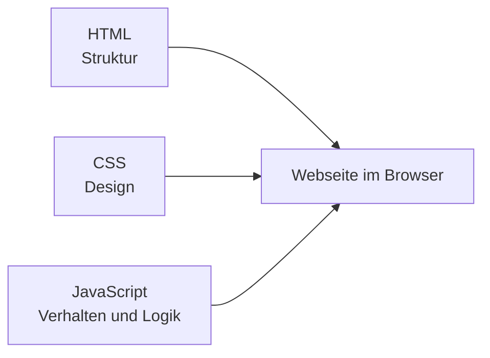
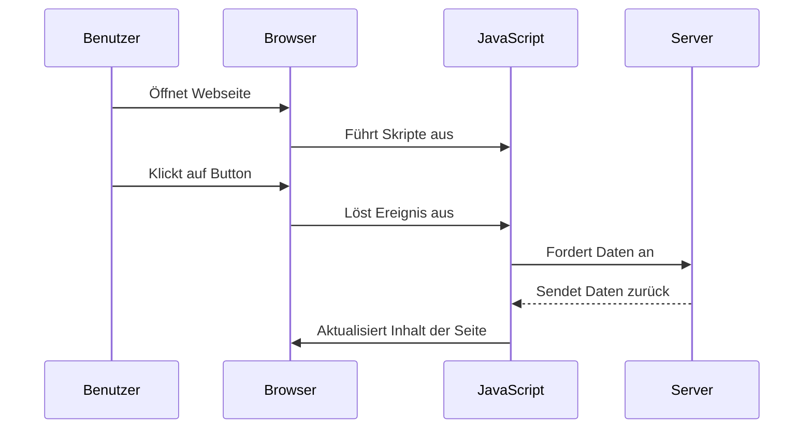

###### Themen

JavaScript Überblick

- Bedeutung und typische Einsatzgebiete von JavaScript
- Rolle von JavaScript im Browser und in Webseiten

Vorbereitung der Entwicklungsumgebung

- Überblick über Browser und DevTools
- Installation und grundlegende Bedienung eines Code-Editors

Erstes JavaScript-Programm

- Einbindung von JavaScript in HTML
- Ausführen und Testen erster einfacher Skripte
- Ausgabe einfacher Inhalte in der Konsole

<br><br><br>
# 🟨 JavaScript im Überblick

JavaScript ist eine Programmiersprache, die vor allem dafür bekannt ist, Webseiten **lebendig und interaktiv** zu machen. Wenn du auf einer Webseite auf einen Button klickst, ein Menü aufklappst, ein Formular prüfst oder Inhalte nachlädst, ohne die ganze Seite neu zu laden, dann ist sehr oft JavaScript im Spiel. Genau dafür wurde es im Web ursprünglich besonders wichtig: Es ergänzt HTML und CSS um **Verhalten und Logik** ([What is JavaScript?](https://developer.mozilla.org/en-US/docs/Learn_web_development/Core/Scripting/What_is_JavaScript)).

HTML beschreibt dabei den **Inhalt** einer Seite, CSS das **Aussehen**, und JavaScript das **Verhalten**. Diese Aufteilung ist ein ganz grundlegendes Prinzip moderner Webentwicklung. Ohne JavaScript kann eine Webseite zwar Inhalte anzeigen, aber viele Dinge wären statisch, unflexibel oder umständlich.

JavaScript ist heute außerdem viel größer als nur „die Sprache für Browser“. Man kann damit auch Server-Anwendungen, Tools, Automatisierungen und Build-Prozesse schreiben. Trotzdem ist für den Einstieg das Wichtigste: **Im Browser steuert JavaScript, wie sich eine Webseite verhält.**


<br><br><br>
## 🌍 Bedeutung und typische Einsatzgebiete von JavaScript

JavaScript ist im Web so wichtig, weil es genau die Lücke schließt, die HTML und CSS offenlassen.

HTML kann zum Beispiel sagen: „Hier ist ein Button.“
CSS kann sagen: „Der Button soll blau sein.“
JavaScript kann sagen: „Wenn jemand auf den Button klickt, passiert etwas.“

Das klingt simpel, ist aber der Kern fast aller modernen Webseiten.

Typische Einsatzgebiete sind zum Beispiel:

| Einsatzgebiet | Was JavaScript dort macht |
|---|---|
| Interaktive Benutzeroberflächen | Klicks, Menüs, Tabs, Modals, Slider, Akkordeons |
| Formulare | Eingaben prüfen, Hinweise anzeigen, Daten vorbereiten |
| Dynamische Inhalte | Inhalte nachladen, ändern oder ausblenden |
| Kommunikation mit Servern | Daten per API senden oder empfangen |
| Web-Apps | Komplexe Anwendungen wie Mail-Dienste, Dashboards, Karten, Editoren |
| Spiele und Animationen | Bewegung, Logik, Reaktionen auf Eingaben |
| Browser-APIs nutzen | Zugriff auf Standort, Zwischenablage, Speicher, Audio, Kamera – je nach Browser-Freigabe ([Web APIs](https://developer.mozilla.org/en-US/docs/Learn_web_development/Extensions/Client-side_APIs/Introduction)) |

Ein besonders wichtiger Punkt ist: JavaScript arbeitet **ereignisgesteuert**. Das bedeutet, es wartet oft auf ein Ereignis, zum Beispiel:

- ein Klick
- eine Tasteneingabe
- das Laden einer Seite
- das Absenden eines Formulars

Danach reagiert das Skript. Diese Denkweise ist im Web extrem wichtig, weil Benutzer ständig mit der Seite interagieren.

Außerdem kann JavaScript Inhalte im Browser **direkt verändern**, ohne dass die gesamte Seite neu geladen werden muss. Technisch passiert das oft über das sogenannte **DOM**, also die Dokumentstruktur der HTML-Seite. JavaScript kann dort Elemente finden, Texte ändern, Klassen hinzufügen, Styles beeinflussen oder neue Inhalte einfügen ([Introduction to the DOM](https://developer.mozilla.org/en-US/docs/Web/API/Document_Object_Model/Introduction)).

Ein kleines Beispiel:

```html
<button id="meinButton">Klick mich</button>
<p id="text">Noch ist nichts passiert.</p>

<script>
  const button = document.getElementById("meinButton");
  const text = document.getElementById("text");

  button.addEventListener("click", function () {
    text.textContent = "Jetzt wurde der Button geklickt!";
  });
</script>
```

Hier sieht man schon sehr gut die Aufgabe von JavaScript: Es verbindet Benutzeraktionen mit einer Reaktion auf der Seite.

Ein häufiger Anfängerfehler ist übrigens, JavaScript mit Java zu verwechseln. Die Namen klingen ähnlich, aber es sind **verschiedene Sprachen mit unterschiedlichen Einsatzzwecken** ([JavaScript Guide](https://developer.mozilla.org/en-US/docs/Web/JavaScript/Guide)).


<br><br><br>
## 🧩 Rolle von JavaScript im Browser und in Webseiten

Im Browser übernimmt JavaScript die Rolle des **aktiven Teils** einer Webseite. Man kann sich das so vorstellen:

- **HTML** baut das Grundgerüst.
- **CSS** gestaltet die Oberfläche.
- **JavaScript** steuert Verhalten, Reaktionen und Logik.

Das Zusammenspiel sieht so aus:



Der Browser lädt also eine Webseite, liest das HTML, wendet CSS darauf an und führt anschließend JavaScript aus. Dieses JavaScript kann dann:

- Elemente auf der Seite finden
- Inhalte ändern
- auf Klicks reagieren
- Daten aus dem Internet nachladen
- Fehler in der Konsole ausgeben
- mit Browser-Funktionen arbeiten

Wichtig ist dabei: JavaScript läuft im Browser nicht „irgendwo daneben“, sondern in einer **Ausführungsumgebung**, die vom Browser bereitgestellt wird. Deshalb hat JavaScript im Browser Zugriff auf Dinge wie `document`, `window`, `console` oder `fetch`. Diese Objekte sind Teil der Browser-Umgebung und stellen Funktionen bereit, mit denen du Webseiten steuern kannst ([Window](https://developer.mozilla.org/en-US/docs/Web/API/Window), [Document](https://developer.mozilla.org/en-US/docs/Web/API/Document)).

Ein typischer Ablauf in einer Webseite könnte so aussehen:



Das zeigt gut, warum JavaScript so zentral ist: Es ist die Schicht, die Benutzer, Browser und manchmal auch Server miteinander verbindet.

Wenn man sagt, „JavaScript läuft im Browser“, meint man meist genau das: Der Browser führt den Code aus und JavaScript verändert dann die aktuelle Seite oder reagiert auf Eingaben. Deshalb ist JavaScript in Webseiten nicht einfach nur „zusätzlicher Code“, sondern oft der Teil, der aus einer statischen Seite eine **Anwendung** macht.


<br><br><br>
# 🛠️ Vorbereitung der Entwicklungsumgebung

Bevor du JavaScript schreibst, brauchst du eine einfache, aber saubere Entwicklungsumgebung. Die gute Nachricht ist: Für den Einstieg ist das sehr unkompliziert. Du brauchst im Grunde nur zwei Dinge:

1. einen **Browser**
2. einen **Code-Editor**

Mehr ist am Anfang nicht nötig.

Der Browser ist deine **Laufzeitumgebung** zum Testen. Der Code-Editor ist dein **Werkzeug zum Schreiben** des Codes. Zusammen reichen diese beiden Dinge aus, um direkt loszulegen.


<br><br><br>
## 🌐 Überblick über Browser und Entwicklerwerkzeuge

Jeder moderne Browser kann JavaScript ausführen. Dazu gehören unter anderem:

- Google Chrome
- Mozilla Firefox
- Microsoft Edge
- Safari

Alle diese Browser besitzen integrierte **Entwicklerwerkzeuge**, oft kurz **DevTools** genannt. Mit diesen Werkzeugen kannst du den HTML-Aufbau anschauen, CSS untersuchen, JavaScript testen, Fehler finden und Netzwerkanfragen beobachten. Solche DevTools sind ein zentrales Werkzeug in der Webentwicklung ([Open Chrome DevTools](https://developer.chrome.com/docs/devtools/open), [Firefox Developer Tools](https://firefox-source-docs.mozilla.org/devtools-user/)).

Eine grobe Orientierung:

| Browser | DevTools vorhanden | Typische Stärke |
|---|---|---|
| Chrome | Ja | Sehr verbreitet, viele gute Debugging-Werkzeuge |
| Firefox | Ja | Gute Werkzeuge für CSS und Webstandards |
| Edge | Ja | Ähnlich zu Chrome, da gleiche Engine-Basis |
| Safari | Ja | Wichtig, wenn du Verhalten auf Apple-Geräten prüfen willst |

Für den Einstieg sind Chrome oder Firefox oft besonders angenehm, weil viele Tutorials und Dokumentationen damit arbeiten.

Die wichtigsten Bereiche der DevTools sind:

| Bereich | Wofür er da ist |
|---|---|
| **Elements / Inspektor** | HTML-Struktur und CSS der aktuellen Seite ansehen |
| **Console** | JavaScript-Ausgaben sehen und Code direkt testen |
| **Sources / Debugger** | Dateien ansehen, Breakpoints setzen, Code schrittweise prüfen |
| **Network** | Laden von Dateien und Anfragen an Server beobachten |
| **Application / Storage** | Local Storage, Cookies und andere gespeicherte Daten prüfen |

Besonders wichtig für den Start ist die **Konsole**. Dort kannst du:

- mit `console.log()` Ausgaben anzeigen
- Fehler sehen
- kurze JavaScript-Befehle direkt eingeben und testen

Die DevTools öffnest du je nach System und Browser meist mit:

- `F12`
- oder `Strg + Shift + I`
- oder per Rechtsklick → **Untersuchen**

Wenn du neu anfängst, ist die Konsole oft der schnellste Weg, um zu verstehen, ob dein Skript wirklich läuft.

Ein Beispiel: Wenn du in der Konsole eingibst

```js
console.log("Hallo aus der Konsole");
```

dann zeigt der Browser diesen Text direkt an. Das ist eine einfache, aber sehr wichtige Rückmeldung.

Ein großer Vorteil der DevTools ist, dass du damit nicht „blind programmierst“. Du siehst direkt:

- ob dein JavaScript geladen wurde
- ob ein Fehler aufgetreten ist
- welche Zeile betroffen ist
- welche Werte Variablen gerade haben

Gerade beim Lernen macht das einen enormen Unterschied, weil du Schritt für Schritt nachvollziehen kannst, was passiert.


<br><br><br>
## 💻 Installation und grundlegende Bedienung eines Code-Editors

Ein Code-Editor ist ein Programm, in dem du deinen Quellcode schreibst. Im Prinzip könntest du auch einen einfachen Texteditor verwenden, aber ein richtiger Code-Editor ist viel praktischer, weil er Syntax hervorhebt, Dateien übersichtlich anzeigt, Zeilen nummeriert und oft direkt beim Schreiben hilft.

Ein sehr verbreiteter Editor ist **Visual Studio Code**. Er ist kostenlos, weit verbreitet und für den Einstieg sehr geeignet ([Visual Studio Code Setup](https://code.visualstudio.com/docs/setup/setup-overview)).

Andere bekannte Editoren sind zum Beispiel:

| Editor | Besonderheit |
|---|---|
| Visual Studio Code | Sehr beliebt, viele Erweiterungen, guter Einstieg |
| Sublime Text | Schnell und leichtgewichtig |
| WebStorm | Sehr mächtig, aber kostenpflichtig |
| Notepad++ | Einfach, vor allem unter Windows beliebt |

Für Anfänger ist Visual Studio Code oft die beste Wahl, weil:

- die Oberfläche übersichtlich ist
- viele Sprachen unterstützt werden
- HTML, CSS und JavaScript gut erkannt werden
- es viele Erweiterungen gibt, wenn du später mehr brauchst

### 🔧 Grundidee der Installation

Die Installation ist meist sehr einfach:

1. Editor von der offiziellen Seite herunterladen.
2. Installationsprogramm starten.
3. Standardoptionen übernehmen.
4. Editor öffnen.

Bei VS Code kannst du danach einen Ordner für dein Projekt anlegen, zum Beispiel:

```text
mein-erstes-js-projekt
```

Darin legst du später deine Dateien an, etwa:

```text
mein-erstes-js-projekt/
├─ index.html
└─ script.js
```

Diese Trennung ist wichtig, weil du so sauber arbeitest: HTML in eine Datei, JavaScript in eine andere Datei.

### 🧭 Grundlegende Bedienung eines Editors

Die wichtigsten Dinge am Anfang sind sehr überschaubar:

| Funktion | Bedeutung |
|---|---|
| Datei erstellen | Neue HTML- oder JS-Datei anlegen |
| Datei speichern | Änderungen sichern |
| Ordner öffnen | Mehrere zusammengehörige Dateien als Projekt verwalten |
| Syntaxhervorhebung | Code wird farblich lesbar dargestellt |
| Tabs | Zwischen mehreren offenen Dateien wechseln |
| Dateiansicht | Projektstruktur links im Editor sehen |

Ein typischer Ablauf sieht so aus:

1. Du öffnest deinen Projektordner im Editor.
2. Du erstellst `index.html`.
3. Du erstellst `script.js`.
4. Du schreibst Code.
5. Du speicherst die Dateien.
6. Du öffnest die HTML-Datei im Browser.
7. Du testest und prüfst die Konsole.

Damit hast du schon eine vollständige Mini-Entwicklungsumgebung.

Für den Anfang brauchst du übrigens noch keine komplizierten Erweiterungen, kein Terminal-Wissen und kein Build-System. Das kommt später. Am Anfang ist es viel wichtiger, dass du wirklich verstehst, **wie HTML-Datei, JavaScript-Datei und Browser zusammenarbeiten**.


<br><br><br>
# 🚀 Erstes JavaScript-Programm

Jetzt kommt der praktische Teil: Wie bindest du JavaScript in eine Webseite ein, wie führst du es aus und wie siehst du, ob es funktioniert?

Das erste Ziel ist nicht, sofort „große Programme“ zu schreiben. Das erste Ziel ist, den technischen Ablauf zu verstehen:

- Wo steht der Code?
- Wann wird er geladen?
- Wo sieht man die Ausgabe?
- Wie erkennt man Fehler?

Wenn du diese Grundlagen sauber verstehst, wird später fast alles leichter.


<br><br><br>
## 🔌 Einbindung von JavaScript in HTML

JavaScript wird in HTML über das `<script>`-Element eingebunden. Dafür gibt es grundsätzlich mehrere Möglichkeiten. Das `<script>`-Element ist der offizielle HTML-Mechanismus, um Skripte in ein Dokument einzubetten oder externe Skriptdateien einzubinden ([The Script element](https://developer.mozilla.org/en-US/docs/Web/HTML/Element/script)).

### 🧱 Möglichkeit 1: JavaScript direkt in HTML schreiben

```html
<!DOCTYPE html>
<html lang="de">
<head>
  <meta charset="UTF-8">
  <title>Mein erstes JavaScript</title>
</head>
<body>
  <h1>Hallo Welt</h1>

  <script>
    console.log("Hallo aus JavaScript");
  </script>
</body>
</html>
```

Hier steht der JavaScript-Code direkt im HTML-Dokument. Das ist für ganz kleine Beispiele okay, aber bei echten Projekten wird der Code schnell unübersichtlich.

### 📄 Möglichkeit 2: JavaScript aus externer Datei laden

Das ist die übliche und sauberere Variante:

```html
<!DOCTYPE html>
<html lang="de">
<head>
  <meta charset="UTF-8">
  <title>Mein erstes JavaScript</title>
</head>
<body>
  <h1>Hallo Welt</h1>

  <script src="script.js"></script>
</body>
</html>
```

Und in der Datei `script.js` steht dann:

```js
console.log("Hallo aus der externen Datei");
```

Diese Trennung ist wichtig, weil sie den Code besser strukturiert. HTML bleibt für die Struktur zuständig, JavaScript für das Verhalten.

### ⏱️ Warum die Position des `<script>`-Tags wichtig ist

Der Browser liest HTML von oben nach unten. Wenn dein Skript auf ein HTML-Element zugreifen möchte, muss dieses Element meistens **bereits geladen** sein. Deshalb setzt man `<script>` oft kurz vor das schließende `</body>`-Tag, damit der restliche Inhalt der Seite vorher aufgebaut wird ([JavaScript basics](https://developer.mozilla.org/en-US/docs/Learn_web_development/Core/Scripting/JavaScript_first_steps)).

Beispiel:

```html
<body>
  <button id="knopf">Klick mich</button>

  <script src="script.js"></script>
</body>
```

So ist der Button bereits vorhanden, wenn `script.js` ausgeführt wird.

### ⚡ Alternative: `defer`

Eine moderne und sehr gute Variante ist dieses Muster:

```html
<head>
  <meta charset="UTF-8">
  <title>Mein erstes JavaScript</title>
  <script src="script.js" defer></script>
</head>
```

Das Attribut `defer` sorgt dafür, dass das Skript zwar früh geladen, aber erst nach dem Parsen des HTML-Dokuments ausgeführt wird ([The Script element](https://developer.mozilla.org/en-US/docs/Web/HTML/Element/script)). Für viele normale Seiten ist das sehr praktisch.

Für den Einstieg kannst du dir merken:

- **einfach und klassisch:** `<script>` am Ende von `<body>`
- **modern und sauber:** `<script src="script.js" defer>` im `<head>`

### 🚫 Was Anfänger oft falsch machen

Ein paar typische Fehler bei der Einbindung:

- Dateiname stimmt nicht genau, z. B. `Script.js` statt `script.js`
- Datei liegt im falschen Ordner
- Änderungen wurden nicht gespeichert
- JavaScript greift auf HTML-Elemente zu, bevor sie geladen sind
- falsche Anführungszeichen oder fehlende Klammern im Code

Gerade deshalb ist die Browser-Konsole so wichtig: Dort siehst du Fehler meistens sofort.


<br><br><br>
## ▶️ Ausführen und Testen erster einfacher Skripte

Um dein erstes JavaScript-Programm auszuführen, brauchst du nur eine HTML-Datei und eventuell eine externe JS-Datei.

### 📁 Beispielprojekt

`index.html`

```html
<!DOCTYPE html>
<html lang="de">
<head>
  <meta charset="UTF-8">
  <title>Erstes Skript</title>
</head>
<body>
  <h1>Mein erstes JavaScript-Programm</h1>

  <script src="script.js"></script>
</body>
</html>
```

`script.js`

```js
console.log("Das Skript wurde erfolgreich geladen.");
```

### 🧪 So testest du das Skript

1. Speichere beide Dateien.
2. Öffne `index.html` im Browser.
3. Öffne die DevTools.
4. Gehe in die **Konsole**.
5. Dort solltest du die Ausgabe sehen.

Wenn der Text in der Konsole erscheint, weißt du:

- die HTML-Datei wurde geladen
- die JavaScript-Datei wurde gefunden
- der Code wurde ausgeführt

Das ist ein ganz wichtiger erster technischer Beweis, dass deine Umgebung funktioniert.

### 👀 Erste sichtbare Wirkung auf der Seite

Du kannst JavaScript auch direkt etwas im Dokument ändern lassen:

```html
<!DOCTYPE html>
<html lang="de">
<head>
  <meta charset="UTF-8">
  <title>Erstes Skript</title>
</head>
<body>
  <h1 id="ueberschrift">Hallo</h1>

  <script>
    document.getElementById("ueberschrift").textContent = "Hallo mit JavaScript";
  </script>
</body>
</html>
```

Hier findet JavaScript die Überschrift über ihre ID und ersetzt den Text. So siehst du unmittelbar, dass JavaScript den Seiteninhalt beeinflussen kann ([textContent](https://developer.mozilla.org/en-US/docs/Web/API/Node/textContent)).

### 🛎️ Noch ein sehr einfaches Beispiel mit Meldung

```html
<script>
  alert("Willkommen auf der Seite!");
</script>
```

Das öffnet ein Meldungsfenster. `alert()` ist zwar technisch nützlich, wird im modernen Alltag aber eher sparsam verwendet, weil es die Seite unterbricht. Für Lernzwecke zeigt es aber gut: **JavaScript wird wirklich ausgeführt** ([Window: alert() method](https://developer.mozilla.org/en-US/docs/Web/API/Window/alert)).

### 🐞 Wenn nichts passiert

Wenn du dein Skript startest und keine Ausgabe siehst, prüfe zuerst:

- Ist die Datei gespeichert?
- Ist der Dateiname korrekt?
- Wird die richtige HTML-Datei geöffnet?
- Gibt es in der Konsole eine Fehlermeldung?
- Ist der JavaScript-Code syntaktisch korrekt?

Gerade am Anfang sind kleine Tippfehler völlig normal. Entscheidend ist, dass du lernst, sie systematisch zu finden.


<br><br><br>
## 🖥️ Ausgabe einfacher Inhalte in der Konsole

Die Konsole ist eines der wichtigsten Werkzeuge beim Lernen von JavaScript. Sie ist so etwas wie dein direktes Fenster in die Ausführung des Programms. Mit ihr kannst du prüfen, ob ein Skript läuft, welchen Wert eine Variable hat oder ob eine bestimmte Stelle im Code erreicht wurde.

Die bekannteste Methode ist:

```js
console.log("Hallo Konsole");
```

`console.log()` schreibt eine Nachricht in die Konsole des Browsers ([console: log() static method](https://developer.mozilla.org/en-US/docs/Web/API/console/log_static)).

Das wirkt simpel, ist aber sehr mächtig. Du kannst damit nicht nur Texte ausgeben, sondern auch Zahlen, Variablen, Arrays, Objekte und vieles mehr.

### 🔤 Einfache Beispiele

```js
console.log("Hallo Welt");
console.log(42);
console.log(true);
```

Hier werden ein Text, eine Zahl und ein Wahrheitswert ausgegeben.

### 📦 Variablen ausgeben

```js
let name = "Lena";
let alter = 25;

console.log(name);
console.log(alter);
```

So siehst du direkt, welche Werte in deinen Variablen gespeichert sind.

### 🧠 Text und Wert kombinieren

```js
let punktzahl = 100;
console.log("Die Punktzahl ist:", punktzahl);
```

Diese Form ist besonders praktisch beim Debugging, weil du sofort erkennst, was der Wert bedeutet.

### ⚠️ Weitere nützliche Konsolenmethoden

Neben `console.log()` gibt es noch andere hilfreiche Methoden:

```js
console.warn("Das ist eine Warnung.");
console.error("Das ist ein Fehler.");
console.info("Das ist eine Information.");
```

Diese Varianten helfen, Ausgaben besser zu unterscheiden ([console](https://developer.mozilla.org/en-US/docs/Web/API/Console_API)).

### 📋 Strukturiert ausgeben

Wenn du später mit Tabellen oder Objekten arbeitest, kann auch das nützlich sein:

```js
console.table([
  { name: "Anna", alter: 22 },
  { name: "Ben", alter: 28 }
]);
```

Dann zeigt die Konsole die Daten tabellarisch an. Das ist sehr angenehm, wenn du Daten übersichtlich prüfen willst.

### 🪜 Warum die Konsole beim Lernen so wichtig ist

Die Konsole ist für Anfänger deshalb so wertvoll, weil sie dir sofort Rückmeldung gibt. Du musst nicht erst komplizierte Oberflächen bauen, um zu sehen, ob etwas funktioniert. Stattdessen kannst du direkt beobachten:

- Wird der Code ausgeführt?
- Welche Werte entstehen?
- Welche Bedingung ist wahr oder falsch?
- Wo tritt ein Fehler auf?

In der Praxis läuft das oft so:

```js
let zahl = 10;
console.log("Startwert:", zahl);

zahl = zahl + 5;
console.log("Neuer Wert:", zahl);
```

Du siehst Schritt für Schritt, wie sich der Programmzustand verändert. Genau das macht die Konsole zu einem der besten Lernwerkzeuge in JavaScript.

### 🔍 Konsole direkt im Browser testen

Du musst nicht immer eine Datei schreiben, um JavaScript auszuprobieren. In den DevTools kannst du direkt in der Konsole Befehle eingeben:

```js
2 + 2
```

Der Browser gibt dann das Ergebnis aus.

Oder:

```js
document.title
```

Dann siehst du den Titel der aktuellen Seite. So kannst du sehr schnell kleine Dinge ausprobieren und verstehen, wie JavaScript mit der Seite verbunden ist.

### 🧭 Ein sinnvoller Lernablauf für die ersten Schritte

Für die ersten Programme ist diese Reihenfolge besonders sinnvoll:

1. Code im Editor schreiben
2. Datei speichern
3. Seite im Browser laden
4. Konsole öffnen
5. Ausgabe prüfen
6. Fehler lesen und verstehen
7. Code anpassen und erneut testen

Das klingt banal, ist aber ein extrem wertvoller Ablauf. Gutes Lernen in der Programmierung besteht nicht nur darin, Code zu schreiben, sondern auch darin, **Rückmeldungen richtig zu lesen und zu deuten**. Genau dabei helfen dir Browser und Konsole von Anfang an.
