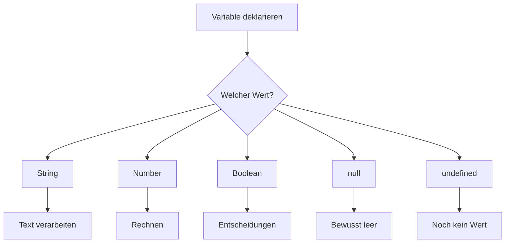
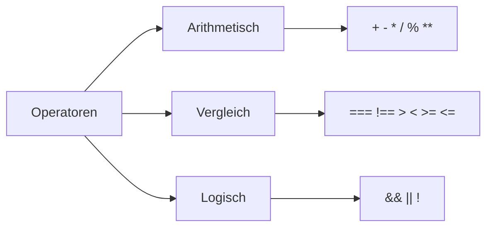
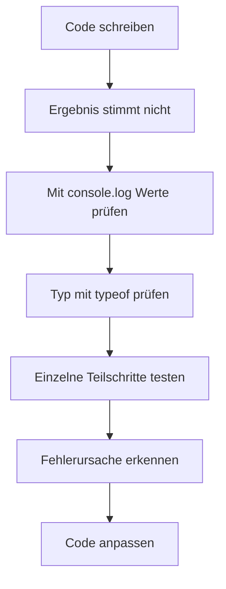

###### Themen

Variablen und Datentypen

- Definition und Verwendung von let und const
- Überblick über String, Number, Boolean, null und undefined
- Einfache Arbeit mit Strings

Operatoren und Konsolenarbeit

- Grundlagen arithmetischer, Vergleichs- und logischer Operatoren
- Arbeiten mit der Browser-Konsole zur Ausgabe und einfachen Fehlersuche

<br><br><br>
# 🧱 Variablen und Datentypen

Wenn du programmierst, musst du Werte irgendwo **speichern**, damit du später wieder damit arbeiten kannst. Genau dafür gibt es **Variablen**. Eine Variable ist im Grunde ein benannter Speicherplatz. In JavaScript legst du Variablen heute in der Regel mit `let` oder `const` an. Beide erzeugen **block-sichtbare** Variablen, also Variablen, die nur innerhalb des Blocks gültig sind, in dem sie definiert wurden, zum Beispiel innerhalb einer Funktion oder eines `if`-Blocks ([let](https://developer.mozilla.org/de/docs/Web/JavaScript/Reference/Statements/let), [const](https://developer.mozilla.org/de/docs/Web/JavaScript/Reference/Statements/const)).

Werte in Variablen haben außerdem immer einen **Datentyp**. Der Datentyp bestimmt, wie JavaScript den Wert behandelt. Eine Zahl wird anders verarbeitet als ein Text oder ein Wahrheitswert. Gerade am Anfang ist das extrem wichtig, weil viele Fehler nicht aus komplizierter Logik entstehen, sondern daraus, dass man mit dem falschen Datentyp arbeitet ([JavaScript data types and data structures](https://developer.mozilla.org/en-US/docs/Web/JavaScript/Data_structures)).


<br><br><br>
## 📌 Definition und Verwendung von `let` und `const`

`let` und `const` sind die modernen Wege, um Variablen in JavaScript anzulegen. Der Unterschied ist einfach, aber sehr wichtig:

- `let` verwendest du, wenn sich der Wert **später noch ändern darf**
- `const` verwendest du, wenn der Name **immer auf denselben Wert zeigen soll**

Schauen wir uns das direkt an:

```js
let punkte = 10;
punkte = 15;

const land = "Deutschland";
// land = "Frankreich"; // Fehler
```

Hier darf sich `punkte` ändern, weil es mit `let` angelegt wurde. `land` wurde mit `const` definiert und darf deshalb **nicht neu zugewiesen** werden ([const](https://developer.mozilla.org/de/docs/Web/JavaScript/Reference/Statements/const)).

### Was bedeutet „nicht neu zugewiesen“ genau?

Das wird oft falsch verstanden. `const` bedeutet **nicht**, dass der Inhalt immer komplett unveränderlich ist. Es bedeutet zuerst einmal nur: **Die Variable selbst darf nicht auf einen anderen Wert gesetzt werden**.

Bei einfachen Werten wie Zahlen oder Strings ist das leicht verständlich:

```js
const alter = 25;
// alter = 26; // Fehler
```

Bei komplexeren Werten wie Objekten oder Arrays wäre der Inhalt teilweise veränderbar, obwohl die Variable mit `const` angelegt wurde. Das gehört zwar schon leicht über das absolute Grundniveau hinaus, ist aber gut zu wissen, damit du später keinen Denkfehler machst.

```js
const benutzer = { name: "Lena" };
benutzer.name = "Mia"; // erlaubt
// benutzer = { name: "Tom" }; // nicht erlaubt
```

Die Variable `benutzer` bleibt also an dasselbe Objekt gebunden, aber Eigenschaften des Objekts können verändert werden ([const](https://developer.mozilla.org/de/docs/Web/JavaScript/Reference/Statements/const)).

### Warum `let` und `const` besser sind

Beide sind **block-scoped**, also an einen Block gebunden. Das macht Code besser lesbar und verhindert viele typische Fehler, die früher mit `var` häufiger vorkamen ([let](https://developer.mozilla.org/de/docs/Web/JavaScript/Reference/Statements/let)).

Beispiel:

```js
if (true) {
  let nachricht = "Hallo";
  console.log(nachricht); // funktioniert
}

// console.log(nachricht); // Fehler, außerhalb des Blocks nicht sichtbar
```

Das ist gut, weil du dadurch sauberer denkst: Werte existieren nur dort, wo du sie wirklich brauchst.

### Wann nimmt man `let`, wann `const`?

Eine gute Grundregel für sauberes Lernen und sauberen Code ist:

- Nutze **standardmäßig `const`**
- Nutze **`let` nur dann**, wenn du sicher weißt, dass sich der Wert später ändern soll

Warum ist das sinnvoll? Weil dein Code dadurch klarer wird. Wenn du `const` siehst, weißt du sofort: Diese Bindung soll stabil bleiben. Das macht Programme leichter verständlich und reduziert versehentliche Änderungen.

### Typische Beispiele

```js
const vorname = "Ali";
let kontoStand = 100;

kontoStand = kontoStand + 50;
```

`vorname` ändert sich normalerweise nicht im Programmablauf. `kontoStand` dagegen schon.

### Häufige Anfängerfehler

Ein sehr häufiger Fehler ist, `const` zu benutzen und später doch neu zuzuweisen:

```js
const temperatur = 20;
temperatur = 25; // Fehler
```

Ein anderer häufiger Fehler ist, eine Variable zu benutzen, bevor sie deklariert wurde. `let` und `const` können nicht normal vor ihrer Deklaration verwendet werden; sie befinden sich bis zur Initialisierung in einer sogenannten **Temporal Dead Zone** ([let](https://developer.mozilla.org/de/docs/Web/JavaScript/Reference/Statements/let)).

```js
// console.log(name); // Fehler
let name = "Sara";
```

Du musst dir dafür den Fachbegriff nicht sofort merken. Wichtig ist nur: **Erst deklarieren, dann verwenden.**

### Vergleich von `let` und `const`

| Schlüsselwort | Darf neu zugewiesen werden? | Sichtbarkeit | Typischer Einsatz |
|---|---:|---|---|
| `let` | Ja | Block | Werte, die sich ändern |
| `const` | Nein | Block | Werte, die stabil bleiben |

### Mentales Modell

Stell dir Variablen wie beschriftete Boxen vor:

- `let` = eine Box, deren Inhalt du austauschen darfst
- `const` = eine Box, die fest mit genau einem Inhalt verknüpft ist

Dieses Bild ist natürlich vereinfacht, hilft aber am Anfang enorm.


<br><br><br>
## 🧩 Überblick über `String`, `Number`, `Boolean`, `null` und `undefined`

Diese Datentypen gehören zu den wichtigsten Grundlagen in JavaScript. Sie zählen zu den **primitiven Datentypen** ([JavaScript data types and data structures](https://developer.mozilla.org/en-US/docs/Web/JavaScript/Data_structures)). Primitive Werte sind einfache, direkte Werte wie Texte, Zahlen oder Wahrheitswerte.

### Tabelle der wichtigsten Grunddatentypen

| Datentyp | Bedeutung | Beispiel |
|---|---|---|
| `String` | Text | `"Hallo"` |
| `Number` | Zahl | `42`, `3.14` |
| `Boolean` | Wahrheitswert | `true`, `false` |
| `null` | absichtlich kein Wert | `null` |
| `undefined` | noch kein Wert vorhanden | `undefined` |

Jetzt schauen wir uns jeden Typ einzeln an.


<br><br><br>
### 🔤 `String` – Textwerte

Ein `String` ist einfach Text. Strings werden in Anführungszeichen geschrieben, entweder mit doppelten oder einfachen Anführungszeichen:

```js
const begruessung = "Hallo";
const name = 'Mila';
```

JavaScript behandelt alles zwischen den Anführungszeichen als Text, also auch Dinge, die wie Zahlen aussehen:

```js
const zahlAlsText = "123";
```

Das ist **kein** `Number`, sondern ein `String`.

Strings brauchst du überall: bei Namen, Nachrichten, E-Mail-Adressen, URLs oder allgemein allem, was als Text dargestellt werden soll ([String](https://developer.mozilla.org/en-US/docs/Web/JavaScript/Reference/Global_Objects/String)).

### Woran erkennst du den Typ?

Mit `typeof` kannst du dir den Typ anzeigen lassen:

```js
console.log(typeof "Hallo"); // "string"
console.log(typeof 42);      // "number"
```

`typeof` ist gerade am Anfang extrem nützlich, wenn du verstehen willst, womit du wirklich arbeitest ([typeof](https://developer.mozilla.org/en-US/docs/Web/JavaScript/Reference/Operators/typeof)).


<br><br><br>
### 🔢 `Number` – Zahlenwerte

Der Typ `Number` steht in JavaScript sowohl für **ganze Zahlen** als auch für **Kommazahlen**. Es gibt also nicht wie in manchen anderen Sprachen getrennte Grundtypen für `int` und `float`; JavaScript verwendet dafür den Typ `Number` ([Number](https://developer.mozilla.org/en-US/docs/Web/JavaScript/Reference/Global_Objects/Number)).

```js
const alter = 28;
const preis = 19.99;
```

Auch negative Zahlen sind ganz normal:

```js
const temperatur = -5;
```

Mit Zahlen kannst du rechnen:

```js
const summe = 10 + 5;
const produkt = 4 * 3;
```

Ein sehr wichtiger Punkt: Wenn du Zahlen mit Text verwechselst, bekommst du oft unerwartete Ergebnisse.

```js
console.log(10 + 5);   // 15
console.log("10" + 5); // "105"
```

Im zweiten Beispiel liegt mindestens ein `String` vor. Dann macht JavaScript hier eine Verkettung statt einer normalen Addition. Genau deshalb ist Datentyp-Verständnis so wichtig.


<br><br><br>
### ✅ `Boolean` – Wahr oder falsch

Ein `Boolean` hat nur zwei mögliche Werte:

- `true`
- `false`

Booleans brauchst du für Entscheidungen, also immer dann, wenn du prüfen willst, ob etwas zutrifft oder nicht.

```js
const istOnline = true;
const istFertig = false;
```

Typische Beispiele:

```js
const hatGenugGeld = kontoStand > 0;
const istVolljaehrig = alter >= 18;
```

Hier entstehen die Boolean-Werte durch einen Vergleich. Vergleichsoperatoren liefern nämlich `true` oder `false` ([Comparison operators](https://developer.mozilla.org/en-US/docs/Web/JavaScript/Reference/Operators#comparison_operators)).

Booleans sind die Grundlage für `if`-Abfragen, Schleifen und viele andere Kontrollstrukturen. Ohne sie könntest du keine Entscheidungen im Programm treffen.


<br><br><br>
### 🕳️ `null` – bewusst kein Wert

`null` bedeutet in JavaScript: **Hier ist absichtlich kein Wert vorhanden** ([null](https://developer.mozilla.org/en-US/docs/Web/JavaScript/Reference/Operators/null)).

```js
const ausgewaehlterBenutzer = null;
```

Das kann zum Beispiel sinnvoll sein, wenn du ausdrücken willst:

- Es wurde noch nichts ausgewählt
- Es gibt aktuell keinen Wert
- Ein Wert wurde bewusst geleert

`null` ist also oft ein **bewusst gesetzter leerer Zustand**.


<br><br><br>
### 🌫️ `undefined` – noch nicht definiert

`undefined` bedeutet typischerweise: **Es ist noch kein Wert zugewiesen worden** ([undefined](https://developer.mozilla.org/en-US/docs/Web/JavaScript/Reference/Global_Objects/undefined)).

```js
let stadt;
console.log(stadt); // undefined
```

Hier wurde die Variable zwar angelegt, aber noch nicht mit einem Wert gefüllt.

`undefined` tritt auch auf, wenn du auf etwas zugreifst, das nicht existiert, zum Beispiel auf eine nicht vorhandene Eigenschaft.

```js
const person = { name: "Nora" };
console.log(person.alter); // undefined
```

### Unterschied zwischen `null` und `undefined`

Das ist ein Kernpunkt, den viele am Anfang durcheinanderbringen.

| Wert | Bedeutung |
|---|---|
| `undefined` | Es wurde noch nichts zugewiesen oder etwas existiert nicht |
| `null` | Es wurde bewusst „kein Wert“ gesetzt |

Ein einfaches Denkbild:

- `undefined` = „Noch nichts drin“
- `null` = „Absichtlich leer gemacht“

Beispiel:

```js
let farbe;
console.log(farbe); // undefined

farbe = null;
console.log(farbe); // null
```

Zuerst hat `farbe` noch keinen Wert. Danach wird bewusst gesagt: Es soll aktuell kein Wert vorhanden sein.

### Wichtiger Sonderfall bei `typeof null`

Wenn du `typeof null` ausprobierst, bekommst du `"object"`. Das ist ein historisches Verhalten in JavaScript und kein logischer Hinweis darauf, dass `null` wirklich ein normales Objekt wäre ([typeof](https://developer.mozilla.org/en-US/docs/Web/JavaScript/Reference/Operators/typeof)).

```js
console.log(typeof null); // "object"
```

Das wirkt am Anfang seltsam. Du musst es nicht „schön“ finden, aber du solltest es kennen.


<br><br><br>
## ✍️ Einfache Arbeit mit Strings

Strings sind in der Praxis extrem wichtig, weil du ständig mit Texten arbeitest: Namen, Meldungen, URLs, Formulareingaben, Log-Ausgaben und vieles mehr.

### Strings erstellen

```js
const vorname = "Lea";
const nachname = "Schmidt";
```

### Strings zusammenfügen

Das nennt man **Verkettung**. Du kannst dafür den `+`-Operator verwenden:

```js
const vollerName = vorname + " " + nachname;
console.log(vollerName); // Lea Schmidt
```

Hier fügst du zwei Strings zusammen und setzt dazwischen ein Leerzeichen.

### Template Literals – die modernere und angenehmere Variante

In modernem JavaScript benutzt man dafür oft **Template Literals** mit Backticks `` ` ``. Werte setzt man mit `${...}` ein ([Template literals](https://developer.mozilla.org/en-US/docs/Web/JavaScript/Reference/Template_literals)).

```js
const vollerName = `${vorname} ${nachname}`;
console.log(vollerName);
```

Das ist oft besser lesbar als viele `+`-Verkettungen.

### Strings und Variablen kombinieren

```js
const produkt = "Tastatur";
const preis = 49.99;

console.log(`Das Produkt ${produkt} kostet ${preis} Euro.`);
```

Gerade für Ausgaben in der Konsole oder in Webseiten ist das sehr praktisch.

### Länge eines Strings

Mit `.length` bekommst du die Anzahl der Zeichen:

```js
const wort = "JavaScript";
console.log(wort.length); // 10
```

Die Eigenschaft `length` ist eine der wichtigsten Grundlagen bei Strings ([String.length](https://developer.mozilla.org/en-US/docs/Web/JavaScript/Reference/Global_Objects/String/length)).

### Groß- und Kleinschreibung ändern

```js
const text = "hallo";
console.log(text.toUpperCase()); // HALLO
console.log(text.toLowerCase()); // hallo
```

Das ist oft nützlich bei Vergleichen oder bei einer einheitlichen Darstellung von Eingaben ([String](https://developer.mozilla.org/en-US/docs/Web/JavaScript/Reference/Global_Objects/String)).

### Teile eines Strings prüfen

Mit `.includes()` kannst du prüfen, ob ein bestimmter Teiltext enthalten ist ([String.prototype.includes](https://developer.mozilla.org/en-US/docs/Web/JavaScript/Reference/Global_Objects/String/includes)):

```js
const email = "max@example.com";
console.log(email.includes("@")); // true
```

### Zeichen oder Teilstücke herausholen

Mit `.slice()` kannst du einen Teil eines Strings ausschneiden ([String.prototype.slice](https://developer.mozilla.org/en-US/docs/Web/JavaScript/Reference/Global_Objects/String/slice)):

```js
const wort = "Programmieren";
console.log(wort.slice(0, 5)); // Progr
```

Die Zählung beginnt bei `0`. Das ist in JavaScript sehr wichtig: Viele Dinge arbeiten nullbasiert.

### Leerzeichen entfernen

Mit `.trim()` entfernst du Leerzeichen am Anfang und Ende eines Strings ([String.prototype.trim](https://developer.mozilla.org/en-US/docs/Web/JavaScript/Reference/Global_Objects/String/trim)):

```js
const eingabe = "   Hallo   ";
console.log(eingabe.trim()); // "Hallo"
```

Das ist besonders nützlich bei Benutzereingaben.

### Typische Fehler bei Strings

Ein häufiger Fehler ist, Strings mit Zahlen zu vermischen, ohne den Datentyp im Blick zu haben:

```js
const menge = "5";
const ergebnis = menge + 1;
console.log(ergebnis); // "51"
```

Wenn `menge` ein String ist, wird hier nicht mathematisch addiert, sondern Text verkettet.

Ein anderer häufiger Fehler ist der Vergleich von unterschiedlich geschriebenen Texten:

```js
console.log("hallo" === "Hallo"); // false
```

Strings sind **zeichen- und groß/kleinschreibungsgenau**.

### Visualisierung: Grundidee von Variablen und Datentypen




<br><br><br>
# 🧮 Operatoren und Konsolenarbeit

Operatoren sind die Werkzeuge, mit denen du Werte **verarbeitest**, **vergleichst** und **logisch verknüpfst**. Ohne Operatoren könntest du kaum sinnvolle Programme schreiben. Sie gehören wirklich zum Fundament von JavaScript ([Expressions and operators](https://developer.mozilla.org/en-US/docs/Web/JavaScript/Guide/Expressions_and_operators)).

Die Browser-Konsole ist wiederum eines der wichtigsten Lernwerkzeuge überhaupt. Sie hilft dir dabei, Werte sichtbar zu machen, Verhalten zu prüfen und Fehler zu finden. Gerade wenn du richtig lernen willst, solltest du dir angewöhnen, nicht nur Code zu schreiben, sondern auch ständig zu beobachten: **Was passiert gerade wirklich?**


<br><br><br>
## ➕ Grundlagen arithmetischer, Vergleichs- und logischer Operatoren

Operatoren kann man grob in drei Gruppen aufteilen:

- **arithmetische Operatoren** für Rechnungen
- **Vergleichsoperatoren** für Vergleiche
- **logische Operatoren** für das Kombinieren von Wahrheitswerten

Das sind nicht einfach einzelne Symbole, sondern Grundbausteine für fast jede Programmentscheidung.


<br><br><br>
### ➗ Arithmetische Operatoren – Rechnen mit Werten

Diese Operatoren kennst du im Prinzip schon aus der Mathematik.

| Operator | Bedeutung | Beispiel | Ergebnis |
|---|---|---|---|
| `+` | Addition | `5 + 2` | `7` |
| `-` | Subtraktion | `5 - 2` | `3` |
| `*` | Multiplikation | `5 * 2` | `10` |
| `/` | Division | `6 / 2` | `3` |
| `%` | Rest einer Division | `7 % 2` | `1` |
| `**` | Potenz | `2 ** 3` | `8` |

Beispiele:

```js
console.log(8 + 4);  // 12
console.log(8 - 4);  // 4
console.log(8 * 4);  // 32
console.log(8 / 4);  // 2
console.log(9 % 2);  // 1
console.log(2 ** 4); // 16
```

Der `%`-Operator ist besonders praktisch, wenn du prüfen willst, ob eine Zahl gerade oder ungerade ist:

```js
console.log(10 % 2); // 0
console.log(11 % 2); // 1
```

Wenn der Rest `0` ist, ist die Zahl gerade.

### Der `+`-Operator kann zwei Dinge

Das ist ein extrem wichtiger Punkt: Der `+`-Operator kann in JavaScript **addieren** oder **Strings verketten** ([Addition (+)](https://developer.mozilla.org/en-US/docs/Web/JavaScript/Reference/Operators/Addition)).

```js
console.log(3 + 4);       // 7
console.log("Hallo" + "!"); // Hallo!
console.log("3" + 4);     // 34
```

Sobald ein String beteiligt ist, entsteht oft Textverkettung statt Zahlenaddition. Genau hier passieren viele Anfängerfehler.

### Kurzschreibweisen

Es gibt praktische Kurzformen:

```js
let konto = 100;

konto += 50; // konto = konto + 50
konto -= 20; // konto = konto - 20
konto *= 2;  // konto = konto * 2
konto /= 5;  // konto = konto / 5
```

Diese Zuweisungsoperatoren sind Standard in JavaScript ([Assignment operators](https://developer.mozilla.org/en-US/docs/Web/JavaScript/Reference/Operators#assignment_operators)).

### Erhöhen und Verringern

```js
let zahl = 5;
zahl++;
console.log(zahl); // 6

zahl--;
console.log(zahl); // 5
```

`++` erhöht einen Wert um `1`, `--` verringert ihn um `1` ([Increment](https://developer.mozilla.org/en-US/docs/Web/JavaScript/Reference/Operators/Increment), [Decrement](https://developer.mozilla.org/en-US/docs/Web/JavaScript/Reference/Operators/Decrement)).

Für den Start reicht es, die einfache Form zu kennen. Später wirst du merken, dass Voranstellen und Nachstellen (`++x` vs. `x++`) einen Unterschied im Ausdrucksverhalten machen kann.


<br><br><br>
### ⚖️ Vergleichsoperatoren – Werte prüfen

Vergleichsoperatoren beantworten Fragen wie:

- Sind zwei Werte gleich?
- Ist ein Wert größer als ein anderer?
- Ist etwas mindestens 18?

Das Ergebnis ist immer ein `Boolean`, also `true` oder `false`.

| Operator | Bedeutung | Beispiel | Ergebnis |
|---|---|---|---|
| `===` | strikt gleich | `5 === 5` | `true` |
| `!==` | strikt ungleich | `5 !== 4` | `true` |
| `>` | größer als | `7 > 3` | `true` |
| `<` | kleiner als | `2 < 1` | `false` |
| `>=` | größer oder gleich | `5 >= 5` | `true` |
| `<=` | kleiner oder gleich | `3 <= 5` | `true` |

Beispiele:

```js
console.log(10 > 5);     // true
console.log(10 < 5);     // false
console.log(10 === 10);  // true
console.log(10 !== 8);   // true
```

### Warum `===` so wichtig ist

In JavaScript gibt es `==` und `===`. Für sauberes Lernen solltest du dir am Anfang direkt angewöhnen, **fast immer `===` und `!==` zu verwenden**, weil sie **ohne unerwartete Typumwandlung** vergleichen ([Equality comparisons and sameness](https://developer.mozilla.org/en-US/docs/Web/JavaScript/Guide/Equality_comparisons_and_sameness)).

Beispiel:

```js
console.log(5 == "5");  // true
console.log(5 === "5"); // false
```

Bei `==` versucht JavaScript, Werte vor dem Vergleich umzuwandeln. Das kann praktisch sein, führt aber am Anfang sehr oft zu Verwirrung. `===` ist klarer: gleicher Wert **und** gleicher Typ.

### Vergleiche mit Strings

Strings können ebenfalls verglichen werden:

```js
console.log("Apfel" === "Apfel"); // true
console.log("Apfel" === "apfel"); // false
```

Dabei zählt jedes Zeichen exakt, inklusive Groß- und Kleinschreibung.


<br><br><br>
### 🧠 Logische Operatoren – Bedingungen verknüpfen

Logische Operatoren arbeiten mit Wahrheitswerten und verbinden Bedingungen.

| Operator | Bedeutung | Beispiel |
|---|---|---|
| `&&` | und | `alter >= 18 && hatAusweis` |
| `||` | oder | `istAdmin || istModerator` |
| `!` | nicht | `!istOffline` |

### `&&` – logisch UND

Beide Bedingungen müssen wahr sein:

```js
const alter = 20;
const hatTicket = true;

console.log(alter >= 18 && hatTicket); // true
```

Wenn eine der Bedingungen `false` ist, wird das Gesamtergebnis `false`.

### `||` – logisch ODER

Mindestens eine Bedingung muss wahr sein:

```js
const istMitglied = false;
const hatGutschein = true;

console.log(istMitglied || hatGutschein); // true
```

### `!` – logisch NICHT

`!` dreht den Wahrheitswert um:

```js
const istOnline = true;
console.log(!istOnline); // false
```

### Zusammengesetzte Bedingungen

```js
const alter = 17;
const hatErlaubnis = true;

console.log(alter >= 18 || hatErlaubnis); // true
```

Hier gilt: Entweder volljährig **oder** Erlaubnis vorhanden.

### Ein typisches Praxisbeispiel

```js
const benutzername = "mia";
const passwort = "1234";

const loginErlaubt = benutzername === "mia" && passwort === "1234";
console.log(loginErlaubt); // true
```

Hier siehst du sehr schön, wie Vergleichsoperatoren und logische Operatoren zusammenarbeiten.

### Reihenfolge und Klammern

Wie in der Mathematik spielt auch bei Operatoren die Reihenfolge eine Rolle. Wenn Bedingungen komplexer werden, helfen Klammern enorm beim Verstehen und beim Verhindern von Fehlern ([Operator precedence](https://developer.mozilla.org/en-US/docs/Web/JavaScript/Reference/Operators/Operator_precedence)).

```js
const ergebnis = (10 > 5 && 8 > 3) || false;
console.log(ergebnis); // true
```

Selbst wenn du die genaue Priorität noch nicht auswendig kennst, bist du mit Klammern fast immer auf der sicheren Seite.

### Visualisierung der Operator-Gruppen




<br><br><br>
## 🖥️ Arbeiten mit der Browser-Konsole zur Ausgabe und einfachen Fehlersuche

Die Browser-Konsole ist eines der wichtigsten Werkzeuge im Web-Umfeld. Sie ist Teil der Developer Tools und erlaubt dir, JavaScript direkt auszuführen, Ausgaben zu sehen und Fehler zu untersuchen ([Console](https://developer.mozilla.org/en-US/docs/Web/API/console), [Open Chrome DevTools](https://developer.chrome.com/docs/devtools/open/)).

Wenn du wirklich sauber lernen willst, dann gilt:  
**Schreibe nicht nur Code – beobachte ihn.**  
Die Konsole ist genau dafür da.

### Wie öffnet man die Konsole?

In den meisten Browsern geht das so:

- `F12`
- oder Rechtsklick → **Untersuchen**
- oder `Strg + Shift + I` / `Cmd + Option + I`

Dann wechselst du im Entwicklerbereich auf den Tab **Console**. Dort kannst du direkt JavaScript eingeben und ausführen ([Open Chrome DevTools](https://developer.chrome.com/docs/devtools/open/)).

### Ausgabe mit `console.log()`

Die wichtigste Methode ist `console.log()`:

```js
console.log("Hallo Welt");
```

Damit gibst du Werte aus, damit du sehen kannst, was im Code passiert.

```js
const name = "Amira";
console.log(name);
```

Oder mehrere Werte gleichzeitig:

```js
const alter = 22;
console.log("Name:", name, "Alter:", alter);
```

Das ist perfekt, um Zwischenergebnisse sichtbar zu machen.

### Warum `console.log()` so nützlich ist

Anfänger denken oft: „Ich habe den Code doch geschrieben, ich weiß doch, was er tun soll.“  
In der Praxis zählt aber nicht, was du **glaubst**, sondern was der Code **tatsächlich macht**.

Beispiel:

```js
const preis = "10";
const versand = 5;
const gesamt = preis + versand;

console.log(gesamt); // "105"
```

Ohne Konsole würdest du vielleicht erst viel später merken, dass `preis` ein String war.

### Weitere nützliche Konsolenmethoden

Neben `console.log()` gibt es weitere Methoden der Console API ([Console](https://developer.mozilla.org/en-US/docs/Web/API/console)).

#### `console.warn()`

Zeigt eine Warnung an:

```js
console.warn("Achtung: Dieser Wert ist unerwartet.");
```

#### `console.error()`

Zeigt einen Fehler besonders auffällig an:

```js
console.error("Fehler: Die Datei wurde nicht gefunden.");
```

#### `console.table()`

Sehr praktisch für Arrays oder Objekte, weil Daten tabellarisch angezeigt werden:

```js
const benutzer = [
  { name: "Lea", alter: 21 },
  { name: "Tom", alter: 25 }
];

console.table(benutzer);
```

Gerade beim Lernen ist das oft viel übersichtlicher als eine normale Textausgabe.

### Direktes Testen in der Konsole

Du kannst in der Konsole sofort kleine Ausdrücke ausprobieren:

```js
2 + 2
"Hallo".toUpperCase()
5 > 3
```

Das ist didaktisch enorm wertvoll. Du bekommst sofort Rückmeldung und kannst kleine Ideen direkt testen, ohne erst eine komplette Datei zu schreiben. Genau so entwickelt man ein Gefühl für Sprachelemente.

### Variablen in der Konsole untersuchen

Wenn du eine Variable bereits im Skript definiert hast oder direkt in der Konsole anlegst, kannst du sie inspizieren:

```js
let farbe = "blau";
console.log(farbe);
typeof farbe;
```

Du kannst auch schrittweise prüfen:

```js
let preis = "20";
console.log(preis);
console.log(typeof preis);
```

Das hilft dir, Denkfehler früh zu erkennen.

### Einfache Fehlersuche mit der Konsole

Fehlersuche beginnt fast immer mit einer einfachen Frage:

**Welcher Wert liegt an welcher Stelle wirklich vor?**

Nehmen wir dieses Beispiel:

```js
const vorname = "Lina";
const alter = "18";
const istVolljaehrig = alter >= 18;

console.log(istVolljaehrig);
```

Wenn dich das Ergebnis überrascht, kannst du gezielt prüfen:

```js
console.log(alter);
console.log(typeof alter);
console.log(alter >= 18);
```

So zerlegst du ein Problem in kleine überprüfbare Schritte. Das ist eine der wichtigsten Lerngewohnheiten in der Programmierung.

### Typische Dinge, die du mit der Konsole prüfen solltest

Wenn etwas nicht funktioniert, prüfe nacheinander:

- Ist die Variable überhaupt vorhanden?
- Welchen Wert hat sie gerade?
- Welchen Typ hat sie?
- Ist das Ergebnis eines Vergleichs wirklich `true` oder `false`?
- Wird der Code an dieser Stelle überhaupt ausgeführt?

Diese Denkweise ist viel wertvoller als blindes Herumprobieren.

### Beispiel für systematische Fehlersuche

```js
const preis = "50";
const rabatt = 10;
const endpreis = preis - rabatt;

console.log("preis:", preis);
console.log("typ von preis:", typeof preis);
console.log("rabatt:", rabatt);
console.log("endpreis:", endpreis);
```

Hier kannst du sofort sehen:

- `preis` ist ein String
- `rabatt` ist eine Zahl
- JavaScript rechnet hier anders, als du vielleicht erwartest

Gerade solche Beobachtungen schulen dein technisches Verständnis.

### Wenn echte Fehler auftreten

In der Konsole erscheinen auch Laufzeitfehler, zum Beispiel wenn du eine nicht definierte Variable benutzt:

```js
console.log(username);
```

Dann bekommst du typischerweise einen `ReferenceError`, weil `username` nicht existiert. Browser-Konsolen zeigen dir solche Fehler samt Zeile und oft sogar einer klickbaren Stelle im Code an ([Console](https://developer.mozilla.org/en-US/docs/Web/API/console)).

### Saubere Lernpraxis mit der Konsole

Wenn du richtig lernen willst, nutze die Konsole nicht nur im Notfall, sondern ständig:

- nach dem Deklarieren einer Variable
- nach Berechnungen
- nach Vergleichen
- wenn du mit Strings arbeitest
- wenn du erwartest, dass ein Boolean herauskommt

So entwickelst du nach und nach ein echtes Gefühl dafür, wie JavaScript denkt.

### Mini-Ablauf für gutes Debugging



### Beispiel: Ausgabe, Vergleich und String-Arbeit zusammen

```js
const vorname = "Noah";
const nachname = "Becker";
const alter = 19;

const vollerName = `${vorname} ${nachname}`;
const istVolljaehrig = alter >= 18;

console.log("Voller Name:", vollerName);
console.log("Alter:", alter);
console.log("Volljährig:", istVolljaehrig);
```

In diesem kleinen Beispiel steckt schon sehr viel Fundament:

- Variablen mit `const`
- Strings
- Template Literals
- Numbers
- Vergleichsoperatoren
- Boolean-Ergebnis
- Konsolenausgabe

Genau solche kleinen, klaren Codebeispiele sind ideal, um Core Tech Fundamentals wirklich sauber aufzubauen.