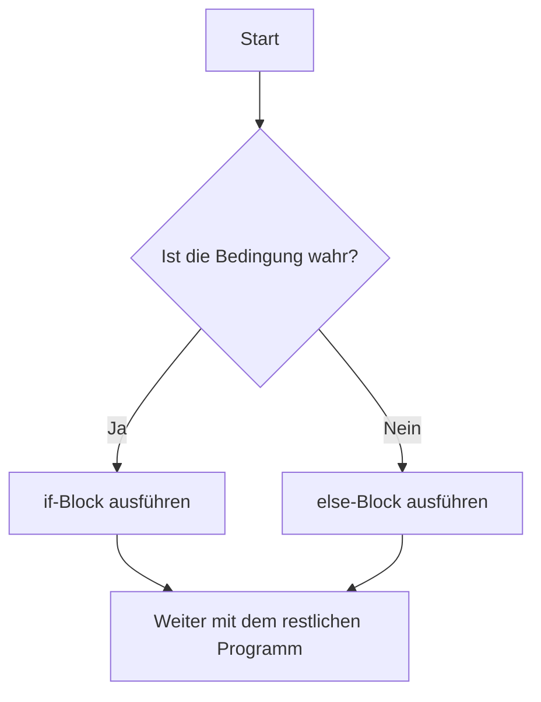
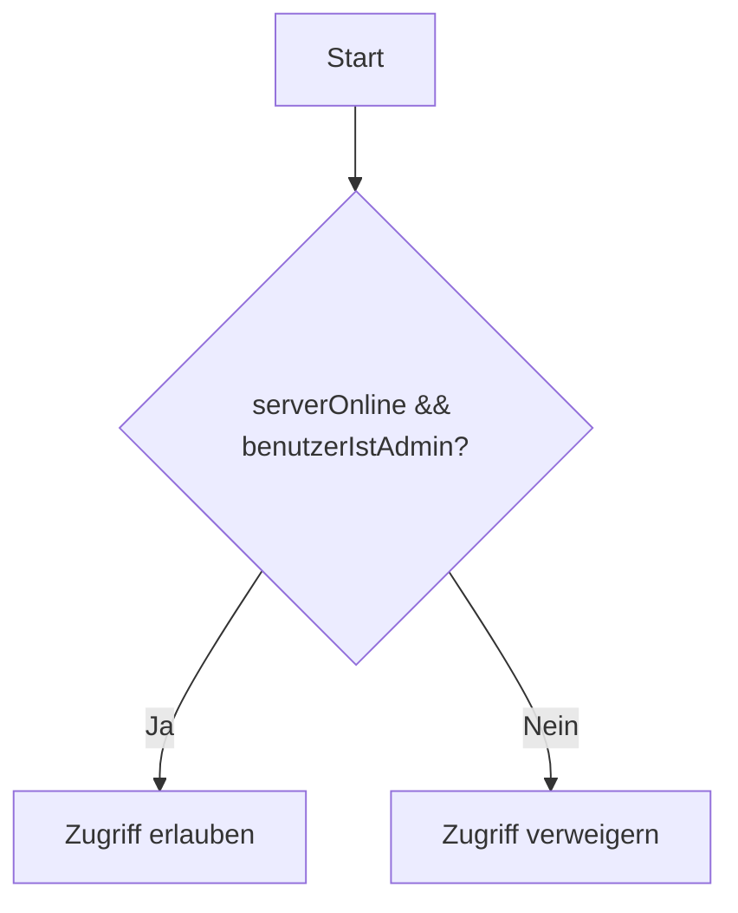
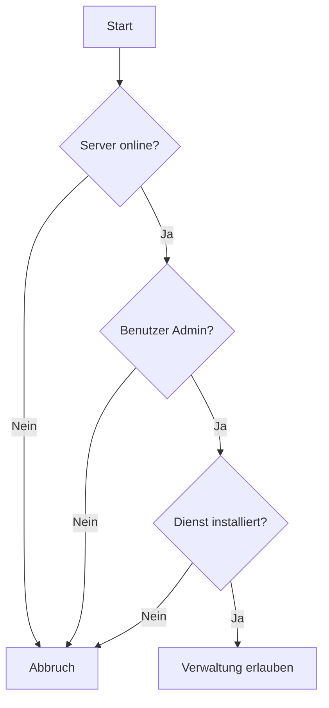
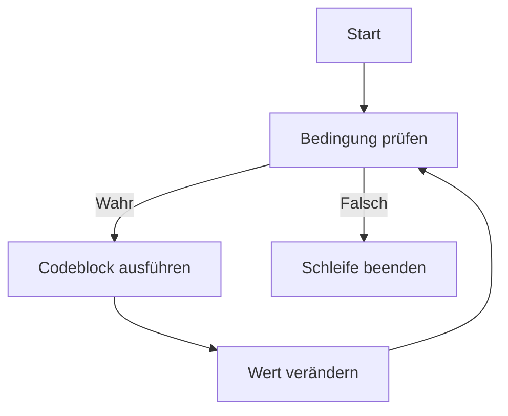
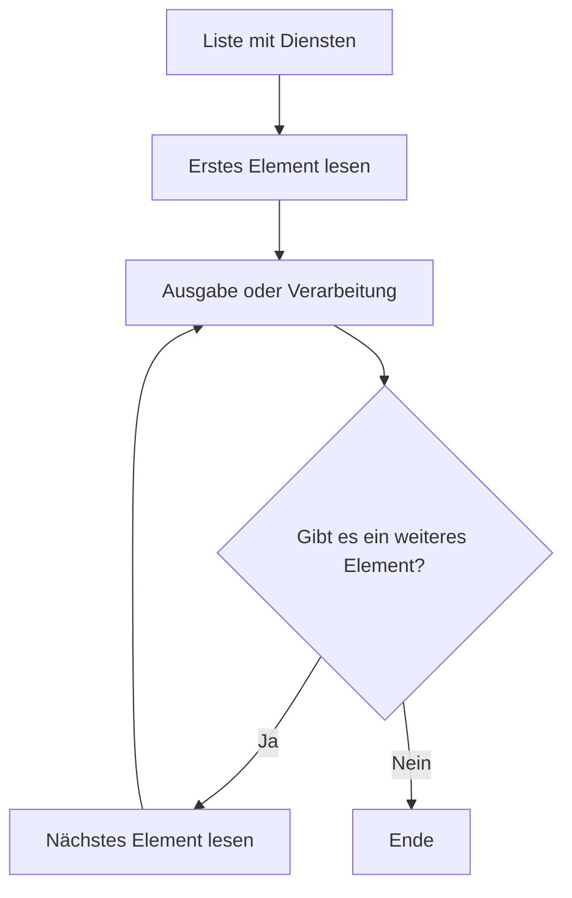
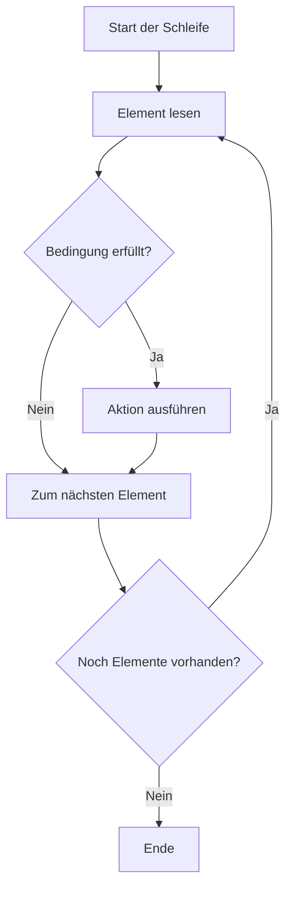

###### Themen

Bedingungen und Programmfluss

- Einfache if-else-Anweisungen zur Steuerung des Programmflusses
- Vergleichs- und logische Operatoren in Bedingungen anwenden
- Einfache Verschachtelung von Bedingungen verstehen

Schleifen – Grundlagen

- Einführung in for- und while-Schleifen
- Wiederholungen mit Schleifen umsetzen
- Typische einfache Anwendungsfälle mit Schleifen bearbeiten

<br><br><br>

# 🧭 Bedingungen und Programmfluss in JavaScript

Wenn du programmierst, läuft dein Code normalerweise **Zeile für Zeile von oben nach unten**. Das nennt man **Programmfluss**.
Sobald du aber Entscheidungen treffen willst, reicht dieses starre Abarbeiten nicht mehr aus.

Ein Programm soll oft auf unterschiedliche Situationen reagieren, zum Beispiel:

* Ein Benutzer ist eingeloggt oder nicht
* Ein Passwort ist richtig oder falsch
* Eine Zahl ist größer als 10 oder nicht
* Eine Datei existiert oder nicht
* Ein Dienst auf einem Windows Server läuft oder ist gestoppt

Genau dafür brauchst du **Bedingungen**.

Mit Bedingungen legst du fest:

* **Wann** bestimmter Code ausgeführt wird
* **Wann nicht**
* **Welcher von mehreren Wegen** gewählt wird

In JavaScript geschieht das vor allem mit:

* `if`
* `else`
* `else if`

Diese Anweisungen steuern also den Ablauf deines Programms.

Gerade im Umfeld von **Windows Server 2025** ist dieses Denken sehr wichtig.
Auch wenn JavaScript selbst typischerweise nicht direkt das klassische Verwaltungswerkzeug für Windows Server ist, kann es im Server-Kontext trotzdem vorkommen, zum Beispiel:

* in Webanwendungen auf einem Server
* in Admin-Oberflächen
* in Node.js-Skripten
* in Automatisierungstools
* in Dashboards zur Überwachung von Serverzuständen

Ein Skript könnte etwa prüfen:

* Ist der angemeldete Benutzer Administrator?
* Ist genug Speicherplatz frei?
* Läuft ein Dienst?
* Ist der Server erreichbar?
* Hat eine Sicherung erfolgreich funktioniert?

Dann entscheidet dein Code anhand einer Bedingung, was passieren soll.

<br><br><br>

## 🚦 Einfache if-else-Anweisungen zur Steuerung des Programmflusses

Die einfachste Form einer Bedingung ist die `if`-Anweisung.

Sie bedeutet:

> **Wenn** eine Bedingung wahr ist, dann führe diesen Code aus.

### 🧱 Grundstruktur von if

```javascript
if (Bedingung) {
  // dieser Code läuft nur, wenn die Bedingung true ist
}
```

Das Wort `if` bedeutet also: **falls**.

Beispiel:

```javascript
let speicherFrei = true;

if (speicherFrei) {
  console.log("Genug Speicherplatz vorhanden.");
}
```

Hier wird die Ausgabe nur dann angezeigt, wenn `speicherFrei` den Wert `true` hat.

### 🪟 Beispiel aus dem Windows-Server-Kontext

Stell dir vor, du prüfst in einem Admin-Dashboard, ob ein Dienst läuft:

```javascript
let dienstLaeuft = true;

if (dienstLaeuft) {
  console.log("Der Dienst läuft ordnungsgemäß.");
}
```

Wenn `dienstLaeuft` auf `false` steht, passiert in diesem Beispiel einfach nichts.

---

### 🔁 if mit else

Oft willst du nicht nur einen Fall behandeln, sondern auch den Gegenfall.

Dafür gibt es `else`.

```javascript
if (Bedingung) {
  // wenn wahr
} else {
  // wenn falsch
}
```

Beispiel:

```javascript
let benutzerIstAdmin = false;

if (benutzerIstAdmin) {
  console.log("Zugriff auf Serververwaltung erlaubt.");
} else {
  console.log("Zugriff verweigert.");
}
```

Hier gibt es genau zwei Möglichkeiten:

* Bedingung ist `true` → erster Block wird ausgeführt
* Bedingung ist `false` → zweiter Block wird ausgeführt

### 🧠 Was intern passiert

JavaScript prüft den Ausdruck in den runden Klammern:

```javascript
if (benutzerIstAdmin)
```

Wenn das Ergebnis **wahr** ist, wird der Codeblock direkt nach `if` ausgeführt.
Wenn das Ergebnis **falsch** ist, wird – falls vorhanden – der `else`-Block ausgeführt.

---

### 🛠️ if-else in einem realistischen Beispiel

```javascript
let serverOnline = false;

if (serverOnline) {
  console.log("Server ist erreichbar.");
} else {
  console.log("Server ist nicht erreichbar.");
}
```

Das ist typisch für Statusanzeigen in Monitoring-Tools.

---

### 🧾 if, else if und else

Wenn es mehr als zwei Fälle gibt, verwendest du `else if`.

```javascript
let cpuLast = 82;

if (cpuLast < 50) {
  console.log("CPU-Auslastung ist niedrig.");
} else if (cpuLast < 80) {
  console.log("CPU-Auslastung ist mittel.");
} else {
  console.log("CPU-Auslastung ist hoch.");
}
```

So läuft die Prüfung:

1. Ist `cpuLast < 50`?
2. Wenn nein: Ist `cpuLast < 80`?
3. Wenn auch nein: dann bleibt nur noch `else`

Wichtig ist:
JavaScript prüft diese Bedingungen **von oben nach unten**.
Sobald eine Bedingung zutrifft, wird ihr Block ausgeführt und der Rest übersprungen.

---

### 📊 Aufbau im Überblick

| Konstruktion              | Bedeutung                                       |
| ------------------------- | ----------------------------------------------- |
| `if`                      | Führt Code nur aus, wenn die Bedingung wahr ist |
| `if ... else`             | Entscheidet zwischen zwei Möglichkeiten         |
| `if ... else if ... else` | Entscheidet zwischen mehreren Möglichkeiten     |

---

### 🖼️ Grafik: Ablauf einer if-else-Entscheidung



---

### ⚠️ Häufige Denkfehler bei if-else

#### ❌ Bedingung mit Ergebnis verwechseln

```javascript
let istOnline = true;

if (istOnline === true) {
  console.log("Online");
}
```

Das ist korrekt, aber oft unnötig lang. Kürzer geht auch:

```javascript
if (istOnline) {
  console.log("Online");
}
```

Denn `istOnline` ist schon selbst ein Wahrheitswert.

---

#### ❌ Zuweisung statt Vergleich

Ein sehr häufiger Fehler:

```javascript
if (istOnline = true) {
  console.log("Online");
}
```

Das ist problematisch, weil hier nicht verglichen wird.
Hier wird `true` **zugewiesen**.

Richtig wäre:

```javascript
if (istOnline === true) {
  console.log("Online");
}
```

Oder einfacher:

```javascript
if (istOnline) {
  console.log("Online");
}
```

---

#### ❌ Geschweifte Klammern weglassen

JavaScript erlaubt manchmal auch das:

```javascript
if (istOnline)
  console.log("Online");
```

Das funktioniert zwar bei nur einer Zeile, ist aber fehleranfällig.
Sauberer und sicherer ist:

```javascript
if (istOnline) {
  console.log("Online");
}
```

Gerade wenn dein Code später wächst, sind geschweifte Klammern sehr wichtig.

<br><br><br>

## ⚖️ Vergleichs- und logische Operatoren in Bedingungen anwenden

Eine Bedingung ist meistens kein einfacher Wahrheitswert wie `true` oder `false`, sondern ein **Vergleich**.

Dafür brauchst du **Operatoren**.

Diese Operatoren helfen dir zu prüfen:

* ob zwei Werte gleich sind
* ob sie unterschiedlich sind
* ob ein Wert größer oder kleiner ist
* ob mehrere Bedingungen gleichzeitig gelten

---

### 📏 Vergleichsoperatoren

Vergleichsoperatoren liefern immer ein Ergebnis vom Typ Boolean zurück:

* `true`
* `false`

Hier die wichtigsten:

| Operator | Bedeutung           | Beispiel  |
| -------- | ------------------- | --------- |
| `===`    | exakt gleich        | `5 === 5` |
| `!==`    | nicht exakt gleich  | `5 !== 3` |
| `>`      | größer als          | `10 > 5`  |
| `<`      | kleiner als         | `3 < 7`   |
| `>=`     | größer oder gleich  | `8 >= 8`  |
| `<=`     | kleiner oder gleich | `4 <= 9`  |

---

### 🔍 Warum `===` so wichtig ist

In JavaScript gibt es `==` und `===`.

Der wichtige Unterschied:

* `==` vergleicht **locker**
* `===` vergleicht **streng**

Beispiel:

```javascript
5 == "5"    // true
5 === "5"   // false
```

Warum?

* Bei `==` versucht JavaScript, Werte umzuwandeln
* Bei `===` müssen **Wert und Datentyp** gleich sein

Deshalb sollte man in sauberem Code fast immer `===` verwenden.

### 🧠 Beispiel

```javascript
let port = 443;

if (port === 443) {
  console.log("HTTPS-Port erkannt.");
}
```

Das ist eindeutig und sicher.

---

### 🪟 Vergleichsoperatoren im Windows-Server-Kontext

```javascript
let freieFestplatteGB = 12;

if (freieFestplatteGB < 20) {
  console.log("Warnung: Wenig Speicherplatz verfügbar.");
}
```

Oder:

```javascript
let aktiveSitzungen = 5;

if (aktiveSitzungen >= 5) {
  console.log("Viele aktive Sitzungen auf dem Server.");
}
```

---

### 🔗 Logische Operatoren

Sehr oft reicht ein einzelner Vergleich nicht aus.
Dann kombinierst du mehrere Bedingungen.

Dafür gibt es logische Operatoren:

| Operator | Bedeutung | Beispiel                           |      |                                          |
| -------- | --------- | ---------------------------------- | ---- | ---------------------------------------- |
| `&&`     | UND       | beide Bedingungen müssen wahr sein |      |                                          |
| `        |           | `                                  | ODER | mindestens eine Bedingung muss wahr sein |
| `!`      | NICHT     | kehrt den Wahrheitswert um         |      |                                          |

---

### 🤝 Der UND-Operator `&&`

Mit `&&` müssen **alle** Bedingungen wahr sein.

```javascript
let serverOnline = true;
let benutzerIstAdmin = true;

if (serverOnline && benutzerIstAdmin) {
  console.log("Admin darf auf den Server zugreifen.");
}
```

Das funktioniert nur, wenn:

* der Server online ist
* **und**
* der Benutzer Admin ist

Wenn eine der beiden Bedingungen falsch ist, läuft der Block nicht.

---

### 🔀 Der ODER-Operator `||`

Mit `||` reicht **eine** wahre Bedingung.

```javascript
let benutzerIstAdmin = false;
let benutzerIstSupport = true;

if (benutzerIstAdmin || benutzerIstSupport) {
  console.log("Zugriff auf Supportbereich erlaubt.");
}
```

Hier reicht es, wenn der Benutzer entweder Admin **oder** Support-Mitarbeiter ist.

---

### 🔁 Der NICHT-Operator `!`

Der Operator `!` kehrt den Wert um:

* aus `true` wird `false`
* aus `false` wird `true`

Beispiel:

```javascript
let wartungsmodusAktiv = false;

if (!wartungsmodusAktiv) {
  console.log("System ist normal verfügbar.");
}
```

Das bedeutet:

> Wenn der Wartungsmodus **nicht aktiv** ist, dann gib die Meldung aus.

---

### 🧾 Zusammengesetzte Bedingungen

Hier ein typisches Beispiel:

```javascript
let serverOnline = true;
let cpuLast = 72;
let wartungsmodusAktiv = false;

if (serverOnline && cpuLast < 80 && !wartungsmodusAktiv) {
  console.log("System läuft stabil.");
}
```

Hier müssen **drei Dinge gleichzeitig stimmen**:

1. Server ist online
2. CPU-Last ist unter 80
3. Wartungsmodus ist nicht aktiv

Nur dann kommt die Ausgabe.

---

### 🖼️ Grafik: Logische Verknüpfungen



---

### 📊 Wahrheitstabellen

Wahrheitstabellen helfen dir, logische Operatoren sauber zu verstehen.

### 🤝 Wahrheitstabelle für `&&`

| Bedingung A | Bedingung B | A && B |
| ----------- | ----------- | ------ |
| false       | false       | false  |
| false       | true        | false  |
| true        | false       | false  |
| true        | true        | true   |

Bei `&&` muss also wirklich **alles** stimmen.

---

### 🔀 Wahrheitstabelle für `||`

| Bedingung A | Bedingung B | A || B |
| ----------- | ----------- | ------ |
| false       | false       | false  |
| false       | true        | true   |
| true        | false       | true   |
| true        | true        | true   |

Bei `||` reicht **mindestens eine** wahre Bedingung.

---

### 🔁 Wahrheitstabelle für `!`

| A     | !A    |
| ----- | ----- |
| true  | false |
| false | true  |

---

### ⚠️ Reihenfolge bei kombinierten Bedingungen

JavaScript wertet komplexe Bedingungen nach bestimmten Regeln aus.
Trotzdem solltest du bei gemischten Bedingungen oft Klammern setzen, damit der Ausdruck klar lesbar bleibt.

Beispiel:

```javascript
let istAdmin = false;
let istSupport = true;
let serverOnline = true;

if ((istAdmin || istSupport) && serverOnline) {
  console.log("Zugriff möglich.");
}
```

Das bedeutet:

1. Prüfe zuerst: Ist die Person Admin **oder** Support?
2. Prüfe dann zusätzlich: Ist der Server online?

Nur dann wird Zugriff erlaubt.

Ohne Klammern kann so etwas schnell unübersichtlich werden.

---

### 🧠 Typische Praxisfälle

#### Fall 1: Zugriff nur für Admins bei aktivem Server

```javascript
let istAdmin = true;
let serverOnline = true;

if (istAdmin && serverOnline) {
  console.log("Admin-Konsole wird geöffnet.");
}
```

#### Fall 2: Warnung bei hoher CPU oder niedrigem Speicher

```javascript
let cpuLast = 92;
let freieFestplatteGB = 8;

if (cpuLast > 90 || freieFestplatteGB < 10) {
  console.log("Systemwarnung anzeigen.");
}
```

#### Fall 3: Aktion nur außerhalb des Wartungsmodus

```javascript
let wartungsmodus = false;

if (!wartungsmodus) {
  console.log("Backup kann gestartet werden.");
}
```

---

### 🧱 Bedingungen lesen wie einen Satz

Das ist eine sehr gute Methode für Anfänger.

Beispiel:

```javascript
if (cpuLast > 80 && serverOnline) {
  console.log("Server steht unter Last.");
}
```

Lies das so:

> Wenn die CPU-Last größer als 80 ist und der Server online ist, dann gib die Meldung aus.

Wenn du Bedingungen sprachlich sauber lesen kannst, verstehst du sie meistens auch logisch richtig.

<br><br><br>

## 🪆 Einfache Verschachtelung von Bedingungen verstehen

Eine **Verschachtelung** bedeutet:

> Innerhalb einer Bedingung befindet sich noch eine weitere Bedingung.

Also ein `if` in einem `if`.

Das brauchst du, wenn eine zweite Entscheidung erst dann sinnvoll ist, wenn eine erste Bedingung bereits erfüllt wurde.

---

### 🧱 Grundidee einer Verschachtelung

```javascript
if (Bedingung1) {
  if (Bedingung2) {
    // Code
  }
}
```

Das bedeutet:

1. Prüfe zuerst `Bedingung1`
2. Nur wenn sie wahr ist, prüfe `Bedingung2`
3. Nur wenn auch diese wahr ist, läuft der Code

---

### 🪟 Beispiel aus dem Serveralltag

```javascript
let serverOnline = true;
let benutzerIstAdmin = true;

if (serverOnline) {
  if (benutzerIstAdmin) {
    console.log("Zugriff auf Servereinstellungen erlaubt.");
  }
}
```

Hier gilt:

* Ist der Server offline, wird die zweite Bedingung gar nicht mehr geprüft
* Nur wenn der Server online ist, wird geprüft, ob der Benutzer Admin ist

---

### 🧠 Warum verschachtelt man Bedingungen?

Verschachtelungen sind nützlich, wenn Bedingungen **aufeinander aufbauen**.

Beispiel aus der Praxis:

* Erst prüfen, ob der Server erreichbar ist
* Danach prüfen, ob der Benutzer Rechte hat
* Danach prüfen, ob der Dienst gestartet werden darf

Diese Reihenfolge ist logisch.
Es wäre sinnlos, Rechte oder Dienste zu prüfen, wenn der Server gar nicht erreichbar ist.

---

### 🧾 Beispiel mit mehreren Ebenen

```javascript
let serverOnline = true;
let benutzerIstAdmin = true;
let dienstInstalliert = true;

if (serverOnline) {
  if (benutzerIstAdmin) {
    if (dienstInstalliert) {
      console.log("Dienst kann verwaltet werden.");
    }
  }
}
```

Hier gibt es drei Ebenen:

1. Server online?
2. Benutzer Admin?
3. Dienst installiert?

Nur wenn alle drei Bedingungen erfüllt sind, erscheint die Ausgabe.

---

### 🖼️ Grafik: Verschachtelte Entscheidung



---

### 🔍 Verschachtelung vs. logische Verknüpfung

Viele verschachtelte Bedingungen lassen sich auch mit `&&` schreiben.

Statt:

```javascript
if (serverOnline) {
  if (benutzerIstAdmin) {
    console.log("Zugriff erlaubt.");
  }
}
```

kann man auch schreiben:

```javascript
if (serverOnline && benutzerIstAdmin) {
  console.log("Zugriff erlaubt.");
}
```

Beides ist logisch ähnlich.

Der Unterschied liegt oft in der **Lesbarkeit** und im **Zweck**.

---

### 📊 Wann ist was sinnvoll?

| Situation                                                              | Besser geeignet      |
| ---------------------------------------------------------------------- | -------------------- |
| Mehrere Bedingungen sollen einfach gemeinsam gelten                    | `&&`                 |
| Eine zweite Prüfung soll nur innerhalb eines bestimmten Falls erfolgen | Verschachtelung      |
| Unterschiedliche Reaktionen pro Ebene nötig                            | Verschachtelung      |
| Kurze kompakte Bedingung                                               | logische Verknüpfung |

---

### 🧠 Beispiel, bei dem Verschachtelung sinnvoller ist

```javascript
let serverOnline = true;
let benutzerIstAdmin = false;

if (serverOnline) {
  console.log("Server ist erreichbar.");

  if (benutzerIstAdmin) {
    console.log("Adminrechte vorhanden.");
  } else {
    console.log("Keine Adminrechte.");
  }
} else {
  console.log("Server ist nicht erreichbar.");
}
```

Hier ist die Verschachtelung praktisch, weil du unterschiedliche Meldungen je nach Ebene ausgeben willst.

---

### ⚠️ Gefahr bei zu tiefer Verschachtelung

Zu viele verschachtelte Bedingungen machen Code schnell unübersichtlich.

Zum Beispiel:

```javascript
if (a) {
  if (b) {
    if (c) {
      if (d) {
        console.log("Sehr tief verschachtelt");
      }
    }
  }
}
```

Das kann man zwar schreiben, aber es wird schwer lesbar.

Gerade für Anfänger gilt:

* lieber klar
* lieber verständlich
* lieber logisch gegliedert
* nicht unnötig tief verschachteln

---

### 🧾 Beispiel: Benutzeranmeldung auf einem Serverportal

```javascript
let serverOnline = true;
let benutzerGefunden = true;
let passwortKorrekt = true;

if (serverOnline) {
  if (benutzerGefunden) {
    if (passwortKorrekt) {
      console.log("Anmeldung erfolgreich.");
    } else {
      console.log("Passwort ist falsch.");
    }
  } else {
    console.log("Benutzer existiert nicht.");
  }
} else {
  console.log("Server ist derzeit nicht erreichbar.");
}
```

Das ist ein sehr gutes Lernbeispiel, weil die Prüfungen logisch nacheinander aufgebaut sind.

---

### 🧱 Saubere Denkhilfe

Bei verschachtelten Bedingungen hilft dieser Gedanke:

> Welche Prüfung ergibt erst dann Sinn, wenn eine andere vorher erfolgreich war?

Wenn du diese Frage beantworten kannst, verstehst du Verschachtelung meistens sofort.

<br><br><br>

# 🔁 Schleifen – Grundlagen in JavaScript

Bedingungen entscheiden, **ob** etwas passiert.
Schleifen entscheiden, **wie oft** etwas passiert.

Eine Schleife brauchst du immer dann, wenn du denselben oder ähnlichen Code **mehrfach wiederholen** willst, ohne ihn ständig neu zu schreiben.

Das ist extrem wichtig, weil Programme sehr oft wiederholte Aufgaben erledigen:

* mehrere Benutzer prüfen
* viele Dateien durchlaufen
* Logeinträge verarbeiten
* Dienste mehrfach kontrollieren
* Elemente einer Liste anzeigen
* Statusmeldungen sammeln
* Zahlenfolgen erzeugen

Gerade in einem Umfeld wie **Windows Server 2025** können Schleifen zum Beispiel genutzt werden, um:

* mehrere Serverrollen zu prüfen
* eine Liste von Benutzern zu verarbeiten
* mehrere Freigaben zu kontrollieren
* wiederholt auf einen Status zu warten
* über Logeinträge oder Konfigurationswerte zu laufen

Ohne Schleifen müsste man denselben Code sehr oft manuell wiederholen.
Das wäre unpraktisch, fehleranfällig und unübersichtlich.

Beispiel ohne Schleife:

```javascript
console.log("Prüfe Dienst 1");
console.log("Prüfe Dienst 2");
console.log("Prüfe Dienst 3");
console.log("Prüfe Dienst 4");
```

Das geht bei vier Zeilen noch.
Aber bei 100 oder 1.000 Wiederholungen ist das keine brauchbare Lösung.

Mit Schleifen wird daraus strukturierter Code.

<br><br><br>

## 🔄 Einführung in for- und while-Schleifen

Die beiden wichtigsten einfachen Schleifen in JavaScript sind:

* `for`
* `while`

Beide dienen dazu, Wiederholungen umzusetzen.
Sie unterscheiden sich aber darin, **wie** die Wiederholung gesteuert wird.

---

### 🔢 Die for-Schleife

Die `for`-Schleife ist besonders praktisch, wenn du schon vorher ungefähr weißt, **wie oft** etwas wiederholt werden soll.

Grundstruktur:

```javascript
for (Startwert; Bedingung; Veränderung) {
  // dieser Code wird wiederholt
}
```

Das sieht am Anfang kompliziert aus, ist aber logisch aufgebaut.

Die drei Teile bedeuten:

| Teil        | Bedeutung                                  |
| ----------- | ------------------------------------------ |
| Startwert   | Wo beginnt die Zählung?                    |
| Bedingung   | Solange diese wahr ist, läuft die Schleife |
| Veränderung | Was passiert nach jedem Durchlauf?         |

---

### 🧱 Einfaches Beispiel

```javascript
for (let i = 1; i <= 5; i++) {
  console.log("Durchlauf Nummer: " + i);
}
```

Das bedeutet:

1. `let i = 1` → Start bei 1
2. `i <= 5` → solange `i` kleiner oder gleich 5 ist, läuft die Schleife
3. `i++` → nach jedem Durchlauf wird `i` um 1 erhöht

Die Ausgabe ist:

```javascript
Durchlauf Nummer: 1
Durchlauf Nummer: 2
Durchlauf Nummer: 3
Durchlauf Nummer: 4
Durchlauf Nummer: 5
```

---

### 🧠 Bedeutung von `i`

Die Variable `i` steht oft für **Index** oder einfach für einen **Zähler**.

Sie ist nur ein Name.
Du könntest auch `zaehler` schreiben:

```javascript
for (let zaehler = 1; zaehler <= 5; zaehler++) {
  console.log(zaehler);
}
```

Für Anfänger ist das manchmal lesbarer.

---

### 🪟 Beispiel im Windows-Server-Kontext

```javascript
for (let pruefung = 1; pruefung <= 3; pruefung++) {
  console.log("Serverprüfung " + pruefung + " wird ausgeführt.");
}
```

Das könnte symbolisch für drei aufeinanderfolgende Prüfungen stehen.

---

### 🔁 Die while-Schleife

Die `while`-Schleife ist sinnvoll, wenn du nicht genau weißt, wie oft etwas wiederholt werden muss.
Sie läuft **solange eine Bedingung wahr ist**.

Grundstruktur:

```javascript
while (Bedingung) {
  // wiederhole diesen Code
}
```

Beispiel:

```javascript
let zaehler = 1;

while (zaehler <= 5) {
  console.log("Wert: " + zaehler);
  zaehler++;
}
```

Das Ergebnis ist ähnlich wie bei der `for`-Schleife.

Wichtig ist aber:
Bei `while` musst du selbst darauf achten, dass sich die Bedingung irgendwann ändert.

---

### ⚠️ Gefahr der Endlosschleife

Wenn die Bedingung immer wahr bleibt, läuft die Schleife endlos.

Beispiel:

```javascript
let zaehler = 1;

while (zaehler <= 5) {
  console.log(zaehler);
}
```

Hier fehlt `zaehler++`.

Das Problem:

* `zaehler` bleibt immer 1
* `1 <= 5` ist immer wahr
* die Schleife endet nie

Das nennt man **Endlosschleife**.

Gerade in Server- oder Automatisierungsskripten ist das gefährlich, weil es Ressourcen verschwenden oder Prozesse blockieren kann.

---

### 🖼️ Grafik: Aufbau einer Schleife



---

### 📊 for und while im Vergleich

| Merkmal            | for-Schleife                      | while-Schleife                    |
| ------------------ | --------------------------------- | --------------------------------- |
| Typischer Einsatz  | feste Anzahl von Wiederholungen   | unbestimmte Anzahl                |
| Zähler             | meist direkt im Kopf der Schleife | oft vorher definiert              |
| Lesbarkeit         | gut bei Zählschleifen             | gut bei bedingten Wiederholungen  |
| Gefahr von Fehlern | eher übersichtlich                | höhere Gefahr für Endlosschleifen |

---

### 🧠 Merksatz

* `for` = **ich weiß ungefähr, wie oft**
* `while` = **ich wiederhole, solange etwas gilt**

<br><br><br>

## ♻️ Wiederholungen mit Schleifen umsetzen

Schleifen sind dafür da, denselben Ablauf mehrfach auszuführen.

Wichtig ist dabei:
Eine Schleife wiederholt nicht einfach blind denselben Text, sondern meistens arbeitet sie mit Werten, Zählern oder Datenlisten.

---

### 🔢 Wiederholung mit der for-Schleife

```javascript
for (let i = 1; i <= 5; i++) {
  console.log("Backup-Schritt " + i);
}
```

Hier wird der Codeblock fünfmal ausgeführt.

Das ist sinnvoll, wenn du eine feste Anzahl von Wiederholungen brauchst.

---

### ⏳ Wiederholung mit der while-Schleife

```javascript
let versuch = 1;

while (versuch <= 3) {
  console.log("Verbindungsversuch " + versuch);
  versuch++;
}
```

Hier läuft die Schleife dreimal.

Die Bedingung wird **vor jedem Durchlauf** neu geprüft.

---

### 🧠 Ablauf einer Schleife Schritt für Schritt

Nehmen wir dieses Beispiel:

```javascript
for (let i = 1; i <= 3; i++) {
  console.log("Prüfung " + i);
}
```

So läuft das intern:

| Schritt           | Wert von `i` | Bedingung `i <= 3` | Aktion             |
| ----------------- | -----------: | ------------------ | ------------------ |
| Start             |            1 | true               | Ausgabe: Prüfung 1 |
| Nach 1. Durchlauf |            2 | true               | Ausgabe: Prüfung 2 |
| Nach 2. Durchlauf |            3 | true               | Ausgabe: Prüfung 3 |
| Nach 3. Durchlauf |            4 | false              | Schleife endet     |

So wird sehr sichtbar, dass eine Schleife im Kern nur aus drei Dingen besteht:

* Startwert
* Bedingung
* Veränderung

---

### 📦 Schleifen und Arrays

Schleifen werden besonders nützlich, wenn du mehrere Daten verarbeiten willst.
Dafür verwendet man oft ein **Array**.

Ein Array ist eine Liste von Werten.

Beispiel:

```javascript
let dienste = ["DNS", "DHCP", "IIS"];
```

Diese Liste enthält drei Einträge.

Mit einer Schleife kannst du alle Einträge nacheinander ausgeben:

```javascript
let dienste = ["DNS", "DHCP", "IIS"];

for (let i = 0; i < dienste.length; i++) {
  console.log("Dienst: " + dienste[i]);
}
```

---

### 🔍 Warum beginnt der Index bei 0?

In JavaScript starten Array-Positionen bei `0`.

Das bedeutet:

| Position | Wert     |
| -------- | -------- |
| 0        | `"DNS"`  |
| 1        | `"DHCP"` |
| 2        | `"IIS"`  |

Darum beginnt die Schleife hier mit `0`.

Die Bedingung lautet:

```javascript
i < dienste.length
```

`dienste.length` ist hier `3`.

Also läuft `i` durch die Werte:

* 0
* 1
* 2

Sobald `i` den Wert `3` erreicht, endet die Schleife.

---

### 🪟 Beispiel: Benutzerliste durchlaufen

```javascript
let benutzer = ["Anna", "Mehmet", "Sofia", "Leon"];

for (let i = 0; i < benutzer.length; i++) {
  console.log("Benutzer gefunden: " + benutzer[i]);
}
```

So kann ein System nacheinander mehrere Benutzer verarbeiten.

---

### 🧾 Schleifen mit Bedingungen kombinieren

Oft wird innerhalb einer Schleife noch eine Bedingung verwendet.

Beispiel:

```javascript
let cpuWerte = [35, 81, 67, 92];

for (let i = 0; i < cpuWerte.length; i++) {
  if (cpuWerte[i] > 80) {
    console.log("Hohe CPU-Last erkannt: " + cpuWerte[i] + "%");
  }
}
```

Hier passiert Folgendes:

* Die Schleife läuft durch alle Werte
* Für jeden Wert wird geprüft, ob er größer als 80 ist
* Nur dann gibt es eine Meldung

Das ist ein sehr typisches Muster in der Programmierung.

---

### 🖼️ Grafik: Schleife über eine Liste



---

### ⚠️ Typische Fehler bei Wiederholungen

#### ❌ Falsche Bedingung

```javascript
for (let i = 0; i <= dienste.length; i++) {
  console.log(dienste[i]);
}
```

Das ist problematisch, weil bei `i === dienste.length` ein ungültiger Index erreicht wird.

Richtig:

```javascript
for (let i = 0; i < dienste.length; i++) {
  console.log(dienste[i]);
}
```

---

#### ❌ Veränderung vergessen

```javascript
let i = 0;

while (i < 3) {
  console.log(i);
}
```

Hier wird `i` nie verändert.
Die Schleife endet nie.

Richtig:

```javascript
let i = 0;

while (i < 3) {
  console.log(i);
  i++;
}
```

---

#### ❌ Schleifenlogik nicht sauber lesen

Eine Schleife sollte man immer sprachlich lesen können.

Beispiel:

```javascript
for (let i = 0; i < 5; i++) {
  console.log(i);
}
```

Gelesen:

> Starte bei 0, wiederhole solange `i` kleiner als 5 ist, erhöhe `i` nach jedem Durchlauf um 1.

Wenn du das sauber in Worte fassen kannst, ist die Schleife meist korrekt verstanden.

<br><br><br>

## 🧰 Typische einfache Anwendungsfälle mit Schleifen bearbeiten

Schleifen sind kein Selbstzweck.
Sie werden benutzt, um reale Aufgaben einfacher zu lösen.

Hier sind typische einfache Anwendungsfälle, die in JavaScript sehr häufig vorkommen und sich gut auf Windows-Server-nahe Denkweisen übertragen lassen.

---

### 📋 1. Mehrere Einträge nacheinander ausgeben

Ein klassischer Fall ist das Ausgeben von Listen.

```javascript
let serverRollen = ["Active Directory", "DNS", "DHCP", "Dateiserver"];

for (let i = 0; i < serverRollen.length; i++) {
  console.log("Installierte Rolle: " + serverRollen[i]);
}
```

Hier werden mehrere Serverrollen nacheinander ausgegeben.

---

### 🔎 2. Werte prüfen

Du kannst mit einer Schleife viele Werte kontrollieren.

```javascript
let festplatten = [120, 18, 75, 9];

for (let i = 0; i < festplatten.length; i++) {
  if (festplatten[i] < 20) {
    console.log("Warnung: Wenig Speicherplatz - " + festplatten[i] + " GB frei");
  }
}
```

Das ist ein einfaches Überwachungsmuster.

---

### 🔢 3. Zählen

Manchmal willst du nur zählen, wie oft etwas vorkommt.

```javascript
let fehlversuche = [false, true, true, false, true];
let anzahlFehler = 0;

for (let i = 0; i < fehlversuche.length; i++) {
  if (fehlversuche[i] === true) {
    anzahlFehler++;
  }
}

console.log("Anzahl fehlerhafter Anmeldungen: " + anzahlFehler);
```

Hier wird gezählt, wie viele `true`-Werte in der Liste vorkommen.

---

### ⏱️ 4. Wiederholte Versuche durchführen

Das ist besonders typisch bei Verbindungen oder Statusprüfungen.

```javascript
let versuch = 1;

while (versuch <= 3) {
  console.log("Ping-Versuch Nummer " + versuch);
  versuch++;
}
```

So eine Schleife kann symbolisch für mehrere Prüfversuche stehen.

---

### 🪟 5. Benutzer oder Dienste durchlaufen

```javascript
let dienste = ["Spooler", "WinRM", "W32Time"];

for (let i = 0; i < dienste.length; i++) {
  console.log("Prüfe Dienst: " + dienste[i]);
}
```

Das ist eine typische Verwaltungs- oder Monitoring-Idee.

---

### 🧠 6. Daten filtern

Eine Schleife kann auch gezielt nur bestimmte Einträge verarbeiten.

```javascript
let ports = [80, 135, 443, 3389, 21];

for (let i = 0; i < ports.length; i++) {
  if (ports[i] === 443 || ports[i] === 3389) {
    console.log("Wichtiger Port gefunden: " + ports[i]);
  }
}
```

Hier werden nur bestimmte Ports beachtet.

---

### 📊 7. Durchschnittlich einfache Auswertungen vorbereiten

Auch einfache Berechnungen laufen oft über Schleifen.

```javascript
let cpuWerte = [40, 55, 65, 70];
let summe = 0;

for (let i = 0; i < cpuWerte.length; i++) {
  summe += cpuWerte[i];
}

console.log("Summe aller CPU-Werte: " + summe);
```

Das ist ein Grundlagenmuster für spätere Auswertungen.

---

### 🧾 Kombination aus Schleife und Bedingung

Das ist eines der wichtigsten Grundmuster überhaupt:

```javascript
let benutzerStatus = ["aktiv", "gesperrt", "aktiv", "inaktiv"];

for (let i = 0; i < benutzerStatus.length; i++) {
  if (benutzerStatus[i] === "gesperrt") {
    console.log("Gesperrter Benutzer entdeckt.");
  }
}
```

Hier sieht man sehr gut:

* Schleife = geht alle Elemente durch
* Bedingung = entscheidet pro Element, was passieren soll

Dieses Zusammenspiel ist zentral in fast jeder echten Anwendung.

---

### 🖼️ Grafik: Schleife plus Bedingung



---

### 📊 Typische einfache Anwendungsfälle im Überblick

| Anwendungsfall  | Beispielidee                                     |
| --------------- | ------------------------------------------------ |
| Listen ausgeben | Benutzer, Dienste, Rollen anzeigen               |
| Werte prüfen    | Speicherplatz, CPU, Ports kontrollieren          |
| Zählen          | Fehler, Treffer, Warnungen mitzählen             |
| Wiederholen     | mehrere Verbindungsversuche                      |
| Filtern         | nur bestimmte Werte beachten                     |
| Verarbeiten     | jedes Element einer Liste nacheinander behandeln |

---

### 🧠 Warum das für dich wichtig ist

Wenn du Bedingungen und Schleifen verstanden hast, kannst du bereits sehr viele Grundprobleme in JavaScript lösen.

Denn fast jede Anwendung braucht irgendwann diese beiden Dinge:

* **Entscheidungen treffen**
* **Wiederholungen ausführen**

Gerade in einem technischen Umfeld wie **Windows Server 2025** hilft dir dieses Denken auch dann, wenn du später mit anderen Sprachen, Skripten oder Automatisierungen arbeitest.
Denn die zugrunde liegende Logik bleibt fast immer gleich:

* prüfen
* entscheiden
* wiederholen
* verarbeiten

Und genau dafür sind `if`, `else`, `for` und `while` die grundlegenden Werkzeuge.
