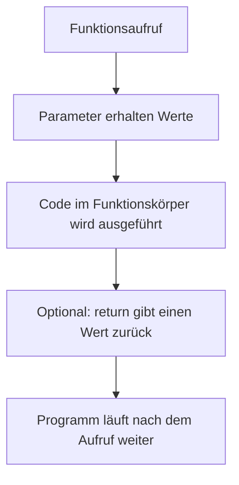
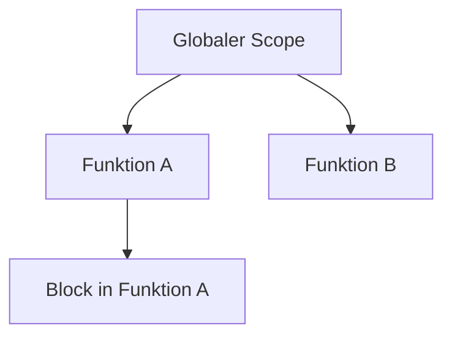
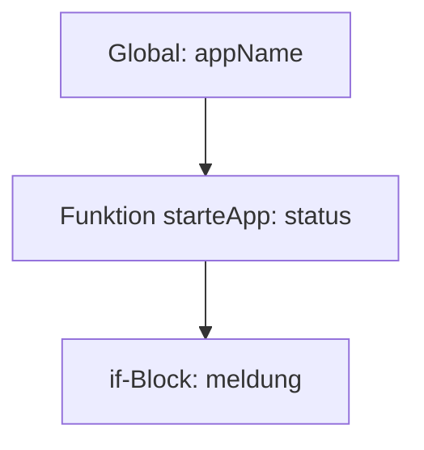

###### Themen

Funktionen in JavaScript

- Funktionen definieren und aufrufen
- Parameter übergeben und Rückgabewerte nutzen
- Unterschied zwischen wiederverwendbarem Code und direktem Code verstehen

Arrow Functions

- Grundlegende Syntax von Arrow Functions
- Einfache Unterschiede zu klassischen Funktionen kennenlernen

Scope – Grundlagen

- Unterschied zwischen globalem und lokalem Scope
- Bedeutung von let und const im Zusammenhang mit Sichtbarkeit von Variablen


<br><br><br>

# 🧩 Funktionen in JavaScript

Eine **Funktion** ist in JavaScript ein benannter oder auch unbenannter Codeblock, den du **einmal definierst** und **beliebig oft ausführen** kannst. Genau das macht Funktionen so wichtig: Du musst denselben Ablauf nicht immer wieder neu hinschreiben, sondern kapselst ihn an einer Stelle und rufst ihn bei Bedarf auf. JavaScript behandelt Funktionen außerdem als sogenannte **First-Class Citizens** – das heißt, du kannst sie in Variablen speichern, an andere Funktionen übergeben oder als Rückgabewert zurückgeben ([Functions – MDN](https://developer.mozilla.org/en-US/docs/Web/JavaScript/Guide/Functions)).

Stell dir eine Funktion wie ein kleines Werkzeug vor. Wenn du zum Beispiel öfter einen Preis berechnen, einen Text formatieren oder eine Begrüßung anzeigen willst, dann baust du dir dafür eine Funktion. Danach musst du nur noch dieses Werkzeug aufrufen.


<br><br><br>

## 🛠️ Funktionen definieren und aufrufen

Eine Funktion zu **definieren** bedeutet: Du beschreibst, **was sie tun soll**.  
Eine Funktion **aufzurufen** bedeutet: Du startest sie.

Die klassische Schreibweise sieht so aus:

```js
function begruesse() {
  console.log("Hallo!");
}
```

Hier passiert Folgendes:

- `function` sagt JavaScript: Jetzt kommt eine Funktionsdefinition.
- `begruesse` ist der Name der Funktion.
- Die runden Klammern `()` enthalten später mögliche Parameter.
- Die geschweiften Klammern `{}` enthalten den Code, der ausgeführt wird.

Aufgerufen wird sie so:

```js
begruesse();
```

Dann läuft der Code innerhalb der Funktion ab und in der Konsole erscheint:

```js
Hallo!
```

Wichtig ist: **Die Definition allein führt die Funktion noch nicht aus.**  
Erst der Aufruf startet sie.

Ein einfaches Beispiel:

```js
function zeigeLieblingssprache() {
  console.log("Meine Lieblingssprache ist JavaScript.");
}

zeigeLieblingssprache();
zeigeLieblingssprache();
zeigeLieblingssprache();
```

Die Funktion wird hier dreimal aufgerufen. Das ist genau der Vorteil: **einmal schreiben, mehrfach nutzen**.

Du kannst Funktionen auch erst definieren und viel später aufrufen:

```js
function sagHallo() {
  console.log("Hallo zusammen!");
}

// später im Code
sagHallo();
```

Bei einer **Funktionsdeklaration** wie oben kann die Funktion im selben Scope sogar schon vor ihrer Position im Quelltext aufgerufen werden, weil JavaScript diese Deklarationen verarbeitet, bevor der Code ausgeführt wird. Dieses Verhalten nennt man vereinfacht oft **Hoisting** ([function – MDN](https://developer.mozilla.org/en-US/docs/Web/JavaScript/Reference/Statements/function)).

Beispiel:

```js
hallo();

function hallo() {
  console.log("Das funktioniert.");
}
```

Für den Einstieg ist aber eine gute Regel: **Definiere Funktionen möglichst, bevor du sie benutzt.** Dann bleibt der Code leichter lesbar.


<br><br><br>

### 🔍 Was eine Funktion intern macht

Wenn du eine Funktion aufrufst, läuft vereinfacht dieser Ablauf ab:



Das ist wichtig für dein mentales Modell:

1. Die Funktion wird gestartet.
2. Sie bekommt eventuell Eingaben.
3. Sie verarbeitet diese Eingaben.
4. Sie gibt eventuell ein Ergebnis zurück.
5. Danach geht der restliche Code weiter.


<br><br><br>

## 📥 Parameter übergeben und Rückgabewerte nutzen

Sehr oft soll eine Funktion nicht immer dasselbe tun, sondern **mit unterschiedlichen Werten arbeiten**. Dafür gibt es **Parameter**.

Parameter sind Platzhalter in der Funktionsdefinition.  
**Argumente** sind die echten Werte, die du beim Aufruf übergibst ([Functions – MDN](https://developer.mozilla.org/en-US/docs/Web/JavaScript/Guide/Functions)).

Beispiel:

```js
function begruessePerson(name) {
  console.log("Hallo, " + name + "!");
}

begruessePerson("Mia");
begruessePerson("Ali");
```

Hier ist:

- `name` der **Parameter**
- `"Mia"` und `"Ali"` sind die **Argumente**

Die Ausgabe:

```js
Hallo, Mia!
Hallo, Ali!
```

So wird dieselbe Funktion flexibel.

Du kannst auch mehrere Parameter verwenden:

```js
function addiere(a, b) {
  console.log(a + b);
}

addiere(3, 4);
addiere(10, 5);
```

Das Ergebnis ist:

```js
7
15
```

Bis hierhin wurde das Ergebnis nur ausgegeben. Oft willst du einen Wert aber **nicht nur anzeigen**, sondern ihn **weiterverwenden**. Dafür gibt es `return`.

Mit `return` gibt eine Funktion einen Wert zurück und beendet ihre Ausführung an dieser Stelle ([return – MDN](https://developer.mozilla.org/en-US/docs/Web/JavaScript/Reference/Statements/return)).

Beispiel:

```js
function addiere(a, b) {
  return a + b;
}

let ergebnis = addiere(3, 4);
console.log(ergebnis);
```

Ausgabe:

```js
7
```

Der wichtige Unterschied ist:

- `console.log(...)` zeigt etwas an
- `return ...` gibt einen Wert an den Aufrufer zurück

Das wird am besten in einem direkten Vergleich klar:

```js
function berechneMitLog(a, b) {
  console.log(a + b);
}

function berechneMitReturn(a, b) {
  return a + b;
}

let wert1 = berechneMitLog(2, 3);
let wert2 = berechneMitReturn(2, 3);

console.log("wert1:", wert1);
console.log("wert2:", wert2);
```

Ausgabe:

```js
5
wert1: undefined
wert2: 5
```

Warum ist `wert1` gleich `undefined`?  
Weil die erste Funktion **keinen Rückgabewert** hat. Wenn eine Funktion nichts per `return` zurückgibt, ist das Ergebnis standardmäßig `undefined` ([return – MDN](https://developer.mozilla.org/en-US/docs/Web/JavaScript/Reference/Statements/return)).

Das ist ein sehr häufiger Anfängerfehler: Man denkt, `console.log()` sei schon das Ergebnis. Ist es aber nicht. Es ist nur eine Ausgabe.

Ein weiteres Beispiel aus der Praxis:

```js
function berechneMehrwertsteuer(preis) {
  return preis * 0.19;
}

function berechneEndpreis(nettopreis) {
  let steuer = berechneMehrwertsteuer(nettopreis);
  return nettopreis + steuer;
}

let endpreis = berechneEndpreis(100);
console.log(endpreis);
```

Hier siehst du sehr schön:

- Eine Funktion kann das Ergebnis einer anderen Funktion nutzen.
- Kleine, klare Funktionen machen Code besser verständlich.
- Mit Rückgabewerten kannst du Funktionen miteinander kombinieren.


<br><br><br>

### 🧠 Parameter und Rückgabewerte richtig verstehen

Es hilft, Funktionen wie kleine Maschinen zu sehen:

- **Parameter** sind die Eingaben
- **Code im Inneren** ist die Verarbeitung
- **Rückgabewert** ist das Ergebnis

```js
function quadriere(zahl) {
  return zahl * zahl;
}

let ergebnis = quadriere(5);
console.log(ergebnis);
```

Hier passiert:

- `5` geht als Eingabe in die Funktion
- die Funktion rechnet `5 * 5`
- `25` kommt mit `return` zurück
- `ergebnis` speichert `25`

Wenn du keinen Parameter übergibst, obwohl einer erwartet wird, dann bekommt dieser Parameter oft den Wert `undefined` ([Functions – MDN](https://developer.mozilla.org/en-US/docs/Web/JavaScript/Guide/Functions)).

```js
function begruesse(name) {
  console.log("Hallo, " + name);
}

begruesse();
```

Ausgabe:

```js
Hallo, undefined
```

Darum ist es wichtig, beim Aufruf zu überlegen: **Welche Eingaben braucht meine Funktion wirklich?**


<br><br><br>

## ♻️ Wiederverwendbarer Code und direkter Code

Jetzt kommt ein ganz zentraler Punkt für gutes Programmieren.

**Direkter Code** bedeutet: Du schreibst einen Ablauf einfach genau dort hin, wo du ihn gerade brauchst.

Beispiel:

```js
let preis1 = 100;
let steuer1 = preis1 * 0.19;
let endpreis1 = preis1 + steuer1;
console.log(endpreis1);

let preis2 = 200;
let steuer2 = preis2 * 0.19;
let endpreis2 = preis2 + steuer2;
console.log(endpreis2);

let preis3 = 300;
let steuer3 = preis3 * 0.19;
let endpreis3 = preis3 + steuer3;
console.log(endpreis3);
```

Das funktioniert. Aber der Code ist mehrfach fast identisch. Genau hier entstehen in echten Projekten schnell Probleme:

- viel Wiederholung
- Änderungen müssen an mehreren Stellen gemacht werden
- höheres Fehler-Risiko
- der Code wird unübersichtlich

Die bessere Lösung ist **wiederverwendbarer Code**:

```js
function berechneEndpreis(preis) {
  let steuer = preis * 0.19;
  return preis + steuer;
}

console.log(berechneEndpreis(100));
console.log(berechneEndpreis(200));
console.log(berechneEndpreis(300));
```

Jetzt steckt die Logik **an einer Stelle**. Wenn sich die Steuerlogik ändert, musst du nur diese eine Funktion anpassen.

Das ist einer der wichtigsten Grundgedanken in der Softwareentwicklung:  
**Nicht denselben Ablauf immer wieder hinschreiben, sondern abstrahieren.**

Eine Funktion hilft dir dabei,

- Logik zu bündeln,
- Namen für Abläufe zu vergeben,
- Wiederholungen zu vermeiden,
- Fehler leichter zu finden,
- Änderungen schneller durchzuführen.

Gerade beim Lernen ist das wichtig: Wenn du merkst, dass du denselben Code zum zweiten oder dritten Mal schreibst, ist das oft ein Hinweis darauf, dass eine Funktion sinnvoll wäre.

Hier ein direkter Vergleich:

| Ansatz | Eigenschaften |
|---|---|
| Direkter Code | schnell hingeschrieben, aber oft unübersichtlich und schwer wartbar |
| Wiederverwendbarer Code mit Funktionen | sauberer, besser erweiterbar, leichter testbar und verständlicher |

Ein guter Funktionsname macht außerdem viel aus. Statt:

```js
function machWas(x) {
  return x * 1.19;
}
```

ist das hier viel klarer:

```js
function berechnePreisMitSteuer(preis) {
  return preis * 1.19;
}
```

Der Name erklärt schon die Absicht. Genau das hilft dir und anderen später beim Lesen.


<br><br><br>

# ➡️ Pfeilfunktionen (Arrow Functions)

**Arrow Functions** heißen auf Deutsch meist **Pfeilfunktionen**. Sie sind eine kürzere Schreibweise für Funktionen und wurden mit ES6 eingeführt ([Arrow function expressions – MDN](https://developer.mozilla.org/en-US/docs/Web/JavaScript/Reference/Functions/Arrow_functions)).

Sie heißen so, weil sie den Pfeil `=>` verwenden.

Pfeilfunktionen sind besonders praktisch für kurze Funktionen, zum Beispiel bei kleinen Berechnungen oder beim Arbeiten mit Arrays. Trotzdem sollte man verstehen, dass sie **nicht einfach nur kürzer**, sondern in einigen Punkten auch **anders** sind.


<br><br><br>

## ✍️ Grundlegende Syntax von Pfeilfunktionen

Die einfachste Form sieht so aus:

```js
const begruesse = () => {
  console.log("Hallo!");
};
```

Das ist funktional ähnlich zu:

```js
function begruesse() {
  console.log("Hallo!");
}
```

Hier wird die Funktion in einer Variable gespeichert. Das ist sehr typisch bei Arrow Functions.

Ein Beispiel mit einem Parameter:

```js
const begruessePerson = name => {
  console.log("Hallo, " + name + "!");
};
```

Wenn genau **ein Parameter** vorhanden ist, darfst du die Klammern weglassen.  
Mit Klammern geht es aber auch:

```js
const begruessePerson = (name) => {
  console.log("Hallo, " + name + "!");
};
```

Bei **mehreren Parametern** sind Klammern Pflicht:

```js
const addiere = (a, b) => {
  return a + b;
};
```

Wenn die Funktion nur **einen einzigen Ausdruck** zurückgibt, kannst du die geschweiften Klammern und `return` weglassen. Dann wird der Wert **automatisch zurückgegeben** ([Arrow function expressions – MDN](https://developer.mozilla.org/en-US/docs/Web/JavaScript/Reference/Functions/Arrow_functions)).

```js
const addiere = (a, b) => a + b;
```

Das ist dasselbe wie:

```js
const addiere = (a, b) => {
  return a + b;
};
```

Ein paar typische Formen im Überblick:

| Schreibweise | Beispiel |
|---|---|
| Keine Parameter | `const hallo = () => "Hallo";` |
| Ein Parameter | `const doppelt = x => x * 2;` |
| Mehrere Parameter | `const addiere = (a, b) => a + b;` |
| Mehrere Anweisungen | `const test = x => { const y = x * 2; return y; };` |

Wichtig ist: Sobald du einen Funktionskörper mit `{ ... }` schreibst, brauchst du für ein Ergebnis meistens auch wieder ein `return`.

Beispiel:

```js
const falsch = (a, b) => {
  a + b;
};

console.log(falsch(2, 3));
```

Das liefert:

```js
undefined
```

Warum?  
Weil innerhalb der geschweiften Klammern **kein `return`** steht.

Richtig wäre:

```js
const richtig = (a, b) => {
  return a + b;
};
```


<br><br><br>

### 🔄 Klassische Funktion und Pfeilfunktion im Vergleich

```js
function multipliziere(a, b) {
  return a * b;
}

const multipliziereKurz = (a, b) => a * b;
```

Beide machen dasselbe. Die zweite Variante ist einfach kompakter.

Für kurze, klare Logik ist das angenehm.  
Für längere oder komplexere Abläufe kann die klassische Schreibweise manchmal lesbarer sein. Guter Code ist nicht automatisch der kürzeste Code, sondern der verständlichste.


<br><br><br>

## ⚖️ Einfache Unterschiede zu klassischen Funktionen

Pfeilfunktionen sind nicht nur eine kürzere Schreibweise. Es gibt ein paar wichtige Unterschiede.

| Thema | Klassische Funktion | Pfeilfunktion |
|---|---|---|
| Syntax | ausführlicher | kürzer |
| Eigenes `this` | ja | nein |
| Eigenes `arguments` | ja | nein |
| Als Konstruktor mit `new` nutzbar | ja | nein |

Der wichtigste Unterschied im Alltag ist: **Pfeilfunktionen haben kein eigenes `this`**. Stattdessen übernehmen sie `this` aus dem umgebenden Kontext ([Arrow function expressions – MDN](https://developer.mozilla.org/en-US/docs/Web/JavaScript/Reference/Functions/Arrow_functions)).

Für den Einstieg reicht dieses Verständnis:

- Eine klassische Funktion bekommt ihr eigenes `this`.
- Eine Pfeilfunktion „leiht“ sich `this` von außen.

Das ist besonders wichtig bei Objekten.

Beispiel mit klassischer Funktion:

```js
const person = {
  name: "Lena",
  sagName: function () {
    console.log(this.name);
  }
};

person.sagName();
```

Ausgabe:

```js
Lena
```

Hier zeigt `this` auf das Objekt `person`.

Wenn du stattdessen eine Pfeilfunktion als Methode verwendest, kann das problematisch werden:

```js
const person = {
  name: "Lena",
  sagName: () => {
    console.log(this.name);
  }
};

person.sagName();
```

Hier ist `this` **nicht** das Objekt `person`, weil die Pfeilfunktion kein eigenes `this` hat. Deshalb sind Arrow Functions als Objektmethoden oft nicht die richtige Wahl, wenn du auf Eigenschaften des Objekts über `this` zugreifen willst ([Arrow function expressions – MDN](https://developer.mozilla.org/en-US/docs/Web/JavaScript/Reference/Functions/Arrow_functions)).

Ein weiterer Unterschied: Pfeilfunktionen haben kein eigenes `arguments`-Objekt. Wenn du alle übergebenen Werte flexibel sammeln willst, nutzt du heute meist **Rest-Parameter** wie `(...args)`.

```js
const zeigeAlle = (...werte) => {
  console.log(werte);
};

zeigeAlle(1, 2, 3);
```

Außerdem können Pfeilfunktionen **nicht als Konstruktoren** mit `new` verwendet werden ([Arrow function expressions – MDN](https://developer.mozilla.org/en-US/docs/Web/JavaScript/Reference/Functions/Arrow_functions)).

Für die Grundlagen kannst du dir diese Faustregel merken:

- **Klassische Funktionen**: gut für allgemeine Funktionen und Methoden mit `this`
- **Pfeilfunktionen**: gut für kurze Funktionen und Stellen, an denen du bewusst das äußere `this` behalten willst


<br><br><br>

# 🔍 Scope – Grundlagen (Sichtbarkeitsbereiche)

**Scope** bedeutet auf Deutsch ungefähr **Gültigkeitsbereich** oder **Sichtbarkeitsbereich**. Gemeint ist damit:  
**Wo im Code kann auf eine Variable oder Funktion zugegriffen werden?** ([Scope – MDN Glossary](https://developer.mozilla.org/en-US/docs/Glossary/Scope)).

Das ist ein Kernkonzept in JavaScript. Viele Fehler entstehen nicht dadurch, dass etwas falsch berechnet wird, sondern weil eine Variable **an der Stelle gar nicht sichtbar** ist, an der man sie benutzen will.

Wenn du Scope verstehst, verstehst du besser:

- warum manche Variablen überall verfügbar sind,
- warum andere nur in einer Funktion existieren,
- warum `let` und `const` so wichtig sind,
- warum Ordnung im Code entscheidend ist.


<br><br><br>

## 🌍 Unterschied zwischen globalem und lokalem Scope

Der **globale Scope** ist der Bereich, der außerhalb von Funktionen oder bestimmten Blöcken liegt. Eine dort deklarierte Variable kann grundsätzlich an vielen Stellen verwendet werden, abhängig vom Kontext der Laufzeitumgebung ([Scope – MDN Glossary](https://developer.mozilla.org/en-US/docs/Glossary/Scope)).

Beispiel:

```js
let sprache = "JavaScript";

function zeigeSprache() {
  console.log(sprache);
}

zeigeSprache();
console.log(sprache);
```

Hier ist `sprache` global sichtbar. Sowohl innerhalb der Funktion als auch außerhalb kann darauf zugegriffen werden.

Der **lokale Scope** ist ein kleinerer Bereich innerhalb des Codes, zum Beispiel innerhalb einer Funktion.

```js
function testeLokal() {
  let nachricht = "Ich bin lokal";
  console.log(nachricht);
}

testeLokal();
console.log(nachricht);
```

Die letzte Zeile führt zu einem Fehler, weil `nachricht` nur **innerhalb** der Funktion existiert.

Das ist der Kern von lokalem Scope:  
**Was innen definiert wird, ist nicht automatisch außen sichtbar.**

Funktionen erzeugen ihren eigenen Scope. Variablen, die du darin mit `let`, `const` oder auch `var` deklarierst, gehören zunächst zu diesem Bereich.

Ein anschauliches Bild:



Die Sichtbarkeit funktioniert grob so:

- Innen kann man oft auf Außen zugreifen.
- Außen kann man nicht einfach auf Innen zugreifen.

Beispiel:

```js
let außen = "außen";

function beispiel() {
  let innen = "innen";
  console.log(außen); // funktioniert
  console.log(innen); // funktioniert
}

beispiel();
console.log(außen); // funktioniert
console.log(innen); // Fehler
```

Das ist eine sehr wichtige Regel:  
**Innere Bereiche kennen oft äußere Variablen, aber äußere Bereiche kennen innere Variablen nicht.**

Das nennt man auch verschachtelte Scopes oder lexikalische Sichtbarkeit. Eine Funktion kann auf Variablen zugreifen, die in ihrem äußeren Umfeld definiert wurden ([Closures – MDN](https://developer.mozilla.org/en-US/docs/Web/JavaScript/Guide/Closures)).

Ein weiterer wichtiger Punkt: Auch Blöcke wie `if`, `for` oder `while` können einen eigenen Scope bilden – jedenfalls für `let` und `const`.

```js
if (true) {
  let text = "nur hier sichtbar";
  console.log(text);
}

console.log(text); // Fehler
```

Deshalb spricht man heute nicht nur von globalem und lokalem Scope, sondern oft auch von **Block-Scope**.


<br><br><br>

### 🏠 Scope wie Räume in einem Haus

Ein sehr hilfreiches Bild ist dieses:

- Der **globale Scope** ist das ganze Haus.
- Eine **Funktion** ist ein Zimmer.
- Ein **Block** wie `if` oder `for` ist vielleicht ein kleiner abgeschlossener Bereich im Zimmer.

Wenn eine Variable im Hausflur liegt, kann man sie aus einem Zimmer oft noch holen.  
Wenn sie aber in einem bestimmten Zimmer liegt, liegt sie **nicht automatisch im ganzen Haus** herum.

Genau so arbeitet Scope.

Beispiel:

```js
let haus = "Ich liege im Haus";

function zimmer() {
  let schrank = "Ich liege im Zimmer";
  console.log(haus);
  console.log(schrank);
}

zimmer();
```

Das funktioniert. Aber außerhalb von `zimmer()` ist `schrank` nicht zugänglich.


<br><br><br>

## 🔐 Bedeutung von `let` und `const` im Zusammenhang mit Sichtbarkeit von Variablen

`let` und `const` sind moderne Möglichkeiten, Variablen zu deklarieren. Beide sind **block-sichtbar**. Das bedeutet: Sie gelten nur in dem Block, in dem sie definiert wurden, also zum Beispiel innerhalb einer Funktion, einer Schleife oder eines `if`-Blocks ([let – MDN](https://developer.mozilla.org/en-US/docs/Web/JavaScript/Reference/Statements/let), [const – MDN](https://developer.mozilla.org/en-US/docs/Web/JavaScript/Reference/Statements/const)).

Beispiel mit `let`:

```js
if (true) {
  let zahl = 42;
  console.log(zahl);
}

console.log(zahl); // Fehler
```

Beispiel mit `const`:

```js
if (true) {
  const pi = 3.14;
  console.log(pi);
}

console.log(pi); // Fehler
```

In Bezug auf **Sichtbarkeit** verhalten sich `let` und `const` also gleich:

- beide sind block-scoped
- beide sind nicht außerhalb des Blocks sichtbar
- beide helfen dabei, Variablen sauber zu begrenzen

Der Unterschied zwischen ihnen liegt nicht im Scope, sondern vor allem darin, **ob du den Variablennamen später neu zuweisen darfst**:

- `let`: Neuzuweisung erlaubt
- `const`: Neuzuweisung nicht erlaubt ([const – MDN](https://developer.mozilla.org/en-US/docs/Web/JavaScript/Reference/Statements/const))

Beispiel:

```js
let punkte = 10;
punkte = 20; // erlaubt

const land = "Deutschland";
land = "Österreich"; // Fehler
```

Wichtig: Bei `const` ist die **Bindung** konstant, nicht automatisch der gesamte Inhalt eines Objekts oder Arrays.

```js
const person = { name: "Mia" };
person.name = "Ali"; // erlaubt

const zahlen = [1, 2, 3];
zahlen.push(4); // erlaubt
```

Nicht erlaubt wäre:

```js
const person = { name: "Mia" };
person = { name: "Ali" }; // Fehler
```

Für die Grundlagen beim Lernen ist diese Denkweise sehr sinnvoll:

- Nutze **`const` standardmäßig**, wenn sich die Referenz nicht ändern soll.
- Nutze **`let`**, wenn du bewusst später einen neuen Wert zuweisen willst.

So wird dein Code klarer und du vermeidest versehentliche Änderungen.

Ein sehr wichtiger Zusammenhang zwischen Sichtbarkeit und `let`/`const` ist, dass beide **nicht vor ihrer Deklaration normal verwendet werden können**. Sie befinden sich bis zur Deklaration in einer sogenannten **Temporal Dead Zone** ([let – MDN](https://developer.mozilla.org/en-US/docs/Web/JavaScript/Reference/Statements/let), [const – MDN](https://developer.mozilla.org/en-US/docs/Web/JavaScript/Reference/Statements/const)).

Beispiel:

```js
console.log(name);
let name = "Mia";
```

Das führt zu einem Fehler.

Für Anfänger ist die praktische Regel einfach:  
**Deklariere `let` und `const` immer, bevor du sie benutzt.**

Das macht deinen Code nicht nur korrekt, sondern auch lesbarer.


<br><br><br>

### 🧱 Warum `let` und `const` besser zur Sichtbarkeit passen als ungeordnete Variablen

Wenn Variablen zu großflächig sichtbar sind, wird Code schwer zu verstehen. Dann kann theoretisch fast jede Stelle im Programm den Wert verändern. Das macht Fehlersuche unnötig schwierig.

Mit `let` und `const` kannst du Variablen bewusst **nah an dem Ort halten, an dem sie gebraucht werden**.

Beispiel:

```js
function berechnePreis(preis) {
  const steuersatz = 0.19;
  const steuer = preis * steuersatz;
  const endpreis = preis + steuer;
  return endpreis;
}
```

Das ist gut lesbar, weil:

- `steuersatz`, `steuer` und `endpreis` nur dort sichtbar sind, wo sie gebraucht werden
- außerhalb der Funktion kann niemand versehentlich damit arbeiten
- die Funktion ist in sich abgeschlossen

So lernst du ganz automatisch eine gute Denkweise:  
**Variablen sollten so klein wie möglich sichtbar sein, aber so groß wie nötig.**


<br><br><br>

### 👀 Lokaler, globaler und Block-Scope in einem gemeinsamen Beispiel

```js
const appName = "LernApp"; // global

function starteApp() {
  const status = "gestartet"; // lokal zur Funktion

  if (status === "gestartet") {
    let meldung = "Die App läuft"; // block-sichtbar
    console.log(appName);  // global sichtbar
    console.log(status);   // aus Funktions-Scope sichtbar
    console.log(meldung);  // aus Block-Scope sichtbar
  }

  console.log(appName);  // sichtbar
  console.log(status);   // sichtbar
  console.log(meldung);  // Fehler
}

starteApp();

console.log(appName); // sichtbar
console.log(status);  // Fehler
```

Dieses Beispiel zeigt die Hierarchie sehr gut:

- `appName` liegt global und ist daher an vielen Stellen sichtbar
- `status` lebt nur in `starteApp()`
- `meldung` lebt nur im `if`-Block

Du kannst dir das wie konzentrische Bereiche vorstellen:



Je weiter innen eine Variable definiert wird, desto kleiner ist ihr Sichtbarkeitsbereich.


<br><br><br>

### 🧭 Gute Denkweise für Core Tech Fundamentals

Wenn du JavaScript-Grundlagen wirklich sauber lernen willst, dann betrachte Funktionen und Scope immer zusammen.

Eine Funktion ist nicht nur ein Codeblock zum Wiederverwenden. Sie ist auch ein **eigener Denk- und Arbeitsbereich**:

- Sie nimmt Eingaben an.
- Sie verarbeitet Daten.
- Sie gibt ein Ergebnis zurück.
- Sie schützt innere Variablen vor unnötigem Zugriff von außen.

Genau dadurch entsteht strukturierter Code.

Besonders beim richtigen Lernen hilft dir folgende Sichtweise:

1. **Verstehe erst den Ablauf**: Was soll die Funktion tun?
2. **Bestimme die Eingaben**: Welche Parameter braucht sie?
3. **Bestimme das Ergebnis**: Was soll zurückgegeben werden?
4. **Begrenze Variablen bewusst**: Was muss wirklich außerhalb sichtbar sein?
5. **Wähle die passende Schreibweise**: klassische Funktion oder Pfeilfunktion

Wenn du diese Punkte mitdenkst, lernst du nicht nur Syntax auswendig, sondern verstehst die eigentliche Architektur hinter JavaScript-Code.