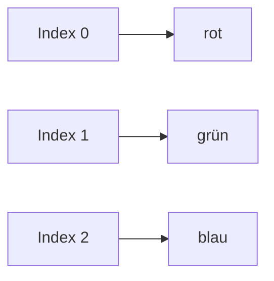
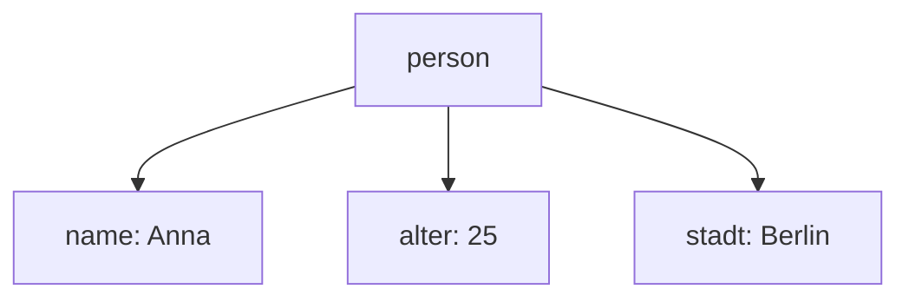

###### Themen

Arrays

- Arrays anlegen und auf Elemente zugreifen
- Arrays mit Schleifen und forEach durchlaufen
- Einfache Array-Methoden anwenden

Objekte

- Objekte erstellen und auf Eigenschaften zugreifen
- Eigenschaften hinzufügen und ändern
- Unterschied zwischen Arrays und Objekten verstehen

<br><br><br>
# 🧠 Arrays und Objekte in JavaScript

Arrays und Objekte gehören zu den wichtigsten Grundlagen in JavaScript. Wenn du sie wirklich verstehst, wird dir später fast alles leichter fallen: Schleifen, Funktionen, DOM-Manipulation, APIs, Datenverarbeitung und sogar Frameworks wie React oder Vue bauen ständig auf diesen Konzepten auf.

Man kann sich beide Datentypen als **Behälter für Daten** vorstellen. Der Unterschied ist aber, **wie** diese Daten gespeichert und angesprochen werden:

- **Arrays** speichern Werte in einer **geordneten Reihenfolge**
- **Objekte** speichern Werte als **Eigenschaftspaare aus Schlüssel und Wert**

Damit du den Unterschied sauber verstehst, schauen wir uns beide nacheinander an.


<br><br><br>
## 📦 Arrays

Ein Array ist eine **geordnete Liste von Werten**. Diese Werte können Zahlen, Texte, Booleans, andere Arrays oder sogar Objekte sein. In JavaScript werden Array-Elemente über ihren **Index** angesprochen, und dieser beginnt immer bei **0** ([Indexed collections](https://developer.mozilla.org/en-US/docs/Web/JavaScript/Guide/Indexed_collections)).

Das ist ein ganz wichtiger Punkt: Das **erste Element** liegt nicht bei Position 1, sondern bei Position 0.


<br><br><br>
### 🛠️ Arrays anlegen und auf Elemente zugreifen

Ein Array legst du mit **eckigen Klammern `[]`** an.

```js
const farben = ["rot", "grün", "blau"];
```

Hier enthält das Array drei Werte:

- `"rot"`
- `"grün"`
- `"blau"`

Da Arrays geordnet sind, hat jedes Element einen festen Platz:

- `"rot"` liegt an Index `0`
- `"grün"` liegt an Index `1`
- `"blau"` liegt an Index `2`

Auf ein einzelnes Element greifst du zu, indem du den Index in eckigen Klammern angibst:

```js
const farben = ["rot", "grün", "blau"];

console.log(farben[0]); // rot
console.log(farben[1]); // grün
console.log(farben[2]); // blau
```

Wenn du auf einen Index zugreifst, der nicht existiert, bekommst du `undefined` zurück.

```js
const farben = ["rot", "grün", "blau"];

console.log(farben[5]); // undefined
```

Die Anzahl der Elemente in einem Array bekommst du über die Eigenschaft `.length` ([Array](https://developer.mozilla.org/en-US/docs/Web/JavaScript/Reference/Global_Objects/Array)).

```js
const farben = ["rot", "grün", "blau"];

console.log(farben.length); // 3
```

Du kannst Array-Werte auch ändern, indem du einem Index einen neuen Wert zuweist:

```js
const farben = ["rot", "grün", "blau"];

farben[1] = "gelb";

console.log(farben); // ["rot", "gelb", "blau"]
```

Arrays können gemischte Datentypen enthalten, auch wenn man das in sauberem Code meist nur dann macht, wenn es wirklich sinnvoll ist.

```js
const daten = ["Anna", 25, true];
```

Für den Einstieg ist es aber oft besser, Arrays möglichst **einheitlich** zu halten, also zum Beispiel nur Zahlen oder nur Namen in einem Array zu speichern. Das macht den Code verständlicher.


<br><br><br>
### 👀 So kannst du dir ein Array vorstellen



Ein Array ist also wie eine Reihe von Fächern, die nummeriert sind. Du holst dir einen Wert, indem du seine Nummer kennst.


<br><br><br>
### 🔁 Arrays mit Schleifen und `forEach` durchlaufen

Sehr oft willst du nicht nur ein einzelnes Element lesen, sondern **alle Elemente nacheinander verarbeiten**. Genau dafür verwendet man Schleifen.

Es gibt mehrere Möglichkeiten, ein Array zu durchlaufen. Für den Einstieg sind vor allem diese beiden wichtig:

- die klassische `for`-Schleife
- die Methode `forEach()`

`forEach()` führt für jedes Element im Array eine Funktion aus ([Array.prototype.forEach()](https://developer.mozilla.org/en-US/docs/Web/JavaScript/Reference/Global_Objects/Array/forEach)).


<br><br><br>
### 🔁 Die klassische `for`-Schleife

Die klassische `for`-Schleife ist besonders nützlich, wenn du mit Indizes arbeiten willst.

```js
const farben = ["rot", "grün", "blau"];

for (let i = 0; i < farben.length; i++) {
  console.log(i, farben[i]);
}
```

Was passiert hier genau?

1. `let i = 0`  
   Die Schleife startet beim ersten Index.

2. `i < farben.length`  
   Die Schleife läuft so lange, wie `i` kleiner als die Array-Länge ist.

3. `i++`  
   Nach jedem Durchlauf wird `i` um 1 erhöht.

Im Ergebnis werden alle Elemente nacheinander ausgegeben:

```js
0 "rot"
1 "grün"
2 "blau"
```

Der große Vorteil der `for`-Schleife ist: Du hast **volle Kontrolle**. Du kannst vorwärts, rückwärts oder in größeren Schritten durch das Array gehen.

Zum Beispiel rückwärts:

```js
const farben = ["rot", "grün", "blau"];

for (let i = farben.length - 1; i >= 0; i--) {
  console.log(farben[i]);
}
```


<br><br><br>
### 🔂 `forEach()` einfach erklärt

`forEach()` ist eine Array-Methode. Sie läuft automatisch durch jedes Element des Arrays und ruft für jedes Element eine Funktion auf ([Array.prototype.forEach()](https://developer.mozilla.org/en-US/docs/Web/JavaScript/Reference/Global_Objects/Array/forEach)).

```js
const farben = ["rot", "grün", "blau"];

farben.forEach(function(farbe) {
  console.log(farbe);
});
```

Das Ergebnis:

```js
rot
grün
blau
```

Moderne Schreibweise mit Arrow Function:

```js
const farben = ["rot", "grün", "blau"];

farben.forEach((farbe) => {
  console.log(farbe);
});
```

Du kannst dir `forEach()` so merken:

> „Für jedes Element im Array führe bitte diesen Code aus.“

Sehr oft will man nicht nur das Element, sondern auch den Index haben. Auch das ist möglich:

```js
const farben = ["rot", "grün", "blau"];

farben.forEach((farbe, index) => {
  console.log(index, farbe);
});
```

Hier ist:

- `farbe` das aktuelle Element
- `index` die Position im Array

Das Ergebnis:

```js
0 "rot"
1 "grün"
2 "blau"
```


<br><br><br>
### ⚖️ `for` oder `forEach()`?

Beide sind richtig, aber sie haben leicht unterschiedliche Einsatzgebiete.

| Methode | Wann sinnvoll? | Vorteil |
|---|---|---|
| `for` | Wenn du den Index aktiv brauchst oder volle Kontrolle willst | flexibel |
| `forEach()` | Wenn du einfach alle Elemente nacheinander verarbeiten willst | sehr lesbar |

Ein wichtiger Punkt: `forEach()` ist bequem, aber nicht immer so flexibel wie eine klassische Schleife. Zum Beispiel kannst du sie nicht so einfach mit `break` vorzeitig beenden wie eine normale `for`-Schleife ([Array.prototype.forEach()](https://developer.mozilla.org/en-US/docs/Web/JavaScript/Reference/Global_Objects/Array/forEach)).

Für Anfänger ist die wichtigste Regel:

- Wenn du das Prinzip von Schleifen lernen willst, lerne zuerst `for`
- Wenn du sauberen, gut lesbaren Code für „jedes Element nacheinander“ schreiben willst, ist `forEach()` oft sehr angenehm


<br><br><br>
### 🧰 Einfache Array-Methoden anwenden

JavaScript-Arrays haben viele eingebaute Methoden, mit denen du Daten verändern oder prüfen kannst ([Array](https://developer.mozilla.org/en-US/docs/Web/JavaScript/Reference/Global_Objects/Array)).

Für den Einstieg sind besonders diese Methoden wichtig:


<br><br><br>
### ➕ `push()` – am Ende hinzufügen

Mit `push()` fügst du ein Element **hinten** an das Array an ([Array.prototype.push()](https://developer.mozilla.org/en-US/docs/Web/JavaScript/Reference/Global_Objects/Array/push)).

```js
const tiere = ["Hund", "Katze"];

tiere.push("Maus");

console.log(tiere); // ["Hund", "Katze", "Maus"]
```

Das ist nützlich, wenn du eine Liste Schritt für Schritt aufbauen willst.


<br><br><br>
### ➖ `pop()` – letztes Element entfernen

Mit `pop()` entfernst du das **letzte** Element aus dem Array ([Array.prototype.pop()](https://developer.mozilla.org/en-US/docs/Web/JavaScript/Reference/Global_Objects/Array/pop)).

```js
const tiere = ["Hund", "Katze", "Maus"];

tiere.pop();

console.log(tiere); // ["Hund", "Katze"]
```

`pop()` gibt das entfernte Element auch zurück:

```js
const tiere = ["Hund", "Katze", "Maus"];
const entfernt = tiere.pop();

console.log(entfernt); // "Maus"
```


<br><br><br>
### ⬅️ `shift()` – erstes Element entfernen

Mit `shift()` entfernst du das **erste** Element ([Array.prototype.shift()](https://developer.mozilla.org/en-US/docs/Web/JavaScript/Reference/Global_Objects/Array/shift)).

```js
const zahlen = [10, 20, 30];

zahlen.shift();

console.log(zahlen); // [20, 30]
```


<br><br><br>
### ➡️ `unshift()` – vorne hinzufügen

Mit `unshift()` fügst du ein Element **am Anfang** ein ([Array.prototype.unshift()](https://developer.mozilla.org/en-US/docs/Web/JavaScript/Reference/Global_Objects/Array/unshift)).

```js
const zahlen = [20, 30];

zahlen.unshift(10);

console.log(zahlen); // [10, 20, 30]
```


<br><br><br>
### 🔎 `includes()` – prüfen, ob ein Wert enthalten ist

Mit `includes()` prüfst du, ob ein bestimmter Wert im Array vorkommt ([Array.prototype.includes()](https://developer.mozilla.org/en-US/docs/Web/JavaScript/Reference/Global_Objects/Array/includes)).

```js
const farben = ["rot", "grün", "blau"];

console.log(farben.includes("grün")); // true
console.log(farben.includes("gelb")); // false
```

Das ist sehr praktisch, wenn du schnell wissen willst, ob ein Wert vorhanden ist.


<br><br><br>
### ✂️ `slice()` – Teil eines Arrays herausholen

Mit `slice()` erzeugst du ein **neues Array** mit einem Ausschnitt aus dem ursprünglichen Array, ohne das Original zu verändern ([Array.prototype.slice()](https://developer.mozilla.org/en-US/docs/Web/JavaScript/Reference/Global_Objects/Array/slice)).

```js
const zahlen = [10, 20, 30, 40, 50];

const ausschnitt = zahlen.slice(1, 4);

console.log(ausschnitt); // [20, 30, 40]
console.log(zahlen);     // [10, 20, 30, 40, 50]
```

Wichtig dabei:

- Startindex ist inklusive
- Endindex ist exklusiv

Also: `slice(1, 4)` bedeutet „von Index 1 bis vor Index 4“.


<br><br><br>
### 🔗 `join()` – Array in Text umwandeln

Mit `join()` verbindest du alle Elemente zu einem String ([Array.prototype.join()](https://developer.mozilla.org/en-US/docs/Web/JavaScript/Reference/Global_Objects/Array/join)).

```js
const worte = ["Hallo", "du", "da"];

console.log(worte.join(" ")); // "Hallo du da"
console.log(worte.join("-")); // "Hallo-du-da"
```

Das ist nützlich, wenn du Inhalte für Ausgaben oder Textdarstellung vorbereiten willst.


<br><br><br>
### 📌 Wichtige Denkweise bei Arrays

Wenn du mit Arrays arbeitest, solltest du dir immer diese Fragen stellen:

1. **Ist die Reihenfolge wichtig?**
2. **Greife ich über eine Position zu?**
3. **Will ich viele ähnliche Werte als Liste speichern?**

Wenn du diese Fragen mit „ja“ beantwortest, ist ein Array meistens die richtige Wahl.


<br><br><br>
## 🧱 Objekte

Ein Objekt speichert Daten nicht über feste Positionen wie ein Array, sondern über **Eigenschaften**. Eine Eigenschaft besteht aus einem **Schlüssel** und einem **Wert**. In JavaScript sind Objekte die zentrale Struktur, um zusammengehörige Informationen zu beschreiben ([Working with objects](https://developer.mozilla.org/en-US/docs/Web/JavaScript/Guide/Working_with_objects)).

Ein Objekt passt sehr gut zu Dingen wie:

- eine Person
- ein Produkt
- ein Benutzerkonto
- eine Bestellung
- ein Auto

Denn solche Dinge haben Eigenschaften mit Namen.


<br><br><br>
### 🏗️ Objekte erstellen und auf Eigenschaften zugreifen

Ein Objekt legst du mit **geschweiften Klammern `{}`** an.

```js
const person = {
  name: "Anna",
  alter: 25,
  stadt: "Berlin"
};
```

Dieses Objekt hat drei Eigenschaften:

- `name`
- `alter`
- `stadt`

Jede Eigenschaft hat einen Wert:

- `name` → `"Anna"`
- `alter` → `25`
- `stadt` → `"Berlin"`

Auf Eigenschaften kannst du auf zwei Arten zugreifen:

1. **Punktnotation**
2. **Bracket-Notation** mit eckigen Klammern

Die Punktnotation ist die häufigste und meist am leichtesten lesbare Schreibweise ([Property accessors](https://developer.mozilla.org/en-US/docs/Web/JavaScript/Reference/Operators/Property_accessors)).

```js
const person = {
  name: "Anna",
  alter: 25,
  stadt: "Berlin"
};

console.log(person.name);  // Anna
console.log(person.alter); // 25
```

Die Bracket-Notation funktioniert mit Strings:

```js
const person = {
  name: "Anna",
  alter: 25,
  stadt: "Berlin"
};

console.log(person["name"]);  // Anna
console.log(person["stadt"]); // Berlin
```

Beide Varianten greifen auf dieselben Daten zu. Der Unterschied ist vor allem praktisch:

- **Punktnotation** nutzt man, wenn der Eigenschaftsname fest bekannt ist
- **Bracket-Notation** nutzt man, wenn der Name dynamisch ist oder Sonderzeichen enthält

Beispiel mit einer Variablen:

```js
const person = {
  name: "Anna",
  alter: 25
};

const eigenschaft = "name";

console.log(person[eigenschaft]); // Anna
```

Mit Punktnotation würde das hier **nicht** funktionieren:

```js
console.log(person.eigenschaft); // sucht nach "eigenschaft", nicht nach "name"
```

Das ist ein sehr wichtiger Unterschied.


<br><br><br>
### 🧠 So kannst du dir ein Objekt vorstellen



Ein Objekt funktioniert also nicht wie eine nummerierte Liste, sondern eher wie ein Datensatz mit benannten Feldern.


<br><br><br>
### ✏️ Eigenschaften hinzufügen und ändern

Objekte sind in JavaScript sehr flexibel. Du kannst nachträglich neue Eigenschaften hinzufügen oder bestehende Werte verändern ([Working with objects](https://developer.mozilla.org/en-US/docs/Web/JavaScript/Guide/Working_with_objects)).

Neue Eigenschaft hinzufügen:

```js
const person = {
  name: "Anna",
  alter: 25
};

person.stadt = "Berlin";

console.log(person);
```

Ergebnis:

```js
{
  name: "Anna",
  alter: 25,
  stadt: "Berlin"
}
```

Bestehende Eigenschaft ändern:

```js
const person = {
  name: "Anna",
  alter: 25
};

person.alter = 26;

console.log(person.alter); // 26
```

Das funktioniert auch mit Bracket-Notation:

```js
const person = {
  name: "Anna"
};

person["beruf"] = "Entwicklerin";

console.log(person.beruf); // Entwicklerin
```

Wenn du auf eine Eigenschaft zugreifst, die nicht existiert, bekommst du wie bei Arrays `undefined` zurück:

```js
const person = {
  name: "Anna"
};

console.log(person.hobby); // undefined
```


<br><br><br>
### 🗑️ Eigenschaften entfernen

Auch das Entfernen von Eigenschaften solltest du zumindest kennen. Dafür gibt es den Operator `delete` ([delete operator](https://developer.mozilla.org/en-US/docs/Web/JavaScript/Reference/Operators/delete)).

```js
const person = {
  name: "Anna",
  alter: 25,
  stadt: "Berlin"
};

delete person.stadt;

console.log(person); // { name: "Anna", alter: 25 }
```

Im Alltag wird `delete` nicht in jedem Projekt ständig verwendet, aber das Prinzip ist wichtig: Objekte können sich verändern, indem Eigenschaften hinzukommen, geändert oder entfernt werden.


<br><br><br>
### 🪆 Objekte können auch komplexer sein

Objekte können andere Objekte oder Arrays enthalten. Das ist in echter Software sehr häufig der Fall.

```js
const benutzer = {
  name: "Ali",
  alter: 30,
  hobbies: ["Lesen", "Radfahren"],
  adresse: {
    stadt: "Hamburg",
    plz: "20095"
  }
};
```

Zugriff auf verschachtelte Werte:

```js
console.log(benutzer.hobbies[0]);      // Lesen
console.log(benutzer.adresse.stadt);   // Hamburg
```

Hier siehst du sehr schön, wie Arrays und Objekte in der Praxis zusammenarbeiten:

- `hobbies` ist ein Array
- `adresse` ist ein Objekt


<br><br><br>
## ⚖️ Unterschied zwischen Arrays und Objekten verstehen

Das ist einer der wichtigsten Punkte überhaupt. Viele Anfänger sehen zuerst nur: „Beides speichert doch Daten.“ Das stimmt zwar, aber der eigentliche Unterschied liegt in der **Struktur** und im **Zugriffsprinzip**.

Arrays und Objekte sind in JavaScript eng verwandt; technisch gesehen sind Arrays eine spezielle Art von Objekt, aber sie sind für geordnete Listen gedacht und sollten auch so verwendet werden ([Array](https://developer.mozilla.org/en-US/docs/Web/JavaScript/Reference/Global_Objects/Array)).

Der praktische Unterschied ist:

- **Array** = Daten über **Positionen / Reihenfolge**
- **Objekt** = Daten über **Namen / Eigenschaften**


<br><br><br>
### 📚 Vergleich in einfacher Sprache

Stell dir vor, du willst drei Farben speichern.

Als Array:

```js
const farben = ["rot", "grün", "blau"];
```

Hier ist wichtig:

- welches Element an erster Stelle steht
- welches an zweiter Stelle steht
- welches an dritter Stelle steht

Du greifst so zu:

```js
farben[0]
farben[1]
farben[2]
```

Jetzt stell dir vor, du willst Daten über eine Person speichern.

Als Objekt:

```js
const person = {
  name: "Anna",
  alter: 25,
  stadt: "Berlin"
};
```

Hier ist wichtig:

- wie die Eigenschaft heißt
- was sie bedeutet

Du greifst so zu:

```js
person.name
person.alter
person.stadt
```

Du siehst also:

- Beim Array interessiert dich die **Reihenfolge**
- Beim Objekt interessiert dich die **Bedeutung des Feldes**


<br><br><br>
### 🆚 Direkter Vergleich in einer Tabelle

| Merkmal | Array | Objekt |
|---|---|---|
| Struktur | geordnete Liste | Sammlung von Eigenschaften |
| Zugriff | über Index (`[0]`, `[1]`) | über Schlüssel (`.name`, `["name"]`) |
| Reihenfolge | wichtig | meist nicht der Hauptpunkt |
| Typische Nutzung | Listen, Reihen, Sammlungen | Beschreibungen von Dingen |
| Beispiel | `["rot", "grün", "blau"]` | `{ name: "Anna", alter: 25 }` |

Diese Unterscheidung hilft dir später enorm beim Modellieren von Daten.


<br><br><br>
### 🧭 Wann nimmt man ein Array, wann ein Objekt?

Nimm ein **Array**, wenn du:

- mehrere ähnliche Werte speichern willst
- eine Reihenfolge hast
- über alle Werte iterieren möchtest
- Werte über ihre Position ansprichst

Beispiel:

```js
const zahlen = [5, 10, 15, 20];
```

Nimm ein **Objekt**, wenn du:

- ein einzelnes Ding mit Eigenschaften beschreiben willst
- Daten benennen möchtest
- klar lesbaren Zugriff über Eigenschaftsnamen brauchst

Beispiel:

```js
const auto = {
  marke: "BMW",
  farbe: "schwarz",
  baujahr: 2022
};
```


<br><br><br>
### 🚫 Typische Anfängerfehler

Ein sehr häufiger Fehler ist, Arrays wie Objekte zu benutzen oder Objekte wie Arrays zu behandeln.

Zum Beispiel ist das hier kein sinnvoller Array-Einsatz:

```js
const person = [];
person.name = "Anna";
```

Technisch kann JavaScript so etwas zwar zulassen, weil Arrays intern Objekte sind, aber logisch ist das unsauber und verwirrend. Wenn du Eigenschaften wie `name` oder `alter` speichern willst, dann nimm ein **Objekt**, nicht ein Array ([Working with objects](https://developer.mozilla.org/en-US/docs/Web/JavaScript/Guide/Working_with_objects)).

Genauso unsauber wäre es, eine Liste von Werten in ein Objekt zu pressen, obwohl eigentlich Reihenfolge und Durchlauf wichtig sind:

```js
const farben = {
  0: "rot",
  1: "grün",
  2: "blau"
};
```

Das kann man schreiben, aber wenn es eine geordnete Liste ist, gehört sie in ein Array:

```js
const farben = ["rot", "grün", "blau"];
```


<br><br><br>
### 🧩 Arrays und Objekte zusammen in der Praxis

In echten Programmen benutzt man fast nie nur das eine oder nur das andere. Meistens kombinierst du beides.

Zum Beispiel eine Liste von Benutzern:

```js
const benutzer = [
  { name: "Anna", alter: 25 },
  { name: "Ben", alter: 30 },
  { name: "Clara", alter: 28 }
];
```

Hier ist:

- `benutzer` ein **Array**
- jedes Element im Array ist ein **Objekt**

Auf einzelne Werte greifst du dann kombiniert zu:

```js
console.log(benutzer[0].name);  // Anna
console.log(benutzer[1].alter); // 30
```

Das ist ein extrem typisches Muster in JavaScript, besonders bei API-Daten, Webanwendungen und Datenverarbeitung.


<br><br><br>
### 🏛️ Mentales Modell für sauberes Lernen

Wenn du Arrays und Objekte wirklich sicher lernen willst, dann merke dir dieses Denkmodell:

- **Array** = „Ich habe viele Dinge derselben Art.“
- **Objekt** = „Ich beschreibe ein Ding mit Eigenschaften.“

Beispiele:

- viele Namen → Array
- eine Person → Objekt
- viele Personen → Array von Objekten
- ein Produkt mit Preis, Name und Lagerbestand → Objekt
- viele Produkte → Array von Objekten

Genau dieses Denken ist ein Kernbestandteil von **Core Tech Fundamentals**, weil du damit lernst, Daten nicht nur zu speichern, sondern **sauber zu strukturieren**. Und wer Daten sauber strukturieren kann, versteht Code viel schneller und schreibt später deutlich bessere Programme.