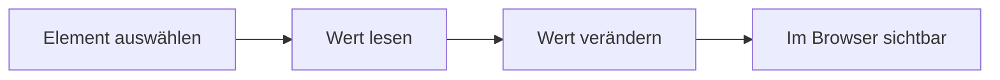
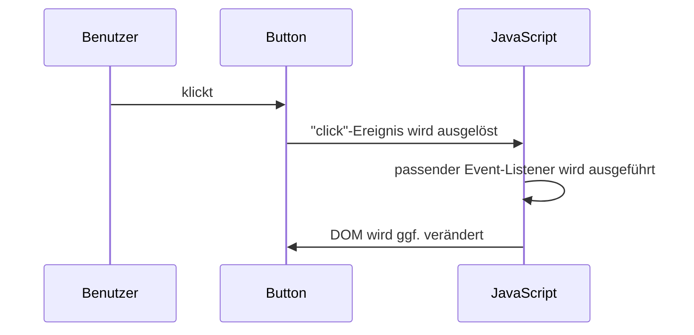
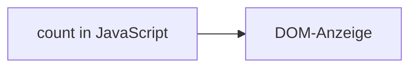
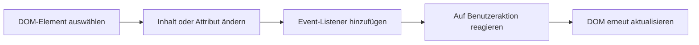

###### Themen

DOM-Grundlagen

- HTML-Elemente mit document.querySelector und document.getElementById auswählen
- Textinhalte und einfache Attribute von DOM-Elementen verändern

Ereignisse und Event-Handling

- Klick-Events mit Event-Listenern verarbeiten
- Grundlagen des Event-Objekts verstehen

Anwendungsprojekt

- DOM-Manipulation und Event-Handling in einer kleinen Webanwendung kombinieren
- Funktionalität direkt im Browser testen
- Einfache Fehler im Code erkennen und beheben

<br><br><br>
# 🌳 DOM-Grundlagen

Wenn du mit JavaScript im Browser arbeitest, ist das **DOM** einer der wichtigsten Grundbegriffe überhaupt. Der Browser liest dein HTML nicht einfach nur als Text, sondern baut daraus eine **baumartige Objektstruktur** auf. Genau diese Struktur nennt man **Document Object Model**, kurz **DOM**. JavaScript kann auf diese Struktur zugreifen, Elemente finden, Inhalte ändern und auf Benutzeraktionen reagieren ([Document Object Model (DOM)](https://developer.mozilla.org/en-US/docs/Web/API/Document_Object_Model)).

Stell dir das DOM wie einen Bauplan deiner Webseite vor. Jedes HTML-Element wird dabei zu einem Objekt im Speicher: Überschriften, Absätze, Buttons, Bilder, Formulareingaben und so weiter. Wenn du also mit JavaScript einen Text austauschst oder einen Button versteckst, bearbeitest du in Wirklichkeit diesen DOM-Baum.

Ein ganz einfaches HTML-Dokument wie dieses:

```html
<body>
  <h1>Willkommen</h1>
  <p id="info">Hallo Welt</p>
  <button>Klick mich</button>
</body>
```

wird intern ungefähr so gedacht:

```mermaid
graph TD
  A[document]
  A --> B[html]
  B --> C[body]
  C --> D[h1]
  C --> E[p id="info"]
  C --> F[button]
```

Das ist wichtig fürs Lernen:  
Wenn du DOM verstehst, verstehst du den Kern von Frontend-JavaScript. Viele Dinge lassen sich dann auf ein simples Muster zurückführen:

1. Element finden  
2. Inhalt oder Eigenschaft lesen  
3. Inhalt oder Eigenschaft ändern  
4. Auf ein Ereignis reagieren

Genau dieses Muster zieht sich durch fast jede interaktive Webanwendung.


<br><br><br>
## 🧱 Was das DOM für dich praktisch bedeutet

Im Alltag heißt DOM-Arbeit meistens:

- du **wählst ein Element aus**
- du **veränderst Text**
- du **veränderst Attribute oder Eigenschaften**
- du **reagierst auf Klicks**
- du **verbindest alles zu einer kleinen Logik**

Zum Beispiel:

- ein Button wird geklickt
- ein Zähler erhöht sich
- ein Text auf der Seite wird aktualisiert
- ein Attribut wie `disabled`, `title` oder `src` ändert sich

Das ist schon die Basis vieler echter Oberflächen.


<br><br><br>
## 🔎 HTML-Elemente mit `document.querySelector` und `document.getElementById` auswählen

Bevor du irgendetwas verändern kannst, musst du das passende Element erst einmal **finden**. Dafür gibt es verschiedene Methoden. Zwei der wichtigsten sind:

- `document.getElementById(...)`
- `document.querySelector(...)`

Beide liefern dir ein DOM-Element zurück, wenn sie etwas finden. Wenn nichts gefunden wird, bekommst du `null` zurück ([Document: getElementById() method](https://developer.mozilla.org/en-US/docs/Web/API/Document/getElementById), [Document: querySelector() method](https://developer.mozilla.org/en-US/docs/Web/API/Document/querySelector)).

Zur Einordnung:

| Methode | Erwartet | Findet | Typischer Einsatz |
|---|---|---|---|
| `document.getElementById("...")` | eine ID ohne `#` | genau das Element mit dieser ID | wenn du ein Element eindeutig per ID ansprechen willst |
| `document.querySelector("...")` | einen CSS-Selektor | das **erste** passende Element | wenn du flexibel per Klasse, Tag, ID oder Kombination suchen willst |

`getElementById` ist also sehr direkt. `querySelector` ist flexibler, weil es mit CSS-Selektoren arbeitet ([Document: querySelector() method](https://developer.mozilla.org/en-US/docs/Web/API/Document/querySelector)).


<br><br><br>
### 🆔 `document.getElementById(...)` verstehen

Diese Methode ist ideal, wenn dein Element eine eindeutige `id` hat.

HTML:

```html
<p id="status">Bereit</p>
```

JavaScript:

```js
const statusElement = document.getElementById("status");
console.log(statusElement);
```

Wichtig ist hier:  
Du schreibst **nur den ID-Namen**, also `"status"` und **nicht** `"#status"` ([Document: getElementById() method](https://developer.mozilla.org/en-US/docs/Web/API/Document/getElementById)).

Das ist ein häufiger Anfängerfehler:

```js
// FALSCH:
document.getElementById("#status");
```

Warum ist das falsch?  
Weil `getElementById` **keinen CSS-Selektor** erwartet, sondern nur den reinen ID-Wert. Das `#` gehört zur CSS-Schreibweise, nicht zu dieser Methode.


<br><br><br>
### 🎯 `document.querySelector(...)` verstehen

`querySelector` ist besonders praktisch, weil du damit dieselbe Logik nutzen kannst, die du aus CSS kennst.

Beispiele:

```js
document.querySelector("p");         // erstes <p>-Element
document.querySelector(".info");     // erstes Element mit class="info"
document.querySelector("#status");   // Element mit id="status"
document.querySelector("main p");    // erstes <p> innerhalb von <main>
```

HTML dazu könnte so aussehen:

```html
<main>
  <p class="info">Erster Absatz</p>
  <p>Zweiter Absatz</p>
</main>
```

Dann würde

```js
const element = document.querySelector("main p");
```

das **erste** passende `<p>` innerhalb von `<main>` finden ([Document: querySelector() method](https://developer.mozilla.org/en-US/docs/Web/API/Document/querySelector)).

Das Wort **erste** ist wichtig.  
Wenn mehrere Elemente passen, nimmt `querySelector` nur das erste. Wenn du alle passenden Elemente brauchst, wäre später `querySelectorAll(...)` relevant, aber für deine Grundlagen ist erstmal das Prinzip entscheidend: **ein Selektor, ein erstes Treffer-Element**.


<br><br><br>
### ⚖️ Wann du welche Methode verwenden solltest

Wenn du ein Element eindeutig mit einer ID ansprichst, ist `getElementById` oft die klarste und direkteste Wahl.

Wenn du flexibel bleiben willst, zum Beispiel:

- per Klasse suchen
- ein verschachteltes Element finden
- dieselbe Selektorlogik wie in CSS nutzen

dann ist `querySelector` sehr angenehm.

Ein sinnvolles Lernmuster ist:

- **ID vorhanden und eindeutig?** → `getElementById`
- **Mehr Flexibilität nötig?** → `querySelector`

Beide Methoden sind richtig. Es geht nicht darum, dass die eine “modern” und die andere “falsch” wäre. Es geht darum, die Methode passend zur Situation zu wählen.


<br><br><br>
## ✏️ Textinhalte und einfache Attribute von DOM-Elementen verändern

Sobald du ein Element gefunden hast, kannst du seinen Inhalt oder seine Eigenschaften verändern. Das ist der nächste große Schritt: nicht nur lesen, sondern aktiv die Seite beeinflussen.

Dabei sind für den Einstieg besonders wichtig:

- `textContent` für Textinhalte
- `setAttribute(...)` für einfache HTML-Attribute
- direkte Eigenschaften wie `value`, `src`, `href`, `disabled`

Viele dieser Dinge spiegeln HTML-Attribute oder DOM-Eigenschaften wider ([Node: textContent property](https://developer.mozilla.org/en-US/docs/Web/API/Node/textContent), [Element: setAttribute() method](https://developer.mozilla.org/en-US/docs/Web/API/Element/setAttribute)).


<br><br><br>
### 📝 Text mit `textContent` ändern

Wenn du Text in einem Element ändern willst, ist `textContent` meistens die sauberste und sicherste Grundlage. Diese Eigenschaft liest oder setzt den Textinhalt eines Knotens ([Node: textContent property](https://developer.mozilla.org/en-US/docs/Web/API/Node/textContent)).

HTML:

```html
<p id="meldung">Alte Meldung</p>
```

JavaScript:

```js
const meldung = document.getElementById("meldung");
meldung.textContent = "Neue Meldung";
```

Danach steht im Browser:

```html
<p id="meldung">Neue Meldung</p>
```

Warum ist `textContent` für Anfänger so gut?

- es ist einfach
- es arbeitet direkt mit Text
- du musst nicht sofort mit HTML im String hantieren
- es ist oft sicherer als `innerHTML`, wenn du nur Text austauschen willst ([Node: textContent property](https://developer.mozilla.org/en-US/docs/Web/API/Node/textContent))

Du kannst damit auch Text auslesen:

```js
const aktuellerText = meldung.textContent;
console.log(aktuellerText);
```


<br><br><br>
### 🏷️ Einfache Attribute verändern

HTML-Elemente haben oft Attribute wie:

- `src`
- `href`
- `alt`
- `title`
- `disabled`
- `placeholder`

Du kannst solche Attribute mit `setAttribute(...)` verändern ([Element: setAttribute() method](https://developer.mozilla.org/en-US/docs/Web/API/Element/setAttribute)).

Beispiel mit einem Link:

```html
<a id="meinLink" href="https://example.com">Zur Webseite</a>
```

```js
const link = document.getElementById("meinLink");
link.setAttribute("href", "https://developer.mozilla.org/");
link.textContent = "Zur MDN";
```

Jetzt zeigt der Link auf eine andere Adresse und hat neuen Text.

Du kannst Attribute auch auslesen:

```js
const aktuelleAdresse = link.getAttribute("href");
console.log(aktuelleAdresse);
```

Das Lesen und Setzen von Attributen ist ein Kernbaustein von DOM-Manipulation.


<br><br><br>
### 🔧 Eigenschaften statt Attribute: oft noch direkter

Im Browser gibt es neben HTML-Attributen auch **DOM-Eigenschaften**, die du direkt setzen kannst. Das fühlt sich oft natürlicher an.

Beispiele:

```js
bild.src = "bild-neu.png";
button.disabled = true;
eingabe.value = "Hallo";
link.href = "https://developer.mozilla.org/";
```

Diese Schreibweise ist im Alltag sehr verbreitet, weil sie kurz und klar ist. Viele Standardattribute haben entsprechende DOM-Eigenschaften ([HTMLImageElement: src](https://developer.mozilla.org/en-US/docs/Web/API/HTMLImageElement/src), [HTMLInputElement: value](https://developer.mozilla.org/en-US/docs/Web/API/HTMLInputElement/value), [HTMLButtonElement: disabled](https://developer.mozilla.org/en-US/docs/Web/API/HTMLButtonElement/disabled)).

Ein kleines Beispiel:

```html
<input id="name" value="Anna">
<button id="sperren">Speichern</button>
```

```js
const nameInput = document.getElementById("name");
const speichernButton = document.getElementById("sperren");

nameInput.value = "Max";
speichernButton.disabled = true;
speichernButton.textContent = "Gespeichert";
```

Hier veränderst du also sowohl **Text** als auch **Eigenschaften**.


<br><br><br>
### 🧠 Ein sauberes Denkmodell für DOM-Manipulation

Wenn du Inhalte änderst, hilft dieses Denkmodell enorm:



Das klingt banal, ist aber didaktisch extrem wichtig. Viele Anfänger versuchen direkt “irgendwie etwas zu ändern”, ohne zu prüfen:

- Habe ich überhaupt das richtige Element ausgewählt?
- Gibt es das Element wirklich?
- Ändere ich Text, Attribut oder Eigenschaft?
- Wird die Änderung durch ein Ereignis ausgelöst?

Wenn du diese vier Fragen im Kopf behältst, wirst du deutlich sauberer programmieren.


<br><br><br>
# ⚡ Ereignisse und Event-Handling

Interaktive Webseiten leben davon, dass etwas passiert, wenn ein Benutzer etwas tut:

- klicken
- tippen
- scrollen
- mit der Maus über ein Element gehen
- ein Formular absenden

Solche Aktionen nennt man **Ereignisse** oder auf Englisch **Events**. Damit JavaScript auf solche Ereignisse reagieren kann, registrierst du einen **Event-Listener**. Das ist vereinfacht gesagt eine Funktion, die ausgeführt wird, wenn ein bestimmtes Ereignis eintritt ([EventTarget: addEventListener() method](https://developer.mozilla.org/en-US/docs/Web/API/EventTarget/addEventListener)).


<br><br><br>
## 🖱️ Klick-Events mit Event-Listenern verarbeiten

Ein Klick auf einen Button ist das klassische erste Event-Beispiel.

HTML:

```html
<button id="klickButton">Klick mich</button>
```

JavaScript:

```js
const klickButton = document.getElementById("klickButton");

klickButton.addEventListener("click", function () {
  console.log("Der Button wurde geklickt.");
});
```

`addEventListener("click", ...)` bedeutet:

- höre auf das Ereignis `"click"`
- wenn es passiert, führe die angegebene Funktion aus

Genau dafür ist `addEventListener` gedacht ([EventTarget: addEventListener() method](https://developer.mozilla.org/en-US/docs/Web/API/EventTarget/addEventListener)).


<br><br><br>
### 🧩 Die Grundstruktur eines Event-Listeners

Fast immer sieht das Muster so aus:

```js
element.addEventListener("ereignisname", function () {
  // Reaktion auf das Ereignis
});
```

Oder mit einer benannten Funktion:

```js
function reagiereAufKlick() {
  console.log("Es wurde geklickt.");
}

button.addEventListener("click", reagiereAufKlick);
```

Beide Varianten sind okay. Für kleine Beispiele ist die anonyme Funktion direkt im Listener oft praktisch. Für größere Programme ist eine benannte Funktion oft lesbarer.

Wichtig ist ein typischer Anfängerfehler:

```js
// FALSCH:
button.addEventListener("click", reagiereAufKlick());
```

Warum ist das falsch?  
Weil du hier die Funktion **sofort aufrufst**, statt sie als Reaktion auf den Klick zu übergeben. Richtig ist:

```js
button.addEventListener("click", reagiereAufKlick);
```


<br><br><br>
### 🔁 Was bei einem Klick gedanklich passiert

Ein Klick lässt sich so verstehen:



Didaktisch ist das eine starke Denkbrücke:

- **Benutzeraktion**
- **Event entsteht**
- **JavaScript reagiert**
- **DOM ändert sich**

Genau daraus bestehen viele kleine Webanwendungen.


<br><br><br>
### 🎛️ Ein Klick-Event mit sichtbarer DOM-Änderung

Hier sieht man den Zusammenhang zwischen Event und DOM-Manipulation sehr gut:

HTML:

```html
<p id="status">Noch nichts passiert.</p>
<button id="startButton">Starten</button>
```

JavaScript:

```js
const status = document.getElementById("status");
const startButton = document.getElementById("startButton");

startButton.addEventListener("click", function () {
  status.textContent = "Der Button wurde geklickt.";
  startButton.disabled = true;
});
```

Was passiert hier?

- Der Button wird ausgewählt.
- Der Absatz wird ausgewählt.
- Beim Klick wird der Text geändert.
- Zusätzlich wird der Button deaktiviert.

Damit verbindest du bereits mehrere Grundlagen:

- Elementauswahl
- Text ändern
- Attribut/Eigenschaft ändern
- Event verarbeiten


<br><br><br>
## 🎯 Grundlagen des Event-Objekts verstehen

Wenn ein Event-Listener ausgeführt wird, bekommt die Funktion auf Wunsch ein **Event-Objekt** übergeben. Dieses Objekt enthält Informationen darüber, **was passiert ist** ([Event](https://developer.mozilla.org/en-US/docs/Web/API/Event)).

Beispiel:

```js
button.addEventListener("click", function (event) {
  console.log(event);
});
```

Das `event`-Objekt kommt automatisch vom Browser. Du musst es nicht selbst erzeugen ([Event](https://developer.mozilla.org/en-US/docs/Web/API/Event)).

Dieses Objekt ist extrem nützlich, weil du damit genauer auf das Ereignis reagieren kannst.


<br><br><br>
### 📦 Wichtige Eigenschaften des Event-Objekts

Für den Einstieg sind besonders hilfreich:

- `event.type`
- `event.target`
- `event.currentTarget`

#### `event.type`

Damit erfährst du, um welchen Ereignistyp es sich handelt.

```js
button.addEventListener("click", function (event) {
  console.log(event.type); // "click"
});
```

#### `event.target`

`target` ist das Element, auf dem das Ereignis ursprünglich ausgelöst wurde ([Event: target property](https://developer.mozilla.org/en-US/docs/Web/API/Event/target)).

```js
button.addEventListener("click", function (event) {
  console.log(event.target);
});
```

#### `event.currentTarget`

`currentTarget` ist das Element, an dem der aktuelle Event-Listener hängt ([Event: currentTarget property](https://developer.mozilla.org/en-US/docs/Web/API/Event/currentTarget)).

```js
button.addEventListener("click", function (event) {
  console.log(event.currentTarget);
});
```

In einfachen Fällen sind `target` und `currentTarget` oft gleich. Später, wenn Ereignisse weitergereicht werden oder verschachtelte Elemente beteiligt sind, wird der Unterschied sehr wichtig.


<br><br><br>
### 🔍 `target` und `currentTarget` einfach verstanden

Stell dir vor, du hast dieses HTML:

```html
<button id="meinButton">
  <span>Speichern</span>
</button>
```

Wenn du auf den Text `<span>` im Button klickst, kann `event.target` das innere `<span>` sein, während `event.currentTarget` der Button bleibt, an dem der Listener hängt ([Event: target property](https://developer.mozilla.org/en-US/docs/Web/API/Event/target), [Event: currentTarget property](https://developer.mozilla.org/en-US/docs/Web/API/Event/currentTarget)).

Das ist ein sehr wichtiges Verständnis, weil viele Anfänger denken, das seien immer dieselben Werte. In kleinen Beispielen scheint das oft so zu sein, aber technisch haben sie unterschiedliche Bedeutungen.


<br><br><br>
### 🛑 `preventDefault()` kurz eingeordnet

Für normale Klick-Buttons brauchst du das oft noch nicht. Aber wenn du auf einen Link oder ein Formular reagierst, willst du manchmal das Standardverhalten verhindern. Dafür gibt es `event.preventDefault()` ([Event: preventDefault() method](https://developer.mozilla.org/en-US/docs/Web/API/Event/preventDefault)).

Beispiel mit Link:

```html
<a id="meinLink" href="https://example.com">Weiter</a>
```

```js
const meinLink = document.getElementById("meinLink");

meinLink.addEventListener("click", function (event) {
  event.preventDefault();
  console.log("Der Link wurde geklickt, aber die Seite wechselt nicht.");
});
```

Das gehört zwar schon leicht über die absoluten Grundlagen hinaus, ist aber gut zu kennen, weil du dann verstehst:  
Ein Event kann nicht nur Informationen liefern, sondern auch das normale Browserverhalten beeinflussen.


<br><br><br>
# 🛠️ Anwendungsprojekt

Jetzt setzen wir die Einzelteile zu einer kleinen Webanwendung zusammen. Ziel ist nicht, etwas Riesiges zu bauen, sondern das Zusammenspiel sauber zu verstehen:

- Elemente auswählen
- Texte verändern
- Eigenschaften verändern
- Klick-Events verarbeiten
- Event-Objekt nutzen
- direkt im Browser testen
- einfache Fehler erkennen und beheben

Eine gute Lernregel dabei ist:  
**Lieber eine kleine App wirklich verstehen als fünf komplizierte Beispiele nur abschreiben.**


<br><br><br>
## 💡 Kleine Webanwendung: Klickzähler mit Statusanzeige

Diese Mini-App ist bewusst simpel, aber didaktisch stark. Sie zeigt dir die ganze Grundkette in einem realistischen Zusammenhang.

Funktionen:

- Ein Button erhöht einen Zähler.
- Ein Text zeigt den aktuellen Stand.
- Ein Statusfeld erklärt, was passiert ist.
- Ein Reset-Button setzt den Zähler zurück.
- Der Reset-Button wird deaktiviert, wenn der Zähler `0` ist.
- Das Event-Objekt wird genutzt, um zu zeigen, welches Element geklickt wurde.

Du kannst das als **eine einzige HTML-Datei** speichern und direkt im Browser öffnen.

```html
<!DOCTYPE html>
<html lang="de">
<head>
  <meta charset="UTF-8">
  <meta name="viewport" content="width=device-width, initial-scale=1.0">
  <title>DOM und Events – Mini-App</title>
  <style>
    body {
      font-family: Arial, sans-serif;
      max-width: 700px;
      margin: 40px auto;
      padding: 0 16px;
      line-height: 1.6;
    }

    .app {
      border: 1px solid #ccc;
      border-radius: 12px;
      padding: 20px;
      background: #f9f9f9;
    }

    .status-box {
      margin: 16px 0;
      padding: 12px;
      border-radius: 8px;
      background: #eef4ff;
    }

    .counter {
      font-size: 2rem;
      font-weight: bold;
      color: #1d4ed8;
    }

    .buttons {
      display: flex;
      gap: 12px;
      margin-top: 16px;
    }

    button {
      padding: 10px 16px;
      border: none;
      border-radius: 8px;
      cursor: pointer;
      background: #2563eb;
      color: white;
      font-size: 1rem;
    }

    button:disabled {
      background: #9ca3af;
      cursor: not-allowed;
    }

    #resetButton {
      background: #dc2626;
    }
  </style>
</head>
<body>
  <div class="app">
    <h1>Mini-App: Klickzähler</h1>

    <p>Aktueller Stand: <span id="counterValue" class="counter">0</span></p>

    <div class="status-box">
      <p id="statusText">Noch kein Klick ausgeführt.</p>
    </div>

    <div class="buttons">
      <button id="countButton" title="Erhöht den Zähler">Klick mich</button>
      <button id="resetButton" disabled title="Setzt den Zähler auf 0 zurück">Zurücksetzen</button>
    </div>
  </div>

  <script>
    const counterValue = document.getElementById("counterValue");
    const statusText = document.querySelector("#statusText");
    const countButton = document.getElementById("countButton");
    const resetButton = document.getElementById("resetButton");

    let count = 0;

    function updateView() {
      counterValue.textContent = count;
      resetButton.disabled = count === 0;

      if (count === 0) {
        statusText.textContent = "Der Zähler steht auf 0.";
        countButton.setAttribute("title", "Erhöht den Zähler");
      } else {
        statusText.textContent = "Der Zähler wurde aktualisiert.";
        countButton.setAttribute("title", "Aktueller Stand: " + count);
      }
    }

    countButton.addEventListener("click", function (event) {
      count++;
      counterValue.textContent = count;
      statusText.textContent = "Geklickt auf: " + event.currentTarget.id;
      resetButton.disabled = false;
      countButton.setAttribute("title", "Aktueller Stand: " + count);
    });

    resetButton.addEventListener("click", function (event) {
      count = 0;
      statusText.textContent = "Zurückgesetzt durch: " + event.currentTarget.id;
      updateView();
    });

    updateView();
  </script>
</body>
</html>
```

Diese App nutzt genau die Grundlagen, die du lernen sollst:

- `document.getElementById("counterValue")`
- `document.querySelector("#statusText")`
- `textContent` zum Ändern von Text
- `setAttribute("title", ...)` zum Ändern eines Attributs
- `disabled` als Eigenschaft
- `addEventListener("click", ...)`
- `event.currentTarget.id` aus dem Event-Objekt


<br><br><br>
## 🧭 Schritt-für-Schritt-Erklärung der Mini-App

Damit du die Logik wirklich verstehst, zerlegen wir die App jetzt in sinnvolle Teile.


<br><br><br>
### 🔎 1. Elemente auswählen

```js
const counterValue = document.getElementById("counterValue");
const statusText = document.querySelector("#statusText");
const countButton = document.getElementById("countButton");
const resetButton = document.getElementById("resetButton");
```

Hier holst du dir vier DOM-Elemente aus dem HTML.

- `counterValue` zeigt die Zahl an
- `statusText` zeigt die Meldung an
- `countButton` erhöht den Zähler
- `resetButton` setzt den Zähler zurück

Wichtig ist hier auch der bewusste Vergleich:

- einmal `getElementById(...)`
- einmal `querySelector(...)`

So siehst du denselben Grundgedanken mit zwei verschiedenen Auswahlmethoden.


<br><br><br>
### 🧮 2. Zustand in einer Variable speichern

```js
let count = 0;
```

Das DOM zeigt Dinge an, aber der eigentliche Wert des Zählers wird in der JavaScript-Variable `count` gespeichert.

Das ist ein sehr wichtiger Lernpunkt:  
Die Seite zeigt nicht “magisch” den Zustand an. Meist gibt es eine **interne Variable**, und das DOM ist nur die sichtbare Darstellung davon.

Du kannst dir das so vorstellen:



Wenn sich `count` ändert, musst du die Anzeige im DOM aktualisieren.


<br><br><br>
### 🔄 3. Anzeige aktualisieren

```js
function updateView() {
  counterValue.textContent = count;
  resetButton.disabled = count === 0;

  if (count === 0) {
    statusText.textContent = "Der Zähler steht auf 0.";
    countButton.setAttribute("title", "Erhöht den Zähler");
  } else {
    statusText.textContent = "Der Zähler wurde aktualisiert.";
    countButton.setAttribute("title", "Aktueller Stand: " + count);
  }
}
```

Diese Funktion bündelt alle sichtbaren Änderungen.

Was passiert hier genau?

- `counterValue.textContent = count;`  
  Die Zahl im `<span>` wird aktualisiert.

- `resetButton.disabled = count === 0;`  
  Der Reset-Button ist nur aktiv, wenn es auch wirklich etwas zurückzusetzen gibt.

- `statusText.textContent = ...`  
  Die Statusmeldung ändert sich.

- `countButton.setAttribute("title", ...)`  
  Das `title`-Attribut des Buttons wird angepasst.

Das ist gute Struktur:  
Statt an vielen Stellen unkoordiniert das DOM zu verändern, sammelst du logische Aktualisierungen in einer Funktion.


<br><br><br>
### 🖱️ 4. Klick auf den Zähler-Button verarbeiten

```js
countButton.addEventListener("click", function (event) {
  count++;
  counterValue.textContent = count;
  statusText.textContent = "Geklickt auf: " + event.currentTarget.id;
  resetButton.disabled = false;
  countButton.setAttribute("title", "Aktueller Stand: " + count);
});
```

Das ist das Herzstück der Interaktion.

Beim Klick passiert:

1. `count++` erhöht den internen Wert.
2. `counterValue.textContent = count` zeigt den neuen Wert an.
3. `statusText.textContent = ...` schreibt eine Meldung.
4. `event.currentTarget.id` liest aus dem Event-Objekt, welcher Listener reagiert hat.
5. `resetButton.disabled = false` aktiviert den Reset-Button.
6. Das `title`-Attribut wird aktualisiert.

Du siehst hier sehr schön, wie ein Event direkt DOM-Manipulation auslöst.


<br><br><br>
### 🔁 5. Klick auf den Reset-Button verarbeiten

```js
resetButton.addEventListener("click", function (event) {
  count = 0;
  statusText.textContent = "Zurückgesetzt durch: " + event.currentTarget.id;
  updateView();
});
```

Hier wird der Zähler wieder auf `0` gesetzt. Danach ruft der Code `updateView()` auf, damit die Anzeige konsistent wird.

Das ist sauberer als überall denselben Code zu wiederholen.  
Diese Art zu denken ist ein Schritt in Richtung guter Code-Struktur.


<br><br><br>
## 🌐 Funktionalität direkt im Browser testen

Gerade bei DOM und Events ist es wichtig, dass du nicht nur Code liest, sondern ihn wirklich im Browser ausprobierst. Denn genau dort laufen DOM und Events ja tatsächlich ab.

Am einfachsten geht das mit einer einzelnen HTML-Datei.

### So gehst du vor

1. Erstelle eine Datei namens `index.html`
2. Kopiere den kompletten Code hinein
3. Speichere die Datei
4. Öffne sie per Doppelklick im Browser

Dann kannst du sofort klicken und beobachten, wie sich die Oberfläche verändert.

Wenn du etwas professioneller arbeiten willst, kannst du auch einen lokalen Entwicklungsserver verwenden, zum Beispiel über eine Editor-Erweiterung wie Live Server. Für diese Grundlagen ist das aber noch nicht zwingend nötig.

Wichtig ist vor allem:  
**Teste jede kleine Änderung direkt.**  
Das beschleunigt dein Lernen enorm, weil du Ursache und Wirkung sofort siehst.


<br><br><br>
### 🧪 Warum direktes Testen didaktisch so wertvoll ist

Wenn du bei DOM und Event-Handling lernst, dann arbeitest du mit sichtbaren Veränderungen. Das ist ideal, weil du sofort Feedback bekommst.

Wenn du etwa diesen Code schreibst:

```js
statusText.textContent = "Hallo";
```

siehst du direkt im Browser, ob:

- das richtige Element gewählt wurde
- der Text wirklich geändert wurde
- dein Skript überhaupt ausgeführt wird

Das ist ein riesiger Vorteil gegenüber abstrakteren Themen. Nutze ihn bewusst:  
**kleine Änderung → speichern → Browser prüfen → weitergehen**

So lernst du deutlich stabiler als mit reinem Abschreiben.


<br><br><br>
## 🐞 Einfache Fehler im Code erkennen und beheben

Gerade am Anfang wirken Fehler oft chaotisch. In Wirklichkeit sind viele DOM-Fehler sehr typisch und wiederholen sich ständig. Wenn du diese Muster kennst, wirst du deutlich ruhiger beim Debuggen.

Der Browser zeigt JavaScript-Fehler in der Regel in den Entwicklerwerkzeugen, besonders in der **Konsole**. Dort kannst du Fehlermeldungen lesen und herausfinden, in welcher Zeile ein Problem auftritt. Das ist ein zentraler Schritt beim Troubleshooting ([What went wrong? Troubleshooting JavaScript](https://developer.mozilla.org/en-US/docs/Learn_web_development/Extensions/Testing/Troubleshooting_JavaScript)).

Unter Windows/Linux öffnest du die Entwicklerwerkzeuge meistens mit `F12` oder `Strg + Umschalt + I`, unter macOS typischerweise über die Browser-Entwicklertools. Entscheidend ist nicht die Tastenkombination, sondern dass du lernst, **die Konsole aktiv zu benutzen**.


<br><br><br>
### ❌ Typische Fehlerbilder im DOM-Code

| Fehlerbild | Häufige Ursache | Lösung |
|---|---|---|
| `Cannot read properties of null` | Element wurde nicht gefunden | Selektor prüfen, ID prüfen, Script-Reihenfolge prüfen |
| Button reagiert nicht | Event-Listener hängt nicht am richtigen Element | Elementauswahl prüfen, `addEventListener` korrekt schreiben |
| `getElementById("#id")` funktioniert nicht | `#` fälschlich verwendet | Nur `"id"` ohne `#` übergeben |
| Funktion läuft sofort statt beim Klick | Funktion mit `()` übergeben | Referenz übergeben: `handler` statt `handler()` |
| Text ändert sich nicht sichtbar | Falsches Element ausgewählt oder falscher Codepfad | `console.log(...)` einsetzen und Element prüfen |

Das sind keine exotischen Probleme, sondern Standardfehler im Einstieg. Wenn du sie erkennst, lernst du viel schneller.


<br><br><br>
### 🧱 Der Klassiker: `null` statt Element

Einer der häufigsten Fehler überhaupt ist dieser hier:

```js
const status = document.getElementById("status");
status.textContent = "Neu";
```

Wenn das Element mit `id="status"` nicht existiert, ist `status` gleich `null`. Dann kann JavaScript kein `textContent` darauf setzen und wirft einen Fehler ([Document: getElementById() method](https://developer.mozilla.org/en-US/docs/Web/API/Document/getElementById)).

Typische Gründe dafür:

- ID im HTML falsch geschrieben
- ID im JavaScript falsch geschrieben
- Script läuft, bevor das HTML-Element geladen ist

So kannst du prüfen, ob das Element gefunden wurde:

```js
const status = document.getElementById("status");
console.log(status);
```

Wenn in der Konsole `null` erscheint, weißt du sofort:  
Das Problem liegt bei der Auswahl des Elements, nicht beim Ändern des Textes.


<br><br><br>
### ⏱️ Script läuft zu früh

Ein weiterer typischer Fehler ist, dass dein JavaScript ausgeführt wird, **bevor** das HTML-Element im DOM vorhanden ist.

Zum Beispiel problematisch:

```html
<head>
  <script>
    const button = document.getElementById("meinButton");
    console.log(button); // oft null
  </script>
</head>
<body>
  <button id="meinButton">Klick</button>
</body>
```

Hier wird das Script zu einem Zeitpunkt ausgeführt, an dem der Button im Dokument noch nicht existiert.

Zwei übliche Lösungen sind:

1. Das `<script>` ganz ans Ende des `<body>` setzen  
2. Auf `DOMContentLoaded` warten, also erst starten, wenn das HTML geparst wurde ([Document: DOMContentLoaded event](https://developer.mozilla.org/en-US/docs/Web/API/Document/DOMContentLoaded_event))

Beispiel mit `DOMContentLoaded`:

```js
document.addEventListener("DOMContentLoaded", function () {
  const button = document.getElementById("meinButton");
  console.log(button);
});
```

Für Einsteiger ist die erste Lösung oft am einfachsten:  
Setze das Skript direkt vor `</body>`.


<br><br><br>
### ✍️ Tippfehler bei Methoden und Ereignisnamen

JavaScript ist streng bei Schreibweisen. Schon kleine Tippfehler sorgen dafür, dass etwas nicht funktioniert.

Beispiele:

```js
// FALSCH
button.addEventListner("click", handler);

// FALSCH
button.addEventListener("clik", handler);
```

Richtig:

```js
button.addEventListener("click", handler);
```

Solche Fehler sind banal, aber extrem häufig. Deshalb lohnt es sich, beim Debuggen immer zuerst ganz nüchtern die Schreibweise zu prüfen.


<br><br><br>
### 🔍 Mit `console.log(...)` gezielt prüfen

`console.log(...)` ist eines der wichtigsten Werkzeuge beim Lernen. Nicht, weil es “profihaft” aussieht, sondern weil es dir sichtbar macht, was dein Code gerade tut.

Zum Beispiel:

```js
const button = document.getElementById("countButton");
console.log(button);
```

Oder in einem Event-Listener:

```js
button.addEventListener("click", function (event) {
  console.log("Button wurde geklickt");
  console.log(event);
});
```

Oder beim Zustand:

```js
console.log("Aktueller count-Wert:", count);
```

Mit solchen Ausgaben kannst du Fragen beantworten wie:

- Wird mein Code überhaupt ausgeführt?
- Wird das richtige Element gefunden?
- Tritt das Klick-Ereignis wirklich ein?
- Hat meine Variable den erwarteten Wert?

Gerade für richtiges Lernen ist das zentral:  
**Nicht raten, sondern prüfen.**


<br><br><br>
### 🧠 Eine gute Debugging-Reihenfolge für Anfänger

Wenn dein DOM-Code nicht funktioniert, gehe am besten in dieser Reihenfolge vor:

1. **Existiert das Element wirklich im HTML?**
2. **Ist der Selektor korrekt?**
3. **Ist das Script an der richtigen Stelle?**
4. **Wird der Event-Listener überhaupt registriert?**
5. **Wird die Funktion beim Klick wirklich ausgeführt?**
6. **Wird danach der DOM-Wert korrekt geändert?**

Das ist viel besser als planlos alles gleichzeitig umzuschreiben.

Ein Beispiel für systematisches Prüfen:

```js
const button = document.getElementById("countButton");
console.log("Button gefunden:", button);

button.addEventListener("click", function () {
  console.log("Klick angekommen");
});
```

Wenn die erste Ausgabe schon `null` zeigt, brauchst du den Rest noch gar nicht zu analysieren.  
Das ist genau die Art von sauberem Denken, die dich in Tech-Grundlagen schnell voranbringt.


<br><br><br>
## 🧩 Wie die drei Themen zusammenhängen

Die drei Blöcke aus deiner Liste sind in Wirklichkeit keine getrennten Inseln, sondern eine durchgehende Kette:



Genau so entstehen interaktive Webseiten.

Ein reales Grundmuster lautet fast immer:

1. Du suchst ein Element mit `getElementById` oder `querySelector`.
2. Du hängst mit `addEventListener` einen Klick-Listener daran.
3. Im Handler benutzt du das `event`-Objekt.
4. Danach änderst du mit `textContent`, `disabled` oder `setAttribute` die Oberfläche.

Wenn du dieses Muster sicher beherrschst, hast du einen echten Grundstein für Frontend-Entwicklung gelegt.