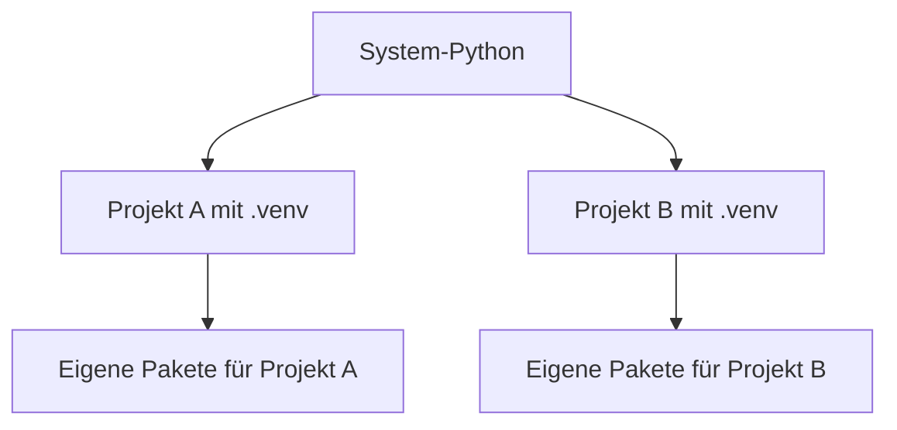

###### Themen

Python-Überblick

- Typische Anwendungsgebiete von Python
- Wichtige Merkmale der Sprache

Installation von Python

- Python installieren
- Python-Version prüfen

Erste Schritte in der Entwicklungsumgebung

- Eine einfache Entwicklungsumgebung einrichten
- Ein erstes Python-Projekt anlegen und ausführen
- Virtuelle Umgebungen in einfacher Form kennenlernen

<br><br><br>
# 🐍 Python-Überblick

Python ist eine **allgemeine Programmiersprache**, die bewusst so gestaltet wurde, dass sie **gut lesbar** und **einfach zu schreiben** ist. Die offizielle Python-Dokumentation beschreibt sie als leicht erlernbare, aber zugleich sehr leistungsfähige Sprache, die sich für viele Arten von Software eignet ([The Python Tutorial](https://docs.python.org/3/tutorial/), [What is Python? Executive Summary](https://www.python.org/doc/essays/blurb/)).

Gerade für Core-Tech-Fundamentals ist Python spannend, weil man mit ihr sehr schnell die zentralen Ideen des Programmierens versteht: Variablen, Datentypen, Bedingungen, Schleifen, Funktionen, Module, Dateien, Pakete und das Arbeiten mit einer Laufzeitumgebung. Python ist also nicht nur „eine Sprache“, sondern oft auch ein sehr guter Einstieg in sauberes technisches Denken.


<br><br><br>
## 💼 Typische Anwendungsgebiete von Python

Python wird in sehr vielen Bereichen eingesetzt, weil die Sprache selbst relativ einfach ist und es für fast jeden Anwendungsfall passende Bibliotheken gibt.

| Bereich | Was man damit macht | Typische Werkzeuge |
|---|---|---|
| Automatisierung | Dateien umbenennen, Ordner durchsuchen, Berichte erzeugen, Skripte ausführen | `pathlib`, `os`, `shutil`, `subprocess` aus der Standardbibliothek ([The Python Standard Library](https://docs.python.org/3/library/)) |
| Webentwicklung | Websites, Web-Backends, APIs | Django ([Django overview](https://www.djangoproject.com/start/overview/)), FastAPI ([FastAPI](https://fastapi.tiangolo.com/)) |
| Datenanalyse | Daten einlesen, filtern, auswerten, visualisieren | NumPy ([What is NumPy?](https://numpy.org/doc/stable/user/whatisnumpy.html)), pandas ([pandas overview](https://pandas.pydata.org/docs/getting_started/overview.html)) |
| KI / Machine Learning | Modelle trainieren, Vorhersagen, Datenpipelines | scikit-learn ([Getting Started](https://scikit-learn.org/stable/getting_started.html)), TensorFlow ([TensorFlow Learn](https://www.tensorflow.org/learn)) |
| Testing | Programme automatisch testen | pytest ([pytest documentation](https://docs.pytest.org/en/stable/)) |
| Wissenschaft / Forschung | Simulationen, numerische Berechnungen, Experimente | NumPy, SciPy ([SciPy User Guide](https://docs.scipy.org/doc/scipy/tutorial/)) |
| DevOps / Tools | Build-Skripte, CLI-Tools, Deployments | Standardbibliothek, Automatisierungsskripte |

Python ist besonders beliebt für **Automatisierung**. Wenn du zum Beispiel jeden Tag denselben Klick-, Datei- oder Umbenennungsprozess machst, ist Python oft ein guter Kandidat, um das zu automatisieren. Die Standardbibliothek bringt dafür bereits viele Werkzeuge mit, ohne dass du erst zusätzliche Pakete installieren musst ([The Python Standard Library](https://docs.python.org/3/library/)).

In der **Webentwicklung** wird Python häufig für den Backend-Teil benutzt, also für den Teil einer Anwendung, der Logik verarbeitet, Datenbanken anspricht und APIs bereitstellt. Frameworks wie Django und FastAPI machen daraus strukturierte Anwendungen mit Routing, Formularen, Sicherheit und Datenverarbeitung ([Django overview](https://www.djangoproject.com/start/overview/), [FastAPI](https://fastapi.tiangolo.com/)).

Im Bereich **Datenanalyse** ist Python fast schon ein Standardwerkzeug. Mit NumPy arbeitet man effizient mit Zahlenfeldern und mathematischen Operationen, mit pandas verarbeitet man Tabellen, CSV-Dateien und Zeitreihen sehr komfortabel ([What is NumPy?](https://numpy.org/doc/stable/user/whatisnumpy.html), [pandas overview](https://pandas.pydata.org/docs/getting_started/overview.html)).

Auch in **Machine Learning und KI** wird Python sehr oft verwendet. Der Grund ist weniger, dass die Kernsprache „magisch“ wäre, sondern eher, dass das Ökosystem riesig ist und viele Bibliotheken schon fertig existieren. Das macht Python für Einsteiger und Profis attraktiv ([Getting Started](https://scikit-learn.org/stable/getting_started.html), [TensorFlow Learn](https://www.tensorflow.org/learn)).

Für richtiges Lernen ist hier wichtig: Python ist nicht auf einen einzigen Bereich festgelegt. Wenn du Python lernst, lernst du also nicht nur Syntax, sondern auch viele **übertragbare Grundlagen**, die du später in anderen Sprachen und Systemen wiedererkennst.


<br><br><br>
## ✨ Wichtige Merkmale der Sprache

Python hat einige Eigenschaften, die für Einsteiger sehr angenehm sind, aber gleichzeitig professionelles Arbeiten ermöglichen.

### **Gut lesbare Syntax**

Ein zentrales Merkmal von Python ist die Lesbarkeit. Python-Code wirkt oft fast wie „technisches Englisch“. Dadurch kannst du dich beim Lernen stärker auf die Logik konzentrieren und weniger auf komplizierte Sonderzeichen oder sehr starre Schreibweisen. Die offizielle Dokumentation betont genau diese Einfachheit und Klarheit ([The Python Tutorial](https://docs.python.org/3/tutorial/)).

Ein einfaches Beispiel:

```python
name = "Lea"

if name == "Lea":
    print("Hallo Lea")
```

Das ist gut lesbar, weil Python wenig „syntaktischen Lärm“ hat. Keine geschweiften Klammern, keine Semikolons am Zeilenende, keine unnötigen Zusatzwörter.

### **Einrückung ist in Python Teil der Sprache**

In vielen Sprachen ist Einrückung vor allem für Menschen hilfreich. In Python ist sie zusätzlich **technisch wichtig**, weil dadurch Blöcke definiert werden. Das heißt: Die Einrückung ist nicht nur schön, sondern steuert die Struktur des Programms ([The Python Tutorial – More Control Flow Tools](https://docs.python.org/3/tutorial/controlflow.html)).

Das ist didaktisch sehr wertvoll, weil du früh lernst, sauber und strukturiert zu schreiben.

### **Interpretiert und interaktiv**

Python wird normalerweise von einem **Interpreter** ausgeführt. Das bedeutet vereinfacht: Du schreibst Code, und Python verarbeitet ihn direkt. Außerdem kannst du Python interaktiv im Terminal starten und einzelne Befehle sofort ausprobieren. Diese interaktive Arbeitsweise ist gerade am Anfang sehr hilfreich ([Using Python](https://docs.python.org/3/using/index.html)).

Zum Beispiel:

```bash
python
```

Dann kannst du direkt eingeben:

```python
2 + 3
```

und bekommst sofort ein Ergebnis. Das ist ideal, um schnell zu testen, wie etwas funktioniert.

### **Dynamische Typisierung**

Python ist **dynamisch typisiert**. Das bedeutet: Du musst beim Anlegen einer Variablen den Typ meist nicht extra hinschreiben. Python erkennt zur Laufzeit selbst, ob etwas zum Beispiel eine Zahl, ein Text oder eine Liste ist.

```python
x = 5
name = "Mila"
preise = [10, 20, 30]
```

Das macht den Einstieg leichter. Gleichzeitig solltest du verstehen, dass Flexibilität auch Verantwortung bedeutet: Manche Fehler fallen dadurch erst später beim Ausführen auf. Python unterstützt deshalb zusätzlich **Typ-Hinweise**, wenn man klarer dokumentieren möchte, welche Datentypen erwartet werden ([typing — Support for type hints](https://docs.python.org/3/library/typing.html)).

### **Mehrere Programmierstile sind möglich**

Python unterstützt verschiedene Denkweisen beim Programmieren: prozedural, objektorientiert und funktional. Das ist sehr praktisch, weil du mit einer Sprache viele Konzepte lernen kannst ([The Python Tutorial](https://docs.python.org/3/tutorial/)).

Das bedeutet konkret: Du kannst mit ganz einfachen Skripten starten und später sauber strukturierte Programme mit Klassen, Modulen und Paketen bauen.

### **Große Standardbibliothek**

Python bringt bereits „ab Werk“ sehr viele Module mit. Dieses Prinzip wird oft als **„batteries included“** beschrieben. Du kannst also direkt mit Dateien, JSON, Datum/Zeit, HTTP, Pfaden, regulären Ausdrücken und vielem mehr arbeiten, ohne erst externe Pakete zu suchen ([The Python Standard Library](https://docs.python.org/3/library/)).

Das ist für Anfänger ideal, weil du schnell produktiv wirst und zugleich ein Gefühl dafür bekommst, wie viel man mit Bordmitteln erreichen kann.

### **Plattformunabhängigkeit**

Python läuft auf Windows, macOS und Linux. Derselbe Code kann oft mit nur kleinen oder gar keinen Änderungen auf mehreren Betriebssystemen funktionieren, solange du keine sehr systemspezifischen Dinge machst ([Using Python on Windows](https://docs.python.org/3/using/windows.html), [Using Python on Unix platforms](https://docs.python.org/3/using/unix.html), [Using Python on a Macintosh](https://docs.python.org/3/using/mac.html)).

Für technisches Grundverständnis ist das wichtig: Du lernst nicht nur „wie man Code schreibt“, sondern auch, wie Programme in unterschiedlichen Umgebungen ausgeführt werden.

### **Großes Ökosystem und starke Community**

Python hat eine enorme Menge an Bibliotheken, Lernmaterialien, Tutorials und Community-Ressourcen. Das macht die Sprache besonders anfängerfreundlich, weil du bei fast jedem Problem schon gute Beispiele und Dokumentation findest ([Python Package Index](https://pypi.org/), [Python Documentation](https://docs.python.org/3/)).

Gerade beim Lernen ist das ein großer Vorteil: Wenn du ein Thema nicht verstehst, findest du meist mehrere alternative Erklärungen und Werkzeuge dazu.


<br><br><br>
# 🛠️ Installation von Python

Bevor du programmieren kannst, brauchst du Python auf deinem Rechner. Wichtig ist dabei, dass du verstehst, **was** du installierst:

- den **Python-Interpreter**, der deinen Code ausführt
- meist auch **pip**, den Paketmanager für zusätzliche Bibliotheken
- oft zusätzlich Werkzeuge wie **IDLE** oder die Möglichkeit, Python über das Terminal zu starten

Heute arbeitet man praktisch mit **Python 3**. Wenn irgendwo nur „Python“ steht, ist fast immer Python 3 gemeint. Die offizielle Python-Seite stellt die aktuellen Versionen bereit ([Python Releases for Windows](https://www.python.org/downloads/windows/), [Python Releases for macOS](https://www.python.org/downloads/macos/)).


<br><br><br>
## ⬇️ Python installieren

### **Empfehlung für Einsteiger**

Am einfachsten und saubersten ist meist die Installation über die offizielle Python-Webseite. Dort bekommst du die aktuelle stabile Version direkt vom Python-Projekt ([Python Downloads](https://www.python.org/downloads/)).

### **Installation unter Windows**

Unter Windows lädst du den Installer von der offiziellen Python-Seite herunter und startest ihn. Achte im Installer besonders auf die Option:

```text
Add python.exe to PATH
```

Diese Option ist wichtig, damit du Python später direkt im Terminal starten kannst. Die offizielle Windows-Dokumentation beschreibt genau diesen Installationsweg ([Using Python on Windows](https://docs.python.org/3/using/windows.html)).

Typischer Ablauf:

1. Installer von `python.org` herunterladen.
2. Installer starten.
3. Häkchen bei **Add python.exe to PATH** setzen.
4. Installation abschließen.

Danach ist meistens auch der Windows-Launcher `py` verfügbar. Dieser Launcher ist praktisch, weil du damit gezielt Python-Versionen starten kannst, zum Beispiel:

```bash
py
```

oder

```bash
py -3
```

### **Installation unter macOS**

Unter macOS kannst du ebenfalls den offiziellen Installer von Python.org verwenden. Das ist für Anfänger oft der klarste Weg, weil du dann eine gut dokumentierte, vollständige Python-Installation bekommst ([Python Releases for macOS](https://www.python.org/downloads/macos/), [Using Python on a Macintosh](https://docs.python.org/3/using/mac.html)).

Wichtig zu wissen: macOS bringt manchmal bereits ein Python-artiges Systemwerkzeug mit oder hatte in älteren Versionen vorinstallierte Varianten. Für dein Lernen solltest du dich aber bewusst auf die **selbst installierte Python-3-Version** konzentrieren, damit du klar weißt, welche Version du benutzt.

### **Installation unter Linux**

Unter Linux ist Python 3 oft schon vorhanden. Trotzdem bedeutet „Python ist da“ nicht automatisch, dass alle Werkzeuge für dein Lernen komplett eingerichtet sind. Je nach Distribution kann es nötig sein, zusätzliche Pakete zu installieren, zum Beispiel für `venv`. Die Python-Dokumentation beschreibt allgemein die Nutzung auf Unix-Plattformen ([Using Python on Unix platforms](https://docs.python.org/3/using/unix.html), [venv — Creation of virtual environments](https://docs.python.org/3/library/venv.html)).

Beispiele, die auf vielen Debian/Ubuntu-Systemen funktionieren, sind:

```bash
sudo apt update
sudo apt install python3 python3-venv python3-pip
```

Auf Fedora, Arch oder anderen Distributionen heißen die Pakete teilweise anders. Wichtig ist hier weniger der exakte Befehl als das Grundprinzip: Du brauchst einen Python-Interpreter, `pip` und idealerweise `venv`.

### **Was nach der Installation vorhanden sein sollte**

Wenn alles geklappt hat, solltest du typischerweise Folgendes nutzen können:

- `python`, `python3` oder `py`
- `pip` oder `pip3`
- den interaktiven Python-Modus
- die Möglichkeit, `.py`-Dateien auszuführen

Wenn etwas davon nicht funktioniert, liegt es häufig an einem **PATH-Problem** oder daran, dass auf dem System mehrere Python-Versionen parallel existieren.


<br><br><br>
## 🔎 Python-Version prüfen

Nach der Installation ist der erste sinnvolle Schritt: prüfen, **ob Python wirklich erreichbar ist** und **welche Version** du gerade verwendest.

Je nach Betriebssystem funktionieren unterschiedliche Befehle:

| System | Häufiger Befehl |
|---|---|
| Windows | `py --version` oder `python --version` |
| macOS | `python3 --version` |
| Linux | `python3 --version` |

Beispiele:

```bash
python --version
```

```bash
python3 --version
```

```bash
py --version
```

Wenn Python korrekt installiert ist, bekommst du eine Ausgabe wie:

```text
Python 3.12.2
```

Dieser Schritt ist wichtiger, als er auf den ersten Blick wirkt. Du prüfst damit nämlich gleich mehrere Dinge auf einmal:

- Ist Python installiert?
- Wird es im Terminal gefunden?
- Welche Version wird aufgerufen?
- Sprichst du wirklich die Version an, mit der du arbeiten willst?

### **Warum mehrere Befehle existieren**

Der Unterschied zwischen `python`, `python3` und `py` verwirrt am Anfang viele Lernende. Kurz erklärt:

- `python` ist oft der direkte Python-Befehl.
- `python3` wird auf Unix-Systemen häufig benutzt, um klar Python 3 anzusprechen.
- `py` ist unter Windows oft ein Launcher, der Python-Versionen verwaltet ([Using Python on Windows](https://docs.python.org/3/using/windows.html)).

Das ist kein „unnötiges Chaos“, sondern ein gutes Beispiel für ein wichtiges Tech-Fundamental: Auf verschiedenen Betriebssystemen sehen Werkzeuge ähnlich aus, aber sie verhalten sich manchmal leicht unterschiedlich.

### **Zusätzlich pip prüfen**

Du kannst auch gleich prüfen, ob der Paketmanager funktioniert:

```bash
python -m pip --version
```

oder unter macOS/Linux:

```bash
python3 -m pip --version
```

Die Verwendung von `python -m pip` ist oft robuster als nur `pip`, weil du damit eindeutig sagst: „Nutze genau das `pip`, das zu diesem Python gehört“ ([pip User Guide](https://pip.pypa.io/en/stable/user_guide/)).

Das ist ein sehr wichtiges Prinzip für sauberes Arbeiten: **Interpreter und Paketmanager sollten zusammenpassen**.


<br><br><br>
# 💻 Erste Schritte in der Entwicklungsumgebung

Wenn Python installiert ist, kommt der nächste große Schritt: eine Umgebung schaffen, in der du vernünftig arbeiten kannst. Dafür musst du drei Dinge auseinanderhalten:

| Baustein | Aufgabe |
|---|---|
| Editor / IDE | Hier schreibst du deinen Code |
| Terminal | Hier führst du Befehle aus |
| Python-Interpreter | Hiermit wird dein Code tatsächlich ausgeführt |

Viele Anfänger vermischen diese drei Dinge. Das ist normal. Aber für richtiges Lernen ist die Trennung sehr wichtig, weil du dann verstehst, **welches Werkzeug welche Aufgabe hat**.

Hier ist das Zusammenspiel als einfache Grafik:


Du schreibst also nicht „in Python“, sondern in einem Editor. Python selbst ist die Laufzeit beziehungsweise der Interpreter, der deinen Code ausführt.


<br><br><br>
## 🧰 Eine einfache Entwicklungsumgebung einrichten

### **Was ist für den Anfang sinnvoll?**

Für Einsteiger gibt es zwei gute Wege:

1. **Sehr einfach:** Python + IDLE  
2. **Praktisch und modern:** Python + Visual Studio Code

IDLE ist bei vielen Python-Installationen dabei und reicht für kleine erste Schritte aus. Wenn du aber von Anfang an etwas realistischer und alltagstauglicher lernen willst, ist **Visual Studio Code** oft die bessere Wahl. Microsoft bietet dafür eine offizielle Python-Erweiterung an ([Python in Visual Studio Code](https://code.visualstudio.com/docs/languages/python)).

### **Empfohlene einfache Umgebung: VS Code**

Für eine einfache, saubere Lernumgebung kannst du so vorgehen:

1. Python installieren.
2. Visual Studio Code installieren.
3. In VS Code die **Python-Erweiterung** installieren.
4. Einen Projektordner öffnen.
5. Den richtigen Python-Interpreter auswählen.

Die Auswahl des Interpreters ist wichtig, weil VS Code sonst vielleicht nicht die Python-Version verwendet, die du gerade installiert hast oder die zu deiner virtuellen Umgebung gehört ([Python in Visual Studio Code](https://code.visualstudio.com/docs/languages/python)).

### **Wichtige Begriffe in der Entwicklungsumgebung**

#### **Editor**
Der Editor ist das Werkzeug, in dem du Dateien schreibst und speicherst. Er führt den Code nicht automatisch aus.

#### **Terminal**
Das Terminal ist die textbasierte Oberfläche, in der du Befehle eingibst. Dort startest du Python, prüfst Versionen, erzeugst virtuelle Umgebungen und führst Skripte aus.

#### **Interpreter**
Der Interpreter ist das eigentliche Programm, das Python-Code ausführt.

Diese Unterscheidung ist extrem wichtig, weil sie viele spätere Themen vorbereitet: Build-Prozesse, Runtime, Tools, Paketmanagement und Umgebungsverwaltung.

### **Warum nicht nur auf den Run-Button verlassen?**

Viele Editoren haben einen „Run“-Knopf. Der ist bequem, aber am Anfang ist es besser, zusätzlich die Terminal-Befehle zu verstehen. Sonst passiert leicht Folgendes:

- Der Editor verwendet eine andere Python-Version als gedacht.
- Pakete sind in einer anderen Umgebung installiert.
- Der Code läuft im Editor, aber nicht im Terminal.
- Man versteht später Fehler schlechter.

Wer früh lernt, mit dem Terminal umzugehen, baut ein viel stabileres technisches Fundament auf.


<br><br><br>
## 📁 Ein erstes Python-Projekt anlegen und ausführen

Ein Projekt muss am Anfang nicht groß sein. Es reicht ein normaler Ordner mit einer Python-Datei.

### **Projektordner anlegen**

Lege einen Ordner an, zum Beispiel:

```text
mein-erstes-python-projekt
```

Öffne genau diesen Ordner in deiner Entwicklungsumgebung.

### **Erste Datei erstellen**

Erstelle darin eine Datei namens:

```text
main.py
```

Die Endung `.py` zeigt an, dass es sich um eine Python-Datei handelt.

Eine mögliche erste Datei:

```python
print("Hallo, Python!")
```

### **Was macht dieser Code?**

`print(...)` ist eine eingebaute Python-Funktion. Sie gibt etwas in der Konsole bzw. im Terminal aus ([Built-in Functions](https://docs.python.org/3/library/functions.html#print)).

Der Text `"Hallo, Python!"` ist ein String, also Text.

### **Projektstruktur**

So kann dein kleines Projekt aussehen:

```text
mein-erstes-python-projekt/
└── main.py
```

### **Projekt ausführen**

Nun wechselst du im Terminal in deinen Projektordner und startest die Datei.

Unter Windows häufig:

```bash
py main.py
```

Unter macOS/Linux häufig:

```bash
python3 main.py
```

Oder, wenn dein System `python` verwendet:

```bash
python main.py
```

Dann sollte die Ausgabe erscheinen:

```text
Hallo, Python!
```

### **Was beim Ausführen technisch passiert**

Wenn du `python main.py` ausführst, passiert vereinfacht Folgendes:

1. Der Interpreter liest die Datei `main.py`.
2. Er verarbeitet die Anweisungen von oben nach unten.
3. `print(...)` wird ausgeführt.
4. Die Ausgabe erscheint im Terminal.

Das ist eine sehr grundlegende, aber wichtige Denkweise: Ein Python-Skript ist zunächst einfach eine Datei, die der Interpreter abarbeitet.

### **Der interaktive Modus als Lernwerkzeug**

Zusätzlich zur Datei kannst du auch den interaktiven Modus benutzen, um Dinge schnell auszuprobieren:

```bash
python
```

oder:

```bash
python3
```

Dann kannst du direkt schreiben:

```python
print("Test")
3 * 7
```

Der interaktive Modus ist ideal, um kleine Ideen zu testen. Für echten Projektcode solltest du aber Dateien verwenden, weil sie speicherbar, nachvollziehbar und versionierbar sind.

### **Ein zweites kleines Beispiel**

Wenn du direkt ein klein wenig mehr Struktur sehen möchtest:

```python
name = "Sam"
print("Hallo,", name)
```

Hier lernst du bereits zwei Grundlagen:

- Eine Variable speichert einen Wert.
- `print()` kann mehrere Werte ausgeben.

Solche Mini-Beispiele sind für richtiges Lernen besser als zu große Projekte zu früh. Du baust damit zuerst ein stabiles mentales Modell auf: Datei, Interpreter, Ausführung, Ausgabe.


<br><br><br>
## 🌱 Virtuelle Umgebungen in einfacher Form kennenlernen

Virtuelle Umgebungen sind ein sehr wichtiges Grundkonzept in Python. Viele Anfänger überspringen dieses Thema zuerst, und genau dadurch entstehen später Verwirrung und kaputte Setups.

### **Was ist eine virtuelle Umgebung?**

Eine virtuelle Umgebung ist ein **abgetrennter Python-Bereich für ein einzelnes Projekt**. Dort können Pakete installiert werden, ohne dass sie global auf dem ganzen System landen. Python stellt dafür das Modul `venv` bereit ([venv — Creation of virtual environments](https://docs.python.org/3/library/venv.html)).

Vereinfacht gesagt bedeutet das:

- Dein Rechner hat ein Python.
- Jedes Projekt kann zusätzlich seine **eigene isolierte Umgebung** haben.
- Pakete eines Projekts beeinflussen andere Projekte nicht direkt.

### **Warum das wichtig ist**

Stell dir vor:

- Projekt A braucht Paket X in Version 1.
- Projekt B braucht dasselbe Paket X in Version 2.

Wenn du alles global installierst, geraten solche Projekte schnell in Konflikt. Virtuelle Umgebungen lösen genau dieses Problem ([venv — Creation of virtual environments](https://docs.python.org/3/library/venv.html)).

Das ist nicht nur „Python-Spezialwissen“, sondern ein allgemeines Core-Tech-Prinzip: **Abhängigkeiten sauber isolieren**.

### **So funktioniert das Konzept**



### **Virtuelle Umgebung erstellen**

Im Projektordner kannst du eine virtuelle Umgebung anlegen mit:

```bash
python -m venv .venv
```

oder unter macOS/Linux oft:

```bash
python3 -m venv .venv
```

Dabei bedeutet:

- `python -m venv` = starte das Modul `venv` mit deinem Python
- `.venv` = Name des Ordners für die Umgebung

Der Name `.venv` ist sehr beliebt, weil viele Tools ihn automatisch erkennen.

Danach sieht dein Projekt zum Beispiel so aus:

```text
mein-erstes-python-projekt/
├── .venv/
└── main.py
```

### **Virtuelle Umgebung aktivieren**

Je nach System funktioniert die Aktivierung unterschiedlich.

#### **Windows (cmd)**

```bash
.venv\Scripts\activate
```

#### **Windows (PowerShell)**

```powershell
.venv\Scripts\Activate.ps1
```

#### **macOS / Linux**

```bash
source .venv/bin/activate
```

Wenn die Aktivierung geklappt hat, siehst du oft einen Hinweis wie:

```text
(.venv)
```

am Anfang der Terminalzeile.

### **Was bringt die Aktivierung?**

Die Aktivierung sorgt dafür, dass Befehle wie `python` und `pip` jetzt auf die **virtuelle Umgebung** zeigen statt auf das globale System.

Genau das ist der wichtige Punkt. Ab jetzt installierst du Pakete projektbezogen.

### **Paket in der virtuellen Umgebung installieren**

Zum Beispiel:

```bash
python -m pip install requests
```

Das Paket wird nun in der aktiven Umgebung installiert und nicht systemweit. So bleibt dein Projekt sauber getrennt.

### **Installation prüfen**

Du kannst dir installierte Pakete anzeigen lassen:

```bash
python -m pip list
```

Oder gezielt Informationen abfragen:

```bash
python -m pip show requests
```

### **Virtuelle Umgebung verlassen**

Wenn du fertig bist, kannst du sie wieder deaktivieren:

```bash
deactivate
```

Danach arbeitest du wieder außerhalb der Umgebung.

### **Wichtiger Lernpunkt: Aktivieren ist praktisch, aber nicht magisch**

Viele Einsteiger denken, die virtuelle Umgebung sei „nur aktiviert oder nicht aktiviert“. Technisch steckt mehr dahinter. Eine virtuelle Umgebung ist vor allem ein eigener Satz aus:

- Python-Interpreter-Verweisen
- Paketverzeichnis
- Skripten
- Konfiguration

Die Aktivierung ist hauptsächlich eine Komfortfunktion, damit dein Terminal automatisch die richtige Umgebung benutzt ([venv — How venvs work](https://docs.python.org/3/library/venv.html)).

Das ist ein sehr wertvolles Tech-Fundamental: Die Oberfläche wirkt simpel, aber darunter steckt ein klares System.

### **Ein typischer Ablauf in der Praxis**

So sieht ein realistischer Einstieg für ein neues Python-Projekt oft aus:

```bash
mkdir mein-projekt
cd mein-projekt
python -m venv .venv
source .venv/bin/activate
python -m pip install requests
```

Unter Windows wäre die Aktivierung anders, aber das Muster bleibt gleich:

1. Projektordner erstellen
2. virtuelle Umgebung anlegen
3. virtuelle Umgebung aktivieren
4. Pakete installieren
5. Code schreiben und ausführen

### **Warum `python -m pip` besser ist als nur `pip`**

Wenn mehrere Python-Versionen installiert sind, kann `pip` manchmal zu einer anderen Installation gehören als `python`. Mit `python -m pip` sagst du eindeutig: „Benutze das `pip`, das zu genau diesem Interpreter gehört“ ([pip User Guide](https://pip.pypa.io/en/stable/user_guide/)).

Das ist ein kleines Detail, aber eines der wichtigsten für saubere Python-Setups.

### **Virtuelle Umgebung und Editor**

Wenn du VS Code benutzt, solltest du darauf achten, dass VS Code den Interpreter aus deiner `.venv` verwendet. Sonst kann Folgendes passieren:

- Das Terminal benutzt `.venv`
- VS Code analysiert aber ein anderes Python
- Installierte Pakete werden im Editor als „nicht gefunden“ angezeigt

Darum ist die Interpreter-Auswahl im Editor ein echter Kernschritt und kein bloßer Komfortpunkt ([Python in Visual Studio Code](https://code.visualstudio.com/docs/languages/python)).

### **Was du dir dabei fachlich merken solltest**

Virtuelle Umgebungen sind im Kern kein kompliziertes Python-Sonderthema, sondern ein Beispiel für professionelle Softwarepraxis:

- Projekte sollen reproduzierbar sein.
- Abhängigkeiten sollen isoliert sein.
- Tools sollen eindeutig auf dieselbe Laufzeit zeigen.
- Entwicklungsumgebung und Laufzeit sollen zusammenpassen.

Wenn du dieses Prinzip früh verstehst, lernst du Python deutlich sauberer und mit viel weniger Frust.