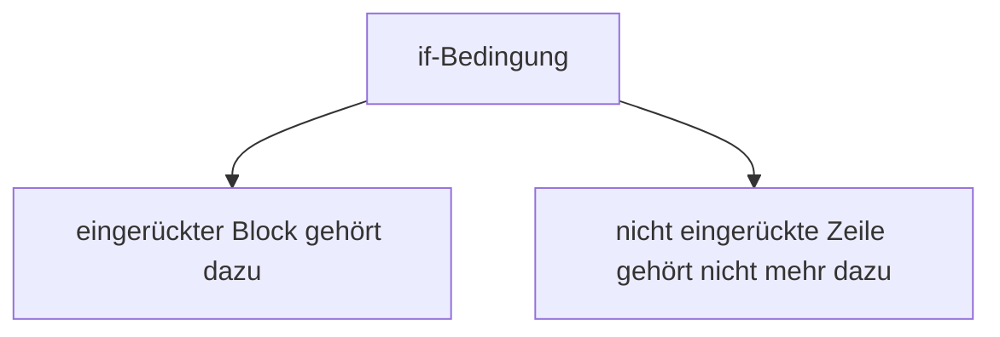

###### Themen

Grundlegende Syntaxelemente

- Aufbau von Python-Code mit Einrückungen und Zeilenstruktur
- Kommentare und deren Nutzen

Arbeiten mit Variablen und Datentypen

- Variablen anlegen und sinnvoll benennen
- Mit Integer, Float, String und Boolean arbeiten

Grundlegende Operatoren

- Mathematische Operatoren anwenden
- Zuweisungsoperatoren verstehen

Ein- und Ausgabe

- Texte und Werte mit print() ausgeben
- Benutzereingaben mit input() verarbeiten


<br><br><br>
# 🧱 Grundlegende Syntaxelemente

Python wirkt am Anfang oft freundlich und lesbar, weil die Sprache sehr viel Wert auf eine klare Struktur legt. Genau deshalb sind Dinge wie **Einrückungen**, **Zeilenstruktur** und **Kommentare** nicht nur „Nebensache“, sondern ein zentraler Teil davon, wie Python-Code funktioniert.


<br><br><br>
## 📐 Aufbau von Python-Code mit Einrückungen und Zeilenstruktur

In Python wird Code nicht nur durch Wörter und Zeichen verstanden, sondern auch durch **Leerraum**. Das ist ein großer Unterschied zu vielen anderen Programmiersprachen.

Wenn du in Python einen Block von Anweisungen schreibst, zum Beispiel den Inhalt einer `if`-Abfrage oder einer Schleife, dann zeigst du diesen Block durch **Einrückung** an. Diese Einrückung ist in Python nicht bloß ein Stilmittel, sondern Teil der Syntax der Sprache ([2. Lexical analysis](https://docs.python.org/3/reference/lexical_analysis.html)).

### 🔍 Was bedeutet Einrückung konkret?

Schau dir dieses Beispiel an:

```python
alter = 18

if alter >= 18:
    print("Du bist volljährig.")
print("Diese Zeile läuft immer.")
```

Hier gehört die Zeile

```python
print("Du bist volljährig.")
```

zur `if`-Bedingung, weil sie eingerückt ist. Die letzte `print()`-Zeile ist **nicht** eingerückt und liegt deshalb **außerhalb** des Blocks.

Wenn du stattdessen so etwas schreibst:

```python
alter = 18

if alter >= 18:
print("Du bist volljährig.")
```

dann versteht Python nicht mehr, wo der Block beginnt, und gibt einen Fehler aus.

### 📏 Wie weit wird eingerückt?

In Python ist es üblich, pro Block **vier Leerzeichen** zu verwenden. Das wird im offiziellen Stil-Leitfaden PEP 8 empfohlen ([PEP 8 – Style Guide for Python Code](https://peps.python.org/pep-0008/)).

Also zum Beispiel:

```python
if True:
    print("Vier Leerzeichen Einrückung")
```

Technisch kann Python auch Tabs verarbeiten, aber in der Praxis solltest du möglichst **konsequent nur vier Leerzeichen** verwenden. Mischungen aus Tabs und Leerzeichen führen schnell zu schwer erkennbaren Fehlern.

### 🧠 Warum ist das wichtig?

Einrückungen helfen dir auf zwei Ebenen:

Erstens versteht **Python** dadurch, welche Zeilen zusammengehören.

Zweitens versteht auch der **Mensch** den Code schneller. Gerade beim Lernen ist das enorm wichtig, weil du dir nicht nur merken musst, *was* du schreibst, sondern auch *wie* der Code logisch gegliedert ist.

### 🧩 Typische Codeblöcke mit Einrückung

Einrückung brauchst du besonders häufig bei:

- `if`, `elif`, `else`
- `for`
- `while`
- Funktionen mit `def`
- Klassen mit `class`

Zum Beispiel:

```python
name = "Lena"

if name == "Lena":
    print("Hallo Lena!")
    print("Schön, dass du da bist.")
else:
    print("Du bist nicht Lena.")
```

Hier sieht man gut: Mehrere eingerückte Zeilen können zu einem einzigen Block gehören.

### 🪜 Zeilenstruktur in Python

Python liest Code in der Regel **Zeile für Zeile**. Oft bedeutet eine neue Zeile auch: Eine Anweisung ist beendet. Das macht Python angenehm lesbar ([3. An Informal Introduction to Python](https://docs.python.org/3/tutorial/introduction.html)).

Ein einfaches Beispiel:

```python
x = 5
y = 10
print(x + y)
```

Jede Zeile enthält eine eigene Anweisung.

### 🔗 Wann darf eine Anweisung über mehrere Zeilen gehen?

Manchmal wird eine Zeile zu lang. Dann kannst du sie sinnvoll auf mehrere Zeilen verteilen.

Python erlaubt das besonders dann, wenn du dich innerhalb von Klammern befindest:

```python
gesamt = (
    10 +
    20 +
    30
)

print(gesamt)
```

Das ist sehr lesbar und wird in der Praxis oft genutzt.

### ⚠️ Häufige Fehler bei Einrückungen

Gerade am Anfang tauchen oft diese Probleme auf:

- Eine Zeile ist zu wenig eingerückt.
- Eine Zeile ist zu weit eingerückt.
- Tabs und Leerzeichen werden gemischt.
- Ein Block beginnt, aber es folgt kein eingerückter Inhalt.

Beispiel für ein Problem:

```python
if 5 > 3:
    print("Das stimmt.")
      print("Diese Einrückung ist kaputt.")
```

Die zweite `print()`-Zeile hat hier eine unpassende Einrückung. Python reagiert darauf sehr streng, weil Einrückung die Struktur des Programms bestimmt.

### 🗺️ So kannst du dir Einrückung vorstellen



Das ist eine gute Denkweise:  
**Eingerückt = gehört zum Block**  
**Nicht eingerückt = Block ist beendet**


<br><br><br>
## 💬 Kommentare und deren Nutzen

Kommentare sind Textstellen im Code, die **für Menschen** gedacht sind. Python führt Kommentare nicht aus. Sie helfen dir dabei, Code verständlicher zu machen ([2. Lexical analysis](https://docs.python.org/3/reference/lexical_analysis.html)).

### ✍️ Wie schreibt man Kommentare?

In Python beginnt ein einzeiliger Kommentar mit `#`:

```python
# Das ist ein Kommentar
x = 10
```

Du kannst Kommentare auch hinter eine Anweisung schreiben:

```python
x = 10  # Startwert
```

### 🧠 Wofür sind Kommentare gut?

Kommentare sind besonders nützlich, wenn du erklären willst:

- **warum** du etwas tust
- **welche Annahme** dein Code macht
- **welcher Abschnitt** zu welchem Teil des Programms gehört

Ein guter Kommentar erklärt also nicht einfach das Offensichtliche, sondern liefert zusätzlichen Sinn.

Schwacher Kommentar:

```python
x = x + 1  # Erhöhe x um 1
```

Das sieht man bereits im Code.

Besserer Kommentar:

```python
x = x + 1  # Zählt den aktuellen Versuch hoch
```

Hier wird klar, **welche Bedeutung** die Anweisung hat.

### 🚫 Was Kommentare nicht tun sollten

Kommentare sollten nicht deinen Code „retten“. Wenn du sehr viel erklären musst, weil der Code selbst chaotisch ist, dann ist meistens eher der Code das Problem.

Zum Beispiel ist das hier unnötig kompliziert:

```python
# Hier speichern wir den Namen des Benutzers in einer Variablen,
# damit wir ihn später ausgeben können
n = input("Name: ")
```

Besser ist oft, den Code selbst klarer zu schreiben:

```python
benutzername = input("Name: ")
```

Jetzt braucht es oft gar keinen Kommentar mehr.

### 🏷️ Kommentare als Lernhilfe

Beim Lernen sind Kommentare sehr wertvoll. Du kannst sie benutzen, um deinen Denkprozess sichtbar zu machen:

```python
# Zuerst Eingabe lesen
zahl = input("Bitte Zahl eingeben: ")

# Später in eine echte Zahl umwandeln
zahl = int(zahl)
```

Das hilft dir, den Ablauf zu verstehen, ohne dass du sofort alles im Kopf behalten musst.

### 📌 Kommentare vs. Dokumentation

Ein Kommentar ist meist kurz und steht direkt im Code.  
Dokumentation ist ausführlicher und erklärt oft ganze Funktionen, Module oder Programme.

Am Anfang reichen normale Kommentare meistens völlig aus. Wichtig ist nur: Schreibe Kommentare so, dass **du oder andere den Code später noch verstehen**.


<br><br><br>
# 🧮 Arbeiten mit Variablen und Datentypen

Variablen und Datentypen gehören zu den absoluten Grundlagen in Python. Wenn du sie sauber verstehst, wird fast alles andere leichter: Rechnen, Vergleiche, Eingaben, Bedingungen, Schleifen und später auch Funktionen.


<br><br><br>
## 🏷️ Variablen anlegen und sinnvoll benennen

Eine Variable ist wie ein **Name für einen Wert**. Du speicherst etwas unter einem Bezeichner, damit du später wieder darauf zugreifen kannst.

Beispiel:

```python
alter = 25
name = "Mia"
```

Hier ist `alter` der Name der Variable, und `25` ist der gespeicherte Wert.  
Bei `name` ist `"Mia"` der gespeicherte Wert.

Python erstellt Variablen durch **Zuweisung**. Du musst sie nicht vorher deklarieren wie in manchen anderen Sprachen. Eine Zuweisung mit `=` bindet einen Namen an ein Objekt ([7. Simple statements](https://docs.python.org/3/reference/simple_stmts.html)).

### 🧠 Was macht die Variable eigentlich?

Wichtig ist: Eine Variable ist nicht „die Kiste selbst“, sondern eher ein **Name**, der auf einen Wert zeigt.

Wenn du schreibst:

```python
punktzahl = 100
```

dann merkt sich Python: Der Name `punktzahl` steht gerade für den Wert `100`.

Später kannst du den Namen wiederverwenden:

```python
punktzahl = 150
```

Dann zeigt `punktzahl` eben nicht mehr auf `100`, sondern auf `150`.

### ✨ Gute Variablennamen

Gute Namen helfen enorm beim Verstehen. Sie sagen dir sofort, was in einer Variable steckt.

Gut:

```python
vorname = "Ali"
temperatur = 21.5
ist_eingeloggt = True
```

Schlecht:

```python
a = "Ali"
x = 21.5
b = True
```

Kurze Namen sind nur dann sinnvoll, wenn der Kontext extrem klar ist. Beim Lernen solltest du lieber **sprechende Namen** wählen.

### 📐 Regeln für Variablennamen

Python hat klare Regeln für Bezeichner. Namen dürfen aus Buchstaben, Ziffern und Unterstrichen bestehen, aber nicht mit einer Ziffer beginnen. Bestimmte reservierte Wörter, sogenannte Keywords, darfst du nicht als Variablennamen verwenden ([2.3. Identifiers and keywords](https://docs.python.org/3/reference/lexical_analysis.html#identifiers)).

Erlaubt:

```python
name
alter2
ist_aktiv
_mein_wert
```

Nicht erlaubt:

```python
2name
mein-wert
class
```

Warum ist `class` nicht erlaubt? Weil `class` in Python bereits eine feste Bedeutung hat.

### 🪄 Sinnvolle Benennung nach PEP 8

Der Python-Stil empfiehlt für Variablen und Funktionen sogenannte `snake_case`, also Wörter mit Unterstrichen ([PEP 8 – Style Guide for Python Code](https://peps.python.org/pep-0008/)).

Beispiele:

```python
vorname = "Sara"
anzahl_treffer = 8
ist_registriert = False
```

Das ist lesbarer als:

```python
Vorname = "Sara"
anzahlTreffer = 8
IstRegistriert = False
```

### 🧭 Gute Denkweise beim Benennen

Ein Variablenname sollte mindestens eine dieser Fragen beantworten:

- Was ist das?
- Wozu dient es?
- Welche Art von Information steckt darin?

Zum Beispiel:

- `preis` statt `p`
- `geburtsjahr` statt `g`
- `hat_bezahlt` statt `status`

Dadurch wird dein Code fast wie ein erklärender Satz lesbar.


<br><br><br>
## 🔢 Mit Integer, Float, String und Boolean arbeiten

Datentypen beschreiben, **welche Art von Wert** eine Variable enthält. Python hat eingebaute Standardtypen wie Zahlen, Texte und Wahrheitswerte ([Built-in Types — Python 3 documentation](https://docs.python.org/3/library/stdtypes.html)).

Die vier Typen, die du genannt hast, sind die wichtigsten für den Einstieg:

- `int` für ganze Zahlen
- `float` für Kommazahlen
- `str` für Texte
- `bool` für Wahr oder Falsch

<br><br><br>
### 📊 Überblick über die wichtigsten Datentypen

| Datentyp | Bedeutung | Beispiel | Typisches Einsatzgebiet |
|---|---|---:|---|
| `int` | Ganze Zahl | `5`, `-3`, `100` | Zählen, Stückzahlen, Jahre |
| `float` | Gleitkommazahl / Kommazahl | `3.14`, `2.5`, `-0.75` | Messen, Preise, Berechnungen |
| `str` | Zeichenkette / Text | `"Hallo"`, `"Python"` | Namen, Texte, Eingaben |
| `bool` | Wahrheitswert | `True`, `False` | Bedingungen, Status, Entscheidungen |

### 🔢 Integer: Ganze Zahlen

Ein `int` speichert ganze Zahlen, also ohne Nachkommastellen.

```python
alter = 20
punkte = 150
temperatur = -5
```

Typische Anwendungen sind Zähler, Jahreszahlen, Stückzahlen oder Punktestände.

Mit `int` kannst du normal rechnen:

```python
a = 10
b = 3

print(a + b)   # 13
print(a - b)   # 7
print(a * b)   # 30
```

### 🌊 Float: Kommazahlen

Ein `float` speichert Zahlen mit Nachkommastellen.

```python
preis = 19.99
pi = 3.14159
temperatur = 21.5
```

In Python wird für Nachkommastellen ein **Punkt** verwendet, kein Komma:

```python
wert = 2.5
```

nicht:

```python
wert = 2,5
```

Denn `2,5` wäre in Python etwas anderes und nicht die gewünschte Kommazahl.

### 🔤 String: Texte

Ein `str` ist eine Zeichenkette, also Text. Texte setzt du in Anführungszeichen:

```python
name = "Mila"
stadt = 'Berlin'
```

Doppelte und einfache Anführungszeichen sind in Python beide erlaubt ([Built-in Types — Python 3 documentation](https://docs.python.org/3/library/stdtypes.html)).

Mit Strings kannst du Texte ausgeben, zusammensetzen oder speichern:

```python
vorname = "Luca"
nachname = "Weber"

ganzer_name = vorname + " " + nachname
print(ganzer_name)
```

Das Ergebnis ist:

```python
Luca Weber
```

### ✅ Boolean: Wahrheitswerte

Ein `bool` hat genau zwei mögliche Werte:

```python
True
False
```

Diese Werte sind wichtig für Entscheidungen im Programm, zum Beispiel in `if`-Abfragen ([Built-in Types — Python 3 documentation](https://docs.python.org/3/library/stdtypes.html)).

Beispiel:

```python
ist_volljaehrig = True
hat_bezahlt = False
```

Später kannst du damit Bedingungen formulieren:

```python
if ist_volljaehrig:
    print("Zugang erlaubt")
```

### 🔄 Datentypen beeinflussen das Verhalten

Sehr wichtig: Derselbe Operator kann je nach Datentyp unterschiedlich wirken.

```python
print(5 + 3)        # 8
print("5" + "3")    # 53
```

Im ersten Fall werden Zahlen addiert.  
Im zweiten Fall werden Texte aneinandergehängt.

Das ist einer der wichtigsten Lernpunkte überhaupt:  
**Nicht nur das Symbol zählt, sondern auch der Datentyp der Werte.**

### 🧪 Den Typ mit `type()` ansehen

Wenn du wissen willst, welchen Typ ein Wert hat, kannst du `type()` benutzen:

```python
x = 42
print(type(x))
```

Oder:

```python
name = "Nora"
print(type(name))
```

Das ist besonders am Anfang hilfreich, um Missverständnisse zu erkennen.

### 🔧 Typumwandlung

Oft musst du einen Wert von einem Typ in einen anderen umwandeln. Das ist später bei `input()` besonders wichtig.

Beispiele:

```python
zahl = "25"
zahl = int(zahl)

preis = "19.99"
preis = float(preis)

alter = 30
alter_text = str(alter)
```

Python stellt dafür eingebaute Funktionen wie `int()`, `float()` und `str()` bereit ([Built-in Functions — Python 3 documentation](https://docs.python.org/3/library/functions.html)).

### ⚠️ Typische Anfängerfehler bei Datentypen

Ein sehr häufiger Fehler ist, einen Text wie eine Zahl behandeln zu wollen:

```python
eingabe = "10"
print(eingabe + 5)
```

Das funktioniert nicht, weil `"10"` ein String ist und `5` eine Zahl. Erst nach einer Umwandlung klappt es:

```python
eingabe = "10"
zahl = int(eingabe)
print(zahl + 5)
```

Ein anderer häufiger Fehler ist, Boolean-Werte mit Texten zu verwechseln:

```python
aktiv = True      # Boolean
aktiv_text = "True"  # String
```

Das sieht ähnlich aus, ist aber nicht dasselbe.


<br><br><br>
# ➗ Grundlegende Operatoren

Operatoren sind die Zeichen, mit denen du Werte verarbeitest. Sie erlauben dir zu rechnen, Werte zuzuweisen oder später auch Vergleiche anzustellen. Für deinen aktuellen Bereich sind vor allem **mathematische Operatoren** und **Zuweisungsoperatoren** entscheidend.


<br><br><br>
## 🧮 Mathematische Operatoren anwenden

Mathematische Operatoren funktionieren in Python sehr ähnlich wie in der normalen Mathematik. Python unterstützt unter anderem Addition, Subtraktion, Multiplikation, Division, Ganzzahldivision, Restbildung und Potenzen ([6. Expressions — Python 3 documentation](https://docs.python.org/3/reference/expressions.html)).

<br><br><br>
### 📊 Wichtige mathematische Operatoren im Überblick

| Operator | Bedeutung | Beispiel | Ergebnis |
|---|---|---|---:|
| `+` | Addition | `5 + 2` | `7` |
| `-` | Subtraktion | `5 - 2` | `3` |
| `*` | Multiplikation | `5 * 2` | `10` |
| `/` | Division | `5 / 2` | `2.5` |
| `//` | Ganzzahldivision | `5 // 2` | `2` |
| `%` | Modulo / Rest | `5 % 2` | `1` |
| `**` | Potenz | `5 ** 2` | `25` |

### ➕ Addition, Subtraktion, Multiplikation

Das sind die vertrautesten Rechenarten:

```python
a = 8
b = 3

print(a + b)   # 11
print(a - b)   # 5
print(a * b)   # 24
```

### ➗ Division mit `/`

Die normale Division liefert in Python ein Ergebnis mit Nachkommastellen, also meist einen `float`:

```python
print(5 / 2)   # 2.5
```

Auch wenn die Rechnung „glatt“ aussieht, ist das Ergebnis bei `/` konzeptionell eine echte Division.

### 🪓 Ganzzahldivision mit `//`

Mit `//` bekommst du den ganzzahligen Anteil:

```python
print(5 // 2)   # 2
```

Das ist nützlich, wenn du zum Beispiel wissen willst, wie viele volle Pakete, Gruppen oder Reihen möglich sind.

### ♻️ Rest mit `%`

Der Modulo-Operator `%` gibt den Rest einer Division zurück:

```python
print(5 % 2)   # 1
print(10 % 3)  # 1
```

Das brauchst du oft, um zu prüfen, ob eine Zahl gerade oder ungerade ist:

```python
zahl = 8
print(zahl % 2)   # 0
```

Rest `0` bedeutet hier: Die Zahl ist durch `2` teilbar.

### 🚀 Potenzen mit `**`

Mit `**` berechnest du Potenzen:

```python
print(2 ** 3)   # 8
print(5 ** 2)   # 25
```

Das ist deutlich bequemer als wiederholtes Multiplizieren.

### 🧠 Reihenfolge der Berechnung

Python beachtet eine feste Operatorrangfolge, ähnlich wie in der Mathematik. Potenzen, Multiplikation und Division haben eine höhere Priorität als Addition und Subtraktion. Mit Klammern kannst du die Reihenfolge klar steuern ([6. Expressions — Python 3 documentation](https://docs.python.org/3/reference/expressions.html)).

Beispiel:

```python
print(2 + 3 * 4)      # 14
print((2 + 3) * 4)    # 20
```

Ohne Klammern wird zuerst `3 * 4` gerechnet.  
Mit Klammern wird zuerst `2 + 3` gerechnet.

### 🔤 Operatoren bei Strings

Ein spannender Punkt: Manche Operatoren funktionieren nicht nur mit Zahlen.

```python
print("Hallo " + "Welt")
print("Hi" * 3)
```

Das ergibt:

```python
Hallo Welt
HiHiHi
```

Hier bedeutet `+` nicht Addition, sondern Verknüpfung von Text.  
`*` kann einen String mehrfach wiederholen.

Auch daran siehst du wieder: **Datentypen bestimmen mit, wie sich Operatoren verhalten.**


<br><br><br>
## 🪢 Zuweisungsoperatoren verstehen

Zuweisungsoperatoren weisen einer Variablen einen Wert zu oder verändern den vorhandenen Wert. Der wichtigste Zuweisungsoperator ist `=` ([7. Simple statements — Python 3 documentation](https://docs.python.org/3/reference/simple_stmts.html)).

### 🟰 Die einfache Zuweisung mit `=`

Beispiel:

```python
x = 10
```

Das bedeutet: Der Name `x` bekommt den Wert `10`.

Wichtig: Das `=` in Python bedeutet **nicht** „ist gleich“ im mathematischen Sinn, sondern „weise zu“.

Deshalb ist diese Zeile völlig normal:

```python
x = x + 1
```

Mathematisch wäre das unsinnig. In Python heißt es aber:  
Nimm den bisherigen Wert von `x`, addiere `1`, und speichere das Ergebnis wieder in `x`.

### 🔁 Verkürzte Zuweisungen

Python kennt auch verkürzte Schreibweisen wie:

- `+=`
- `-=`
- `*=`
- `/=`
- `//=`
- `%=`
- `**=`

Diese Schreibweisen kombinieren Rechnen und Zuweisen in einem Schritt ([7. Simple statements — Python 3 documentation](https://docs.python.org/3/reference/simple_stmts.html)).

Beispiele:

```python
x = 10
x += 5
print(x)   # 15
```

Das ist dasselbe wie:

```python
x = 10
x = x + 5
print(x)
```

Weitere Beispiele:

```python
kontostand = 100
kontostand -= 20
print(kontostand)   # 80
```

```python
punkte = 4
punkte *= 3
print(punkte)   # 12
```

### 📊 Überblick über wichtige Zuweisungsoperatoren

| Operator | Bedeutung | Beispiel | Entspricht |
|---|---|---|---|
| `=` | Wert zuweisen | `x = 5` | `x bekommt 5` |
| `+=` | addieren und zuweisen | `x += 2` | `x = x + 2` |
| `-=` | subtrahieren und zuweisen | `x -= 2` | `x = x - 2` |
| `*=` | multiplizieren und zuweisen | `x *= 2` | `x = x * 2` |
| `/=` | dividieren und zuweisen | `x /= 2` | `x = x / 2` |
| `//=` | ganzzahlig dividieren und zuweisen | `x //= 2` | `x = x // 2` |
| `%=` | Rest berechnen und zuweisen | `x %= 2` | `x = x % 2` |
| `**=` | potenzieren und zuweisen | `x **= 2` | `x = x ** 2` |

### 🧠 Warum sind verkürzte Zuweisungen hilfreich?

Sie machen Code oft kompakter und klarer, besonders wenn eine Variable Schritt für Schritt verändert wird.

Zum Beispiel bei einem Zähler:

```python
zaehler = 0
zaehler += 1
zaehler += 1
zaehler += 1
```

Hier siehst du direkt: Der Wert steigt jedes Mal an.

### ⚠️ Wichtige Unterscheidung: `=` ist nicht `==`

Auch wenn du `==` erst später intensiver brauchst, ist die Unterscheidung jetzt schon wichtig:

- `=` weist zu
- `==` vergleicht

Beispiel:

```python
x = 5
print(x == 5)
```

Hier bekommt `x` zuerst den Wert `5`. Danach prüft `x == 5`, ob `x` gleich `5` ist. Das Ergebnis ist `True`.

Diese Unterscheidung verursacht am Anfang sehr oft Verwirrung. Achte deshalb bewusst darauf, ob du gerade **speichern** oder **vergleichen** willst.


<br><br><br>
# 🖥️ Ein- und Ausgabe

Ein Programm ist dann besonders nützlich, wenn es etwas nach außen zeigt oder Daten von außen annimmt. Genau darum geht es bei der Ausgabe mit `print()` und der Eingabe mit `input()`.


<br><br><br>
## 📤 Texte und Werte mit `print()` ausgeben

`print()` ist eine eingebaute Python-Funktion, mit der du Werte auf dem Bildschirm ausgeben kannst ([Built-in Functions — Python 3 documentation](https://docs.python.org/3/library/functions.html)).

### 📝 Einfache Ausgaben

```python
print("Hallo Welt")
print(42)
print(True)
```

`print()` kann also Texte, Zahlen und Wahrheitswerte ausgeben.

### 🧩 Variablen ausgeben

Du kannst auch den Inhalt von Variablen ausgeben:

```python
name = "Emil"
alter = 17

print(name)
print(alter)
```

### 🔗 Mehrere Werte gleichzeitig ausgeben

`print()` kann mehrere Werte in einem Aufruf ausgeben:

```python
name = "Emil"
alter = 17

print("Name:", name, "Alter:", alter)
```

Zwischen den Werten setzt `print()` standardmäßig Leerzeichen. Das ist Teil des Standardverhaltens der Funktion ([Built-in Functions — Python 3 documentation](https://docs.python.org/3/library/functions.html)).

Die Ausgabe sieht dann so aus:

```python
Name: Emil Alter: 17
```

### 🎨 Text und Werte kombinieren

Ein klassischer Anfängerweg ist:

```python
name = "Sina"
print("Hallo " + name)
```

Das funktioniert gut, solange beide Teile Strings sind.

Wenn du aber Zahlen mit `+` direkt an Text hängen willst, gibt es ein Problem:

```python
alter = 18
print("Ich bin " + alter)
```

Das funktioniert nicht, weil `"Ich bin "` ein String ist und `alter` eine Zahl. Du musst die Zahl zuerst umwandeln:

```python
alter = 18
print("Ich bin " + str(alter))
```

Oder du gibst mehrere Argumente an `print()` weiter, was oft einfacher ist:

```python
alter = 18
print("Ich bin", alter)
```

### 🧠 Warum `print()` beim Lernen so wichtig ist

`print()` ist nicht nur für die Ausgabe an Benutzer da. Es ist auch eines deiner besten Werkzeuge, um zu verstehen, was dein Code gerade tut.

Du kannst zum Beispiel prüfen:

- Welchen Wert hat eine Variable gerade?
- Wurde eine Eingabe richtig gespeichert?
- Ist ein Rechenschritt so gelaufen, wie du erwartet hast?

Beispiel:

```python
preis = 19.99
anzahl = 3
gesamt = preis * anzahl

print("Preis:", preis)
print("Anzahl:", anzahl)
print("Gesamt:", gesamt)
```

So machst du den inneren Zustand deines Programms sichtbar.

### 🗺️ `print()` im Programmfluss

```mermaid
flowchart LR
    A[Werte im Programm] --> B[print()]
    B --> C[Ausgabe im Terminal oder in der Konsole]
```

Das ist die Grundidee:  
Dein Programm hat intern Werte, und `print()` zeigt sie nach außen.


<br><br><br>
## 📥 Benutzereingaben mit `input()` verarbeiten

`input()` ist ebenfalls eine eingebaute Python-Funktion. Sie liest eine Eingabe des Benutzers und gibt sie als **String** zurück ([Built-in Functions — Python 3 documentation](https://docs.python.org/3/library/functions.html)).

Dieser Punkt ist extrem wichtig:  
**`input()` liefert immer Text zurück**, selbst wenn der Benutzer eine Zahl eingibt.

### ✍️ Einfache Eingabe

```python
name = input("Wie heißt du? ")
print("Hallo", name)
```

Ablauf:

1. Python zeigt den Text `Wie heißt du? ` an.
2. Der Benutzer tippt etwas ein.
3. Diese Eingabe wird in `name` gespeichert.
4. Danach kann sie weiterverarbeitet werden.

### 🧠 Was genau kommt aus `input()` zurück?

Wenn der Benutzer `25` eintippt, ist das Ergebnis nicht die Zahl `25`, sondern der String `"25"`.

Das ist entscheidend für spätere Berechnungen.

Beispiel:

```python
alter = input("Wie alt bist du? ")
print(type(alter))
```

Die Ausgabe zeigt einen String-Typ an.

### 🔄 Eingaben in Zahlen umwandeln

Wenn du mit einer Eingabe rechnen willst, musst du sie umwandeln:

```python
alter = input("Wie alt bist du? ")
alter = int(alter)

print(alter + 1)
```

Oder kürzer:

```python
alter = int(input("Wie alt bist du? "))
print(alter + 1)
```

Für Kommazahlen nutzt du `float()`:

```python
preis = float(input("Preis eingeben: "))
print(preis * 2)
```

Die Umwandlung mit `int()` und `float()` verwendet eingebaute Funktionen von Python ([Built-in Functions — Python 3 documentation](https://docs.python.org/3/library/functions.html)).

### ⚠️ Was passiert bei falscher Eingabe?

Wenn du `int()` verwendest und der Benutzer gibt keinen passenden Ganzzahl-Text ein, entsteht ein Fehler.

Zum Beispiel:

```python
zahl = int(input("Bitte Zahl eingeben: "))
```

Wenn jemand `abc` eingibt, kann Python daraus keine ganze Zahl machen.

Für den Einstieg ist hier vor allem wichtig, das Prinzip zu verstehen:  
**Eingabe lesen → passenden Datentyp herstellen → weiterverarbeiten**

### 🧭 Typischer Ablauf bei Eingaben

```mermaid
flowchart TD
    A[Benutzer tippt etwas ein] --> B[input()]
    B --> C[String wird zurückgegeben]
    C --> D{Soll damit gerechnet werden?}
    D -- Ja --> E[int() oder float()]
    D -- Nein --> F[als String weiterverwenden]
```

Das ist eine der wichtigsten Grundlagen im ganzen Einstieg in Python.

### 🧩 Beispiele für verschiedene Eingaben

#### 🔤 Texteingabe

```python
stadt = input("In welcher Stadt wohnst du? ")
print("Du wohnst in", stadt)
```

Hier bleibt die Eingabe ein String. Das ist genau richtig.

#### 🔢 Ganzzahlige Eingabe

```python
anzahl = int(input("Wie viele Tickets möchtest du? "))
print("Du hast", anzahl, "Tickets gewählt.")
```

Hier wird der Text in eine ganze Zahl umgewandelt.

#### 🌊 Kommazahl-Eingabe

```python
temperatur = float(input("Welche Temperatur wurde gemessen? "))
print("Gemessene Temperatur:", temperatur)
```

Hier wird der Text in eine Kommazahl umgewandelt.

### 🔍 `input()` und `print()` zusammen gedacht

Sehr viele kleine Programme folgen genau diesem Muster:

1. Eingabe holen
2. Daten verarbeiten
3. Ergebnis ausgeben

Zum Beispiel:

```python
name = input("Name: ")
alter = int(input("Alter: "))

print("Hallo", name)
print("Nächstes Jahr bist du", alter + 1)
```

Das ist bereits die Grundstruktur vieler echter Programme.

### 🧠 Didaktisch wichtiger Lernpunkt

Wenn du Python lernst, solltest du bei Ein- und Ausgabe gedanklich immer zwischen drei Ebenen unterscheiden:

- **Was der Benutzer sieht**
- **Was Python intern speichert**
- **Welchen Datentyp der Wert intern hat**

Ein Beispiel:

```python
eingabe = input("Bitte Zahl eingeben: ")
print(eingabe)
print(type(eingabe))
```

Der Benutzer sieht vielleicht `7`.  
Python speichert aber `"7"` als Text.  
Erst mit `int(eingabe)` wird daraus die Zahl `7`.

Genau dieses saubere Denken verhindert später sehr viele Fehler.
