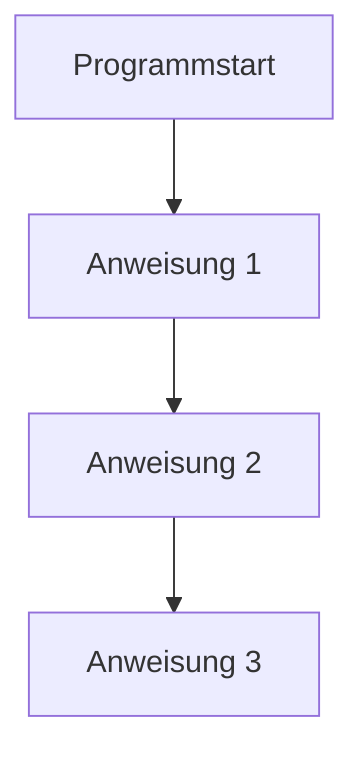
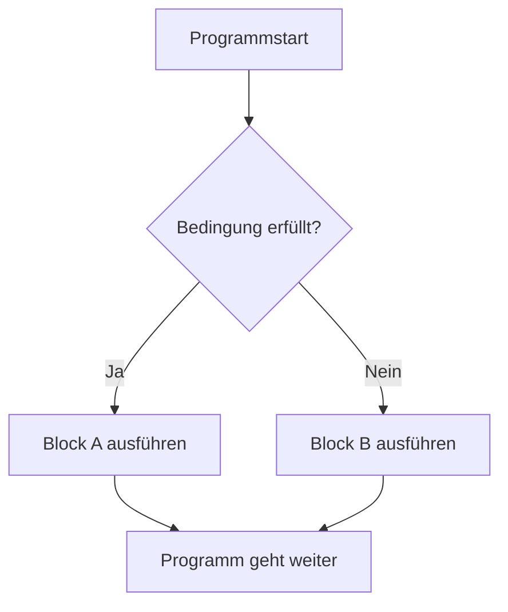
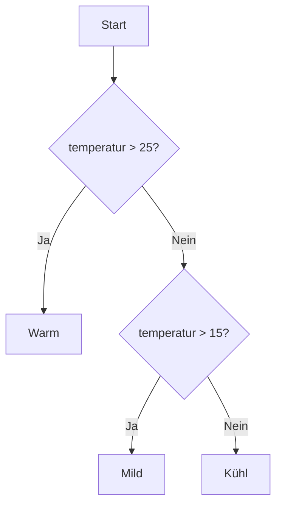
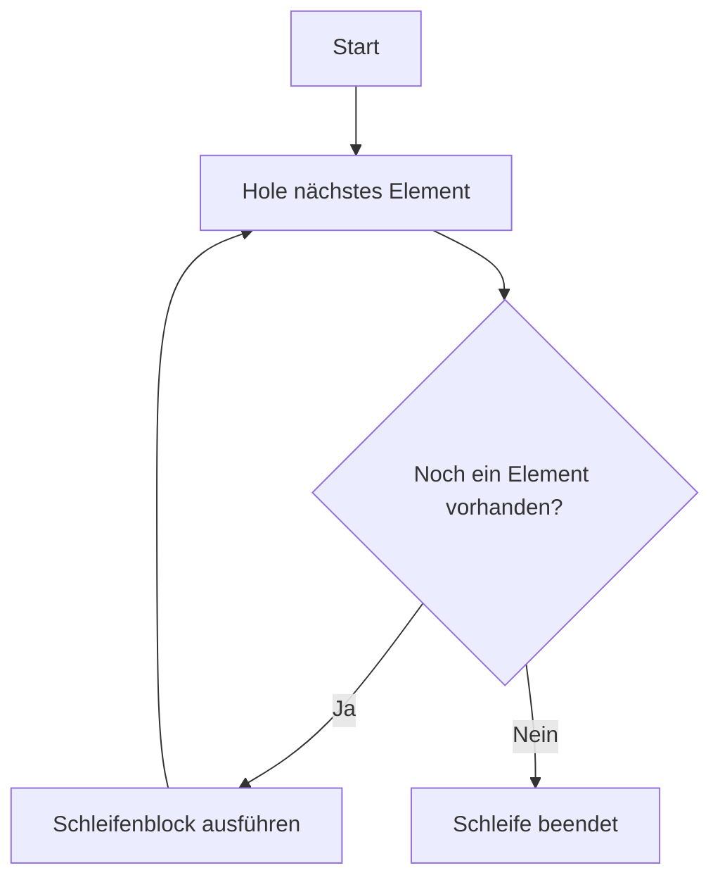
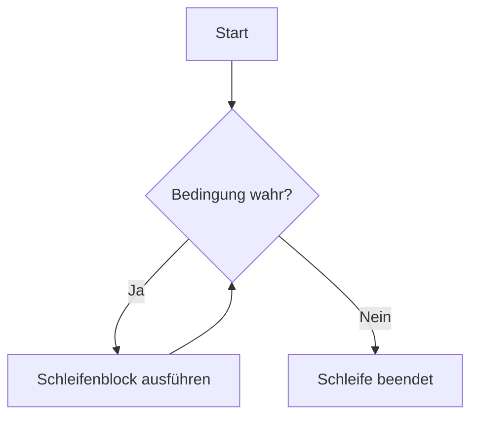

###### Themen

Kontrollstrukturen verstehen

- Bedeutung von Kontrollstrukturen im Programmablauf
- Unterschied zwischen sequenzieller und verzweigter Ausführung

Bedingungen mit if, elif, else

- Aufbau und Syntax von if-Anweisungen
- Bedingungen mit elif und else erweitern

Vergleichs- und logische Operatoren

- Vergleichsoperatoren in Bedingungen nutzen
- Logische Verknüpfungen mit and, or und not anwenden

Schleifen in Python

- for-Schleifen einsetzen
- while-Schleifen grundlegend verstehen
- Einfache Wiederholungen mit Schleifen umsetzen

<br><br><br>
# 🧭 Kontrollstrukturen verstehen

Kontrollstrukturen sind ein zentrales Grundprinzip der Programmierung. Sie bestimmen, **in welcher Reihenfolge** ein Programm Anweisungen ausführt, **unter welchen Bedingungen** bestimmte Teile laufen und **wie oft** etwas wiederholt wird. Ohne Kontrollstrukturen wäre ein Programm nur eine starre Liste von Befehlen, die immer exakt von oben nach unten abgearbeitet wird.

Gerade in Python gehören Kontrollstrukturen zu den wichtigsten Fundamenten, weil du mit ihnen aus „einzelnen Befehlen“ wirkliches Verhalten formst. Ein Programm kann dadurch Entscheidungen treffen, auf Eingaben reagieren und Abläufe wiederholen. Die Python-Dokumentation beschreibt diese Werkzeuge unter den „Control Flow Tools“, also Werkzeugen zur Steuerung des Programmflusses ([The Python Tutorial – More Control Flow Tools](https://docs.python.org/3/tutorial/controlflow.html)).

Einfach gesagt:

- **Kontrollstrukturen lenken den Ablauf eines Programms**
- sie machen Programme **dynamisch**
- sie sorgen dafür, dass Code **nicht nur ausgeführt**, sondern auch **gesteuert** wird

Stell dir ein Programm wie einen Weg durch ein Gebäude vor. Ohne Kontrollstrukturen gehst du einfach Flur für Flur geradeaus. Mit Kontrollstrukturen kannst du:

- an einer Kreuzung links oder rechts abbiegen
- so lange im Kreis laufen, bis etwas erledigt ist
- einen Bereich überspringen, wenn eine Bedingung nicht erfüllt ist

Genau das machen `if`, `elif`, `else`, `for` und `while`.


<br><br><br>
## 🔄 Bedeutung von Kontrollstrukturen im Programmablauf

Ein Programm besteht aus Anweisungen. Normalerweise werden diese Anweisungen **nacheinander** ausgeführt. Das nennt man **sequenzielle Ausführung**. In der Praxis reicht das aber fast nie aus.

Denn echte Programme müssen auf Situationen reagieren, zum Beispiel:

- Ist ein Passwort korrekt?
- Ist ein Konto gedeckt?
- Gibt es noch weitere Daten zu verarbeiten?
- Soll ein Menüpunkt wiederholt angezeigt werden?

Hier kommen Kontrollstrukturen ins Spiel. Sie beeinflussen den sogenannten **Kontrollfluss** oder **Programmablauf**. Das heißt: Sie entscheiden, **welche Anweisung als Nächstes dran ist**.

Die wichtigsten Arten sind:

| Art der Kontrollstruktur | Zweck | Typische Python-Konstrukte |
|---|---|---|
| Verzweigung | Entscheidungen treffen | `if`, `elif`, `else` |
| Wiederholung | Dinge mehrfach ausführen | `for`, `while` |
| Verschachtelung | Strukturen ineinander kombinieren | `if` in `for`, `while` in `if` usw. |

Wenn du Kontrollstrukturen verstehst, verstehst du nicht nur Syntax, sondern auch das Denken hinter Programmen: **Ein Programm ist kein Textblock, sondern ein gelenkter Ablauf**.


<br><br><br>
## 🛤️ Unterschied zwischen sequenzieller und verzweigter Ausführung

### 📌 Sequenzielle Ausführung

Bei der **sequenziellen Ausführung** läuft ein Programm Zeile für Zeile von oben nach unten. Jede Anweisung wird genau in der Reihenfolge bearbeitet, in der sie im Code steht.

Beispiel:

```python
print("Start")
print("Daten werden geladen")
print("Fertig")
```

Hier passiert nichts Überraschendes. Python führt erst die erste `print`-Anweisung aus, dann die zweite, dann die dritte.

Das ist der einfachste Ablauf und der Standardfall in Programmen.


### 🌿 Verzweigte Ausführung

Bei der **verzweigten Ausführung** hängt der weitere Ablauf von einer **Bedingung** ab. Es wird also nicht immer derselbe Weg genommen. Stattdessen entscheidet das Programm abhängig von einem Wahrheitswert, welcher Block ausgeführt wird.

Beispiel:

```python
alter = 17

if alter >= 18:
    print("Volljährig")
else:
    print("Minderjährig")
```

Hier gibt es zwei mögliche Wege. Welcher ausgeführt wird, hängt davon ab, ob `alter >= 18` wahr oder falsch ist.

Das ist der Kern einer Verzweigung:

- **wahr** → ein bestimmter Block wird ausgeführt
- **falsch** → ein anderer Block oder gar keiner wird ausgeführt

In Python wird dafür die `if`-Anweisung verwendet ([The Python Tutorial – if Statements](https://docs.python.org/3/tutorial/controlflow.html#if-statements)).


### 🧠 Warum dieser Unterschied so wichtig ist

Sequenzielle Ausführung bedeutet: **Der Ablauf ist fest**.

Verzweigte Ausführung bedeutet: **Der Ablauf ist abhängig von Daten, Zuständen oder Eingaben**.

Das ist ein riesiger Unterschied. Erst durch Verzweigungen kann Software „intelligent“ wirken. Natürlich denkt das Programm nicht wirklich nach, aber es kann auf Bedingungen reagieren und unterschiedliche Wege einschlagen.

Hier als einfache Visualisierung:



Das ist sequenziell: immer derselbe Ablauf.



Das ist verzweigt: Der Weg hängt von einer Bedingung ab.


### 🧱 Ein technischer, aber sehr wichtiger Punkt: Einrückung

In Python werden Codeblöcke nicht mit geschweiften Klammern, sondern durch **Einrückung** definiert. Das ist ein Grundprinzip der Sprache ([The Python Tutorial – More Control Flow Tools](https://docs.python.org/3/tutorial/controlflow.html)).

Beispiel:

```python
if True:
    print("Dieser Code gehört zum if-Block")
print("Dieser Code liegt außerhalb")
```

Die Einrückung sagt Python ganz klar, was zum Block gehört und was nicht. Das macht Python-Code oft sehr lesbar, verlangt aber sauberes Arbeiten.


<br><br><br>
# 🧩 Bedingungen mit `if`, `elif`, `else`

Mit `if`, `elif` und `else` kann ein Python-Programm Entscheidungen treffen. Diese Konstrukte sind die Grundlage für fast alle Reaktionen auf Zustände, Eingaben und Daten.

Du kannst dir das vorstellen wie ein Fragesystem:

- **if** = „Wenn das stimmt, dann …“
- **elif** = „Andernfalls, wenn stattdessen das hier stimmt, dann …“
- **else** = „Wenn nichts davon stimmt, dann …“


<br><br><br>
## 🧱 Aufbau und Syntax von `if`-Anweisungen

Die einfachste Form einer Bedingung in Python ist `if`.

Allgemeine Form:

```python
if bedingung:
    anweisung
```

Wichtig sind drei Dinge:

1. Nach `if` steht eine **Bedingung**
2. Die Zeile endet mit einem **Doppelpunkt**
3. Der auszuführende Block wird **eingerückt**

Beispiel:

```python
temperatur = 30

if temperatur > 25:
    print("Es ist warm")
```

Wenn `temperatur > 25` wahr ist, wird die Ausgabe gemacht. Wenn nicht, passiert einfach nichts.

Eine `if`-Anweisung bedeutet also:  
**Führe den eingerückten Block nur dann aus, wenn die Bedingung wahr ist.**

In Python werden Bedingungen als **Boolesche Werte** ausgewertet, also letztlich als `True` oder `False` ([Built-in Types – Truth Value Testing](https://docs.python.org/3/library/stdtypes.html#truth-value-testing)).


### 🔍 Was genau ist eine Bedingung?

Eine Bedingung ist ein Ausdruck, der zu `True` oder `False` wird.

Zum Beispiel:

```python
zahl = 10

print(zahl > 5)   # True
print(zahl < 5)   # False
```

Solche Ausdrücke können aus Vergleichen, logischen Verknüpfungen oder allgemein aus Werten bestehen, die Python als wahr oder falsch interpretiert.

Zum Beispiel gelten in Python unter anderem diese Werte als „falsch“:

- `False`
- `None`
- `0`
- `0.0`
- `""` (leerer String)
- `[]` (leere Liste)

Das ist Teil des Konzepts der **Truthiness**, also der Wahrheitswertauswertung in Python ([Built-in Types – Truth Value Testing](https://docs.python.org/3/library/stdtypes.html#truth-value-testing)).


### 🧠 Wie Python eine `if`-Anweisung verarbeitet

Python arbeitet bei einer `if`-Anweisung in dieser Reihenfolge:

1. Die Bedingung wird ausgewertet
2. Ist sie `True`, wird der eingerückte Block ausgeführt
3. Ist sie `False`, wird der Block übersprungen

Beispiel:

```python
name = "Mila"

if name == "Mila":
    print("Name erkannt")

print("Programm läuft weiter")
```

Wenn die Bedingung wahr ist, erscheint zuerst `Name erkannt`, danach `Programm läuft weiter`.  
Ist sie falsch, wird nur `Programm läuft weiter` ausgegeben.

Das zeigt etwas Wichtiges: Kontrollstrukturen **unterbrechen nicht das ganze Programm**, sondern steuern nur den Teil, auf den sie sich beziehen.


### ⚠️ Typische Denkfehler bei `if`

Ein häufiger Fehler ist zu glauben, dass Python „rät“, was gemeint ist. Python ist aber sehr exakt.

Beispiel für sauberen Code:

```python
punktzahl = 80

if punktzahl >= 50:
    print("Bestanden")
```

Hier ist die Bedingung eindeutig.

Ein häufiger Anfängerfehler wäre dagegen etwas wie:

```python
if punktzahl:
    print("Bestanden")
```

Das ist zwar syntaktisch erlaubt, bedeutet aber nur: „Ist `punktzahl` ein wahrer Wert?“ Da `80` nicht `0` ist, gilt das als wahr. Inhaltlich ist das aber etwas völlig anderes als „mindestens 50 Punkte“.

Das ist ein wichtiger Lernpunkt:  
**Nicht nur schreiben, was funktioniert, sondern schreiben, was fachlich genau das ausdrückt, was du meinst.**


<br><br><br>
## 🌿 Bedingungen mit `elif` und `else` erweitern

Oft reicht eine einzelne `if`-Bedingung nicht aus. Dann kannst du den Entscheidungsbaum erweitern.

- `elif` steht für **else if**
- `else` ist der Standardfall, wenn nichts anderes zutrifft

Allgemeine Form:

```python
if bedingung_1:
    block_1
elif bedingung_2:
    block_2
else:
    block_3
```

Python prüft diese Bedingungen **von oben nach unten**. Sobald eine Bedingung wahr ist, wird der zugehörige Block ausgeführt und die restlichen Zweige werden **nicht mehr geprüft** ([The Python Tutorial – if Statements](https://docs.python.org/3/tutorial/controlflow.html#if-statements)).


### 🌡️ Beispiel mit mehreren Fällen

```python
temperatur = 18

if temperatur > 25:
    print("Warm")
elif temperatur > 15:
    print("Mild")
else:
    print("Kühl")
```

Was passiert hier?

- Zuerst prüft Python: `temperatur > 25`
- Das ist bei `18` falsch
- Dann prüft Python: `temperatur > 15`
- Das ist wahr
- Also wird `Mild` ausgegeben
- `else` wird nicht mehr betrachtet

Wichtig ist: `elif` ist keine zweite, unabhängige `if`-Anweisung. Es ist Teil **derselben Entscheidungskette**.


### 🧭 Die Reihenfolge ist entscheidend

Die Reihenfolge von Bedingungen ist bei `if`-`elif`-`else` sehr wichtig.

Schau dir dieses Beispiel an:

```python
zahl = 12

if zahl > 0:
    print("Positiv")
elif zahl > 10:
    print("Größer als 10")
```

Hier wird bei `zahl = 12` nur `Positiv` ausgegeben. Warum?  
Weil die erste Bedingung bereits wahr ist. Python prüft danach nicht weiter.

Wenn du speziellere Fälle zuerst behandeln willst, musst du sie **vor allgemeineren Fällen** prüfen:

```python
zahl = 12

if zahl > 10:
    print("Größer als 10")
elif zahl > 0:
    print("Positiv")
```

Das ist ein sehr typisches Prinzip in der Programmierung:  
**Spezielle Fälle vor allgemeinen Fällen.**


### 🚪 Die Rolle von `else`

`else` bedeutet: „Falls keine der vorherigen Bedingungen zutrifft, dann diesen Block ausführen.“

Beispiel:

```python
login_erfolgreich = False

if login_erfolgreich:
    print("Willkommen")
else:
    print("Zugriff verweigert")
```

`else` hat **keine eigene Bedingung**. Es ist der Auffangfall.

Das ist besonders nützlich, wenn du sicherstellen möchtest, dass auf jeden Fall genau einer von mehreren Wegen gewählt wird.


### 🧱 Verschachtelte Bedingungen

Bedingungen können auch ineinander verschachtelt werden. Das bedeutet: Innerhalb eines `if`-Blocks steht ein weiteres `if`.

Beispiel:

```python
alter = 20
hat_ausweis = True

if alter >= 18:
    if hat_ausweis:
        print("Einlass erlaubt")
    else:
        print("Ausweis fehlt")
else:
    print("Zu jung")
```

Das ist logisch korrekt, aber man sollte Verschachtelungen nicht unnötig tief machen, weil der Code sonst schwerer lesbar wird.

Oft kann man Bedingungen auch kombinieren:

```python
if alter >= 18 and hat_ausweis:
    print("Einlass erlaubt")
```

Das ist kompakter und oft klarer. Wie diese logischen Verknüpfungen funktionieren, schauen wir uns gleich genauer an.


### 🖼️ Entscheidungslogik als Ablaufdiagramm



So kannst du dir `if`-`elif`-`else` vorstellen: als Baum mit Entscheidungszweigen.


<br><br><br>
# 🧮 Vergleichs- und logische Operatoren

Bedingungen bestehen fast immer aus **Operatoren**. Diese Operatoren vergleichen Werte oder verknüpfen mehrere Bedingungen miteinander.

Zwei große Gruppen sind hier wichtig:

- **Vergleichsoperatoren**: vergleichen Werte miteinander
- **logische Operatoren**: verbinden mehrere Bedingungen


<br><br><br>
## ⚖️ Vergleichsoperatoren in Bedingungen nutzen

Vergleichsoperatoren liefern immer einen Wahrheitswert, also `True` oder `False` ([Python Language Reference – Comparisons](https://docs.python.org/3/reference/expressions.html#comparisons)).

Die wichtigsten Vergleichsoperatoren in Python sind:

| Operator | Bedeutung | Beispiel | Ergebnis bei `x = 5` |
|---|---|---|---|
| `==` | gleich | `x == 5` | `True` |
| `!=` | ungleich | `x != 5` | `False` |
| `>` | größer als | `x > 3` | `True` |
| `<` | kleiner als | `x < 3` | `False` |
| `>=` | größer oder gleich | `x >= 5` | `True` |
| `<=` | kleiner oder gleich | `x <= 4` | `False` |

Diese Operatoren bilden die Grundlage fast aller Bedingungen.


### 🔍 `==` ist nicht dasselbe wie `=`

Das ist ein ganz wichtiger Punkt.

- `=` bedeutet: **einen Wert zuweisen**
- `==` bedeutet: **zwei Werte vergleichen**

Beispiel:

```python
zahl = 10
```

Hier bekommt die Variable `zahl` den Wert `10`.

```python
zahl == 10
```

Hier wird geprüft, ob `zahl` den Wert `10` hat.

Das ist einer der häufigsten Anfängerfehler überhaupt. Fachlich ist der Unterschied fundamental:  
Das eine **ändert** einen Wert, das andere **prüft** einen Wert.


### 🔠 Vergleiche mit Zahlen, Texten und anderen Werten

Vergleichsoperatoren lassen sich nicht nur mit Zahlen verwenden.

Beispiel mit Text:

```python
name = "Lena"

if name == "Lena":
    print("Name stimmt")
```

Auch Wahrheitswerte lassen sich vergleichen:

```python
aktiv = True

if aktiv == True:
    print("Aktiv")
```

In Python schreibt man in solchen Fällen oft kürzer:

```python
if aktiv:
    print("Aktiv")
```

Das ist lesbarer, wenn es wirklich um einen Bool-Wert geht.

Wichtig ist: Verglichen werden sollten nur Werte, deren Vergleich auch fachlich sinnvoll ist.


### 🔗 Vergleichsketten in Python

Python erlaubt Vergleichsketten wie:

```python
alter = 20

if 18 <= alter < 30:
    print("Zwischen 18 und 29")
```

Das ist in Python eine eingebaute Sprachfunktion und nicht nur eine Schreibweise mit zwei getrennten Vergleichen ([Python Language Reference – Comparisons](https://docs.python.org/3/reference/expressions.html#comparisons)).

Diese Form ist oft sehr lesbar und elegant.


<br><br><br>
## 🧠 Logische Verknüpfungen mit `and`, `or` und `not` anwenden

Mit logischen Operatoren kannst du mehrere Bedingungen kombinieren. Das ist notwendig, wenn eine Entscheidung von mehr als einem Kriterium abhängt.

Die drei zentralen logischen Operatoren in Python sind:

- `and`
- `or`
- `not`

Sie gehören zu den Booleschen Operationen in Python ([Python Language Reference – Boolean Operations](https://docs.python.org/3/reference/expressions.html#boolean-operations)).


### 🔗 `and` – beide Bedingungen müssen wahr sein

`and` bedeutet: Das Gesamtergebnis ist nur dann wahr, wenn **beide** Bedingungen wahr sind.

Beispiel:

```python
alter = 20
hat_ticket = True

if alter >= 18 and hat_ticket:
    print("Einlass erlaubt")
```

Hier reicht nicht nur das Alter, und auch nicht nur das Ticket. Beides muss stimmen.

Denkweise:

- wahr und wahr → wahr
- wahr und falsch → falsch
- falsch und wahr → falsch
- falsch und falsch → falsch


### 🔀 `or` – mindestens eine Bedingung muss wahr sein

`or` bedeutet: Das Gesamtergebnis ist wahr, wenn **mindestens eine** der Bedingungen wahr ist.

Beispiel:

```python
ist_wochenende = False
hat_urlaub = True

if ist_wochenende or hat_urlaub:
    print("Heute ist frei")
```

Hier reicht schon einer der beiden Gründe.

Denkweise:

- wahr oder wahr → wahr
- wahr oder falsch → wahr
- falsch oder wahr → wahr
- falsch oder falsch → falsch


### 🚫 `not` – kehrt eine Bedingung um

`not` dreht den Wahrheitswert um:

- aus `True` wird `False`
- aus `False` wird `True`

Beispiel:

```python
eingeloggt = False

if not eingeloggt:
    print("Bitte anmelden")
```

Das bedeutet: „Wenn nicht eingeloggt, dann …“

`not` ist sehr nützlich, wenn du auf das **Nicht-Vorliegen** eines Zustands prüfen willst.


### 📋 Wahrheitstabelle

| A | B | `A and B` | `A or B` | `not A` |
|---|---|---|---|---|
| `True` | `True` | `True` | `True` | `False` |
| `True` | `False` | `False` | `True` | `False` |
| `False` | `True` | `False` | `True` | `True` |
| `False` | `False` | `False` | `False` | `True` |


### 🧩 Bedingungen kombinieren

Beispiel:

```python
alter = 22
mitglied = True
gesperrt = False

if alter >= 18 and mitglied and not gesperrt:
    print("Zugang erlaubt")
```

Hier wird eine realistische Regel modelliert:

- mindestens 18 Jahre
- Mitglied
- nicht gesperrt

Das ist ein sehr typisches Muster in echter Softwareentwicklung: mehrere Bedingungen werden zu einer fachlichen Regel kombiniert.


### ⚠️ Operatoren richtig lesen

Ein häufiger Denkfehler ist, logische Ausdrücke zu schnell zu lesen. Gerade bei `not` sollte man bewusst prüfen, worauf es sich bezieht.

Beispiel:

```python
if not alter >= 18:
    print("Nicht volljährig")
```

Das ist korrekt, aber oft weniger klar als:

```python
if alter < 18:
    print("Nicht volljährig")
```

Beides kann funktionieren, aber die zweite Variante ist meist leichter lesbar.

Beim Lernen solltest du dir deshalb immer diese Frage stellen:  
**Ist mein Ausdruck nicht nur korrekt, sondern auch verständlich?**


### ⚙️ Kurzschlussauswertung

Python wertet logische Ausdrücke oft nicht vollständig aus, wenn das Ergebnis schon feststeht. Das nennt man **Short-Circuit Evaluation** ([Python Language Reference – Boolean Operations](https://docs.python.org/3/reference/expressions.html#boolean-operations)).

Beispiel:

```python
x = 10

if x > 5 or x / 0 > 1:
    print("Bedingung ist wahr")
```

Hier tritt kein Fehler durch Division durch Null auf, weil `x > 5` bereits wahr ist. Python muss den rechten Teil gar nicht mehr auswerten.

Ebenso bei `and`:

```python
x = 2

if x > 5 and x / 0 > 1:
    print("Wird nicht ausgeführt")
```

Auch hier entsteht kein Fehler, weil `x > 5` schon falsch ist. Damit kann das Gesamtergebnis bei `and` nicht mehr wahr werden, also wird rechts nicht mehr geprüft.

Das ist technisch sehr wichtig, besonders wenn Bedingungen teure Berechnungen oder potenziell problematische Ausdrücke enthalten.


<br><br><br>
# 🔁 Schleifen in Python

Schleifen dienen dazu, Anweisungen **mehrfach** auszuführen. Statt denselben Code zehnmal zu schreiben, beschreibst du einmal, **was wiederholt werden soll**.

Das ist nicht nur bequemer, sondern auch sauberer, kürzer und weniger fehleranfällig. Python stellt dafür vor allem zwei Schleifenarten bereit:

- `for`-Schleifen
- `while`-Schleifen

Die Python-Dokumentation behandelt beide ebenfalls im Bereich des Kontrollflusses ([The Python Tutorial – More Control Flow Tools](https://docs.python.org/3/tutorial/controlflow.html)).


<br><br><br>
## 🔂 `for`-Schleifen einsetzen

Eine `for`-Schleife wird verwendet, wenn du über eine Folge von Werten iterieren möchtest. In Python arbeitet `for` nicht wie in manchen anderen Sprachen primär mit Zählern, sondern mit **iterierbaren Objekten**, zum Beispiel Listen, Strings oder `range()`-Objekten ([The Python Tutorial – for Statements](https://docs.python.org/3/tutorial/controlflow.html#for-statements)).

Allgemeine Form:

```python
for variable in daten:
    anweisung
```

Die Schleife bedeutet:  
**Nimm nacheinander jedes Element aus `daten` und führe für jedes Element den Block aus.**


### 🧵 Beispiel mit einer Liste

```python
namen = ["Anna", "Ben", "Chris"]

for name in namen:
    print(name)
```

Ablauf:

- zuerst bekommt `name` den Wert `"Anna"`
- dann `"Ben"`
- dann `"Chris"`

Für jeden dieser Werte wird der eingerückte Block ausgeführt.

Das ist ein sehr natürlicher Programmierstil in Python:  
Nicht „laufe von Index 0 bis 2“, sondern „gehe die Elemente der Liste durch“.


### 🔢 `range()` für Zählschleifen

Wenn du eine Schleife eine bestimmte Anzahl von Malen laufen lassen willst, wird häufig `range()` verwendet ([The Python Tutorial – The range() Function](https://docs.python.org/3/tutorial/controlflow.html#the-range-function)).

Beispiel:

```python
for i in range(5):
    print(i)
```

Ausgabe:

```python
0
1
2
3
4
```

Wichtig: `range(5)` liefert die Zahlen **ab 0 bis vor 5**. Die obere Grenze ist also **nicht enthalten**.

Häufige Formen:

| Ausdruck | Bedeutung |
|---|---|
| `range(5)` | 0, 1, 2, 3, 4 |
| `range(2, 6)` | 2, 3, 4, 5 |
| `range(1, 10, 2)` | 1, 3, 5, 7, 9 |

Beispiel:

```python
for zahl in range(2, 6):
    print(zahl)
```

Das gibt `2`, `3`, `4`, `5` aus.


### 🔤 Über Zeichenketten iterieren

Auch Strings sind iterierbar.

```python
for buchstabe in "Python":
    print(buchstabe)
```

Hier wird jeder Buchstabe einzeln durchlaufen.

Das zeigt ein wichtiges Grundprinzip in Python:  
Viele Dinge lassen sich mit `for` durchgehen, nicht nur Zahlenbereiche.


### 🧠 Was eine `for`-Schleife konzeptionell macht

Eine `for`-Schleife nimmt eine Folge und verarbeitet deren Elemente nacheinander. Sie ist besonders dann geeignet, wenn die Anzahl der Durchläufe **direkt aus den Daten kommt** oder **vorher festliegt**.

Typische Situationen:

- alle Elemente einer Liste verarbeiten
- Zeichen eines Textes untersuchen
- einen Block genau `n`-mal ausführen

In Python ist `for` daher oft die erste Wahl, wenn eine klare Anzahl oder eine vorhandene Sammlung vorliegt.


### 🖼️ Ablauf einer `for`-Schleife



So kannst du dir das Denken dahinter vorstellen: Python holt ein Element nach dem anderen, bis keine mehr übrig sind.


<br><br><br>
## 🔄 `while`-Schleifen grundlegend verstehen

Eine `while`-Schleife wird verwendet, solange eine Bedingung wahr ist. Sie ist also **bedingungsgetrieben**.

Allgemeine Form:

```python
while bedingung:
    anweisung
```

Bedeutung:  
**Solange die Bedingung wahr ist, führe den Block immer wieder aus.**

Die Python-Dokumentation formuliert es sinngemäß genauso: Wiederhole einen Block, solange der Ausdruck wahr ist ([The Python Tutorial – while Statements](https://docs.python.org/3/tutorial/introduction.html#first-steps-towards-programming)).


### ⏳ Einfaches Beispiel

```python
zahl = 1

while zahl <= 5:
    print(zahl)
    zahl = zahl + 1
```

Ablauf:

- `zahl` startet mit `1`
- Bedingung `zahl <= 5` ist wahr
- `1` wird ausgegeben
- `zahl` wird um 1 erhöht
- dann wird erneut geprüft
- das geht weiter bis `zahl` den Wert `6` erreicht
- dann ist die Bedingung falsch, und die Schleife endet

Das Entscheidende bei `while` ist also:  
Die Bedingung wird **vor jedem Durchlauf** erneut geprüft.


### ⚠️ Gefahr der Endlosschleife

Bei `while` musst du sehr darauf achten, dass sich etwas verändert, damit die Bedingung irgendwann falsch wird.

Beispiel einer Endlosschleife:

```python
while True:
    print("Läuft für immer")
```

`True` ist immer wahr, also endet diese Schleife nie von selbst.

Auch unabsichtlich kann das passieren:

```python
zahl = 1

while zahl <= 5:
    print(zahl)
```

Hier wird `zahl` nie verändert. Deshalb bleibt `zahl <= 5` immer wahr und die Schleife läuft unendlich weiter.

Das ist einer der wichtigsten praktischen Punkte bei `while`:  
**Die Schleifenbedingung muss sich durch den Schleifenablauf sinnvoll verändern.**


### 🧠 Wann `while` sinnvoll ist

`while` ist ideal, wenn die Anzahl der Wiederholungen **nicht feststeht**, sondern vom Zustand abhängt.

Typische Situationen:

- solange warten, bis eine Eingabe gültig ist
- solange Daten lesen, bis keine mehr vorhanden sind
- solange wiederholen, bis ein Ziel erreicht ist

Im Unterschied dazu ist `for` meist besser, wenn du eine bekannte Menge oder einen festen Bereich durchlaufen willst.


### 🔍 `for` und `while` im direkten Vergleich

| Merkmal | `for` | `while` |
|---|---|---|
| Steuerung | über Elemente / Bereich | über Bedingung |
| Geeignet für | bekannte Anzahl oder Sammlung | unklare Dauer, zustandsabhängig |
| Risiko für Endlosschleife | gering | höher |
| Typischer Stil in Python | sehr häufig | gezielt einsetzen |

Beide Schleifen können ähnliche Aufgaben lösen, aber sie denken unterschiedlich:

- `for`: „für jedes Element“ oder „so oft wie der Bereich vorgibt“
- `while`: „solange die Bedingung gilt“


### 🖼️ Ablauf einer `while`-Schleife



Hier sieht man den Kern sehr gut: Es wird immer wieder zur Bedingung zurückgesprungen.


<br><br><br>
## 🔁 Einfache Wiederholungen mit Schleifen umsetzen

Schleifen sind das Werkzeug, um wiederkehrende Arbeit kompakt zu beschreiben. Statt denselben Codeblock manuell zu kopieren, wird die Wiederholung systematisch formuliert.

Das hat mehrere Vorteile:

- weniger Code
- bessere Lesbarkeit
- leichtere Wartung
- geringere Fehlerwahrscheinlichkeit

Schauen wir uns typische einfache Muster an.


### 🔢 Feste Wiederholung mit `for`

Wenn etwas genau eine bestimmte Anzahl von Malen passieren soll, ist `for` mit `range()` oft ideal.

Beispiel:

```python
for i in range(3):
    print("Hallo")
```

Hier wird `Hallo` genau dreimal ausgegeben.

Das ist viel sauberer, als `print("Hallo")` dreimal untereinander zu schreiben.


### 📈 Zählen mit einer Schleife

```python
for i in range(1, 6):
    print(i)
```

Hier wird von 1 bis 5 gezählt.

Der Code zeigt gut, dass Schleifen nicht nur „wiederholen“, sondern oft auch eine **sich verändernde Variable** mitführen. In diesem Fall ist das `i`.


### 🧮 Akkumulieren: Werte schrittweise verarbeiten

Ein typisches Muster ist, in einer Schleife ein Ergebnis nach und nach aufzubauen.

```python
summe = 0

for zahl in range(1, 6):
    summe = summe + zahl
    print(summe)
```

Hier wächst die Summe mit jedem Durchlauf weiter.

Schleifen sind also nicht bloß Wiederholungen, sondern oft auch **schrittweise Zustandsänderungen**.


### 📦 Elemente nacheinander bearbeiten

```python
produkte = ["Tastatur", "Maus", "Monitor"]

for produkt in produkte:
    print("Bearbeite:", produkt)
```

Das ist einer der praktischsten Einsatzzwecke von Schleifen: mehrere Daten nach demselben Muster verarbeiten.


### ⏱️ Wiederholen, bis ein Zustand erreicht ist

Dafür eignet sich `while`.

```python
akku = 20

while akku < 100:
    print("Lade...")
    akku = akku + 20

print("Akku voll")
```

Hier ist die Anzahl der Schleifendurchläufe nicht direkt als Liste vorgegeben, sondern ergibt sich aus dem Zustand `akku`.

Das macht `while` sehr nützlich für dynamische Abläufe.


### 🧠 Das eigentliche Lernziel hinter Schleifen

Wenn du Schleifen lernst, geht es nicht nur darum, Syntax auswendig zu kennen. Das wichtigere Ziel ist dieses Denken:

- **Was bleibt in jedem Durchlauf gleich?**
- **Was verändert sich von Durchlauf zu Durchlauf?**
- **Woran erkenne ich, dass die Schleife enden soll?**

Das ist die eigentliche technische Kernkompetenz.

Bei einer Schleife gibt es fast immer diese drei Bausteine:

| Baustein | Bedeutung |
|---|---|
| Startzustand | womit die Schleife beginnt |
| Wiederholte Aktion | was in jedem Durchlauf passiert |
| Abbruchbedingung | wann die Schleife endet |

Wenn du diese drei Dinge erkennst, verstehst du Schleifen auf einer viel tieferen Ebene als nur syntaktisch.


### 🔧 Beispiel: Schleife systematisch lesen

```python
zahl = 1

while zahl <= 3:
    print("Durchlauf", zahl)
    zahl = zahl + 1
```

So solltest du den Code lesen:

- **Startzustand:** `zahl = 1`
- **Bedingung:** solange `zahl <= 3`
- **Aktion:** Ausgabe machen
- **Veränderung:** `zahl` um 1 erhöhen
- **Ende:** sobald `zahl` den Wert `4` hat

Wenn du Code so analysierst, lernst du deutlich nachhaltiger. Das ist besonders wichtig in den Core Tech Fundamentals: Nicht nur wissen, **welches Schlüsselwort** verwendet wird, sondern verstehen, **wie sich der Ablauf über die Zeit entwickelt**.


<br><br><br>
## 🧭 Kontrollstrukturen als Fundament für gutes Programmierdenken

Kontrollstrukturen sind weit mehr als nur Sprachsyntax. Sie bilden die Grundlage dafür, wie du in Programmen denkst:

- **sequenziell**: Was passiert der Reihe nach?
- **verzweigt**: Welche Entscheidung wird wann getroffen?
- **wiederholt**: Was soll mehrfach geschehen?
- **zustandsbezogen**: Wann soll ein Ablauf enden?

Wenn du diese Strukturen sauber verstehst, kannst du fast jeden einfachen Algorithmus lesen und selbst formulieren. Genau deshalb sind sie in Python und generell in der Informatik so grundlegend.

Ein guter Lernansatz ist, Code nicht nur „hinzuschreiben“, sondern innerlich als Ablauf abzuspielen:

1. Welche Werte existieren am Anfang?
2. Welche Bedingung wird geprüft?
3. Welcher Block wird tatsächlich ausgeführt?
4. Wie verändern sich Werte danach?
5. Wird die Bedingung erneut geprüft?

Dieses Ablaufdenken ist der Kern von Kontrollstrukturen. Und wenn das sitzt, werden spätere Themen wie Funktionen, Datenstrukturen, Fehlersuche und Algorithmen deutlich leichter.
