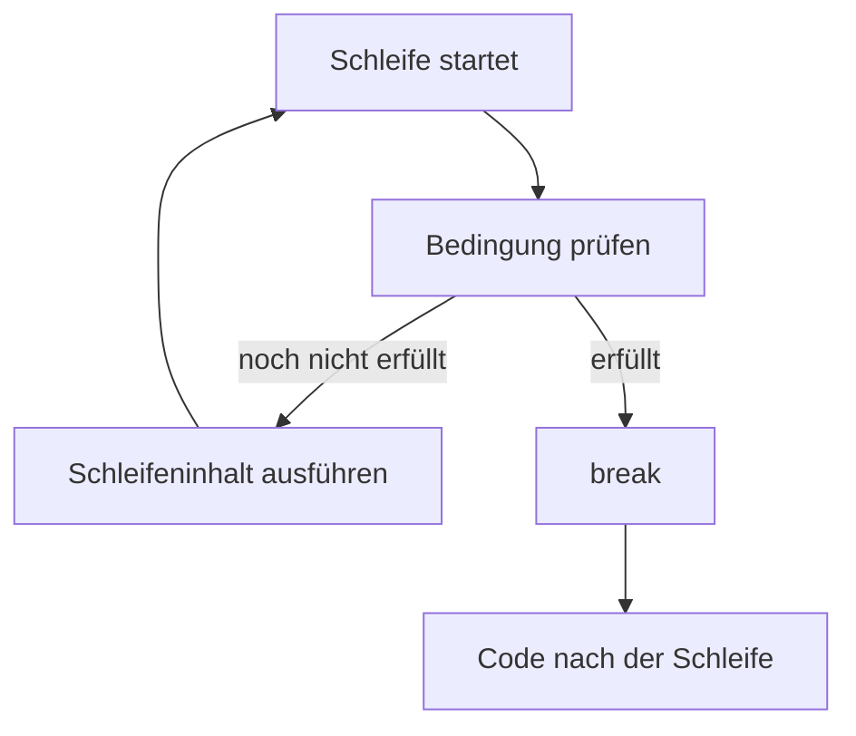
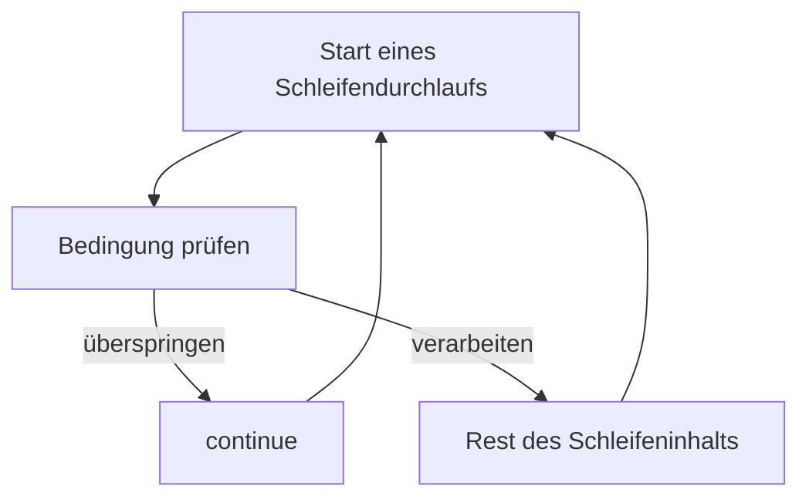
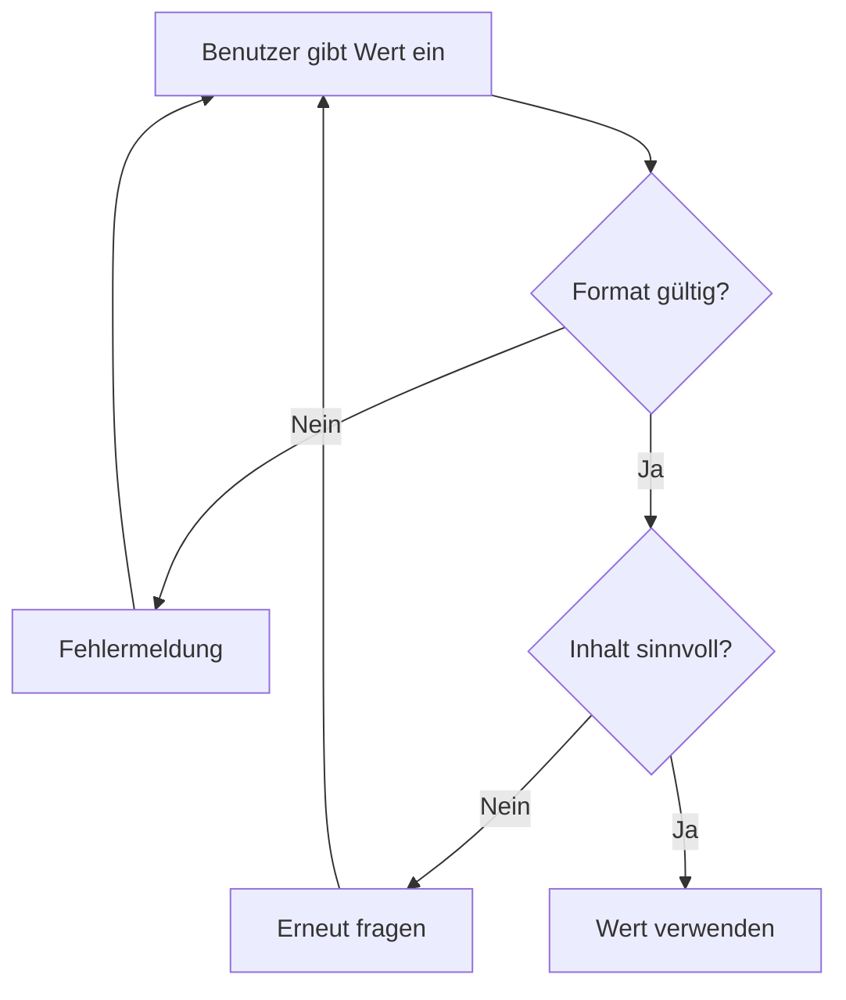
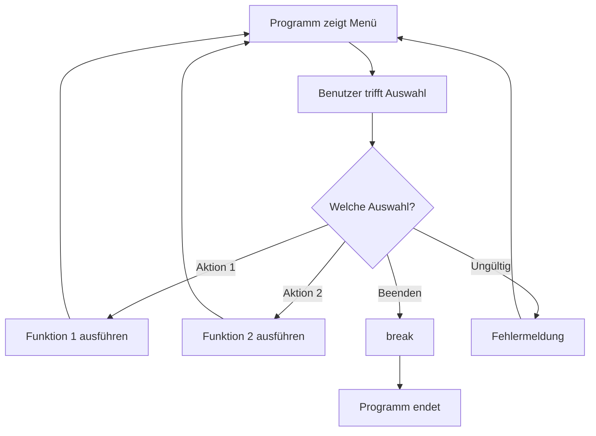
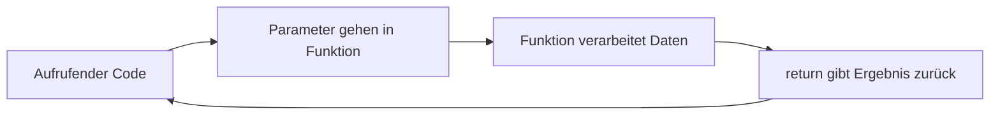

###### Themen

Schleifensteuerung

- break zum vorzeitigen Beenden von Schleifen nutzen
- continue in einfachen Fällen anwenden

Praktische Anwendungsfälle

- Eingaben prüfen
- Programmlogik durch Nutzerinteraktion steuern

Eigene Funktionen definieren

- Funktionen mit def erstellen
- Funktionen mit Parametern und Rückgabewerten verwenden
- Sinnvolle Funktionsnamen wählen

<br><br><br>
# 🔁 Schleifensteuerung

Wenn du programmierst, laufen viele Abläufe nach dem gleichen Muster ab: Etwas wird wiederholt, bis ein Ziel erreicht ist. Genau dafür sind **Schleifen** da. In Python nutzt du dafür meistens `for`- oder `while`-Schleifen.

Schleifen allein reichen aber oft nicht aus. In echten Programmen musst du manchmal mitten in einer Wiederholung sagen:

- **„Stopp, wir sind fertig.“** → dafür gibt es `break`
- **„Diesen Durchlauf überspringen wir.“** → dafür gibt es `continue`

Diese beiden Werkzeuge gehören zur **Schleifensteuerung**. Sie helfen dir dabei, den Ablauf flexibel zu lenken, statt stumpf alles bis zum Ende durchlaufen zu lassen. Python beschreibt `break` als sofortiges Beenden der **innersten umschließenden Schleife**, während `continue` direkt zur nächsten Iteration dieser Schleife springt ([Python Sprachreferenz – break](https://docs.python.org/3/reference/simple_stmts.html#the-break-statement), [Python Sprachreferenz – continue](https://docs.python.org/3/reference/simple_stmts.html#the-continue-statement)).


<br><br><br>
## 🛑 `break` zum vorzeitigen Beenden von Schleifen nutzen

`break` bedeutet: **Beende die Schleife sofort.**

Sobald Python auf `break` trifft, wird die aktuelle Schleife abgebrochen. Der Code nach der Schleife läuft dann ganz normal weiter. Das ist besonders nützlich, wenn du schon früher gefunden hast, wonach du suchst, oder wenn eine Eingabe endlich gültig ist.

### Was genau passiert?

Stell dir eine Schleife wie eine Runde vor, die immer wieder von vorn beginnt. `break` sagt:

> „Wir müssen nicht weiterlaufen. Raus aus der Schleife.“

Wichtig ist dabei: `break` beendet **nur die Schleife, in der es direkt steht**, nicht automatisch alle äußeren Schleifen ([Python Sprachreferenz – break](https://docs.python.org/3/reference/simple_stmts.html#the-break-statement)).

### Einfaches Beispiel

```python
for zahl in range(10):
    if zahl == 5:
        break
    print(zahl)

print("Schleife beendet")
```

Ausgabe:

```python
0
1
2
3
4
Schleife beendet
```

Sobald `zahl == 5` ist, wird die Schleife beendet. Die `5` selbst wird hier nicht mehr ausgegeben, weil `break` vorher ausgeführt wird.

### Typische Einsatzfälle für `break`

`break` ist besonders sinnvoll, wenn du nicht schon vorher weißt, wie lange eine Schleife laufen muss.

Zum Beispiel:

- du suchst einen bestimmten Wert
- du wartest auf eine korrekte Nutzereingabe
- du liest Daten, bis ein Endsignal kommt
- du willst eine Endlosschleife kontrolliert verlassen

### Beispiel: Nutzereingabe so lange abfragen, bis sie passt

```python
while True:
    eingabe = input("Gib 'ja' ein, um fortzufahren: ")

    if eingabe == "ja":
        print("Danke, es geht weiter.")
        break

    print("Das war noch nicht richtig.")
```

Hier ist `while True` zunächst eine absichtlich unendliche Schleife. Sie läuft so lange, bis `break` ausgeführt wird. Genau dieses Muster ist in der Praxis sehr häufig.

### Warum `break` so nützlich ist

Ohne `break` müsstest du viele Bedingungen kompliziert außen herum bauen. Mit `break` kannst du klar sagen:

- **Schleife läuft**
- **Bedingung erreicht**
- **Sofort aufhören**

Das macht den Code oft direkter und verständlicher.

### Mentales Modell

Du kannst dir `break` wie einen **Notausgang** vorstellen:

- Solange alles normal läuft, geht die Schleife Runde für Runde weiter.
- Wenn ein bestimmter Zustand eintritt, nimmst du den Notausgang.
- Danach bist du draußen und machst unterhalb der Schleife weiter.

### Visualisierung: `break` in einer Schleife



### Saubere Verwendung von `break`

`break` ist sehr hilfreich, wenn es einen **klaren Abbruchgrund** gibt. Gute Beispiele sind:

- „Eingabe ist gültig“
- „Element wurde gefunden“
- „Benutzer möchte beenden“
- „Fehlerfall erkannt, Schleife soll nicht weiterlaufen“

Weniger gut ist es, wenn überall im Code verteilt viele `break`-Anweisungen stehen und man kaum noch erkennt, wann die Schleife eigentlich endet. Dann wird der Ablauf schwer lesbar.


<br><br><br>
## ⏭️ `continue` in einfachen Fällen anwenden

`continue` bedeutet nicht „Schleife beenden“, sondern:

> „Diesen Durchlauf überspringen und direkt mit dem nächsten weitermachen.“

Python führt dann den restlichen Code innerhalb der aktuellen Runde **nicht mehr aus**, sondern springt direkt zum nächsten Schleifendurchlauf ([Python Sprachreferenz – continue](https://docs.python.org/3/reference/simple_stmts.html#the-continue-statement)).

### Unterschied zwischen `break` und `continue`

| Anweisung | Wirkung |
|---|---|
| `break` | beendet die Schleife vollständig |
| `continue` | beendet nur den aktuellen Durchlauf und startet den nächsten |

Das ist ein sehr wichtiger Unterschied.

### Beispiel

```python
for zahl in range(6):
    if zahl == 3:
        continue
    print(zahl)
```

Ausgabe:

```python
0
1
2
4
5
```

Die `3` wird übersprungen. Die Schleife läuft aber danach ganz normal weiter.

### Wann `continue` sinnvoll ist

`continue` ist besonders praktisch, wenn du bestimmte Fälle **früh ausklammern** willst.

Zum Beispiel:

- leere Eingaben ignorieren
- ungültige Datensätze überspringen
- nur mit passenden Werten weiterarbeiten
- Sonderfälle schnell aussortieren

### Beispiel: Leere Eingaben überspringen

```python
eingaben = ["Max", "", "Anna", "", "Tom"]

for name in eingaben:
    if name == "":
        continue
    print(f"Hallo {name}")
```

Hier werden leere Einträge einfach übersprungen. So musst du den restlichen Code nicht in zusätzliche `if`-Blöcke einpacken.

### Warum nur „in einfachen Fällen“?

Das ist ein wichtiger Punkt. `continue` ist nützlich, aber wenn du es zu oft oder an komplizierten Stellen verwendest, kann der Ablauf unübersichtlich werden.

Einfacher, gut lesbarer Fall:

```python
for wert in daten:
    if wert is None:
        continue
    print(wert)
```

Schwieriger lesbarer Fall:

```python
for wert in daten:
    if bedingung_a:
        continue
    if bedingung_b:
        continue
    if bedingung_c:
        continue
    if bedingung_d:
        continue
    # viel weiterer Code
```

Dann fragt man sich schnell: **Welche Fälle werden eigentlich noch verarbeitet?**  
Deshalb ist `continue` am besten dann, wenn es eine kleine, klare Aussage trifft:

- „wenn leer, überspringen“
- „wenn ungültig, nächster Durchlauf“

### Mentales Modell

`continue` ist wie ein Satz im Kopf:

> „Diesen Kandidaten prüfen wir nicht weiter, nimm den nächsten.“

Nicht raus aus der Schleife, sondern nur raus aus der **aktuellen Runde**.

### Visualisierung: `continue` in einer Schleife



### Gute Regel für richtiges Lernen

Wenn du `break` und `continue` lernst, merke dir nicht nur die Definition, sondern stelle dir immer die Frage:

- **Will ich komplett aus der Schleife raus?** → `break`
- **Will ich nur diesen einen Durchlauf auslassen?** → `continue`

Diese Unterscheidung ist viel wichtiger als bloß die Syntax auswendig zu kennen.


<br><br><br>
# 🧩 Praktische Anwendungsfälle

Schleifensteuerung wird erst dann wirklich verständlich, wenn du sie in echten Situationen siehst. Besonders häufig begegnet sie dir bei:

- **Eingaben prüfen**
- **Programmlogik durch Nutzerinteraktion steuern**

Das sind klassische Grundlagen in der Programmierung, weil Programme fast immer auf Daten oder auf Benutzer reagieren müssen.


<br><br><br>
## ✅ Eingaben prüfen

Eingaben prüfen bedeutet: Ein Programm nimmt eine Eingabe entgegen und kontrolliert, ob sie gültig ist. Wenn nicht, fragt es erneut nach.

Das ist ein sehr grundlegendes Muster in der Softwareentwicklung. Ein Programm sollte nicht einfach blind alles akzeptieren. Es muss prüfen:

- Ist überhaupt etwas eingegeben worden?
- Ist das Format korrekt?
- Ist der Wert erlaubt?
- Ist die Eingabe sinnvoll?

### Typisches Grundmuster

```python
while True:
    eingabe = input("Bitte eine Zahl eingeben: ")

    if not eingabe.isdigit():
        print("Das ist keine gültige Zahl.")
        continue

    zahl = int(eingabe)
    print(f"Du hast die Zahl {zahl} eingegeben.")
    break
```

### Was hier passiert

1. Die Schleife startet.
2. Der Nutzer gibt etwas ein.
3. Mit `isdigit()` wird geprüft, ob die Eingabe nur aus Ziffern besteht.
4. Falls nicht, wird mit `continue` sofort der nächste Schleifendurchlauf gestartet.
5. Falls die Eingabe gültig ist, wird sie umgewandelt.
6. Mit `break` endet die Schleife.

### Warum dieses Muster so stark ist

Hier arbeiten `continue` und `break` perfekt zusammen:

- `continue` behandelt **ungültige Fälle**
- `break` beendet die Schleife beim **gültigen Fall**

Das ist inhaltlich sauber, weil der Code ausdrückt:

- falsche Eingabe → noch einmal
- richtige Eingabe → weiter

### Bessere Denkweise beim Eingaben prüfen

Viele Anfänger denken:  
„Ich brauche nur `input()`.“

In Wirklichkeit ist `input()` nur der Anfang. Der wichtige Teil ist die **Prüfung** der Eingabe. Genau dort zeigt sich, ob ein Programm robust ist.

### Beispiel: Alter nur in einem sinnvollen Bereich akzeptieren

```python
while True:
    eingabe = input("Wie alt bist du? ")

    if not eingabe.isdigit():
        print("Bitte gib nur eine ganze Zahl ein.")
        continue

    alter = int(eingabe)

    if alter < 0 or alter > 120:
        print("Bitte gib ein realistisches Alter ein.")
        continue

    print(f"Dein Alter ist {alter}.")
    break
```

Hier wird nicht nur geprüft, **ob** es eine Zahl ist, sondern auch **ob** sie sinnvoll ist. Genau so entsteht saubere Programmlogik.

### Visualisierung: Eingabeprüfung mit Schleife



### Fachlich wichtig

Die eingebaute Funktion `input()` liest in Python immer einen **String**, also Text. Wenn du eine Zahl verarbeiten willst, musst du diese Eingabe erst prüfen und dann umwandeln ([Python Built-in Functions – input](https://docs.python.org/3/library/functions.html#input), [Python Built-in Functions – int](https://docs.python.org/3/library/functions.html#int)).

Das ist ein Kernprinzip beim Programmieren:  
**Eingabe entgegennehmen ist nicht dasselbe wie Eingabe verstehen.**

### Typische Fehler beim Eingaben prüfen

Ein häufiger Fehler ist, direkt umzuwandeln:

```python
zahl = int(input("Bitte Zahl eingeben: "))
```

Das kann funktionieren, aber nur solange der Nutzer wirklich eine Zahl eingibt. Bei ungültiger Eingabe entsteht ein Fehler. Für Lernzwecke und klare Logik ist die vorherige Prüfung oft verständlicher.

### Warum das zum Bereich „Core Tech Fundamentals“ gehört

Eingabeprüfung ist keine Nebensache. Sie trainiert gleich mehrere Grundfertigkeiten:

- Schleifen verstehen
- Bedingungen formulieren
- Daten prüfen
- Programmfluss steuern
- Benutzerfreundlichkeit verbessern

Du lernst also nicht nur Syntax, sondern echtes Denken in Abläufen.


<br><br><br>
## 🕹️ Programmlogik durch Nutzerinteraktion steuern

Viele Programme arbeiten nicht einfach nur linear von oben nach unten. Stattdessen reagieren sie auf Entscheidungen von Nutzern. Genau dann wird Schleifensteuerung praktisch:

- Nutzer wählt eine Aktion
- Programm führt sie aus
- danach fragt das Programm erneut
- bei „Beenden“ wird abgebrochen

Dieses Muster steckt hinter Menüs, einfachen Konsolenprogrammen und vielen interaktiven Tools.

### Typisches Menü-Beispiel

```python
while True:
    print("\nMenü:")
    print("1 - Begrüßung anzeigen")
    print("2 - Uhrzeit anzeigen")
    print("3 - Beenden")

    auswahl = input("Bitte wählen: ")

    if auswahl == "1":
        print("Hallo!")
    elif auswahl == "2":
        print("Die Uhrzeit-Funktion wäre hier eingebaut.")
    elif auswahl == "3":
        print("Programm wird beendet.")
        break
    else:
        print("Ungültige Auswahl.")
```

### Was daran didaktisch wichtig ist

Dieses Beispiel zeigt sehr schön, dass ein Programm kein starrer Block sein muss. Es kann **auf Menschen reagieren**. Die Schleife hält das Programm am Leben, und die Bedingungen entscheiden, was als Nächstes passiert.

### Die Rolle von `break` in interaktiven Programmen

In solchen Menüs ist `break` das Signal für:

- Benutzer will das Programm verlassen
- Programm darf die Schleife nun kontrolliert beenden

Ohne `break` würde das Menü endlos weiterlaufen.

### Die Rolle von `continue`

Manchmal willst du bei ungültiger Eingabe nicht den restlichen Code ausführen, sondern direkt neu fragen:

```python
while True:
    auswahl = input("Wähle start/stop: ")

    if auswahl not in ["start", "stop"]:
        print("Ungültige Eingabe.")
        continue

    print(f"Du hast {auswahl} gewählt.")
    break
```

Hier sorgt `continue` dafür, dass ungültige Eingaben sofort verworfen werden.

### Warum Nutzerinteraktion für das Lernen so wichtig ist

Wenn du mit Eingaben arbeitest, lernst du nicht nur Sprachelemente, sondern **Ablauflogik**. Du denkst dann nicht mehr nur in einzelnen Befehlen, sondern in Zuständen:

- warten
- prüfen
- verarbeiten
- wiederholen
- beenden

Das ist ein zentraler Schritt vom bloßen Schreiben von Code hin zum Verstehen von Programmen.

### Denkmodell: Programm als Dialog

Statt ein Programm als „eine Liste von Befehlen“ zu sehen, kannst du es als kleinen Dialog betrachten:

1. Programm fragt etwas.
2. Nutzer antwortet.
3. Programm bewertet die Antwort.
4. Je nach Antwort geht es anders weiter.

Diese Sichtweise ist extrem hilfreich, weil sie Programmlogik greifbar macht.

### Visualisierung: Benutzer steuert den Ablauf




<br><br><br>
# 🛠️ Eigene Funktionen definieren

Funktionen sind eines der wichtigsten Werkzeuge in Python und allgemein in der Programmierung. Sie helfen dir dabei, Code in **kleine, benennbare, wiederverwendbare Einheiten** zu zerlegen.

Statt denselben Ablauf mehrfach neu zu schreiben, definierst du ihn einmal und rufst ihn bei Bedarf auf. Python verwendet dafür das Schlüsselwort `def` ([Python Tutorial – Defining Functions](https://docs.python.org/3/tutorial/controlflow.html#defining-functions)).

Funktionen sind besonders wichtig für richtiges Lernen, weil sie dich zwingen, sauber zu denken:

- Was soll der Code tun?
- Welche Eingaben braucht er?
- Was soll er zurückgeben?
- Wie kann ich ihn verständlich benennen?

Das ist mehr als Syntax. Das ist strukturiertes Problemlösen.


<br><br><br>
## 🧱 Funktionen mit `def` erstellen

In Python definierst du eine Funktion mit `def`. Danach folgt der Funktionsname, dann runde Klammern und anschließend ein Doppelpunkt.

### Grundform

```python
def begruessung():
    print("Hallo!")
```

Diese Funktion heißt `begruessung` und führt beim Aufruf eine Ausgabe aus.

### Aufruf der Funktion

```python
begruessung()
```

Erst durch den Aufruf wird die Funktion ausgeführt. Das ist ein ganz wichtiger Punkt:  
**Das Definieren speichert die Anweisung, der Aufruf startet sie.**

### Was passiert bei einer Funktion im Hintergrund?

Eine Funktion ist wie ein kleiner Bauplan:

- Du gibst ihr einen Namen.
- Du legst fest, was passieren soll.
- Später kannst du diesen Bauplan immer wieder verwenden.

### Warum Funktionen so wertvoll sind

Ohne Funktionen landet schnell alles in einem langen, unübersichtlichen Skript. Mit Funktionen kannst du Teile auslagern.

Beispiel ohne Funktion:

```python
name = input("Name: ")
print(f"Hallo {name}")

name = input("Name: ")
print(f"Hallo {name}")
```

Mit Funktion:

```python
def begruesse_nutzer():
    name = input("Name: ")
    print(f"Hallo {name}")

begruesse_nutzer()
begruesse_nutzer()
```

Der Vorteil ist nicht nur, dass du weniger Code schreibst. Viel wichtiger ist: Der Code bekommt eine **klare Bedeutung**.

### Gute Lernperspektive

Wenn du Funktionen lernst, denke nicht zuerst:

> „Wie war nochmal die Syntax?“

Sondern eher:

> „Welcher zusammengehörige Ablauf verdient einen eigenen Namen?“

Genau daraus entstehen gute Funktionen.


<br><br><br>
## 🎛️ Funktionen mit Parametern und Rückgabewerten verwenden

Sobald Funktionen nur feste Dinge tun, sind sie noch recht eingeschränkt. Richtig nützlich werden sie durch:

- **Parameter**: Werte, die du an die Funktion übergibst
- **Rückgabewerte**: Werte, die die Funktion zurückliefert

Python erlaubt Funktionen mit beliebig vielen Parametern; ein `return` beendet die Funktion und gibt optional einen Wert zurück ([Python Tutorial – Defining Functions](https://docs.python.org/3/tutorial/controlflow.html#defining-functions)).

### Parameter: Eingaben für die Funktion

```python
def begruesse(name):
    print(f"Hallo {name}")
```

Hier ist `name` ein Parameter. Die Funktion kann dadurch mit unterschiedlichen Werten arbeiten.

Aufruf:

```python
begruesse("Anna")
begruesse("Tom")
```

### Rückgabewerte: Ergebnisse aus der Funktion herausgeben

```python
def addiere(a, b):
    return a + b
```

Aufruf:

```python
ergebnis = addiere(3, 4)
print(ergebnis)
```

Die Funktion berechnet einen Wert und gibt ihn mit `return` zurück.

### Der Unterschied zwischen `print()` und `return`

Das ist einer der wichtigsten Lernpunkte überhaupt.

| Begriff | Bedeutung |
|---|---|
| `print()` | zeigt etwas auf dem Bildschirm an |
| `return` | gibt einen Wert an den aufrufenden Code zurück |

Das wird am Anfang oft verwechselt.

### Beispiel zum Vergleich

```python
def falsch_addieren(a, b):
    print(a + b)
```

Diese Funktion zeigt das Ergebnis nur an.

```python
def richtig_addieren(a, b):
    return a + b
```

Diese Funktion liefert das Ergebnis zurück, sodass du weiter damit arbeiten kannst.

Zum Beispiel:

```python
summe = richtig_addieren(5, 7)
doppelt = summe * 2
print(doppelt)
```

Mit `return` wird eine Funktion also Teil einer größeren Logik.

### Warum Parameter und Rückgabewerte so wichtig sind

Erst dadurch werden Funktionen flexibel und wiederverwendbar.

Eine Funktion ohne Parameter und ohne Rückgabewert ist oft eher ein fest verdrahteter Ablauf.  
Eine Funktion mit Parametern und Rückgabewerten ist eher ein echtes Werkzeug.

### Praxisbeispiel: Eingabe prüfen in eine Funktion auslagern

```python
def lese_alter():
    while True:
        eingabe = input("Bitte dein Alter eingeben: ")

        if not eingabe.isdigit():
            print("Bitte gib eine ganze Zahl ein.")
            continue

        alter = int(eingabe)

        if alter < 0 or alter > 120:
            print("Bitte gib ein realistisches Alter ein.")
            continue

        return alter
```

Verwendung:

```python
alter = lese_alter()
print(f"Das geprüfte Alter ist: {alter}")
```

### Warum das ein sehr gutes Beispiel ist

Hier siehst du mehrere Grundlagen zusammen:

- Schleife zur Wiederholung
- `continue` für ungültige Eingaben
- `return` für das Ergebnis
- klar abgegrenzte Verantwortung der Funktion

Die Funktion macht genau eine Sache:  
**ein gültiges Alter einlesen und zurückgeben**

Das ist sauberes Denken in Software.

### Datenfluss einer Funktion



### Gute Regel

Wenn eine Funktion etwas **berechnet**, ist `return` meistens sinnvoll.  
Wenn sie nur etwas **anzeigt** oder **ausführt**, reicht manchmal ein Effekt wie `print()`.

Aber für sauberen, wiederverwendbaren Code ist `return` oft die stärkere Lösung.


<br><br><br>
## 🏷️ Sinnvolle Funktionsnamen wählen

Funktionsnamen sind nicht bloß Etiketten. Sie sind ein großer Teil der Verständlichkeit deines Codes. Ein guter Name sagt dir sofort:

- was die Funktion macht
- idealerweise ohne den Code lesen zu müssen

Python empfiehlt im Stilguide PEP 8 für Funktionsnamen **kleingeschriebene Wörter mit Unterstrichen**, also `lowercase_with_underscores` ([PEP 8 – Function and Variable Names](https://peps.python.org/pep-0008/#function-and-variable-names)).

### Gute Namen beschreiben eine Handlung

Funktionen tun etwas. Deshalb passen oft Verben oder verbähnliche Namen gut.

Gute Beispiele:

```python
def berechne_preis():
    ...
```

```python
def pruefe_eingabe():
    ...
```

```python
def lade_datei():
    ...
```

```python
def lese_alter():
    ...
```

Diese Namen machen klar, was passiert.

### Schlechte Namen sind zu allgemein oder zu vage

Weniger hilfreich sind Namen wie:

```python
def mach():
    ...
```

```python
def test():
    ...
```

```python
def daten():
    ...
```

```python
def foo():
    ...
```

Solche Namen sagen fast nichts über die Aufgabe der Funktion aus.

### Warum gute Namen so wichtig sind

Ein guter Funktionsname spart Denkaufwand. Wenn du später in deinen Code schaust, willst du möglichst schnell verstehen, was passiert.

Vergleich:

```python
wert = f(x)
```

und

```python
wert = berechne_mehrwertsteuer(preis)
```

Im zweiten Fall ist die Absicht sofort klar.

### Funktionsnamen sollten die Verantwortung widerspiegeln

Wenn eine Funktion `pruefe_passwort()` heißt, erwartest du, dass sie ein Passwort überprüft.  
Wenn sie stattdessen noch Daten speichert, E-Mails verschickt und das Menü wechselt, ist der Name zu klein für ihre tatsächliche Aufgabe.

Das ist ein wichtiges Lernsignal:  
**Wenn du eine Funktion kaum passend benennen kannst, macht sie wahrscheinlich zu viel.**

### Praktische Namensregeln

Ein sinnvoller Funktionsname ist meist:

- **klar**
- **konkret**
- **handlungsspezifisch**
- **nicht unnötig kurz**
- **nicht irreführend**

### Beispiele im Vergleich

| Schlechter Name | Besserer Name | Warum besser |
|---|---|---|
| `mach_was()` | `pruefe_eingabe()` | beschreibt die Aufgabe |
| `calc()` | `berechne_gesamtpreis()` | sagt genauer, was berechnet wird |
| `x1()` | `lese_benutzernamen()` | ist verständlich |
| `daten()` | `lade_kundendaten()` | zeigt Aktion und Kontext |

### Stil in Python

PEP 8 empfiehlt für Funktionsnamen:

```python
def lese_datei():
    ...
```

statt etwa:

```python
def LeseDatei():
    ...
```

oder:

```python
def leseDatei():
    ...
```

Nicht weil die anderen Varianten technisch unmöglich wären, sondern weil ein gemeinsamer Stil Code lesbarer und konsistenter macht ([PEP 8 – Function and Variable Names](https://peps.python.org/pep-0008/#function-and-variable-names)).

### Besonders hilfreiche Denkfrage

Bevor du eine Funktion benennst, frage dich:

> „Wenn jemand nur den Funktionsnamen liest – versteht er dann die Aufgabe?“

Wenn die Antwort nein ist, ist der Name meist noch nicht gut genug.

### Zusammenspiel mit richtigem Lernen

Sinnvolle Funktionsnamen helfen nicht nur anderen Menschen. Sie helfen auch dir selbst beim Lernen. Denn wenn du gezwungen bist, eine Funktion klar zu benennen, musst du ihren Zweck wirklich verstanden haben.

Das ist ein starker Lerneffekt:

- unklarer Name → oft unklarer Gedanke
- klarer Name → meist klarere Struktur

Genau deshalb sind gute Namen keine Nebensache, sondern Teil sauberer Softwareentwicklung.


<br><br><br>
# 🧠 Verbindung der Themen: So greifen Schleifen und Funktionen zusammen

In der Praxis stehen diese Themen fast nie isoliert nebeneinander. Meistens arbeitest du so:

1. Eine Schleife hält den Ablauf am Laufen.
2. `continue` sortiert ungültige Fälle aus.
3. `break` beendet den Ablauf, wenn ein Ziel erreicht ist.
4. Funktionen kapseln Teilaufgaben in saubere Einheiten.

### Komplettes, aber einfaches Beispiel

```python
def lese_option():
    while True:
        auswahl = input("Wähle 'start' oder 'ende': ")

        if auswahl not in ["start", "ende"]:
            print("Ungültige Eingabe.")
            continue

        return auswahl


while True:
    option = lese_option()

    if option == "start":
        print("Programmteil wird ausgeführt.")
    elif option == "ende":
        print("Programm wird beendet.")
        break
```

### Warum dieses Beispiel didaktisch stark ist

Hier erkennst du die Rollen ganz klar:

- `lese_option()` übernimmt die Eingabeprüfung
- `continue` behandelt ungültige Eingaben
- `return` liefert die gültige Auswahl zurück
- `break` beendet das Hauptprogramm

Das ist ein sehr typisches Grundmuster in echter Programmlogik.

### Was du daraus fachlich mitnehmen solltest

Die eigentliche Stärke liegt nicht in den einzelnen Schlüsselwörtern, sondern in ihrem Zusammenspiel:

- **Schleifen** wiederholen
- **Bedingungen** entscheiden
- **`continue`** überspringt ungeeignete Fälle
- **`break`** beendet kontrolliert
- **Funktionen** strukturieren den Code

Wenn du diese Bausteine sicher beherrschst, hast du einen wichtigen Teil der Programmiergrundlagen wirklich verstanden.