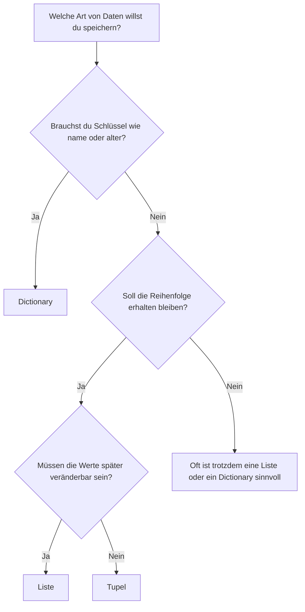
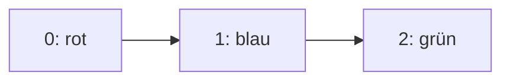
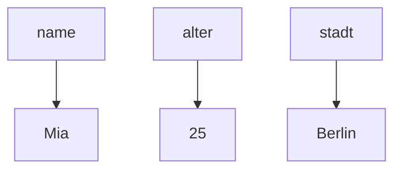

###### Themen

Datenstrukturen in Python

- Unterschiede und Einsatzgebiete von Listen, Tupeln und Dictionaries verstehen
- Listen, Tupel und Dictionaries anlegen und verwenden

Elementzugriff und Manipulation

- Auf Elemente zugreifen und Werte verändern
- Elemente hinzufügen und entfernen

Anwenden von Datenstrukturen

- Über Listen und Dictionaries iterieren
- Typische einfache Anwendungsfälle wie Zählen und Nachschlagen umsetzen

<br><br><br>
# 🐍 Datenstrukturen in Python

Wenn du in Python programmierst, arbeitest du fast ständig mit **Datenstrukturen**. Eine Datenstruktur ist einfach eine Art, **Werte geordnet und sinnvoll zu speichern**, damit du sie später wieder lesen, verändern oder durchsuchen kannst.

Für den Einstieg sind drei Typen besonders wichtig:

- **Listen**
- **Tupel**
- **Dictionaries**

Diese drei sind so etwas wie das Grundwerkzeug für fast alles, was du später in Python machst: Schleifen, Funktionen, Datenverarbeitung, Webentwicklung, Automatisierung und vieles mehr.

Python selbst beschreibt Listen als **veränderbare Sequenzen**, Tupel als **unveränderbare Sequenzen** und Dictionaries als **Zuordnungen von Schlüsseln zu Werten** ([Built-in Types](https://docs.python.org/3/library/stdtypes.html), [The Python Tutorial – Data Structures](https://docs.python.org/3/tutorial/datastructures.html)).

Damit du nicht nur weißt, **wie** sie aussehen, sondern auch **wann** du welche Struktur sinnvoll benutzt, gehen wir sie Schritt für Schritt durch.


<br><br><br>
## 🧭 Unterschiede und Einsatzgebiete von Listen, Tupeln und Dictionaries verstehen

Die wichtigste Frage ist immer:

**Will ich eine Reihenfolge speichern?**  
**Soll man die Daten später ändern können?**  
**Oder möchte ich Werte über einen Namen bzw. Schlüssel nachschlagen?**

Genau daraus ergibt sich, welche Datenstruktur passt.


<br><br><br>
### 📋 Listen

Eine **Liste** speichert mehrere Werte in einer **geordneten Reihenfolge**. Sie ist **veränderbar**, das heißt: Du kannst später Elemente hinzufügen, entfernen oder ersetzen ([Built-in Types](https://docs.python.org/3/library/stdtypes.html)).

Beispiel:

```python
farben = ["rot", "blau", "grün"]
```

Hier enthält die Liste drei Elemente. Die Reihenfolge bleibt erhalten:

1. `"rot"`
2. `"blau"`
3. `"grün"`

Listen sind besonders sinnvoll, wenn:

- die **Reihenfolge wichtig** ist,
- du Elemente **später ändern** willst,
- du Werte **ergänzen oder löschen** möchtest,
- du über viele Einträge **nacheinander iterieren** willst.

Typische Einsatzgebiete:

- To-do-Listen
- Messwerte
- Namenlisten
- Suchergebnisse
- Zwischenspeicher für Daten

Eine Liste ist also das Standardwerkzeug, wenn du einfach „mehrere Dinge hintereinander“ speichern willst.


<br><br><br>
### 🧱 Tupel

Ein **Tupel** sieht einer Liste ähnlich, ist aber **unveränderbar**. Das bedeutet: Nachdem ein Tupel erstellt wurde, kannst du seine Elemente nicht mehr austauschen, hinzufügen oder löschen ([Built-in Types](https://docs.python.org/3/library/stdtypes.html)).

Beispiel:

```python
koordinaten = (10, 20)
```

Auch hier gibt es eine Reihenfolge, aber eben ohne spätere Veränderung.

Tupel sind sinnvoll, wenn:

- Werte **zusammengehören**,
- diese Werte **nicht verändert werden sollen**,
- du deutlich machen willst: „Diese Struktur ist fest“,
- Daten als **sichere, stabile Gruppe** weitergegeben werden sollen.

Typische Einsatzgebiete:

- Koordinaten wie `(x, y)`
- RGB-Farben wie `(255, 128, 0)`
- feste Konfigurationen
- Rückgabewerte von Funktionen

Wichtig ist: Ein Tupel schützt nicht automatisch jede Art von innerem Inhalt. Wenn in einem Tupel z. B. eine Liste steckt, dann bleibt **die Liste selbst** weiterhin veränderbar. Unveränderbar ist nur die Struktur des Tupels selbst ([Built-in Types](https://docs.python.org/3/library/stdtypes.html)).


<br><br><br>
### 🗂️ Dictionaries

Ein **Dictionary** speichert Daten als **Schlüssel-Wert-Paare**. Statt über eine Position wie `0` oder `1` zuzugreifen, verwendest du einen **Schlüssel**, zum Beispiel einen Namen ([Built-in Types](https://docs.python.org/3/library/stdtypes.html)).

Beispiel:

```python
person = {
    "name": "Mia",
    "alter": 25,
    "stadt": "Berlin"
}
```

Hier sind `"name"`, `"alter"` und `"stadt"` die Schlüssel.

Dictionaries sind besonders nützlich, wenn:

- du Daten **über einen Begriff nachschlagen** willst,
- Werte eine **klare Bedeutung** haben sollen,
- Informationen zu einem Objekt zusammengefasst werden,
- schnelles Nachschlagen wichtig ist.

Typische Einsatzgebiete:

- Benutzerdaten
- Einstellungen
- Konfigurationen
- Zähler
- Wörterbücher und Übersetzungstabellen
- Zuordnungen wie `ID -> Datensatz`

Python-Dictionaries behalten seit Python 3.7 garantiert die **Einfügereihenfolge** bei ([Built-in Types](https://docs.python.org/3/library/stdtypes.html)). Das heißt: Wenn du Schlüssel in einer bestimmten Reihenfolge einfügst, bleibt diese beim Durchlaufen normalerweise erhalten. Trotzdem benutzt man Dictionaries nicht primär wegen ihrer Positionen, sondern wegen ihrer **Schlüssel**.


<br><br><br>
## 📊 Der direkte Vergleich

Die Unterschiede werden oft am schnellsten über eine Tabelle klar:

| Eigenschaft | Liste | Tupel | Dictionary |
|---|---|---|---|
| Schreibweise | `[]` | `()` | `{}` |
| Grundidee | geordnete Sammlung | geordnete, feste Sammlung | Schlüssel-Wert-Zuordnung |
| Veränderbar | ja | nein | ja |
| Zugriff über | Index | Index | Schlüssel |
| Reihenfolge | ja | ja | Einfügereihenfolge bleibt erhalten |
| Doppelte Werte erlaubt | ja | ja | Schlüssel müssen eindeutig sein |
| Typischer Zweck | mehrere Dinge speichern und bearbeiten | feste Datengruppe | Nachschlagen und Zuordnen |

Ein zentraler Punkt ist:  
**Listen und Tupel sind Sequenzen**, also Reihenfolgen von Elementen.  
**Dictionaries sind Mappings**, also Zuordnungen von Schlüssel zu Wert ([Built-in Types](https://docs.python.org/3/library/stdtypes.html)).


<br><br><br>
## 🤔 Wann nehme ich welche Datenstruktur?

Hier hilft eine einfache Entscheidungslogik:



Praktisch gedacht:

- **Liste**: „Ich habe mehrere Dinge und arbeite flexibel damit.“
- **Tupel**: „Diese Werte gehören zusammen und sollen fest bleiben.“
- **Dictionary**: „Ich will Informationen anhand von Namen oder Schlüsseln finden.“

Ein paar typische Entscheidungen:

| Situation | Passende Struktur | Warum |
|---|---|---|
| Einkaufsliste | Liste | Reihenfolge möglich, Einträge veränderbar |
| GPS-Koordinate | Tupel | zwei feste Werte, die zusammengehören |
| Benutzerprofil | Dictionary | Daten über Namen wie `name`, `email`, `alter` |
| Noten einer Klasse | Liste | viele Einträge, über die man iterieren kann |
| Farbcodes | Tupel | feste Kombination von Werten |
| Wörterbuch Deutsch → Englisch | Dictionary | Nachschlagen über Schlüssel |


<br><br><br>
## 🛠️ Listen, Tupel und Dictionaries anlegen und verwenden

Jetzt schauen wir uns an, wie du diese Datenstrukturen konkret in Python erstellst und benutzt.


<br><br><br>
### 📋 Listen anlegen und verwenden

Eine Liste schreibst du mit eckigen Klammern:

```python
zahlen = [10, 20, 30]
namen = ["Anna", "Ben", "Clara"]
gemischt = [1, "Hallo", True, 3.14]
```

Python-Listen können **verschiedene Datentypen gleichzeitig** enthalten ([Built-in Types](https://docs.python.org/3/library/stdtypes.html)). In der Praxis ist es aber oft sauberer, ähnliche Dinge zusammen in einer Liste zu speichern, also z. B. nur Zahlen oder nur Namen.

Leere Liste:

```python
leere_liste = []
```

Du kannst Listen auch ineinander verschachteln:

```python
matrix = [
    [1, 2, 3],
    [4, 5, 6]
]
```

Das ist nützlich für Tabellen, Raster oder strukturierte Gruppen von Werten.

Eine Liste kannst du dir vorstellen wie eine Reihe von Fächern:




<br><br><br>
### 🧱 Tupel anlegen und verwenden

Ein Tupel wird mit runden Klammern geschrieben:

```python
punkt = (4, 7)
rgb = (255, 200, 100)
```

Ein leeres Tupel:

```python
leer = ()
```

Bei einem Tupel mit nur einem Element musst du ein Komma setzen, sonst erkennt Python es nicht als Tupel:

```python
einzelwert = (5,)
```

Das ist ein klassischer Anfängerpunkt.  
`(5)` ist nur eine geklammerte Zahl.  
`(5,)` ist ein Tupel mit einem Element.

Tupel werden oft dann verwendet, wenn Werte logisch zusammengehören und nicht verändert werden sollen, zum Beispiel:

```python
geburtsdatum = (21, 3, 2001)
```


<br><br><br>
### 🗂️ Dictionaries anlegen und verwenden

Ein Dictionary schreibst du mit geschweiften Klammern und `schlüssel: wert`:

```python
student = {
    "name": "Lena",
    "alter": 22,
    "fach": "Informatik"
}
```

Leeres Dictionary:

```python
leeres_dict = {}
```

Wichtig: Die **Schlüssel müssen eindeutig sein**. Wenn derselbe Schlüssel mehrfach vorkommt, bleibt nur der letzte Wert erhalten, weil ein Schlüssel nur auf einen Wert zeigen kann ([Built-in Types](https://docs.python.org/3/library/stdtypes.html)).

Beispiel:

```python
daten = {
    "name": "Tom",
    "name": "Eva"
}

print(daten)
```

Ergebnis:

```python
{'name': 'Eva'}
```

Ein Dictionary kannst du dir so vorstellen:



Sehr praktisch ist, dass du mit einem Dictionary Daten nicht über eine Position, sondern über ihre **Bedeutung** ansprichst. Das macht Code oft lesbarer.


<br><br><br>
# 🔎 Elementzugriff und Manipulation

Jetzt kommt der Teil, der im Alltag wirklich ständig gebraucht wird:  
Wie kommst du an einzelne Werte heran, und wie veränderst du sie?


<br><br><br>
## 🎯 Auf Elemente zugreifen und Werte verändern

Der Zugriff unterscheidet sich je nach Datenstruktur.


<br><br><br>
### 📋 Zugriff auf Listenelemente

Listen verwenden **Indizes**. Der erste Index ist `0`, nicht `1` ([The Python Tutorial – An Informal Introduction to Python](https://docs.python.org/3/tutorial/introduction.html)).

```python
farben = ["rot", "blau", "grün"]

print(farben[0])  # rot
print(farben[1])  # blau
print(farben[2])  # grün
```

Warum beginnt Python bei `0`?  
Das hängt mit der Art zusammen, wie viele Programmiersprachen Positionen intern behandeln. Für dich wichtig ist vor allem: **erstes Element = Index 0**.

Du kannst auch von hinten zählen:

```python
print(farben[-1])  # grün
print(farben[-2])  # blau
```

Negative Indizes bedeuten also: vom Ende aus zählen.

Listen sind veränderbar, deshalb kannst du einzelne Werte ersetzen:

```python
farben[1] = "gelb"
print(farben)
```

Ergebnis:

```python
['rot', 'gelb', 'grün']
```

Außerdem gibt es **Slicing**, also das Ausschneiden eines Bereichs:

```python
zahlen = [10, 20, 30, 40, 50]

print(zahlen[1:4])  # [20, 30, 40]
print(zahlen[:3])   # [10, 20, 30]
print(zahlen[2:])   # [30, 40, 50]
```

Ein Slice erzeugt bei Listen eine neue Liste ([Built-in Types](https://docs.python.org/3/library/stdtypes.html)).


<br><br><br>
### 🧱 Zugriff auf Tupel

Tupel funktionieren beim Lesen fast genauso wie Listen:

```python
punkt = (5, 9)

print(punkt[0])   # 5
print(punkt[1])   # 9
print(punkt[-1])  # 9
```

Auch Slicing ist möglich:

```python
werte = (1, 2, 3, 4, 5)
print(werte[1:4])  # (2, 3, 4)
```

Der entscheidende Unterschied: Du kannst ein Tupel **nicht verändern**.

```python
punkt[0] = 8
```

Das führt zu einem Fehler, weil Tupel unveränderbar sind ([Built-in Types](https://docs.python.org/3/library/stdtypes.html)).

Genau das macht Tupel nützlich, wenn du versehentliche Änderungen vermeiden willst.


<br><br><br>
### 🗂️ Zugriff auf Dictionary-Werte

Bei Dictionaries erfolgt der Zugriff über den **Schlüssel**:

```python
person = {
    "name": "Mia",
    "alter": 25
}

print(person["name"])   # Mia
print(person["alter"])  # 25
```

Wenn du einen Wert ändern willst, weist du dem Schlüssel einfach einen neuen Wert zu:

```python
person["alter"] = 26
print(person)
```

Ergebnis:

```python
{'name': 'Mia', 'alter': 26}
```

Wenn du auf einen Schlüssel zugreifst, der nicht existiert, entsteht ein Fehler:

```python
print(person["stadt"])
```

Sicherer ist oft die Methode `get()`:

```python
print(person.get("stadt"))          # None
print(person.get("stadt", "Unbekannt"))
```

`get()` liefert also statt eines Fehlers entweder `None` oder einen Standardwert, wenn der Schlüssel fehlt ([Built-in Types](https://docs.python.org/3/library/stdtypes.html)).

Das ist im Alltag sehr nützlich, wenn du mit unvollständigen Daten arbeitest.


<br><br><br>
## ➕ Elemente hinzufügen und entfernen

Hier zeigen sich die Unterschiede zwischen veränderbaren und unveränderbaren Strukturen besonders deutlich.


<br><br><br>
### 📋 Listen erweitern und kürzen

Listen kannst du auf viele Arten verändern.

#### Am Ende hinzufügen

```python
zahlen = [1, 2, 3]
zahlen.append(4)
print(zahlen)
```

Ergebnis:

```python
[1, 2, 3, 4]
```

`append()` hängt genau **ein Element** ans Ende der Liste ([The Python Tutorial – More on Lists](https://docs.python.org/3/tutorial/datastructures.html)).

#### An einer bestimmten Position einfügen

```python
zahlen = [1, 2, 4]
zahlen.insert(2, 3)
print(zahlen)
```

Ergebnis:

```python
[1, 2, 3, 4]
```

#### Mehrere Elemente ergänzen

```python
zahlen = [1, 2]
zahlen.extend([3, 4, 5])
print(zahlen)
```

Ergebnis:

```python
[1, 2, 3, 4, 5]
```

`extend()` fügt mehrere Elemente aus einer anderen iterierbaren Struktur hinzu ([The Python Tutorial – More on Lists](https://docs.python.org/3/tutorial/datastructures.html)).

#### Element über Wert entfernen

```python
farben = ["rot", "blau", "grün"]
farben.remove("blau")
print(farben)
```

Ergebnis:

```python
['rot', 'grün']
```

`remove()` entfernt das **erste passende Element**. Wenn der Wert nicht existiert, gibt es einen Fehler ([The Python Tutorial – More on Lists](https://docs.python.org/3/tutorial/datastructures.html)).

#### Element über Position entfernen

```python
zahlen = [10, 20, 30]
entfernt = zahlen.pop(1)

print(zahlen)     # [10, 30]
print(entfernt)   # 20
```

`pop()` entfernt also ein Element und gibt es gleichzeitig zurück.

Ohne Index entfernt `pop()` das letzte Element:

```python
zahlen = [10, 20, 30]
letztes = zahlen.pop()

print(letztes)  # 30
print(zahlen)   # [10, 20]
```

#### Mit `del` löschen

```python
zahlen = [10, 20, 30]
del zahlen[1]
print(zahlen)
```

Ergebnis:

```python
[10, 30]
```

Mit `del` kannst du auch ganze Bereiche löschen:

```python
zahlen = [1, 2, 3, 4, 5]
del zahlen[1:4]
print(zahlen)
```

Ergebnis:

```python
[1, 5]
```

#### Ganze Liste leeren

```python
zahlen = [1, 2, 3]
zahlen.clear()
print(zahlen)
```

Ergebnis:

```python
[]
```


<br><br><br>
### 🧱 Tupel verändern?

Kurz gesagt: **nein**. Ein Tupel ist unveränderbar.

Du kannst also nicht:

- Elemente hinzufügen
- Elemente löschen
- Elemente direkt ersetzen

Wenn du „ein Tupel ändern“ möchtest, erzeugst du in Wirklichkeit ein **neues Tupel**:

```python
punkt = (1, 2)
punkt = (punkt[0], 5)
print(punkt)
```

Ergebnis:

```python
(1, 5)
```

Das ursprüngliche Tupel wurde dabei nicht bearbeitet, sondern durch ein neues ersetzt.

Für die Praxis heißt das:  
Wenn du schon beim Entwurf weißt, dass Daten häufig verändert werden, ist ein Tupel meistens **nicht** die richtige Wahl. Dann nimm lieber eine Liste.


<br><br><br>
### 🗂️ Dictionaries erweitern, ändern und leeren

#### Neuen Schlüssel hinzufügen

```python
person = {"name": "Mia"}
person["stadt"] = "Berlin"
print(person)
```

Ergebnis:

```python
{'name': 'Mia', 'stadt': 'Berlin'}
```

#### Vorhandenen Wert ändern

```python
person["name"] = "Lina"
print(person)
```

#### Mehrere Werte auf einmal aktualisieren

```python
person.update({
    "alter": 25,
    "stadt": "Hamburg"
})
print(person)
```

`update()` übernimmt mehrere Schlüssel-Wert-Paare in ein Dictionary ([Built-in Types](https://docs.python.org/3/library/stdtypes.html)).

#### Element entfernen mit `pop()`

```python
person = {"name": "Mia", "alter": 25}
alter = person.pop("alter")

print(person)  # {'name': 'Mia'}
print(alter)   # 25
```

#### Letztes eingefügtes Paar entfernen

```python
daten = {"a": 1, "b": 2}
eintrag = daten.popitem()

print(daten)
print(eintrag)
```

`popitem()` entfernt seit Python 3.7 das zuletzt eingefügte Schlüssel-Wert-Paar ([Built-in Types](https://docs.python.org/3/library/stdtypes.html)).

#### Mit `del` entfernen

```python
person = {"name": "Mia", "alter": 25}
del person["name"]
print(person)
```

#### Ganzes Dictionary leeren

```python
person.clear()
print(person)
```


<br><br><br>
# 🔁 Anwenden von Datenstrukturen

Jetzt wird es besonders praktisch:  
Datenstrukturen sind nicht nur Behälter. Sie werden spannend, wenn du mit ihnen **arbeitest** — also zählst, suchst, durchläufst und strukturierte Informationen verarbeitest.


<br><br><br>
## 🚶 Über Listen und Dictionaries iterieren

**Iterieren** bedeutet: Element für Element durch eine Datenstruktur gehen. In Python passiert das meistens mit einer `for`-Schleife ([The Python Tutorial – More Control Flow Tools](https://docs.python.org/3/tutorial/controlflow.html)).


<br><br><br>
### 📋 Über Listen iterieren

Die einfachste Form:

```python
namen = ["Anna", "Ben", "Clara"]

for name in namen:
    print(name)
```

Hier wird nacheinander jeder Eintrag aus der Liste in die Variable `name` gelegt.

Wenn du zusätzlich den Index brauchst, ist `enumerate()` sehr praktisch:

```python
namen = ["Anna", "Ben", "Clara"]

for index, name in enumerate(namen):
    print(index, name)
```

Ergebnis:

```python
0 Anna
1 Ben
2 Clara
```

`enumerate()` liefert also gleichzeitig **Position und Wert** ([The Python Tutorial – Looping Techniques](https://docs.python.org/3/tutorial/datastructures.html)).

Das ist oft sauberer als selbst einen Zähler mitzuschleppen.


<br><br><br>
### 🗂️ Über Dictionaries iterieren

Bei Dictionaries gibt es mehrere Varianten, je nachdem, was du brauchst.

#### Nur über die Schlüssel

```python
person = {"name": "Mia", "alter": 25, "stadt": "Berlin"}

for schluessel in person:
    print(schluessel)
```

Standardmäßig iterierst du über die **Schlüssel** ([The Python Tutorial – Looping Techniques](https://docs.python.org/3/tutorial/datastructures.html)).

#### Über die Werte

```python
for wert in person.values():
    print(wert)
```

#### Über Schlüssel und Werte gleichzeitig

```python
for schluessel, wert in person.items():
    print(schluessel, "->", wert)
```

`items()` ist im Alltag oft die praktischste Variante, weil du sofort beides hast: **welches Feld** und **welcher Inhalt**.

Zur Orientierung:

| Methode | Ergebnis |
|---|---|
| `for k in d:` | Schlüssel |
| `d.keys()` | Schlüssel |
| `d.values()` | Werte |
| `d.items()` | Schlüssel-Wert-Paare |


<br><br><br>
## 🔢 Typische einfache Anwendungsfälle wie Zählen und Nachschlagen umsetzen

Das sind zwei der wichtigsten Grundmuster in echter Programmierpraxis:

- **Zählen**: Wie oft kommt etwas vor?
- **Nachschlagen**: Welcher Wert gehört zu welchem Schlüssel?

Wenn du diese beiden Muster sauber verstehst, hast du schon einen großen Teil der alltäglichen Datenarbeit in Python verstanden.


<br><br><br>
### 🔢 Zählen mit Listen und Dictionaries

Angenommen, du hast eine Liste von Farben:

```python
farben = ["rot", "blau", "rot", "grün", "blau", "rot"]
```

Jetzt möchtest du wissen, wie oft jede Farbe vorkommt.  
Dafür ist ein Dictionary ideal, weil du jeder Farbe einen Zähler zuordnen kannst.

```python
farben = ["rot", "blau", "rot", "grün", "blau", "rot"]
zaehler = {}

for farbe in farben:
    if farbe in zaehler:
        zaehler[farbe] += 1
    else:
        zaehler[farbe] = 1

print(zaehler)
```

Ergebnis:

```python
{'rot': 3, 'blau': 2, 'grün': 1}
```

Was passiert hier genau?

- Die Liste liefert nacheinander jede Farbe.
- Das Dictionary `zaehler` merkt sich für jede Farbe die Anzahl.
- Wenn die Farbe schon vorhanden ist, wird erhöht.
- Wenn nicht, startet der Zähler bei `1`.

Das ist ein sehr typisches Grundmuster in Datenverarbeitung, Log-Analyse, Textauswertung und Statistik.

Etwas kompakter geht es mit `get()`:

```python
farben = ["rot", "blau", "rot", "grün", "blau", "rot"]
zaehler = {}

for farbe in farben:
    zaehler[farbe] = zaehler.get(farbe, 0) + 1

print(zaehler)
```

Hier bedeutet `zaehler.get(farbe, 0)`:

- Wenn `farbe` existiert, nimm den alten Wert.
- Wenn nicht, nimm `0`.

Dann wird `+ 1` gerechnet.

Das ist oft eine sehr elegante Lösung.


<br><br><br>
### 🔍 Nachschlagen mit Dictionaries

Dictionaries sind perfekt, wenn du etwas schnell über einen Schlüssel finden willst.

Beispiel:

```python
telefonbuch = {
    "Anna": "0176-123456",
    "Ben": "0151-987654",
    "Clara": "0160-555555"
}

print(telefonbuch["Ben"])
```

Ergebnis:

```python
0151-987654
```

Hier ist der Vorteil sofort sichtbar:  
Du musst nicht eine Liste durchgehen und selbst suchen, sondern greifst direkt über den Namen zu.

Ein weiteres realistisches Beispiel:

```python
preise = {
    "Apfel": 0.80,
    "Banane": 1.20,
    "Brot": 2.50
}

produkt = "Banane"
print(preise[produkt])
```

Ein Dictionary ist also ideal für:

- Preislisten
- Benutzerdaten
- Einstellungen
- Übersetzungen
- Konfigurationen
- ID-basierte Zuordnungen

Wenn der Schlüssel eventuell fehlt, ist `get()` wieder die sicherere Wahl:

```python
print(preise.get("Milch", "Nicht vorhanden"))
```

So vermeidest du Fehler bei unsicheren Eingabedaten.


<br><br><br>
### 🧠 Kombination aus Liste und Dictionary

In der Praxis werden Datenstrukturen oft kombiniert.

Beispiel: eine Liste mit mehreren Dictionaries

```python
schueler = [
    {"name": "Anna", "note": 1},
    {"name": "Ben", "note": 2},
    {"name": "Clara", "note": 1}
]
```

Das ist ein sehr häufiges Muster:  
**eine Liste von Datensätzen**, wobei jeder Datensatz ein Dictionary ist.

Warum ist das so nützlich?

- Die **Liste** speichert mehrere Einträge.
- Jedes **Dictionary** beschreibt einen Eintrag mit benannten Feldern.

Darüber kannst du sehr einfach iterieren:

```python
for eintrag in schueler:
    print(eintrag["name"], "hat die Note", eintrag["note"])
```

Das Muster taucht fast überall auf:

- API-Antworten
- JSON-Daten
- Tabellenartige Daten
- Benutzerlisten
- Produktkataloge

Es lohnt sich sehr, dieses Zusammenspiel früh zu verstehen, weil es später ständig wiederkommt.


<br><br><br>
## 🧩 Typische Denkweise beim Arbeiten mit Datenstrukturen

Gerade beim Lernen hilft es, nicht nur Methoden auswendig zu lernen, sondern die zugrunde liegende Denkweise zu verstehen.

Wenn du eine Aufgabe siehst, frag dich:

1. **Wie sehen meine Daten aus?**
2. **Muss ich sie verändern?**
3. **Greife ich über Positionen oder über Namen zu?**
4. **Möchte ich zählen, speichern, gruppieren oder nachschlagen?**

Daraus ergibt sich fast immer schon die passende Struktur:

- **Positionen und Reihenfolge wichtig** → Liste oder Tupel
- **veränderbar** → Liste
- **fest und unveränderlich** → Tupel
- **Nachschlagen über Namen/Schlüssel** → Dictionary

Diese Art zu denken ist im Bereich **Core Tech Fundamentals** extrem wichtig. Gute Programmierer merken sich nicht nur Syntax, sondern erkennen:  
**Welche Datenform passt zum Problem?**

Genau das ist einer der wichtigsten Schritte vom bloßen „Code schreiben“ zum wirklichen **Verstehen**.


<br><br><br>
## 🧱 Saubere Grundmuster, die du dir merken solltest

Ein paar Grundmuster begegnen dir immer wieder:

| Ziel | Typisches Werkzeug |
|---|---|
| Mehrere Werte in Reihenfolge speichern | Liste |
| Feste Wertgruppe speichern | Tupel |
| Wert über Namen nachschlagen | Dictionary |
| Häufigkeiten zählen | Dictionary |
| Mehrere Datensätze speichern | Liste aus Dictionaries |
| Durch Daten laufen | `for`-Schleife |

Und ganz praktisch:

```python
liste = ["a", "b", "c"]
tupel = ("a", "b", "c")
woerterbuch = {"a": 1, "b": 2, "c": 3}
```

Diese drei Grundformen solltest du wirklich sicher lesen und schreiben können. Sie sind ein Fundament für fast alles Weitere in Python.


<br><br><br>
## 🧠 Richtig lernen: So verstehst du Datenstrukturen wirklich

Weil dein Hauptkontext auch **richtiges Lernen** ist, hier ein wichtiger didaktischer Punkt:  
Datenstrukturen versteht man nicht am besten durch bloßes Lesen, sondern durch **Vergleichen im Kopf**.

Ein gutes mentales Modell ist:

- **Liste** = veränderbare Reihe von Fächern
- **Tupel** = feste Reihe von Fächern
- **Dictionary** = beschriftete Schubladen

Wenn du dir bei jedem Codebeispiel diese Bilder innerlich vorstellst, merkst du dir nicht nur die Syntax, sondern auch die Funktion viel besser.

Außerdem hilft es beim Lernen, immer drei Fragen an ein Beispiel zu stellen:

### ❓ Welche Struktur ist das?

Erkenne zuerst die Form:

- `[]` → Liste
- `()` → Tupel
- `{}` mit `schlüssel: wert` → Dictionary

### ❓ Wie greife ich darauf zu?

- Liste/Tupel → über Index
- Dictionary → über Schlüssel

### ❓ Darf ich es verändern?

- Liste → ja
- Tupel → nein
- Dictionary → ja

Wenn du diese drei Fragen automatisch mitdenkst, ordnest du fast jedes einfache Python-Beispiel korrekt ein.

Das ist eine sehr gute Lernstrategie, weil du damit nicht nur Fakten speicherst, sondern ein **stabiles Begriffsnetz** aufbaust. Genau so entsteht langfristiges technisches Verständnis.


<br><br><br>
## 🧪 Ein vollständiges Mini-Beispiel aus der Praxis

Zum Schluss noch ein kleines, aber realistisches Beispiel, in dem mehrere der besprochenen Ideen zusammenkommen:

```python
einkaeufe = ["Apfel", "Banane", "Apfel", "Brot", "Banane", "Apfel"]

haeufigkeit = {}

for produkt in einkaeufe:
    haeufigkeit[produkt] = haeufigkeit.get(produkt, 0) + 1

for produkt, anzahl in haeufigkeit.items():
    print(produkt, "wurde", anzahl, "mal gekauft")
```

Was steckt hier drin?

- `einkaeufe` ist eine **Liste**, weil mehrere Einträge in Reihenfolge gespeichert werden.
- `haeufigkeit` ist ein **Dictionary**, weil zu jedem Produkt eine Anzahl nachgeschlagen wird.
- Die erste Schleife **zählt**.
- Die zweite Schleife gibt das Ergebnis strukturiert aus.

Genau solche Muster bilden den Kern vieler Programme:
Daten einlesen, strukturieren, verarbeiten, ausgeben.

Wenn du Listen, Tupel und Dictionaries auf diesem Niveau sicher beherrschst, hast du einen sehr wichtigen Teil der Python-Grundlagen wirklich verstanden.