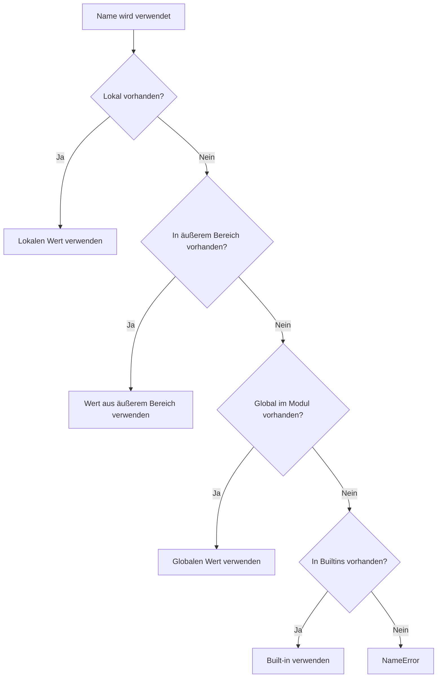
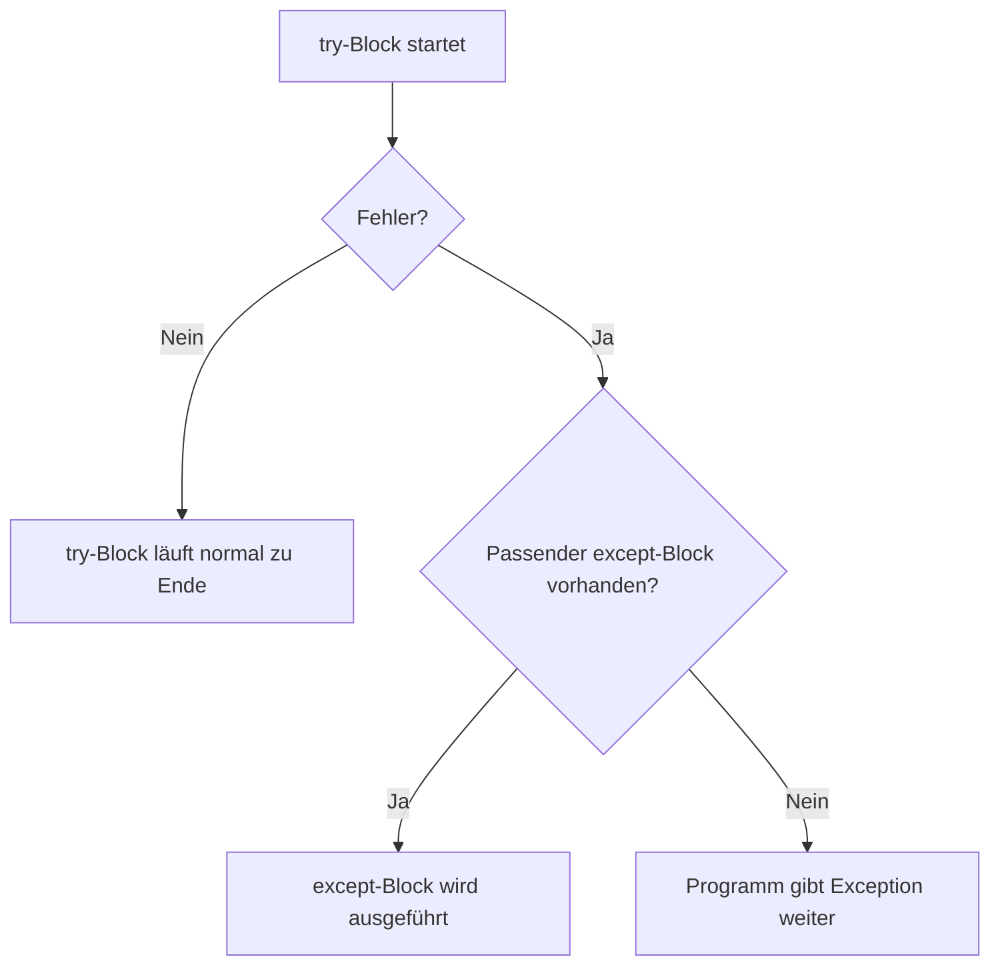
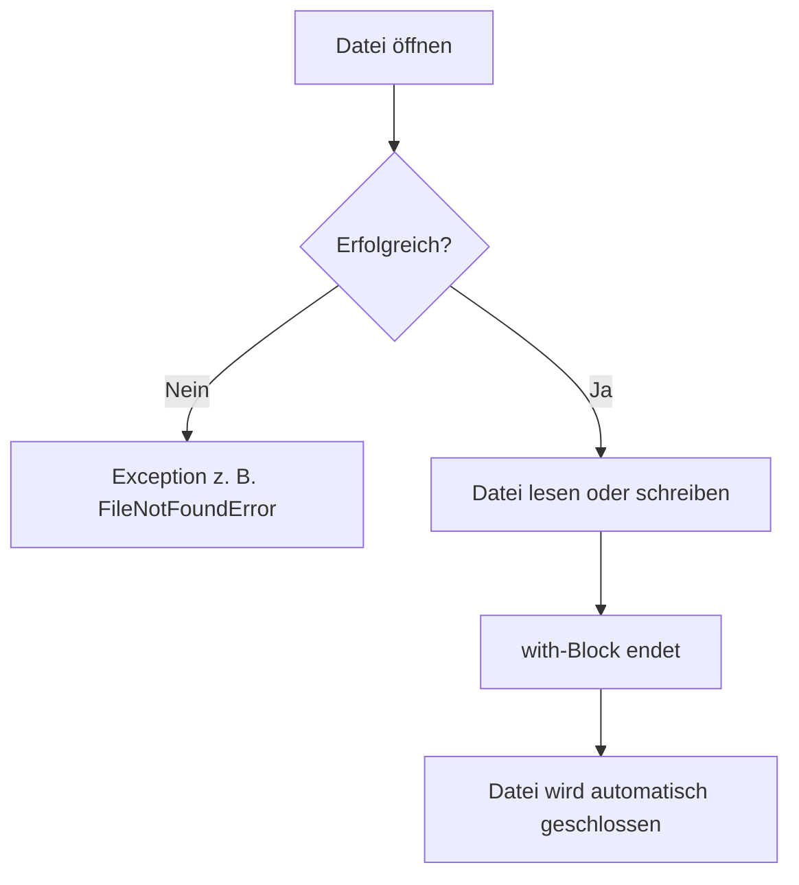

###### Themen

Scope und Module

- Unterschied zwischen lokalen und globalen Variablen grundlegend verstehen
- Standardmodule importieren und nutzen
- Eigene Python-Dateien als Module in einfacher Form verwenden

Fehlerbehandlung in Python

- Grundlagen von Exceptions und Fehlerarten
- try und except zur einfachen Fehlerbehandlung einsetzen

Einfache Dateiverarbeitung

- Dateien mit open() öffnen, lesen und schreiben
- Das with-Statement für Dateizugriffe nutzen

<br><br><br>
# 🧭 Scope und Module

Wenn du in Python programmierst, dann arbeitest du ständig mit **Namen**: zum Beispiel `x`, `name`, `preis` oder `datei`. Diese Namen verweisen auf Werte oder Objekte. Die wichtige Frage ist dabei immer:

**Von wo aus ist ein Name sichtbar und benutzbar?**

Genau darum geht es beim **Scope**, auf Deutsch meist **Gültigkeitsbereich** genannt. Python verwaltet sehr genau, **wo** eine Variable existiert und **wo** sie gelesen oder verändert werden darf. Das ist eine Grundlage, die du wirklich sauber verstehen solltest, weil sie in fast jedem echten Python-Programm eine Rolle spielt.

Ein zweites wichtiges Thema sind **Module**. Module helfen dir dabei, Code zu organisieren, wiederzuverwenden und Funktionen aus der Python-Standardbibliothek oder aus eigenen Dateien einzubinden. Python behandelt fast jede `.py`-Datei als Modul, und genau das macht Programme strukturierbar und wartbar ([The Python Tutorial – Modules](https://docs.python.org/3/tutorial/modules.html)).


<br><br><br>
## 📍 Lokale und globale Variablen verstehen

Eine Variable ist nicht einfach “da”, sondern sie lebt immer in einem bestimmten **Namensraum** und damit in einem bestimmten **Gültigkeitsbereich**. Python löst Namen nach festen Regeln auf, also danach, wo ein Name definiert wurde und von wo aus du auf ihn zugreifst ([Execution model](https://docs.python.org/3/reference/executionmodel.html)).

Ganz grob gilt:

- **Lokale Variablen** entstehen meist **innerhalb einer Funktion**
- **Globale Variablen** werden meist **außerhalb von Funktionen**, also auf Modulebene, definiert

Das klingt erstmal einfach, aber der entscheidende Punkt ist:  
**Nicht der Name selbst ist lokal oder global, sondern der Ort, an dem Python ihn einordnet.**


<br><br><br>
### 🏠 Lokale Variablen

Eine **lokale Variable** ist eine Variable, die innerhalb einer Funktion entsteht. Sie gehört dann nur zu dieser Funktion und ist außerhalb normalerweise nicht direkt verfügbar.

```python
def begruessung():
    text = "Hallo!"
    print(text)

begruessung()
```

Hier ist `text` eine lokale Variable. Sie existiert im Inneren der Funktion `begruessung()`.

Wenn du danach außerhalb der Funktion `print(text)` schreiben würdest, bekämst du einen Fehler, weil `text` dort nicht bekannt ist.

Warum ist das sinnvoll?

Weil Funktionen dadurch **unabhängig** bleiben. Was in einer Funktion passiert, bleibt zunächst in dieser Funktion. Das verhindert Chaos und macht Code leichter verständlich.

Ein wichtiger Punkt:  
Lokale Variablen werden normalerweise **erst beim Funktionsaufruf** erzeugt. Wenn die Funktion beendet ist, ist diese lokale Bindung nicht mehr normal zugänglich.


<br><br><br>
### 🌍 Globale Variablen

Eine **globale Variable** ist eine Variable, die auf **Modulebene** definiert wird, also außerhalb von Funktionen.

```python
sprache = "Deutsch"

def zeige_sprache():
    print(sprache)

zeige_sprache()
```

Hier ist `sprache` global. Die Funktion kann sie lesen, obwohl sie sie nicht selbst definiert hat.

Das liegt daran, dass Python bei der Namenssuche nicht nur lokal schaut, sondern – wenn es lokal nichts findet – auch in äußeren Bereichen und schließlich im globalen Bereich des Moduls sucht ([Execution model](https://docs.python.org/3/reference/executionmodel.html)).

Wichtig ist aber:  
**Lesen** einer globalen Variable ist etwas anderes als **Verändern** einer globalen Variable.


<br><br><br>
### ⚠️ Der wichtige Unterschied: lesen ist nicht dasselbe wie zuweisen

Das ist einer der häufigsten Stolpersteine am Anfang.

Schau dir dieses Beispiel an:

```python
zahl = 10

def funktion():
    print(zahl)

funktion()
```

Das funktioniert. Warum?  
Weil `zahl` in der Funktion **nur gelesen** wird.

Jetzt dieses Beispiel:

```python
zahl = 10

def funktion():
    zahl = 20
    print(zahl)

funktion()
print(zahl)
```

Hier erzeugt `zahl = 20` **eine neue lokale Variable** namens `zahl`. Die globale `zahl` bleibt unverändert. Die Ausgabe ist dann:

```python
20
10
```

Das bedeutet:  
Sobald du in einer Funktion einer Variablen einen Wert zuweist, behandelt Python diesen Namen in dieser Funktion standardmäßig als **lokal**, außer du sagst explizit etwas anderes mit `global` oder `nonlocal` ([The Python Language Reference – The global statement](https://docs.python.org/3/reference/simple_stmts.html#the-global-statement)).


<br><br><br>
### 🔥 Typischer Fehler: UnboundLocalError

Ein sehr klassischer Anfängerfehler sieht so aus:

```python
zahl = 10

def funktion():
    print(zahl)
    zahl = 20

funktion()
```

Viele erwarten, dass zuerst `10` ausgegeben wird. Tatsächlich entsteht aber ein Fehler:

```python
UnboundLocalError
```

Warum?

Weil Python die Variable `zahl` in der Funktion als **lokal** einstuft, da später eine Zuweisung `zahl = 20` vorkommt. Dann versucht `print(zahl)` auf diese lokale Variable zuzugreifen, **bevor** sie einen Wert bekommen hat. Genau dafür gibt es den Fehler `UnboundLocalError`, der eine Unterklasse von `NameError` ist ([Built-in Exceptions](https://docs.python.org/3/library/exceptions.html#UnboundLocalError)).

Das ist ein sehr wichtiger Denkpunkt:

> Python entscheidet den Gültigkeitsbereich eines Namens in einer Funktion nicht erst zur Laufzeit Zeile für Zeile, sondern anhand der Struktur des Funktionskörpers.


<br><br><br>
### 🛠️ Globale Variablen mit `global` verändern

Wenn du wirklich innerhalb einer Funktion eine globale Variable **verändern** willst, musst du das mit `global` ausdrücklich sagen.

```python
zaehler = 0

def erhoehen():
    global zaehler
    zaehler += 1

erhoehen()
print(zaehler)
```

Ausgabe:

```python
1
```

Mit `global zaehler` sagst du Python:  
“Wenn ich in dieser Funktion `zaehler` verwende, meine ich nicht eine lokale Variable, sondern die globale aus dem Modul.” Das Verhalten ist in der Sprachreferenz genau beschrieben ([The Python Language Reference – The global statement](https://docs.python.org/3/reference/simple_stmts.html#the-global-statement)).

Trotzdem solltest du globale Variablen eher sparsam einsetzen. Der Grund ist einfach:

- Sie machen Programme schwerer nachvollziehbar
- Viele Teile des Codes können denselben Zustand verändern
- Fehler werden dadurch oft schwerer zu finden

In sauberem Code ist es meistens besser, Werte **als Parameter** zu übergeben und **Rückgabewerte** zu verwenden, statt globale Zustände ständig zu verändern.


<br><br><br>
### 🧠 So sucht Python nach Namen

Python verwendet bei der Namensauflösung eine feste Suchlogik. Vereinfacht kann man sie so darstellen:



Diese Logik entspricht dem allgemeinen Ausführungsmodell von Python mit lokalen, einschließenden, globalen und eingebauten Namensräumen ([Execution model](https://docs.python.org/3/reference/executionmodel.html)).

Für dich als Einstieg reicht vor allem diese praktische Regel:

- In Funktionen schaut Python zuerst lokal
- Dann nach außen
- Dann global im Modul
- Danach bei den eingebauten Namen wie `print`, `len` oder `open`


<br><br><br>
### 📋 Lokale vs. globale Variablen im direkten Vergleich

| Merkmal | Lokale Variable | Globale Variable |
|---|---|---|
| Wo definiert? | Meist innerhalb einer Funktion | Außerhalb von Funktionen auf Modulebene |
| Sichtbar wo? | Normalerweise nur in dieser Funktion | Im ganzen Modul lesbar |
| Lebensdauer | Während des Funktionsaufrufs | Solange das Modul geladen ist |
| Änderung innerhalb einer Funktion | Direkt möglich | Nur mit `global`, wenn neu zugewiesen wird |
| Typische Nutzung | Zwischenergebnisse, Funktionslogik | Konstanten, gemeinsame Einstellungen, Modulzustand |

Ein guter Praxis-Tipp ist:  
Wenn du dich fragst, ob etwas global sein sollte, lautet die Antwort sehr oft: **eher nein**. Globale Variablen sind möglich, aber lokale Variablen und Funktionsparameter sind meistens klarer.


<br><br><br>
## 📦 Standardmodule importieren und nutzen

Python bringt eine große **Standardbibliothek** mit. Sie enthält fertige Module für sehr viele typische Aufgaben: Zufallszahlen, Mathematik, Dateipfade, Datum und Uhrzeit, JSON, reguläre Ausdrücke und vieles mehr ([The Python Standard Library](https://docs.python.org/3/library/index.html)).

Diese Module musst du nicht selbst schreiben. Du kannst sie einfach **importieren**.

Das geschieht mit `import`.


<br><br><br>
### 🧩 Was ist ein Modul?

Ein Modul ist in Python im Grunde eine Datei mit Python-Code, meist eine `.py`-Datei. In so einem Modul können zum Beispiel enthalten sein:

- Funktionen
- Klassen
- Variablen
- Konstanten
- ausführbarer Code

Wenn du ein Modul importierst, macht Python dessen Inhalte für dein Programm verfügbar ([The Python Tutorial – Modules](https://docs.python.org/3/tutorial/modules.html)).


<br><br><br>
### 📥 Ein Modul komplett importieren

```python
import math

print(math.sqrt(25))
print(math.pi)
```

Hier importierst du das Modul `math`. Danach greifst du mit `math.sqrt` oder `math.pi` darauf zu.

Das ist meist die sauberste Form, weil sofort klar ist, **woher** eine Funktion oder Konstante kommt.

`math.sqrt()` liefert die Quadratwurzel, und `math.pi` enthält die Kreiszahl π ([math — Mathematical functions](https://docs.python.org/3/library/math.html)).


<br><br><br>
### 🎯 Nur bestimmte Inhalte importieren

```python
from math import sqrt, pi

print(sqrt(25))
print(pi)
```

Hier importierst du nicht das ganze Modul als Namensraum, sondern direkt bestimmte Namen daraus.

Das ist kürzer, aber etwas weniger eindeutig, weil man im Code nicht sofort sieht, aus welchem Modul `sqrt` stammt. Für kleine Skripte kann das okay sein, in größerem Code ist `import math` oft übersichtlicher.


<br><br><br>
### 🏷️ Module mit Alias importieren

Ein Alias ist ein alternativer kurzer Name.

```python
import math as m

print(m.sqrt(49))
```

Das ist nützlich, wenn ein Modulname lang ist oder wenn es einen üblichen Kurznamen gibt. Ein bekanntes Beispiel außerhalb der Standardbibliothek ist etwa `import numpy as np`, aber in der Standardbibliothek kommt das auch vor, zum Beispiel bei `datetime as dt`, wenn man es kurz halten will.


<br><br><br>
### 🚫 Warum `from modul import *` problematisch ist

Man kann theoretisch auch so importieren:

```python
from math import *
```

Dann werden viele Namen direkt in deinen aktuellen Namensraum geladen. Das wirkt bequem, ist aber meist keine gute Idee.

Warum?

Weil dadurch unklar wird:

- welche Namen woher kommen
- ob ein Name vielleicht einen anderen überschreibt
- welche Funktionen wirklich verfügbar sind

Gerade beim Lernen und in sauberem Code solltest du diese Form eher vermeiden. Die Python-Dokumentation zeigt zwar, dass sie existiert, aber für lesbaren Code sind explizite Importe fast immer besser ([The Python Tutorial – Modules](https://docs.python.org/3/tutorial/modules.html)).


<br><br><br>
### 🧪 Häufige Standardmodule in einfachen Programmen

| Modul | Wofür es nützlich ist | Beispiel |
|---|---|---|
| `math` | Mathematik | `math.sqrt(9)` |
| `random` | Zufallswerte | `random.randint(1, 6)` |
| `datetime` | Datum und Uhrzeit | `datetime.date.today()` |
| `os` | Betriebssystemnahe Funktionen | `os.getcwd()` |
| `json` | JSON lesen und schreiben | `json.loads(text)` |
| `pathlib` | Moderne Arbeit mit Pfaden | `Path("datei.txt")` |

Zum Beispiel erzeugt `random.randint(a, b)` eine ganze Zufallszahl inklusive beider Grenzen ([random — Generate pseudo-random numbers](https://docs.python.org/3/library/random.html)).  
Und `os.getcwd()` liefert das aktuelle Arbeitsverzeichnis ([os — Miscellaneous operating system interfaces](https://docs.python.org/3/library/os.html)).


<br><br><br>
### 🧭 Was beim Import technisch passiert

Wenn Python ein Modul importiert, passiert vereinfacht Folgendes:

1. Python sucht das Modul
2. Python lädt und führt den Modulcode aus
3. Das Modulobjekt wird verfügbar gemacht
4. Spätere Importe desselben Moduls verwenden normalerweise das bereits geladene Modul aus dem Modul-Cache `sys.modules` ([The Python Import System](https://docs.python.org/3/reference/import.html))

Das ist wichtig, weil ein Import nicht nur “sichtbar machen” bedeutet, sondern beim ersten Import auch Code ausführen kann.

Darum solltest du in Modulen möglichst nur Dinge definieren und keinen unnötigen Code direkt beim Import starten lassen.


<br><br><br>
## 🧩 Eigene Python-Dateien als Module verwenden

Jetzt kommt der besonders praktische Teil:  
**Du kannst deine eigenen `.py`-Dateien genauso wie Standardmodule verwenden.**

Wenn du zum Beispiel eine Datei `rechner.py` hast, dann ist diese Datei ein Modul namens `rechner`, solange Python sie finden kann ([The Python Tutorial – Modules](https://docs.python.org/3/tutorial/modules.html)).


<br><br><br>
### 📄 Einfaches Beispiel mit eigener Datei

Stell dir zwei Dateien im selben Ordner vor.

**Datei `rechner.py`:**

```python
def addiere(a, b):
    return a + b

def multipliziere(a, b):
    return a * b
```

**Datei `main.py`:**

```python
import rechner

print(rechner.addiere(3, 4))
print(rechner.multipliziere(5, 6))
```

Wenn beide Dateien im selben Verzeichnis liegen, kann `main.py` das Modul `rechner` importieren.

Das ist der erste Schritt zu sauber strukturierten Programmen:  
Du trennst Aufgaben auf mehrere Dateien auf.


<br><br><br>
### 🎯 Alternative Importform bei eigenen Modulen

Du kannst auch gezielt nur einzelne Funktionen importieren:

```python
from rechner import addiere

print(addiere(10, 20))
```

Auch das funktioniert. Wie bei Standardmodulen gilt aber:  
Die explizite Form mit `import rechner` ist oft klarer, weil sofort sichtbar ist, woher `addiere` stammt.


<br><br><br>
### 📁 Voraussetzung: Python muss das Modul finden

Ein Import klappt nur, wenn Python weiß, wo das Modul liegt. Python sucht an bestimmten Orten nach Modulen, unter anderem im aktuellen Verzeichnis und in weiteren Pfaden des Importsystems ([The Python Import System](https://docs.python.org/3/reference/import.html)).

Für den Einstieg ist die einfachste Regel:

- Lege die importierende Datei und das eigene Modul in denselben Ordner

Dann funktioniert es in vielen einfachen Fällen direkt.


<br><br><br>
### 🛡️ Der Spezialfall `if __name__ == "__main__":`

Wenn du eine Python-Datei sowohl **direkt ausführen** als auch **als Modul importieren** möchtest, ist dieses Muster sehr wichtig:

```python
def begruessung():
    print("Hallo aus dem Modul!")

if __name__ == "__main__":
    begruessung()
```

Was bedeutet das?

- Wenn du die Datei direkt startest, wird der Block ausgeführt
- Wenn du sie importierst, wird dieser Block nicht ausgeführt

Das ist das in der Python-Dokumentation empfohlene Muster, um Modulcode von Startcode zu trennen ([__main__ — Top-level code environment](https://docs.python.org/3/library/__main__.html)).

Das hilft dir, Module sauber zu halten. Funktionen und Klassen sind importierbar, aber Test- oder Startcode läuft nicht ungefragt beim Import.


<br><br><br>
### 🧱 Gute Denkweise bei Modulen

Eine sehr hilfreiche Sichtweise ist:

- **Eine Datei = ein Themenbereich**
- **Ein Modul bündelt zusammengehörige Funktionen**
- **Die Hauptdatei nutzt diese Bausteine**

Dadurch entstehen Programme, die nicht aus einem riesigen Skript bestehen, sondern aus geordneten Teilen.

Zum Beispiel:

- `rechner.py` für Rechenfunktionen
- `dateien.py` für Dateizugriffe
- `main.py` für den eigentlichen Programmablauf

Das ist ein Kernprinzip von guter Softwarestruktur.


<br><br><br>
# ⚠️ Fehlerbehandlung in Python

Fehler gehören in der Programmierung nicht nur dazu, sie sind sogar normal. Wichtig ist nicht, **ob** Fehler auftreten, sondern **wie** dein Programm damit umgeht.

In Python werden viele Fehler als **Exceptions** behandelt. Eine Exception ist ein Signal, dass während der Programmausführung etwas schiefgelaufen ist. Die Python-Dokumentation beschreibt Exceptions als Objekte, die einen Fehler oder ein ungewöhnliches Ereignis repräsentieren ([Errors and Exceptions](https://docs.python.org/3/tutorial/errors.html)).

Wenn du keine Fehlerbehandlung schreibst, bricht ein Programm bei einer unbehandelten Exception normalerweise ab.


<br><br><br>
## 🚨 Grundlagen von Exceptions und Fehlerarten

Eine Exception entsteht zum Beispiel, wenn:

- du durch null teilst
- du auf eine nicht vorhandene Datei zugreifst
- du eine Zahl aus einem Text machen willst, der gar keine Zahl ist
- du auf einen Namen zugreifst, der nicht definiert wurde

Hier ein paar typische Beispiele:

```python
print(10 / 0)          # ZeroDivisionError
zahl = int("abc")      # ValueError
print(unbekannt)       # NameError
```

Diese Fehlerarten sind eingebaute Exception-Klassen in Python ([Built-in Exceptions](https://docs.python.org/3/library/exceptions.html)).


<br><br><br>
### 🧠 Syntaxfehler vs. Laufzeitfehler

Ein sehr wichtiger Unterschied ist der zwischen **Syntaxfehlern** und **Exceptions während der Ausführung**.

#### Syntaxfehler

Ein Syntaxfehler bedeutet:  
Der Code ist grammatikalisch kein gültiges Python.

```python
if True
    print("Hallo")
```

Hier fehlt der Doppelpunkt korrekt im Zusammenhang der Syntax. Python kann das Programm gar nicht erst richtig starten. Solche Fehler heißen `SyntaxError` ([Exceptions – SyntaxError](https://docs.python.org/3/library/exceptions.html#SyntaxError)).

#### Laufzeitfehler / Exceptions

Diese Fehler treten erst **während** der Ausführung auf.

```python
zahl = 10 / 0
```

Der Code ist syntaktisch korrekt, aber zur Laufzeit unmöglich. Deshalb entsteht `ZeroDivisionError` ([Built-in Exceptions](https://docs.python.org/3/library/exceptions.html#ZeroDivisionError)).

Das ist eine ganz zentrale Unterscheidung:

- **Syntaxfehler**: Python versteht deinen Code nicht
- **Exceptions**: Python versteht deinen Code, aber bei der Ausführung tritt ein Problem auf


<br><br><br>
### 📚 Wichtige Exception-Typen für den Einstieg

| Exception | Wann sie typischerweise auftritt | Beispiel |
|---|---|---|
| `NameError` | Name existiert nicht | `print(x)` |
| `TypeError` | Falscher Datentyp oder falsche Typkombination | `"3" + 4` |
| `ValueError` | Richtiger Typ, aber unpassender Wert | `int("abc")` |
| `ZeroDivisionError` | Division durch 0 | `5 / 0` |
| `IndexError` | Listenindex außerhalb des Bereichs | `liste[10]` |
| `KeyError` | Schlüssel in Dictionary fehlt | `d["x"]` |
| `FileNotFoundError` | Datei existiert nicht | `open("abc.txt")` |
| `PermissionError` | Kein Zugriff erlaubt | geschützte Datei öffnen |

Zum Beispiel ist `FileNotFoundError` die passende Exception, wenn eine Datei oder ein Verzeichnis nicht existiert ([Built-in Exceptions – FileNotFoundError](https://docs.python.org/3/library/exceptions.html#FileNotFoundError)).


<br><br><br>
### 🔗 Exceptions sind Klassen mit Vererbung

Python organisiert Exceptions in einer Klassenhierarchie. Das ist wichtig, weil du dadurch entweder sehr gezielt oder allgemeiner Fehler abfangen kannst ([Built-in Exceptions](https://docs.python.org/3/library/exceptions.html)).

Zum Beispiel ist `FileNotFoundError` eine speziellere Form von `OSError`.

Das bedeutet:

- Du kannst gezielt `FileNotFoundError` abfangen
- Oder allgemeiner `OSError`, wenn dir mehrere Dateisystemfehler gemeinsam wichtig sind

Für den Einstieg ist die wichtigste Erkenntnis:  
**Nicht jeder Fehler ist gleich.** Python gibt dir präzise Fehlerarten, damit du angemessen reagieren kannst.


<br><br><br>
## 🛠️ `try` und `except` zur einfachen Fehlerbehandlung einsetzen

Mit `try` und `except` kannst du Code schreiben, der Fehler **kontrolliert abfängt**, statt einfach abzustürzen. Das Grundprinzip ist direkt im Python-Tutorial beschrieben ([Errors and Exceptions](https://docs.python.org/3/tutorial/errors.html)).

Die Grundform sieht so aus:

```python
try:
    # kritischer Code
except Fehlerart:
    # Reaktion auf den Fehler
```

Der Code im `try`-Block wird ausgeführt. Wenn dabei die angegebene Exception auftritt, springt Python in den passenden `except`-Block.


<br><br><br>
### 🧪 Einfaches Beispiel mit Benutzereingaben

```python
text = input("Bitte gib eine Zahl ein: ")

try:
    zahl = int(text)
    print("Doppelt:", zahl * 2)
except ValueError:
    print("Das war keine gültige ganze Zahl.")
```

Hier kann `int(text)` scheitern, wenn der Benutzer zum Beispiel `"abc"` eingibt. In diesem Fall entsteht `ValueError`, und genau diese Exception wird abgefangen ([Built-in Exceptions – ValueError](https://docs.python.org/3/library/exceptions.html#ValueError)).

Das ist ein sehr guter typischer Einsatz von Fehlerbehandlung:  
Eingaben aus der echten Welt sind oft unzuverlässig.


<br><br><br>
### 🎯 Gezieltes Abfangen ist besser als allgemeines Abfangen

Technisch könntest du auch so etwas schreiben:

```python
try:
    zahl = int(input("Zahl: "))
except:
    print("Irgendetwas ist schiefgelaufen.")
```

Das funktioniert zwar, ist aber meistens keine gute Praxis. Warum?

Weil du damit **jede** Exception abfängst, auch solche, die du vielleicht gar nicht verstehst oder die auf einen echten Programmierfehler hinweisen.

Besser ist:

```python
try:
    zahl = int(input("Zahl: "))
except ValueError:
    print("Bitte gib wirklich eine Zahl ein.")
```

Diese Form ist klarer, sicherer und fachlich sauberer. Das Python-Tutorial empfiehlt ebenfalls, möglichst spezifische Exceptions zu behandeln ([Errors and Exceptions](https://docs.python.org/3/tutorial/errors.html)).


<br><br><br>
### 🔀 Mehrere Fehlerarten behandeln

Du kannst mehrere `except`-Blöcke verwenden:

```python
try:
    datei = open("daten.txt", "r", encoding="utf-8")
    inhalt = datei.read()
    zahl = int(inhalt)
    print(100 / zahl)
except FileNotFoundError:
    print("Die Datei wurde nicht gefunden.")
except ValueError:
    print("Der Dateiinhalt ist keine gültige Zahl.")
except ZeroDivisionError:
    print("Die Zahl in der Datei darf nicht 0 sein.")
```

Das ist ein sehr gutes Beispiel aus der Praxis:  
Verschiedene Fehler können aus unterschiedlichen Gründen entstehen, und dein Programm kann auf jeden davon anders reagieren.

- Datei fehlt
- Dateiinhalt ist keine Zahl
- Zahl ist 0

Jeder Fehler bekommt seine passende Behandlung.


<br><br><br>
### 🧱 Ablauf von `try` und `except`



Dieses Verhalten gehört zur Grundmechanik von Exceptions in Python ([Errors and Exceptions](https://docs.python.org/3/tutorial/errors.html)).


<br><br><br>
### 📝 Exception-Objekt mit `as` nutzen

Manchmal möchtest du nicht nur wissen, **dass** ein Fehler aufgetreten ist, sondern auch **welche genaue Meldung** Python dazu hat.

Dann kannst du die Exception mit `as` an eine Variable binden:

```python
try:
    zahl = int("abc")
except ValueError as fehler:
    print("Fehler:", fehler)
```

So bekommst du Zugriff auf das Exception-Objekt. Das ist nützlich für Logging, Debugging oder für genauere Fehlermeldungen.


<br><br><br>
### 🚪 Was `try` nicht leisten soll

Fehlerbehandlung ist nicht dazu da, Programmierfehler zu verstecken.

Schlechter Stil wäre zum Beispiel:

```python
try:
    print(preis)
except:
    pass
```

Hier würde ein möglicher `NameError` einfach still verschwinden. Das ist gefährlich, weil dein Programm dann zwar weiterläuft, aber inhaltlich falsch sein kann.

Gute Fehlerbehandlung bedeutet:

- erwartbare Fehler abfangen
- sinnvoll reagieren
- unerwartete Fehler nicht unnötig verschleiern

Gerade beim Lernen ist das extrem wichtig. Du willst Fehler verstehen, nicht unsichtbar machen.


<br><br><br>
# 📁 Einfache Dateiverarbeitung

Dateien sind eine der wichtigsten Brücken zwischen deinem Programm und der Außenwelt. Mit Dateien kannst du:

- Daten dauerhaft speichern
- Texte laden
- Konfigurationen einlesen
- Ergebnisse abspeichern
- Logdateien schreiben

In Python geschieht der grundlegende Dateizugriff meist mit der eingebauten Funktion `open()` ([Built-in Functions – open](https://docs.python.org/3/library/functions.html#open)).


<br><br><br>
## 📖 Dateien mit `open()` öffnen, lesen und schreiben

Die Funktion `open()` öffnet eine Datei und liefert ein Dateiobjekt zurück. Mit diesem Objekt kannst du dann lesen oder schreiben ([Built-in Functions – open](https://docs.python.org/3/library/functions.html#open)).

Die einfachste Form sieht so aus:

```python
datei = open("beispiel.txt", "r", encoding="utf-8")
```

Hier bedeutet:

- `"beispiel.txt"` ist der Dateiname oder Pfad
- `"r"` ist der Modus
- `encoding="utf-8"` gibt die Textkodierung an

Gerade bei Textdateien ist `utf-8` meistens die richtige und moderne Wahl.


<br><br><br>
### 📂 Wichtige Modi bei `open()`

| Modus | Bedeutung |
|---|---|
| `"r"` | lesen |
| `"w"` | schreiben, Datei wird neu erstellt oder geleert |
| `"a"` | anhängen, also ans Ende schreiben |
| `"x"` | exklusiv neu erstellen, Fehler wenn Datei schon existiert |
| `"b"` | Binärmodus |
| `"t"` | Textmodus, standardmäßig aktiv |

Diese Modi sind in der Dokumentation von `open()` beschrieben ([Built-in Functions – open](https://docs.python.org/3/library/functions.html#open)).

In der Praxis für den Einstieg sind vor allem diese drei wichtig:

- `"r"` lesen
- `"w"` schreiben
- `"a"` anhängen


<br><br><br>
### 📥 Eine Datei lesen

```python
datei = open("beispiel.txt", "r", encoding="utf-8")
inhalt = datei.read()
datei.close()

print(inhalt)
```

`read()` liest den gesamten Dateiinhalt als String ([Built-in Functions – open](https://docs.python.org/3/library/functions.html#open)).

Das ist einfach und praktisch bei kleinen Dateien. Bei sehr großen Dateien wäre es oft besser, zeilenweise zu lesen, aber für den Einstieg ist `read()` völlig okay.


<br><br><br>
### 🧾 Zeilenweise lesen

Du kannst auch mit `readline()` oder `readlines()` arbeiten, aber oft ist die einfachste und sauberste Form ein Schleifendurchlauf über die Datei.

```python
datei = open("beispiel.txt", "r", encoding="utf-8")

for zeile in datei:
    print(zeile.strip())

datei.close()
```

Warum ist das sinnvoll?

Weil du dann nicht alles auf einmal in den Speicher lädst, sondern die Datei schrittweise verarbeitest. Dateiobjekte sind iterierbar, deshalb funktioniert diese Schleifenform direkt ([Built-in Types – File Objects](https://docs.python.org/3/library/io.html)).


<br><br><br>
### ✍️ In eine Datei schreiben

```python
datei = open("ausgabe.txt", "w", encoding="utf-8")
datei.write("Hallo Welt\n")
datei.write("Noch eine Zeile\n")
datei.close()
```

`write()` schreibt Text in die Datei. Wichtig ist dabei:

- `write()` fügt **nicht automatisch** einen Zeilenumbruch hinzu
- `\n` musst du selbst schreiben, wenn du eine neue Zeile möchtest

Der Modus `"w"` ist dabei sehr wichtig:  
Falls die Datei schon existiert, wird ihr bisheriger Inhalt normalerweise gelöscht und überschrieben ([Built-in Functions – open](https://docs.python.org/3/library/functions.html#open)).


<br><br><br>
### ➕ An eine Datei anhängen

```python
datei = open("log.txt", "a", encoding="utf-8")
datei.write("Neuer Eintrag\n")
datei.close()
```

Mit `"a"` wird ans Ende der Datei geschrieben. Bestehender Inhalt bleibt erhalten. Das ist praktisch für Logdateien oder fortlaufende Notizen.


<br><br><br>
### ⚠️ Häufige Fehler bei der Dateiverarbeitung

Bei Dateien treten besonders oft diese Probleme auf:

- Die Datei existiert nicht → `FileNotFoundError`
- Der Pfad ist falsch
- Es fehlen Zugriffsrechte → `PermissionError`
- Falsche Kodierung führt zu Darstellungs- oder Lesefehlern
- Man vergisst `close()`

Gerade der letzte Punkt ist wichtig:  
Eine geöffnete Datei sollte wieder geschlossen werden, damit Systemressourcen freigegeben und Daten zuverlässig geschrieben werden. Genau deshalb ist das `with`-Statement so wertvoll ([Built-in Functions – open](https://docs.python.org/3/library/functions.html#open)).


<br><br><br>
## 🔒 Das `with`-Statement für Dateizugriffe nutzen

Das `with`-Statement ist die empfohlene Art, mit Dateien zu arbeiten. Die Python-Dokumentation zeigt ausdrücklich, dass es beim Arbeiten mit Dateien verwendet werden sollte, weil die Datei danach sauber geschlossen wird, auch wenn ein Fehler auftritt ([The Python Tutorial – Reading and Writing Files](https://docs.python.org/3/tutorial/inputoutput.html#reading-and-writing-files)).

Die Grundform sieht so aus:

```python
with open("beispiel.txt", "r", encoding="utf-8") as datei:
    inhalt = datei.read()
    print(inhalt)
```

Sobald der `with`-Block verlassen wird, wird die Datei automatisch geschlossen.


<br><br><br>
### 🧠 Warum `with` besser ist als manuelles `close()`

Ohne `with` musst du selbst daran denken, `close()` aufzurufen:

```python
datei = open("beispiel.txt", "r", encoding="utf-8")
inhalt = datei.read()
datei.close()
```

Das wirkt erstmal harmlos, aber was passiert, wenn zwischen `open()` und `close()` ein Fehler entsteht? Dann wird `close()` möglicherweise nie erreicht.

Mit `with` passiert das sauberer:

```python
with open("beispiel.txt", "r", encoding="utf-8") as datei:
    inhalt = datei.read()
    print(inhalt)
```

Auch wenn im Block eine Exception auftritt, kümmert sich Python darum, dass die Datei korrekt beendet wird. Genau das ist die Stärke eines **Kontextmanagers**, und `open()` liefert ein Objekt, das in einem `with`-Block verwendet werden kann ([Data Model – Context Managers](https://docs.python.org/3/reference/datamodel.html#context-managers)).


<br><br><br>
### 📖 Lesen mit `with`

```python
with open("daten.txt", "r", encoding="utf-8") as datei:
    text = datei.read()

print(text)
```

Das ist die Standardform, die du dir am besten direkt angewöhnst.


<br><br><br>
### ✍️ Schreiben mit `with`

```python
with open("ausgabe.txt", "w", encoding="utf-8") as datei:
    datei.write("Erste Zeile\n")
    datei.write("Zweite Zeile\n")
```

Auch hier wird die Datei automatisch geschlossen, wenn der Block endet.


<br><br><br>
### 🔁 Zeilenweise Verarbeitung mit `with`

```python
with open("namen.txt", "r", encoding="utf-8") as datei:
    for zeile in datei:
        name = zeile.strip()
        print("Name:", name)
```

Das ist eine sehr typische und gute Praxisform:

- Datei öffnen
- Zeile für Zeile verarbeiten
- automatisch schließen


<br><br><br>
### 🧷 `with` und Fehlerbehandlung zusammen nutzen

Besonders stark wird das Ganze, wenn du `with` mit `try` und `except` kombinierst:

```python
try:
    with open("zahlen.txt", "r", encoding="utf-8") as datei:
        inhalt = datei.read()
        zahl = int(inhalt)
        print(100 / zahl)
except FileNotFoundError:
    print("Die Datei gibt es nicht.")
except ValueError:
    print("In der Datei steht keine gültige Zahl.")
except ZeroDivisionError:
    print("Die Zahl in der Datei ist 0.")
```

Das ist in echter Praxis sehr nah an dem, was du später oft brauchst:

- sicherer Dateizugriff mit `with`
- kontrollierte Reaktion auf Fehler mit `try` und `except`

So entsteht robuster Code.


<br><br><br>
### 🗂️ `open()` und `with` im Vergleich

| Variante | Vorteil | Nachteil |
|---|---|---|
| `open()` + manuelles `close()` | leicht zu verstehen | `close()` kann vergessen werden |
| `with open(...) as ...` | sicherer, sauberer, empfohlener Stil | anfangs minimal ungewohnter |

Deshalb gilt als sehr gute Standardregel:

> Wenn du mit Dateien arbeitest, verwende möglichst immer `with open(...) as ...:`


<br><br><br>
### 🧭 Typischer Ablauf bei Dateizugriffen



Genau dieses automatische Schließen ist der praktische Kern des `with`-Statements beim Dateizugriff ([The Python Tutorial – Reading and Writing Files](https://docs.python.org/3/tutorial/inputoutput.html#reading-and-writing-files)).


<br><br><br>
### 🪵 Ein sauberer Merksatz für die Praxis

Beim Einstieg kannst du dir diese drei Gewohnheiten aneignen:

- **Variablen möglichst lokal halten**
- **Code mit Modulen in sinnvolle Dateien aufteilen**
- **Dateien fast immer mit `with open(...)` verwenden**
- **erwartbare Fehler gezielt mit `try` und `except` behandeln**

Wenn du diese Grundlagen wirklich verstehst und sauber anwendest, baust du schon nicht mehr nur “funktionierenden” Code, sondern **verständlichen und robusten Code**.