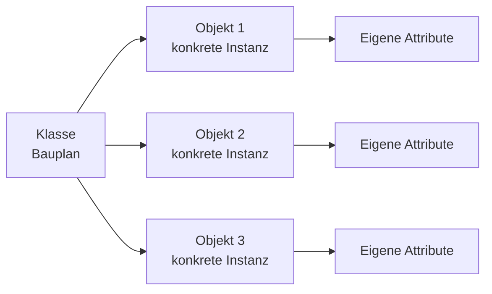
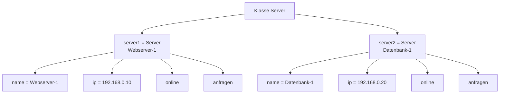

###### Themen

Klassen und Objekte in Python

- Grundidee von Klassen und Objekten verstehen
- Einfache Klassen definieren und Objekte erzeugen
- Die Rolle von --init-- kennenlernen

Attribute und Methoden

- Unterschied zwischen Attributen und Methoden verstehen
- Auf Attribute und Methoden eines Objekts zugreifen

Praxisbeispiel

- Eine einfache eigene Klasse erstellen
- Objektinstanzen erzeugen und Methoden anwenden

<br><br><br>
# 🧱 Klassen und Objekte in Python

Wenn du in Python mit **Klassen** und **Objekten** arbeitest, lernst du einen der wichtigsten Bausteine der objektorientierten Programmierung kennen. Das klingt am Anfang oft technischer, als es wirklich ist. Im Kern geht es um eine sehr einfache Idee:

Eine **Klasse** ist ein **Bauplan**.  
Ein **Objekt** ist ein **konkretes Ding, das nach diesem Bauplan erstellt wurde**.

Python erlaubt es dir, mit dem Schlüsselwort `class` eigene Klassen zu definieren. Diese Klassen können dann eigene Daten und eigenes Verhalten bekommen. ([The Python Tutorial — Classes](https://docs.python.org/3/tutorial/classes.html))

Stell dir das wie in der echten Welt vor:

- Die Klasse ist der Bauplan für ein Auto.
- Ein Objekt ist dann ein bestimmtes Auto, zum Beispiel **dein roter VW**.
- Ein anderes Objekt derselben Klasse könnte ein **blauer BMW** sein.

Beide Objekte gehören zur gleichen Klasse, aber sie können unterschiedliche Eigenschaften haben.

<br><br><br>
## 🧠 Die Grundidee von Klassen und Objekten verstehen

Eine Klasse beschreibt, **was ein Objekt wissen soll** und **was ein Objekt tun kann**.

- Was ein Objekt **wissen soll**, sind seine **Daten** oder **Eigenschaften**.
- Was ein Objekt **tun kann**, sind seine **Funktionen** oder **Aktionen**.

In der objektorientierten Programmierung werden diese beiden Dinge meistens so genannt:

- **Attribute** = Daten / Eigenschaften
- **Methoden** = Funktionen, die zur Klasse gehören

Ein Objekt ist also nicht einfach nur eine lose Variable, sondern ein kleines Paket aus:

- Zustand
- Verhalten
- Struktur

Das macht Programme übersichtlicher, weil zusammengehörige Dinge sauber an einem Ort organisiert werden.

<br><br><br>
### 🏗️ Was ist eine Klasse?

Eine Klasse ist eine Art Vorlage. Sie legt fest:

- welche Attribute ein Objekt haben soll
- welche Methoden ein Objekt benutzen kann

Beispielhaft könnte eine Klasse `Hund` festlegen:

- Jeder Hund hat einen `namen`
- Jeder Hund hat ein `alter`
- Jeder Hund kann `bellen()`

Die Klasse selbst ist aber noch **kein echter Hund**, sondern nur die Beschreibung davon.

<br><br><br>
### 🧍 Was ist ein Objekt?

Ein Objekt ist eine **Instanz** einer Klasse.  
Das Wort **Instanz** bedeutet einfach: ein **konkretes Exemplar**.

Wenn du aus der Klasse `Hund` zwei Objekte erstellst, könnten das zum Beispiel sein:

- `bella`
- `rex`

Beide sind Hunde, also Instanzen der Klasse `Hund`, aber jeder hat seine eigenen Werte.

<br><br><br>
### 🧭 Warum ist das wichtig?

Klassen und Objekte helfen dir dabei, Programme so zu schreiben, dass sie:

- strukturierter sind
- leichter erweitert werden können
- einfacher zu verstehen sind
- reale Dinge oder Konzepte gut abbilden

Gerade in größeren Programmen ist das sehr nützlich. Statt mit vielen einzelnen Variablen und Funktionen zu arbeiten, bündelst du alles logisch zusammen.

<br><br><br>
## 🗺️ Ein einfaches Bild zur Vorstellung



Die Klasse ist also der Ursprung, und daraus können beliebig viele Objekte entstehen.

<br><br><br>
## 🛠️ Einfache Klassen definieren und Objekte erzeugen

Schauen wir uns zuerst die kleinste mögliche Klasse an:

```python
class Hund:
    pass
```

Hier passiert Folgendes:

- Mit `class Hund:` definierst du eine neue Klasse namens `Hund`.
- `pass` bedeutet: Hier steht absichtlich noch nichts. Python braucht aber an dieser Stelle einen eingerückten Block, und `pass` ist einfach ein Platzhalter. Die Verwendung von `class` zur Klassendefinition ist Teil der normalen Python-Syntax. ([The Python Tutorial — Classes](https://docs.python.org/3/tutorial/classes.html))

Diese Klasse kann jetzt benutzt werden, um Objekte zu erzeugen:

```python
class Hund:
    pass

bella = Hund()
rex = Hund()
```

Jetzt wurden zwei Objekte erstellt:

- `bella` ist ein Objekt der Klasse `Hund`
- `rex` ist ebenfalls ein Objekt der Klasse `Hund`

Beide sind getrennte Instanzen. Das bedeutet: Änderungen an `bella` betreffen `rex` nicht automatisch.

<br><br><br>
### 👀 Was bringt uns diese leere Klasse?

Noch nicht viel, denn sie hat weder Attribute noch Methoden. Aber sie zeigt dir bereits die Grundmechanik:

1. Klasse definieren
2. Objekt erzeugen
3. Objekt verwenden

Erst mit Attributen und Methoden wird es wirklich praktisch.

<br><br><br>
## 🧱 Eine Klasse mit echten Eigenschaften

Jetzt erweitern wir das Beispiel:

```python
class Hund:
    def __init__(self, name, alter):
        self.name = name
        self.alter = alter
```

Nun kann die Klasse beim Erzeugen eines Objekts direkt Werte speichern:

```python
bella = Hund("Bella", 3)
rex = Hund("Rex", 5)
```

Jetzt hat jedes Objekt eigene Daten:

```python
print(bella.name)   # Bella
print(rex.alter)    # 5
```

Das ist der entscheidende Punkt:  
Obwohl `bella` und `rex` aus derselben Klasse stammen, haben sie **unterschiedliche Werte**.

<br><br><br>
# ⚙️ Die Rolle von `__init__` kennenlernen

Die Methode `__init__` ist eine **spezielle Methode** in Python. Sie wird verwendet, um ein neu erzeugtes Objekt zu initialisieren. Genauer gesagt wird `__init__` nach der Erzeugung einer Instanz aufgerufen, um sie mit Startwerten zu versehen. ([Data model — object.__init__](https://docs.python.org/3/reference/datamodel.html#object.__init__))

Viele Einsteiger denken:  
`__init__` ist einfach „das Ding, das automatisch beim Erstellen des Objekts ausgeführt wird“.  
Für den Anfang ist das eine gute Denkweise.

<br><br><br>
## 🧠 Warum braucht man `__init__`?

Ohne `__init__` müsstest du Attribute oft erst später von Hand setzen, zum Beispiel so:

```python
class Hund:
    pass

bella = Hund()
bella.name = "Bella"
bella.alter = 3
```

Das funktioniert zwar, ist aber unsauberer und fehleranfälliger.

Mit `__init__` kannst du direkt festlegen, was ein Objekt beim Erstellen bekommen soll:

```python
class Hund:
    def __init__(self, name, alter):
        self.name = name
        self.alter = alter
```

Jetzt ist klar: Jeder `Hund` soll beim Anlegen einen Namen und ein Alter bekommen.

Das macht deinen Code deutlich verständlicher.

<br><br><br>
## 🔍 Was bedeutet `self`?

In fast jeder Python-Klasse siehst du `self`.  
Das ist am Anfang oft der verwirrendste Teil.

`self` bedeutet vereinfacht:  
**„dieses konkrete Objekt hier“**

Wenn du also schreibst:

```python
self.name = name
```

dann heißt das:

- Das Objekt bekommt ein Attribut namens `name`
- Der Wert dafür kommt aus dem übergebenen Parameter `name`

Der erste Parameter einer Instanzmethode heißt in Python üblicherweise `self`. Das ist eine Konvention, die in der Python-Dokumentation so beschrieben wird. ([The Python Tutorial — Classes](https://docs.python.org/3/tutorial/classes.html))

Schauen wir uns das genauer an:

```python
class Hund:
    def __init__(self, name, alter):
        self.name = name
        self.alter = alter
```

Hier gibt es zwei verschiedene Ebenen:

- `name` und `alter` rechts vom Gleichzeichen sind die Werte, die du beim Erzeugen übergibst
- `self.name` und `self.alter` links vom Gleichzeichen sind die gespeicherten Attribute des Objekts

Wenn du dann schreibst:

```python
bella = Hund("Bella", 3)
```

dann passiert sinngemäß:

- Ein neues `Hund`-Objekt wird erstellt
- `self` verweist auf dieses neue Objekt
- `"Bella"` wird in `self.name` gespeichert
- `3` wird in `self.alter` gespeichert

<br><br><br>
## 🧩 `__init__` ist wichtig, aber nicht magisch

Es ist hilfreich, sich `__init__` als Startpunkt des Objekts vorzustellen.  
Aber fachlich sauber ist wichtig:

- `__init__` **erzeugt** das Objekt nicht selbst
- `__init__` **initialisiert** das bereits erzeugte Objekt

Das ist ein kleiner, aber korrekter Unterschied. Die eigentliche Objekterzeugung hängt in Python mit dem Objektmodell zusammen, während `__init__` die Initialisierung übernimmt. ([Data model — object.__init__](https://docs.python.org/3/reference/datamodel.html#object.__init__))

Für deinen Alltag als Anfänger ist vor allem wichtig:  
Wenn du Startwerte setzen willst, ist `__init__` fast immer der richtige Ort.

<br><br><br>
# 🧩 Attribute und Methoden

Sobald du Klassen verstehst, musst du zwei Begriffe sauber auseinanderhalten:

- **Attribute**
- **Methoden**

Das ist absolut zentral, weil fast jede Klasse aus genau diesen beiden Bausteinen besteht.

<br><br><br>
## 📌 Unterschied zwischen Attributen und Methoden verstehen

Ein **Attribut** speichert Daten.  
Eine **Methode** beschreibt Verhalten.

Oder einfacher:

- Attribute sagen, **was ein Objekt hat**
- Methoden sagen, **was ein Objekt kann**

<br><br><br>
### 📦 Attribute

Attribute sind Werte, die zu einem Objekt gehören.

Beispiele:

- Name
- Alter
- Farbe
- Preis
- Status
- IP-Adresse

Wenn du eine Klasse `Server` hast, könnten Attribute zum Beispiel sein:

- `name`
- `ip_adresse`
- `online`

Diese Attribute beschreiben den Zustand des Objekts.

<br><br><br>
### 🛠️ Methoden

Methoden sind Funktionen, die innerhalb einer Klasse definiert werden. Methoden gehören also logisch zum Objekt oder zur Klasse. Das wird im Python-Tutorial im Zusammenhang mit Klassen und Methoden beschrieben. ([The Python Tutorial — Classes](https://docs.python.org/3/tutorial/classes.html))

Beispiele für Methoden könnten sein:

- `starten()`
- `stoppen()`
- `status_anzeigen()`

Methoden sorgen dafür, dass ein Objekt etwas tun kann.

<br><br><br>
### 📊 Attribut vs. Methode im direkten Vergleich

| Begriff | Bedeutung | Beispiel | Zugriff |
|---|---|---|---|
| Attribut | Gespeicherte Eigenschaft | `name`, `alter`, `online` | `objekt.name` |
| Methode | Funktion des Objekts | `bellen()`, `starten()` | `objekt.starten()` |

Der wichtigste sichtbare Unterschied ist oft:

- **Attribute** benutzt du meist **ohne Klammern**
- **Methoden** rufst du mit **Klammern** auf

Beispiel:

```python
print(server.name)       # Attribut
server.starten()         # Methode
```

<br><br><br>
## 🧪 Ein kleines Beispiel mit Attributen und Methoden

```python
class Lampe:
    def __init__(self, farbe):
        self.farbe = farbe
        self.ist_an = False

    def einschalten(self):
        self.ist_an = True

    def ausschalten(self):
        self.ist_an = False
```

Hier ist die Aufteilung klar:

**Attribute:**

- `farbe`
- `ist_an`

**Methoden:**

- `einschalten()`
- `ausschalten()`

Die Attribute speichern den Zustand der Lampe.  
Die Methoden verändern diesen Zustand.

<br><br><br>
## 👉 Auf Attribute und Methoden eines Objekts zugreifen

In Python greifst du mit der **Punktnotation** auf Attribute und Methoden zu. Attributzugriffe wie `objekt.name` und Methodenaufrufe über ein Objekt sind grundlegende Bestandteile des Klassenmodells in Python. ([The Python Tutorial — Classes](https://docs.python.org/3/tutorial/classes.html))

Das sieht so aus:

```python
objekt.attribut
objekt.methode()
```

Schauen wir es am Beispiel der Lampe an:

```python
lampe1 = Lampe("blau")
```

Jetzt kannst du auf ihre Daten zugreifen:

```python
print(lampe1.farbe)    # blau
print(lampe1.ist_an)   # False
```

Und du kannst Methoden aufrufen:

```python
lampe1.einschalten()
print(lampe1.ist_an)   # True

lampe1.ausschalten()
print(lampe1.ist_an)   # False
```

<br><br><br>
### 👓 Was passiert beim Methodenaufruf?

Wenn du schreibst:

```python
lampe1.einschalten()
```

dann wird intern sinngemäß die Methode der Klasse mit dem Objekt `lampe1` als `self` ausgeführt. Genau deshalb muss eine normale Instanzmethode in Python als ersten Parameter `self` haben. Dieses Prinzip gehört zum Standardverhalten von Methoden in Python-Klassen. ([The Python Tutorial — Classes](https://docs.python.org/3/tutorial/classes.html))

Darum funktioniert diese Methode:

```python
def einschalten(self):
    self.ist_an = True
```

`self` verweist in dem Moment auf `lampe1`.

<br><br><br>
### ⚠️ Typische Anfängerverwechslung

Viele verwechseln diese beiden Dinge:

```python
lampe1.farbe
lampe1.einschalten()
```

Der Unterschied ist wichtig:

- `lampe1.farbe` fragt einen gespeicherten Wert ab
- `lampe1.einschalten()` führt eine Aktion aus

Wenn du aus Versehen Klammern bei einem Attribut setzt oder sie bei einer Methode vergisst, führt das schnell zu Fehlern oder Missverständnissen.

<br><br><br>
# 💻 Praxisbeispiel: Eine einfache eigene Klasse erstellen

Damit das Ganze nicht nur theoretisch bleibt, bauen wir jetzt eine kleine, aber realistische Klasse aus dem Tech-Bereich: einen **Server**.

Das passt gut zu Core Tech Fundamentals, weil du hier ein technisches System als Objekt modellierst.

Ein Server soll in unserem Beispiel:

- einen Namen haben
- eine IP-Adresse haben
- wissen, ob er online ist
- gestartet und gestoppt werden können
- Anfragen zählen können

<br><br><br>
## 🏗️ Die Klasse `Server` definieren

```python
class Server:
    def __init__(self, name, ip_adresse):
        self.name = name
        self.ip_adresse = ip_adresse
        self.online = False
        self.anfragen = 0

    def starten(self):
        self.online = True
        print(f"{self.name} wurde gestartet.")

    def stoppen(self):
        self.online = False
        print(f"{self.name} wurde gestoppt.")

    def anfrage_verarbeiten(self):
        if self.online:
            self.anfragen += 1
            print(f"{self.name} verarbeitet eine Anfrage. Gesamt: {self.anfragen}")
        else:
            print(f"{self.name} ist offline und kann keine Anfrage verarbeiten.")

    def status_anzeigen(self):
        print(f"Name: {self.name}")
        print(f"IP-Adresse: {self.ip_adresse}")
        print(f"Online: {self.online}")
        print(f"Verarbeitete Anfragen: {self.anfragen}")
```

<br><br><br>
## 🔍 Die Klasse Schritt für Schritt erklärt

<br><br><br>
### 🧱 `__init__` und die Startwerte

```python
def __init__(self, name, ip_adresse):
    self.name = name
    self.ip_adresse = ip_adresse
    self.online = False
    self.anfragen = 0
```

Wenn ein neues `Server`-Objekt erzeugt wird, bekommt es direkt:

- einen `name`
- eine `ip_adresse`

Außerdem setzen wir zwei Anfangswerte:

- `online = False`  
  Der Server ist zu Beginn ausgeschaltet.
- `anfragen = 0`  
  Es wurden noch keine Anfragen verarbeitet.

Diese Werte sind **Attribute** des jeweiligen Objekts.

<br><br><br>
### ▶️ Die Methode `starten`

```python
def starten(self):
    self.online = True
    print(f"{self.name} wurde gestartet.")
```

Diese Methode verändert den Zustand des Objekts:

- Vorher: `online = False`
- Nachher: `online = True`

Das ist ein klassisches Beispiel für eine Methode:  
Sie arbeitet mit den Daten des Objekts und verändert sie.

<br><br><br>
### ⏹️ Die Methode `stoppen`

```python
def stoppen(self):
    self.online = False
    print(f"{self.name} wurde gestoppt.")
```

Hier wird der Server wieder offline gesetzt.

Auch das ist Verhalten, also eine Methode.

<br><br><br>
### 📈 Die Methode `anfrage_verarbeiten`

```python
def anfrage_verarbeiten(self):
    if self.online:
        self.anfragen += 1
        print(f"{self.name} verarbeitet eine Anfrage. Gesamt: {self.anfragen}")
    else:
        print(f"{self.name} ist offline und kann keine Anfrage verarbeiten.")
```

Diese Methode zeigt sehr schön, warum Methoden nützlich sind:

- Sie lesen Attribute aus (`self.online`)
- Sie verändern Attribute (`self.anfragen += 1`)
- Sie führen Logik aus (`if`-Abfrage)

Das bedeutet: Ein Objekt speichert nicht nur Daten, sondern kann sinnvoll mit ihnen arbeiten.

<br><br><br>
### 📋 Die Methode `status_anzeigen`

```python
def status_anzeigen(self):
    print(f"Name: {self.name}")
    print(f"IP-Adresse: {self.ip_adresse}")
    print(f"Online: {self.online}")
    print(f"Verarbeitete Anfragen: {self.anfragen}")
```

Diese Methode fasst die gespeicherten Informationen des Objekts zusammen und gibt sie aus.

<br><br><br>
## 🧪 Objektinstanzen erzeugen und Methoden anwenden

Jetzt erstellen wir zwei verschiedene Server:

```python
server1 = Server("Webserver-1", "192.168.0.10")
server2 = Server("Datenbank-1", "192.168.0.20")
```

Hier wurden zwei **Objektinstanzen** erzeugt.  
Beide gehören zur Klasse `Server`, aber beide haben eigene Werte.

Jetzt wenden wir Methoden an:

```python
server1.status_anzeigen()
server1.starten()
server1.anfrage_verarbeiten()
server1.anfrage_verarbeiten()
server1.status_anzeigen()

print("---")

server2.status_anzeigen()
server2.anfrage_verarbeiten()
server2.starten()
server2.anfrage_verarbeiten()
server2.status_anzeigen()
```

Eine mögliche Ausgabe wäre:

```python
Name: Webserver-1
IP-Adresse: 192.168.0.10
Online: False
Verarbeitete Anfragen: 0
Webserver-1 wurde gestartet.
Webserver-1 verarbeitet eine Anfrage. Gesamt: 1
Webserver-1 verarbeitet eine Anfrage. Gesamt: 2
Name: Webserver-1
IP-Adresse: 192.168.0.10
Online: True
Verarbeitete Anfragen: 2
---
Name: Datenbank-1
IP-Adresse: 192.168.0.20
Online: False
Verarbeitete Anfragen: 0
Datenbank-1 ist offline und kann keine Anfrage verarbeiten.
Datenbank-1 wurde gestartet.
Datenbank-1 verarbeitet eine Anfrage. Gesamt: 1
Name: Datenbank-1
IP-Adresse: 192.168.0.20
Online: True
Verarbeitete Anfragen: 1
```

<br><br><br>
## 🧠 Was du an diesem Beispiel fachlich erkennen kannst

Dieses Beispiel zeigt dir mehrere zentrale Ideen gleichzeitig:

1. **Eine Klasse beschreibt eine Struktur**  
   Die Klasse `Server` legt fest, welche Daten und welches Verhalten jeder Server haben soll.

2. **Jede Instanz hat eigene Werte**  
   `server1` und `server2` sind getrennte Objekte.  
   Wenn `server1.anfragen` steigt, hat das keinen Einfluss auf `server2.anfragen`.

3. **Methoden arbeiten mit Attributen**  
   `starten()` setzt `online` auf `True`,  
   `anfrage_verarbeiten()` prüft `online` und erhöht `anfragen`.

4. **`self` verbindet alles**  
   Durch `self` weiß Python, mit welchem konkreten Objekt gerade gearbeitet wird.

<br><br><br>
## 🗺️ Visualisierung des Praxisbeispiels



Diese Darstellung zeigt dir noch einmal:  
Beide Objekte stammen aus derselben Klasse, speichern aber ihre **eigenen Zustände**.

<br><br><br>
## 🧵 Ein zweites, noch einfacheres Beispiel zum Festigen

Falls dir das Server-Beispiel noch etwas technisch vorkommt, hier dieselbe Idee mit einer noch einfacheren Klasse:

```python
class Buch:
    def __init__(self, titel, autor):
        self.titel = titel
        self.autor = autor
        self.ausgeliehen = False

    def ausleihen(self):
        if not self.ausgeliehen:
            self.ausgeliehen = True
            print(f'"{self.titel}" wurde ausgeliehen.')
        else:
            print(f'"{self.titel}" ist bereits ausgeliehen.')

    def zurueckgeben(self):
        self.ausgeliehen = False
        print(f'"{self.titel}" wurde zurückgegeben.')
```

Objekte erzeugen:

```python
buch1 = Buch("Python lernen", "Max Mustermann")
buch2 = Buch("Netzwerke verstehen", "Erika Beispiel")
```

Zugriff auf Attribute:

```python
print(buch1.titel)
print(buch1.ausgeliehen)
```

Methoden anwenden:

```python
buch1.ausleihen()
buch1.zurueckgeben()
```

Auch hier gilt wieder:

- `titel`, `autor`, `ausgeliehen` sind **Attribute**
- `ausleihen()` und `zurueckgeben()` sind **Methoden**

<br><br><br>
## 🔬 Ein fachlich sauberer Blick auf die Denkweise

Wenn du Klassen und Objekte wirklich verstehen willst, hilft diese Denkstruktur:

- Eine **Klasse** beschreibt ein Modell.
- Ein **Objekt** ist eine konkrete Ausprägung dieses Modells.
- **Attribute** speichern Zustand.
- **Methoden** kapseln Verhalten.
- `__init__` gibt dem Objekt beim Start eine sinnvolle Grundform.
- `self` sorgt dafür, dass ein Objekt auf seine eigenen Daten zugreifen kann.

Genau deshalb ist objektorientiertes Programmieren so nützlich:  
Daten und Verhalten, die zusammengehören, werden auch im Code zusammen organisiert.

Das ist nicht nur „eine Python-Technik“, sondern eine Denkweise, mit der du Software sauber modellieren kannst. Die Python-Klassensyntax, Attributzugriffe und Methodenaufrufe sind genau für diese Art von Struktur gedacht. ([The Python Tutorial — Classes](https://docs.python.org/3/tutorial/classes.html))