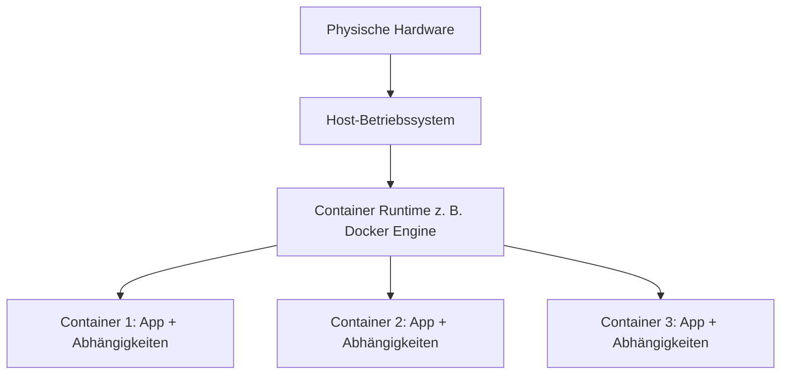
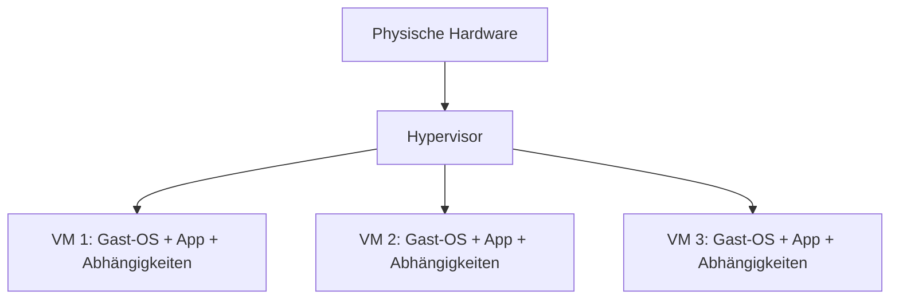
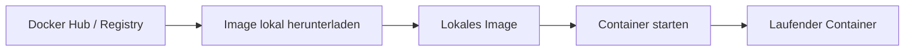
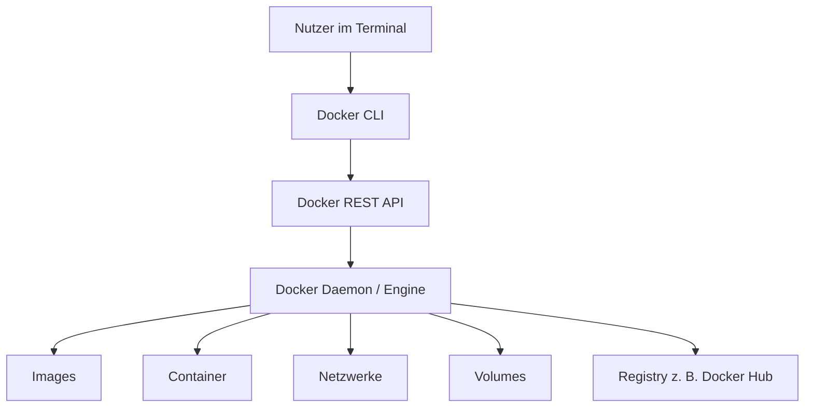

###### Themen

Einführung in Containerisierung

- Grundidee von Containern verstehen
- Unterschied zwischen Containern und virtuellen Maschinen kennenlernen
- Vorteile von Containern im Entwickleralltag einordnen
- Typische Einsatzgebiete von Containern kennenlernen

Docker Installation und Einrichtung

- Docker installieren
- Erfolgreiche Installation mit einfachen Befehlen überprüfen

Grundlagen von Docker

- Images, Container und Docker Hub grundlegend verstehen
- Aufbau und Zweck von Docker im Überblick kennenlernen

<br><br><br>
# 📦 Einführung in die Containerisierung

Containerisierung ist eine Methode, Software **so zu verpacken, dass sie überall möglichst gleich läuft**. In einem Container stecken typischerweise:

- die Anwendung selbst
- ihre Laufzeitumgebung
- notwendige Bibliotheken
- Konfigurationsdateien
- oft auch Abhängigkeiten wie bestimmte Tools oder Pakete

Die Grundidee ist also: **Nicht nur den Code verschicken, sondern gleich die passende Umgebung mitliefern**. Genau deshalb sind Container im Entwickleralltag so beliebt. Docker beschreibt Container als standardisierte Einheiten von Software, die Code und Abhängigkeiten zusammenfassen, damit Anwendungen schnell und zuverlässig in unterschiedlichen Umgebungen laufen ([Docker Overview](https://docs.docker.com/get-started/docker-overview/)).

Ein ganz wichtiger Gedanke dabei ist: Ein Container ist **leichter** als eine komplette virtuelle Maschine. Er bringt normalerweise **nicht ein komplettes eigenes Betriebssystem** mit, sondern nutzt den Kernel des Host-Systems mit. Dadurch starten Container meist sehr schnell und verbrauchen deutlich weniger Ressourcen als klassische VMs ([Docker Overview](https://docs.docker.com/get-started/docker-overview/)).

Wenn du dir Container merken willst, dann hilft dieses Bild:

> **Ein Container ist wie eine transportable, standardisierte Laufzeitbox für eine Anwendung.**

So eine Box kannst du lokal auf deinem Laptop bauen, in einer Testumgebung starten und später fast identisch auf einem Server oder in der Cloud betreiben. Das reduziert den berühmten Satz: **„Aber bei mir funktioniert es doch!“**


<br><br><br>
## 🧠 Die Grundidee von Containern einfach erklärt

Stell dir vor, du entwickelst eine Webanwendung in Python oder Node.js. Lokal funktioniert alles wunderbar. Auf dem Server treten plötzlich Fehler auf, weil:

- eine andere Versionsnummer installiert ist
- ein Paket fehlt
- Umgebungsvariablen anders gesetzt sind
- Systembibliotheken nicht übereinstimmen

Container lösen genau dieses Problem, indem sie eine **definierte, reproduzierbare Umgebung** schaffen. Statt nur den Quellcode weiterzugeben, baust du ein sogenanntes **Image**. Dieses Image ist eine Art Bauplan oder Vorlage. Aus diesem Image können dann Container gestartet werden.

Wichtig ist: Ein Container ist **kein magischer Mini-Computer**, sondern ein isolierter Prozess auf dem Host-System. Diese Isolation wird im Linux-Umfeld vor allem durch Kernel-Mechanismen wie **Namespaces** und **Control Groups (cgroups)** ermöglicht. Namespaces trennen Dinge wie Prozesse, Netzwerk oder Dateisystem voneinander, cgroups helfen dabei, Ressourcen wie CPU und RAM zu begrenzen ([Docker Engine Security](https://docs.docker.com/engine/security/), [Red Hat: A practical introduction to Linux namespaces](https://www.redhat.com/en/blog/intro-to-linux-namespaces)).

Das bedeutet praktisch:

- Prozesse im Container sehen oft nur „ihre eigene Welt“
- der Container bekommt sein eigenes Dateisystem-Umfeld
- Netzwerk kann isoliert eingerichtet werden
- Ressourcen können kontrolliert werden

Genau diese Kombination aus **Portabilität, Isolation und Reproduzierbarkeit** macht Container so nützlich.


<br><br><br>
## ⚖️ Unterschied zwischen Containern und virtuellen Maschinen

Container und virtuelle Maschinen lösen teilweise ähnliche Probleme, tun das aber auf unterschiedliche Weise.

Eine **virtuelle Maschine (VM)** virtualisiert in der Regel die komplette Hardware-Ebene. Darüber läuft dann ein vollständiges Gastbetriebssystem. Ein Hypervisor verwaltet diese virtuellen Maschinen. Microsoft beschreibt den Unterschied so, dass Container den Kernel des Host-Betriebssystems gemeinsam nutzen, während virtuelle Maschinen jeweils ein vollständiges Betriebssystem mitbringen ([Containers vs. virtual machines](https://learn.microsoft.com/en-us/virtualization/windowscontainers/about/containers-vs-vm)).

Ein **Container** virtualisiert nicht die gesamte Hardware, sondern eher die Ausführungsumgebung auf Betriebssystem-Ebene. Dadurch ist er kleiner und schneller startbereit.

### 📊 Vergleich in einer Tabelle

| Merkmal | Container | Virtuelle Maschine |
|---|---|---|
| Isolation | Prozess-/OS-Ebene | Hardware-/Hypervisor-Ebene |
| Betriebssystem | Nutzt meist den Host-Kernel mit | Eigenes vollständiges Gast-OS |
| Startzeit | Meist Sekunden oder weniger | Oft deutlich länger |
| Ressourcenverbrauch | Geringer | Höher |
| Portabilität | Sehr hoch bei passender Plattform | Ebenfalls möglich, aber schwergewichtiger |
| Typischer Einsatz | App-Deployment, Microservices, Dev/Test | Vollständige Systemisolation, Legacy-Systeme |

### 🖼️ Visuelle Vorstellung





### 🔍 Was ist der praktische Unterschied?

Wenn du nur eine Anwendung sauber und portabel ausführen willst, sind Container oft ideal. Wenn du jedoch eine **komplett getrennte Systemumgebung mit eigenem Kernel und voller OS-Isolation** brauchst, ist eine VM oft die passendere Wahl.

Man sollte also nicht denken:

> Container ersetzen immer virtuelle Maschinen.

Richtig ist eher:

> Container und VMs sind unterschiedliche Werkzeuge für unterschiedliche Anforderungen.

In modernen Systemen werden beide sogar oft kombiniert. Zum Beispiel laufen Container in der Cloud häufig **innerhalb von virtuellen Maschinen**, weil man so beides bekommt: gute Auslastung durch Container und zusätzliche Isolation durch VMs.


<br><br><br>
## 🚀 Vorteile von Containern im Entwickleralltag

Container sind nicht nur ein „Ops-Thema“ oder etwas für große Cloud-Plattformen. Gerade im Alltag von Entwicklerinnen und Entwicklern bringen sie sehr konkrete Vorteile.

### 🔁 Reproduzierbare Umgebungen

Wenn alle im Team denselben Container oder dasselbe Image verwenden, ist die Entwicklungsumgebung viel konsistenter. Das hilft enorm bei Onboarding, Fehlersuche und Testing. Docker betont genau diese Portabilität und Konsistenz als Kernvorteil ([Docker Overview](https://docs.docker.com/get-started/docker-overview/)).

Statt eine lange Anleitung zu schreiben wie:

- installiere Version X von Sprache Y
- aktiviere Paket Z
- ändere diese Systemvariable
- starte diesen Dienst separat

kann man oft einfach sagen:

> Starte den Container.

Das spart Zeit und reduziert Konfigurationsfehler.

### ⚡ Schnelle Startzeiten

Weil Container kein komplettes eigenes Betriebssystem booten müssen, starten sie typischerweise sehr schnell. Das ist besonders nützlich bei:

- lokalen Tests
- CI/CD-Pipelines
- temporären Entwicklungsumgebungen
- Skalierung in Produktionssystemen

### 🧩 Saubere Trennung von Diensten

Container fördern ein Denken in klar abgegrenzten Diensten. Zum Beispiel kannst du:

- die Web-App in einem Container laufen lassen
- die Datenbank in einem anderen Container
- einen Reverse Proxy in einem weiteren Container betreiben

Dadurch bleibt die Architektur sauberer und Änderungen werden einfacher nachvollziehbar.

### 🔄 Einfacheres Teilen und Deployen

Ein Image kann in eine Registry hochgeladen und später auf einem anderen Rechner oder Server wieder heruntergeladen werden. So entsteht ein klarer Übergang von Entwicklung zu Test und Produktion. Docker Hub ist ein bekanntes Beispiel für eine öffentliche Registry ([Docker Hub Quickstart](https://docs.docker.com/docker-hub/quickstart/)).

### 🧪 Bessere Testbarkeit

Tests werden zuverlässiger, wenn sie in einer definierten Umgebung laufen. Gerade Integrationstests profitieren davon, dass du benötigte Dienste wie Datenbanken oder Message Queues in Containern bereitstellen kannst.

### 🧹 Weniger „System-Müll“

Wenn du lokal viele Projekte mit verschiedenen Versionen von Node.js, Python, Java, PostgreSQL oder Redis brauchst, wird dein Rechner schnell unübersichtlich. Container helfen dabei, Abhängigkeiten pro Projekt zu kapseln, statt alles global zu installieren.

### 🧠 Lernhinweis: So solltest du Container gedanklich einordnen

Ein typischer Anfängerfehler ist, Container nur als „Installationsabkürzung“ zu sehen. Das greift zu kurz.

Die bessere Sichtweise ist:

- Container sind **standardisierte Laufzeitumgebungen**
- Images sind **portable Baupläne**
- Container machen Systeme **reproduzierbar**
- Docker ist **ein Werkzeug**, nicht das Konzept selbst

Dieser Unterschied ist wichtig, weil du sonst später Docker mit Containerisierung verwechselst.


<br><br><br>
## 🏗️ Typische Einsatzgebiete von Containern

Container sind heute in vielen Bereichen Standard. Die typischen Einsatzgebiete solltest du kennen, damit du verstehst, **warum** man sie überhaupt einsetzt.

### 🌐 Webanwendungen

Sehr häufig werden Webanwendungen containerisiert. Zum Beispiel:

- Frontend in einem Container
- Backend in einem Container
- Datenbank in einem Container
- Nginx oder Traefik als Reverse Proxy in einem Container

Das ist besonders praktisch in Entwicklung, Testing und Cloud-Deployment.

### 🧪 Entwicklungs- und Testumgebungen

Container sind ideal, um schnell konsistente Umgebungen für ein Projekt zu erzeugen. Wenn ein neues Teammitglied dazukommt, kann es die Umgebung oft in kurzer Zeit lokal starten, statt alles manuell aufzusetzen.

### 🔄 Continuous Integration und Continuous Deployment

Build- und Test-Jobs in CI/CD-Systemen laufen oft in Containern, weil dadurch sichergestellt wird, dass sie in einer klar definierten Umgebung ausgeführt werden. Docker hebt hervor, dass Container gut zu modernen Build-, Test- und Deployment-Prozessen passen ([Docker Overview](https://docs.docker.com/get-started/docker-overview/)).

### 🧩 Microservices

Container passen sehr gut zu Microservice-Architekturen. Jeder Dienst kann ein eigenes Image und seinen eigenen Container haben. Das erleichtert:

- unabhängige Entwicklung
- getrennte Skalierung
- klarere Verantwortlichkeiten
- isolierte Deployments

### ☁️ Cloud und Plattformbetrieb

Viele Cloud-native Plattformen basieren stark auf Containern. Kubernetes, Amazon ECS oder Azure Container Apps bauen auf dem Prinzip auf, containerisierte Anwendungen automatisiert zu betreiben. Kubernetes selbst beschreibt Container als leichtgewichtige und portable Einheiten für moderne Anwendungen ([Kubernetes Documentation: Containers](https://kubernetes.io/docs/concepts/containers/)).

### 🗃️ Temporäre Tools und Hilfsdienste

Auch Werkzeuge lassen sich praktisch als Container starten, zum Beispiel:

- Datenbank-Clients
- Build-Tools
- Scanner
- Testserver
- Admin-Tools

So musst du solche Werkzeuge nicht dauerhaft lokal installieren.


<br><br><br>
# 🐳 Docker: Installation und Einrichtung

Docker ist eines der bekanntesten Werkzeuge für die praktische Arbeit mit Containern. Wichtig ist aber: **Containerisierung ist das Konzept, Docker ist ein konkretes Tool dazu**. Docker stellt unter anderem Werkzeuge bereit, um Images zu bauen, Container zu starten und Registries wie Docker Hub zu nutzen ([Docker Overview](https://docs.docker.com/get-started/docker-overview/)).

Je nach Betriebssystem unterscheidet sich die Installation etwas.


<br><br><br>
## 💻 Docker installieren

### 🪟 Installation unter Windows

Unter Windows ist für die meisten Nutzer **Docker Desktop** der übliche Weg. Docker stellt dafür eine eigene Installationsanleitung bereit ([Install Docker Desktop on Windows](https://docs.docker.com/desktop/setup/install/windows-install/)).

Wichtige Punkte:

- Du lädst Docker Desktop von der offiziellen Docker-Seite herunter.
- Für viele Setups wird **WSL 2** empfohlen oder benötigt, weil Docker darauf effizient laufen kann ([Install Docker Desktop on Windows](https://docs.docker.com/desktop/setup/install/windows-install/)).
- Nach der Installation meldest du dich optional mit einem Docker-Konto an, zwingend nötig ist das lokal nicht immer.

Gerade auf Windows ist wichtig zu verstehen: Docker-Container basieren oft auf Linux-Technologien. Deshalb nutzt Docker dort in vielen Fällen eine Linux-basierte Laufzeitumgebung im Hintergrund.

### 🍎 Installation unter macOS

Auch auf macOS ist **Docker Desktop** der Standardweg. Die offizielle Anleitung hängt leicht davon ab, ob du einen Intel-Mac oder Apple Silicon verwendest ([Install Docker Desktop on Mac](https://docs.docker.com/desktop/setup/install/mac-install/)).

Achte dabei auf:

- die richtige Download-Version für deinen Mac
- die Freigabe der notwendigen Systemrechte
- einen erfolgreichen Start der Docker Desktop App

### 🐧 Installation unter Linux

Unter Linux kann man entweder Docker Desktop oder direkt die **Docker Engine** installieren. In vielen Lern- und Server-Szenarien ist die Docker Engine der klassische Weg. Docker bietet distributionsspezifische Anleitungen, etwa für Ubuntu ([Install Docker Engine on Ubuntu](https://docs.docker.com/engine/install/ubuntu/)).

Typischer Ablauf auf Ubuntu:

1. Paketquellen vorbereiten
2. Docker-Repository hinzufügen
3. Docker Engine installieren
4. Dienst starten
5. Installation testen

Unter Linux solltest du außerdem wissen: Wer Docker ohne `sudo` verwenden will, fügt den eigenen Benutzer oft der Gruppe `docker` hinzu. Docker dokumentiert diesen Schritt in der Post-Installation ([Linux post-installation steps for Docker Engine](https://docs.docker.com/engine/install/linux-postinstall/)).

### ⚠️ Wichtiger Sicherheitsgedanke

Die `docker`-Gruppe hat auf vielen Linux-Systemen weitreichende Rechte. Docker weist selbst darauf hin, dass die Gruppe Root-ähnliche Privilegien bedeuten kann ([Docker Daemon Attack Surface](https://docs.docker.com/engine/security/#docker-daemon-attack-surface)). Das ist wichtig, damit du nicht gedankenlos Berechtigungen vergibst.


<br><br><br>
## ✅ Erfolgreiche Installation mit einfachen Befehlen überprüfen

Nach der Installation solltest du nicht einfach hoffen, dass alles funktioniert. Prüfe die Installation bewusst und systematisch.

### 🔎 1. Docker-Version anzeigen

```bash
docker --version
```

Damit prüfst du, ob der Docker-Client grundsätzlich verfügbar ist.

Oft bekommst du eine Ausgabe wie:

```bash
Docker version 26.x.x, build ...
```

Das sagt dir: Das Kommando wurde gefunden und Docker ist installiert.

### 🔎 2. Detaillierte Informationen abrufen

```bash
docker info
```

Dieser Befehl zeigt mehr Details, zum Beispiel:

- Client-Informationen
- Server-Informationen
- Anzahl der Images und Container
- Storage Driver
- Laufzeitdetails

Wenn hier sinnvolle Informationen erscheinen, läuft die Docker-Engine normalerweise korrekt.

### 🔎 3. Test-Container starten

```bash
docker run hello-world
```

Das ist der klassische erste Test. Docker beschreibt dieses Beispiel selbst als einfache Möglichkeit, die Installation zu prüfen ([Docker Hello-World](https://docs.docker.com/get-started/introduction/get-docker-desktop/)).

Was passiert dabei grundsätzlich?

1. Docker sucht lokal nach dem Image `hello-world`
2. Falls es nicht vorhanden ist, wird es aus einer Registry geladen
3. Daraus wird ein Container gestartet
4. Der Container gibt eine Testnachricht aus und beendet sich

Wenn das funktioniert, ist das ein starkes Zeichen dafür, dass:

- Docker Images laden kann
- Container erstellt werden können
- die Laufzeit funktioniert

### 🧭 Typische Kontrollbefehle

```bash
docker images
docker ps
docker ps -a
```

- `docker images` zeigt lokale Images
- `docker ps` zeigt laufende Container
- `docker ps -a` zeigt auch bereits beendete Container

Gerade nach `docker run hello-world` ist `docker ps -a` nützlich, weil der Testcontainer sich direkt wieder beendet.

### 📌 Wie du die Befehle inhaltlich verstehen solltest

Es reicht nicht, die Befehle nur „auswendig“ zu kennen. Wichtiger ist das mentale Modell:

- `docker run` = aus einem Image einen Container starten
- `docker ps` = Container ansehen
- `docker images` = vorhandene Baupläne ansehen

Wenn du dieses Modell sauber verstehst, lernst du Docker später viel leichter.


<br><br><br>
# 🧱 Grundlagen von Docker

Docker besteht nicht nur aus einem einzelnen Befehl, sondern aus mehreren Bausteinen, die zusammenarbeiten. Für den Einstieg sind vor allem diese Begriffe zentral:

- **Image**
- **Container**
- **Registry / Docker Hub**
- **Docker Engine**
- **Docker CLI**

Wenn du diese Begriffe durcheinanderbringst, wird Docker schnell verwirrend. Wenn du sie sauber trennst, wird vieles plötzlich logisch.


<br><br><br>
## 🖼️ Images, Container und Docker Hub grundlegend verstehen

### 🧾 Was ist ein Image?

Ein **Image** ist eine schreibgeschützte Vorlage, aus der Container erstellt werden. Docker beschreibt Images als read-only templates mit Anweisungen zum Erstellen eines Containers ([Docker Overview](https://docs.docker.com/get-started/docker-overview/)).

Ein Image enthält typischerweise:

- eine Basisumgebung, zum Beispiel `ubuntu` oder `node`
- installierte Pakete
- Anwendungscode
- Konfiguration
- Startbefehl

Ein Image ist also nicht „die laufende Anwendung“, sondern eher der **Bauplan** oder die **eingefrorene Vorlage**.

Du kannst dir ein Image wie ein vorbereitetes Dateisystem plus Metadaten vorstellen.

### ▶️ Was ist ein Container?

Ein **Container** ist eine laufende oder startbare Instanz eines Images. Docker formuliert es sinngemäß so: Ein Container ist eine ausführbare Instanz eines Images ([Docker Overview](https://docs.docker.com/get-started/docker-overview/)).

Wichtige Eigenschaft:

- Ein Image ist die Vorlage
- Ein Container ist die konkrete Ausführung dieser Vorlage

Das ist ein ganz zentraler Unterschied.

### 🍪 Ein einfaches Alltagsbild

Man kann sich das so merken:

- **Image** = Backform + Rezept + vorbereiteter Teig
- **Container** = der tatsächlich gebackene Kuchen auf dem Tisch

Oder technischer:

- **Image** = Snapshot / Bauplan
- **Container** = laufender Prozess auf Basis dieses Bauplans

### 🌍 Was ist Docker Hub?

**Docker Hub** ist eine öffentliche Registry von Docker, also ein Ort, an dem Images gespeichert und verteilt werden können. Docker beschreibt Docker Hub als Service zum Finden und Teilen von Container-Images ([Docker Hub Quickstart](https://docs.docker.com/docker-hub/quickstart/)).

Dort findest du:

- offizielle Basis-Images
- Community-Images
- Images von Unternehmen
- eigene private oder öffentliche Repositories

Wenn du zum Beispiel `docker run nginx` ausführst und das Image lokal nicht existiert, versucht Docker typischerweise, es aus einer Registry wie Docker Hub zu laden.

### 🔁 Zusammenspiel von Image, Container und Docker Hub



### 🧠 Typischer Denkfehler von Anfängern

Viele sagen am Anfang Dinge wie:

> „Ich habe einen Docker gestartet.“

Sauberer wäre:

> „Ich habe einen Container gestartet.“

Oder:

> „Ich habe ein Image gebaut.“

Diese sprachliche Genauigkeit klingt klein, ist aber fachlich extrem hilfreich. Wer die Begriffe sauber verwendet, versteht die Technik meist deutlich schneller.


<br><br><br>
## ⚙️ Aufbau und Zweck von Docker im Überblick

Docker besteht im Kern aus mehreren Teilen, die unterschiedliche Aufgaben haben.

### 🖥️ Docker CLI

Die **Docker CLI** ist das Kommandozeilenwerkzeug, also das, was du im Terminal verwendest, zum Beispiel:

```bash
docker run
docker build
docker ps
docker pull
```

Die CLI ist die Schicht, mit der du als Nutzer direkt interagierst.

### 🏭 Docker Engine

Die **Docker Engine** ist die eigentliche Laufzeitkomponente. Sie erstellt und verwaltet Images, Container, Netzwerke und Volumes. Docker beschreibt die Engine als Client-Server-Anwendung mit einem Daemon, einer REST API und der CLI ([Docker Engine overview](https://docs.docker.com/engine/)).

### 🔌 Docker Daemon

Der **Daemon** ist der Hintergrunddienst, der die eigentliche Arbeit macht. Wenn du einen Docker-Befehl eingibst, spricht die CLI mit dem Docker Daemon, und dieser setzt die Aktion um.

### 🗂️ Registry

Eine **Registry** ist ein Speicherort für Images. Docker Hub ist die bekannteste Registry, aber nicht die einzige. Unternehmen verwenden oft auch private Registries.

### 💾 Volumes und Netzwerke

Auch wenn du sie erst später intensiv brauchst, solltest du sie schon einmal gehört haben:

- **Volumes** speichern Daten dauerhaft außerhalb des flüchtigen Container-Dateisystems ([Docker Volumes](https://docs.docker.com/engine/storage/volumes/))
- **Netzwerke** verbinden Container untereinander oder mit der Außenwelt ([Networking overview](https://docs.docker.com/engine/network/))

### 🧱 Architektur als Grafik



### 🎯 Wozu dient Docker insgesamt?

Der Zweck von Docker ist nicht einfach nur „Container starten“. Docker dient vor allem dazu, den gesamten Lebenszyklus containerisierter Anwendungen handhabbar zu machen:

- Images erstellen
- Images versionieren
- Images verteilen
- Container starten und stoppen
- Daten und Netzwerke verwalten
- Anwendungen reproduzierbar ausrollen

Darum ist Docker im Kern ein **Werkzeug zur Standardisierung von Build-, Versand- und Laufzeitprozessen** rund um Container.

Das erklärt auch, warum Docker im Entwickleralltag so stark mit Themen wie DevOps, CI/CD, Microservices und Cloud verbunden ist.


<br><br><br>
## 🧭 Ein sauberes mentales Modell für den Einstieg

Wenn du Containerisierung und Docker wirklich verstehen willst, dann merke dir diese Reihenfolge:

### 1️⃣ Erst das Problem verstehen

Das eigentliche Problem ist:

- unterschiedliche Umgebungen
- schwer reproduzierbare Setups
- komplizierte Abhängigkeiten
- inkonsistente Deployments

### 2️⃣ Dann das Konzept verstehen

Das Konzept ist:

- Anwendungen in standardisierte, isolierte Einheiten verpacken
- dieselben Einheiten in verschiedenen Umgebungen verwenden

### 3️⃣ Dann das Werkzeug verstehen

Docker ist ein Werkzeug, das genau dieses Konzept praktisch nutzbar macht.

### 4️⃣ Dann erst Befehle lernen

Viele lernen Docker falsch herum:

- zuerst 20 Befehle auswendig
- dann irgendwie `docker run`
- dann später Verwirrung

Besser ist:

- Problem verstehen
- Begriffe sauber trennen
- Architektur grob verstehen
- dann Befehle lernen

So lernst du nachhaltiger und nicht nur oberflächlich.

Gerade bei Core Tech Fundamentals ist das entscheidend: Du willst nicht nur wissen, **welcher Befehl** funktioniert, sondern **warum** das System so aufgebaut ist.


<br><br><br>
## 🧪 Ein erster Mini-Ablauf zum Verständnis

Damit die Begriffe nicht abstrakt bleiben, hier ein einfacher Denkablauf:

```bash
docker run nginx
```

Was passiert dabei grob?

1. Docker prüft, ob das Image `nginx` lokal vorhanden ist.
2. Falls nicht, wird es aus einer Registry geladen, oft aus Docker Hub.
3. Docker erstellt auf Basis des Images einen Container.
4. Der Container startet den definierten Hauptprozess.
5. Solange dieser Hauptprozess läuft, gilt der Container als laufend.

Daran kannst du die Grundlogik sehr gut sehen:

- **Registry** liefert Images
- **Image** ist die Vorlage
- **Container** ist die Instanz
- **Docker Engine** führt alles aus

Genau dieses Modell taucht später immer wieder auf, auch bei komplexeren Themen wie Dockerfiles, Compose oder Kubernetes.


<br><br><br>
## 📘 Warum dieses Thema so wichtig ist

Containerisierung ist heute ein Grundbaustein moderner Softwareentwicklung. Selbst wenn du später nicht täglich Docker-Befehle eintippst, begegnet dir das Thema fast überall:

- in Entwicklungsumgebungen
- in Deployment-Pipelines
- in Cloud-Plattformen
- bei Microservices
- in Plattform- und Infrastrukturteams

Deshalb lohnt es sich, die Grundlagen wirklich sauber zu lernen. Nicht als Sammlung von Terminalbefehlen, sondern als technisches Modell dafür, **wie Software portabel, konsistent und effizient betrieben werden kann**.