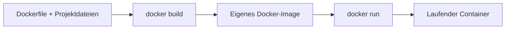
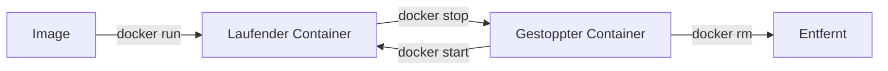
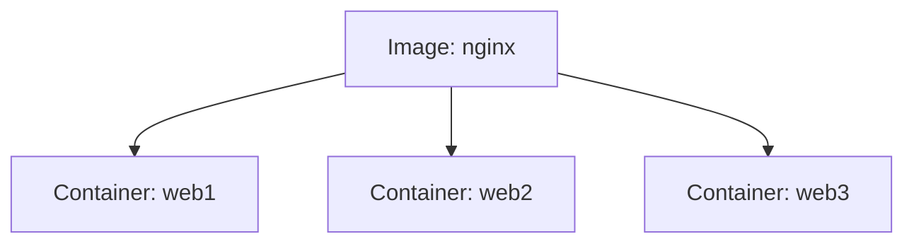

###### Themen

Arbeiten mit Docker

- Grundlegende Bedienung von Docker über die Kommandozeile
- Vorhandene Images und Container anzeigen

Arbeiten mit Docker Images

- Images aus Docker Hub herunterladen und verwenden
- Den Zweck eines Dockerfiles grundlegend verstehen
- Ein einfaches Dockerfile kennenlernen

Container Management

- Container starten, stoppen und entfernen
- In einen laufenden Container hineinsehen und einfache Befehle ausführen
- Unterschied zwischen Image und laufendem Container festigen

<br><br><br>

# 🐳 Arbeiten mit Docker

Docker wirkt am Anfang oft wie „noch ein Tool mit vielen Befehlen“. In Wirklichkeit ist die Grundidee aber sehr klar: Du hast **Images** als Vorlage und **Container** als laufende Instanz dieser Vorlage. Genau dieses Denkmodell ist der Schlüssel, damit sich die Kommandozeile nicht wie auswendig gelernte Magie anfühlt.

Ein **Docker-Image** ist eine unveränderliche Vorlage, aus der Container erzeugt werden. Ein **Container** ist der tatsächlich gestartete Prozess mit seiner eigenen isolierten Laufzeitumgebung ([Images](https://docs.docker.com/get-started/docker-concepts/the-basics/what-is-an-image/)) ([Containers](https://docs.docker.com/get-started/docker-concepts/the-basics/what-is-a-container/)).

Damit du Docker sauber lernst, ist diese Denkweise hilfreich:

- **Image = Bauplan**
- **Container = gestartetes Exemplar**
- **Dockerfile = Rezept zum Erzeugen eines Images**
- **Docker Hub = Ort, von dem du fertige Images holen kannst**

Eine gute Lernstrategie bei Docker ist: **erst das Modell verstehen, dann die Befehle lernen**. Wenn du sofort nur Kommandos auswendig lernst, verwechselst du später fast immer Image, Container und Dockerfile.

<br><br><br>

## 🧭 Grundlegende Bedienung von Docker über die Kommandozeile

Die Docker-Kommandozeile ist ziemlich logisch aufgebaut. Viele Befehle folgen diesem Muster:

```bash
docker <objekt> <aktion>
```

Typische Objekte sind zum Beispiel:

- `image`
- `container`
- `volume`
- `network`

Für den Einstieg sind aber vor allem **image** und **container** wichtig.

Ein paar typische Beispiele:

```bash
docker image ls
docker container ls
docker container stop mein-container
docker image pull nginx
```

Du kannst dir Docker also wie eine kleine Sprache vorstellen:

- **Was** willst du ansprechen? → `image`, `container`
- **Was** willst du damit tun? → `ls`, `pull`, `run`, `stop`, `rm`

Das ist deutlich besser lernbar als eine völlig ungeordnete Liste von Einzelbefehlen.

Wenn du zuerst prüfen willst, ob Docker überhaupt sauber installiert ist, helfen diese Befehle:

```bash
docker --version
docker info
docker help
```

`docker --version` zeigt dir die installierte Version an.  
`docker info` gibt dir technische Informationen über deine Docker-Umgebung.  
`docker help` zeigt dir die allgemeine Hilfeseite mit verfügbaren Unterbefehlen ([docker](https://docs.docker.com/reference/cli/docker/)).

<br><br><br>

### 🔤 Wie du Docker-Befehle lesen solltest

Nehmen wir diesen Befehl:

```bash
docker container ls
```

Den kannst du fast wie einen Satz lesen:

- `docker` → ich spreche Docker an
- `container` → ich arbeite mit Containern
- `ls` → ich will eine Liste sehen

Genauso hier:

```bash
docker image pull nginx
```

Das bedeutet:

- `docker` → Docker
- `image` → ich arbeite mit Images
- `pull` → ich lade etwas herunter
- `nginx` → und zwar das Image `nginx`

Wenn du dir diese Lesart angewöhnst, wird Docker viel verständlicher.

<br><br><br>

### 🛠️ Sehr wichtige Grundbefehle für den Start

| Befehl | Bedeutung |
|---|---|
| `docker --version` | Zeigt die Docker-Version |
| `docker help` | Zeigt Hilfe zu Docker |
| `docker image ls` | Zeigt lokale Images |
| `docker container ls` | Zeigt laufende Container |
| `docker container ls -a` | Zeigt auch gestoppte Container |
| `docker image pull <name>` | Lädt ein Image herunter |
| `docker container run <image>` | Erstellt und startet einen Container |
| `docker container stop <name>` | Stoppt einen Container |
| `docker container start <name>` | Startet einen gestoppten Container |
| `docker container rm <name>` | Entfernt einen Container |

Ein wichtiger Punkt: In vielen Tutorials findest du noch Kurzformen wie `docker ps` oder `docker images`. Diese funktionieren weiterhin, aber die modernere und klarere Schreibweise ist `docker container ls` bzw. `docker image ls` ([docker container ls](https://docs.docker.com/reference/cli/docker/container/ls/)) ([docker image ls](https://docs.docker.com/reference/cli/docker/image/ls/)).

<br><br><br>

## 👀 Vorhandene Images und Container anzeigen

Bevor du Container sinnvoll verwalten kannst, musst du immer wissen: **Was liegt lokal schon vor?** und **was läuft gerade?**

Für lokale Images verwendest du:

```bash
docker image ls
```

Dieser Befehl listet die Images auf, die auf deinem System gespeichert sind ([docker image ls](https://docs.docker.com/reference/cli/docker/image/ls/)).

Eine typische Ausgabe enthält Spalten wie:

- `REPOSITORY`
- `TAG`
- `IMAGE ID`
- `CREATED`
- `SIZE`

Beispiel:

```bash
REPOSITORY   TAG       IMAGE ID       CREATED         SIZE
nginx        latest    abc123def456   2 weeks ago     192MB
alpine       latest    fed456abc789   3 weeks ago     7MB
```

Das bedeutet:

- **REPOSITORY**: Name des Images, z. B. `nginx`
- **TAG**: Version oder Variante, z. B. `latest`
- **IMAGE ID**: interne Kennung
- **SIZE**: Größe des Images

Für laufende Container verwendest du:

```bash
docker container ls
```

Damit siehst du nur Container, die gerade wirklich laufen ([docker container ls](https://docs.docker.com/reference/cli/docker/container/ls/)).

Wenn du **auch gestoppte Container** sehen willst, nimmst du:

```bash
docker container ls -a
```

Das `-a` steht für „all“, also alle.

<br><br><br>

### 📦 Der praktische Unterschied zwischen `image ls` und `container ls`

Viele Einsteiger verwechseln diese beiden Listen. Das ist völlig normal.

| Frage | Passender Befehl |
|---|---|
| Welche Vorlagen habe ich lokal gespeichert? | `docker image ls` |
| Welche Container laufen gerade? | `docker container ls` |
| Welche Container existieren insgesamt, auch gestoppte? | `docker container ls -a` |

Ein Beispiel macht es klar:

- Du lädst das Image `nginx` herunter.
- Danach taucht `nginx` bei `docker image ls` auf.
- Erst wenn du daraus einen Container startest, erscheint etwas bei `docker container ls`.

Ein Image allein „läuft“ also nicht. Es ist erst einmal nur die Grundlage.

<br><br><br>

### 🔎 Beispiel: Was sehe ich wann?

Angenommen, du führst nacheinander diese Befehle aus:

```bash
docker image pull nginx
docker container run --name webserver -d nginx
```

Dann gilt:

- `docker image ls` zeigt dir `nginx`
- `docker container ls` zeigt dir `webserver`
- `docker container ls -a` zeigt dir ebenfalls `webserver`

Wenn du den Container stoppst:

```bash
docker container stop webserver
```

Dann gilt:

- `docker image ls` zeigt weiterhin `nginx`
- `docker container ls` zeigt `webserver` **nicht mehr**
- `docker container ls -a` zeigt `webserver` **weiterhin**, aber als gestoppt

Genau an diesem Punkt verstehen viele zum ersten Mal sauber den Unterschied zwischen **Vorlage** und **Instanz**.

<br><br><br>

# 🖼️ Arbeiten mit Docker-Images

Ein Docker-Image ist das Herzstück der Arbeit mit Docker. Es enthält alles, was eine Anwendung zum Start braucht: zum Beispiel ein Dateisystem, Bibliotheken, Laufzeitumgebungen und Standardbefehle ([Images](https://docs.docker.com/get-started/docker-concepts/the-basics/what-is-an-image/)).

Wichtig ist: Ein Image ist **nicht die App in Aktion**, sondern die vorbereitete Grundlage dafür.

<br><br><br>

## ⬇️ Images aus Docker Hub herunterladen und verwenden

Wenn du ein fertiges Image nutzen willst, lädst du es normalerweise mit `docker image pull` herunter:

```bash
docker image pull nginx
```

Damit wird das Image `nginx` aus einer Registry heruntergeladen. Dieser Befehl ist der Standardweg, um Images lokal verfügbar zu machen ([docker image pull](https://docs.docker.com/reference/cli/docker/image/pull/)).

Du kannst danach prüfen, ob das Image angekommen ist:

```bash
docker image ls
```

Wenn du das Image dann wirklich verwenden willst, startest du daraus einen Container:

```bash
docker container run nginx
```

Der Befehl `docker container run` erstellt einen neuen Container aus einem Image und startet ihn anschließend ([docker container run](https://docs.docker.com/reference/cli/docker/container/run/)).

In der Praxis nutzt man oft zusätzliche Optionen:

```bash
docker container run --name webserver -d -p 8080:80 nginx
```

Diese Optionen sind extrem wichtig:

- `--name webserver` → gibt dem Container einen gut merkbaren Namen
- `-d` → startet den Container im Hintergrund („detached mode“)
- `-p 8080:80` → verbindet Port 8080 auf deinem Rechner mit Port 80 im Container

Gerade `-p` ist wichtig, wenn du Webanwendungen oder APIs testen willst.

Wenn du also einen Nginx-Webserver startest, ist er danach meist über `http://localhost:8080` erreichbar, weil Port 8080 auf deinem Rechner an Port 80 im Container weitergeleitet wird ([Publishing and exposing ports](https://docs.docker.com/get-started/docker-concepts/running-containers/publishing-ports/)).

<br><br><br>

### 🏷️ Was Tags wie `latest` bedeuten

Oft siehst du Images in dieser Form:

```bash
nginx:latest
python:3.12
node:20-alpine
```

Der Teil nach dem Doppelpunkt ist der **Tag**. Er bezeichnet meist eine Version oder Variante.

Beispiele:

- `nginx:latest` → die aktuell als Standard markierte Version
- `python:3.12` → Python 3.12
- `node:20-alpine` → Node.js 20 auf Basis eines kleinen Alpine-Images

Ein sehr wichtiger Lernpunkt: **`latest` bedeutet nicht automatisch „neueste technisch existierende Version“, sondern nur den Tag `latest`**. Für reproduzierbares Arbeiten ist es oft besser, konkrete Versionen zu verwenden, z. B. `python:3.12` statt nur `python:latest` ([docker image pull](https://docs.docker.com/reference/cli/docker/image/pull/)).

<br><br><br>

### 🌐 Typischer Ablauf beim Verwenden eines fertigen Images

So läuft es meistens ab:

```bash
docker image pull nginx
docker container run --name webserver -d -p 8080:80 nginx
docker container ls
```

Das ist didaktisch ein sehr guter Minimalablauf:

1. **Image holen**
2. **Container daraus starten**
3. **Prüfen, ob er läuft**

Wenn du richtig lernen willst, solltest du genau diese Reihenfolge verinnerlichen. Sonst fühlt sich `docker run` später wie ein Zauberbefehl an, obwohl er logisch auf einem vorhandenen Image basiert.

<br><br><br>

## 📜 Den Zweck eines Dockerfiles grundlegend verstehen

Ein **Dockerfile** ist eine Textdatei mit Anweisungen, aus denen Docker ein Image baut ([Dockerfile reference](https://docs.docker.com/reference/dockerfile/)).

Das Wichtigste in einem Satz:

**Ein Dockerfile beschreibt, wie ein eigenes Image erzeugt werden soll.**

Wenn du also nicht nur fertige Images aus Docker Hub verwenden willst, sondern selbst bestimmen möchtest,

- welche Basis verwendet wird,
- welche Dateien ins Image kommen,
- welche Pakete installiert werden,
- welcher Startbefehl ausgeführt wird,

dann brauchst du ein Dockerfile.

Du kannst dir ein Dockerfile wie ein **Rezept** vorstellen:

- `FROM` → welche Basis nehme ich?
- `COPY` → welche Dateien lege ich hinein?
- `RUN` → was soll beim Bauen installiert oder vorbereitet werden?
- `CMD` → was soll standardmäßig beim Start passieren?

Das Dockerfile erzeugt selbst noch keinen Container. Es erzeugt erst einmal ein **Image**. Danach kannst du aus diesem Image wieder Container starten.

Das ist ein ganz zentraler Denkpunkt:

- **Dockerfile** → beschreibt den Bau
- **Image** → Ergebnis des Baus
- **Container** → gestartete Instanz des Ergebnisses

<br><br><br>



<br><br><br>

## 🧱 Ein einfaches Dockerfile kennenlernen

Ein sehr einfaches Beispiel ist ein kleines Webserver-Image auf Basis von Nginx:

```dockerfile
FROM nginx:alpine
COPY index.html /usr/share/nginx/html/index.html
```

Dieses Dockerfile ist bewusst minimal, aber sehr lehrreich.

Schauen wir es sauber an.

<br><br><br>

### 🪜 Zeile für Zeile erklärt

```dockerfile
FROM nginx:alpine
```

Mit `FROM` legst du das Basis-Image fest. Hier nimmst du ein schlankes Nginx-Image auf Alpine-Basis. Jede eigene Image-Erstellung beginnt normalerweise mit `FROM` ([Dockerfile reference](https://docs.docker.com/reference/dockerfile/)).

```dockerfile
COPY index.html /usr/share/nginx/html/index.html
```

Mit `COPY` kopierst du eine Datei von deinem Projektordner in das Image. In diesem Fall wird deine lokale `index.html` in das Webverzeichnis von Nginx gelegt. Dadurch liefert der Webserver später deine eigene HTML-Datei aus ([Dockerfile reference](https://docs.docker.com/reference/dockerfile/)).

Das bedeutet praktisch: Du nimmst einen fertigen Webserver und ersetzt nur den Inhalt, den er ausliefern soll.

<br><br><br>

### 🏗️ Wie daraus ein Image wird

Angenommen, in deinem Ordner liegen diese Dateien:

```bash
Dockerfile
index.html
```

Dann baust du daraus ein eigenes Image so:

```bash
docker build -t meine-webseite:1.0 .
```

Dabei bedeutet:

- `docker build` → baue ein Image
- `-t meine-webseite:1.0` → gib dem Image einen Namen und Tag
- `.` → nutze den aktuellen Ordner als Build-Kontext

Das Bauen von Images mit `docker build` auf Basis eines Dockerfiles ist der Standardweg, um eigene Images zu erstellen ([docker build](https://docs.docker.com/reference/cli/docker/buildx/build/)).

Danach kannst du das neue Image sehen:

```bash
docker image ls
```

Und anschließend starten:

```bash
docker container run --name meine-seite -d -p 8080:80 meine-webseite:1.0
```

Jetzt läuft dein eigener Container, aber auf Basis deines selbst gebauten Images.

<br><br><br>

### 🧠 Warum Dockerfiles so wichtig sind

Gerade im Bereich Core Tech Fundamentals ist das Dockerfile wichtig, weil es **Reproduzierbarkeit** bringt.

Ohne Dockerfile arbeitest du oft „per Hand“:

- irgendwo Pakete installieren,
- Dateien kopieren,
- Startbefehle ausprobieren,
- hoffen, dass es später genauso wieder funktioniert.

Mit Dockerfile beschreibst du alles klar und wiederholbar in Textform. Das ist einer der wichtigsten Grundgedanken moderner Infrastruktur und Entwicklungsumgebungen.

Ein Teammitglied kann mit demselben Dockerfile sehr viel eher dasselbe Image bauen wie du, weil die Schritte dokumentiert sind ([Dockerfile reference](https://docs.docker.com/reference/dockerfile/)).

<br><br><br>

# 🧰 Container-Verwaltung

Sobald du Images verstanden hast, beginnt die eigentliche Alltagsarbeit mit Containern. Container werden gestartet, gestoppt, erneut gestartet, untersucht und wieder entfernt.

Wichtig ist dabei: Ein Container ist **vergänglicher** als ein Image. Er ist eher eine laufende Arbeitsinstanz als ein dauerhaftes Bauartefakt.

<br><br><br>

## ▶️ Container starten, stoppen und entfernen

Ein neuer Container wird mit `docker container run` erzeugt und gestartet:

```bash
docker container run --name webserver -d -p 8080:80 nginx
```

Wie schon oben gesagt:

- `run` erstellt einen **neuen** Container
- dieser wird direkt gestartet
- `--name` gibt ihm einen Namen
- `-d` startet ihn im Hintergrund
- `-p` veröffentlicht einen Port ([docker container run](https://docs.docker.com/reference/cli/docker/container/run/))

Wenn du einen laufenden Container anhalten willst:

```bash
docker container stop webserver
```

Dieser Befehl stoppt einen oder mehrere laufende Container ([docker container stop](https://docs.docker.com/reference/cli/docker/container/stop/)).

Wenn du denselben gestoppten Container später wieder starten willst:

```bash
docker container start webserver
```

`start` startet einen vorhandenen, zuvor gestoppten Container erneut ([docker container start](https://docs.docker.com/reference/cli/docker/container/start/)).

Wenn du den Container komplett entfernen willst:

```bash
docker container rm webserver
```

Damit wird ein Container gelöscht. Standardmäßig muss er dafür gestoppt sein ([docker container rm](https://docs.docker.com/reference/cli/docker/container/rm/)).

Ein typischer Lebenszyklus sieht also so aus:

```bash
docker container run --name demo -d nginx
docker container stop demo
docker container start demo
docker container stop demo
docker container rm demo
```

<br><br><br>



<br><br><br>

### 🧾 Der Unterschied zwischen `run` und `start`

Das ist einer der häufigsten Stolpersteine.

`docker container run` bedeutet:

- falls nötig: Image verwenden
- **neuen** Container erzeugen
- diesen Container starten

`docker container start` bedeutet:

- einen **bereits existierenden** Container wieder starten

Einfach gesagt:

- **`run` = neu anlegen + starten**
- **`start` = vorhandenen Container wieder einschalten**

Wenn du also denselben Container weiterverwenden willst, nimm `start`. Wenn du eine neue Instanz brauchst, nimm `run`.

<br><br><br>

### 🗑️ Was beim Entfernen wichtig ist

Wenn du einen Container mit `docker container rm` entfernst, löschst du **nicht automatisch das zugrunde liegende Image**. Das Image bleibt normalerweise lokal vorhanden.

Das ist wichtig, weil viele Anfänger denken: „Ich habe den Container gelöscht, also ist alles weg.“ Nein:

- **Container gelöscht** → laufende bzw. gestoppte Instanz weg
- **Image bleibt** → Vorlage ist weiterhin da

Deshalb kannst du später oft wieder sofort einen neuen Container aus demselben Image starten, ohne das Image neu herunterladen zu müssen.

<br><br><br>

## 🔍 In einen laufenden Container hineinsehen und einfache Befehle ausführen

Ein Container ist keine Blackbox. Du kannst in einen laufenden Container hineingehen und darin Befehle ausführen.

Der wichtigste Befehl dafür ist:

```bash
docker container exec -it webserver sh
```

Mit `docker exec` führst du einen Befehl in einem laufenden Container aus ([docker container exec](https://docs.docker.com/reference/cli/docker/container/exec/)).

Die Optionen bedeuten:

- `-i` → interaktiv
- `-t` → Terminal öffnen
- `sh` → starte eine Shell im Container

Warum `sh` und nicht immer `bash`?  
Weil nicht jedes Image `bash` installiert hat. Kleine Images wie Alpine enthalten oft nur `sh`. Deshalb ist `sh` für Einsteiger meist die sicherere Wahl.

Wenn das Image `bash` enthält, kannst du auch schreiben:

```bash
docker container exec -it webserver bash
```

Sobald du drin bist, kannst du einfache Linux-Befehle ausführen, zum Beispiel:

```bash
pwd
ls
cat /etc/os-release
```

So bekommst du ein Gefühl dafür, wie die Dateistruktur und Umgebung im Container aussieht.

<br><br><br>

### 🏠 Wichtiger Denkpunkt: Du bist dann im Container, nicht auf deinem Host

Wenn du per `exec` im Container arbeitest, befindest du dich in dessen isolierter Umgebung. Das bedeutet:

- Dateipfade können anders sein
- installierte Programme können anders sein
- Benutzerrechte können anders sein
- das Dateisystem ist nicht einfach dasselbe wie auf deinem Rechner

Genau das macht Container ja so nützlich: Sie kapseln eine Anwendung mit ihrer Umgebung.

Wenn du zum Beispiel innerhalb des Nginx-Containers `ls /usr/share/nginx/html` ausführst, dann siehst du die Dateien **im Container-Dateisystem**, nicht automatisch die entsprechenden Dateien deines Host-Systems.

<br><br><br>

### 📄 Von außen in einen Container „hineinsehen“

Nicht immer musst du gleich eine Shell öffnen. Sehr oft reicht es, von außen Informationen abzufragen.

Zum Beispiel:

```bash
docker logs webserver
```

Damit siehst du die Log-Ausgaben eines Containers ([docker container logs](https://docs.docker.com/reference/cli/docker/container/logs/)).

Oder:

```bash
docker inspect webserver
```

Damit bekommst du sehr detaillierte technische Informationen über den Container, etwa Netzwerkeinstellungen, Pfade und Metadaten ([docker inspect](https://docs.docker.com/reference/cli/docker/inspect/)).

Für den Lernprozess ist das sehr wertvoll: Du verstehst dadurch Schritt für Schritt, dass ein Container nicht einfach „ein Programm“ ist, sondern ein klar definierter, verwalteter Laufzeitkontext.

<br><br><br>

## 🧠 Unterschied zwischen Image und laufendem Container festigen

Das ist das Fundament von Docker. Wenn du das sauber verstanden hast, wird fast alles andere leichter.

Hier ist der Kern:

- Ein **Image** ist die Vorlage.
- Ein **Container** ist die laufende oder gestoppte Instanz dieser Vorlage.

Ein gutes Alltagsbild ist dieses:

| Docker-Begriff | Alltagsvergleich |
|---|---|
| Image | Bauplan oder Rezept |
| Container | Das konkret gebaute bzw. gestartete Ergebnis |
| Dockerfile | Die schriftliche Anleitung zum Erstellen des Bauplans |

Noch genauer:

| Eigenschaft | Image | Container |
|---|---|---|
| Zweck | Vorlage | Laufende Instanz |
| Veränderbarkeit | Im Grundprinzip unveränderliche Basis | Zustand entsteht zur Laufzeit |
| Kann laufen? | Nein | Ja |
| Kann mehrfach existieren? | Ja, als Basis für viele Container | Ja, mehrere Container aus einem Image |
| Typischer Befehl | `docker image ls` | `docker container ls` |

Ein Image wie `nginx` kann also die Grundlage für mehrere Container sein:

```bash
docker container run --name web1 -d -p 8081:80 nginx
docker container run --name web2 -d -p 8082:80 nginx
```

Beide Container basieren auf demselben Image, sind aber unterschiedliche Instanzen.

<br><br><br>



<br><br><br>

### 🧩 Warum diese Unterscheidung so wichtig ist

Wenn du später mit Fehlern, Updates, Deployments oder Build-Prozessen arbeitest, musst du immer wissen, auf welcher Ebene du gerade denkst:

- **Ändere ich die Bauanleitung?** → Dockerfile
- **Erzeuge ich daraus eine neue Vorlage?** → Image
- **Starte ich daraus eine Instanz?** → Container

Viele typische Anfängerfehler entstehen genau hier:

- Man verändert etwas im laufenden Container und wundert sich, warum es beim nächsten Container weg ist.
- Man löscht einen Container und glaubt, das Image sei auch gelöscht.
- Man verwechselt `run` mit `start`.
- Man sucht einen laufenden Container mit `docker image ls`.

Wenn du dir dauerhaft merkst, dass Docker mit **Vorlagen** und **Instanzen** arbeitet, dann wirken die Befehle nicht mehr zufällig, sondern systematisch.

<br><br><br>

### 🏗️ Ein kompletter Mini-Ablauf, der das Modell festigt

Hier ist ein kleiner, sehr typischer Ablauf:

```bash
docker image pull nginx
docker image ls
docker container run --name webserver -d -p 8080:80 nginx
docker container ls
docker container exec -it webserver sh
docker container stop webserver
docker container ls -a
docker container rm webserver
docker image ls
```

Was dabei gedanklich passiert:

1. Du holst eine Vorlage.
2. Du prüfst, dass die Vorlage lokal da ist.
3. Du startest daraus eine Instanz.
4. Du prüfst, dass die Instanz läuft.
5. Du schaust in die laufende Instanz hinein.
6. Du stoppst sie.
7. Du siehst, dass sie noch existiert, aber nicht mehr läuft.
8. Du entfernst die Instanz.
9. Du prüfst, dass die Vorlage weiterhin vorhanden ist.

Genau dieser Ablauf ist didaktisch stark, weil er das Grundmodell von Docker sehr sauber sichtbar macht.