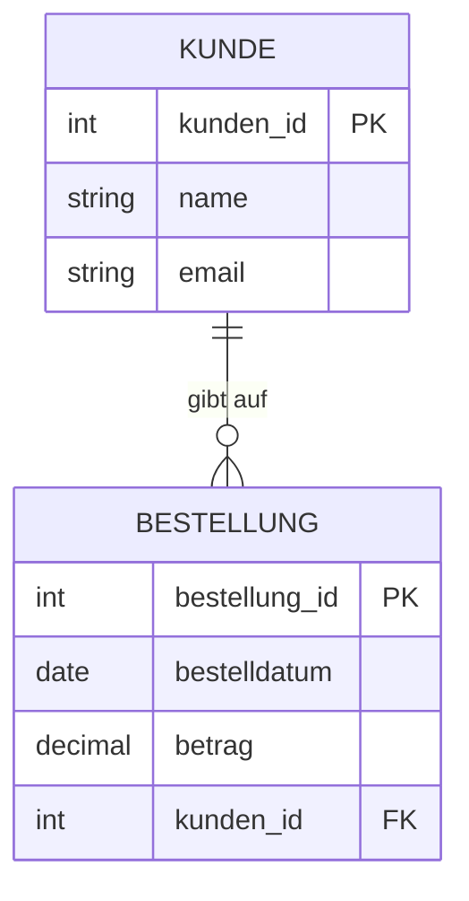
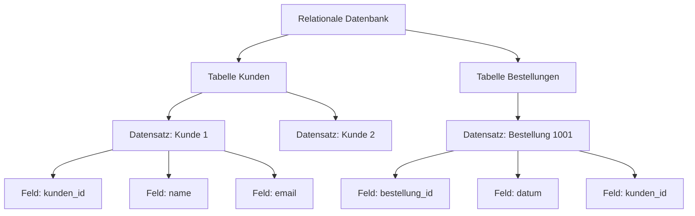

###### Themen

Grundlagen von Datenbanken

- Bedeutung und typische Einsatzgebiete von Datenbanken
- Beispiele für den Einsatz von Datenbanken im Alltag und in Unternehmen
- Unterschied zwischen Datenbank und Datenbankmanagementsystem grundlegend verstehen

Überblick über relationale Datenbanken

- Grundidee relationaler Datenbanken
- Tabellen, Datensätze und Felder als zentrale Bausteine kennenlernen

   
# 🗄️ Grundlagen von Datenbanken

   
## 🧠 Bedeutung und typische Einsatzgebiete von Datenbanken

Eine Datenbank ist vereinfacht gesagt ein System, in dem Informationen **geordnet, dauerhaft und gezielt abrufbar** gespeichert werden. Statt Daten irgendwo verstreut in einzelnen Dateien, Excel-Tabellen, E-Mails oder Papierformularen abzulegen, werden sie an einem zentralen Ort strukturiert verwaltet. Genau das macht Datenbanken so wichtig: Sie sorgen dafür, dass Informationen nicht nur gespeichert, sondern auch **gefunden, verändert, verglichen und geschützt** werden können. Oracle beschreibt Datenbanken genau in diesem Sinn als organisierte Sammlung strukturierter Informationen, die elektronisch gespeichert und verarbeitet wird ([What Is a Database?](https://www.oracle.com/database/what-is-database/)).

Im Kern lösen Datenbanken ein sehr praktisches Problem: Sobald viele Daten entstehen, reichen einfache Dateien oft nicht mehr aus. Stell dir vor, ein Online-Shop hätte Millionen Kunden, Bestellungen, Zahlungen und Produktdaten. Wenn all diese Informationen nur in einzelnen Dokumenten oder Listen stehen würden, wäre es extrem schwierig, schnell nachzuschauen:

- Welcher Kunde hat gestern bestellt?
- Welche Produkte sind noch auf Lager?
- Welche Rechnungen sind noch offen?
- Welche Lieferungen wurden schon verschickt?

Eine Datenbank macht genau solche Abfragen möglich — schnell, strukturiert und zuverlässig.

Typische Einsatzgebiete von Datenbanken sind deshalb überall dort zu finden, wo Daten **laufend entstehen**, **aktuell bleiben müssen** und **mehrfach genutzt** werden. Dazu gehören zum Beispiel:

- Speicherung von Kundendaten
- Verwaltung von Bestellungen
- Buchungssysteme
- Lagerverwaltung
- Benutzerkonten und Logins
- Zahlungs- und Rechnungsprozesse
- Terminverwaltung
- Gesundheits- und Patientendaten
- Schul- und Hochschulverwaltung

Warum sind Datenbanken in der Praxis so wichtig? Vor allem aus diesen Gründen:

**1. Ordnung und Struktur**  
Datenbanken bringen Ordnung in große Datenmengen. Informationen werden nicht zufällig gesammelt, sondern nach klaren Regeln organisiert. Das ist entscheidend, wenn viele Personen oder Programme mit denselben Daten arbeiten.

**2. Schneller Zugriff**  
Datenbanken sind darauf ausgelegt, Informationen gezielt zu finden. Eine Suchanfrage nach einer Kundennummer oder einer Bestellung kann in Sekundenbruchteilen beantwortet werden, selbst bei sehr großen Datenmengen.

**3. Gleichzeitige Nutzung durch viele Anwender**  
Mehrere Mitarbeiter oder Systeme können gleichzeitig auf dieselben Daten zugreifen, ohne dass alles durcheinandergerät. Genau dafür werden Datenbanksysteme entwickelt ([What is a DBMS?](https://aws.amazon.com/what-is/dbms/)).

**4. Datenqualität und Konsistenz**  
Eine gut aufgebaute Datenbank verhindert viele typische Fehler, zum Beispiel doppelte Einträge, falsche Formate oder widersprüchliche Informationen. Wenn zum Beispiel das Geburtsdatum immer in einem bestimmten Format gespeichert werden muss, dann lässt sich das technisch erzwingen.

**5. Sicherheit und Rechteverwaltung**  
Nicht jeder darf alles sehen oder ändern. Eine Datenbank kann steuern, wer lesen, schreiben, löschen oder nur bestimmte Bereiche sehen darf. Das ist in Unternehmen unverzichtbar.

**6. Auswertungen und Entscheidungen**  
Datenbanken sind nicht nur ein Speicherort. Sie sind auch die Grundlage für Berichte, Statistiken, Dashboards und Geschäftsentscheidungen. Aus ihnen lassen sich zum Beispiel Umsätze, Trends oder Engpässe ableiten.

Wenn man es ganz einfach sagen will:  
**Eine Datenbank ist das Gedächtnis vieler digitaler Systeme.**  
Ohne Datenbanken könnten moderne Apps, Online-Shops, Banken, Krankenhäuser oder Unternehmen kaum sinnvoll arbeiten.

   
## 🌍 Beispiele für den Einsatz von Datenbanken im Alltag und in Unternehmen

Datenbanken begegnen dir jeden Tag, oft ohne dass du sie direkt bemerkst. Immer wenn ein System Informationen speichern, wiederfinden oder aktualisieren muss, ist sehr häufig eine Datenbank im Spiel.

Damit du ein Gefühl dafür bekommst, schauen wir uns typische Beispiele an.

   
### 📱 Datenbanken im Alltag

Im Alltag arbeiten sehr viele digitale Dienste mit Datenbanken im Hintergrund.

| Bereich | Was wird in der Datenbank gespeichert? | Warum ist das nötig? |
|---|---|---|
| Online-Shop | Kundenkonto, Warenkorb, Bestellungen, Lieferadresse, Zahlungen | Damit Bestellungen korrekt verarbeitet werden können |
| Banking-App | Konten, Buchungen, Überweisungen, Daueraufträge | Damit Geldbewegungen sicher und nachvollziehbar gespeichert sind |
| Streaming-Dienst | Benutzerkonto, Watchlist, Verlauf, Empfehlungen | Damit Inhalte personalisiert angezeigt werden |
| Messenger | Benutzerprofile, Kontakte, Nachrichten, Zeitstempel | Damit Unterhaltungen gespeichert und synchronisiert werden |
| Navigations- oder Ticket-App | Fahrpläne, Buchungen, Standorte, Reservierungen | Damit aktuelle Informationen abrufbar sind |
| Soziale Netzwerke | Profile, Beiträge, Likes, Kommentare, Freundschaften | Damit Inhalte und Beziehungen verwaltet werden können |

Wenn du zum Beispiel bei einem Online-Shop ein Produkt kaufst, laufen oft mehrere Datenbankvorgänge fast gleichzeitig ab:

1. Dein Kundenkonto wird erkannt.
2. Die Bestellung wird gespeichert.
3. Der Lagerbestand wird reduziert.
4. Eine Rechnung wird erzeugt.
5. Der Versandstatus wird vorbereitet.

Ohne Datenbank müsste man all diese Informationen manuell zusammenführen — das wäre langsam, fehleranfällig und praktisch nicht skalierbar.

   
### 🏢 Datenbanken in Unternehmen

In Unternehmen sind Datenbanken noch wichtiger, weil dort oft viele Abteilungen gleichzeitig mit Informationen arbeiten.

| Unternehmensbereich | Typische Daten | Nutzen |
|---|---|---|
| Vertrieb | Kunden, Angebote, Aufträge | Überblick über Verkaufsprozesse |
| Einkauf | Lieferanten, Bestellungen, Preise | Planung und Beschaffung |
| Lager / Logistik | Artikel, Bestände, Lagerorte, Lieferungen | Kontrolle über Warenbewegungen |
| Personalwesen | Mitarbeiterdaten, Verträge, Urlaube, Gehälter | Verwaltung von Personalprozessen |
| Buchhaltung | Rechnungen, Zahlungen, Steuern, Kostenstellen | Finanzielle Nachvollziehbarkeit |
| Produktion | Stücklisten, Maschinenstatus, Fertigungsaufträge | Steuerung von Produktionsabläufen |
| Support / Service | Tickets, Fehlerberichte, Kundenvorgänge | Bessere Betreuung und Nachverfolgung |

Ein Unternehmen nutzt also nicht „eine Liste“, sondern meistens ein ganzes Netz aus Datenbanken oder Anwendungen, die mit Datenbanken verbunden sind. Ein CRM-System speichert Kundendaten, ein ERP-System verarbeitet Geschäftsabläufe, ein Shopsystem verwaltet Bestellungen, und eine Personalsoftware speichert Mitarbeiterdaten. All diese Systeme leben von gut gepflegten Daten.

Wichtig ist dabei: Datenbanken sind nicht nur für große Konzerne relevant. Auch kleine Firmen nutzen sie, zum Beispiel für Rechnungen, Terminplanung, Inventar oder Kundenkontakte.

   
## ⚙️ Unterschied zwischen Datenbank und Datenbankmanagementsystem grundlegend verstehen

Dieser Unterschied ist extrem wichtig, weil die beiden Begriffe oft durcheinandergebracht werden.

**Die Datenbank** ist der eigentliche Bestand an Daten.  
**Das Datenbankmanagementsystem (DBMS)** ist die Software, die diese Daten verwaltet.

Oder ganz einfach:

- **Datenbank** = die gespeicherten Informationen
- **DBMS** = das Programm, das mit diesen Informationen arbeitet

AWS beschreibt ein DBMS als Software, die Daten in einer Datenbank speichert, organisiert, abruft, aktualisiert und schützt ([What is a DBMS?](https://aws.amazon.com/what-is/dbms/)).

Eine einfache Analogie hilft oft:

- Die **Datenbank** ist wie eine gut sortierte Bibliothek mit allen Büchern.
- Das **DBMS** ist das Bibliothekssystem mit Regeln, Suchfunktion, Ausleihe, Benutzerrechten und Verwaltung.

Ohne DBMS wären die Daten zwar vielleicht irgendwo vorhanden, aber man könnte sie nicht komfortabel suchen, ändern, absichern oder mehreren Benutzern gleichzeitig zugänglich machen.

Hier der Unterschied in einer klaren Tabelle:

| Begriff | Bedeutung | Beispiel |
|---|---|---|
| Datenbank | Die eigentlichen gespeicherten Daten | Eine Sammlung von Kundendaten, Bestellungen und Produkten |
| DBMS | Die Software zur Verwaltung dieser Daten | PostgreSQL, MySQL, MariaDB, Oracle Database, Microsoft SQL Server |

Das DBMS übernimmt typischerweise Aufgaben wie:

- Daten speichern und laden
- Abfragen ausführen
- Änderungen verarbeiten
- Zugriffe mehrerer Nutzer koordinieren
- Rechte und Sicherheit verwalten
- Sicherungen und Wiederherstellung ermöglichen

Wenn also jemand sagt:  
„Wir haben eine MySQL-Datenbank“,  
ist damit im Alltag oft das Gesamtsystem gemeint. Genau genommen ist **MySQL das DBMS**, während die darin enthaltenen Daten die **Datenbank** sind.

Das ist wie bei einem Textdokument:  
Die Datei mit dem Inhalt ist nicht dasselbe wie das Programm, mit dem du sie öffnest und bearbeitest.

   
# 🧮 Überblick über relationale Datenbanken

   
## 🧩 Grundidee relationaler Datenbanken

Relationale Datenbanken gehören zu den wichtigsten und am weitesten verbreiteten Datenbankarten. IBM beschreibt relationale Datenbanken als Datenbanken, die Informationen in **Tabellen mit Zeilen und Spalten** organisieren und Beziehungen zwischen diesen Tabellen über gemeinsame Werte herstellen ([What is a Relational Database?](https://www.ibm.com/think/topics/relational-databases)).

Das Wort **relational** kommt von **Relationen**, also Beziehungen. Gemeint ist: Daten stehen nicht isoliert nebeneinander, sondern können miteinander verknüpft werden.

Die Grundidee ist eigentlich sehr elegant:

- Daten werden in **Tabellen** gespeichert.
- Jede Tabelle beschreibt einen bestimmten Bereich.
- Die Tabellen können miteinander verbunden werden.
- So lassen sich Informationen sauber strukturieren, ohne alles doppelt zu speichern.

Ein einfaches Beispiel:

- Eine Tabelle **Kunden** enthält Informationen über Kunden.
- Eine Tabelle **Bestellungen** enthält Informationen über Bestellungen.
- Eine Bestellung gehört zu genau einem Kunden.
- Deshalb wird in der Tabelle **Bestellungen** gespeichert, **welcher Kunde** die Bestellung aufgegeben hat.

So muss man Kundendaten nicht bei jeder Bestellung erneut vollständig hineinkopieren. Stattdessen verweist die Bestellung auf den passenden Kunden. Das spart Speicher, reduziert Fehler und sorgt für mehr Ordnung.

Gerade dieses strukturierte Verknüpfen ist ein großer Vorteil relationaler Datenbanken.

Relationale Datenbanken arbeiten in der Regel mit **SQL** als Standardsprache für Abfragen und Datenmanipulation ([What is a Relational Database?](https://www.ibm.com/think/topics/relational-databases)). Mit SQL kann man zum Beispiel sagen:

- Zeige alle Kunden aus Berlin.
- Finde alle Bestellungen eines bestimmten Kunden.
- Zähle, wie viele Produkte noch auf Lager sind.
- Ändere den Preis eines Artikels.

Damit wird eine relationale Datenbank nicht nur zum Speicherort, sondern zu einem System, mit dem man Informationen gezielt auswerten und verändern kann.

   
### 🧷 Warum „Beziehungen“ so wichtig sind

Nehmen wir an, du betreibst einen Online-Shop. Ein Kunde kann mehrere Bestellungen aufgeben. Diese Beziehung lautet also:

**Ein Kunde → viele Bestellungen**

In einer relationalen Datenbank wird das sauber modelliert, indem beide Bereiche in getrennten Tabellen gespeichert werden und über eine gemeinsame Kennung verbunden sind.

Hier ist eine einfache Visualisierung:

Was du hier siehst:

- **KUNDE** ist eine Tabelle.
- **BESTELLUNG** ist eine zweite Tabelle.
- **kunden_id** ist in der Kundentabelle der eindeutige Schlüssel.
- In der Bestelltabelle taucht **kunden_id** erneut auf, damit klar ist, zu welchem Kunden die Bestellung gehört.

Diese Verknüpfung ist das Herz relationaler Datenbanken.

   
### 🧱 Warum relationale Datenbanken so beliebt sind

Relationale Datenbanken sind besonders verbreitet, weil sie für viele Geschäftsprobleme sehr gut geeignet sind. Sie bieten:

- klare Struktur
- gute Nachvollziehbarkeit
- konsistente Datenhaltung
- flexible Abfragen
- bewährte Standards

Gerade in Bereichen wie Buchhaltung, Warenwirtschaft, Personalverwaltung, E-Commerce und klassischen Unternehmensanwendungen sind relationale Datenbanken oft die erste Wahl.

Sie sind deshalb so beliebt, weil viele reale Dinge bereits „tabellarisch“ gedacht werden können: Kunden, Produkte, Rechnungen, Buchungen, Mitarbeiter, Lieferanten, Kurse, Noten, Zimmer, Reservierungen und so weiter.

   
## 🗂️ Tabellen, Datensätze und Felder als zentrale Bausteine kennenlernen

Wenn du relationale Datenbanken verstehen willst, musst du vor allem drei Grundbegriffe sauber auseinanderhalten:

- **Tabelle**
- **Datensatz**
- **Feld**

Diese drei Bausteine tauchen immer wieder auf.

   
### 📋 Die Tabelle

Eine **Tabelle** ist ein strukturierter Bereich für eine bestimmte Art von Daten. Man kann sie sich wie ein Tabellenblatt vorstellen, allerdings mit klaren Regeln.

Beispiele für Tabellen:

- `Kunden`
- `Produkte`
- `Bestellungen`
- `Mitarbeiter`

Jede Tabelle behandelt **ein Thema**.  
Die Tabelle `Kunden` speichert also keine Lagerorte und keine Rechnungspositionen, sondern Kundendaten. Das macht Datenbanken übersichtlich.

Hier ein sehr einfaches Beispiel für eine Kundentabelle:

| kunden_id | name | email | stadt |
|---|---|---|---|
| 1 | Anna Meier | anna@example.de | Köln |
| 2 | Omar Yilmaz | omar@example.de | Hamburg |
| 3 | Lea Schmidt | lea@example.de | Berlin |

Diese gesamte Struktur ist die **Tabelle**.

Wichtig ist: Eine Tabelle besteht aus **Zeilen** und **Spalten**.

- Die **Zeilen** enthalten einzelne Einträge.
- Die **Spalten** beschreiben, welche Eigenschaften gespeichert werden.

   
### 🧾 Der Datensatz

Ein **Datensatz** ist **eine einzelne Zeile** in einer Tabelle. Er beschreibt ein konkretes Objekt oder einen konkreten Vorgang.

In der Tabelle `Kunden` wäre zum Beispiel diese Zeile ein Datensatz:

| kunden_id | name | email | stadt |
|---|---|---|---|
| 2 | Omar Yilmaz | omar@example.de | Hamburg |

Dieser Datensatz beschreibt **genau einen Kunden**.

In anderen Tabellen kann ein Datensatz auch etwas anderes darstellen:

- in `Produkte`: ein Produkt
- in `Bestellungen`: eine Bestellung
- in `Mitarbeiter`: ein Mitarbeiter
- in `Rechnungen`: eine Rechnung

Du kannst dir merken:

**Tabelle = viele gleichartige Einträge**  
**Datensatz = ein einzelner Eintrag**

In der Fachsprache wird ein Datensatz oft auch **Record** oder **Tupel** genannt. Für den Einstieg reicht aber „Datensatz“ völlig aus.

   
### 🔤 Das Feld

Ein **Feld** ist ein einzelnes Datenmerkmal innerhalb eines Datensatzes. In einfachen Einführungen wird „Feld“ oft fast gleichbedeutend mit **Spalte** verwendet. Ganz präzise ist die Spalte eher die Kategorie oder Struktur, während der Feldinhalt der konkrete Wert im Datensatz ist. Im Lernalltag ist aber die einfache Vorstellung meist am hilfreichsten:

- **Spalte/Feldname** = welche Eigenschaft gespeichert wird
- **Feldwert** = der konkrete Inhalt in einer Zelle

Beispiel aus der Kundentabelle:

| kunden_id | name | email | stadt |
|---|---|---|---|
| 2 | Omar Yilmaz | omar@example.de | Hamburg |

Hier sind:

- `kunden_id`, `name`, `email`, `stadt` die **Felder bzw. Spalten**
- `2`, `Omar Yilmaz`, `omar@example.de`, `Hamburg` die **konkreten Feldwerte**

Ein Feld beschreibt also eine Eigenschaft wie:

- Name
- E-Mail
- Telefonnummer
- Preis
- Datum
- Menge

Ohne Felder gäbe es keine Struktur. Dann wäre alles nur ungeordneter Text.

   
### 🧭 Tabelle, Datensatz und Feld im direkten Vergleich

| Begriff | Einfache Bedeutung | Beispiel |
|---|---|---|
| Tabelle | Sammlung gleichartiger Daten | `Kunden` |
| Datensatz | Eine Zeile in der Tabelle | Kunde „Omar Yilmaz“ |
| Feld | Einzelne Eigenschaft innerhalb des Datensatzes | `email` oder `stadt` |

Diese drei Begriffe kannst du dir mit einem Bild merken:

- **Tabelle** = ein ganzer Karteikasten
- **Datensatz** = eine Karte darin
- **Feld** = ein einzelnes Informationsfeld auf der Karte

Das klingt simpel, ist aber die Grundlage fast aller Datenbankarbeit.

   
### 🔑 Ein kurzer Blick auf Schlüssel, damit das Ganze zusammenhängt

Sobald Tabellen miteinander verbunden werden, braucht man eindeutige Kennungen. Deshalb tauchen in relationalen Datenbanken oft **Schlüssel** auf.

Der wichtigste ist der **Primärschlüssel**.  
Das ist ein Feld, das jeden Datensatz eindeutig identifiziert.

Beispiel:

| kunden_id | name | email |
|---|---|---|
| 1 | Anna Meier | anna@example.de |
| 2 | Omar Yilmaz | omar@example.de |

Hier ist `kunden_id` ein guter Primärschlüssel, weil jede ID nur einmal vorkommt.

Wenn eine andere Tabelle auf diesen Kunden verweist, nutzt sie oft einen **Fremdschlüssel**.  
Das ist ein Feld, das auf den Primärschlüssel einer anderen Tabelle zeigt. Genau dadurch entstehen die Beziehungen zwischen Tabellen, die laut IBM das Kernprinzip relationaler Datenbanken ausmachen ([What is a Relational Database?](https://www.ibm.com/think/topics/relational-databases)).

Zum Beispiel:

**Tabelle `Kunden`**

| kunden_id | name |
|---|---|
| 1 | Anna Meier |
| 2 | Omar Yilmaz |

**Tabelle `Bestellungen`**

| bestellung_id | datum | kunden_id |
|---|---|---|
| 1001 | 2026-03-24 | 2 |

Hier zeigt `kunden_id = 2` in der Tabelle `Bestellungen` auf den Kunden „Omar Yilmaz“ in der Tabelle `Kunden`.

Das ist ein sehr typisches Muster in relationalen Datenbanken:

- Daten nach Themen trennen
- über Schlüssel miteinander verknüpfen
- dadurch Struktur und Ordnung bewahren

   
### 🏗️ So greifen die Bausteine ineinander

Wenn du alle Begriffe zusammenführst, sieht das so aus:

1. Eine relationale Datenbank enthält mehrere **Tabellen**.
2. Jede Tabelle enthält mehrere **Datensätze**.
3. Jeder Datensatz besteht aus mehreren **Feldern**.
4. Über Schlüssel können Datensätze aus verschiedenen Tabellen **miteinander verknüpft** werden.

Als Bild:

Dieses Modell ist einfach, aber extrem mächtig. Genau daraus entstehen später Themen wie SQL-Abfragen, Beziehungen zwischen Tabellen, Primärschlüssel, Fremdschlüssel, Normalisierung und Datenmodellierung.
