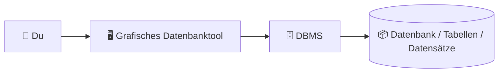
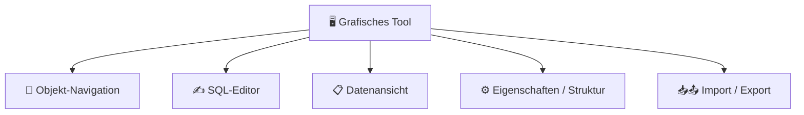
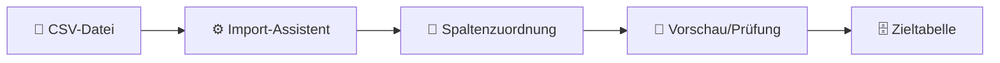
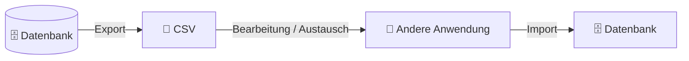

###### Themen

Arbeiten mit einem Datenbankmanagementsystem

- Verbindung zu einer lokalen Datenbank mit einem grafischen Tool herstellen
- Grundlegende Funktionen eines grafischen Datenbanktools kennenlernen

Grundlegende Datenbankoperationen

- Datenbanken und Tabellen mit einem Tool anlegen
- Tabellen einfach anpassen und löschen

Datenübertragung

- Datensätze aus einer CSV-Datei importieren
- Daten in einfache Formate wie CSV exportieren

<br><br><br>
# 🗄️ Arbeiten mit einem Datenbankmanagementsystem

Wenn du mit einem Datenbankmanagementsystem, kurz **DBMS**, arbeitest, solltest du drei Dinge sauber voneinander trennen:

1. **Die Datenbank** – also der Ort, an dem Daten strukturiert gespeichert sind.  
2. **Das DBMS** – die Software, die diese Datenbank verwaltet, Abfragen ausführt, Zugriffe steuert und Daten speichert.  
3. **Das grafische Datenbanktool** – die Oberfläche, mit der du bequem auf das DBMS zugreifen kannst, ohne alles per Hand in SQL tippen zu müssen.

Ein typisches Missverständnis am Anfang ist: Viele denken, das grafische Tool **ist** die Datenbank. Das stimmt nicht. Das Tool ist eher dein Cockpit. Die eigentliche Arbeit macht das DBMS im Hintergrund.

Ein sehr gutes Grundverständnis entsteht, wenn du dir den Ablauf so vorstellst:



Das Tool schickt Befehle an das DBMS. Das DBMS verarbeitet sie und speichert oder liest Daten. Genau deshalb ist es wichtig, nicht nur „wo muss ich klicken?“ zu lernen, sondern auch „was passiert dabei eigentlich technisch?“


<br><br><br>
## 🔌 Verbindung zu einer lokalen Datenbank mit einem grafischen Tool herstellen

Eine **lokale Datenbank** bedeutet, dass die Datenbank auf **deinem eigenen Rechner** liegt oder dort als Dienst läuft. Dabei gibt es grob zwei typische Varianten:

- **Dateibasierte Datenbank**: zum Beispiel SQLite. Hier liegt die Datenbank oft einfach als Datei auf deinem Computer. SQLite ist serverlos, selbstständig eingebettet und braucht keine eigene Server-Installation. ([About SQLite](https://www.sqlite.org/about.html))
- **Serverbasierte Datenbank**: zum Beispiel PostgreSQL oder MySQL. Hier läuft auf deinem Rechner ein lokaler Datenbankserver, und dein Tool verbindet sich über Host, Port, Benutzername und Passwort mit diesem Dienst.

Das ist ein wichtiger Unterschied, weil die Verbindung je nach Datenbanktyp anders aussieht.

<br><br><br>
### 🧠 Was „lokal“ konkret bedeutet

„Lokal“ heißt nicht automatisch „einfach“. Es heißt nur, dass sich die Datenbank **auf deinem Rechner** befindet und nicht auf einem entfernten Server im Netzwerk oder in der Cloud.

Bei SQLite gibst du häufig nur den **Dateipfad** zur Datenbankdatei an. Bei PostgreSQL oder MySQL musst du in der Regel zusätzlich diese Verbindungsdaten angeben:

- **Host** – meist `localhost` oder `127.0.0.1`
- **Port** – der Netzwerkport des Datenbankdienstes
- **Datenbankname**
- **Benutzername**
- **Passwort**

Wenn du diese Daten eingibst, baut das grafische Tool eine Verbindung zum DBMS auf. Danach kannst du im Tool Tabellen sehen, Daten lesen, neue Tabellen anlegen oder Daten importieren.

<br><br><br>
### 🛠️ Was du für die Verbindung brauchst

Bevor du eine Verbindung herstellen kannst, brauchst du meistens diese Bausteine:

| Bestandteil | Bedeutung |
|---|---|
| DBMS oder Datenbankdatei | Die eigentliche Datenbankbasis, z. B. PostgreSQL, MySQL oder SQLite |
| Grafisches Tool | Z. B. DBeaver, pgAdmin, MySQL Workbench oder DB Browser for SQLite |
| Verbindungsdaten | Host, Port, Datenbankname, Benutzername, Passwort oder Dateipfad |
| Laufender Dienst | Bei serverbasierten Systemen muss der Datenbankdienst gestartet sein |

Wenn der Dienst nicht läuft, kann das Tool sich nicht verbinden. Das ist ein ganz klassischer Anfängerfehler: Das Tool ist offen, aber der Datenbankserver selbst läuft gar nicht.

<br><br><br>
### 🚶 So gehst du Schritt für Schritt vor

Fast jedes grafische Datenbanktool arbeitet bei einer neuen Verbindung nach demselben Prinzip. Die Bezeichnungen können unterschiedlich sein, aber die Logik bleibt gleich.

**1. Datenbanktyp auswählen**  
Du wählst zuerst aus, zu welchem System du dich verbinden willst, zum Beispiel PostgreSQL, MySQL oder SQLite.

**2. Verbindungsart festlegen**  
Bei SQLite meist Datei auswählen.  
Bei PostgreSQL/MySQL: Host, Port, Datenbankname, Benutzername, Passwort.

**3. Verbindung testen**  
Gute Tools bieten einen Button wie „Test Connection“. Damit siehst du sofort, ob die Angaben stimmen.

**4. Verbindung speichern**  
Danach erscheint die Verbindung meist links in einer Navigationsleiste oder Baumstruktur.

**5. Datenbankobjekte öffnen**  
Nun kannst du Schemas, Tabellen, Views und andere Objekte durchsuchen.

Gerade für sauberes Lernen ist wichtig: Wenn du eine Verbindung anlegst, lernst du gleichzeitig die Grundidee von **Client und Server**. Das grafische Tool ist der Client. Das DBMS ist der Server oder die lokale Datenquelle.

<br><br><br>
### 📊 Typische lokale Verbindungsszenarien

| Szenario | Was du im Tool angibst | Typisches Lernziel |
|---|---|---|
| SQLite-Datei öffnen | Pfad zur `.sqlite`- oder `.db`-Datei | Verstehen, dass Datenbank auch nur eine Datei sein kann |
| PostgreSQL lokal | `localhost`, Port, DB-Name, Benutzer, Passwort | Client-Server-Prinzip verstehen |
| MySQL lokal | `localhost`, Port, DB-Name, Benutzer, Passwort | Arbeiten mit Serverdienst und Benutzerrechten |

<br><br><br>
### ⚠️ Häufige Verbindungsfehler

Wenn die Verbindung nicht klappt, liegt es oft an sehr grundlegenden Dingen:

**Der Datenbankdienst läuft nicht.**  
Dann ist die Adresse zwar richtig, aber es antwortet niemand.

**Benutzername oder Passwort sind falsch.**  
Dann erreichst du den Server, bekommst aber keinen Zugriff.

**Der Datenbankname stimmt nicht.**  
Dann existiert die Ziel-Datenbank vielleicht noch gar nicht.

**Der falsche Port wurde eingetragen.**  
Dann versucht das Tool, mit der richtigen Maschine, aber dem falschen Eingang zu sprechen.

**Bei SQLite wurde die falsche Datei gewählt.**  
Dann öffnest du unter Umständen eine leere oder andere Datenbank als erwartet.

Für sauberes Lernen ist hier ein wichtiger Merksatz sinnvoll:  
**Verbindungsprobleme sind meistens kein SQL-Problem, sondern ein Konfigurationsproblem.**


<br><br><br>
## 🧭 Grundlegende Funktionen eines grafischen Datenbanktools kennenlernen

Ein grafisches Datenbanktool nimmt dir nicht das Denken ab, aber es macht viele Arbeitsschritte sichtbar. Genau das ist für den Einstieg sehr wertvoll.

Die meisten Tools bieten dir ungefähr diese Kernbereiche:



<br><br><br>
### 🪟 Die typischen Bereiche in der Oberfläche

**Objekt-Navigation**  
Links siehst du oft eine Baumstruktur mit Datenbanken, Schemas, Tabellen, Views und anderen Objekten. In PostgreSQL sind Schemas eine logische Gruppierung innerhalb einer Datenbank. ([The Schema](https://www.postgresql.org/docs/current/ddl-schemas.html))

**Tabellenstruktur oder Eigenschaftenfenster**  
Hier siehst du Spalten, Datentypen, Primärschlüssel, Standardwerte und weitere Eigenschaften.

**Datenansicht**  
Hier kannst du die tatsächlichen Datensätze einer Tabelle sehen, oft in einer Raster- oder Grid-Ansicht.

**SQL-Editor**  
Auch wenn du viel klickst, solltest du lernen, dass hinter fast jeder Aktion SQL steckt. Das ist der entscheidende Schritt vom „Tool-Bediener“ zum echten Datenbankverständnis.

**Import-/Export-Assistenten**  
Sie helfen dir, CSV-Dateien oder andere Formate in Tabellen hineinzuladen oder wieder herauszuschreiben.

<br><br><br>
### 📋 Wichtige Funktionen im Alltag

| Funktion | Wofür sie da ist | Warum sie wichtig ist |
|---|---|---|
| Verbindung verwalten | Datenbank öffnen und speichern | Ohne stabile Verbindung geht nichts |
| Tabellen anzeigen | Struktur und Inhalte prüfen | Du siehst, wie Daten organisiert sind |
| SQL ausführen | Abfragen, Änderungen, Verwaltung | Das ist die eigentliche Sprache der Datenbank |
| Daten filtern/sortieren | Bestimmte Datensätze finden | Praktisch für Kontrolle und Analyse |
| Tabellen anlegen | Struktur für neue Daten schaffen | Fundament sauber aufbauen |
| Tabellen ändern | Struktur anpassen | Datenmodell entwickelt sich oft weiter |
| Import/Export | Daten rein- oder rausbringen | Zentral für reale Arbeitsabläufe |

<br><br><br>
### 🧠 Warum du die Oberfläche nicht nur „auswendig klicken“ solltest

Richtiges Lernen bedeutet hier: Verstehe immer, **welches Objekt** du gerade bearbeitest und **welche Wirkung** deine Aktion hat.

Wenn du zum Beispiel eine Tabelle im Tool anlegst, erzeugt das Tool im Hintergrund meist ein `CREATE TABLE`. Solche Tabellen werden in SQL mit dem Befehl `CREATE TABLE` definiert. ([CREATE TABLE](https://www.postgresql.org/docs/current/sql-createtable.html))

Wenn du eine Spalte hinzufügst, nutzt das DBMS intern meist `ALTER TABLE`. ([ALTER TABLE](https://www.postgresql.org/docs/current/sql-altertable.html))

Wenn du eine Tabelle löschst, steckt meist `DROP TABLE` dahinter. ([DROP TABLE](https://www.postgresql.org/docs/current/sql-droptable.html))

Das ist didaktisch extrem wichtig:  
**Die Oberfläche ist nur eine bequeme Darstellung von Datenbankbefehlen.**  
Wer das versteht, lernt später SQL viel leichter.


<br><br><br>
# 🏗️ Grundlegende Datenbankoperationen

Wenn die Verbindung steht, beginnt die eigentliche Grundarbeit: Datenbanken anlegen, Tabellen definieren, Struktur anpassen und bei Bedarf wieder entfernen.

Hier lernst du das Fundament jeder Datenbankarbeit: **Struktur vor Inhalt**.  
Erst das Datenmodell, dann die Daten.


<br><br><br>
## 🏛️ Datenbanken und Tabellen mit einem Tool anlegen

Bevor du Daten speichern kannst, brauchst du einen Container und darin die passende Struktur.

<br><br><br>
### 🧱 Datenbank, Schema und Tabelle sauber unterscheiden

Diese Begriffe werden am Anfang oft vermischt:

- **Datenbank**: der übergeordnete Speicherbereich
- **Schema**: eine logische Unterordnung innerhalb einer Datenbank, je nach System vorhanden oder relevant
- **Tabelle**: die konkrete Struktur mit Spalten und Zeilen

Eine Tabelle ist also nicht „die Datenbank“, sondern nur ein Baustein darin.

Bei PostgreSQL wird eine Datenbank mit `CREATE DATABASE` erzeugt. ([CREATE DATABASE](https://www.postgresql.org/docs/current/sql-createdatabase.html))  
Eine Tabelle wird mit `CREATE TABLE` angelegt. ([CREATE TABLE](https://www.postgresql.org/docs/current/sql-createtable.html))

<br><br><br>
### 🧾 So legst du eine Datenbank mit einem Tool an

In einem grafischen Tool klickst du meist auf einen Bereich wie:

- „New Database“
- „Create Database“
- Rechtsklick auf Server oder Verbindung → neue Datenbank

Dann gibst du vor allem einen **Namen** an. Je nach System kommen weitere Optionen dazu, etwa Eigentümer, Zeichensatz oder Kollation.

Wichtig ist das Lernprinzip dahinter:  
Eine Datenbank ist der **organisatorische Rahmen**. Sie legt noch nicht fest, welche Datenfelder später existieren. Das passiert erst auf Tabellenebene.

<br><br><br>
### 🧬 So legst du eine Tabelle sinnvoll an

Beim Erstellen einer Tabelle definierst du die Spalten. Jede Spalte hat einen Zweck und einen Datentyp.

Ein typisches Beispiel könnte so aussehen:

| Spalte | Datentyp | Bedeutung |
|---|---|---|
| `id` | Integer | Eindeutige Kennung |
| `produktname` | Text/VARCHAR | Name des Produkts |
| `preis` | Decimal/Numeric | Geldwert |
| `lagerbestand` | Integer | Anzahl im Lager |
| `erstellt_am` | Date/Timestamp | Erstellungszeitpunkt |

Ein grafisches Tool fragt dich beim Anlegen einer Tabelle typischerweise nach:

- **Spaltenname**
- **Datentyp**
- **Länge** bei Textfeldern
- **NULL erlaubt oder nicht**
- **Primärschlüssel**
- **Auto-Increment / Identity**
- **Standardwert**

Primärschlüssel sorgen dafür, dass jede Zeile eindeutig identifizierbar ist. Die Definition von Primärschlüsseln und anderen Constraints ist Teil von `CREATE TABLE`. ([CREATE TABLE](https://www.postgresql.org/docs/current/sql-createtable.html))

Ein gutes Lernmuster ist:  
**Jede Spalte sollte genau einen fachlichen Zweck haben.**  
Nicht „eine Spalte für alles“, sondern klar getrennte Informationen.

<br><br><br>
### 🔍 Was gute Tabellen von schlechten Tabellen unterscheidet

Eine gute Tabelle ist nicht nur technisch gültig, sondern auch fachlich sauber.

**Gut** ist zum Beispiel:

- Eine `id` als eindeutiger Schlüssel
- Sinnvolle Datentypen
- Klare Spaltennamen
- Keine doppelten Informationen in mehreren Spalten
- Datumswerte als Datum, nicht als Freitext

**Schlecht** wäre zum Beispiel:

- Preise als Text speichern
- Namen, Adressen und Bemerkungen in einer einzigen Sammelspalte vermischen
- Keine eindeutige ID haben
- Datentypen zu ungenau oder zu großzügig wählen

Gerade mit grafischen Tools passiert schnell etwas Gefährliches: Man klickt sich zu schnell durch Masken und vergisst, dass Datentypen und Schlüssel echte fachliche Entscheidungen sind.


<br><br><br>
## ✏️ Tabellen einfach anpassen und löschen

In der Praxis bleibt eine Tabelle fast nie für immer unverändert. Anforderungen ändern sich. Deshalb musst du Tabellen anpassen können.

<br><br><br>
### ➕ Tabellen anpassen: typische Änderungen

Die häufigsten Änderungen sind:

- neue Spalte hinzufügen
- Spalte umbenennen
- Datentyp ändern
- Standardwert setzen
- NULL-Regeln ändern
- Spalte löschen

Solche Änderungen laufen in SQL typischerweise über `ALTER TABLE`. ([ALTER TABLE](https://www.postgresql.org/docs/current/sql-altertable.html))

In einem grafischen Tool bearbeitest du dafür meistens die Tabellenstruktur direkt über einen Designer oder Eigenschaften-Dialog.

Ein paar Beispiele aus der Praxis:

**Neue Spalte hinzufügen**  
Du willst zu einer Produkttabelle noch die Spalte `kategorie` ergänzen.

**Datentyp anpassen**  
Du merkst, dass `preis` nicht als Ganzzahl, sondern als Dezimalwert gespeichert werden muss.

**Standardwert setzen**  
Neue Datensätze sollen automatisch ein Erstellungsdatum bekommen.

<br><br><br>
### 🔁 Was beim Ändern technisch wichtig ist

Nicht jede Änderung ist harmlos.

Wenn du eine **neue Spalte** hinzufügst, ist das oft noch relativ unkompliziert.  
Wenn du aber einen **Datentyp änderst**, kann es Probleme geben, falls bestehende Daten nicht in das neue Format passen.

Beispiel:  
Aus einer Textspalte soll plötzlich eine Zahlenspalte werden. Das funktioniert nur, wenn die vorhandenen Werte tatsächlich in Zahlen umgewandelt werden können.

Das ist ein sehr wichtiger Lernpunkt:  
**Strukturänderungen betreffen nicht nur das Schema, sondern oft auch die schon gespeicherten Daten.**

<br><br><br>
### 🗑️ Tabellen löschen

Wenn du eine Tabelle löschst, entfernst du nicht nur die Daten, sondern die **gesamte Tabellenstruktur**. In SQL geschieht das über `DROP TABLE`. ([DROP TABLE](https://www.postgresql.org/docs/current/sql-droptable.html))

Das ist etwas anderes als nur Datensätze zu entfernen.

| Aktion | Was verschwindet? |
|---|---|
| Datensätze löschen | Nur Inhalte |
| Tabelle löschen | Inhalte **und** Struktur |

Gerade in grafischen Tools ist das gefährlich, weil ein Rechtsklick sehr schnell gemacht ist. Gute Tools zeigen daher meist eine Sicherheitsabfrage.

Für gutes Arbeiten gilt:  
Bevor du löschst, prüfe immer:
- Ist das wirklich die richtige Tabelle?
- Wird sie noch irgendwo verwendet?
- Brauche ich vorher einen Export oder ein Backup?

<br><br><br>
### 🧾 Was das Tool im Hintergrund meist ausführt

| Aktion im Tool | Typischer SQL-Befehl |
|---|---|
| Neue Datenbank anlegen | `CREATE DATABASE` |
| Neue Tabelle anlegen | `CREATE TABLE` |
| Tabelle ändern | `ALTER TABLE` |
| Tabelle löschen | `DROP TABLE` |

Wenn du dir das bewusst machst, lernst du doppelt:  
Du lernst das Tool **und gleichzeitig** die Sprache der Datenbanken.


<br><br><br>
# 📦 Datenübertragung

Datenbanken sind in der Praxis nie komplett isoliert. Daten müssen oft aus Dateien übernommen oder wieder herausgegeben werden. Genau dafür sind Import und Export wichtig.

Das häufigste Austauschformat im Einstieg ist **CSV**, weil es einfach, weit verbreitet und von fast jedem Tool lesbar ist.


<br><br><br>
## 📥 Datensätze aus einer CSV-Datei importieren

Der Import aus CSV ist einer der praktischsten Grundabläufe überhaupt. Er verbindet tabellarische Dateidaten mit einer echten Datenbankstruktur.

<br><br><br>
### 📄 Was eine CSV-Datei eigentlich ist

CSV steht für **Comma-Separated Values**, also kommagetrennte Werte. Das Format beschreibt Datensätze als Textzeilen, deren Felder durch Trennzeichen getrennt werden; eine Kopfzeile ist möglich. ([RFC 4180](https://www.rfc-editor.org/rfc/rfc4180))

Wichtig ist dabei:  
CSV ist **sehr einfach**, aber genau deshalb speichert es normalerweise **keine echte Datenbanklogik** wie Primärschlüssel, Fremdschlüssel, Datentypregeln oder Beziehungen. Es transportiert vor allem rohe Werte.

Ein Beispiel:

```csv
id,produktname,preis,lagerbestand
1,Tastatur,49.99,20
2,Maus,19.95,50
3,Monitor,199.00,8
```

Die Datei enthält Werte, aber die Datenbank muss trotzdem noch wissen:

- Welche Spalte ist Zahl?
- Welche ist Text?
- Welche ist der Primärschlüssel?
- Ist die erste Zeile eine Überschrift?

<br><br><br>
### 🧹 Was du vor dem Import prüfen solltest

Bevor du importierst, solltest du die CSV-Datei fachlich und technisch prüfen:

**1. Passen die Spalten zur Zieltabelle?**  
Wenn deine Tabelle `produktname`, `preis` und `lagerbestand` hat, die CSV aber `name`, `kosten` und `menge`, musst du beim Import sauber zuordnen.

**2. Ist die erste Zeile eine Kopfzeile?**  
Viele Import-Assistenten können die erste Zeile als Spaltennamen interpretieren.

**3. Welches Trennzeichen wird verwendet?**  
CSV heißt zwar „comma-separated“, aber in vielen Regionen werden auch Semikolons genutzt. Das muss im Importdialog korrekt gesetzt werden. Das CSV-Format selbst beschreibt Felder als durch Trennzeichen separierte Werte. ([RFC 4180](https://www.rfc-editor.org/rfc/rfc4180))

**4. Stimmen Datums- und Zahlenformate?**  
Besonders kritisch sind Dezimaltrennzeichen, Datumsformat und leere Werte.

**5. Sind IDs eindeutig?**  
Wenn deine Tabelle einen Primärschlüssel hat, dürfen dort keine doppelten Werte hinein.

<br><br><br>
### 🚚 So läuft ein CSV-Import im Tool typischerweise ab

Der Ablauf ist in vielen Tools sehr ähnlich:

1. **Zieltabelle auswählen**  
   Entweder importierst du in eine bestehende Tabelle oder lässt eine neue erzeugen.

2. **CSV-Datei auswählen**  
   Das Tool liest eine Vorschau der Datei.

3. **Importoptionen festlegen**  
   Dazu gehören häufig:
   - Trennzeichen
   - Zeichensatz
   - Textbegrenzer, z. B. `"`
   - Kopfzeile ja/nein
   - NULL-Werte
   - Datumsformat

   Solche Optionen entsprechen auch typischen CSV-Import-/Export-Parametern in Datenbanksystemen, etwa bei PostgreSQL `COPY` mit Optionen wie `FORMAT csv`, `DELIMITER`, `HEADER` oder `NULL`. ([COPY](https://www.postgresql.org/docs/current/sql-copy.html))

4. **Spalten zuordnen**  
   Das Tool mappt CSV-Spalten auf Tabellenspalten.

5. **Vorschau prüfen**  
   Sehr wichtig: Vor dem endgültigen Import solltest du prüfen, ob die Werte korrekt interpretiert werden.

6. **Import starten**  
   Das Tool schreibt die Daten in die Tabelle.



<br><br><br>
### 🚧 Häufige Probleme beim Import

**Spaltenreihenfolge stimmt nicht**  
Dann landet der Preis vielleicht in der Lagerbestands-Spalte.

**Falsches Trennzeichen**  
Dann liest das Tool eine ganze Zeile als eine einzige Spalte.

**Datentyp passt nicht**  
Text in einer Zahlenspalte führt oft zu Fehlern oder leeren Werten.

**Umlaute oder Sonderzeichen sind kaputt**  
Dann ist meist die Zeichenkodierung falsch gewählt.

**Leere Felder werden falsch behandelt**  
Leeres Feld ist nicht immer dasselbe wie `NULL`.

**Doppelte Schlüsselwerte**  
Wenn eine ID doppelt vorkommt, kann der Import an Primärschlüsselregeln scheitern.

Gerade hier zeigt sich, warum gute Tabellenstruktur wichtig ist:  
Der Import wird viel leichter, wenn deine Zieltabellen klar definiert und fachlich sauber aufgebaut sind.


<br><br><br>
## 📤 Daten in einfache Formate wie CSV exportieren

Export ist die umgekehrte Richtung: Du holst Daten aus der Datenbank heraus, damit sie in anderen Programmen weiterverarbeitet oder archiviert werden können.

<br><br><br>
### 🎯 Wofür ein Export sinnvoll ist

Ein CSV-Export wird oft genutzt, um:

- Daten in Excel oder LibreOffice Calc zu öffnen
- Daten an andere Systeme weiterzugeben
- einfache Sicherungen bestimmter Tabellen zu erzeugen
- Analyse- oder Berichtsdaten bereitzustellen

Auch hier gilt: CSV ist gut für den **Austausch von tabellarischen Werten**, aber nicht für vollständige Datenbanklogik.

<br><br><br>
### 🧾 So läuft ein Export typischerweise ab

Du wählst im Tool meist:

- eine Tabelle
- oder das Ergebnis einer SQL-Abfrage

Dann startest du den Export-Assistenten und legst fest:

- Dateiformat, z. B. CSV
- Zielpfad
- Trennzeichen
- Kopfzeile ja/nein
- Zeichensatz
- eventuell Textbegrenzer

In PostgreSQL werden genau solche Optionen auch beim Datenexport über `COPY` unterstützt, etwa `CSV`, `HEADER` und `DELIMITER`. ([COPY](https://www.postgresql.org/docs/current/sql-copy.html))

Ein sehr wichtiger Unterschied:

- **Tabellenexport** exportiert oft die ganze Tabelle
- **Abfrageexport** exportiert nur die Daten, die deine SQL-Abfrage liefert

Das ist in der Praxis extrem nützlich. So kannst du gezielt nur bestimmte Spalten oder nur gefilterte Datensätze exportieren.

<br><br><br>
### 🧠 Warum Export aus Abfragen besonders wertvoll ist

Wenn du nur rohe Tabellen exportierst, gibst du oft zu viele Daten weiter.  
Wenn du aber eine SQL-Abfrage exportierst, kannst du vorher genau festlegen:

- welche Spalten relevant sind
- welche Zeilen enthalten sein sollen
- in welcher Reihenfolge die Daten erscheinen
- ob Werte umbenannt oder berechnet werden sollen

So wird aus einem simplen Export schon ein erster Schritt in Richtung Datenaufbereitung.

<br><br><br>
### 🔐 Was beim Export in CSV verloren geht

Das ist ein sehr wichtiger fachlicher Punkt:  
Beim Export nach CSV nimmst du in der Regel **nicht die ganze Datenbankstruktur** mit.

Oft verloren oder nicht vollständig abbildbar sind:

- Primärschlüssel-Definitionen
- Fremdschlüssel-Beziehungen
- Indizes
- Constraints
- Trigger
- Benutzerrechte
- Datentypdetails

CSV enthält im Kern Werte in Tabellenform, nicht die komplette Datenbankarchitektur. Das folgt schon aus der Natur des Formats als einfaches textbasiertes Austauschformat. ([RFC 4180](https://www.rfc-editor.org/rfc/rfc4180))

Deshalb ist ein CSV-Export **kein vollwertiger Datenbank-Backup-Ersatz**.  
Er ist hervorragend für Austausch und Sichtbarkeit, aber nicht für die vollständige Rekonstruktion komplexer Datenbankstrukturen.

<br><br><br>
### 🔄 Der Gesamtfluss von Import und Export



Dieser Kreislauf ist in der Praxis sehr typisch:  
Daten werden exportiert, außerhalb bearbeitet, kontrolliert oder ausgetauscht und später wieder importiert.

Genau deshalb gehören **Verbindung, Tabellenstruktur, Import und Export** zu den wichtigsten Grundlagen überhaupt. Wenn du diese Abläufe wirklich verstehst, hast du ein starkes Fundament für alles Weitere in Datenbankarbeit – egal ob du später mehr mit SQL, Anwendungsentwicklung, Data Engineering oder Administration zu tun hast.