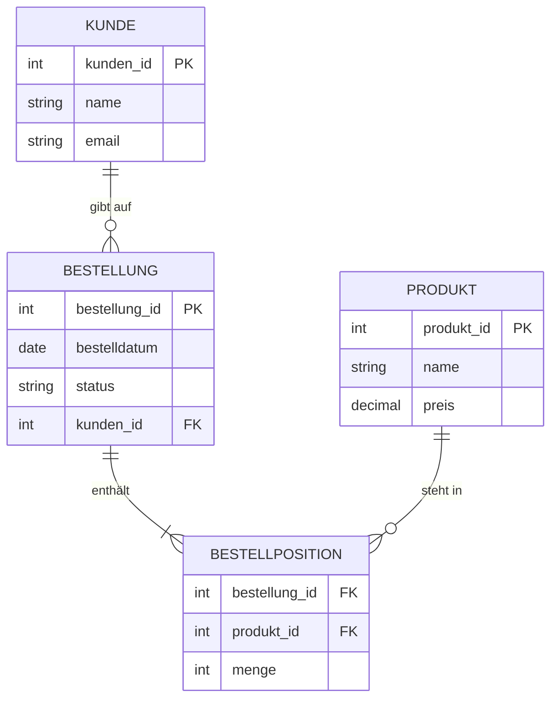
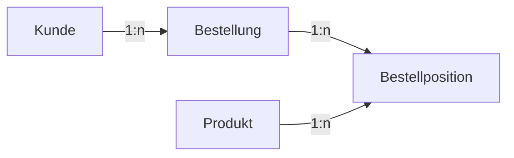

###### Themen

Grundlagen der Datenmodellierung

- Entitäten, Attribute und Beziehungen verstehen
- Einfache Zusammenhänge zwischen Daten beschreiben

Entity-Relationship-Modell

- Einfache ER-Diagramme lesen und erstellen
- Kardinalitäten in einfachen Beispielen erkennen

Vom Modell zur Tabelle

- Ein einfaches ER-Diagramm in ein relationales Schema übertragen
- Tabellenstrukturen aus einem Beispielszenario ableiten

<br><br><br>
# 📚 Grundlagen der Datenmodellierung

Wenn du mit Daten arbeitest, musst du zuerst verstehen, **was** du eigentlich speichern willst, **wie diese Informationen zusammenhängen** und **wie daraus später Tabellen werden**. Genau das macht Datenmodellierung.

Datenmodellierung bedeutet, Informationen aus der echten Welt so zu beschreiben, dass ein Computersystem sie sauber speichern und verarbeiten kann. Dabei wird festgelegt, **welche Objekte es gibt**, **welche Eigenschaften diese Objekte haben** und **wie sie miteinander verbunden sind**. Genau dafür werden Datenmodelle genutzt ([What is data modeling?](https://www.ibm.com/think/topics/data-modeling)).

Das klingt erst einmal theoretisch, ist aber in Wirklichkeit sehr praktisch. Wenn du ein gutes Datenmodell hast, dann:

- verstehst du ein Problem fachlich viel besser,
- vermeidest doppelte oder chaotische Daten,
- kannst du später leichter Tabellen, Abfragen und Anwendungen bauen,
- und du machst weniger Fehler bei der technischen Umsetzung.

Ein sehr wichtiger Gedanke dabei ist: **Erst das Modell, dann die Datenbank**.  
Nicht sofort Tabellen bauen, sondern zuerst überlegen: *Welche Dinge gibt es? Welche Informationen gehören zu ihnen? Wie hängen sie zusammen?*


<br><br><br>
## 🧱 Entitäten, Attribute und Beziehungen verstehen

Die drei Grundbausteine der Datenmodellierung sind:

- **Entitäten**
- **Attribute**
- **Beziehungen**

Wenn du diese drei Begriffe wirklich verstehst, ist der Rest viel leichter.


<br><br><br>
### 🧍 Entitäten: Die Dinge, über die du Daten speicherst

Eine **Entität** ist ein Objekt oder ein Gegenstand aus der fachlichen Welt, über den du Informationen speichern willst.

Beispiele für Entitäten:

- Kunde
- Produkt
- Bestellung
- Mitarbeiter
- Buch
- Schüler

Wenn du zum Beispiel einen Online-Shop modellierst, dann sind **Kunde**, **Produkt** und **Bestellung** typische Entitäten.

Wichtig ist dabei die Unterscheidung zwischen:

- **Entitätstyp**: die allgemeine Klasse, zum Beispiel **Kunde**
- **Entität/Instanz**: ein konkreter Eintrag, zum Beispiel **Kunde Nr. 17 = Anna Weber**

Also:

- **Kunde** ist der Typ
- **Anna Weber** ist eine konkrete Instanz dieses Typs

Das ist ein sehr wichtiger Denkfehler, den viele am Anfang machen:  
Man modelliert nicht einzelne Personen oder einzelne Produkte, sondern zunächst die **Arten von Dingen**, die vorkommen.


<br><br><br>
### 🏷️ Attribute: Die Eigenschaften einer Entität

Ein **Attribut** beschreibt eine Eigenschaft einer Entität.

Beispiel für die Entität **Kunde**:

| Entität | Mögliche Attribute |
|---|---|
| Kunde | Kunden-ID, Vorname, Nachname, E-Mail, Geburtsdatum |
| Produkt | Produkt-ID, Name, Preis, Lagerbestand |
| Bestellung | Bestellnummer, Bestelldatum, Status |

Ein Attribut beantwortet also Fragen wie:

- Wie heißt der Kunde?
- Welche E-Mail-Adresse hat er?
- Was kostet das Produkt?
- Wann wurde die Bestellung aufgegeben?

Ein Attribut sollte möglichst **genau eine Information** enthalten.  
Zum Beispiel ist `E-Mail` ein gutes Attribut, weil dort genau ein klarer Wert gespeichert wird.

Weniger gut wäre ein Attribut wie `Komplette_Kontaktdaten`, weil darin plötzlich mehrere Informationen gleichzeitig vermischt sein könnten. Gute Datenmodellierung versucht, Informationen klar zu trennen.

Typische Attributarten sind:

- **identifizierende Attribute**  
  Sie helfen, einen Datensatz eindeutig zu erkennen, zum Beispiel `Kunden-ID`.

- **beschreibende Attribute**  
  Sie geben zusätzliche Informationen an, zum Beispiel `Name` oder `Preis`.

- **optionale Attribute**  
  Sie müssen nicht immer einen Wert haben, zum Beispiel `Telefonnummer`.

- **verpflichtende Attribute**  
  Sie sollten immer vorhanden sein, zum Beispiel bei vielen Modellen die `Kunden-ID`.

Ein sehr zentrales Attribut ist der **Schlüssel**.


<br><br><br>
### 🔑 Schlüsselattribute: Woran man einen Datensatz eindeutig erkennt

In fast jedem Datenmodell brauchst du ein Attribut, das jeden Datensatz **eindeutig** identifiziert. In relationalen Datenbanken ist das meist der **Primärschlüssel**.

Beispiele:

- `kunden_id`
- `produkt_id`
- `bestellung_id`

Ein Primärschlüssel muss eindeutig sein. Es darf also nicht zwei Kunden mit derselben `kunden_id` geben. Außerdem darf ein Primärschlüssel nicht leer sein. Genau diese Eigenschaften sind typische Merkmale eines Primärschlüssels in relationalen Datenbanken ([PostgreSQL: Constraints](https://www.postgresql.org/docs/current/ddl-constraints.html)).

Warum nimmt man dafür oft eine künstliche ID statt eines Namens?

Weil Namen nicht eindeutig sind. Es kann mehrere Menschen mit dem Namen „Max Müller“ geben. Eine ID ist stabiler und zuverlässiger.

Deshalb ist zum Beispiel:

- `Kunden-ID` → gut als Schlüssel
- `Name` → meist ungeeignet als Schlüssel


<br><br><br>
### 🔗 Beziehungen: Wie Entitäten miteinander verbunden sind

Eine **Beziehung** beschreibt, wie zwei Entitäten zusammenhängen.

Beispiele:

- Ein **Kunde** gibt eine **Bestellung** auf.
- Eine **Bestellung** enthält **Produkte**.
- Ein **Lehrer** unterrichtet eine **Klasse**.
- Ein **Buch** wird von einem **Autor** geschrieben.

Beziehungen sind extrem wichtig, weil Daten fast nie isoliert existieren.  
Ein Kunde allein ist selten interessant. Interessant wird er, wenn du auch weißt:

- welche Bestellungen er gemacht hat,
- welche Produkte er gekauft hat,
- welche Adresse zu ihm gehört,
- welche Rechnungen es zu ihm gibt.

Ohne Beziehungen hättest du nur einzelne Datensammlungen.  
Mit Beziehungen entsteht ein **zusammenhängendes Modell**.

Ein einfaches Beispiel:

| Entität A | Beziehung | Entität B |
|---|---|---|
| Kunde | gibt auf | Bestellung |
| Bestellung | enthält | Produkt |
| Mitarbeiter | arbeitet in | Abteilung |

Man kann Beziehungen auch als vollständige Sätze lesen:

- Ein Kunde gibt Bestellungen auf.
- Eine Bestellung gehört zu genau einem Kunden.
- Ein Produkt kann in vielen Bestellungen vorkommen.

Genau solche Sätze helfen dir enorm beim Modellieren. Wenn du ein Modell nicht in klaren Sätzen beschreiben kannst, ist es meistens noch nicht sauber durchdacht.


<br><br><br>
## 🔍 Einfache Zusammenhänge zwischen Daten beschreiben

Wenn du Daten modellierst, reicht es nicht zu sagen:  
„Kunde und Bestellung hängen zusammen.“

Du musst genauer sagen:

- **Wie viele** Bestellungen kann ein Kunde haben?
- Gehört eine Bestellung zu **einem** oder zu **mehreren** Kunden?
- Kann ein Produkt in **vielen** Bestellungen vorkommen?

Damit kommst du zu den sogenannten **Kardinalitäten**. Sie beschreiben die Anzahl möglicher Zuordnungen zwischen Entitäten.


<br><br><br>
### 1️⃣ Eins-zu-eins-Beziehung (1:1)

Bei einer **1:1-Beziehung** gehört zu einem Datensatz höchstens genau ein passender Datensatz auf der anderen Seite.

Beispiel:

- Eine **Person** hat genau einen **Personalausweis**
- Ein **Personalausweis** gehört genau zu einer **Person**

Das ist in der Praxis seltener als 1:n-Beziehungen.

Solche Beziehungen nutzt man häufig, wenn Informationen getrennt werden sollen, zum Beispiel:

- aus Sicherheitsgründen,
- weil Daten optional sind,
- oder weil ein Teil der Daten nur in Sonderfällen vorkommt.

Beispiel:

- `Mitarbeiter`
- `Mitarbeiter_Parkplatz`

Nicht jeder Mitarbeiter hat einen Parkplatz. Also kann man diese Information getrennt modellieren.


<br><br><br>
### 2️⃣ Eins-zu-viele-Beziehung (1:n)

Das ist die häufigste Beziehungsart.

Beispiel:

- Ein **Kunde** kann viele **Bestellungen** aufgeben.
- Eine **Bestellung** gehört aber nur zu einem **Kunden**.

Also:

- auf der einen Seite: **1**
- auf der anderen Seite: **viele**

Weitere Beispiele:

- Eine **Abteilung** hat viele **Mitarbeiter**
- Eine **Klasse** hat viele **Schüler**
- Ein **Hersteller** produziert viele **Produkte**

Diese Art von Beziehung ist besonders leicht in Tabellen umzusetzen.


<br><br><br>
### 3️⃣ Viele-zu-viele-Beziehung (n:m)

Bei einer **n:m-Beziehung** können beide Seiten mehrfach miteinander verbunden sein.

Beispiel:

- Eine **Bestellung** kann viele **Produkte** enthalten.
- Ein **Produkt** kann in vielen **Bestellungen** vorkommen.

Oder:

- Ein **Student** besucht viele **Kurse**
- Ein **Kurs** wird von vielen **Studenten** besucht

Diese Beziehung ist fachlich sehr häufig, aber technisch in relationalen Datenbanken nicht direkt als eine einzige Spalte darstellbar. Deshalb löst man sie später mit einer **Zwischentabelle** auf.

Ein wichtiges Beispiel:

- `Bestellung`
- `Produkt`

Die direkte Beziehung ist fachlich n:m.  
Technisch macht man daraus oft:

- `Bestellposition`

Denn eine Bestellposition verbindet genau **eine Bestellung** mit genau **einem Produkt** und enthält oft zusätzliche Informationen wie `Menge` oder `Einzelpreis`.

Das ist ein sehr typisches Muster der Datenmodellierung.


<br><br><br>
# 🧩 Entity-Relationship-Modell (Entitäts-Beziehungs-Modell)

Das **Entity-Relationship-Modell**, kurz **ER-Modell**, ist eine grafische Methode, um Entitäten, Attribute und Beziehungen sichtbar zu machen. Es wurde genau dafür entwickelt, Datenstrukturen verständlich darzustellen, bevor man daraus Tabellen baut ([What is data modeling?](https://www.ibm.com/think/topics/data-modeling)).

Der große Vorteil:  
Du kannst ein fachliches Problem zuerst **visuell** und **logisch** klären, ohne dich sofort mit SQL oder Datenbankdetails zu beschäftigen.

Ein ER-Modell beantwortet vor allem diese Fragen:

- Welche Entitäten gibt es?
- Welche Attribute haben sie?
- Welche Beziehungen bestehen?
- Welche Kardinalitäten gelten?


<br><br><br>
## 👀 Einfache ER-Diagramme lesen und verstehen

Ein **ER-Diagramm** ist die zeichnerische Darstellung eines ER-Modells.

Je nach Notation sehen ER-Diagramme unterschiedlich aus. In der Praxis sind zwei Dinge fast immer sichtbar:

- **Entitäten**
- **Beziehungen**
- oft auch **Attribute**
- und die **Kardinalitäten**

Ein einfaches ER-Diagramm für einen Online-Shop könnte so aussehen:



So kannst du das lesen:

- Ein **Kunde** gibt **null, eine oder viele Bestellungen** auf.
- Eine **Bestellung** gehört zu **genau einem Kunden**.
- Eine **Bestellung** enthält **mindestens eine Bestellposition**.
- Ein **Produkt** kann in **vielen Bestellpositionen** vorkommen.

Der große Trick beim Lesen ist:  
Lies jede Beziehung als natürlichen Satz.

Zum Beispiel:

- Ein Kunde gibt Bestellungen auf.
- Eine Bestellung enthält Bestellpositionen.
- Eine Bestellposition verweist auf ein Produkt.

Wenn du ein ER-Diagramm so lesen kannst, dann hast du den Kern verstanden.


<br><br><br>
### 🧠 Was die Symbole bei Kardinalitäten bedeuten

In vielen Darstellungen, besonders in der sogenannten **Crow’s-Foot-Notation**, siehst du Zeichen wie `||`, `o|`, `|{` oder `o{`.

Vereinfacht bedeuten sie:

| Symbol | Bedeutung |
|---|---|
| `||` | genau eins |
| `o|` | null oder eins |
| `|{` | eins oder viele |
| `o{` | null oder viele |

Wenn du also siehst:

`KUNDE ||--o{ BESTELLUNG`

dann bedeutet das:

- jede Bestellung gehört zu **genau einem** Kunden,
- ein Kunde kann **null oder viele** Bestellungen haben.

Das ist inhaltlich viel aussagekräftiger als einfach nur eine Linie zwischen zwei Kästen.


<br><br><br>
## ✍️ Einfache ER-Diagramme erstellen

Ein ER-Diagramm zu erstellen ist im Grunde ein Denkprozess in klaren Schritten.

### 🪜 Schritt 1: Die wichtigen Dinge im Szenario finden

Du liest ein Fachszenario und suchst nach den Objekten, über die Daten gespeichert werden sollen.

Beispiel-Satz:

> Ein Kunde bestellt Produkte. Jede Bestellung hat ein Datum. Produkte haben einen Preis.

Daraus erkennst du schnell Entitäten wie:

- Kunde
- Bestellung
- Produkt

Achte dabei besonders auf Substantive. Oft stecken Entitäten genau dort.


<br><br><br>
### 🏷️ Schritt 2: Attribute zu jeder Entität sammeln

Dann überlegst du:  
Welche Informationen müssen wir zu jeder Entität speichern?

Beispiel:

**Kunde**
- Kunden-ID
- Name
- E-Mail

**Bestellung**
- Bestell-ID
- Bestelldatum
- Status

**Produkt**
- Produkt-ID
- Name
- Preis

Hier ist wichtig:  
Nur Attribute aufnehmen, die wirklich zu dieser Entität gehören.

Zum Beispiel gehört `Preis` zum Produkt, nicht zum Kunden.


<br><br><br>
### 🔗 Schritt 3: Beziehungen formulieren

Jetzt formulierst du in einfachen Sätzen die Verbindungen:

- Kunde gibt Bestellung auf
- Bestellung enthält Produkt

Wenn du den Satz sauber formulieren kannst, ist das ein gutes Zeichen dafür, dass die Beziehung sinnvoll ist.


<br><br><br>
### 🔢 Schritt 4: Kardinalitäten festlegen

Jetzt wird es präziser:

- Kann ein Kunde mehrere Bestellungen haben? → Ja
- Gehört eine Bestellung zu mehreren Kunden? → Nein

Also entsteht:

- Kunde 1 : n Bestellung

Dann:

- Kann eine Bestellung mehrere Produkte enthalten? → Ja
- Kann ein Produkt in mehreren Bestellungen vorkommen? → Ja

Also entsteht:

- Bestellung n : m Produkt

Das ist ein zentraler Schritt. Genau hier entscheidet sich, wie die spätere Tabellenstruktur aussehen wird.


<br><br><br>
### 🧹 Schritt 5: Unklare oder doppelte Informationen bereinigen

Gute Datenmodellierung bedeutet auch, Unsauberkeiten früh zu erkennen.

Beispiel für ein schlechtes Attribut:

- `produkte_liste` in der Tabelle `Bestellung`

Warum ist das problematisch?  
Weil dort mehrere Produkte in einem Feld landen würden. Das widerspricht dem Gedanken sauber strukturierter Daten.

Besser ist:

- `Bestellung`
- `Produkt`
- `Bestellposition`

So wird jede Information klar und einzeln gespeichert.


<br><br><br>
## 🔢 Kardinalitäten in einfachen Beispielen erkennen

Damit du Kardinalitäten wirklich sicher erkennst, hilft diese Denkweise:

Frage immer in **beide Richtungen**.

Nicht nur:

- Wie viele Bestellungen kann ein Kunde haben?

Sondern auch:

- Zu wie vielen Kunden gehört eine Bestellung?

Diese Doppelfrage ist Gold wert.

Hier eine kleine Übersicht:

| Beziehung | Bedeutung | Beispiel |
|---|---|---|
| 1:1 | Ein Datensatz passt zu höchstens einem Datensatz der anderen Seite | Person ↔ Personalausweis |
| 1:n | Ein Datensatz passt zu vielen Datensätzen der anderen Seite | Kunde ↔ Bestellung |
| n:m | Beide Seiten können mehrfach verbunden sein | Bestellung ↔ Produkt |

Noch klarer wird es mit Sprache:

| Frage | Beispielantwort | Ergebnis |
|---|---|---|
| Wie viele Bestellungen kann ein Kunde haben? | viele | links 1, rechts n |
| Zu wie vielen Kunden gehört eine Bestellung? | genau einer | Kunde ↔ Bestellung = 1:n |
| Wie viele Produkte kann eine Bestellung enthalten? | viele | n:m-Kandidat |
| In wie vielen Bestellungen kann ein Produkt vorkommen? | viele | Bestellung ↔ Produkt = n:m |

Ein häufiger Anfängerfehler ist, nur eine Richtung zu betrachten.  
Dann sagt man zum Beispiel:

> Eine Bestellung enthält viele Produkte.

Das ist zwar richtig, aber noch nicht vollständig.  
Erst mit der Gegenfrage wird klar:

> Ein Produkt kann auch in vielen Bestellungen vorkommen.

Und genau dann erkennst du:  
Das ist **n:m**.


<br><br><br>
# 🗄️ Vom Modell zur Tabelle

Bis hierhin hast du fachlich modelliert. Jetzt kommt der nächste Schritt:  
Wie wird aus einem ER-Modell eine **relationale Tabellenstruktur**?

Im relationalen Modell werden Daten in **Tabellen** organisiert. Eine Tabelle hat **Spalten** für Attribute und **Zeilen** für konkrete Datensätze. Beziehungen zwischen Tabellen werden in der Regel über Schlüssel hergestellt, insbesondere über **Primärschlüssel** und **Fremdschlüssel** ([PostgreSQL: Constraints](https://www.postgresql.org/docs/current/ddl-constraints.html)).

Dieser Schritt ist extrem wichtig, weil hier aus einem fachlichen Modell eine konkrete technische Struktur wird.


<br><br><br>
## 🔄 Ein einfaches ER-Diagramm in ein relationales Schema übertragen

Die Grundregeln sind zum Glück ziemlich klar.


<br><br><br>
### 🧱 Regel 1: Jede Entität wird zu einer Tabelle

Wenn du im ER-Modell die Entitäten:

- Kunde
- Bestellung
- Produkt

hast, dann entstehen daraus normalerweise die Tabellen:

- `kunde`
- `bestellung`
- `produkt`

Das ist die einfachste und wichtigste Regel.


<br><br><br>
### 🏷️ Regel 2: Jedes einfache Attribut wird zu einer Spalte

Aus der Entität **Kunde** mit den Attributen

- Kunden-ID
- Name
- E-Mail

wird zum Beispiel die Tabelle:

| Tabelle `kunde` | Bedeutung |
|---|---|
| kunden_id | eindeutige ID |
| name | Name des Kunden |
| email | E-Mail-Adresse |

Attribute werden also ganz direkt zu Spalten.


<br><br><br>
### 🔑 Regel 3: Der Identifikator wird zum Primärschlüssel

Wenn `kunden_id` den Kunden eindeutig identifiziert, dann wird diese Spalte der **Primärschlüssel**.

Zum Beispiel:

`KUNDE(kunden_id PK, name, email)`

Genauso:

`PRODUKT(produkt_id PK, name, preis)`

Der Primärschlüssel ist also die technische Umsetzung des eindeutigen Identifikators.


<br><br><br>
### 🔗 Regel 4: Eine 1:n-Beziehung wird über einen Fremdschlüssel umgesetzt

Beispiel:

- Ein Kunde hat viele Bestellungen
- Eine Bestellung gehört zu genau einem Kunden

Dann kommt der Fremdschlüssel auf die **n-Seite**, also in die Tabelle `bestellung`.

Warum?  
Weil jede einzelne Bestellung wissen muss, **zu welchem Kunden sie gehört**.

So entsteht:

`BESTELLUNG(bestellung_id PK, bestelldatum, kunden_id FK)`

`kunden_id` ist hier ein **Fremdschlüssel** auf `KUNDE(kunden_id)`.

Ein Fremdschlüssel stellt sicher, dass der Verweis auf einen existierenden Datensatz zeigt. Genau das ist der Zweck einer Fremdschlüssel-Bedingung ([PostgreSQL: Constraints](https://www.postgresql.org/docs/current/ddl-constraints.html)).


<br><br><br>
### 🔄 Regel 5: Eine n:m-Beziehung braucht eine Zwischentabelle

Das ist eine der wichtigsten Regeln überhaupt.

Beispiel:

- Eine Bestellung enthält viele Produkte
- Ein Produkt kann in vielen Bestellungen vorkommen

Das ist n:m.  
In relationalen Tabellen löst du das durch eine zusätzliche Tabelle auf, zum Beispiel:

- `bestellposition`

Diese Zwischentabelle enthält typischerweise:

- `bestellung_id`
- `produkt_id`
- `menge`

Damit wird aus einer n:m-Beziehung technisch zwei 1:n-Beziehungen:

- Bestellung → Bestellposition
- Produkt → Bestellposition

Das ist nicht nur eine technische Notlösung, sondern meistens sogar fachlich sinnvoll. Denn oft hat diese Verbindung eigene Informationen, etwa:

- Menge
- Einzelpreis
- Rabatt

Dann ist die Zwischentabelle eigentlich eine vollwertige fachliche Entität.


<br><br><br>
### 1️⃣ Regel 6: Eine 1:1-Beziehung wird meist mit Fremdschlüssel plus Eindeutigkeit umgesetzt

Bei einer 1:1-Beziehung gibt es mehrere technische Möglichkeiten. Einfach gedacht setzt man oft in einer der beiden Tabellen einen Fremdschlüssel, der zusätzlich **eindeutig** sein muss.

Beispiel:

- `person`
- `personalausweis`

Dann könnte `personalausweis.person_id` ein Fremdschlüssel sein, der nur einmal vorkommen darf.

Für Einsteiger reicht die Grundidee:

- 1:1 bedeutet: eine Zeile darf höchstens einer passenden Zeile gegenüberstehen
- technisch wird das oft mit **FK + UNIQUE** gelöst


<br><br><br>
## 🧭 Vom ER-Modell zum relationalen Schema: Schritt für Schritt

Nehmen wir dieses kleine Fachszenario:

> Ein Kunde gibt Bestellungen auf.  
> Jede Bestellung gehört genau einem Kunden.  
> Eine Bestellung enthält Produkte.  
> Ein Produkt kann in vielen Bestellungen vorkommen.

Daraus erkennst du:

- Entitäten: `Kunde`, `Bestellung`, `Produkt`
- Beziehung 1:n: `Kunde` → `Bestellung`
- Beziehung n:m: `Bestellung` ↔ `Produkt`

Die n:m-Beziehung wird über `Bestellposition` aufgelöst.

Das relationale Schema sieht dann so aus:

```text
KUNDE(
  kunden_id PK,
  name,
  email
)

BESTELLUNG(
  bestellung_id PK,
  bestelldatum,
  status,
  kunden_id FK -> KUNDE.kunden_id
)

PRODUKT(
  produkt_id PK,
  name,
  preis
)

BESTELLPOSITION(
  bestellung_id FK -> BESTELLUNG.bestellung_id,
  produkt_id FK -> PRODUKT.produkt_id,
  menge,
  PRIMARY KEY (bestellung_id, produkt_id)
)
```

Dieses Schema ist bereits sehr nah an einer echten Datenbankstruktur.


<br><br><br>
## 🏗️ Tabellenstrukturen aus einem Beispielszenario ableiten

Jetzt schauen wir uns denselben Fall noch etwas praktischer an, damit du den Übergang vom Denken zur Tabellenstruktur sauber siehst.


<br><br><br>
### 🛒 Beispielszenario: Ein kleiner Online-Shop

Angenommen, du hast folgende Anforderungen:

- Kunden sollen gespeichert werden.
- Kunden können Bestellungen aufgeben.
- Bestellungen enthalten Produkte.
- Zu jeder Bestellposition soll auch die Menge gespeichert werden.

Dann gehst du gedanklich so vor:

**1. Welche Dinge gibt es?**  
→ Kunde, Bestellung, Produkt

**2. Welche Eigenschaften haben diese Dinge?**  
→ Kunde: Name, E-Mail  
→ Bestellung: Datum, Status  
→ Produkt: Name, Preis

**3. Welche Beziehungen gibt es?**  
→ Kunde gibt Bestellung auf  
→ Bestellung enthält Produkt

**4. Welche Kardinalitäten gelten?**  
→ Kunde zu Bestellung = 1:n  
→ Bestellung zu Produkt = n:m

**5. Was folgt technisch daraus?**  
→ zusätzliche Tabelle `bestellposition`


<br><br><br>
### 📋 Abgeleitete Tabellenstruktur

#### 👤 Tabelle `kunde`

| Spalte | Erklärung |
|---|---|
| kunden_id | Primärschlüssel, eindeutige ID |
| name | Name des Kunden |
| email | E-Mail-Adresse |

#### 📦 Tabelle `bestellung`

| Spalte | Erklärung |
|---|---|
| bestellung_id | Primärschlüssel |
| bestelldatum | Datum der Bestellung |
| status | z. B. offen, bezahlt, versendet |
| kunden_id | Fremdschlüssel auf `kunde` |

#### 🏷️ Tabelle `produkt`

| Spalte | Erklärung |
|---|---|
| produkt_id | Primärschlüssel |
| name | Produktname |
| preis | Preis des Produkts |

#### 🧾 Tabelle `bestellposition`

| Spalte | Erklärung |
|---|---|
| bestellung_id | Fremdschlüssel auf `bestellung` |
| produkt_id | Fremdschlüssel auf `produkt` |
| menge | Anzahl des Produkts in der Bestellung |

Die Tabelle `bestellposition` ist deshalb so wichtig, weil sie nicht nur die Verbindung speichert, sondern auch eine Eigenschaft dieser Verbindung: die **Menge**.

Das ist ein sehr schöner Lerneffekt in der Datenmodellierung:  
Man merkt, dass Beziehungen manchmal selbst zu einem eigenen Modellbestandteil werden.


<br><br><br>
### 🖼️ Visualisierung des Zusammenhangs



Diese Grafik zeigt bereits die technisch saubere Tabellenlogik:

- Ein Kunde hat viele Bestellungen.
- Eine Bestellung hat viele Bestellpositionen.
- Ein Produkt kann in vielen Bestellpositionen vorkommen.

Und genau dadurch wird die ursprüngliche n:m-Beziehung zwischen `Bestellung` und `Produkt` sauber aufgelöst.


<br><br><br>
### 🧠 Warum diese Trennung so wichtig ist

Viele Anfänger würden spontan so etwas bauen wollen:

| Bestellung | Produkte |
|---|---|
| 1001 | Laptop, Maus, Tastatur |

Das wirkt auf den ersten Blick praktisch, ist aber schlecht modelliert.  
Warum?

Weil in einer Spalte plötzlich mehrere Werte stecken. Dann wird alles schwieriger:

- Suchen
- Filtern
- Auswerten
- Ändern
- Löschen
- Verknüpfen

Sauber ist stattdessen:

| bestellung_id | produkt_id | menge |
|---|---|---|
| 1001 | 501 | 1 |
| 1001 | 502 | 2 |
| 1001 | 503 | 1 |

Jetzt ist jede Information atomar, also sauber einzeln gespeichert. Genau so denkt das relationale Modell.


<br><br><br>
### 🔍 Typische Denkfehler beim Ableiten von Tabellen

Gerade am Anfang passieren oft dieselben Fehler. Es lohnt sich, sie bewusst zu kennen.

**1. Entitäten und Attribute verwechseln**  
Beispiel:  
`Adresse` kann je nach Szenario ein einfaches Attribut sein oder eine eigene Entität.  
Wenn zu einer Adresse aber mehrere Informationen und Beziehungen gehören, sollte sie oft als eigene Entität modelliert werden.

**2. n:m-Beziehungen direkt in eine Tabelle pressen**  
Zum Beispiel eine Produktliste als Text in einer Bestellung.  
Das führt fast immer zu unübersichtlichen Strukturen.

**3. Kein eindeutiger Schlüssel**  
Ohne Primärschlüssel kannst du Datensätze schlecht eindeutig identifizieren.

**4. Fachlich unscharfe Begriffe verwenden**  
Wenn unklar ist, was genau „Auftrag“, „Bestellung“, „Kauf“ oder „Vorgang“ bedeutet, wird das Modell schnell widersprüchlich.

**5. Nur technisch statt fachlich denken**  
Gute Datenmodellierung beginnt nicht bei SQL-Datentypen, sondern bei der Frage:  
*Welche realen Dinge und Zusammenhänge wollen wir abbilden?*


<br><br><br>
### 🧭 Eine einfache Merkhilfe für das richtige Vorgehen

Wenn du ein neues Beispielszenario bekommst, kannst du immer nach diesem Muster denken:

1. **Welche Dinge gibt es?**  
   → Entitäten

2. **Welche Eigenschaften haben diese Dinge?**  
   → Attribute

3. **Wie hängen diese Dinge zusammen?**  
   → Beziehungen

4. **Wie viele Zuordnungen sind erlaubt?**  
   → Kardinalitäten

5. **Wie wird das in Tabellen umgesetzt?**  
   → Primärschlüssel, Fremdschlüssel, Zwischentabellen

Das ist im Kern schon der ganze Weg von der fachlichen Beschreibung bis zum relationalen Schema.

Wenn du diese Denkweise sauber beherrschst, dann verstehst du nicht nur ER-Diagramme besser, sondern auch später Datenbanken, SQL, Normalisierung und Backend-Entwicklung deutlich leichter.