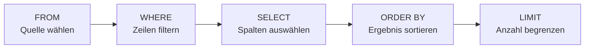
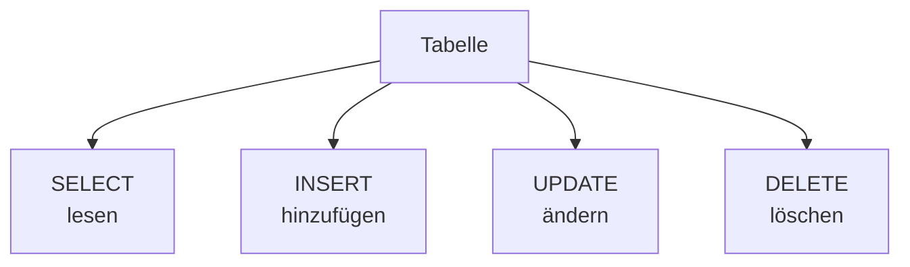

###### Themen

Grundlagen von SQL

- Aufbau und Grundidee von SQL-Befehlen verstehen
- Einfache Datentypen in SQL kennenlernen

Daten abfragen und filtern

- Daten mit SELECT auswählen
- Ergebnisse mit WHERE filtern
- Daten mit ORDER BY sortieren
- Ergebnismengen mit LIMIT begrenzen

Daten verändern

- Datensätze mit INSERT hinzufügen
- Datensätze mit UPDATE ändern
- Datensätze mit DELETE löschen

<br><br><br>
# 🧱 Grundlagen von SQL

SQL steht für **Structured Query Language**. Mit SQL sprichst du mit einer **relationalen Datenbank**. Das bedeutet: Die Daten liegen meist in **Tabellen**, die aus **Spalten** und **Zeilen** bestehen. Eine Spalte beschreibt, **welche Art von Information** gespeichert wird, und eine Zeile ist ein **konkreter Datensatz**.

Wenn du zum Beispiel eine Tabelle `produkte` hast, könnten dort solche Spalten stehen:

| id | name | kategorie | preis | lagerbestand |
|---|---|---|---:|---:|
| 1 | Tastatur | Hardware | 49.90 | 15 |
| 2 | Maus | Hardware | 19.90 | 42 |
| 3 | Monitor | Hardware | 249.00 | 8 |

SQL ist im Kern die Sprache, mit der du solche Daten:

- **abfragen**
- **filtern**
- **sortieren**
- **einfügen**
- **ändern**
- **löschen**

kannst.

Ein zentraler Punkt für dein technisches Grundverständnis ist: **SQL ist deklarativ**. Das heißt, du sagst der Datenbank **was** du haben möchtest, nicht im Detail **wie** sie es intern berechnen soll. Wenn du schreibst `SELECT name FROM produkte`, dann beschreibst du nur das gewünschte Ergebnis. Die Datenbank kümmert sich um die Ausführung. Genau das ist einer der wichtigsten Denkweisen in SQL.

<br><br><br>
## 🧠 Aufbau und Grundidee von SQL-Befehlen verstehen

Ein SQL-Befehl besteht meistens aus **klaren Bausteinen**, die jeweils eine bestimmte Aufgabe haben. Bei Abfragen sieht das oft so aus:

```sql
SELECT name, preis
FROM produkte
WHERE preis < 100
ORDER BY preis ASC
LIMIT 5;
```

Dieser Befehl bedeutet ganz einfach:

- **SELECT**: Welche Spalten willst du sehen?
- **FROM**: Aus welcher Tabelle sollen die Daten kommen?
- **WHERE**: Welche Zeilen sollen überhaupt berücksichtigt werden?
- **ORDER BY**: In welcher Reihenfolge sollen die Ergebnisse erscheinen?
- **LIMIT**: Wie viele Ergebnisse sollen maximal gezeigt werden?

`SELECT` ist der SQL-Befehl zum Abrufen von Daten aus einer oder mehreren Tabellen ([SELECT](https://www.postgresql.org/docs/current/sql-select.html)).

Wichtig ist: Nicht jeder Befehl braucht alle Teile. `WHERE`, `ORDER BY` und `LIMIT` sind oft **optional**. `SELECT` und `FROM` sind bei einfachen Abfragen fast immer der Kern.

<br><br><br>
### 🧭 Die Grundidee: SQL liest sich fast wie eine Frage

SQL ist deshalb so beliebt, weil es sich oft wie eine kleine Beschreibung lesen lässt. Schau dir diesen Befehl an:

```sql
SELECT name
FROM produkte
WHERE kategorie = 'Hardware';
```

Das kannst du fast in Alltagssprache lesen:

> Wähle den Namen aus der Tabelle `produkte`, aber nur dort, wo die Kategorie `Hardware` ist.

Genau dieses „in Bausteinen denken“ ist die wichtigste Grundlage. Wenn du SQL lernst, solltest du nicht nur einzelne Wörter auswendig lernen, sondern verstehen:

1. **Welche Datenquelle** wird benutzt?
2. **Welche Daten** sollen angezeigt werden?
3. **Welche Bedingungen** gelten?
4. **Wie** soll das Ergebnis aussehen?

Das ist viel wertvoller als reines Auswendiglernen.

<br><br><br>
### 🧱 Typischer Grundaufbau eines SQL-Befehls

Hier ist ein sehr allgemeines Muster:

```sql
SELECT spalte1, spalte2
FROM tabellenname
WHERE bedingung
ORDER BY spalte1
LIMIT 10;
```

Die Reihenfolge ist wichtig. SQL hat zwar viele Möglichkeiten, aber diese Struktur taucht immer wieder auf.

Ein paar praktische Regeln helfen dir am Anfang enorm:

- **SQL-Schlüsselwörter** wie `SELECT`, `FROM`, `WHERE` schreibt man oft groß, damit der Code besser lesbar ist. Pflicht ist das in den meisten Systemen aber nicht.
- **Textwerte** stehen normalerweise in **einfachen Anführungszeichen**, also zum Beispiel `'Hardware'`.
- **Zahlen** schreibt man ohne Anführungszeichen, also zum Beispiel `100`.
- Ein **Semikolon** `;` beendet häufig den Befehl, besonders in SQL-Tools oder Skripten.

<br><br><br>
### 🔄 In welcher Reihenfolge SQL „denkt“

Hier kommt ein Punkt, der viele Anfänger verwirrt: Die Reihenfolge, in der du SQL **schreibst**, ist nicht ganz dieselbe wie die Reihenfolge, in der die Datenbank die Logik **auswertet**.

Du schreibst meistens so:

```sql
SELECT ...
FROM ...
WHERE ...
ORDER BY ...
LIMIT ...
```

Gedanklich passiert es aber eher so:

1. **FROM** – aus welcher Tabelle kommen die Daten?
2. **WHERE** – welche Zeilen bleiben übrig?
3. **SELECT** – welche Spalten werden ausgegeben?
4. **ORDER BY** – wie wird sortiert?
5. **LIMIT** – wie viele Zeilen werden am Ende gezeigt?

Das ist ein extrem hilfreiches Denkmodell, weil du damit besser verstehst, warum eine Abfrage genau dieses Ergebnis liefert.



<br><br><br>
### 🧠 Warum dieses Strukturverständnis so wichtig ist

Wenn du SQL nur als Liste einzelner Befehle lernst, vergisst du es schnell wieder. Wenn du aber verstehst, dass ein SQL-Befehl fast immer aus denselben logischen Teilen besteht, wird alles viel einfacher.

Gerade in den Core-Tech-Fundamentals ist das entscheidend: Du willst nicht nur „wissen, dass `WHERE` filtert“, sondern ein Gefühl dafür entwickeln, **an welcher Stelle** `WHERE` im Gesamtaufbau sitzt und **welche Rolle** es im Datenfluss spielt.

Das ist echtes technisches Verständnis.

<br><br><br>
## 🧾 Einfache Datentypen in SQL kennenlernen

Jede Spalte in einer Tabelle hat einen **Datentyp**. Der Datentyp legt fest, **welche Art von Werten** dort gespeichert werden darf. Die Datenbank nutzt diese Information, um Daten korrekt zu speichern, zu prüfen und zu verarbeiten. PostgreSQL beschreibt Datentypen als Grundlage dafür, welche Art von Daten gespeichert werden kann ([Data Types](https://www.postgresql.org/docs/current/datatype.html)).

Einfach gesagt:

- Eine Spalte für Preise sollte ein **Zahlentyp** sein.
- Eine Spalte für Namen sollte ein **Texttyp** sein.
- Eine Spalte für ein Datum sollte ein **Datumstyp** sein.

Wenn du Datentypen sauber wählst, bekommst du weniger Fehler und sinnvollere Abfragen.

<br><br><br>
### 🔢 Häufige einfache SQL-Datentypen

Die Namen unterscheiden sich je nach Datenbanksystem manchmal leicht, aber die Grundidee ist fast überall gleich.

| Datentyp | Bedeutung | Beispielwert | Typische Verwendung |
|---|---|---|---|
| `INT` / `INTEGER` | Ganze Zahlen | `42` | IDs, Mengen, Zähler |
| `DECIMAL(p,s)` / `NUMERIC(p,s)` | Exakte Dezimalzahlen | `19.99` | Preise, Geldbeträge |
| `VARCHAR(n)` | Text mit maximaler Länge | `'Maus'` | Namen, Titel, kurze Texte |
| `TEXT` | Längerer Text | `'Beschreibung des Produkts'` | Freitext, Notizen |
| `BOOLEAN` | Wahr/Falsch | `TRUE` / `FALSE` | aktiv/inaktiv, ja/nein |
| `DATE` | Kalenderdatum | `'2026-03-24'` | Geburtsdatum, Bestelldatum |
| `TIMESTAMP` | Datum und Uhrzeit | `'2026-03-24 14:30:00'` | Logeinträge, Ereignisse |

Ein wichtiger Typ für Preise ist `NUMERIC` beziehungsweise `DECIMAL`, weil diese Typen **exakte** Dezimalwerte speichern können ([Data Types](https://www.postgresql.org/docs/current/datatype.html)). Für Geldbeträge ist das deutlich besser als ein ungenauer Fließkommawert.

<br><br><br>
### 📝 Beispiel für eine Tabelle mit Datentypen

```sql
CREATE TABLE produkte (
    id INTEGER,
    name VARCHAR(100),
    kategorie VARCHAR(50),
    preis DECIMAL(10,2),
    lagerbestand INTEGER,
    aktiv BOOLEAN,
    erstellt_am DATE
);
```

Hier siehst du gut, wie Datentypen zur Bedeutung der Spalte passen:

- `id` ist eine ganze Zahl
- `name` ist ein kurzer Text
- `preis` ist eine Dezimalzahl mit zwei Nachkommastellen
- `aktiv` ist ein Wahr/Falsch-Wert
- `erstellt_am` ist ein Datum

Das ist nicht nur Formalität. Die Datenbank kann dadurch besser prüfen, ob ein Wert sinnvoll ist. In eine `DATE`-Spalte gehört eben ein Datum und nicht einfach irgendein Wort.

<br><br><br>
### ❓ Der besondere Fall: `NULL`

Neben normalen Werten gibt es in SQL noch etwas sehr Wichtiges: **`NULL`**.

`NULL` bedeutet nicht „0“ und auch nicht „leerer Text“, sondern: **Es ist kein Wert vorhanden**. Dieser Unterschied ist in SQL zentral.

Beispiele:

- Preis = `0` → der Preis ist bekannt und beträgt null
- Name = `''` → der Text ist leer, aber es gibt einen Wert
- Lieferdatum = `NULL` → es ist kein Datum eingetragen

Warum ist das wichtig? Weil `NULL` in Abfragen **besonders behandelt** wird. Du prüfst nicht mit `= NULL`, sondern mit `IS NULL` oder `IS NOT NULL`.

Beispiel:

```sql
SELECT name
FROM produkte
WHERE erstellt_am IS NULL;
```

Das ist ein typischer Anfängerfehler: `WHERE erstellt_am = NULL` funktioniert nicht so, wie man denkt.

<br><br><br>
### 🧠 Wie du Datentypen richtig lernst

Beim Lernen solltest du Datentypen nicht einfach als Liste betrachten. Besser ist diese Denkweise:

- **Was soll die Spalte inhaltlich ausdrücken?**
- **Welche Operationen willst du später damit machen?**
- **Wie genau müssen die Werte sein?**

Ein Preis ist nicht einfach „eine Zahl“, sondern ein Wert, mit dem man rechnet und der exakt sein muss. Ein Datum ist nicht einfach „Text“, sondern etwas, worauf du später filtern, sortieren oder Zeiträume berechnen willst.

Genau diese Verbindung aus **Bedeutung**, **Speicherung** und **späterer Nutzung** macht gutes technisches Lernen aus.

<br><br><br>
# 🔎 Daten abfragen und filtern

Jetzt kommen wir zu dem Teil, mit dem man in SQL am häufigsten arbeitet: **Daten lesen**. Dafür benutzt man in erster Linie `SELECT`.

Um die Beispiele klar zu halten, nehmen wir diese Tabelle als gedankliche Grundlage:

```sql
produkte
```

mit den Spalten:

| id | name | kategorie | preis | lagerbestand | aktiv | erstellt_am |
|---|---|---|---:|---:|---|---|
| 1 | Tastatur | Hardware | 49.90 | 15 | TRUE | 2026-01-10 |
| 2 | Maus | Hardware | 19.90 | 42 | TRUE | 2026-01-11 |
| 3 | Monitor | Hardware | 249.00 | 8 | TRUE | 2026-01-12 |
| 4 | Editor Pro | Software | 99.00 | 999 | FALSE | 2026-01-13 |

<br><br><br>
## 📥 Daten mit `SELECT` auswählen

Mit `SELECT` wählst du aus, **welche Spalten** du sehen möchtest. `SELECT` liefert Zeilen aus einer Tabelle oder aus mehreren Tabellen zurück ([SELECT](https://www.postgresql.org/docs/current/sql-select.html)).

Der einfachste Fall:

```sql
SELECT name
FROM produkte;
```

Hier bekommst du nur die Spalte `name`.

Wenn du mehrere Spalten willst:

```sql
SELECT name, preis
FROM produkte;
```

Dann zeigt die Datenbank nur diese beiden Spalten an.

<br><br><br>
### 👀 `SELECT *` – alle Spalten auswählen

Wenn du alle Spalten sehen möchtest, kannst du `*` verwenden:

```sql
SELECT *
FROM produkte;
```

Das Sternchen bedeutet: **nimm alle Spalten**.

Das ist praktisch zum schnellen Nachsehen. In echter Praxis solltest du aber oft lieber die benötigten Spalten explizit nennen. Das macht Abfragen lesbarer und meist auch sauberer.

`SELECT *` ist also nicht „falsch“, aber oft nicht die beste Gewohnheit.

<br><br><br>
### 🏷️ Spalten umbenennen mit `AS`

Manchmal möchtest du eine Ausgabe verständlicher benennen:

```sql
SELECT name AS produktname, preis AS verkaufspreis
FROM produkte;
```

Dann erscheint in der Ausgabe statt `name` und `preis` ein anderer Spaltenname. Das ist besonders nützlich bei Berichten, APIs oder komplexeren Abfragen.

<br><br><br>
## 🧹 Ergebnisse mit `WHERE` filtern

Mit `WHERE` sagst du der Datenbank, **welche Zeilen** du überhaupt haben möchtest. Die `WHERE`-Klausel filtert Zeilen anhand einer Bedingung ([SELECT](https://www.postgresql.org/docs/current/sql-select.html)).

Beispiel:

```sql
SELECT name, preis
FROM produkte
WHERE preis < 100;
```

Das bedeutet: Zeige nur Produkte, deren Preis kleiner als 100 ist.

Ohne `WHERE` bekommst du alle Zeilen. Mit `WHERE` verkleinerst du die Ergebnismenge auf die Datensätze, die wirklich relevant sind.

<br><br><br>
### ⚖️ Wichtige Vergleichsoperatoren in `WHERE`

Hier sind die wichtigsten Operatoren, die du fast immer brauchst:

| Operator | Bedeutung | Beispiel |
|---|---|---|
| `=` | gleich | `preis = 19.90` |
| `<>` oder `!=` | ungleich | `kategorie <> 'Software'` |
| `>` | größer als | `preis > 100` |
| `<` | kleiner als | `preis < 100` |
| `>=` | größer oder gleich | `lagerbestand >= 10` |
| `<=` | kleiner oder gleich | `lagerbestand <= 5` |

Beispiele:

```sql
SELECT *
FROM produkte
WHERE kategorie = 'Hardware';
```

```sql
SELECT *
FROM produkte
WHERE lagerbestand <= 10;
```

```sql
SELECT *
FROM produkte
WHERE aktiv = TRUE;
```

<br><br><br>
### 🔗 Mehrere Bedingungen kombinieren

Du kannst Bedingungen kombinieren mit:

- `AND` → beide Bedingungen müssen wahr sein
- `OR` → mindestens eine Bedingung muss wahr sein
- `NOT` → Bedingung wird verneint

Beispiel mit `AND`:

```sql
SELECT name, preis
FROM produkte
WHERE kategorie = 'Hardware' AND preis < 100;
```

Das heißt: Nur Hardware-Produkte, die weniger als 100 kosten.

Beispiel mit `OR`:

```sql
SELECT name
FROM produkte
WHERE kategorie = 'Hardware' OR kategorie = 'Software';
```

Beispiel mit `NOT`:

```sql
SELECT name
FROM produkte
WHERE NOT aktiv = TRUE;
```

Oft lesbarer wäre hier:

```sql
SELECT name
FROM produkte
WHERE aktiv = FALSE;
```

Wenn du mehrere Bedingungen mischst, sind Klammern sehr hilfreich:

```sql
SELECT *
FROM produkte
WHERE (kategorie = 'Hardware' OR kategorie = 'Software')
  AND preis < 100;
```

So machst du deine Absicht eindeutig.

<br><br><br>
### 🚫 Filtern mit `NULL`

Wie oben schon erklärt, wird `NULL` in SQL speziell behandelt. Deshalb filterst du fehlende Werte so:

```sql
SELECT *
FROM produkte
WHERE erstellt_am IS NULL;
```

Und vorhandene Werte so:

```sql
SELECT *
FROM produkte
WHERE erstellt_am IS NOT NULL;
```

Das ist sehr wichtig, weil `= NULL` und `<> NULL` nicht so funktionieren wie normale Vergleiche.

<br><br><br>
## ↕️ Daten mit `ORDER BY` sortieren

Mit `ORDER BY` legst du fest, **in welcher Reihenfolge** das Ergebnis erscheinen soll. Die `ORDER BY`-Klausel sortiert die zurückgegebenen Zeilen ([SELECT](https://www.postgresql.org/docs/current/sql-select.html)).

Ein einfaches Beispiel:

```sql
SELECT name, preis
FROM produkte
ORDER BY preis;
```

Standardmäßig ist die Sortierung meist **aufsteigend**, also klein nach groß. Das entspricht `ASC`.

Explizit aufsteigend:

```sql
SELECT name, preis
FROM produkte
ORDER BY preis ASC;
```

Absteigend:

```sql
SELECT name, preis
FROM produkte
ORDER BY preis DESC;
```

Dann steht das teuerste Produkt zuerst.

<br><br><br>
### 🧩 Nach mehreren Spalten sortieren

Du kannst auch nach mehreren Kriterien sortieren:

```sql
SELECT name, kategorie, preis
FROM produkte
ORDER BY kategorie ASC, preis DESC;
```

Das bedeutet:

1. zuerst nach `kategorie` sortieren
2. innerhalb jeder Kategorie nach `preis` absteigend

Das ist sehr nützlich, wenn du strukturierte Listen brauchst.

<br><br><br>
### 🧠 Warum Sortierung fachlich wichtig ist

Ohne `ORDER BY` solltest du **niemals davon ausgehen**, dass die Daten in einer bestimmten Reihenfolge zurückkommen. Eine Datenbank gibt Ergebnisse nur dann garantiert sortiert zurück, wenn du die Sortierung ausdrücklich angibst ([SELECT](https://www.postgresql.org/docs/current/sql-select.html)).

Das ist ein ganz wichtiger Core-Tech-Grundsatz: **Wenn dir die Reihenfolge wichtig ist, musst du sie explizit definieren**.

<br><br><br>
## ✂️ Ergebnismengen mit `LIMIT` begrenzen

Mit `LIMIT` begrenzt du, **wie viele Zeilen** maximal zurückgegeben werden. In PostgreSQL ist `LIMIT` Teil der `SELECT`-Syntax ([SELECT](https://www.postgresql.org/docs/current/sql-select.html)).

Beispiel:

```sql
SELECT *
FROM produkte
LIMIT 3;
```

Dann bekommst du höchstens drei Zeilen.

Das ist nützlich, wenn du:

- nur einen kleinen Ausschnitt sehen willst
- große Tabellen testweise abfragst
- Vorschauen oder Top-Listen bauen möchtest

<br><br><br>
### 🎯 `LIMIT` fast immer zusammen mit `ORDER BY`

Ein sehr wichtiger Praxispunkt: `LIMIT` ohne `ORDER BY` ist oft fachlich unsauber, wenn du eine bestimmte Auswahl erwartest.

Beispiel:

```sql
SELECT name, preis
FROM produkte
ORDER BY preis DESC
LIMIT 2;
```

Das bedeutet: Zeige die **zwei teuersten Produkte**.

Ohne `ORDER BY` wäre nur klar: „Zeige irgendeine Teilmenge von zwei Zeilen.“ Welche zwei genau, ist dann nicht zuverlässig festgelegt.

Gerade für richtiges Lernen ist dieser Unterschied wichtig: Du solltest nicht nur Syntax kennen, sondern verstehen, **wann ein Befehl fachlich sinnvoll** ist.

<br><br><br>
### 🧠 Kleine Anmerkung zu Datenbanksystemen

`LIMIT` ist in vielen Datenbanksystemen verbreitet, etwa in PostgreSQL, MySQL und SQLite. Andere Systeme oder der SQL-Standard verwenden teils alternative Formen wie `FETCH FIRST ... ROWS ONLY` ([SELECT](https://www.postgresql.org/docs/current/sql-select.html)).

Für die Grundlagen ist `LIMIT` aber ein sehr guter und verbreiteter Einstieg.

<br><br><br>
# ✍️ Daten verändern

Bis hierhin ging es um das **Lesen** von Daten. Jetzt geht es um Befehle, die die gespeicherten Daten **wirklich verändern**.

Die drei wichtigsten Grundbefehle sind:

| Befehl | Wirkung |
|---|---|
| `INSERT` | neue Datensätze hinzufügen |
| `UPDATE` | bestehende Datensätze ändern |
| `DELETE` | Datensätze löschen |

Diese Befehle sind mächtig. Genau deshalb muss man mit ihnen besonders sorgfältig arbeiten.

Ein ganz wichtiger Denkfehler am Anfang ist: Eine `SELECT`-Abfrage zeigt nur etwas an. Ein `INSERT`, `UPDATE` oder `DELETE` verändert dagegen den tatsächlichen Zustand der Datenbank.

<br><br><br>
## ➕ Datensätze mit `INSERT` hinzufügen

`INSERT` fügt neue Zeilen in eine Tabelle ein ([INSERT](https://www.postgresql.org/docs/current/sql-insert.html)).

Der typische Aufbau ist:

```sql
INSERT INTO tabellenname (spalte1, spalte2, spalte3)
VALUES (wert1, wert2, wert3);
```

Ein konkretes Beispiel:

```sql
INSERT INTO produkte (id, name, kategorie, preis, lagerbestand, aktiv, erstellt_am)
VALUES (5, 'Webcam', 'Hardware', 79.90, 20, TRUE, '2026-01-20');
```

Damit wird ein neuer Datensatz in die Tabelle `produkte` geschrieben.

<br><br><br>
### 🧱 Warum du die Spaltenliste fast immer angeben solltest

Man kann in manchen Fällen auch ohne Spaltenliste arbeiten, aber das ist am Anfang und in echter Praxis oft unnötig riskant.

Schlechter lesbar wäre zum Beispiel:

```sql
INSERT INTO produkte
VALUES (5, 'Webcam', 'Hardware', 79.90, 20, TRUE, '2026-01-20');
```

Das Problem: Dann muss die Reihenfolge der Werte **exakt** zur Tabellenstruktur passen. Wenn sich die Tabelle später ändert, kann das schnell schiefgehen.

Sauberer ist deshalb fast immer:

```sql
INSERT INTO produkte (id, name, kategorie, preis, lagerbestand, aktiv, erstellt_am)
VALUES (5, 'Webcam', 'Hardware', 79.90, 20, TRUE, '2026-01-20');
```

Diese Form ist klar, robust und gut lesbar.

<br><br><br>
### 📦 Mehrere Datensätze auf einmal einfügen

Du kannst auch mehrere Zeilen in einem Befehl einfügen:

```sql
INSERT INTO produkte (id, name, kategorie, preis, lagerbestand, aktiv, erstellt_am)
VALUES
    (6, 'Headset', 'Hardware', 59.90, 12, TRUE, '2026-01-21'),
    (7, 'Dockingstation', 'Hardware', 129.00, 7, TRUE, '2026-01-22');
```

Das ist oft praktischer als viele einzelne `INSERT`-Befehle nacheinander.

<br><br><br>
## 🛠️ Datensätze mit `UPDATE` ändern

`UPDATE` ändert bestehende Zeilen in einer Tabelle ([UPDATE](https://www.postgresql.org/docs/current/sql-update.html)).

Die Grundform ist:

```sql
UPDATE tabellenname
SET spalte1 = wert1, spalte2 = wert2
WHERE bedingung;
```

Beispiel:

```sql
UPDATE produkte
SET preis = 89.90
WHERE id = 5;
```

Damit wird beim Produkt mit der `id` 5 der Preis geändert.

Das Entscheidende ist hier die `WHERE`-Bedingung. Sie legt fest, **welche Zeilen** geändert werden.

<br><br><br>
### ⚠️ Der wichtigste Sicherheitsgedanke bei `UPDATE`

Wenn du `WHERE` weglässt, werden **alle Zeilen** aktualisiert. Genau darauf weist die SQL-Dokumentation hin: Ohne `WHERE` betrifft ein `UPDATE` sämtliche Zeilen der Tabelle ([UPDATE](https://www.postgresql.org/docs/current/sql-update.html)).

Beispiel:

```sql
UPDATE produkte
SET aktiv = FALSE;
```

Das würde alle Produkte auf inaktiv setzen.

Deshalb ist `UPDATE` einer der Befehle, bei denen du immer kurz innerlich prüfen solltest:

> Will ich wirklich genau diese Zeilen ändern?

Dieser Kontrollgedanke ist Teil guter technischer Praxis.

<br><br><br>
### 🔧 Mehrere Spalten gleichzeitig ändern

Du kannst mit einem `UPDATE` mehrere Spalten auf einmal ändern:

```sql
UPDATE produkte
SET preis = 69.90,
    lagerbestand = 25,
    aktiv = TRUE
WHERE id = 5;
```

Das ist sehr nützlich, wenn mehrere Werte zusammen aktualisiert werden sollen.

Du kannst in `SET` auch auf bestehende Werte Bezug nehmen, zum Beispiel:

```sql
UPDATE produkte
SET lagerbestand = lagerbestand - 1
WHERE id = 5;
```

Das bedeutet: Den aktuellen Lagerbestand um 1 reduzieren.

Gerade hier sieht man schön, dass SQL nicht nur speichert, sondern auch logisch mit Daten arbeitet.

<br><br><br>
## 🗑️ Datensätze mit `DELETE` löschen

`DELETE` entfernt Zeilen aus einer Tabelle ([DELETE](https://www.postgresql.org/docs/current/sql-delete.html)).

Die Grundform lautet:

```sql
DELETE FROM tabellenname
WHERE bedingung;
```

Beispiel:

```sql
DELETE FROM produkte
WHERE id = 5;
```

Damit wird genau der Datensatz mit `id = 5` gelöscht.

<br><br><br>
### ⚠️ Der wichtigste Sicherheitsgedanke bei `DELETE`

Auch bei `DELETE` gilt: Wenn du `WHERE` weglässt, werden **alle Zeilen** gelöscht. Die Dokumentation beschreibt, dass ohne `WHERE` sämtliche Zeilen der Tabelle entfernt werden ([DELETE](https://www.postgresql.org/docs/current/sql-delete.html)).

Beispiel:

```sql
DELETE FROM produkte;
```

Die Tabelle selbst bleibt dabei normalerweise bestehen, aber ihr Inhalt wäre leer.

Das ist ein klassischer Fehler bei Einsteigern. Deshalb solltest du dir angewöhnen, vor `UPDATE` und `DELETE` immer noch einmal die Bedingung zu prüfen.

<br><br><br>
### 🧠 Ein sehr guter Praxisgedanke vor Änderungen

Gerade am Anfang ist diese Reihenfolge sinnvoll:

1. erst mit `SELECT` prüfen, **welche Zeilen betroffen wären**
2. dann denselben Filter in `UPDATE` oder `DELETE` verwenden

Beispiel:

```sql
SELECT *
FROM produkte
WHERE id = 5;
```

Wenn das genau die richtige Zeile zeigt, kannst du danach sicherer schreiben:

```sql
DELETE FROM produkte
WHERE id = 5;
```

Das ist keine Übung, sondern eine professionelle Denkweise: **erst sichtbar machen, dann verändern**.

<br><br><br>
## 🔗 Wie die Befehle zusammenhängen

Wenn du die Grundbefehle als Ganzes betrachtest, dann ergibt sich ein sauberes mentales Modell:



`SELECT` verändert nichts, sondern liest nur.  
`INSERT`, `UPDATE` und `DELETE` verändern dagegen den Datenbestand tatsächlich ([SELECT](https://www.postgresql.org/docs/current/sql-select.html)) ([INSERT](https://www.postgresql.org/docs/current/sql-insert.html)) ([UPDATE](https://www.postgresql.org/docs/current/sql-update.html)) ([DELETE](https://www.postgresql.org/docs/current/sql-delete.html)).

Wenn du dieses Modell wirklich verstehst, dann hast du bereits einen sehr soliden Einstieg in SQL geschafft: Du erkennst, welche Befehle Daten **anzeigen** und welche Befehle Daten **dauerhaft verändern**. Genau das ist ein zentrales Fundament für alles, was später in Datenbanken, Backends, APIs und Datenanalyse folgt.