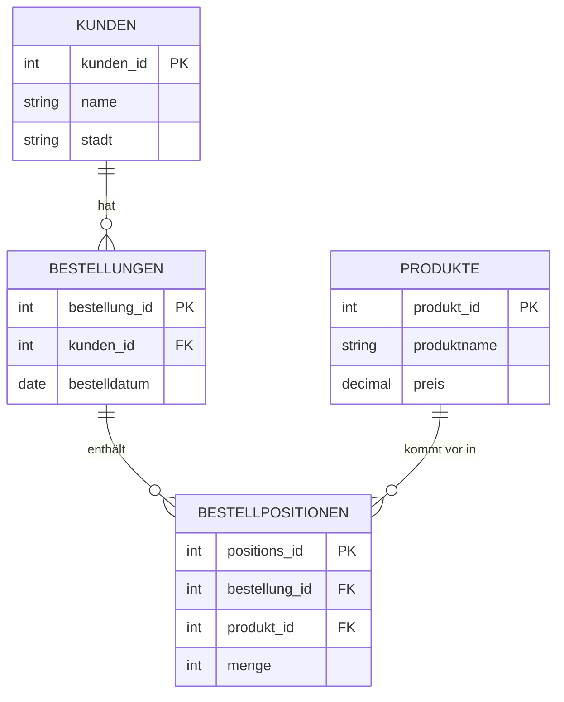

###### Themen

Daten aus mehreren Tabellen abfragen

- Grundidee von Joins verstehen
- INNER JOIN und LEFT JOIN in einfachen Beispielen anwenden

Einfache Auswertungen mit SQL

- Daten mit GROUP BY gruppieren
- Aggregatfunktionen wie COUNT, SUM und AVG einsetzen

Praktische Anwendung

- Einfache SQL-Abfragen auf ein kleines Beispieldatenmodell anwenden
- Ergebnisse prüfen und typische Fehler erkennen

<br><br><br>

# 🗃️ Daten aus mehreren Tabellen abfragen

In echten Datenbanken liegen Informationen fast nie in nur **einer einzigen Tabelle**. Stattdessen werden Daten sauber auf mehrere Tabellen verteilt. Das ist kein Selbstzweck, sondern hat einen sehr praktischen Grund: So vermeidest du doppelte Daten, hältst Informationen konsistent und kannst sie flexibler auswerten. Dieses Grundprinzip nennt man in relationalen Datenbanken **Normalisierung** bzw. das Arbeiten mit Beziehungen zwischen Tabellen ([PostgreSQL Documentation: `SELECT`](https://www.postgresql.org/docs/current/sql-select.html)).

Stell dir zum Beispiel einen kleinen Online-Shop vor. Wenn du Kunden, Bestellungen und Produkte alle in eine einzige Tabelle schreibst, wiederholen sich Kundennamen, E-Mail-Adressen und Produktinformationen ständig. Das macht Daten unübersichtlich und fehleranfällig. Deshalb trennt man solche Informationen in mehrere Tabellen und verbindet sie später bei Bedarf wieder miteinander. Genau dafür gibt es **Joins**.

<br><br><br>

## 🔗 Die Grundidee von Verknüpfungen mit `JOIN`

Ein `JOIN` verbindet Zeilen aus mehreren Tabellen anhand einer gemeinsamen Spalte. In der Praxis ist das meist eine Beziehung zwischen:

- einem **Primärschlüssel** (`PRIMARY KEY`) in einer Tabelle
- und einem **Fremdschlüssel** (`FOREIGN KEY`) in einer anderen Tabelle

Ein Primärschlüssel identifiziert einen Datensatz eindeutig. Ein Fremdschlüssel verweist auf einen Datensatz in einer anderen Tabelle. Dadurch entsteht eine Beziehung zwischen den Tabellen.

Nehmen wir dieses kleine Beispieldatenmodell:

<br><br><br>

### 🧱 Kleines Beispieldatenmodell



Hier bedeutet das:

- Ein Kunde kann mehrere Bestellungen haben.
- Eine Bestellung gehört genau einem Kunden.
- Eine Bestellung kann mehrere Positionen enthalten.
- Eine Position verweist auf genau ein Produkt.

So ein Modell ist typisch für relationale Datenbanken.

<br><br><br>

### 🧾 Beispieltabellen mit Daten

Damit die SQL-Abfragen greifbar werden, arbeiten wir mit einfachen Beispieldaten.

**Tabelle `kunden`**

| kunden_id | name   | stadt   |
|----------:|--------|---------|
| 1         | Anna   | Berlin  |
| 2         | Ben    | Hamburg |
| 3         | Clara  | Köln    |

**Tabelle `bestellungen`**

| bestellung_id | kunden_id | bestelldatum |
|--------------:|----------:|--------------|
| 101           | 1         | 2025-01-10   |
| 102           | 1         | 2025-01-15   |
| 103           | 2         | 2025-01-20   |

Hier siehst du schon die Beziehung:

- `kunden.kunden_id` ist der Primärschlüssel der Kundentabelle.
- `bestellungen.kunden_id` ist der Fremdschlüssel, der auf den Kunden zeigt.

Das heißt: Bestellung `101` gehört zu Kunde `1`, also Anna.

<br><br><br>

## 🧠 Warum man `JOIN` überhaupt braucht

Wenn du nur die Tabelle `bestellungen` anschaust, siehst du zwar, **welcher Kunde per ID** bestellt hat, aber nicht direkt den Kundennamen. Wenn du also wissen willst:

> „Welche Bestellungen hat Anna gemacht?“

dann musst du `bestellungen` mit `kunden` verknüpfen.

Genau das macht ein `JOIN`: Er baut zur Laufzeit eine Sicht auf die verbundenen Daten auf. Wichtig ist dabei: Ein `JOIN` verändert die Tabellen nicht dauerhaft. Er beeinflusst nur das Ergebnis deiner Abfrage.

<br><br><br>

## 🔍 `INNER JOIN` einfach erklärt

Ein `INNER JOIN` liefert **nur die Datensätze, für die es in beiden Tabellen eine passende Verbindung gibt** ([PostgreSQL Documentation: `SELECT`](https://www.postgresql.org/docs/current/sql-select.html)).

Anders gesagt:

- Wenn links ein Datensatz steht, aber rechts kein passender gefunden wird, fliegt er raus.
- Wenn rechts ein Datensatz steht, aber links keiner passt, erscheint er ebenfalls nicht.

<br><br><br>

### 🧪 Einfaches Beispiel mit `INNER JOIN`

```sql
SELECT
    k.name,
    b.bestellung_id,
    b.bestelldatum
FROM kunden k
INNER JOIN bestellungen b
    ON k.kunden_id = b.kunden_id;
```

**Was passiert hier?**

- `FROM kunden k` sagt: Starte mit der Tabelle `kunden`.
- `INNER JOIN bestellungen b` sagt: Verbinde sie mit `bestellungen`.
- `ON k.kunden_id = b.kunden_id` sagt: Verbinde die Zeilen dort, wo die Kunden-ID gleich ist.

**Ergebnis:**

| name  | bestellung_id | bestelldatum |
|-------|---------------|--------------|
| Anna  | 101           | 2025-01-10   |
| Anna  | 102           | 2025-01-15   |
| Ben   | 103           | 2025-01-20   |

Clara taucht hier **nicht** auf, weil sie keine Bestellung hat. Genau das ist typisch für einen `INNER JOIN`: Es werden nur Zeilen gezeigt, die wirklich zusammenpassen.

<br><br><br>

### 👀 So kannst du den `INNER JOIN` gedanklich lesen

Du kannst die Abfrage fast wie einen Satz lesen:

> Hole mir aus `kunden` und `bestellungen` alle Kombinationen, bei denen die `kunden_id` auf beiden Seiten übereinstimmt.

Das ist ein sehr gutes Lernmuster: Lies SQL nicht nur als Code, sondern als **Anweisung in Alltagssprache**.

<br><br><br>

## ↩️ `LEFT JOIN` einfach erklärt

Ein `LEFT JOIN` liefert **alle Zeilen aus der linken Tabelle** und ergänzt passende Daten aus der rechten Tabelle. Wenn rechts nichts gefunden wird, kommen dort `NULL`-Werte heraus ([PostgreSQL Documentation: `SELECT`](https://www.postgresql.org/docs/current/sql-select.html)).

Das ist der zentrale Unterschied zum `INNER JOIN`:

- `INNER JOIN`: Nur Treffer auf beiden Seiten
- `LEFT JOIN`: Alles von links, Treffer von rechts wenn vorhanden

<br><br><br>

### 🧪 Einfaches Beispiel mit `LEFT JOIN`

```sql
SELECT
    k.name,
    b.bestellung_id,
    b.bestelldatum
FROM kunden k
LEFT JOIN bestellungen b
    ON k.kunden_id = b.kunden_id;
```

**Ergebnis:**

| name  | bestellung_id | bestelldatum |
|-------|---------------|--------------|
| Anna  | 101           | 2025-01-10   |
| Anna  | 102           | 2025-01-15   |
| Ben   | 103           | 2025-01-20   |
| Clara | NULL          | NULL         |

Jetzt erscheint auch Clara. Warum? Weil `kunden` links steht und der `LEFT JOIN` alle linken Datensätze behält.

Das ist unglaublich nützlich, wenn du wissen willst:

- Welche Kunden haben bestellt?
- Welche Kunden haben **noch nie** bestellt?
- Welche Produkte wurden **noch nie** verkauft?

<br><br><br>

### 🧭 Wann nimmt man `INNER JOIN`, wann `LEFT JOIN`?

| Situation | Passender Join |
|----------|----------------|
| Du willst nur Datensätze mit echter Zuordnung sehen | `INNER JOIN` |
| Du willst alle Datensätze der linken Tabelle sehen, auch ohne Treffer | `LEFT JOIN` |

Ein sehr typischer Denkfehler ist dieser:

> „Ich möchte alle Kunden sehen und, falls vorhanden, ihre Bestellungen.“

Dann ist `LEFT JOIN` richtig.

Wenn du stattdessen sagst:

> „Ich möchte nur Kunden sehen, die bestellt haben.“

Dann ist `INNER JOIN` passend.

<br><br><br>

## ⚠️ Die Bedeutung der `ON`-Bedingung

Die `ON`-Bedingung ist bei Joins entscheidend. Sie legt fest, **welche Zeilen überhaupt zusammengehören**.

Richtig wäre hier:

```sql
ON k.kunden_id = b.kunden_id
```

Wenn du versehentlich die falschen Spalten vergleichst, bekommst du falsche oder viel zu viele Ergebnisse.

Zum Beispiel wäre das problematisch:

```sql
ON k.kunden_id = b.bestellung_id
```

Das wäre fachlich unsinnig, weil eine Kunden-ID etwas anderes ist als eine Bestell-ID. SQL führt die Abfrage eventuell trotzdem aus, aber das Ergebnis wäre inhaltlich falsch.

<br><br><br>

### 🧨 Typischer Fehler: Join ohne passende Bedingung

Wenn du Tabellen kombinierst, ohne sie korrekt zu verknüpfen, kann es zu einer **kartesischen Kombination** kommen. Dann wird im Prinzip jede Zeile der ersten Tabelle mit jeder Zeile der zweiten Tabelle kombiniert. Das führt schnell zu viel zu vielen Ergebnissen ([PostgreSQL Documentation: `FROM`](https://www.postgresql.org/docs/current/sql-select.html)).

Beispielhaft:

- 3 Kunden
- 3 Bestellungen

Ohne saubere Join-Bedingung könnten daraus 9 Zeilen werden.

Das ist einer der häufigsten Anfängerfehler.

<br><br><br>

## 🛠️ Mehrere Tabellen gleichzeitig verbinden

Joins sind nicht auf zwei Tabellen beschränkt. In der Praxis verknüpfst du oft drei oder mehr Tabellen.

Nehmen wir weitere Beispieldaten:

**Tabelle `produkte`**

| produkt_id | produktname | preis |
|-----------:|-------------|------:|
| 10         | Tastatur    | 50.00 |
| 11         | Maus        | 25.00 |
| 12         | Monitor     | 200.00 |

**Tabelle `bestellpositionen`**

| positions_id | bestellung_id | produkt_id | menge |
|-------------:|--------------:|-----------:|------:|
| 1            | 101           | 10         | 1     |
| 2            | 101           | 11         | 2     |
| 3            | 102           | 12         | 1     |
| 4            | 103           | 11         | 1     |

Jetzt kannst du eine Abfrage bauen, die Kunden, Bestellungen und Produkte zusammenzieht.

```sql
SELECT
    k.name,
    b.bestellung_id,
    p.produktname,
    bp.menge
FROM kunden k
INNER JOIN bestellungen b
    ON k.kunden_id = b.kunden_id
INNER JOIN bestellpositionen bp
    ON b.bestellung_id = bp.bestellung_id
INNER JOIN produkte p
    ON bp.produkt_id = p.produkt_id;
```

**Ergebnis:**

| name  | bestellung_id | produktname | menge |
|-------|---------------|-------------|------:|
| Anna  | 101           | Tastatur    | 1     |
| Anna  | 101           | Maus        | 2     |
| Anna  | 102           | Monitor     | 1     |
| Ben   | 103           | Maus        | 1     |

Hier siehst du sehr schön, was ein relationales Modell bringt: Jede Information liegt an ihrem logischen Ort, und durch Joins kannst du sie bei Bedarf zusammensetzen.

<br><br><br>

# 📊 Einfache Auswertungen mit SQL

SQL ist nicht nur zum Anzeigen einzelner Datensätze da. Eine der größten Stärken ist, dass du Daten sehr schnell **zusammenfassen, zählen und berechnen** kannst. Genau hier kommen `GROUP BY` und Aggregatfunktionen ins Spiel.

<br><br><br>

## 🧩 Daten mit `GROUP BY` gruppieren

`GROUP BY` fasst Zeilen zusammen, die in einer bestimmten Spalte denselben Wert haben. Danach kannst du pro Gruppe Berechnungen durchführen, zum Beispiel zählen oder summieren ([PostgreSQL Documentation: `GROUP BY`](https://www.postgresql.org/docs/current/sql-select.html)).

Ein einfaches Beispiel:

```sql
SELECT
    kunden_id
FROM bestellungen
GROUP BY kunden_id;
```

Diese Abfrage gruppiert alle Bestellungen nach Kunde. Das Ergebnis enthält jede `kunden_id` nur einmal.

Spannend wird es aber erst mit Aggregatfunktionen.

<br><br><br>

## 🔢 Aggregatfunktionen: `COUNT`, `SUM` und `AVG`

Aggregatfunktionen berechnen einen Wert über mehrere Zeilen hinweg, zum Beispiel:

- `COUNT(...)` zählt
- `SUM(...)` summiert
- `AVG(...)` berechnet den Durchschnitt

Diese Funktionen gehören zu den grundlegenden SQL-Aggregaten ([PostgreSQL Documentation: Aggregate Functions](https://www.postgresql.org/docs/current/functions-aggregate.html)).

<br><br><br>

### 🔍 `COUNT` verwenden

Mit `COUNT` kannst du Zeilen zählen.

```sql
SELECT COUNT(*) AS anzahl_bestellungen
FROM bestellungen;
```

**Ergebnis:**

| anzahl_bestellungen |
|--------------------:|
| 3                   |

Das bedeutet: Es gibt insgesamt 3 Bestellungen.

Wichtig ist ein feiner Unterschied:

- `COUNT(*)` zählt alle Zeilen
- `COUNT(spalte)` zählt nur Zeilen, in denen diese Spalte **nicht `NULL`** ist ([PostgreSQL Documentation: Aggregate Functions](https://www.postgresql.org/docs/current/functions-aggregate.html))

Das ist fachlich sehr wichtig, besonders bei `LEFT JOIN`.

<br><br><br>

### ➕ `SUM` verwenden

Mit `SUM` addierst du numerische Werte.

Wenn du den Gesamtumsatz über Positionen berechnen willst, musst du Preis mal Menge rechnen:

```sql
SELECT
    SUM(p.preis * bp.menge) AS gesamtumsatz
FROM bestellpositionen bp
INNER JOIN produkte p
    ON bp.produkt_id = p.produkt_id;
```

**Berechnung im Hintergrund:**

- Tastatur: `50 * 1 = 50`
- Maus: `25 * 2 = 50`
- Monitor: `200 * 1 = 200`
- Maus: `25 * 1 = 25`

Gesamt: `325`

**Ergebnis:**

| gesamtumsatz |
|-------------:|
| 325.00       |

<br><br><br>

### 📏 `AVG` verwenden

Mit `AVG` berechnest du einen Durchschnitt.

Zum Beispiel den durchschnittlichen Produktpreis:

```sql
SELECT
    AVG(preis) AS durchschnittspreis
FROM produkte;
```

**Berechnung:**

- 50
- 25
- 200

Durchschnitt = `(50 + 25 + 200) / 3 = 91.67`

**Ergebnis:**

| durchschnittspreis |
|-------------------:|
| 91.67              |

Auch `AVG` ignoriert `NULL`-Werte bei der Berechnung ([PostgreSQL Documentation: Aggregate Functions](https://www.postgresql.org/docs/current/functions-aggregate.html)).

<br><br><br>

## 🧠 `GROUP BY` und Aggregatfunktionen zusammen einsetzen

Erst durch die Kombination von `GROUP BY` und Aggregatfunktionen entstehen typische Auswertungen.

Zum Beispiel:

> Wie viele Bestellungen hat jeder Kunde?

```sql
SELECT
    kunden_id,
    COUNT(*) AS anzahl_bestellungen
FROM bestellungen
GROUP BY kunden_id;
```

**Ergebnis:**

| kunden_id | anzahl_bestellungen |
|----------:|--------------------:|
| 1         | 2                   |
| 2         | 1                   |

Kunde `3` fehlt hier, weil in `bestellungen` keine Zeile für Clara existiert. Wenn du **auch Kunden ohne Bestellung** sehen willst, brauchst du `LEFT JOIN`.

<br><br><br>

### 🔗 Gruppieren nach Kundennamen statt Kunden-ID

Oft willst du keine nackten IDs sehen, sondern sprechende Informationen.

```sql
SELECT
    k.name,
    COUNT(b.bestellung_id) AS anzahl_bestellungen
FROM kunden k
LEFT JOIN bestellungen b
    ON k.kunden_id = b.kunden_id
GROUP BY k.name;
```

**Ergebnis:**

| name  | anzahl_bestellungen |
|-------|--------------------:|
| Anna  | 2                   |
| Ben   | 1                   |
| Clara | 0                   |

Hier ist die Kombination fachlich sehr schön:

- `LEFT JOIN`, damit alle Kunden vorkommen
- `COUNT(b.bestellung_id)`, damit nur echte Bestellungen gezählt werden
- `GROUP BY k.name`, damit pro Kunde genau eine Zeile entsteht

Warum `COUNT(b.bestellung_id)` und nicht `COUNT(*)`?  
Weil `COUNT(*)` auch die durch den `LEFT JOIN` entstandene Zeile für Clara zählen würde. `COUNT(b.bestellung_id)` zählt nur nicht-`NULL`-Werte und liefert deshalb korrekt `0` statt `1` ([PostgreSQL Documentation: Aggregate Functions](https://www.postgresql.org/docs/current/functions-aggregate.html)).

Das ist ein ganz klassischer Punkt, an dem viele am Anfang stolpern.

<br><br><br>

### 💶 Umsatz pro Kunde berechnen

Jetzt wird es realistischer: Wir verbinden mehrere Tabellen und berechnen pro Kunde einen Gesamtwert.

```sql
SELECT
    k.name,
    SUM(p.preis * bp.menge) AS umsatz
FROM kunden k
INNER JOIN bestellungen b
    ON k.kunden_id = b.kunden_id
INNER JOIN bestellpositionen bp
    ON b.bestellung_id = bp.bestellung_id
INNER JOIN produkte p
    ON bp.produkt_id = p.produkt_id
GROUP BY k.name;
```

**Ergebnis:**

| name | umsatz |
|------|-------:|
| Anna | 300.00 |
| Ben  | 25.00  |

**Wie kommt das zustande?**

Für Anna:

- Bestellung 101:
  - Tastatur: `50 * 1 = 50`
  - Maus: `25 * 2 = 50`
- Bestellung 102:
  - Monitor: `200 * 1 = 200`

Gesamt: `300`

Für Ben:

- Bestellung 103:
  - Maus: `25 * 1 = 25`

Gesamt: `25`

Clara taucht nicht auf, weil hier `INNER JOIN` verwendet wird. Wenn du alle Kunden mit Umsatz sehen willst, auch mit `0`, müsstest du wieder mit `LEFT JOIN` arbeiten.

<br><br><br>

### 📦 Verkaufsmenge pro Produkt

```sql
SELECT
    p.produktname,
    SUM(bp.menge) AS verkaufte_menge
FROM produkte p
LEFT JOIN bestellpositionen bp
    ON p.produkt_id = bp.produkt_id
GROUP BY p.produktname;
```

**Ergebnis:**

| produktname | verkaufte_menge |
|-------------|----------------:|
| Tastatur    | 1               |
| Maus        | 3               |
| Monitor     | 1               |

Wenn es Produkte gäbe, die nie verkauft wurden, würden sie dank `LEFT JOIN` trotzdem auftauchen. Allerdings wäre die Summe dann oft `NULL`, nicht automatisch `0`. In solchen Fällen nutzt man häufig `COALESCE`, um `NULL` durch `0` zu ersetzen ([PostgreSQL Documentation: Conditional Expressions](https://www.postgresql.org/docs/current/functions-conditional.html)).

Beispiel:

```sql
SELECT
    p.produktname,
    COALESCE(SUM(bp.menge), 0) AS verkaufte_menge
FROM produkte p
LEFT JOIN bestellpositionen bp
    ON p.produkt_id = bp.produkt_id
GROUP BY p.produktname;
```

<br><br><br>

## 🧱 Wichtige Regel bei `GROUP BY`

Wenn du `GROUP BY` verwendest, dann gilt im `SELECT` normalerweise:

- Jede Spalte muss entweder
  - in `GROUP BY` stehen
  - oder mit einer Aggregatfunktion berechnet werden

Diese Regel ist zentral für korrektes SQL ([PostgreSQL Documentation: `GROUP BY`](https://www.postgresql.org/docs/current/sql-select.html)).

Ein problematisches Beispiel wäre:

```sql
SELECT
    kunden_id,
    bestelldatum,
    COUNT(*)
FROM bestellungen
GROUP BY kunden_id;
```

Warum ist das problematisch?

Weil du nach `kunden_id` gruppierst, aber zusätzlich `bestelldatum` auswählst. Für einen Kunden kann es mehrere Bestelldaten geben. SQL weiß dann nicht eindeutig, **welches** Datum gemeint ist.

Deshalb musst du dich entscheiden:

- Entweder du gruppierst auch nach `bestelldatum`
- oder du benutzt eine Aggregatfunktion wie `MIN(bestelldatum)` oder `MAX(bestelldatum)`

Zum Beispiel:

```sql
SELECT
    kunden_id,
    MIN(bestelldatum) AS erste_bestellung,
    COUNT(*) AS anzahl_bestellungen
FROM bestellungen
GROUP BY kunden_id;
```

<br><br><br>

## 🎯 `WHERE` und `GROUP BY` richtig zusammendenken

Ein sehr wichtiger Punkt beim Lernen von SQL ist die Reihenfolge im Kopf:

1. Daten auswählen (`FROM`, `JOIN`)
2. Zeilen filtern (`WHERE`)
3. Gruppen bilden (`GROUP BY`)
4. Gruppen auswerten (Aggregatfunktionen)
5. Ergebnis sortieren (`ORDER BY`)

Diese logische Verarbeitungsreihenfolge hilft enorm beim Verständnis von SQL ([PostgreSQL Documentation: `SELECT`](https://www.postgresql.org/docs/current/sql-select.html)).

Das bedeutet konkret:

- `WHERE` filtert **vor** dem Gruppieren
- `GROUP BY` bildet danach Gruppen

Beispiel:

> Zähle nur Bestellungen ab dem 15. Januar 2025 pro Kunde.

```sql
SELECT
    kunden_id,
    COUNT(*) AS anzahl
FROM bestellungen
WHERE bestelldatum >= '2025-01-15'
GROUP BY kunden_id;
```

Hier werden zuerst nur die passenden Bestellungen berücksichtigt, danach wird gruppiert.

<br><br><br>

### 🚦 Wenn du Gruppen filtern willst: `HAVING`

Auch wenn du speziell nur nach `GROUP BY`, `COUNT`, `SUM` und `AVG` gefragt hast, gehört ein Punkt fachlich direkt dazu: **`HAVING`**. `HAVING` filtert nicht einzelne Zeilen, sondern **ganze Gruppen** nach der Aggregation ([PostgreSQL Documentation: `HAVING`](https://www.postgresql.org/docs/current/sql-select.html)).

Beispiel:

> Zeige nur Kunden, die mehr als eine Bestellung haben.

```sql
SELECT
    kunden_id,
    COUNT(*) AS anzahl_bestellungen
FROM bestellungen
GROUP BY kunden_id
HAVING COUNT(*) > 1;
```

**Ergebnis:**

| kunden_id | anzahl_bestellungen |
|----------:|--------------------:|
| 1         | 2                   |

Warum nicht `WHERE COUNT(*) > 1`?  
Weil `WHERE` vor der Gruppierung arbeitet und Aggregatfunktionen dort nicht in derselben Weise gefiltert werden können. Für Bedingungen auf Gruppen ist `HAVING` zuständig.

<br><br><br>

# 🧪 Praktische Anwendung auf ein kleines Beispieldatenmodell

Jetzt setzen wir alles zusammen: Joins, Gruppierung, Aggregation und Ergebnisprüfung.

<br><br><br>

## 🗂️ Das komplette kleine Beispieldatenmodell

Hier noch einmal die Tabellen kompakt:

**`kunden`**

| kunden_id | name  | stadt   |
|----------:|-------|---------|
| 1         | Anna  | Berlin  |
| 2         | Ben   | Hamburg |
| 3         | Clara | Köln    |

**`bestellungen`**

| bestellung_id | kunden_id | bestelldatum |
|--------------:|----------:|--------------|
| 101           | 1         | 2025-01-10   |
| 102           | 1         | 2025-01-15   |
| 103           | 2         | 2025-01-20   |

**`produkte`**

| produkt_id | produktname | preis |
|-----------:|-------------|------:|
| 10         | Tastatur    | 50.00 |
| 11         | Maus        | 25.00 |
| 12         | Monitor     | 200.00 |

**`bestellpositionen`**

| positions_id | bestellung_id | produkt_id | menge |
|-------------:|--------------:|-----------:|------:|
| 1            | 101           | 10         | 1     |
| 2            | 101           | 11         | 2     |
| 3            | 102           | 12         | 1     |
| 4            | 103           | 11         | 1     |

<br><br><br>

## 🔎 Typische einfache SQL-Abfragen auf diesem Modell

<br><br><br>

### 👤 Alle Kunden mit ihren Bestellungen anzeigen

```sql
SELECT
    k.name,
    b.bestellung_id,
    b.bestelldatum
FROM kunden k
LEFT JOIN bestellungen b
    ON k.kunden_id = b.kunden_id
ORDER BY k.name, b.bestelldatum;
```

Diese Abfrage ist sinnvoll, wenn du prüfen willst:

- welche Kunden Bestellungen haben
- welche Kunden keine Bestellungen haben
- ob die Zuordnung Kunde ↔ Bestellung korrekt ist

Das Ergebnis sollte Clara enthalten, aber mit `NULL` bei den Bestellspalten.

<br><br><br>

### 📦 Alle Produkte je Bestellung anzeigen

```sql
SELECT
    b.bestellung_id,
    p.produktname,
    bp.menge,
    p.preis,
    p.preis * bp.menge AS positionswert
FROM bestellungen b
INNER JOIN bestellpositionen bp
    ON b.bestellung_id = bp.bestellung_id
INNER JOIN produkte p
    ON bp.produkt_id = p.produkt_id
ORDER BY b.bestellung_id, p.produktname;
```

Diese Abfrage ist praktisch, um zu kontrollieren:

- ob alle Positionen einer Bestellung korrekt verknüpft sind
- ob Preis und Menge fachlich plausibel sind
- ob die Zwischenberechnung stimmt

<br><br><br>

### 💰 Gesamtwert jeder Bestellung berechnen

```sql
SELECT
    b.bestellung_id,
    SUM(p.preis * bp.menge) AS bestellwert
FROM bestellungen b
INNER JOIN bestellpositionen bp
    ON b.bestellung_id = bp.bestellung_id
INNER JOIN produkte p
    ON bp.produkt_id = p.produkt_id
GROUP BY b.bestellung_id
ORDER BY b.bestellung_id;
```

**Ergebnis:**

| bestellung_id | bestellwert |
|--------------:|------------:|
| 101           | 100.00      |
| 102           | 200.00      |
| 103           | 25.00       |

Die Werte kannst du leicht gegenrechnen:

- Bestellung 101 = 50 + 50 = 100
- Bestellung 102 = 200
- Bestellung 103 = 25

Gerade dieses Gegenrechnen ist eine sehr gute Praxis beim Lernen: Verlasse dich nicht blind auf SQL, sondern prüfe die Ergebnisse mit einer kurzen Handrechnung.

<br><br><br>

### 🧑‍🤝‍🧑 Anzahl der Bestellungen pro Kunde

```sql
SELECT
    k.name,
    COUNT(b.bestellung_id) AS anzahl_bestellungen
FROM kunden k
LEFT JOIN bestellungen b
    ON k.kunden_id = b.kunden_id
GROUP BY k.name
ORDER BY anzahl_bestellungen DESC, k.name;
```

Diese Abfrage zeigt sehr sauber den Unterschied zwischen `LEFT JOIN` und `COUNT(spalte)`.

- Anna → 2
- Ben → 1
- Clara → 0

Wenn du hier stattdessen `INNER JOIN` verwenden würdest, würde Clara verschwinden.  
Wenn du `COUNT(*)` statt `COUNT(b.bestellung_id)` verwenden würdest, könnte Clara fälschlich als `1` gezählt werden. Das ist ein Klassiker.

<br><br><br>

### 🏷️ Durchschnittlich verkaufte Menge pro Position

Wenn du verstehen willst, wie `AVG` mit echten Daten arbeitet, kannst du den Durchschnitt der bestellten Mengen pro Bestellposition ausrechnen:

```sql
SELECT
    AVG(menge) AS durchschnittliche_menge
FROM bestellpositionen;
```

**Berechnung:**

- 1
- 2
- 1
- 1

Durchschnitt = `1.25`

Das ist noch keine betriebswirtschaftlich tiefe Kennzahl, aber ein sehr gutes Lernbeispiel für `AVG`.

<br><br><br>

## 🧠 Ergebnisse prüfen: So erkennst du, ob eine Abfrage plausibel ist

Gerade am Anfang ist nicht das Schreiben der SQL-Syntax das Schwierigste, sondern das **saubere Prüfen**, ob das Ergebnis fachlich wirklich stimmt.

Dabei helfen dir einige einfache Denkregeln.

<br><br><br>

### 🧾 Prüfe zuerst die Anzahl der Zeilen

Die Zeilenzahl sagt dir oft sofort, ob ein Join stimmt.

Beispiel:

- `kunden` hat 3 Zeilen
- `bestellungen` hat 3 Zeilen

Wenn du einen `INNER JOIN` zwischen beiden machst, erwartest du hier 3 Ergebniszeilen, weil jede Bestellung genau einem Kunden gehört.

Wenn du plötzlich 6 oder 9 Zeilen siehst, ist das ein Warnsignal. Dann stimmt meist die Join-Bedingung nicht oder du hast ungewollt Mehrfachtreffer erzeugt.

<br><br><br>

### 🔍 Prüfe Schlüsselspalten bewusst

Frage dich immer:

- Welche Spalte ist Primärschlüssel?
- Welche Spalte ist Fremdschlüssel?
- Verbinde ich wirklich logisch passende Felder?

Gute SQL-Abfragen sind nicht nur syntaktisch korrekt, sondern auch **fachlich sauber**. Ein technisch ausführbarer Join kann trotzdem inhaltlich falsch sein.

<br><br><br>

### 🧮 Prüfe Summen und Zählungen per Hand

Wenn eine Abfrage nur wenige Zeilen betrifft, rechne mit.

Zum Beispiel beim Umsatz pro Kunde:

- Anna = 50 + 50 + 200 = 300
- Ben = 25

Wenn SQL dir 325 für Anna liefert, weißt du: Irgendwo wurden Zeilen doppelt gezählt.

Diese manuelle Plausibilitätsprüfung ist eine der besten Methoden, SQL wirklich zu lernen.

<br><br><br>

### 🕳️ Achte auf `NULL`-Werte

`NULL` bedeutet nicht `0` und auch nicht leerer Text, sondern „kein Wert vorhanden“. Das ist ein wichtiger SQL-Grundsatz ([PostgreSQL Documentation: `NULL` and Aggregates](https://www.postgresql.org/docs/current/functions-aggregate.html)).

Bei `LEFT JOIN` entstehen oft `NULL`-Werte auf der rechten Seite. Diese haben Auswirkungen:

- `COUNT(spalte)` ignoriert `NULL`
- `SUM(spalte)` kann `NULL` liefern, wenn es keine Werte gibt
- `AVG(spalte)` ignoriert `NULL`

Darum sind Auswertungen mit `LEFT JOIN` oft nur dann fachlich sauber, wenn du bewusst über `NULL` nachdenkst.

<br><br><br>

## ⚠️ Typische Fehler und wie du sie erkennst

<br><br><br>

### ❌ Fehler 1: Falscher Join-Typ

Du willst alle Kunden sehen, nimmst aber `INNER JOIN`.

```sql
SELECT
    k.name,
    b.bestellung_id
FROM kunden k
INNER JOIN bestellungen b
    ON k.kunden_id = b.kunden_id;
```

Dann fehlt Clara.  
Wenn dein fachliches Ziel aber lautet „alle Kunden inklusive Kunden ohne Bestellung“, ist das Ergebnis falsch, obwohl die SQL-Syntax korrekt ist.

**Lernpunkt:** Nicht nur die Syntax muss stimmen, sondern auch die fachliche Absicht.

<br><br><br>

### ❌ Fehler 2: `COUNT(*)` bei `LEFT JOIN` falsch einsetzen

```sql
SELECT
    k.name,
    COUNT(*) AS anzahl
FROM kunden k
LEFT JOIN bestellungen b
    ON k.kunden_id = b.kunden_id
GROUP BY k.name;
```

Das Problem: Für Clara entsteht beim `LEFT JOIN` trotzdem eine Zeile. `COUNT(*)` zählt diese mit. Dadurch kann Clara als `1` erscheinen, obwohl sie keine Bestellung hat.

Richtig ist hier meist:

```sql
COUNT(b.bestellung_id)
```

Weil nur echte Bestellungen gezählt werden.

<br><br><br>

### ❌ Fehler 3: Nicht gruppierte Spalte im `SELECT`

```sql
SELECT
    k.name,
    b.bestelldatum,
    COUNT(*)
FROM kunden k
INNER JOIN bestellungen b
    ON k.kunden_id = b.kunden_id
GROUP BY k.name;
```

Hier wird nach Name gruppiert, aber `bestelldatum` ist nicht aggregiert und nicht gruppiert. Das ist logisch uneindeutig und führt in vielen SQL-Systemen zu einem Fehler oder zu problematischem Verhalten, je nach Datenbankmodus ([PostgreSQL Documentation: `GROUP BY`](https://www.postgresql.org/docs/current/sql-select.html)).

<br><br><br>

### ❌ Fehler 4: Summen werden durch Mehrfachverknüpfungen verfälscht

Wenn du mehrere Tabellen joinst, kann eine Zeile aus einer Tabelle mehrfach vorkommen. Das ist nicht automatisch falsch, aber du musst es verstehen.

Beispiel: Eine Bestellung mit zwei Positionen erscheint nach dem Join mit `bestellpositionen` auch zweimal. Wenn du dann unbedacht zählst oder summierst, kannst du versehentlich doppelte Werte erzeugen.

Darum solltest du immer fragen:

- Auf welcher fachlichen Ebene arbeite ich gerade?
- Zähle ich Bestellungen?
- Zähle ich Positionen?
- Summiere ich Produktwerte?
- Oder zähle ich nach einem Join ungewollt vervielfachte Zeilen?

Das ist einer der wichtigsten Denk-Schritte in SQL.

<br><br><br>

### ❌ Fehler 5: `WHERE` statt `HAVING` bei Gruppenergebnissen

Falsch gedacht wäre zum Beispiel:

```sql
SELECT
    kunden_id,
    COUNT(*) AS anzahl
FROM bestellungen
WHERE COUNT(*) > 1
GROUP BY kunden_id;
```

Das funktioniert nicht sinnvoll, weil `WHERE` vor der Aggregation arbeitet.

Richtig:

```sql
SELECT
    kunden_id,
    COUNT(*) AS anzahl
FROM bestellungen
GROUP BY kunden_id
HAVING COUNT(*) > 1;
```

<br><br><br>

### ❌ Fehler 6: Unklare Spaltennamen ohne Alias

Wenn mehrere Tabellen dieselbe Spalte haben, zum Beispiel `kunden_id`, musst du sauber mit Präfixen oder Aliasen arbeiten.

Besser:

```sql
SELECT
    k.name,
    b.bestellung_id
FROM kunden k
INNER JOIN bestellungen b
    ON k.kunden_id = b.kunden_id;
```

Statt unklarer Schreibweise ohne Tabellenvorsatz.

Aliase wie `k`, `b`, `bp`, `p` machen längere Abfragen deutlich lesbarer. Das ist kein Muss, aber gute Praxis.

<br><br><br>

## 🧭 Wie du solche SQL-Abfragen gedanklich sauber aufbaust

Beim Lernen hilft es sehr, jede Abfrage in vier Fragen zu zerlegen.

<br><br><br>

### 🪜 Schritt 1: Welche Tabelle ist mein Startpunkt?

Frage dich zuerst:

> Wovon will ich grundsätzlich alle Zeilen sehen?

- Alle Kunden? Dann beginne mit `kunden`
- Alle Bestellungen? Dann beginne mit `bestellungen`
- Alle Produkte? Dann beginne mit `produkte`

Diese Entscheidung beeinflusst oft, ob `INNER JOIN` oder `LEFT JOIN` sinnvoll ist.

<br><br><br>

### 🔌 Schritt 2: Welche Tabellen muss ich zusätzlich verbinden?

Wenn du Kundennamen und Bestellnummern sehen willst, brauchst du:

- `kunden`
- `bestellungen`

Wenn du zusätzlich Produktnamen sehen willst, brauchst du auch:

- `bestellpositionen`
- `produkte`

SQL wird viel leichter, wenn du das Datenmodell zuerst im Kopf nachzeichnest.

<br><br><br>

### 🧮 Schritt 3: Will ich nur Details sehen oder schon auswerten?

Das ist ein zentraler Unterschied:

- **Detailabfrage**: zeigt einzelne Datensätze
- **Auswertung**: fasst Daten zusammen

Beispiele:

- Detailabfrage: „Welche Produkte sind in Bestellung 101?“
- Auswertung: „Wie hoch ist der Bestellwert von Bestellung 101?“

Sobald du zählst, summierst oder Durchschnittswerte bildest, bewegst du dich in Richtung Aggregation und oft auch `GROUP BY`.

<br><br><br>

### 🧪 Schritt 4: Ist das Ergebnis fachlich plausibel?

Frage am Ende immer:

- Stimmt die Anzahl der Zeilen?
- Fehlen erwartete Datensätze?
- Sind Summen zu hoch?
- Sind `NULL`-Werte logisch?
- Passen die Gruppierungen zu meiner Fragestellung?

SQL-Lernen ist nicht nur Syntax-Lernen. Es ist vor allem **strukturiertes Denken über Daten**.

<br><br><br>

# 🧠 Richtiges Lernen bei Joins und Auswertungen

Weil dein Hauptkontext auch „Core Tech Fundamentals & richtiges Lernen“ ist, ist hier noch ein wichtiger didaktischer Punkt: Viele lernen SQL zu früh als Sammlung von Befehlen. Besser ist es, SQL in drei Ebenen zu verstehen.

<br><br><br>

## 🧱 Ebene 1: Das Datenmodell verstehen

Bevor du überhaupt eine Abfrage schreibst, solltest du beantworten können:

- Welche Tabellen gibt es?
- Welche Tabelle speichert was?
- Welche Schlüssel verbinden die Tabellen?
- Welche Beziehung liegt vor: 1:1, 1:n oder n:m?

Wenn diese Ebene unklar ist, wirken Joins fast immer verwirrend.

<br><br><br>

## 🔄 Ebene 2: Den Datenfluss der Abfrage verstehen

Eine gute SQL-Abfrage ist kein Zauberspruch. Sie hat einen klaren Ablauf:


Wenn du diesen Ablauf im Kopf hast, verstehst du viel leichter:

- warum `WHERE` vor `GROUP BY` kommt
- warum `HAVING` Gruppen filtert
- warum `LEFT JOIN` `NULL` erzeugt
- warum Aggregationen manchmal überraschende Ergebnisse liefern

<br><br><br>

## 🎯 Ebene 3: Ergebnisse aktiv hinterfragen

Fortschritt in SQL entsteht nicht nur dadurch, dass du eine Abfrage schreiben kannst, sondern dadurch, dass du sie **prüfen und erklären** kannst.

Eine wirklich gute Gewohnheit ist:

> „Kann ich jede Zeile meines Ergebnisses erklären?“

Wenn ja, dann verstehst du die Abfrage.  
Wenn nein, dann ist das ein Signal, dass du den Join, die Gruppierung oder die Aggregation noch einmal Schritt für Schritt durchgehen solltest.

Das ist kein Zeichen von Schwäche, sondern genau die Art von präzisem Denken, die man in Datenbanken braucht.