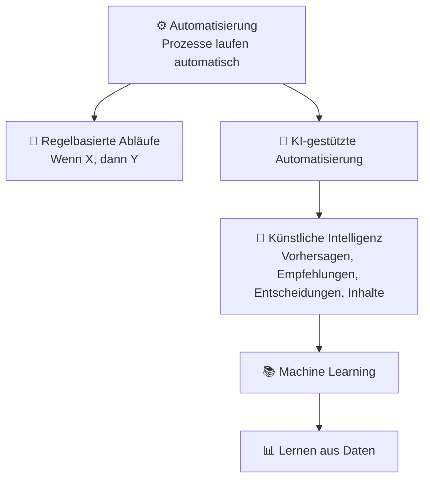

###### Themen

Grundlagen Künstlicher Intelligenz

- Begriffe Künstliche Intelligenz, Machine Learning und Automatisierung grundlegend verstehen
- Unterschiede und Zusammenhänge zwischen KI, ML und Automatisierung einordnen

Anwendungsbeispiele und Einsatzfelder

- Typische Einsatzmöglichkeiten von KI im Alltag und Berufsleben kennenlernen
- Chancen und Grenzen von KI-Anwendungen einfach einordnen

   
# 🤖 Grundlagen der Künstlichen Intelligenz

Wenn du das Thema **Künstliche Intelligenz** zum ersten Mal sauber verstehen willst, hilft ein sehr einfacher Gedanke:

**Nicht alles, was automatisch läuft, ist KI. Nicht jede KI lernt selbst. Und Machine Learning ist nur ein Teil von KI.**

Genau diese Unterscheidung ist wichtig, weil die Begriffe im Alltag oft durcheinandergeworfen werden. Viele sagen „Das ist KI“, obwohl es in Wirklichkeit nur ein fest programmiertes Automatisierungssystem ist. Andere sagen „Machine Learning“, obwohl sie eigentlich allgemein KI meinen.

Damit du das sicher einordnen kannst, schauen wir uns die drei Begriffe nacheinander an.

   
## 🧠 Was ist Künstliche Intelligenz?

**Künstliche Intelligenz**, kurz **KI**, ist ein Oberbegriff für Computersysteme, die auf Basis von Eingaben sinnvolle Ausgaben erzeugen können, zum Beispiel **Vorhersagen, Empfehlungen, Klassifikationen, Entscheidungen oder erzeugte Inhalte**. Genau solche Ausgaben nennt auch die OECD in ihrer Definition von KI-Systemen ([Recommendation of the Council on Artificial Intelligence](https://legalinstruments.oecd.org/en/instruments/OECD-LEGAL-0449)).

Einfach gesagt:

KI soll Aufgaben lösen, für die man früher oft menschliche Fähigkeiten gebraucht hat, zum Beispiel:

- Sprache verstehen
- Bilder erkennen
- Muster in Daten finden
- Entscheidungen unterstützen
- Texte erzeugen
- Risiken einschätzen

Wichtig ist dabei: **KI ist kein einzelnes Programm**, sondern eher eine **Kategorie von Verfahren und Systemen**.

Ein Navigationssystem, das Staus vorhersagt, eine Bilderkennung in der Medizin, ein Sprachassistent oder ein Empfehlungssystem bei Netflix oder Spotify: Das alles kann unter KI fallen, wenn das System nicht nur stumpf Regeln abarbeitet, sondern Eingaben analysiert und daraus passende Ausgaben ableitet.

   
### 🧩 Was KI nicht automatisch bedeutet

Viele stellen sich bei KI sofort etwas Menschenähnliches vor, fast wie einen digitalen Kopf mit Bewusstsein. Das ist aber irreführend.

In der Praxis bedeutet KI meistens **spezialisierte Systeme**, die auf eine bestimmte Aufgabe trainiert oder gebaut wurden. Ein System kann also sehr gut darin sein, Gesichter zu erkennen, aber gleichzeitig überhaupt nichts von Mathematik, Alltag oder gesundem Menschenverstand verstehen.

Darum ist es wichtig, KI nicht mit echter menschlicher Intelligenz gleichzusetzen. Die meisten heutigen KI-Systeme sind **eng auf einzelne Aufgaben spezialisiert**.

   
## 📚 Was ist Machine Learning?

**Machine Learning**, auf Deutsch **maschinelles Lernen**, ist ein **Teilgebiet der Künstlichen Intelligenz**. Dabei werden Systeme nicht nur durch feste Regeln gesteuert, sondern sie **lernen Muster aus Daten**. Genau diese Idee beschreibt auch Googles Machine-Learning-Glossar: Ein ML-System trainiert ein Modell auf Basis von Eingabedaten ([Machine Learning Glossary](https://developers.google.com/machine-learning/glossary#machine_learning)).

Einfach gesagt:

- Bei normaler Programmierung schreibt ein Mensch viele Regeln auf.
- Bei Machine Learning bekommt das System viele Beispiele.
- Aus diesen Beispielen lernt es ein Muster.
- Dieses Muster wird dann auf neue Fälle angewendet.

Ein klassisches Beispiel ist ein Spam-Filter:

Früher hätte man vielleicht Regeln geschrieben wie:

- Wenn die Mail „gratis“ enthält, dann Spam.
- Wenn die Mail zehn Ausrufezeichen hat, dann Spam.

Das ist regelbasiert.

Ein Machine-Learning-System bekommt dagegen sehr viele E-Mails, die bereits als „Spam“ oder „kein Spam“ markiert wurden. Es lernt dann selbst, welche Merkmale häufig mit Spam zusammenhängen.

Das Entscheidende ist also:

**Machine Learning lernt aus Daten, statt nur feste Regeln auszuführen.**

   
### 🧪 Typische Idee hinter maschinellem Lernen

Ein ML-System schaut sich viele Beispiele an und sucht nach Zusammenhängen:

- Welche Wörter tauchen oft in Spam auf?
- Welche Merkmale sieht man oft auf Bildern von Katzen?
- Welche Kundinnen und Kunden kaufen oft ein bestimmtes Produkt?
- Welche Bewegungsdaten deuten auf einen Maschinenausfall hin?

Das System baut daraus ein **Modell**. Dieses Modell ist vereinfacht gesagt eine mathematische Struktur, die Muster abbildet und bei neuen Daten eine Schätzung oder Entscheidung trifft.

Wichtig ist: Das System „versteht“ die Welt dabei nicht so wie ein Mensch. Es erkennt vor allem **statistische Muster**.

   
### 🧭 Warum Machine Learning in der Praxis so wichtig ist

Viele moderne KI-Anwendungen basieren auf Machine Learning, weil sich manche Probleme nicht gut mit starren Regeln lösen lassen.

Ein Beispiel:

Wie programmiert man exakt jede Regel, an der ein Gesicht erkannt werden kann?

Das ist fast unmöglich, weil Gesichter auf Fotos unterschiedlich beleuchtet sind, schräg stehen, teilweise verdeckt sind oder anders aussehen. Mit Machine Learning kann man dem System stattdessen viele Gesichtsbilder zeigen, damit es typische Muster lernt.

Darum ist ML heute so zentral bei:

- Bilderkennung
- Spracherkennung
- Übersetzung
- Betrugserkennung
- Empfehlungssystemen
- Prognosen

   
## ⚙️ Was ist Automatisierung?

**Automatisierung** bedeutet, dass Aufgaben oder Abläufe durch Technik ausgeführt werden, sodass weniger menschliches Eingreifen nötig ist. Genau so beschreiben es auch grundlegende Einführungen zur Automatisierung, etwa von Red Hat: Technologie übernimmt Prozesse mit möglichst wenig manueller Arbeit ([What is automation?](https://www.redhat.com/en/topics/automation/what-is-automation)).

Einfach gesagt:

Automatisierung heißt:

**Ein Prozess läuft von selbst ab, weil er vorher festgelegt wurde.**

Das kann sehr simpel oder sehr komplex sein.

Beispiele:

- Eine Waschmaschine folgt einem Programm.
- Ein E-Mail-System verschickt automatisch eine Bestätigung nach einer Bestellung.
- Ein Ampelsystem schaltet nach festen Zeitregeln.
- Ein Backup läuft jede Nacht automatisch.
- Eine Rechnung wird nach festem Workflow automatisch erzeugt.

Hier ist der Kern:

**Automatisierung muss nicht intelligent sein.**

Ein System kann etwas automatisch tun, ohne irgendetwas zu lernen, zu verstehen oder flexibel zu bewerten.

   
### 🔧 Regelbasierte Automatisierung

Viele Automatisierungen funktionieren nach dem Schema:

**Wenn X passiert, dann tue Y.**

Zum Beispiel:

- Wenn ein Kunde ein Formular abschickt, sende eine Bestätigungsmail.
- Wenn Lagerbestand unter 20 fällt, bestelle nach.
- Wenn ein Sensor einen Grenzwert überschreitet, stoppe die Maschine.

Das ist sehr nützlich, aber es ist noch keine KI. Es ist eher **strukturierte, planbare Ablaufsteuerung**.

   
## 🔗 Unterschiede und Zusammenhänge zwischen KI, ML und Automatisierung

Jetzt kommt der wichtigste Teil: Wie hängen die drei Begriffe zusammen?

Du kannst sie dir so merken:

- **Automatisierung** = Etwas läuft automatisch ab.
- **KI** = Ein System erzeugt „intelligent wirkende“ Ausgaben wie Vorhersagen, Klassifikationen oder Empfehlungen.
- **Machine Learning** = Eine Methode innerhalb von KI, bei der das System aus Daten Muster lernt.

Oder noch einfacher:

- **Automatisierung** fragt: *Wie kann ein Prozess ohne ständige manuelle Arbeit ablaufen?*
- **KI** fragt: *Wie kann ein System schwierige Entscheidungen oder Einschätzungen treffen?*
- **ML** fragt: *Wie kann ein System solche Einschätzungen aus Daten lernen?*

   
### 📊 Vergleich in einer Tabelle

| Begriff | Einfache Bedeutung | Arbeitet mit festen Regeln? | Lernt aus Daten? | Typisches Beispiel |
|---|---|---:|---:|---|
| Automatisierung | Ein Ablauf läuft automatisch | oft ja | nein, nicht zwingend | Automatische Rechnungsstellung |
| Künstliche Intelligenz | System erzeugt Vorhersagen, Empfehlungen, Entscheidungen oder Inhalte | manchmal | manchmal | Sprachassistent, Bilderkennung |
| Machine Learning | Teilgebiet von KI, das Muster aus Daten lernt | nicht primär | ja | Spam-Erkennung, Produktempfehlung |

   
### 🧠 Der wichtigste Denkfehler im Alltag

Der häufigste Fehler ist:

**Automatisierung wird mit KI verwechselt.**

Beispiel:

Ein Online-Shop verschickt nach jeder Bestellung automatisch eine E-Mail.  
Das ist **Automatisierung**, aber keine KI.

Wenn derselbe Shop aus früheren Käufen vorhersagt, welche Produkte dich wahrscheinlich interessieren, dann ist das **KI**.  
Wenn das System diese Vorhersage aus historischen Kundendaten gelernt hat, dann steckt darin **Machine Learning**.

   
### 🔄 Wie die Begriffe zusammenarbeiten

In echten Systemen werden diese Dinge oft kombiniert.

Ein Beispiel aus dem Kundenservice:

1. Eine Kundenanfrage kommt rein.
2. Ein KI-Modell erkennt das Thema der Nachricht.
3. Ein ML-Modell schätzt die Dringlichkeit.
4. Eine Automatisierung leitet das Ticket an das passende Team weiter.
5. Eine automatische Antwort wird verschickt.

Hier siehst du:

- **KI** hilft bei der Einschätzung.
- **ML** liefert die gelernten Muster dahinter.
- **Automatisierung** sorgt dafür, dass der Ablauf ohne manuelles Eingreifen weiterläuft.

   
### 🗺️ Visualisierung: Verhältnis von KI, ML und Automatisierung

Die Grafik zeigt etwas Wichtiges:

- **Machine Learning gehört zu KI**
- **KI kann Teil einer Automatisierung sein**
- **Automatisierung kann aber auch komplett ohne KI existieren**

   
### 🏗️ Ein sehr einprägsames Alltagsbild

Stell dir eine Fabrik oder ein Büro vor:

- **Automatisierung** ist das Fließband oder der Workflow.
- **KI** ist der Teil, der entscheidet oder einschätzt.
- **ML** ist die Methode, mit der dieser entscheidende Teil aus Beispielen gelernt hat.

So kannst du die Begriffe sehr gut auseinanderhalten.

---

   
# 🌍 Anwendungsbeispiele und Einsatzfelder

KI ist heute nicht mehr nur ein Forschungsthema. Sie steckt längst in alltäglichen digitalen Diensten und in vielen beruflichen Prozessen. Oft merkt man gar nicht, dass man gerade mit KI in Berührung kommt.

Wichtig ist dabei: KI wird nicht immer als großes, sichtbares System eingesetzt. Häufig arbeitet sie im Hintergrund und unterstützt andere Anwendungen.

   
## 🏠 Typische Einsatzmöglichkeiten von KI im Alltag

Im Alltag begegnet dir KI oft in kleinen, sehr praktischen Funktionen.

   
### 📱 Smartphone und persönliche Geräte

Viele Smartphones nutzen KI für:

- **Gesichtserkennung oder Objekterkennung** in Fotos
- **Sprachassistenten**
- **Textvorschläge und Autokorrektur**
- **Kameraoptimierung**, zum Beispiel Nachtmodus oder automatische Motiverkennung
- **Spracherkennung** beim Diktieren

Hier analysiert das System Bilder, Sprache oder Nutzungsverhalten und erzeugt passende Ausgaben.

Ein Sprachassistent ist ein gutes Beispiel für die Kombination mehrerer KI-Bausteine:

- Sprache wird erkannt
- Bedeutung wird interpretiert
- eine passende Antwort wird erzeugt oder eine Aktion gestartet

   
### 🎬 Medien, Unterhaltung und Empfehlungen

Streamingdienste, Musikplattformen und Online-Shops nutzen KI häufig für **Empfehlungssysteme**.

Das Ziel ist:

- herauszufinden, was dich interessieren könnte
- Inhalte passend zu sortieren
- Suchergebnisse persönlicher darzustellen

Wenn dir nach einem Film ähnliche Filme vorgeschlagen werden, steckt oft KI dahinter. Das System analysiert zum Beispiel:

- dein bisheriges Verhalten
- Ähnlichkeiten zwischen Inhalten
- Verhalten ähnlicher Nutzergruppen

Das ist ein typischer Einsatz von ML, weil aus vielen Nutzungsdaten Muster gelernt werden.

   
### 📧 Kommunikation und Internetdienste

Ein sehr verbreitetes Beispiel ist die **Spam-Erkennung** in E-Mail-Diensten.

Auch hier hilft KI, Nachrichten zu klassifizieren:

- Spam
- wahrscheinlich wichtig
- Werbung
- Phishing-Versuch

Solche Systeme müssen laufend mit neuen Mustern umgehen, weil sich Spam und Betrugsversuche ständig verändern. Genau dafür ist Machine Learning besonders geeignet.

   
### 🚗 Navigation und Mobilität

Karten- und Navigationsdienste nutzen KI, um:

- Verkehrslagen einzuschätzen
- Ankunftszeiten vorherzusagen
- bessere Routen zu empfehlen
- Muster in Bewegungsdaten zu erkennen

Dabei fließen große Mengen an Daten ein, zum Beispiel Staus, Straßensperrungen, historische Fahrzeiten und aktuelle Verkehrsdaten.

Das System trifft also keine „menschliche“ Entscheidung, aber es berechnet mit KI-Methoden sehr nützliche Vorhersagen.

   
## 💼 Typische Einsatzmöglichkeiten von KI im Berufsleben

Im Berufsalltag ist KI besonders dort stark, wo viele Daten verarbeitet werden oder schnelle Einschätzungen gebraucht werden.

   
### 🏢 Büro, Verwaltung und Wissensarbeit

In Büro- und Verwaltungsprozessen wird KI oft genutzt für:

- automatische Dokumentenanalyse
- Sortierung und Klassifikation von E-Mails
- Texterstellung und Textentwürfe
- Zusammenfassungen von Meetings
- Suche in großen Wissensbeständen
- Unterstützung im Kundenservice

Ein Beispiel:

Ein Unternehmen erhält täglich tausende Anfragen. KI kann erkennen, ob es um eine Rechnung, eine technische Störung oder eine Vertragsfrage geht. Danach übernimmt eine Automatisierung die Weiterleitung an die richtige Abteilung.

Hier sieht man sehr gut das Zusammenspiel aus KI und Automatisierung.

   
### 🛒 Handel und E-Commerce

Im Handel hilft KI unter anderem bei:

- Nachfrageprognosen
- Preisoptimierung
- Produktempfehlungen
- Lagerplanung
- Betrugserkennung bei Zahlungen
- Analyse von Kundenfeedback

Wenn ein System schätzt, welche Produkte bald knapp werden oder welche Produkte oft zusammen gekauft werden, handelt es sich häufig um ML-basierte Vorhersagen.

   
### 🏭 Industrie und Produktion

In der Industrie ist KI besonders spannend, weil sie nicht nur Daten auswertet, sondern oft echte wirtschaftliche Vorteile bringt.

Typische Anwendungen sind:

- **vorausschauende Wartung**: Maschinenprobleme erkennen, bevor ein Ausfall passiert
- **Qualitätskontrolle**: Fehler auf Bildern oder Sensordaten erkennen
- **Prozessoptimierung**: Energieverbrauch, Materialeinsatz oder Laufzeiten verbessern
- **Robotik**: Bewegungen und Handhabung verbessern

Bei vorausschauender Wartung analysiert ein System zum Beispiel Schwingungen, Temperatur oder Geräusche und lernt, welche Muster auf einen baldigen Defekt hindeuten.

   
### 🏥 Medizin und Gesundheit

Im Gesundheitsbereich kann KI dabei helfen,

- medizinische Bilder auszuwerten
- Risiken früher zu erkennen
- Dokumentation zu unterstützen
- Muster in großen Datensätzen zu finden

Wichtig ist hier aber besonders: KI trifft nicht automatisch „die Wahrheit“. In sensiblen Bereichen muss sie sorgfältig geprüft werden. Genau deshalb betont das NIST, dass vertrauenswürdige KI unter anderem **valide, zuverlässig, sicher, transparent und beherrschbar** sein sollte ([Artificial Intelligence Risk Management Framework (AI RMF 1.0)](https://nvlpubs.nist.gov/nistpubs/ai/NIST.AI.100-1.pdf)).

Das bedeutet in der Praxis: Gerade in der Medizin darf KI meist nicht einfach unkontrolliert entscheiden, sondern dient oft als **Unterstützungssystem**.

   
### 💬 Kundenservice und Kommunikation

Chatbots und Assistenzsysteme sind heute ein sehr sichtbares Feld.

Sie können:

- häufige Fragen beantworten
- Anfragen vorsortieren
- Formulare erklären
- einfache Standardprobleme lösen
- an Menschen übergeben, wenn der Fall komplex wird

Dabei ist wichtig: Ein guter KI-Chatbot ist nicht nur „ein Bot“. Er braucht oft mehrere Komponenten:

- Sprachverstehen
- Wissenszugriff
- Antworterzeugung
- Sicherheitsregeln
- Weiterleitung an Mitarbeitende

   
## 🗂️ Beispiele nach Einsatzfeld in einer Übersicht

| Bereich | Typische KI-Anwendung | Was die KI dabei tut |
|---|---|---|
| Alltag / Smartphone | Sprachassistent | Sprache erkennen und Absicht ableiten |
| Alltag / E-Mail | Spam-Filter | Nachrichten klassifizieren |
| Alltag / Streaming | Empfehlungen | Nutzungsdaten auswerten und Vorschläge machen |
| Navigation | Routenprognose | Verkehrsdaten analysieren und Fahrzeit schätzen |
| Büro | Dokumentenklassifikation | Inhalte erkennen und zuordnen |
| Kundenservice | Chatbot | Fragen verstehen und Antworten erzeugen |
| Handel | Nachfrageprognose | künftige Verkäufe schätzen |
| Industrie | Predictive Maintenance | Ausfälle vorhersagen |
| Medizin | Bildanalyse | Auffälligkeiten auf Bildern erkennen |

---

   
# 🌟 Chancen von KI-Anwendungen

KI ist nicht einfach nur „modern“, sondern sie ist in vielen Fällen nützlich, weil sie bestimmte Arten von Aufgaben sehr schnell und in großer Menge bearbeiten kann.

   
## 🚀 Wo KI echten Nutzen bringt

Eine große Stärke von KI ist die **Skalierung**.

Ein Mensch kann sich vielleicht 50 Anfragen am Tag genau ansehen. Ein KI-System kann tausende Anfragen vorsortieren oder vorbewerten. Das heißt nicht, dass die KI immer besser ist, aber sie kann enorme Datenmengen sehr schnell bearbeiten.

Typische Chancen sind:

- **Zeitersparnis** bei Routineaufgaben
- **Unterstützung bei Entscheidungen**
- **Erkennung von Mustern**, die Menschen leicht übersehen
- **Personalisierung** von Diensten
- **bessere Prognosen** in datenreichen Bereichen
- **Entlastung** bei monotoner Arbeit

   
### ⏱️ Effizienz und Produktivität

Wenn KI gut eingesetzt wird, spart sie oft Zeit bei Aufgaben wie:

- Sortieren
- Klassifizieren
- Suchen
- Transkribieren
- Übersetzen
- Vorstrukturieren von Informationen

Das ist besonders wertvoll, wenn Menschen dadurch mehr Zeit für anspruchsvollere Aufgaben haben, etwa für Kommunikation, Bewertung, kreative Lösungsfindung oder Verantwortung in kritischen Entscheidungen.

   
### 🔍 Mustererkennung in großen Datenmengen

Menschen sind gut im Verstehen von Kontext, aber schlecht darin, in Millionen Datensätzen kleine statistische Muster zu entdecken.

KI kann genau dabei stark sein:

- Auffälligkeiten in Finanzdaten
- Anzeichen für Betrug
- Qualitätsprobleme in Bilddaten
- Risikosignale in Sensordaten
- Zusammenhänge in Kundendaten

Das ist einer der Hauptgründe, warum KI in Unternehmen so attraktiv ist.

   
### 🎯 Personalisierung und bessere Nutzererfahrung

KI kann Systeme persönlicher machen.

Zum Beispiel:

- bessere Suchergebnisse
- passendere Produktempfehlungen
- individuellere Lernpfade
- zielgerichtete Hilfestellung in Software
- barriereärmere Bedienung durch Sprache oder automatische Untertitel

Gerade Funktionen wie automatische Spracherkennung oder Live-Untertitel können digitale Angebote für viele Menschen leichter zugänglich machen.

   
## 🧠 Warum Chancen immer vom Kontext abhängen

Eine KI-Anwendung ist nicht automatisch gut, nur weil sie technisch beeindruckend ist.

Die entscheidenden Fragen sind:

- Passt sie wirklich zum Problem?
- Sind die Daten gut genug?
- Ist der Nutzen größer als der Aufwand?
- Kann ein Mensch die Ergebnisse prüfen?
- Entstehen Risiken für Datenschutz, Fairness oder Sicherheit?

Das ist ein sehr wichtiger Lernpunkt in den Tech-Grundlagen:  
**Man bewertet KI nicht nach Hype, sondern nach Eignung, Qualität und verantwortungsvollem Einsatz.**

---

   
# 🚧 Grenzen von KI-Anwendungen einfach einordnen

So wichtig die Chancen sind, so wichtig sind auch die Grenzen. Gerade Anfänger hören oft nur: „KI kann alles.“ Das ist fachlich falsch.

KI kann sehr viel, aber nur unter bestimmten Bedingungen gut.

   
## ⚠️ KI ist nicht automatisch richtig

Ein KI-System kann überzeugende, aber falsche Ergebnisse liefern. Das gilt besonders dann, wenn:

- die Daten unvollständig sind
- die Trainingsdaten verzerrt sind
- der Anwendungsfall schlecht definiert ist
- das System außerhalb seines eigentlichen Einsatzbereichs genutzt wird

Das NIST betont deshalb, dass KI-Systeme nicht nur leistungsfähig, sondern auch **zuverlässig, testbar und kontrollierbar** sein müssen ([Artificial Intelligence Risk Management Framework (AI RMF 1.0)](https://nvlpubs.nist.gov/nistpubs/ai/NIST.AI.100-1.pdf)).

Das heißt praktisch:

Nur weil ein System schnell antwortet oder sehr selbstsicher klingt, ist seine Ausgabe noch lange nicht korrekt.

   
### 🪞 Verzerrungen und unfairer Output

Wenn Trainingsdaten einseitig oder fehlerhaft sind, kann KI diese Probleme übernehmen.

Beispiele:

- Ein Bewerbungsmodell wurde mit verzerrten historischen Daten trainiert.
- Ein Bilderkennungssystem funktioniert bei manchen Personengruppen schlechter.
- Ein Empfehlungssystem verstärkt immer nur bereits populäre Inhalte.

Das Problem liegt dann oft nicht darin, dass die Maschine „böse“ ist, sondern darin, dass sie aus problematischen Daten problematische Muster lernt.

Deshalb ist Datenqualität ein zentrales Thema.

   
### 🔒 Datenschutz und Sicherheit

Viele KI-Systeme arbeiten mit großen Mengen an Daten. Dadurch entstehen Fragen wie:

- Welche Daten werden gesammelt?
- Wofür werden sie genutzt?
- Wie lange werden sie gespeichert?
- Wer hat Zugriff?
- Können sensible Informationen ungewollt offengelegt werden?

Gerade bei personenbezogenen oder sensiblen Daten ist das ein kritischer Punkt. KI ist also nie nur eine Technikfrage, sondern immer auch eine Frage von Datenschutz, Governance und Verantwortung.

   
### 🧾 Fehlende Nachvollziehbarkeit

Manche KI-Modelle sind schwer zu verstehen. Man sieht das Ergebnis, aber nicht immer klar den Weg dorthin.

Das ist problematisch, wenn Entscheidungen große Folgen haben, zum Beispiel bei:

- Kreditvergabe
- Personalentscheidungen
- Medizin
- Sicherheit
- Justiznahen Anwendungen

Wenn Menschen Entscheidungen verantworten müssen, brauchen sie oft nachvollziehbare Gründe. Genau deshalb ist **Erklärbarkeit** in vielen Einsatzfeldern wichtig.

   
### 🧱 KI braucht gute Rahmenbedingungen

KI funktioniert nicht im luftleeren Raum. Sie braucht:

- gute Daten
- klares Ziel
- geeignete Tests
- laufende Überwachung
- menschliche Verantwortung
- sinnvolle Einbettung in Prozesse

Ein schlechtes System wird nicht dadurch gut, dass man „KI“ draufschreibt.  
Und ein chaotischer Prozess wird nicht automatisch besser, nur weil man ein Modell hineinschiebt.

Das ist ein zentraler Grundsatz in den Core Tech Fundamentals:  
**Erst den Prozess und das Problem verstehen, dann das passende Werkzeug wählen.**

   
## 🧑‍🤝‍🧑 Warum der Mensch wichtig bleibt

In vielen Bereichen ist KI am stärksten, wenn sie Menschen **unterstützt**, nicht blind ersetzt.

Ein Mensch bringt Dinge mit, die KI oft nicht zuverlässig leisten kann:

- Verantwortung
- ethische Abwägung
- Kontextverständnis
- soziale Feinfühligkeit
- Zielklärung
- kritisches Hinterfragen

Darum ist in vielen professionellen Umgebungen nicht das beste Modell entscheidend, sondern die beste **Zusammenarbeit zwischen Mensch, System und Prozess**.

   
## 🪜 Eine einfache Einordnung für deinen Kopf

Wenn du künftig auf ein digitales System schaust, kannst du es mit drei Fragen sauber einordnen:

1. **Läuft hier etwas automatisch ab?**  
   Dann ist Automatisierung im Spiel.

2. **Treffen Datenanalysen, Vorhersagen oder Klassifikationen die zentrale Leistung?**  
   Dann ist wahrscheinlich KI im Spiel.

3. **Hat das System diese Fähigkeit aus Beispieldaten gelernt?**  
   Dann steckt wahrscheinlich Machine Learning dahinter.

Mit diesen drei Fragen kannst du sehr viele moderne Systeme bereits erstaunlich präzise einordnen.