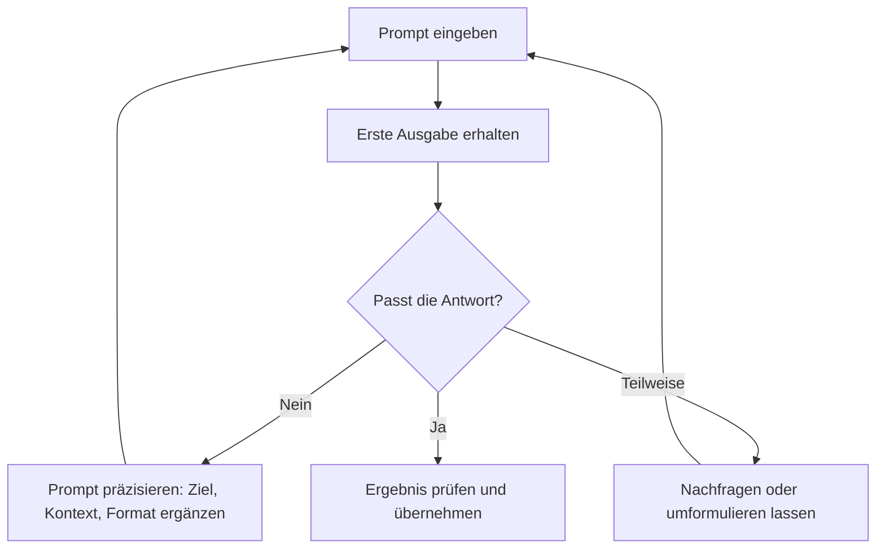
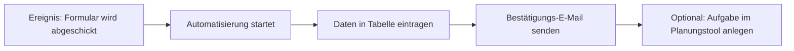

###### Themen

Praktische Nutzung KI-gestützter Tools

- Webbasierte KI-Tools für Textgenerierung kennenlernen und anwenden
- Prompts eingeben und Ausgaben gezielt anpassen
- KI-basierte Bildgeneratoren in einfacher Form kennenlernen

Praktische Arbeit mit unterstützenden Tools

- Chatbots und Sprachassistenten zur Unterstützung einfacher Aufgaben nutzen
- Einfache KI-gestützte Organisations- und Automatisierungswerkzeuge kennenlernen

   
# 🧠 Praktische Nutzung von KI-gestützten Tools

Wenn von **KI-gestützten Tools** die Rede ist, sind damit digitale Werkzeuge gemeint, die Aufgaben nicht nur stur nach festen Regeln ausführen, sondern Inhalte erzeugen, Vorschläge machen, Texte umformulieren, Bilder erstellen oder Abläufe unterstützen können. Im Alltag begegnen dir solche Systeme heute oft direkt im Browser, als App oder eingebaut in bekannte Programme. Typische Beispiele sind **ChatGPT** von OpenAI, **Claude** von Anthropic, **Gemini** von Google oder **Copilot** von Microsoft ([ChatGPT](https://openai.com/chatgpt/), [Claude](https://www.anthropic.com/claude), [Gemini](https://gemini.google.com/), [Microsoft Copilot](https://www.microsoft.com/microsoft-copilot)).

Der praktische Nutzen liegt darin, dass du mit diesen Werkzeugen in **natürlicher Sprache** arbeiten kannst. Du musst also nicht programmieren, um einen Text zusammenfassen zu lassen, Ideen zu sammeln, eine E-Mail zu überarbeiten oder dir ein Thema erklären zu lassen. Genau deshalb sind diese Tools besonders spannend für **Core Tech Fundamentals**: Du lernst, wie moderne digitale Werkzeuge funktionieren, wie du sie richtig bedienst und wie du ihre Ergebnisse kritisch beurteilst.

   
## 📝 Webbasierte KI-Tools zur Textgenerierung kennenlernen und anwenden

Webbasierte KI-Tools zur Textgenerierung sind Programme, die du direkt über einen Browser nutzen kannst. Sie helfen dir dabei, **Texte zu schreiben, umzuschreiben, zu strukturieren, zu erklären oder zu verbessern**. Solche Systeme basieren meist auf großen Sprachmodellen, die Sprache statistisch verarbeiten und dadurch menschenähnliche Antworten formulieren können ([OpenAI Platform Overview](https://platform.openai.com/docs/overview), [Anthropic: Prompt engineering overview](https://docs.anthropic.com/en/docs/build-with-claude/prompt-engineering/overview)).

Wichtig ist dabei: Diese Tools **verstehen Sprache nicht wie ein Mensch**, sondern berechnen wahrscheinliche passende Antworten. Das ist praktisch, aber es bedeutet auch, dass Antworten manchmal sehr überzeugend klingen können, obwohl sie ungenau oder sogar falsch sind. Deshalb gehört zum guten Umgang mit KI immer auch das **Prüfen von Ergebnissen**.

   
### 📚 Was solche Textwerkzeuge praktisch leisten

Im Alltag kannst du mit ihnen zum Beispiel:

- Texte entwerfen
- Texte kürzen oder zusammenfassen
- komplizierte Inhalte einfacher erklären lassen
- Stichpunkte in Fließtext umwandeln
- Überschriften, Gliederungen oder Ideen erzeugen
- E-Mails oder Nachrichten formulieren
- Texte stilistisch verbessern
- Informationen in Tabellenform strukturieren

Das Entscheidende ist: Die KI ersetzt dabei nicht dein Denken, sondern sie kann dein Denken **unterstützen**. Gerade beim Lernen ist das sehr wertvoll. Du kannst dir zum Beispiel ein schweres Thema erst einfach erklären lassen, dann ein Beispiel anfordern und anschließend gezielt nachfragen, was du noch nicht verstanden hast.

   
### 🧰 Typische webbasierte Text-KI im Überblick

| Tool | Typische Stärke | Wofür es oft genutzt wird |
|---|---|---|
| ChatGPT ([ChatGPT](https://openai.com/chatgpt/)) | vielseitige Textarbeit, Erklärungen, Dialog | Formulieren, Erklären, Zusammenfassen |
| Claude ([Claude](https://www.anthropic.com/claude)) | ruhige, strukturierte Textarbeit, längere Dokumente | Analysieren, Schreiben, Gliedern |
| Gemini ([Gemini](https://gemini.google.com/)) | Suche, Google-nahe Arbeitsweisen, Alltagsfragen | Erklären, Recherchieren, Entwürfe |
| Microsoft Copilot ([Microsoft Copilot](https://www.microsoft.com/microsoft-copilot)) | Arbeit im Microsoft-Umfeld | Mails, Office-Unterstützung, Arbeitsalltag |

Diese Werkzeuge unterscheiden sich in Oberfläche, Datenschutzoptionen, Integrationen und Antwortstil. Das Grundprinzip ist aber ähnlich: **Du gibst einen Prompt ein, und das System erzeugt eine passende Ausgabe**.

   
### 🛠️ So arbeitest du sinnvoll mit Text-KI

Ein sehr einfacher und sinnvoller Ablauf sieht so aus:

1. Du gibst der KI eine klare Aufgabe.
2. Du ergänzt Kontext.
3. Du definierst Form und Ziel.
4. Du prüfst die erste Antwort.
5. Du verbesserst deinen Prompt oder forderst eine Überarbeitung an.

Wenn du zum Beispiel nur schreibst:  
„Erklär mir Netzwerke“,  
dann ist die Aufgabe zwar verständlich, aber noch sehr offen.

Wenn du stattdessen schreibst:  
„Erklär mir das Grundprinzip von Computernetzwerken in einfacher Sprache, so als wäre ich Einsteiger. Nutze ein praktisches Beispiel aus dem Alltag und erkläre die Begriffe Router, IP-Adresse und Server.“  
dann ist der Auftrag viel klarer. Die Ausgabe wird fast immer besser, weil du der KI mehr Orientierung gibst.

   
## 🎯 Prompts eingeben und Ausgaben gezielt anpassen

Ein **Prompt** ist einfach deine Eingabe an die KI. Das kann eine Frage sein, eine Anweisung, ein Auftrag oder eine genau beschriebene Aufgabe. Je klarer dein Prompt ist, desto nützlicher wird in der Regel die Antwort. Anbieter wie OpenAI und Anthropic empfehlen selbst, Aufgaben klar zu formulieren, Kontext mitzugeben und gewünschte Ausgabeformate explizit zu nennen ([OpenAI Prompt Engineering Guide](https://platform.openai.com/docs/guides/prompt-engineering), [Anthropic: Prompt engineering overview](https://docs.anthropic.com/en/docs/build-with-claude/prompt-engineering/overview)).

Viele Anfänger machen denselben Fehler: Sie schreiben zu wenig. Sie denken, ein kurzer Befehl reiche aus. In Wirklichkeit ist ein guter Prompt eher wie eine **saubere Arbeitsanweisung**.

   
### 🧩 Was ein guter Prompt enthalten sollte

Ein guter Prompt enthält möglichst viele dieser Bausteine:

| Baustein | Bedeutung | Beispiel |
|---|---|---|
| Ziel | Was soll herauskommen? | „Erkläre mir das Thema verständlich.“ |
| Kontext | Für wen oder wofür ist es gedacht? | „Ich bin Anfänger in Informatik.“ |
| Format | Wie soll die Antwort aussehen? | „Nutze Absätze und ein Beispiel.“ |
| Umfang | Wie lang oder kurz soll es sein? | „In etwa 200 Wörtern.“ |
| Stil | Wie soll die Sprache wirken? | „Einfach, ruhig, sachlich.“ |
| Einschränkungen | Was soll vermieden werden? | „Keine Fachwörter ohne Erklärung.“ |

Wenn du diese Punkte bewusst mitdenkst, wird aus einer unklaren Frage ein sehr brauchbarer Arbeitsauftrag.

   
### ✍️ Beispiel: Schwacher Prompt und besserer Prompt

Ein schwacher Prompt wäre:

> „Schreib was über Datenbanken.“

Das ist zu offen. Die KI weiß nicht:
- auf welchem Niveau sie schreiben soll,
- ob du eine Erklärung oder eine Definition willst,
- ob ein Beispiel nötig ist,
- wie lang der Text sein soll.

Ein besserer Prompt wäre:

> „Erkläre mir Datenbanken in einfacher Sprache für Einsteiger. Erkläre den Unterschied zwischen Tabelle, Datensatz und Abfrage. Nutze ein alltagsnahes Beispiel, zum Beispiel eine Bibliothek. Die Antwort soll klar gegliedert und nicht zu technisch sein.“

Jetzt hat die KI:
- ein klares Ziel,
- eine Zielgruppe,
- einen Stil,
- ein Beispiel,
- eine gewünschte Tiefe.

Genau dadurch wird die Ausgabe deutlich präziser.

   
### 🔁 Wie du Ausgaben gezielt verbesserst

Ein großer Vorteil von KI-Tools ist, dass du **iterativ** arbeiten kannst. Das bedeutet: Du musst nicht sofort den perfekten Prompt schreiben. Du kannst dich Schritt für Schritt zur besseren Antwort vorarbeiten.

Typische Nachsteuerungen sind zum Beispiel:

- „Erklär es noch einfacher.“
- „Gib mir dazu ein konkretes Beispiel.“
- „Kürze den Text auf 5 Sätze.“
- „Formuliere das sachlicher.“
- „Strukturiere die Antwort als Tabelle.“
- „Prüfe, ob Fachbegriffe erklärt wurden.“
- „Zeige mir die Unterschiede zwischen A und B.“

Das ist im Grunde wie bei einem menschlichen Gespräch. Du gibst eine Aufgabe, bekommst eine erste Antwort und präzisierst dann weiter.

   
### 🧠 Wie du KI beim Lernen richtig nutzt

Beim Lernen solltest du KI **nicht nur nach fertigen Antworten fragen**, sondern sie als Erklär- und Denkpartner nutzen. Das ist der entscheidende Unterschied zwischen oberflächlicher Nutzung und echtem Lernfortschritt.

Sinnvolle Lernprompts sind zum Beispiel:

- „Erklär mir das Thema in sehr einfacher Sprache.“
- „Nenne mir erst die Grundidee und dann die Fachbegriffe.“
- „Gib mir ein Beispiel aus dem Alltag.“
- „Worin machen Anfänger hier oft Fehler?“
- „Vergleiche diese zwei Begriffe verständlich.“
- „Prüfe meine Erklärung und sag mir, was daran unklar ist.“

So trainierst du nicht nur das Abrufen von Informationen, sondern vor allem **Verstehen**, **Einordnen** und **Reflektieren**.

   
## 🖼️ KI-basierte Bildgeneratoren in einfacher Form kennenlernen

KI-basierte Bildgeneratoren erzeugen aus Texteingaben Bilder. Du beschreibst also mit Worten, was zu sehen sein soll, und die KI erstellt daraus ein Bild. Bekannte Beispiele sind **DALL·E**, **Adobe Firefly** und auf Open-Source-Seite Modelle aus dem Umfeld von **Stable Diffusion** ([DALL·E 3](https://openai.com/index/dall-e-3/), [Adobe Firefly](https://www.adobe.com/products/firefly.html), [Stable Image](https://stability.ai/stable-image)).

Das ist besonders nützlich, wenn du:
- Ideen visualisieren willst,
- einfache Konzepte bebildern möchtest,
- Entwürfe für Präsentationen brauchst,
- Stimmungen, Szenen oder Illustrationen erzeugen willst.

   
### 🎨 Wie Bildgeneratoren grundsätzlich funktionieren

Vereinfacht gesagt übersetzen Bildgeneratoren eine sprachliche Beschreibung in visuelle Merkmale. Wenn du schreibst:

> „Ein moderner Arbeitsplatz mit Laptop, Pflanze und Tageslicht, minimalistisch, realistisch“

dann versucht das Modell, aus den Begriffen wie „moderner Arbeitsplatz“, „minimalistisch“ und „realistisch“ ein passendes Bild zu erzeugen.

Die KI denkt dabei nicht wie ein Fotograf. Sie setzt Muster zusammen, die sie aus Trainingsdaten gelernt hat. Genau deshalb lohnt es sich, Bildprompts möglichst klar zu formulieren.

   
### 🧾 Was in einem guten Bildprompt stehen sollte

Ein guter Bildprompt beschreibt nicht nur das Objekt, sondern auch die Darstellung. Typische Bausteine sind:

| Baustein | Beispiel |
|---|---|
| Motiv | „ein Schreibtisch mit Laptop“ |
| Stil | „fotorealistisch“, „Comic-Stil“, „Aquarell“ |
| Perspektive | „von vorne“, „Draufsicht“, „Nahaufnahme“ |
| Licht | „weiches Morgenlicht“, „dramatische Beleuchtung“ |
| Farben | „warme Farbtöne“, „schwarz-weiß“, „pastellfarben“ |
| Hintergrund | „modernes Büro“, „schlichte Wand“, „Naturkulisse“ |
| Qualität | „hoch detailliert“, „sauber“, „minimalistisch“ |

Ein schwacher Bildprompt wäre:

> „Mach ein Bild von einem Hund.“

Ein deutlich besserer Prompt wäre:

> „Ein freundlicher golden retriever sitzt auf einer grünen Wiese im warmen Abendlicht, fotorealistisch, natürliche Farben, leichter unscharfer Hintergrund, Nahaufnahme.“

Auch hier gilt: Mehr Klarheit führt meist zu einem besseren Ergebnis.

   
### 🪄 Wofür einfache Bildgeneratoren praktisch geeignet sind

Für Einsteiger sind Bildgeneratoren besonders gut geeignet, um:

- Präsentationen optisch aufzuwerten
- Ideen für Designs zu skizzieren
- visuelle Varianten schnell auszuprobieren
- Konzepte sichtbar zu machen
- Moodboards oder Stilrichtungen zu testen

Sie sind weniger gut geeignet, wenn absolute Korrektheit nötig ist, zum Beispiel bei sehr präzisen technischen Zeichnungen, medizinischen Inhalten oder komplexen Texten im Bild. Viele Bildgeneratoren haben außerdem Schwierigkeiten mit **lesbarem Text**, exakten Zahlenangaben oder sehr feinen logischen Details.

   
### ⚠️ Wichtige Grenzen bei Bild-KI

Bei Bildgeneratoren solltest du zwei Dinge besonders beachten.

Erstens: Die Ergebnisse sind nicht automatisch „wahr“. Wenn du ein Bild einer historischen Szene erzeugst, ist das keine sichere historische Quelle, sondern eine KI-Interpretation.

Zweitens: Die Nutzungsrechte und Trainingsgrundlagen unterscheiden sich je nach Anbieter. Adobe betont zum Beispiel, dass Firefly auf lizenzierten Inhalten und Adobe Stock basiert, um eine kommerziell nutzbare Ausrichtung zu unterstützen ([Adobe Firefly](https://www.adobe.com/products/firefly.html)). Bei anderen Tools können Bedingungen anders sein. Deshalb solltest du bei beruflicher oder öffentlicher Nutzung immer die konkreten Lizenzregeln prüfen.

   
# 🤝 Praktische Arbeit mit unterstützenden Tools

Neben reiner Text- oder Bildgenerierung gibt es viele KI-gestützte Werkzeuge, die dich bei einfachen Aufgaben im Alltag unterstützen. Dazu gehören **Chatbots**, **Sprachassistenten**, **Organisationshilfen** und **Automatisierungsplattformen**. Der große Vorteil ist, dass sie dir wiederkehrende Arbeit abnehmen oder dich bei kleinen Entscheidungen, Formulierungen und Planungen unterstützen.

Hier ist der Unterschied wichtig:

- **Generative KI** erzeugt Inhalte, etwa Texte oder Bilder.
- **Unterstützende KI-Tools** helfen zusätzlich beim Organisieren, Sortieren, Planen, Erinnern oder Verbinden von Aufgaben.

   
## 💬 Chatbots und Sprachassistenten zur Unterstützung einfacher Aufgaben nutzen

Ein **Chatbot** ist ein dialogbasiertes System. Du tippst eine Frage oder Aufgabe ein und bekommst eine Antwort. Ein **Sprachassistent** funktioniert ähnlich, aber oft per Spracheingabe und meist stärker auf konkrete Alltagsaktionen ausgerichtet, etwa Erinnerungen, Timer, Musik, Navigation oder Smart-Home-Befehle. Bekannte Beispiele sind **Siri**, **Alexa** und **Google Assistant** ([Siri](https://www.apple.com/siri/), [Amazon Alexa](https://www.amazon.com/alexa), [Google Assistant](https://assistant.google.com/)).

Chatbots sind meist stärker beim **Erklären, Formulieren und Nachdenken**. Sprachassistenten sind häufig stärker bei **schnellen, praktischen Alltagsaktionen**.

   
### 🗣️ Wofür Chatbots gut geeignet sind

Chatbots kannst du gut für einfache, unterstützende Aufgaben einsetzen, zum Beispiel:

- kurze Erklärungen zu Begriffen
- Formulierungshilfen
- Ideensammlungen
- Entwürfe für Nachrichten oder E-Mails
- Umformulieren in einfachen Stil
- Übersetzen oder sprachliches Glätten
- Strukturieren von Gedanken
- erste Orientierung in einem Thema

Wenn du beispielsweise eine höfliche E-Mail schreiben musst, aber nicht weißt, wie du anfangen sollst, kann ein Chatbot dir in Sekunden einen brauchbaren Entwurf liefern. Du sparst Zeit, musst aber trotzdem prüfen, ob Ton, Inhalt und Fakten wirklich passen.

   
### 🎙️ Wofür Sprachassistenten gut geeignet sind

Sprachassistenten sind besonders praktisch, wenn du **schnell und freihändig** arbeiten willst. Typische Aufgaben sind:

- Wecker und Timer stellen
- Erinnerungen anlegen
- Termine abfragen
- Wetter oder Verkehr prüfen
- Musik oder Podcasts starten
- Smart-Home-Geräte steuern
- kurze Fakten abfragen

Der Vorteil ist die Geschwindigkeit. Der Nachteil ist, dass Sprachassistenten oft weniger tiefgehend erklären als gute Chatbots. Für komplexe Themen oder längere Texte sind sie daher meist nicht die beste Wahl.

   
### 🧭 Wann du welchen Assistenten verwenden solltest

| Situation | Chatbot sinnvoll | Sprachassistent sinnvoll |
|---|---|---|
| Du willst ein Thema verstehen | sehr gut | eher begrenzt |
| Du brauchst einen Textentwurf | sehr gut | eher ungeeignet |
| Du willst schnell einen Timer setzen | unnötig | sehr gut |
| Du willst Ideen sammeln | sehr gut | begrenzt |
| Du willst freihändig arbeiten | möglich, aber nicht ideal | sehr gut |
| Du willst eine längere Rückfrage stellen | sehr gut | eher mühsam |

Der Unterschied ist also nicht „besser oder schlechter“, sondern eher **welches Werkzeug zu welcher Aufgabe passt**.

   
## 🗂️ Einfache KI-gestützte Organisations- und Automatisierungswerkzeuge kennenlernen

Organisationstools helfen dir dabei, Informationen zu ordnen, Aufgaben zu planen, Notizen zu strukturieren oder Inhalte schneller wiederzufinden. Automatisierungswerkzeuge verbinden Programme miteinander, sodass bestimmte Schritte automatisch ausgelöst werden. Beispiele dafür sind **Notion AI**, **Microsoft 365 Copilot**, **Zapier** oder **Make** ([Notion AI](https://www.notion.so/product/ai), [Microsoft 365 Copilot](https://www.microsoft.com/microsoft-365/copilot), [Zapier AI](https://zapier.com/ai), [Make AI](https://www.make.com/en/ai)).

Gerade im Arbeitsalltag oder beim Lernen ist das sehr nützlich, weil viele kleine Aufgaben immer wieder vorkommen:
- Notizen ordnen
- Aufgabenlisten erstellen
- Termine vorbereiten
- Inhalte zusammenfassen
- wiederkehrende Abläufe automatisieren

   
### 📒 KI-gestützte Organisationstools

Organisationstools mit KI helfen dir vor allem beim **Strukturieren**. Sie können zum Beispiel:

- aus Notizen eine saubere To-do-Liste machen
- einen langen Text in Kernaussagen zerlegen
- Meetingnotizen zusammenfassen
- Aufgaben priorisieren
- Inhalte in Tabellen oder Kategorien einordnen
- aus Stichpunkten einen Plan erzeugen

Besonders hilfreich sind sie dann, wenn du viele Informationen hast, aber noch keine Ordnung. Die KI übernimmt dabei nicht die Verantwortung für deine Arbeit, aber sie kann dir den Start deutlich erleichtern.

Ein typisches Beispiel wäre: Du hast chaotische Rohnotizen aus einem Unterrichtsblock oder Meeting. Ein KI-Tool kann daraus Abschnitte wie „offene Fragen“, „nächste Schritte“ und „wichtige Begriffe“ erzeugen. Das spart Zeit und reduziert mentalen Aufwand.

   
### ⚙️ KI-gestützte Automatisierungswerkzeuge

Automatisierungswerkzeuge arbeiten nach dem Prinzip:

**Wenn etwas passiert, dann führe automatisch eine oder mehrere Aktionen aus.**

Ein klassisches Beispiel wäre:

- Wenn ein Formular ausgefüllt wird,
- dann speichere die Daten in einer Tabelle,
- und sende zusätzlich eine Bestätigungsnachricht.

Plattformen wie Zapier oder Make sind genau für solche Verknüpfungen bekannt ([Zapier AI](https://zapier.com/ai), [Make AI](https://www.make.com/en/ai)). Mit KI wird das noch einfacher, weil du Abläufe nicht immer nur technisch zusammenklicken musst, sondern teils in natürlicher Sprache beschreiben kannst.

Das ist ein gutes Beispiel für digitale Grundkompetenz: Du lernst nicht nur, ein Tool zu bedienen, sondern auch, **Abläufe als Prozess zu denken**.

   
### 🧱 Einfache Praxisbeispiele für Organisation und Automatisierung

Hier sind einige sehr typische und leicht verständliche Anwendungsfälle:

| Aufgabe | Unterstützendes Tool | Praktischer Nutzen |
|---|---|---|
| Notizen ordnen | Notion AI, Copilot | schneller Überblick, bessere Struktur |
| E-Mails entwerfen | Chatbot, Copilot | spart Zeit beim Formulieren |
| Termine vorbereiten | Chatbot, Kalender-KI | klare Agenda, offene Punkte sichtbar |
| Aufgaben aus Text ableiten | Organisations-KI | aus Gespräch wird To-do-Liste |
| Formular → Tabelle → Mail | Zapier, Make | wiederkehrende Schritte laufen automatisch |
| Sprachbefehl → Erinnerung | Siri, Alexa, Google Assistant | schnelle Alltagsorganisation |

Wichtig ist: Schon diese einfachen Fälle zeigen, wie KI in der Praxis nicht „magisch“ arbeitet, sondern in **konkreten, kleinen Unterstützungsaufgaben** sehr nützlich wird.

   
### 🧪 Was du dabei technisch mitlernst

Auch wenn du kein Entwickler bist, lernst du beim Arbeiten mit solchen Tools grundlegende Technikprinzipien:

- **Eingabe und Ausgabe**: Was du eingibst, beeinflusst das Ergebnis.
- **Strukturierte Daten**: Tabellen, Formulare und Listen sind die Basis vieler Abläufe.
- **Workflows**: Digitale Prozesse bestehen aus klaren Schritten.
- **Automatisierung**: Wiederholbare Aufgaben lassen sich standardisieren.
- **Qualitätskontrolle**: Ergebnisse müssen geprüft werden.
- **Schnittstellen und Verbindungen**: Viele Tools werden erst stark, wenn sie zusammenarbeiten.

Das ist genau der Kern von **Core Tech Fundamentals**: nicht nur klicken, sondern verstehen, wie digitale Werkzeuge logisch aufgebaut sind.

   
# 🛡️ Verantwortungsbewusster und lernwirksamer Einsatz

Bei aller Nützlichkeit gibt es einen Punkt, den du immer im Kopf behalten solltest: KI-Tools sind **Unterstützer**, keine unfehlbaren Autoritäten. Anbieter weisen selbst darauf hin, dass generative KI fehlerhafte oder ungenaue Inhalte erzeugen kann und wichtige Informationen überprüft werden sollten ([OpenAI Safety & policies overview](https://openai.com/safety/), [Gemini](https://gemini.google.com/)).

Das bedeutet für die Praxis:

Schicke keine sensiblen persönlichen Daten, vertraulichen Dokumente oder internen Informationen leichtfertig in frei zugängliche Tools. Prüfe immer, welche Datenschutz- und Nutzungseinstellungen ein Dienst anbietet. Gerade bei beruflichen oder schulischen Kontexten ist das besonders wichtig.

   
## 🔍 Qualität prüfen statt blind übernehmen

KI-Antworten wirken oft glatt, sicher und sprachlich sauber. Das ist aber kein Beweis dafür, dass der Inhalt stimmt. Gute Praxis ist deshalb:

- Fakten mit verlässlichen Quellen gegenprüfen
- Beispiele auf Plausibilität prüfen
- Fachbegriffe nachlesen
- Zitate nie ungeprüft übernehmen
- bei wichtigen Entscheidungen menschlich kontrollieren

Je wichtiger ein Ergebnis ist, desto sorgfältiger musst du prüfen. Bei einer schnellen Formulierungshilfe ist das Risiko klein. Bei fachlichen Aussagen, Bewerbungen, offiziellen Texten oder Datenverarbeitung ist das Risiko deutlich höher.

   
## 🧠 KI richtig zum Lernen einsetzen

Wenn du mit KI lernst, dann ist die beste Nutzung nicht:  
„Gib mir einfach die Lösung.“

Sondern eher:
„Hilf mir, es zu verstehen.“

Das klingt simpel, ist aber ein riesiger Unterschied. Die erste Variante macht dich schnell abhängig von fertigen Antworten. Die zweite trainiert echtes Denken. Sinnvoll ist KI dann, wenn sie dir hilft,

- Begriffe zu klären,
- Zusammenhänge zu verstehen,
- Denkfehler zu erkennen,
- Beispiele zu finden,
- Struktur in komplexe Themen zu bringen.

So bleibt die eigentliche Lernleistung bei dir, während die KI wie ein geduldiger Assistent arbeitet.

   
## 🧭 Ein gutes Grundprinzip für die Praxis

Du kannst dir für fast alle KI-Tools dieses einfache Prinzip merken:

**Klar eingeben, kritisch prüfen, gezielt nachsteuern.**

Das gilt für Textgeneratoren, Bildgeneratoren, Chatbots, Sprachassistenten und Automatisierungswerkzeuge gleichermaßen. Wer dieses Prinzip verstanden hat, nutzt KI nicht nur oberflächlich, sondern wirklich kompetent.