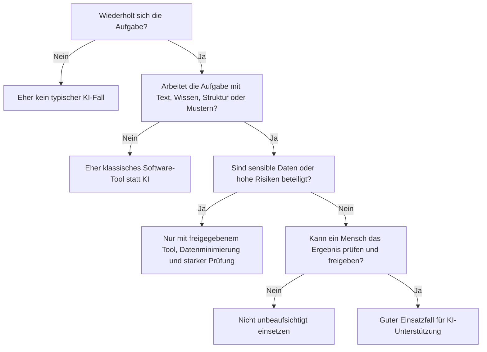
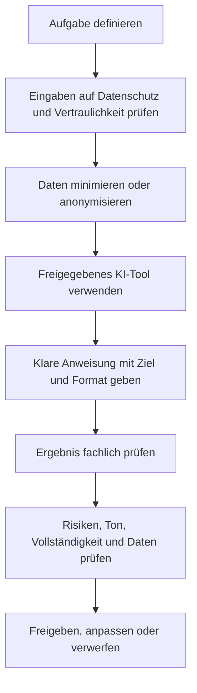

###### Themen

KI im Arbeitsalltag einsetzen

- Wiederkehrende Aufgaben erkennen, die durch KI unterstützt werden können
- KI-Funktionen in typischen Arbeitsanwendungen kennenlernen
- Einfache Beispiele für Zusammenfassungen, Textvorschläge und Strukturierung nutzen

Sicherer und verantwortungsvoller Einsatz von KI

- Datenschutz und Sicherheit bei der Nutzung von KI-Anwendungen beachten
- Sensiblen Umgang mit Eingaben, Daten und Ergebnissen verstehen
- Grundlegende ethische Fragestellungen im Arbeitsalltag einordnen

<br><br><br>
# 🤖 KI im Arbeitsalltag einsetzen

Künstliche Intelligenz ist im Arbeitsalltag am nützlichsten, wenn du sie nicht als „magische Maschine“ verstehst, sondern als **Assistenzsystem**. Sie ist besonders stark darin, Informationen schnell zu verarbeiten, Texte umzuformulieren, Inhalte zu strukturieren, Muster zu erkennen und aus vorhandenem Material einen ersten Entwurf zu bauen. Genau deshalb passt sie gut zu vielen typischen Büro-, Kommunikations- und Wissensaufgaben.

Wichtig ist dabei ein Grundprinzip: **KI ersetzt im Arbeitsalltag oft nicht den Menschen, sondern verschiebt Arbeit**. Weniger Zeit geht für Routinen, Formatierung und Erstentwürfe drauf, dafür wird menschliche Arbeit stärker in Richtung Prüfen, Entscheiden, Priorisieren und Verantworten verlagert. Moderne Arbeitswerkzeuge bringen solche Funktionen bereits direkt mit, etwa für das Schreiben, Zusammenfassen oder Aufbereiten von Inhalten in Office-, Mail- oder Meeting-Anwendungen ([Microsoft 365 Copilot](https://www.microsoft.com/en-us/microsoft-365/copilot), [Gemini for Google Workspace](https://workspace.google.com/intl/en/products/gemini/)).


<br><br><br>
## 🔁 Wiederkehrende Aufgaben erkennen, die durch KI unterstützt werden können

Nicht jede Aufgabe ist automatisch ein guter KI-Fall. Gute Einsatzfelder haben meistens vier Eigenschaften:

Erstens wiederholen sie sich oft. Zweitens folgen sie einer erkennbaren Struktur. Drittens arbeiten sie stark mit Text, Informationen oder Mustern. Viertens kann ein Mensch das Ergebnis am Ende prüfen und freigeben.

Wenn du Aufgaben im Job daraufhin anschaust, merkst du schnell: Sehr viele Tätigkeiten bestehen nicht aus komplett neuen Problemen, sondern aus kleinen wiederkehrenden Schritten. Genau dort kann KI sinnvoll helfen.

Typische Beispiele sind:

| Aufgabe im Alltag | Warum KI hier helfen kann | Typische KI-Unterstützung | Was du trotzdem prüfen musst |
|---|---|---|---|
| E-Mails vorformulieren | ähnliche Muster, wiederkehrende Tonalität | Entwurf, Umformulierung, Kürzung | fachliche Richtigkeit, Ton, Empfängerbezug |
| Besprechungen aufbereiten | viel Text, klare Struktur | Zusammenfassung, To-dos, Entscheidungen extrahieren | ob etwas falsch interpretiert wurde |
| Lange Dokumente lesen | hoher Textumfang, wenig Zeit | Kurzfassung, Kernaussagen, offene Fragen | ob wichtige Details ausgelassen wurden |
| Notizen ordnen | oft ungeordnet und fragmentiert | Gliederung, Themenblöcke, Priorisierung | ob die Struktur wirklich zur Aufgabe passt |
| Standardantworten erstellen | häufig ähnliche Rückfragen | Textvorschläge, FAQ-Antworten | rechtliche oder vertragliche Genauigkeit |
| Inhalte umschreiben | z. B. fachlich → verständlich | Vereinfachen, Ton anpassen, kürzen | ob Inhalt und Bedeutung erhalten bleiben |
| Informationen klassifizieren | wiederkehrende Zuordnung | Sortieren nach Themen, Dringlichkeit, Kategorien | ob die Einordnung korrekt ist |

Ein guter Merksatz lautet: **Je klarer Input, Ziel und gewünschtes Format sind, desto besser arbeitet KI.**

Wenn eine Aufgabe dagegen sehr sensibel, rechtlich heikel, strategisch kritisch oder stark von Kontext, Erfahrung und Verantwortung abhängt, ist Vorsicht nötig. Dann kann KI höchstens vorbereiten, aber nicht entscheiden.

Zum Beispiel:

- Eine KI kann aus 20 E-Mails die wichtigsten offenen Punkte herausziehen.
- Sie sollte aber nicht eigenständig entscheiden, welche Kundenanfrage ignoriert werden darf.
- Eine KI kann Bewerbungstexte sprachlich strukturieren.
- Sie sollte aber nicht ungeprüft über Eignung, Fairness oder Ablehnung von Menschen entscheiden. Gerade im Beschäftigungskontext gelten bestimmte KI-Anwendungen als besonders risikoreich, etwa bei Rekrutierung oder Personalentscheidungen ([Verordnung (EU) 2024/1689 über künstliche Intelligenz](https://eur-lex.europa.eu/eli/reg/2024/1689/oj)).


<br><br><br>
### 🧭 Woran du gute KI-Aufgaben erkennst

Du kannst dir zur Einordnung eine einfache Denkregel merken:

- **Routine?** Gut für KI.
- **Text- oder Informationsarbeit?** Gut für KI.
- **Erstentwurf statt Endentscheidung?** Sehr gut für KI.
- **Sensible Daten oder hohes Risiko?** Nur sehr vorsichtig oder gar nicht.
- **Niemand prüft das Ergebnis?** Schlechter KI-Fall.

So sieht diese Logik als Ablauf aus:



Diese Sichtweise ist wichtig, weil sie dir hilft, KI **gezielt** statt wahllos einzusetzen. Gute Anwender nutzen KI nicht überall, sondern dort, wo sie den größten Hebel bei geringem Risiko hat.


<br><br><br>
## 🧰 KI-Funktionen in typischen Arbeitsanwendungen kennenlernen

Viele Menschen denken bei KI zuerst an einen Chatbot. Im Arbeitsalltag steckt KI aber oft direkt in normalen Anwendungen, die du ohnehin schon kennst. Das ist praktisch, weil du dann nicht jedes Mal ein separates Tool öffnen musst.

Solche Funktionen findest du heute typischerweise in:

| Arbeitsanwendung | Typische KI-Funktionen | Konkreter Nutzen |
|---|---|---|
| E-Mail-Programme | Entwürfe schreiben, Antworten vorschlagen, Ton anpassen, Mails zusammenfassen | schneller reagieren, klarer formulieren |
| Textverarbeitung | Absätze umschreiben, kürzen, vereinfachen, Gliederungen erzeugen | aus Notizen wird ein brauchbarer erster Text |
| Meeting-Tools | Protokolle, To-dos, Entscheidungen und offene Punkte ableiten | weniger Nacharbeit nach Besprechungen |
| Tabellenkalkulation | Formeln erklären, Daten beschreiben, Trends zusammenfassen | Daten schneller verstehen |
| Präsentationstools | Inhalte strukturieren, Folien gliedern, Kernaussagen formulieren | schneller von Idee zu Präsentation |
| Wissens- und Notiztools | Inhalte ordnen, Seiten zusammenfassen, Fragen zu Dokumenten beantworten | Wissen schneller finden und nutzen |
| Projektmanagement-Tools | Aufgaben aus Text ableiten, Prioritäten formulieren, Statusberichte schreiben | bessere Übersicht und weniger manuelle Pflege |

Die Grundidee hinter all diesen Funktionen ist fast immer gleich: Die KI hilft dir dabei, **ungeordnetes Material in verwertbare Form zu bringen**. Das kann ein Text, eine Liste, eine Tabelle, ein Protokoll oder eine Gliederung sein.

In vielen typischen Büro-Szenarien laufen diese Funktionen auf drei Muster hinaus:

1. **Zusammenfassen**  
   Aus viel Material wird eine kurze, verständliche Fassung.

2. **Vorschlagen**  
   Aus deinem Ziel wird ein erster Textentwurf.

3. **Strukturieren**  
   Aus losen Informationen wird eine klare Form.

Genau diese drei Muster sind im Arbeitsalltag besonders wertvoll, weil sie die häufigsten Reibungsverluste reduzieren: zu viel Information, zu wenig Zeit und unklare Rohnotizen.

Dass diese Funktionen heute breit in Standard-Tools ankommen, zeigen etwa typische Produktfunktionen wie Entwurfshilfen in E-Mail und Dokumenten sowie Meeting-Zusammenfassungen und Aufgabenableitungen in Office- und Kollaborationstools ([Microsoft 365 Copilot](https://www.microsoft.com/en-us/microsoft-365/copilot), [Gemini for Google Workspace](https://workspace.google.com/intl/en/products/gemini/)).


<br><br><br>
### 📧 KI in E-Mail und Kommunikation

Gerade bei E-Mails spart KI oft besonders viel Zeit, weil hier viele kleine Routinehandlungen vorkommen. Du musst formulieren, sortieren, höflich bleiben, gleichzeitig kurz sein und oft auf ähnliche Anfragen reagieren.

KI kann dabei helfen:

- einen ersten Antwortentwurf zu schreiben,
- einen langen Mailverlauf knapp zusammenzufassen,
- den Ton anzupassen, etwa sachlicher oder freundlicher,
- aus Stichworten eine vollständige Mail zu machen,
- eine zu lange Nachricht zu kürzen.

Das ist praktisch, aber auch riskant, wenn du unkritisch übernimmst. Denn Mails sind schnell verschickt, und kleine Fehler können peinlich oder fachlich problematisch werden. Deshalb gilt: **KI darf den ersten Wurf schreiben, aber du verantwortest den Versand.**


<br><br><br>
### 📄 KI in Dokumenten und Wissensarbeit

In Dokumenten hilft KI besonders gut, wenn du schon Material hast, aber noch keine gute Form. Beispiele:

- Notizen sollen zu einem strukturierten Bericht werden.
- Ein Fachtext soll für Nicht-Fachleute vereinfacht werden.
- Ein langer Vertrag oder Leitfaden soll auf Kernpunkte reduziert werden.
- Aus verschiedenen Informationsquellen soll eine übersichtliche Gliederung entstehen.

Hier ist KI stark, weil sie Sprache umformen und Inhalte neu ordnen kann. Was sie aber nicht zuverlässig garantiert, ist **inhaltliche Wahrheit**. Wenn du also mit Fach-, Rechts-, Compliance- oder Kundenthemen arbeitest, musst du sehr genau prüfen.


<br><br><br>
### 🎥 KI in Meetings und Zusammenarbeit

Besprechungen erzeugen oft viel Aufwand: mitschreiben, sortieren, Entscheidungen festhalten, To-dos verteilen. Genau hier kann KI entlasten.

Sinnvolle Meeting-Funktionen sind:

- Gesprächsprotokolle erstellen,
- Kernaussagen extrahieren,
- Verantwortlichkeiten und nächste Schritte auflisten,
- offene Fragen sichtbar machen,
- Follow-up-Mails vorbereiten.

Das ist besonders hilfreich, weil Meetings oft unübersichtlich sind. Allerdings kann KI hier leicht Nuancen falsch deuten. Eine vage Aussage kann als „Entscheidung“ erscheinen, obwohl noch gar nichts beschlossen wurde. Deshalb sollte mindestens eine Person das Ergebnis gegenlesen.


<br><br><br>
## ✍️ Einfache Beispiele für Zusammenfassungen, Textvorschläge und Strukturierung nutzen

Damit KI im Alltag wirklich brauchbar wird, musst du nicht „perfekt prompten“. Aber du solltest verstehen, **welche Eingaben gute Ergebnisse erzeugen**.

Ein sehr nützliches Grundschema ist:

| Baustein | Bedeutung | Beispiel |
|---|---|---|
| Kontext | Worum geht es? | „Das ist ein internes Meeting-Protokoll zum Projektstart.“ |
| Ziel | Was soll die KI tun? | „Fasse die wichtigsten Entscheidungen zusammen.“ |
| Format | Wie soll das Ergebnis aussehen? | „Als Liste mit 5 Punkten.“ |
| Zielgruppe | Für wen ist es gedacht? | „Für die Teamleitung, knapp und sachlich.“ |
| Grenzen | Was soll vermieden werden? | „Keine Spekulationen, keine neuen Informationen hinzufügen.“ |

Dieses Schema ist didaktisch wichtig, weil du damit lernst, KI nicht als Rätselmaschine zu benutzen, sondern als Werkzeug mit klaren Anforderungen. Je klarer du formulierst, desto besser ist meist das Ergebnis.


<br><br><br>
### 📝 Beispiele für Zusammenfassungen

Eine Zusammenfassung ist dann gut, wenn sie nicht einfach nur kürzer ist, sondern das Wichtige sichtbar macht. Im Arbeitsalltag sind besonders diese Formen nützlich:

- Kernaussagen
- Entscheidungen
- offene Punkte
- Risiken
- nächste Schritte

Ein brauchbarer Prompt kann so aussehen:

```text
Fasse den folgenden Text für den Arbeitsalltag zusammen.
Ziel: schnelle Übersicht für eine Teamleitung.
Format:
1. Kernaussagen
2. Entscheidungen
3. Offene Punkte
4. Nächste Schritte
Wichtig: nichts erfinden, unklare Stellen als "unklar" markieren.
```

Warum ist das gut? Weil du der KI nicht nur „Fass das zusammen“ sagst, sondern **eine Arbeitsform vorgibst**. Dadurch sinkt das Risiko, dass die Ausgabe zwar nett klingt, aber für den Job unbrauchbar ist.

Du kannst auch die Tiefe steuern:

- **sehr kurz**: 3 Bullet Points für den schnellen Überblick
- **mittel**: kurzer Management-Überblick
- **detailliert**: mit Entscheidungen, Verantwortlichen und Fristen

Gerade bei langen Dokumenten ist es sinnvoll, ausdrücklich nach **fehlenden Informationen** zu fragen. Dann wird die KI nicht nur zum Kürzer-Macher, sondern zu einem Hilfsmittel für bessere Orientierung.

Ein Beispiel:

```text
Lies den folgenden Text und gib mir:
- die 5 wichtigsten Aussagen,
- mögliche Risiken,
- fehlende Informationen,
- Fragen, die vor einer Entscheidung geklärt werden sollten.
```

Damit lernst du eine sehr wichtige Fähigkeit im Umgang mit KI: **nicht nur Inhalte verdichten, sondern Denkstruktur erzeugen.**


<br><br><br>
### 💬 Beispiele für Textvorschläge

Textvorschläge sind vor allem dann sinnvoll, wenn du nicht bei null anfangen willst. KI ist sehr gut im Formulieren eines ersten Entwurfs, den du dann anpasst.

Typische Anwendungsfälle:

- höfliche Antwort auf eine Terminverschiebung,
- sachliche Rückfrage an ein anderes Team,
- kurze Management-Info,
- freundliche Absage,
- interne Statusmeldung.

Ein Beispiel für eine gute Eingabe:

```text
Schreibe eine kurze, freundliche und professionelle E-Mail.
Situation: Ein Projekt verzögert sich um eine Woche, weil ein externer Zulieferer noch nicht geliefert hat.
Zielgruppe: Kunde
Ton: transparent, ruhig, lösungsorientiert
Inhalt:
- Verzögerung benennen
- neuen Zeitplan nennen
- nächste Rückmeldung ankündigen
- keine Schuldzuweisung
```

Warum ist das stark? Weil du der KI vier Dinge gibst:

- Situation
- Zielgruppe
- Ton
- verbindliche Inhalte

Ohne diese Angaben entstehen schnell generische Texte, die zwar sprachlich korrekt, aber kommunikativ schwach sind.

Sehr nützlich ist auch das **Umschreiben in eine andere Tonlage**. Zum Beispiel:

```text
Formuliere diese Nachricht sachlicher und kürzer.
Behalte die Aussage bei.
Vermeide Vorwürfe und Umgangssprache.
```

Oder:

```text
Schreibe aus diesen Stichpunkten eine klare interne Statusmeldung in 6 Sätzen.
```

Das ist im Job sehr hilfreich, wenn du schon weißt, **was** du sagen willst, aber noch nicht, **wie** du es sauber formulierst.


<br><br><br>
### 🧱 Beispiele für Strukturierung

Strukturierung ist eine der unterschätzten Stärken von KI. Viele Aufgaben scheitern nicht am Inhalt, sondern an der fehlenden Ordnung.

KI kann dabei helfen, aus Rohmaterial eine klare Arbeitsstruktur zu machen. Zum Beispiel:

- aus Notizen eine Agenda,
- aus einem Gespräch eine To-do-Liste,
- aus Ideen eine Gliederung,
- aus Anforderungen eine Checkliste,
- aus einem Text eine Tabelle.

Ein Beispiel:

```text
Ordne die folgenden unsortierten Notizen in eine sinnvolle Projektstruktur.
Erzeuge diese Abschnitte:
1. Ziel
2. Aktueller Stand
3. Risiken
4. Offene Fragen
5. Nächste Schritte
Wenn Informationen fehlen, markiere sie.
```

Oder für To-dos:

```text
Erstelle aus dem folgenden Meetingtext eine Aufgabenliste.
Format als Tabelle mit:
- Aufgabe
- Verantwortlich
- Frist
- Abhängigkeiten
Wenn Verantwortlichkeiten nicht eindeutig sind, kennzeichne das.
```

Gerade hier zeigt sich, warum KI im Arbeitsalltag so nützlich sein kann: Sie nimmt dir nicht das Denken ab, aber sie hilft dir, **chaotische Informationen in arbeitsfähige Form zu überführen**.


<br><br><br>
# 🔐 Sicherer und verantwortungsvoller Einsatz von KI

So nützlich KI ist, so wichtig ist ein sauberer Umgang damit. Im Arbeitskontext reichen gute Ergebnisse allein nicht aus. Es geht immer auch um Datenschutz, Sicherheit, Verantwortung, Nachvollziehbarkeit und Fairness.

Ein häufiger Fehler ist, nur auf die Bequemlichkeit zu schauen: „Es geht schnell, also nutze ich es.“ In Unternehmen gilt aber das Gegenteil: **Je schneller ein Tool arbeitet, desto wichtiger ist die Kontrolle darüber, was hineingegeben und was herausgegeben wird.**


<br><br><br>
## 🛡️ Datenschutz und Sicherheit bei der Nutzung von KI-Anwendungen beachten

Sobald du KI im Arbeitsalltag nutzt, arbeitest du oft mit Daten. Und Daten sind nie neutral. Manche sind unkritisch, manche intern, manche vertraulich, manche personenbezogen und manche hochsensibel.

Datenschutz bedeutet im Kern: Du darfst Daten nicht einfach irgendwo eingeben, nur weil ein Tool praktisch ist. Nach der Datenschutz-Grundverordnung gelten unter anderem Grundsätze wie **Zweckbindung**, **Datenminimierung** und **Integrität und Vertraulichkeit** ([Verordnung (EU) 2016/679 – Datenschutz-Grundverordnung](https://eur-lex.europa.eu/eli/reg/2016/679/oj)). Für besondere Kategorien personenbezogener Daten, etwa Gesundheitsdaten, gelten noch strengere Regeln ([Verordnung (EU) 2016/679 – Datenschutz-Grundverordnung](https://eur-lex.europa.eu/eli/reg/2016/679/oj)). Außerdem verlangt die Verordnung angemessene Sicherheitsmaßnahmen bei der Verarbeitung ([Verordnung (EU) 2016/679 – Datenschutz-Grundverordnung](https://eur-lex.europa.eu/eli/reg/2016/679/oj)).

Praktisch heißt das für dich:

- Nicht jedes KI-Tool darf im Unternehmen verwendet werden.
- Nicht jede Information darf in ein KI-System eingegeben werden.
- Nicht jede automatisch erzeugte Ausgabe darf ungeprüft weitergegeben werden.

Sehr wichtig ist die Frage: **Welche Daten gibst du ein?**

| Datenart | Beispiel | Risiko | Gute Praxis |
|---|---|---|---|
| Öffentliche Informationen | bereits veröffentlichte Produktbeschreibung | gering | meist unkritisch, trotzdem prüfen |
| Interne, aber unkritische Daten | allgemeine Prozessnotizen ohne Personenbezug | mittel | nur in freigegebenen Tools |
| Personenbezogene Daten | Namen, E-Mail-Adressen, Leistungsdaten | hoch | minimieren, anonymisieren, nur wenn zulässig |
| Besondere personenbezogene Daten | Gesundheitsdaten, Gewerkschaft, Religion etc. | sehr hoch | grundsätzlich extrem vorsichtig, meist nicht in allgemeine KI-Tools |
| Geschäftsgeheimnisse | Preise, Quellcode, Strategien, Verträge | sehr hoch | nur in ausdrücklich freigegebenen und abgesicherten Systemen |
| Kundendaten | Ansprechpartner, interne Projektstände, Support-Fälle | hoch | nur mit klarer Freigabe und minimaler Datennutzung |

Der wichtigste praktische Schritt ist daher **Datenminimierung**. Gib nur das ein, was für die Aufgabe wirklich nötig ist. Oft reicht statt eines echten Namens auch „Kunde A“, statt einer echten Adresse „[Adresse entfernt]“, statt einer vollständigen Personalakte nur eine abstrahierte Beschreibung des Sachverhalts.

Ein guter Denkstil ist:  
Nicht fragen „Kann die KI das bearbeiten?“, sondern zuerst fragen **„Darf ich diese Information überhaupt in dieses System geben?“**

Außerdem solltest du immer prüfen:

- Ist das Tool von deinem Unternehmen freigegeben?
- Wo werden Daten verarbeitet?
- Werden Eingaben gespeichert?
- Dürfen sie für Training oder Qualitätsverbesserung genutzt werden?
- Wer kann innerhalb des Unternehmens auf die Inhalte zugreifen?

Diese Punkte stehen nicht zufällig in Unternehmensrichtlinien. Sie entscheiden darüber, ob der KI-Einsatz nur praktisch oder auch rechtlich und organisatorisch sauber ist.


<br><br><br>
### 🔒 Was du niemals gedankenlos eingeben solltest

Besonders vorsichtig solltest du bei folgenden Inhalten sein:

- vollständige Personalinformationen,
- Gesundheits- oder Bewerbungsdaten,
- vertrauliche Kundendaten,
- Vertragsinhalte mit Geheimhaltung,
- Zugangsdaten, Tokens, Passwörter,
- unveröffentlichte Finanzdaten,
- Quellcode oder Architekturdetails, wenn keine Freigabe vorliegt.

Hier geht es nicht nur um Datenschutz, sondern auch um Informationssicherheit. Ein einziger unbedachter Prompt kann im schlimmsten Fall Informationen in einen falschen Verarbeitungskontext bringen.

Wenn du einen Fall abstrahieren kannst, dann tue das. Zum Beispiel statt:

> „Bitte analysiere diese Beschwerde von Max Mustermann, geboren am …“

besser:

> „Bitte analysiere diesen anonymisierten Kundenfall und schlage eine sachliche Antwortstruktur vor.“

Du verarbeitest dann die **Aufgabe**, aber nicht unnötig die **Identität**.


<br><br><br>
## 🧠 Sensiblen Umgang mit Eingaben, Daten und Ergebnissen verstehen

Verantwortungsvoller KI-Einsatz endet nicht bei der Eingabe. Er betrifft auch die Art, wie du Ergebnisse bewertest.

Ein zentrales Problem generativer KI ist, dass sie überzeugend klingende Antworten erzeugen kann, die trotzdem fehlerhaft oder erfunden sind. NIST beschreibt bei generativer KI ausdrücklich Risiken wie „Confabulation“, also inhaltlich falsche, aber plausibel wirkende Ausgaben ([Artificial Intelligence Risk Management Framework: Generative Artificial Intelligence Profile](https://nvlpubs.nist.gov/nistpubs/ai/NIST.AI.600-1.pdf)).

Das ist im Arbeitsalltag besonders tückisch, weil gute Sprache leicht Kompetenz vortäuscht. Ein sauber formulierter Text kann trotzdem:

- Fakten verdrehen,
- Zahlen falsch wiedergeben,
- Quellen erfinden,
- wichtige Einschränkungen weglassen,
- juristische oder fachliche Grenzen ignorieren.

Deshalb gilt: **Sprachqualität ist kein Wahrheitsbeweis.**


<br><br><br>
### 🧾 Gute Eingaben: präzise, sparsam, kontextklar

Eine gute Eingabe ist nicht einfach lang, sondern sinnvoll strukturiert. Sie sollte genau genug sein, damit die KI weiß, was du willst, aber nicht unnötig viele Daten enthalten.

Gute Eingaben haben oft diese Eigenschaften:

- klares Ziel,
- klare Rolle oder Zielgruppe,
- gewünschtes Format,
- explizite Grenzen,
- nur notwendige Daten.

Ein Beispiel für einen schlechten Ansatz wäre:

```text
Mach das besser.
```

Damit kann fast alles gemeint sein.

Ein besserer Ansatz wäre:

```text
Überarbeite den folgenden internen Text.
Ziel: verständlich für fachfremde Kolleginnen und Kollegen.
Format: 1 kurzer Absatz + 3 Kernpunkte.
Wichtig: keine neuen Informationen hinzufügen.
```

So eine Eingabe ist fachlich sauberer, besser kontrollierbar und meist datensparsamer.


<br><br><br>
### ✅ Ergebnisse richtig prüfen

Die Prüfung von KI-Ergebnissen ist keine Nebensache, sondern der Kern verantwortungsvoller Nutzung. Je nach Aufgabe solltest du unterschiedliche Dinge kontrollieren:

| Prüffrage | Warum sie wichtig ist |
|---|---|
| Stimmen die Fakten? | KI kann plausible Fehler erzeugen |
| Fehlen wichtige Details? | Zusammenfassungen lassen oft Kontext weg |
| Wurde etwas hinzugedichtet? | Generative Modelle ergänzen manchmal unzulässig |
| Passt der Ton zur Situation? | Texte können ungewollt zu hart, weich oder riskant wirken |
| Ist das Ergebnis vollständig? | To-dos, Fristen oder Einschränkungen können fehlen |
| Ist die Ausgabe datenschutzkonform? | Ergebnisse können sensible Daten erneut sichtbar machen |
| Ist die Entscheidung nachvollziehbar? | Besonders wichtig bei Personal-, Kunden- oder Compliance-Themen |

Besonders kritisch sind Bereiche, in denen Fehler direkte Folgen für Menschen oder das Unternehmen haben. Dazu gehören etwa:

- Personalthemen,
- rechtliche Kommunikation,
- Leistungsbeurteilungen,
- Vertragsfragen,
- Sicherheits- und Compliance-Fälle,
- Kundenkommunikation mit Verpflichtungscharakter.

In solchen Fällen sollte KI eher **vorbereiten** als **entscheiden**.


<br><br><br>
### 👤 Menschliche Kontrolle bleibt Pflicht

Ein sehr gesundes Arbeitsprinzip lautet: **KI schreibt mit, denkt mit, sortiert mit – aber sie trägt keine Verantwortung.**

Verantwortung bleibt bei Menschen und Organisationen. Das bedeutet konkret:

- Ein Mensch gibt frei.
- Ein Mensch bewertet Risiken.
- Ein Mensch entscheidet im Grenzfall.
- Ein Mensch muss erklären können, warum ein Ergebnis verwendet wurde.

Gerade im Arbeitsalltag ist das wichtig, weil KI-Ausgaben oft in Prozesse einfließen, die Außenwirkung haben. Wenn ein Angebot, eine Kundenantwort, eine interne Bewertung oder ein Bericht auf KI basiert, bleibt die Verantwortung trotzdem bei der Person oder dem Team, das ihn verwendet.

Ein sinnvoller Arbeitsablauf sieht so aus:



Diese Art zu arbeiten ist nicht nur sicherer, sondern auch professioneller. Du nutzt die Geschwindigkeit der KI, ohne die Qualitätskontrolle aufzugeben.


<br><br><br>
## ⚖️ Grundlegende ethische Fragestellungen im Arbeitsalltag einordnen

Ethik klingt oft abstrakt, ist im Arbeitsalltag aber sehr konkret. Immer wenn KI mit Menschen, Entscheidungen, Bewertungen oder Kommunikation zu tun hat, tauchen ethische Fragen auf.

Die wichtigsten sind:

- **Fairness**
- **Transparenz**
- **Verantwortung**
- **Beeinflussung**
- **Menschliche Autonomie**

Gerade im Beschäftigungskontext ist das besonders relevant, weil KI dort über Chancen, Bewertungen und Kommunikation mitentscheiden kann. Der EU AI Act behandelt bestimmte KI-Anwendungen in Beschäftigung und Personal gerade deshalb als Hochrisiko-Bereich ([Verordnung (EU) 2024/1689 über künstliche Intelligenz](https://eur-lex.europa.eu/eli/reg/2024/1689/oj)).


<br><br><br>
### ⚖️ Fairness und Verzerrungen

KI lernt aus Daten, Beispielen und Mustern. Wenn in diesen Mustern Verzerrungen stecken, können sie sich in den Ergebnissen wiederfinden. Das ist besonders problematisch bei Aufgaben wie:

- Bewerbungen vorsortieren,
- Leistung einschätzen,
- Texte über Personen zusammenfassen,
- Kundengruppen bewerten,
- Prioritäten nach historischen Fällen festlegen.

Das ethische Problem dabei ist nicht nur ein technischer Fehler, sondern mögliche Benachteiligung. Wenn ein Modell bestimmte Formulierungen, Lebensläufe oder Sprachstile bevorzugt, kann das Menschen unfair behandeln.

Im Arbeitsalltag folgt daraus eine wichtige Regel: **KI darf Menschen nicht heimlich nach fragwürdigen Mustern bewerten.** Wo Menschen betroffen sind, braucht es besondere Vorsicht, Transparenz und Prüfung.


<br><br><br>
### 🪟 Transparenz: Wann sollte klar sein, dass KI beteiligt war?

Transparenz bedeutet, dass nachvollziehbar bleibt, wo KI geholfen hat und wo nicht. Nicht in jeder Kleinigkeit musst du da einen großen Hinweis anbringen. Aber in vielen Situationen ist Offenheit sinnvoll oder sogar nötig.

Zum Beispiel, wenn:

- ein Protokoll automatisiert erzeugt wurde,
- eine Kundenantwort weitgehend KI-generiert ist,
- interne Entscheidungsgrundlagen durch KI vorsortiert wurden,
- Bewertungen oder Empfehlungen mit KI vorbereitet wurden.

Warum ist das wichtig? Weil andere sonst leicht annehmen, ein Text oder eine Einschätzung sei vollständig menschlich geprüft oder individuell erstellt worden, obwohl das nicht stimmt.

Transparenz schafft hier Fairness und reduziert blinde Vertrauensannahmen.


<br><br><br>
### 🧑‍⚖️ Verantwortung und Rechenschaft

Eine der wichtigsten ethischen Fragen lautet: **Wer ist verantwortlich, wenn das KI-Ergebnis falsch, unfair oder schädlich ist?**

Die praktisch richtige Antwort ist: nicht das Modell, sondern immer ein Mensch oder eine Organisation.

Deshalb braucht verantwortungsvoller KI-Einsatz im Arbeitsalltag klare Regeln:

- Wer darf welche Tools nutzen?
- Für welche Aufgaben ist KI erlaubt?
- Wer prüft Ergebnisse?
- Wann ist eine zweite Freigabe nötig?
- Was muss dokumentiert werden?

Ohne diese Regeln entsteht schnell ein gefährlicher Zustand: Die KI produziert Inhalte, aber niemand fühlt sich wirklich zuständig. Genau das sollte vermieden werden.


<br><br><br>
### 🧠 Nicht alles, was bequem ist, ist auch gut

Ethisch problematisch wird KI auch dann, wenn sie menschliche Sorgfalt verdrängt. Das passiert oft schleichend:

- Man prüft weniger genau, weil der Text so gut klingt.
- Man übernimmt Empfehlungen, weil sie schnell da sind.
- Man verlernt, Dinge selbst zu strukturieren.
- Man gibt der KI mehr Vertrauen, als sie verdient.

Das ist kein rein technisches Problem, sondern eine Frage guter Arbeitspraxis. Verantwortungsvolle Nutzung heißt deshalb auch, die eigene Urteilskraft nicht auszulagern.

Ein guter Arbeitsstil mit KI ist nicht:  
**„Die KI wird schon recht haben.“**

Sondern:  
**„Die KI hilft mir beim Denken und Formulieren, aber ich bleibe für Qualität, Wirkung und Folgen verantwortlich.“**


<br><br><br>
### 🏢 Ethisch sauber handeln im Team und Unternehmen

Im Unternehmen wird KI dann wirklich verantwortungsvoll eingesetzt, wenn nicht jede Person allein improvisiert, sondern gemeinsame Standards gelten.

Dazu gehören zum Beispiel:

| Bereich | Gute Praxis |
|---|---|
| Tool-Auswahl | nur freigegebene und bewertete Anwendungen nutzen |
| Dateneingabe | minimal, anonymisiert, zweckgebunden |
| Qualitätskontrolle | Ergebnisse immer passend zum Risiko prüfen |
| Menschliche Entscheidung | keine blinde Automatisierung bei kritischen Themen |
| Dokumentation | nachvollziehbar machen, wo KI genutzt wurde |
| Kommunikation | offen damit umgehen, wenn KI sichtbar beteiligt war |
| Schulung | Mitarbeitende lernen nicht nur Bedienung, sondern auch Grenzen |

So wird KI nicht nur effizient, sondern auch professionell eingesetzt. Und genau das ist im Arbeitsalltag der entscheidende Unterschied zwischen bloßem Ausprobieren und wirklich gutem, verantwortungsvollem Arbeiten mit KI.