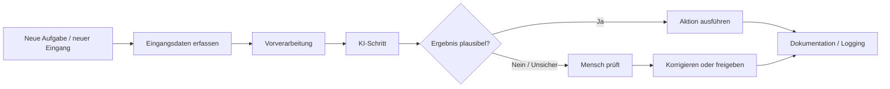
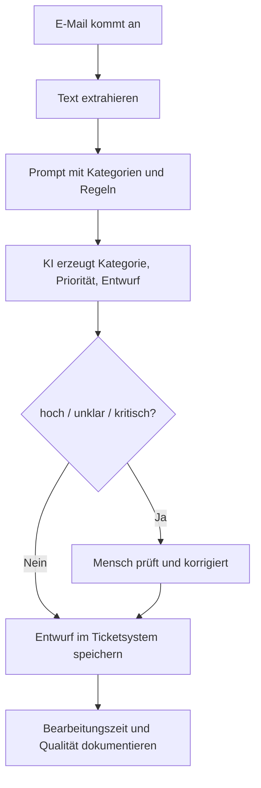
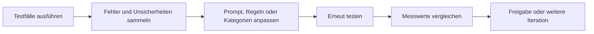

###### Themen

Prozessoptimierung mit KI

- Einfache Arbeitsabläufe auf Automatisierungspotenzial prüfen
- Kleine KI-gestützte Workflows für typische Aufgaben entwerfen

Projektbasierte Anwendung

- Einen einfachen KI-gestützten Mini-Workflow planen und umsetzen
- Ergebnisse vorstellen und gemeinsam reflektieren
- Chancen, Grenzen und Verbesserungsmöglichkeiten des eigenen Workflows benennen

   
# 🤖 Prozessoptimierung mit KI

Prozessoptimierung mit KI bedeutet nicht, dass du sofort ganze Abteilungen oder komplette Geschäftsprozesse automatisierst. In der Praxis beginnt es fast immer viel kleiner: Du schaust dir einen einfachen, wiederkehrenden Ablauf an, prüfst, ob er sich teilweise automatisieren lässt, und baust dann einen kleinen Workflow, der genau an einer sinnvollen Stelle KI nutzt.

Wichtig ist dabei ein Grundgedanke: **Nicht jeder Prozess ist automatisch ein guter KI-Prozess.** Manche Aufgaben lassen sich hervorragend durch KI unterstützen, andere eher schlecht. Gerade bei den Grundlagen ist es deshalb sinnvoll, zuerst zu verstehen, **welche Art von Arbeit sich eignet**, **wo Risiken liegen** und **wie man einen kleinen, kontrollierbaren Workflow entwirft**, statt direkt etwas Großes und Komplexes zu bauen.

Wiederkehrende, digital vorliegende und sprachbasierte Aufgaben sind oft gute Kandidaten. Gleichzeitig empfehlen etablierte Leitlinien, Risiken, Messbarkeit und menschliche Aufsicht von Anfang an mitzudenken, statt erst hinterher zu prüfen, ob das System eigentlich zuverlässig genug ist ([AI Risk Management Framework (AI RMF 1.0)](https://nvlpubs.nist.gov/nistpubs/ai/NIST.AI.100-1.pdf)).

   
## 🔍 Einfache Arbeitsabläufe auf Automatisierungspotenzial prüfen

Wenn du einen Arbeitsablauf auf Automatisierungspotenzial prüfen willst, dann stell dir im Kern eine einfache Frage:

**Ist diese Aufgabe so klar, häufig und strukturiert, dass ein System sie zuverlässig unterstützen kann?**

Ein Arbeitsablauf ist dabei einfach gesagt eine Folge von Schritten. Zum Beispiel:

- Eine E-Mail kommt an
- Der Inhalt wird gelesen
- Das Thema wird erkannt
- Die Nachricht wird einer Kategorie zugeordnet
- Es wird ein Antwortentwurf erstellt
- Ein Mensch prüft und versendet

So ein Ablauf ist viel besser prüfbar als ein unscharfes Ziel wie „Kundenservice verbessern“. Für KI brauchst du also zuerst einen **konkreten, beobachtbaren Ablauf**.

   
### 🧩 Woran du einen guten Automatisierungskandidaten erkennst

Ein Prozess eignet sich besonders gut für KI-Unterstützung, wenn mehrere der folgenden Punkte zutreffen:

| Kriterium | Gute Eignung | Schlechte Eignung | Warum das wichtig ist |
|---|---|---|---|
| Wiederholung | Aufgabe kommt oft vor | Aufgabe ist selten oder einmalig | Wiederholte Aufgaben lohnen sich eher zu automatisieren |
| Standardisierung | Schritte sind ähnlich | Jeder Fall ist völlig anders | KI braucht erkennbare Muster |
| Digitale Daten | Texte, Formulare, Tabellen, Mails | Nur informelle Gespräche oder unstrukturierte Offline-Daten | Digitale Eingaben lassen sich leichter verarbeiten |
| Klare Eingabe/Ausgabe | Input und gewünschtes Ergebnis sind klar | Ergebnis ist schwammig oder rein kreativ-offen | Ein Workflow braucht definierte Übergaben |
| Niedriges Risiko | Fehler sind korrigierbar | Fehler wären teuer, rechtlich heikel oder gefährlich | Je höher das Risiko, desto mehr Kontrolle ist nötig |
| Sprachbezug | Klassifizieren, zusammenfassen, formulieren, extrahieren | Präzise Fachentscheidung mit hoher Haftung | Sprachmodelle sind stark bei Text, aber nicht automatisch zuverlässig bei Hochrisiko-Entscheidungen |
| Messbarkeit | Qualität, Zeit oder Fehlerquote sind messbar | Erfolg ist kaum bewertbar | Ohne Metrik kannst du keine Verbesserung nachweisen |

Gerade **regelmäßige Textarbeit** ist oft ideal. Dazu gehören etwa:

- E-Mails vorsortieren
- Meeting-Notizen zusammenfassen
- Informationen aus Texten extrahieren
- Standardantworten vorbereiten
- Support-Anfragen klassifizieren
- Inhalte in ein festes Format umwandeln

Sprachmodelle sind besonders nützlich bei Aufgaben wie **Klassifikation, Extraktion, Zusammenfassung und Umformulierung von Text**, wenn die Anweisung klar ist und das gewünschte Ausgabeformat sauber beschrieben wird ([Best practices for prompt engineering with the OpenAI API](https://help.openai.com/en/articles/6654000-best-practices-for-prompt-engineering-with-the-openai-api)).

   
### 📏 Eine einfache Prüfmethode für Automatisierungspotenzial

Damit du nicht nur nach Bauchgefühl entscheidest, kannst du einen Prozess mit einer kleinen Bewertungslogik prüfen. Das muss gar nicht kompliziert sein.

Gib für jedes Kriterium 0 bis 2 Punkte:

- **0 Punkte** = schlecht geeignet
- **1 Punkt** = teilweise geeignet
- **2 Punkte** = gut geeignet

| Prüffrage | 0 | 1 | 2 |
|---|---:|---:|---:|
| Kommt die Aufgabe häufig vor? | selten | manchmal | oft |
| Ist der Ablauf ähnlich und wiederholbar? | nein | teilweise | ja |
| Sind Ein- und Ausgaben klar? | unklar | teilweise | klar |
| Liegen die Daten digital vor? | nein | teilweise | ja |
| Ist das Fehlerrisiko gering oder kontrollierbar? | nein | mittel | ja |
| Kann ein Mensch leicht gegenprüfen? | schwer | teilweise | leicht |
| Ist der Erfolg messbar? | kaum | teilweise | gut |

Je höher die Gesamtpunktzahl, desto besser ist der Prozess für einen ersten kleinen KI-Workflow geeignet.

**Faustregel:**

- **11–14 Punkte**: sehr guter Kandidat
- **7–10 Punkte**: brauchbar, aber mit Vorsicht
- **0–6 Punkte**: eher ungeeignet für einen ersten KI-Workflow

Das ist natürlich kein Naturgesetz, aber es hilft dir, Prozesse sachlich zu beurteilen statt dich von „KI klingt spannend“ leiten zu lassen.

   
### 🛑 Wann du besser nicht oder nur teilweise automatisierst

Es gibt Prozesse, bei denen du sehr vorsichtig sein solltest. Besonders dann, wenn:

- falsche Entscheidungen Menschen ernsthaft schaden könnten,
- rechtliche oder finanzielle Folgen groß sind,
- sensible personenbezogene Daten verarbeitet werden,
- die Aufgabe starke Kontextkenntnis oder Fachverantwortung verlangt,
- das Ergebnis nicht einfach kontrolliert werden kann.

Wenn personenbezogene Daten verarbeitet werden, musst du Zweckbindung, Datenminimierung und Datenschutz mitdenken; das ist kein Zusatzthema, sondern Teil der Systemgestaltung ([Regulation (EU) 2016/679 (General Data Protection Regulation)](https://eur-lex.europa.eu/eli/reg/2016/679/oj)).

Auch aus Sicht vertrauenswürdiger KI sind **Robustheit, Transparenz, Nachvollziehbarkeit und Verantwortlichkeit** zentrale Prinzipien ([OECD AI Principles overview](https://oecd.ai/en/ai-principles)).

Das bedeutet praktisch:  
Wenn ein Workflow nur dann „funktioniert“, wenn niemand mehr hinschaut, dann ist er oft schlecht gebaut. Gute KI-Prozesse sind so gestaltet, dass ein Mensch **an den richtigen Stellen eingreifen, prüfen und freigeben** kann.

   
## 🛠️ Kleine KI-gestützte Workflows für typische Aufgaben entwerfen

Wenn du einen kleinen KI-Workflow entwirfst, dann solltest du KI nicht als „magische Allzwecklösung“ behandeln, sondern als **einen Baustein innerhalb eines klaren Ablaufs**.

Die wichtigste Denkweise ist:

**Nicht die ganze Arbeit wird von KI erledigt. Die KI übernimmt nur den Teil, den sie gut kann.**

Das ist ein großer Unterschied. Ein sauberer Workflow trennt zwischen:

- **Eingang**
- **Vorbereitung**
- **KI-Schritt**
- **Prüfung**
- **Aktion**
- **Dokumentation**

Dadurch wird das Ganze kontrollierbarer und verlässlicher.

   
### 🧠 Was KI in typischen Workflows gut kann

KI ist besonders stark, wenn Sprache im Mittelpunkt steht. Gute Einsatzfelder sind zum Beispiel:

| Typische Aufgabe | Was die KI macht | Beispiel |
|---|---|---|
| Klassifikation | Inhalte Kategorien zuordnen | „Rechnung“, „Beschwerde“, „Terminfrage“ |
| Extraktion | Wichtige Infos herausziehen | Name, Datum, Ticketnummer, Frist |
| Zusammenfassung | Kernaussagen komprimieren | Meeting-Protokoll in 5 Punkten |
| Umformulierung | Text an Stil oder Zielgruppe anpassen | Fachtext in einfache Sprache |
| Entwurfserstellung | Rohfassung generieren | Antwortentwurf für Support |
| Strukturierung | Unstrukturierte Infos in Format bringen | Text in Tabelle oder JSON |

Damit solche Workflows stabiler laufen, helfen klare Instruktionen, Beispiele und ein gewünschtes Ausgabeformat. Genau das wird in Prompting-Leitlinien immer wieder empfohlen ([Best practices for prompt engineering with the OpenAI API](https://help.openai.com/en/articles/6654000-best-practices-for-prompt-engineering-with-the-openai-api)).

Was KI **nicht automatisch gut** kann, ist:

- faktische Korrektheit garantieren,
- verbindliche Entscheidungen mit hoher Tragweite treffen,
- fehlende Informationen „ehrlich offen“ behandeln, wenn der Workflow schlecht gebaut ist,
- rechtliche oder fachliche Verantwortung übernehmen.

Deshalb brauchst du fast immer einen **Prüfschritt** oder klare Regeln, wann ein Mensch übernimmt.

   
### 🧱 Bausteine eines kleinen KI-Workflows

Ein sinnvoller Mini-Workflow besteht meist aus sechs Bausteinen.

| Baustein | Erklärung |
|---|---|
| Auslöser | Was startet den Ablauf? Zum Beispiel eine neue E-Mail oder ein neues Dokument |
| Eingangsdaten | Was bekommt der Workflow? Text, Formular, PDF, Chat-Nachricht |
| Vorverarbeitung | Daten säubern, irrelevante Teile entfernen, Format vereinheitlichen |
| KI-Schritt | Klassifizieren, extrahieren, zusammenfassen, formulieren |
| Kontrolle | Ergebnis prüfen, Unsicherheiten erkennen, ggf. Mensch einbinden |
| Aktion | Speichern, markieren, Antwortentwurf ablegen, Ticket erstellen |

Der **Kontrollteil** ist extrem wichtig. Ein Workflow ist nicht deshalb gut, weil er vollautomatisch ist, sondern weil er **zuverlässig genug für seinen Zweck** ist. NIST betont genau diese Verbindung aus Leistungsfähigkeit, Risikobetrachtung und laufender Überwachung ([AI Risk Management Framework (AI RMF 1.0)](https://nvlpubs.nist.gov/nistpubs/ai/NIST.AI.100-1.pdf)).

   
### 🧾 Wie du einen guten KI-Schritt formulierst

Der KI-Schritt braucht eine klare Aufgabenbeschreibung. Ein guter Prompt ist in einem Workflow meistens nicht „kreativ“, sondern eher **präzise und technisch sauber**.

Ein stabiler Prompt enthält oft:

- die Rolle oder Aufgabe der KI,
- den konkreten Arbeitsauftrag,
- klare Kriterien,
- das gewünschte Ausgabeformat,
- Regeln für Unsicherheit,
- optional ein Beispiel.

Statt nur zu schreiben:

> „Fasse die E-Mail zusammen“

ist das hier viel besser:

> „Lies die E-Mail. Ordne sie einer der Kategorien Rechnung, Support, Termin oder Sonstiges zu. Extrahiere Kundennamen, Dringlichkeit und gewünschte Aktion. Gib das Ergebnis als Tabelle mit den Spalten Kategorie, Name, Dringlichkeit, Aktion aus. Wenn Informationen fehlen, schreibe ‚unbekannt‘ statt zu raten.“

Warum ist das besser?  
Weil der Prompt dem Modell nicht nur sagt, **was** es tun soll, sondern auch **wie vorsichtig** und **in welchem Format**. Das reduziert Streuung und macht die Ergebnisse weiterverarbeitbar.

   
### 🔄 Grundmuster eines kleinen KI-Workflows

Hier siehst du das Grundmuster als Mermaid-Diagramm:

Das ist der entscheidende Punkt:  
**Die KI steht in der Mitte, nicht am Ende der Verantwortung.**

Gerade bei ersten Projekten solltest du möglichst vermeiden, dass die KI direkt ohne Prüfung nach außen kommuniziert, Entscheidungen verschickt oder Daten endgültig verbucht.

   
### 🧪 Typische Mini-Workflows für den Einstieg

Für einen ersten, realistischen Einstieg sind diese Beispiele oft gut geeignet:

| Mini-Workflow | Warum gut geeignet |
|---|---|
| E-Mails nach Thema sortieren | klare Textdaten, häufig, leicht kontrollierbar |
| Meeting-Notizen zusammenfassen | sprachlastig, geringer Schaden bei Fehlern |
| Support-Anfragen priorisieren | nützlich, aber mit menschlicher Freigabe gut beherrschbar |
| Standardantworten entwerfen | spart Zeit, Mensch kann final prüfen |
| Informationen aus Formulartext ziehen | klar definierte Felder, gut messbar |

Wenn du lernst, solltest du absichtlich **klein anfangen**. Ein Mini-Workflow ist didaktisch wertvoller als ein großes System, das niemand wirklich versteht. Du lernst dadurch, wie Datenfluss, Prompt, Validierung und menschliche Kontrolle zusammenspielen.

   
# 🧪 Projektbasierte Anwendung

Die projektbasierte Anwendung ist der Schritt von der Theorie in die Praxis. Hier geht es nicht nur darum, zu wissen, **was** möglich ist, sondern einen konkreten Workflow zu **planen, umzusetzen, zu zeigen und kritisch zu bewerten**.

Didaktisch ist das wichtig, weil du beim Bauen merkst:

- wo Daten fehlen,
- wo Anweisungen zu unklar sind,
- wo Ergebnisse schwanken,
- wo menschliche Kontrolle nötig bleibt,
- und wo der eigentliche Nutzen wirklich entsteht.

Ein kleines Projekt macht diese Punkte viel greifbarer als jede rein theoretische Erklärung.

   
## 🗺️ Einen einfachen KI-gestützten Mini-Workflow planen und umsetzen

Der wichtigste Fehler am Anfang ist meist: Man plant zu groß.  
Besser ist ein sehr kleiner, klar begrenzter Workflow mit sichtbarem Nutzen.

Ein gutes erstes Projekt sollte:

- nur einen klaren Startpunkt haben,
- nur eine kleine Aufgabe automatisieren,
- leicht testbar sein,
- mit wenigen Beispielen auskommen,
- und ein Ergebnis liefern, das ein Mensch schnell prüfen kann.

   
### 🎯 Schritt 1: Ziel und Nutzen sauber festlegen

Bevor du irgendein Tool auswählst, musst du das Ziel präzise beschreiben.

Schlecht wäre:

> „Wir wollen KI im Büro einsetzen.“

Viel besser wäre:

> „Eingehende Support-E-Mails sollen automatisch in 4 Kategorien sortiert und mit einem Antwortentwurf vorbereitet werden, damit die Erstbearbeitung schneller wird.“

So eine Formulierung ist gut, weil sie fünf Dinge klar macht:

1. **Eingang**: Support-E-Mails  
2. **KI-Aufgabe**: Klassifizieren und Entwurf erstellen  
3. **Umfang**: nur Erstbearbeitung  
4. **Ziel**: Zeit sparen  
5. **Prüfbarkeit**: Kategorien und Entwürfe lassen sich kontrollieren

   
### 🧱 Schritt 2: Prozess vorher und nachher beschreiben

Du solltest den Ablauf zuerst **ohne KI** und dann **mit KI** aufzeichnen.

**Vorher:**

1. E-Mail kommt an  
2. Mitarbeitende lesen alles selbst  
3. Thema wird erkannt  
4. Priorität wird eingeschätzt  
5. Antwort wird manuell formuliert

**Nachher:**

1. E-Mail kommt an  
2. Workflow übergibt Text an das KI-Modell  
3. KI schlägt Kategorie, Priorität und Entwurf vor  
4. Mensch prüft  
5. Freigabe oder Korrektur  
6. Antwort wird versendet

Dadurch siehst du sofort:  
Die KI ersetzt hier nicht den ganzen Support, sondern **verkürzt die Vorarbeit**.

   
### ⚙️ Schritt 3: Eingaben, Ausgaben und Regeln definieren

Jetzt musst du festlegen, was genau hinein- und herausgeht.

| Element | Beispiel |
|---|---|
| Eingabe | Text der E-Mail |
| Zusatzinfos | bekannte Kategorien, Prioritätsregeln, Firmenstil |
| KI-Ausgabe | Kategorie, Priorität, Kurzbegründung, Antwortentwurf |
| Prüfregel | Wenn Priorität „hoch“ oder Kategorie unklar, dann manuelle Prüfung |
| Aktion | Entwurf im Ticketsystem speichern, nicht direkt versenden |

Je klarer diese Definition ist, desto besser wird dein Workflow.

Vor allem solltest du Regeln für Unsicherheit einbauen. Ein System darf nicht so tun, als sei es sicher, wenn es eigentlich nur rät. Genau deshalb sind Transparenz und kontrollierbare Prozesse so wichtig ([OECD AI Principles overview](https://oecd.ai/en/ai-principles)).

   
### 🛠️ Schritt 4: Einen einfachen Umsetzungsweg wählen

Für ein Lern- oder Einstiegsprojekt brauchst du keine komplizierte Plattform. Technisch kann ein Mini-Workflow schon mit einfachen Mitteln gebaut werden, zum Beispiel mit:

- einem Formular oder E-Mail-Postfach als Eingang,
- einer einfachen Automatisierungslogik,
- einem KI-Aufruf für Textverarbeitung,
- einer Ausgabe in Tabelle, Ticket oder Dokument.

Wichtiger als das Tool ist die **saubere Struktur**.

Ein guter Lernaufbau ist:

1. Manuelle Sammlung von 10–30 echten oder realistischen Beispielen  
2. Klare Kategorien und gewünschte Ergebnisse definieren  
3. Prompt bauen  
4. Ergebnisse testen  
5. Fehler analysieren  
6. Regeln nachschärfen  
7. Erst dann in einen kleinen Workflow einbauen

Das entspricht auch guter Lernpraxis: erst verstehen, dann systematisieren, dann automatisieren.

   
### 📨 Konkretes Beispiel: Mini-Workflow für Support-E-Mails

Nehmen wir ein vollständiges kleines Projekt.

**Ziel:**  
Support-E-Mails automatisch vorsortieren und einen Antwortentwurf erzeugen.

**Kategorien:**

- Rechnung
- Technisches Problem
- Termin
- Allgemeine Anfrage

**Gewünschte Ausgabe:**

- Kategorie
- Priorität: niedrig, mittel, hoch
- Kurzbegründung
- Antwortentwurf

**Regeln:**

- Wenn „Kündigung“, „Datenverlust“ oder „Ausfall“ vorkommt, immer manuelle Prüfung
- Wenn die KI keine klare Kategorie erkennt, Kategorie = „unklar“
- Es wird nie automatisch versendet
- Alle Ergebnisse werden gespeichert, damit man sie später auswerten kann

Hier eine mögliche Visualisierung:

Dieses Beispiel ist didaktisch stark, weil du sehr viel daran lernst:

- Wie formuliert man Kategorien eindeutig?
- Wo irrt die KI?
- Welche Wörter führen zu Fehlklassifikationen?
- Wann ist menschliche Freigabe zwingend?
- Wie misst man den Nutzen?

   
### 📊 Schritt 5: Erfolg messbar machen

Ein Projekt ist erst dann wirklich professionell, wenn du messen kannst, ob es etwas verbessert.

Typische Messgrößen sind:

| Messgröße | Frage |
|---|---|
| Bearbeitungszeit | Geht die Erstbearbeitung schneller? |
| Trefferquote bei Kategorien | Ordnet die KI richtig zu? |
| Nachbearbeitungsaufwand | Wie oft muss stark korrigiert werden? |
| Konsistenz | Werden ähnliche Fälle ähnlich behandelt? |
| Nutzbarkeit des Entwurfs | Spart der Entwurf wirklich Arbeit? |

Du brauchst dafür keine perfekte Statistik. Schon ein einfacher Vorher-Nachher-Vergleich mit einer kleinen Testmenge kann sehr viel zeigen.

Wichtig ist nur:  
Nicht allein auf „fühlt sich schneller an“ verlassen. Gute Prozessoptimierung braucht beobachtbare Kriterien.

   
## 🗣️ Ergebnisse vorstellen und gemeinsam reflektieren

Wenn du einen KI-Workflow vorstellst, geht es nicht nur darum zu sagen: „Es funktioniert.“  
Viel wichtiger ist zu zeigen:

- **was genau automatisiert wurde,**
- **was gut funktioniert,**
- **wo Fehler entstehen,**
- **und welche Grenzen sichtbar wurden.**

Das Vorstellen ist also kein Verkaufsgespräch, sondern eine **technisch ehrliche Prozessanalyse**.

   
### 📌 Was du bei der Vorstellung zeigen solltest

Eine gute Vorstellung eines Mini-Workflows besteht aus fünf Teilen.

| Teil | Inhalt |
|---|---|
| Ausgangslage | Welches Problem oder welcher Engpass bestand vorher? |
| Zielbild | Was sollte der Workflow verbessern? |
| Ablauf | Wie sieht der Prozessschritt mit KI konkret aus? |
| Beispiele | 2–3 echte oder realistische Ein-/Ausgaben zeigen |
| Bewertung | Wo spart er Zeit, wo macht er Fehler, wo braucht es Menschen? |

Besonders wertvoll ist es, **echte Beispielergebnisse** zu zeigen. Nicht nur gelungene Fälle, sondern auch Grenzfälle. Denn daran erkennt man, ob du den Workflow wirklich verstanden hast.

Ein reifes Projekt zeigt nicht nur die Stärken, sondern auch die Problemzonen.

   
### 🔍 Worauf gemeinsame Reflexion abzielt

Gemeinsame Reflexion heißt, dass du den Workflow nicht nur technisch, sondern auch praktisch und kritisch betrachtest.

Dabei geht es um Fragen wie:

- Passt der Workflow wirklich zum Alltag?
- Spart er an der richtigen Stelle Zeit?
- Sind die Ergebnisse ausreichend verlässlich?
- Ist der Prüfschritt sinnvoll eingebaut?
- Werden Risiken gut abgefangen?
- Sind Prompt, Regeln oder Kategorien noch zu unklar?

Das ist wichtig, weil KI-Systeme in der Praxis selten beim ersten Versuch schon optimal sind. Gute Ergebnisse entstehen fast immer durch **Iteration**: testen, Fehler verstehen, nachschärfen, erneut testen.

   
### 🧠 Was du aus Fehlern lernen kannst

Gerade Fehler sind im Lernprozess besonders wertvoll. Wenn ein Workflow falsche Ergebnisse liefert, dann liegt das oft nicht nur „an der KI“, sondern an einem dieser Punkte:

- Kategorien sind zu unscharf
- Beispiele fehlen
- Eingabedaten sind unvollständig
- der Prompt ist zu allgemein
- es gibt keine klare Regel für Unsicherheit
- der Prozess verlangt eigentlich Fachwissen statt Sprachverarbeitung

Ein guter Lernblick lautet deshalb:

**Jeder Fehler zeigt dir, welche Annahme im Prozess noch nicht sauber genug war.**

Das ist eine sehr zentrale Denkweise im technischen Lernen: Nicht nur Output anschauen, sondern den Aufbau des Systems verstehen.

   
## ⚖️ Chancen, Grenzen und Verbesserungsmöglichkeiten des eigenen Workflows benennen

Ein KI-Workflow ist nie einfach nur „gut“ oder „schlecht“. Er hat immer **Chancen**, **Grenzen** und **Verbesserungspotenzial**. Genau diese drei Perspektiven solltest du sauber voneinander trennen.

Das zeigt, dass du nicht nur ein Tool benutzt, sondern wirklich verstehst, wie ein technischer Prozess funktioniert.

   
### 🌟 Chancen eines eigenen KI-Workflows

Ein gut gebauter KI-Workflow kann in einfachen Aufgabenfeldern sehr nützlich sein.

Typische Chancen sind:

| Chance | Erklärung |
|---|---|
| Zeitersparnis | Wiederkehrende Vorarbeit wird schneller erledigt |
| Entlastung | Menschen müssen weniger monotone Textarbeit machen |
| Konsistenz | ähnliche Eingaben werden ähnlicher behandelt |
| Skalierbarkeit | mehr Fälle können mit gleichem Team besser vorbereitet werden |
| Zugänglichkeit | Informationen lassen sich einfacher aufbereiten |
| Standardisierung | Outputs folgen eher einheitlichen Formaten |

Gerade bei textlastigen Aufgaben entsteht der Nutzen oft nicht durch „vollständige Automatisierung“, sondern durch **schnellere Erstbearbeitung**, **bessere Strukturierung** und **weniger Routineaufwand**.

   
### 🚧 Grenzen, die du ehrlich benennen solltest

Hier ist technische Ehrlichkeit besonders wichtig. Sprachmodelle können überzeugend klingen, obwohl Inhalte unvollständig oder falsch sind. Deshalb solltest du nie nur den Stil bewerten, sondern immer auch die fachliche Richtigkeit und Prozesssicherheit. Risiken wie Fehlleistung, mangelnde Zuverlässigkeit und unzureichende Überwachung sind zentrale Themen im KI-Risikomanagement ([AI Risk Management Framework (AI RMF 1.0)](https://nvlpubs.nist.gov/nistpubs/ai/NIST.AI.100-1.pdf)).

Typische Grenzen sind:

| Grenze | Bedeutung in der Praxis |
|---|---|
| Fehlklassifikation | Anfragen werden falsch zugeordnet |
| Halluzinationen | Die KI ergänzt Informationen, die nicht im Input stehen |
| Schwankende Ergebnisse | Gleiche Aufgabe liefert nicht immer gleich gute Resultate |
| Abhängigkeit vom Prompt | Kleine Formulierungsänderungen beeinflussen die Qualität |
| Schlechte Eignung bei Spezialfällen | seltene oder komplexe Fälle werden oft unsauber behandelt |
| Datenschutzrisiken | sensible Daten brauchen besondere Vorsicht |
| Scheingenauigkeit | die Ausgabe wirkt sicher, obwohl Unsicherheit besteht |

Besonders kritisch ist die **Scheingenauigkeit**. Ein sauber formulierter Text wirkt oft viel vertrauenswürdiger, als er tatsächlich ist. Das ist einer der Gründe, warum menschliche Prüfung in vielen Workflows nicht optional, sondern notwendig ist.

Wenn personenbezogene Daten beteiligt sind, kommen zusätzlich Anforderungen an Rechtmäßigkeit, Zweckbindung und Datenminimierung hinzu ([Regulation (EU) 2016/679 (General Data Protection Regulation)](https://eur-lex.europa.eu/eli/reg/2016/679/oj)).

   
### 🔧 Wie du einen Workflow gezielt verbesserst

Die beste Verbesserung entsteht selten durch „ein besseres Modell“ allein. Meistens werden Workflows besser, weil ihr Aufbau sauberer wird.

Typische Verbesserungshebel sind:

| Verbesserung | Wirkung |
|---|---|
| Klarerer Prompt | weniger Interpretationsspielraum |
| Bessere Kategorien | eindeutigere Zuordnung |
| Beispiele im Prompt | stabilere Ergebnisse |
| Strukturierte Ausgabe | leichter prüfbar und weiterverarbeitbar |
| Regeln für Unsicherheit | weniger falsche Sicherheit |
| Menschliche Freigabe | reduziert Folgeschäden |
| Logging und Feedback | Fehler werden sichtbar und systematisch auswertbar |
| Begrenzung des Einsatzbereichs | weniger Ausreißer durch engeren Scope |

Wenn du merkst, dass die KI häufig „rät“, dann hilft oft:

1. den Scope zu verkleinern,  
2. die Aufgabe enger zu formulieren,  
3. feste Kategorien vorzugeben,  
4. ein klares Ausgabeformat zu verlangen,  
5. und Grenzfälle an Menschen zu übergeben.

Auch das ist ein wichtiges Lernprinzip:  
**Nicht immer mehr KI einsetzen, sondern die Aufgabe so zuschneiden, dass sie zur Stärke der KI passt.**

   
### 🧭 Ein praktischer Verbesserungszyklus

So sieht ein sinnvoller Verbesserungszyklus aus:

Das ist letztlich echte Prozessoptimierung:  
Du baust nicht einfach etwas, sondern du **verbesserst systematisch die Qualität eines Ablaufs**.

   
### 🧠 Was ein wirklich guter eigener Workflow auszeichnet

Ein guter eigener KI-Workflow ist nicht der mit der spektakulärsten Demo, sondern der, der diese Eigenschaften erfüllt:

- Er hat einen klar abgegrenzten Zweck.
- Er nutzt KI nur dort, wo sie sinnvoll ist.
- Er produziert überprüfbare Ergebnisse.
- Er enthält Regeln für Unsicherheit.
- Er hat einen sinnvollen menschlichen Kontrollpunkt.
- Er respektiert Datenschutz und Kontext.
- Er lässt sich anhand von Beispielen und Kennzahlen bewerten.

Genau daran erkennst du, ob aus „KI ausprobieren“ wirklich **fundierte, technische Prozessarbeit** geworden ist.