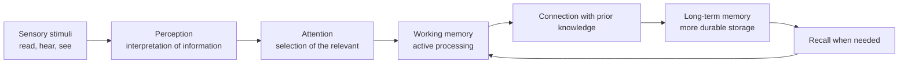

###### Topics

Cognitive Foundations of Learning

- Taking in and processing information: perception and attention
- Storage and recall in memory: short-term and long-term memory
- Why repetition and connection support learning

Individual Approaches to Learning

- Different ways to absorb and understand learning content
- The importance of personal learning preferences in knowledge acquisition

   
# 🧠 Cognitive Foundations of Learning

From the outside, learning often seems simple: You read something, hear something, watch something—and at some point, you “know” it. But much more happens in your brain. Information first has to be perceived, then selected, processed in memory, connected to existing knowledge, and later retrieved. Exactly these steps determine whether you forget content after five minutes or can reliably apply it later.

This is especially important for **core tech topics** like networking, operating systems, programming, or data structures. Such topics consist not just of individual facts but of concepts, relationships, processes, and rules. That’s why just watching is usually not enough. Your brain needs to build a coherent model from many parts.

   
## 👀 Taking In and Processing Information: Perception and Attention

Before you can learn something, your brain has to decide **what** to take in from the environment and **how** to interpret these stimuli. This forms the foundation of perception and attention.

Perception is not just “photographing” reality. Your brain actively processes sensory stimuli and interprets them based on prior knowledge, expectations, and context. That’s why two people can hear the same explanation and still not understand it in exactly the same way. What you already know strongly influences what you even notice and how you categorize it.

For example, if you see a network diagram for the first time, you may only notice boxes, lines, and technical terms. But if you already know what a router, a switch, or an IP address is, your brain immediately sees a structure. This shows: **Understanding begins not with memorization, but with perception.**

Attention acts as a filter. Out of the huge number of stimuli, your brain selects only a small part that seems important at the moment. This filter is necessary because conscious processing capacity is limited. Only what gets your attention has a chance of being further processed. What you don’t attend to often won’t be properly learned at all.

An important point: Attention is **limited**. The working memory—that is, the area where you briefly hold and actively process information—can only process a few elements at once. Modern cognitive research therefore often emphasizes that conscious processing is small and prone to disruption ([Working Memory](https://www.science.org/doi/10.1126/science.1736359); [The Magical Number 4 in Short-Term Memory: A Reconsideration of Mental Storage Capacity](https://doi.org/10.1017/S0140525X01003922)).

This explains why learning often fails even if you “looked at it for a long time.” If, for example, you run a tutorial, check your messages at the same time, listen to music with lyrics, and try to understand a new topic like recursive functions, then several things are competing for the same limited attention space. Your brain jumps back and forth instead of processing steadily.

Another important concept is **cognitive load**. This refers to how much your working memory is taxed. If content is already difficult by itself and also poorly explained, poorly organized, or full of unnecessary details, the load increases sharply. This leaves less mental energy for real understanding ([Cognitive Load During Problem Solving: Effects on Learning](https://doi.org/10.1207/s15516709cog1202_4)).

This is quickly noticeable with technical topics:

- An overloaded slide with 30 new terms is overwhelming.
- A clean diagram with clear relationships helps.
- An example with concrete application is easier to understand than a pure definition.
- A step-by-step explanation is less mentally taxing than a large block of information.

So, to learn better, you don’t just need to “pay more attention,” but also set conditions that make attention possible: clear presentation, little distraction, sensible sequence, and small units.

   
### 🎯 What Perception Means in Learning

Perception determines whether learning content just looks like a strange pattern to you or makes sense.

Example from computer science: You see the expression `if (x > 10)`. If you’ve never programmed, it may just be a strange string. But if you already understand the concept of conditions, you immediately recognize: “Here, a condition is being checked for truth.” The same characters—but a completely different perception.

This reveals a key learning mechanism: **Prior knowledge changes perception**. The more useful structures you’ve already built, the easier you recognize new patterns. Learning is therefore not just the accumulation of individual pieces of information, but the construction of meaning networks.

That’s why good learning materials help direct perception:

- highlighting key terms
- making connections visible
- comparing new content with known things
- presenting examples before abstract definitions

If a teacher or learning material does this well, your brain is steered in the right direction from the start.

   
### 🚦 Why Attention is the Bottleneck of Learning

Many learning problems are not really memory problems but attention problems.

If you read a text and realize at the end that you haven’t actually processed a single sentence, it wasn’t because your memory was “bad.” More likely, the information never got enough attention to be processed deeply.

Attention is selective. Your brain prefers things that are:

- new,
- emotionally engaging,
- especially striking,
- related to a current goal.

That’s why it’s often easier to remember an exciting real-world case than a dry definition. A real problem—for example, “Why can’t my computer reach the server?”—focuses attention much more strongly than an abstract list of network errors.

For technical learning this means: **Content should not just be correct, but also cognitively accessible**. A clear problem, an obvious cause-and-effect relationship, and a traceable process help attention enormously.

   
### 🗺️ From Stimulus to Understanding

This graphic shows the core learning process: Something is perceived, attention selects it, working memory processes it, and through connection with existing knowledge it becomes long-term knowledge.

   
## 🧩 Storage and Recall in Memory: Short-Term and Long-Term Memory

Once information has your attention, it’s still far from permanently learned. It needs to be processed in memory, stored, and later retrievable.

A simple model with two important areas helps here:

- **Short-term or working memory**
- **Long-term memory**

Working memory is the place for active thinking. Here you briefly hold information, compare, organize, compute, or form new meanings from it. If you remember a URL in your head, analyze a line of code, or follow several steps of an algorithm, you’re using this system.

Long-term memory, on the other hand, is for more durable knowledge. Here lie terms, rules, experiences, patterns, processes, and networks of meaning. If you know what a variable is, how DNS roughly works, or why a loop repeats execution, that knowledge comes from your long-term memory.

Important: Learning works especially well when content is **not just temporarily in working memory**, but is meaningfully transferred into long-term memory.

   
### 🧠 Short-Term Memory and Working Memory Simply Explained

In everyday life, short-term memory and working memory are often equated. In learning psychology, a more precise distinction is common:

- **Short-term memory** is more about briefly holding information.
- **Working memory** is about actively processing this information.

Remembering a number briefly? That’s short-term memory. Calculating with the number, comparing it with other data, or using it in a problem? That’s working memory in play.

This system is useful but sensitive. It’s easily overloaded. That’s why new topics are exhausting. Your brain has to hold many unfamiliar elements at once, and that only works to a limited degree ([Working Memory](https://www.science.org/doi/10.1126/science.1736359)).

A programming beginner, for example, sees many separate elements in a single line of code:

- variable names
- operators
- syntax marks
- data types
- control structures

An experienced person sees far fewer individual parts, because their long-term memory already stores meaningful chunks. This is often called **chunking**: several individual bits are recognized as a meaningful unit. This relieves working memory.

   
### 🏛️ Long-Term Memory: Where Knowledge Really “Sits”

Long-term memory is not just a rigid storage like a hard drive. It's more like a network of meanings, experiences, and connections.

If you truly understand something, it doesn’t reside there as an isolated sentence but as an embedded concept. That’s why deeply understood content is more flexibly usable later. You can explain, apply, compare, and transfer it to new problems.

In long-term memory, for example, are stored:

- **Factual knowledge**: e.g. that HTTP works at the application level
- **Conceptual understanding**: what a protocol is
- **Procedural knowledge**: how to execute a command or write code
- **Pattern knowledge**: typical structures, error patterns, correlations

The stronger these are interconnected, the better they can be accessed later.

   
### 🔑 Recall: Knowledge Must Not Only Be Stored, But Also Retrieved

Many people think, "If I've learned it once, I should automatically be able to do it." But that’s not how memory works. What matters is not only storage, but also **recall**.

Recall means your brain reactivates stored content. This works best when:

- the content is well understood,
- it was used multiple times in different contexts,
- there are suitable retrieval cues,
- the information was not just read but actively remembered.

That’s why learning by recognition often feels deceptively successful. Reading an explanation again makes it seem familiar. But this sense of familiarity is not the same as true skill. Only if you can explain, apply, or reconstruct without a template do you truly “have” it.

This is where **retrieval practice** comes in: actively recalling improves later access to knowledge much more than rereading ([Test-Enhanced Learning: Taking Memory Tests Improves Long-Term Retention](https://doi.org/10.1111/j.1467-9280.2006.01693.x); [Improving Students’ Learning With Effective Learning Techniques](https://doi.org/10.1177/1529100612453266)).

For core tech learning specifically: If you only read about networking concepts, you learn more slowly than if you try to explain them yourself, draw diagrams from memory, or retrace a request’s process without notes.

   
### 📊 Short-Term Memory and Long-Term Memory Compared

| Area | In Simple Terms | Typical Strength | Typical Weakness | Tech Example |
|---|---|---|---|---|
| Short-term/working memory | Holds information briefly and processes it actively | Good for current thinking and problem solving | Easily overloaded, easily disrupted | You’re following the steps of a `for` loop |
| Long-term memory | Stores knowledge, patterns, concepts, and experiences longer-term | Enables understanding, recognition, and application | Building it takes time and good processing | You understand the general principle of loops |
| Recall process | Retrieves knowledge from long-term memory | Makes knowledge usable | Fails with weak linking or only superficial learning | You spontaneously explain when a loop is useful |

   
## 🔁 Why Repetition and Connection Support Learning

Now comes a vital point: Information doesn't stick better because you just look at it more often. What matters is **how** you repeat, and **what** you connect new information with.

Repetition helps because it signals to the brain: “This is important. We need this more than once.” But not all repetition is equally useful. Reading the same paragraph five times in a row feels diligent, but is often ineffective. It’s much more helpful when repetition is combined with active recall, time spacing, and connection.

Learning research shows clearly that **distributed practice**—learning over several points in time—is far more effective than massed learning in a single block ([Distributed Practice in Verbal Recall Tasks: A Review and Quantitative Synthesis](https://doi.org/10.1037/0033-2909.132.3.354)). Likewise, active retrieval is one of the most effective learning techniques ([Improving Students’ Learning With Effective Learning Techniques](https://doi.org/10.1177/1529100612453266)).

Why? Because meaningful repetition can do several things:

- strengthens the memory trace,
- improves recall,
- reveals gaps,
- forces your brain to process again,
- builds confidence and speed.

But repetition alone is not enough. Learning is even stronger when new content is **connected** to existing knowledge.

For example, learning what an IP address is sticks better if you don’t just memorize the definition, but connect it with other things:

- Devices need addresses
- Network communication needs assignments
- Routers make decisions based on such information
- DNS and IP serve different roles

That creates not just a single fact but a small network of meaning. These networks make knowledge more stable and flexible.

Memory research has long shown that **deeper processing** and meaningful integration result in better retention than just shallow repetition ([Depth of Processing and the Retention of Words in Episodic Memory](https://doi.org/10.1016/S0022-5371(75)80001-X)).

   
### 🔄 What Kind of Repetition Actually Works

There is a big difference between these two forms:

**Superficial repetition:**  
You read the same sentence several times or look at the same slide again.

**Effective repetition:**  
You try to explain the content from memory, rearrange it, compare it to other knowledge, or apply it.

Effective repetition has more power because your brain doesn’t just look again—it **works**.

A good technical example:

You want to learn the difference between **TCP** and **UDP**.

Less effective:
You read a table of properties again and again.

More effective:
You explain to yourself without a template why TCP is more reliable, why UDP often seems faster, and in which situations each protocol makes sense.

In this moment, you’re not just repeating—you’re structuring, differentiating, and recalling. That’s what strengthens learning.

   
### 🧷 Why Connection is So Powerful

New information rarely sticks well if it stands totally isolated in your mind. Your brain much more easily remembers things that can attach to something familiar.

Connecting can happen at different levels:

- **by content**: link a new concept to an existing one
- **visually**: use a mental picture or sketch
- **in language**: put a term in your own words
- **practically**: apply something directly
- **structurally**: fit a topic into a larger system

For example, learning what a stack is becomes easier if you link it to “last in, first out.” If you also think of function calls, browser history, or a stack of plates, the concept has multiple anchors.

This makes knowledge more stable because there are more entry points. During recall, your brain can access the information through various routes.

This is extremely important especially in complex subjects like operating systems, protocols, or data structures. There, knowing terms is not enough; you need to understand relationships. And connections are what build those relationships.

   
### 🛠️ Why This Is Especially Important for Core Tech

Technical basics almost always build on each other. If a foundation is missing, later topics seem confusing.

An example:

If you don’t really understand

- what a process is,
- how memory basically works,
- how input/output is organized,

then a subject like operating system architecture quickly becomes a tangled mess of words.

But if you learned these basics in a connected way, you immediately recognize links when new topics come up. Learning becomes faster, because your brain isn’t starting from scratch each time.

You can look at it this way:  
**Repetition strengthens nodes. Connection builds paths between the nodes.**  
For true understanding, you need both.

   
# 🧭 Individual Approaches to Learning

People do not all learn in exactly the same way. But that doesn't mean that totally different learning “rules” exist for each person. The fundamental mechanisms of memory are similar for everyone—attention, working memory, long-term memory, recall, and connection remain central. Differences tend to show in **which approaches someone finds easiest**, **what prior knowledge exists**, **how motivated someone is**, and **which form of presentation is particularly helpful at the moment**.

That’s why it’s important to distinguish between **individual differences** and **popular but simplistic myths**.

   
## 🛣️ Different Ways to Absorb and Understand Learning Content

People differ in many things relevant for learning:

- prior knowledge,
- language proficiency,
- ability to concentrate,
- speed of processing,
- motivation and interest,
- ability for self-regulation,
- experience with certain forms of presentation.

That means: Not every introduction to a topic works equally well for everyone.

One person may best understand a new concept through a diagram. Another may need a concrete example first. Someone else must apply it practically before theory makes sense. Yet another person needs a clear linguistic definition to sort it out.

This is normal and useful. Different forms of presentation activate different access routes to understanding.

This is especially clear in technical subjects:

- **Diagrams** help with architectures and relationships.
- **Code examples** help with abstract programming concepts.
- **Oral explanations** help with processes and thinking paths.
- **Practical execution** helps with tools, commands, and system behaviors.
- **Comparisons and analogies** help with hard-to-grasp concepts.

If you learn the OSI model, for instance, pure text can seem dry and abstract. A layers graphic, an example of a real data transmission, and a comparison with real network processes often make the topic much more understandable.

But that doesn’t mean a person could “only” learn visually or “only” auditorily. Often it is helpful to access content **from multiple perspectives**. Especially complex knowledge benefits from being processed linguistically, visually, and through application.

   
### 🔍 What Really Varies—and What Is Often Confused

People often speak as if people had rigid “learning types.” That sounds intuitive but is too simplistic.

What actually often varies is more like:

| Area | What It Means | Example |
|---|---|---|
| Prior knowledge | Those with a foundation learn new content faster | Knowing variables helps in understanding functions |
| Interest | Relevant topics get more attention | An admin learns network topics more motivated |
| Access to presentation | Some approaches fit the current topic better | A process diagram helps with protocol steps |
| Self-regulation | Some plan, check, and correct learning better | Someone notices what is still unclear earlier |
| Language processing | Technical language can help or hinder learning | Terms like “polymorphism” are hurdles for beginners |
| Practical experience | Application creates anchors for theory | Using Linux commands helps in grasping shell concepts |

That’s a much more precise view than the simple division into supposedly fixed learning types.

   
### 💻 Different Approaches Illustrated with a Technical Topic

Take the topic of **DNS**.

One person understands it best through an everyday analogy:  
“DNS is like a phone book that translates names into numbers.”

Another person needs a process model:  
The client asks the resolver, the resolver asks name servers, the answer comes back.

A third person gets it only through practice:  
They use `nslookup` or `dig` and see real answers.

A fourth person needs the system context:  
DNS is name resolution within network communication and works with distributed server structures.

None of these routes is “the only right one.” They illuminate different sides of the same concept. Often, real understanding comes from the combination.

   
## 🧑‍🎓 The Importance of Personal Learning Preferences in Knowledge Acquisition

Personal learning preferences are not meaningless. It does make a difference whether you prefer to start with texts, videos, sketches, conversations, examples, or direct applications. Such preferences influence motivation, perseverance, and getting started with learning.

For example, if you cannot get into a topic with dry definitions, but become curious when presented with a practical problem, that preference is important. It often decides whether your brain invests enough attention at all.

But here is the crucial academic context:  
Research finds **no convincing support** for the popular assumption that people can be strictly assigned a “learning style” like visual, auditory, or kinesthetic, and that learning automatically improves if instruction is tailored to that ([Learning Styles: Concepts and Evidence](https://doi.org/10.1111/j.1539-6053.2009.01038.x)).

This is a very important distinction:

- **Preferences exist.**
- **Fixed learning types as a solid learning rule are not well supported scientifically.**

In other words: It is useful to know your preferred approaches. But it would be unwise to limit yourself and say:  
“I’m just a visual type, so I can’t learn from texts.”

Especially in technical learning, you almost always need multiple forms of processing. Those who just watch videos and never explain, try out, read, or structure things themselves, often fail to build stable knowledge.

   
### ❤️ Preferences Are Useful—but Not a Cage

Your learning preferences can help you find a good entry point.

You may notice:

- With a graphic you understand connections faster.
- With written notes you think more precisely.
- Explaining to yourself reveals gaps in understanding.
- Practical application makes knowledge more concrete.

It’s smart to use these deliberately.

But preferences should be understood as **tools**, not as your identity. Otherwise you risk unnecessary self-limitation.

A good principle is:

**Use your preference for starting, but extend your learning across multiple modes of processing.**

For example:

- Begin with a video if that makes it easier.
- Then read the key definitions carefully.
- Draw the connection in your own words or sketches.
- Explain the concept without a template.
- Apply it to a real problem.

This way, you combine motivation with cognitively effective processing.

   
### ⚖️ What Matters More than “Learning Type” for Learning

For sustainable knowledge acquisition, other factors are often more important than whether you listen or read.

Particularly important are:

- **Prior knowledge**: New knowledge needs anchor points.
- **Attention**: Without focused processing, little sticks.
- **Active processing**: Explaining, applying, comparing, structuring.
- **Recall**: Get knowledge out of your head, not just recognize it.
- **Spaced repetition**: Stabilizes what’s learned.
- **Connection**: Builds a robust knowledge network.
- **Metacognition**: The ability to observe and steer your own learning.

Metacognition is often underestimated. It’s about noticing:

- What have I really understood?
- Where do I know only terms but no connection?
- What can I explain?
- What can I only recognize?
- Which method actually helped me?

People who learn well are often not just “more talented,” but they steer their learning process more consciously.

   
### 🧱 What This Means for Your Own Learning in Technical Fundamentals

When learning core tech topics, it’s most effective **not to look for a single perfect learning channel**, but a good combination.

For technical fundamentals, this often works especially well:

1. **An understandable introduction**, so attention arises.  
   For example, a real problem or a clear everyday analogy.

2. **Clear conceptual clarification**, so you know exactly what it’s about.  
   Precise terms are crucial, especially in tech.

3. **A visual or structural representation**, so you recognize connections.  
   For example, diagrams, flowcharts, or system overviews.

4. **Active reconstruction**, so knowledge becomes accessible.  
   Explaining, sketching, or comparing yourself.

5. **Practical application**, so knowledge is tied to real situations.  
   For example, running commands, reading logs, going through code, or tracing data flows.

If you learn this way, you leverage personal preferences wisely without letting them restrict you. You not only learn more enjoyably, but above all more **stably, deeply, and with greater application relevance**.