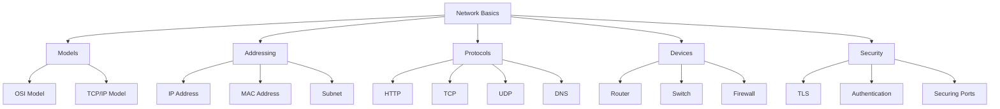
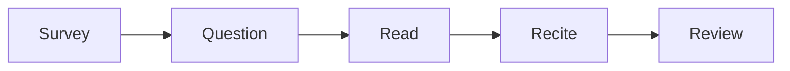
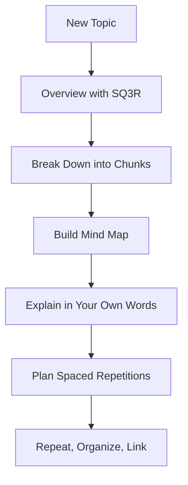

###### Topics

Learning Techniques

- Creating and applying mind maps to structure learning content
- Applying the SQ3R method to understand texts and learning materials
- Breaking down complex information using the chunking method

Ensuring long-term retention

- Using spaced repetition for sustainable knowledge retention
- Repeating, organizing, and linking as a learning strategy

   
# 🧠 Using Learning Techniques Effectively

If you really want to understand and later recall study material, simply reading it is almost never enough. Especially with **Core Tech Fundamentals**—topics like computer architecture, networks, operating systems, data structures, web basics, or programming concepts—it's important to **actively structure, simplify, and meaningfully process** information several times.

The three methods you mentioned target exactly that:

- **Mind maps** help you organize material visually.
- **SQ3R** helps you actively engage with texts and learning materials.
- **Chunking** helps you break down complex content into digestible building blocks.

The crucial point is: These methods are not isolated tricks. They support different phases of learning. One helps with **understanding**, another with **structuring**, and the next with **retaining**.

   
## 🗺️ Mind Maps for Structuring Learning Content

A **mind map** is a visual representation of knowledge. The central topic is placed in the middle, and from there, subtopics, terms, relationships, and examples branch out. Instead of just writing information in a list, you arrange it **spatially and hierarchically**.

The big advantage: Your brain processes information more easily when it doesn't just receive linear text but also **recognizes relationships between things**. This is exactly what mind maps excel at.

### Why a Mind Map Is So Valuable for Learning

Many learners take long notes while studying. The problem: Such notes are often linear, structured like continuous text. However, technical subjects are mostly **non-linear**—they consist of levels, dependencies, and relationships.

An example from technology:  
If you're learning about **“How does the Internet work?”**, not everything follows a single sequential order. You'll need terms like:

- IP address
- DNS
- HTTP
- TCP
- Router
- Server
- Client

These concepts are interconnected. A mind map makes such relationships visible.

### How to Create a Mind Map

The structure is simple if you proceed systematically.

#### 1. Place the core topic in the center

Put the main topic in the middle, for example:

- Operating System
- HTTP
- Databases
- Git
- CPU and Memory
- Networks

This topic is the starting point.

#### 2. Add main branches

Then, add the most important subareas. For **Operating System**, these might be:

- Processes
- Memory management
- File system
- Users and permissions
- Scheduling
- Device management

These main branches are the major blocks of the topic.

#### 3. Add sub-branches

Next, go deeper. Under **Processes**, you might have:

- Process vs. Thread
- Process states
- Context switch
- PID
- Concurrency

Under **Memory management**, perhaps:

- RAM
- Virtual memory
- Paging
- Stack and Heap

#### 4. Use keywords instead of long sentences

A good mind map uses **keywords**, not whole paragraphs. Instead of writing:

> “A process is a running program with its own memory space.”

you write:

- running program
- own address space
- resources
- process ID

Why? Because a mind map is not meant to replace thinking, but to **stimulate** it.

#### 5. Make relationships visible

If two areas are interrelated, you can draw additional connections. This is especially helpful with technical topics.

Example:

- **HTTP** is connected to the **client-server model**.
- **DNS** relates to **name resolution**.
- **TCP** relates to **reliable transmission**.

This turns a collection of concepts into a **web of knowledge**.

### When Mind Maps Are Especially Useful

Mind maps are particularly useful when you:

- need an overview of a new topic,
- want to structure a large chapter,
- want to identify relationships,
- want to see the big picture quickly before reviewing,
- want to organize technical terms.

They are less useful for very precise linear processes or calculation steps; for that, tables, process diagrams, or focused notes are often better.

### A Simple Example from Core Tech Fundamentals

Suppose you are learning **network basics**. A mind map could look like this:

Such a visualization gives you an overview at a glance.

### How to Use Mind Maps Effectively

A mind map is best when you **build it actively**, not just copy it. This process is already a form of learning.

By creating a mind map, the following happens in your mind:

- You decide what is important.
- You arrange information by levels.
- You identify main and sub-concepts.
- You establish connections.
- You rephrase content in your own words.

That is much more valuable than passively highlighting text.

### Common Mistakes with Mind Maps

A common mistake is overloading the mind map with too much text, turning it into a barely legible transcript in tree form.

Another mistake is listing everything on one level; if there's no hierarchy, the main benefit is lost.

Also, a mind map shouldn't just be “aesthetic.” Colors and symbols can help, but only if they serve a purpose—such as distinguishing categories.

   
## 📖 The SQ3R Method for Understanding Texts and Learning Materials

The **SQ3R method** is a classic reading strategy for systematic learning. The acronym stands for:

- **S**urvey
- **Q**uestion
- **R**ead
- **R**ecite
- **R**eview

In German, this is: **Überblicken, Fragen stellen, Lesen, Wiedergeben und Wiederholen**. The method was developed to ensure that texts are not just read, but **actively processed** ([SQ3R](https://www.britannica.com/topic/SQ3R)).

This is especially important for technical texts. For example, if you read a chapter on operating systems, documentation on HTTP, or an article about databases, simply reading from start to finish achieves little. You need to work with the text.

### Why SQ3R Is So Effective

The method forces you to build a mental framework before reading. This means you don't read blindly but with a purpose.

This is especially helpful with technical content, which often:

- contains many new terms,
- is information-dense,
- mixes definitions and processes,
- can be overwhelming without pre-structuring.

SQ3R transforms passive reading into an **active learning process**.

### The Five Steps Explained

| Step    | Meaning   | What You Do  | Example from a Tech Text |
|---------|-----------|--------------|--------------------------|
| Survey  | Get an overview | Look at chapter, headings, graphics, summaries | You first look at section titles and diagrams in a chapter about TCP/IP |
| Question | Ask questions | Turn headings into actual questions | “What is the difference between TCP and UDP?” |
| Read    | Read     | Read the text purposefully to find answers | Read focusing on your questions |
| Recite  | Recite   | Recount the material in your own words | Explain without the book: “TCP is connection-oriented, UDP is not” |
| Review  | Review   | Check and consolidate later | Go through the questions again and fill gaps |

### 🔍 Survey – Get an Overview

Before reading in depth, get an overview. Look at:

- Title
- Subheadings
- Bold terms
- Diagrams
- Tables
- Summaries
- End-of-chapter questions

This step is crucial because your brain then builds an initial map. You’ll know what the content is about and which terms are likely central.

For example, if reading API documentation, you would first look at:

- What endpoints are there?
- Which HTTP methods are used?
- What data formats are involved?
- Are there error codes or authentication?

You’re not reading deeply yet, just orienting yourself.

### ❓ Question – Turn Material into Questions

Now, turn headings into questions. This step is key, since questions sharpen your focus while reading.

From the heading **“Memory Hierarchy,”** for example, come questions like:

- Why are there different memory levels?
- What is the difference between cache, RAM, and SSD?
- Why is faster memory more expensive or smaller?

From **“DNS,”** for example:

- Why is DNS needed?
- How does name resolution work?
- What happens if a DNS server doesn’t respond?

With such questions, you read searching not just for “content,” but for **answers**.

### 📘 Read – Read Purposefully

Now you actually read the text—but not passively, instead aiming to answer your questions.

While reading, ideally mark only:

- Definitions,
- Key terms,
- Cause-effect relations,
- Processes,
- Differences,
- Examples.

If you find a section unclear, that's not a sign of failure. It just means you haven't found a firm mental anchor yet. Translating the section into simpler language or smaller parts often helps.

### 🗣️ Recite – Recount in Your Own Words

This is one of the method's key components. After a section, pause and try to express the content **without peeking**.

For example:

> “A process is a running program with its own address space. A thread is an execution unit within a process. Several threads can share memory.”

If you can articulate this, you’ve truly processed, not just read.

If you stumble, that honestly shows where understanding is lacking. That’s why this step is so valuable.

### 🔁 Review – Repeat and Solidify

At the end, go through the questions, terms, and main points again. This helps prevent the information from fading fast.

Important: Review does not mean just “read again.” It means:

- actively recalling,
- recognizing gaps,
- organizing terms,
- clarifying open questions.

Especially in technical topics, check whether you could **apply** the content. Do you just know the words or also the connections?

### A Practical Example with a Tech Text

Let's say you read a section about **HTTP**.

#### Survey
You see headings like:

- Request and Response
- Methods
- Status codes
- Headers
- Statelessness

#### Question
You turn these into questions:

- What is an HTTP request?
- What’s the difference between GET and POST?
- Why are there status codes?
- What does stateless mean?

#### Read
You now read, focusing on these questions.

#### Recite
Then you explain:

> “HTTP is a protocol for communication between client and server. A request contains a method, URL, headers, and possibly a body. The server replies with a status code, headers, and body.”

#### Review
Later, check again:

- Can I distinguish 200, 404, and 500?
- Do I know when GET or POST is appropriate?
- Can I outline the flow of a request?

This turns reading into real learning.

### Common Mistakes with SQ3R

A frequent mistake is applying the method rigidly. SQ3R is not a strict ritual, but a tool. If a text is short, you don't need to elaborate every step.

Another mistake is skipping **Recite**. That’s exactly where you see if you understood.

Also, many confuse **Review** with just rereading. Real review means: **retrieving, reconstructing, checking**.

   
## 🧩 Chunking Information into Learning Units

**Chunking** means grouping many individual pieces of information into **meaningful sets or blocks**. Instead of learning isolated details, you build larger units of meaning.

Classic memory research shows that information is more easily processed when organized into meaningful units instead of loose pieces ([The Magical Number Seven, Plus or Minus Two](https://psychclassics.yorku.ca/Miller/)).

Especially in complex technical topics, chunking is extremely helpful, as many concepts can hit you at once.

### What Chunking Actually Achieves

Imagine you are learning this sequence:

- Browser
- DNS
- IP address
- TCP connection
- TLS handshake
- HTTP request
- Server response
- Rendering

Learning these as individual words is overwhelming. If you group them meaningfully, you create larger units.

For example:

- **Address resolution**: DNS, IP address
- **Connection establishment**: TCP, TLS
- **Data transfer**: HTTP request, response
- **Browser rendering**: Rendering

Long lists become structured processes.

### Why Chunking Is So Important in Tech

Many technical systems are built on:

- Layers,
- Components,
- Processes,
- States,
- Roles,
- Inputs and outputs.

If you store each detail individually, your mind fills up quickly. When you identify which details belong together, you reduce cognitive load.

This doesn’t mean you learn less; you learn **more efficiently organized**.

### How to Chunk Meaningfully

#### 1. Group by function

Ask: which parts serve the same purpose?

Example for computers:

- **Processing**: CPU, registers, ALU
- **Short-term storage**: Cache, RAM
- **Long-term storage**: SSD, HDD

#### 2. Group by process

For procedures or protocols, group into phases.

Git example:

- Make changes
- Stage changes
- Make a commit
- Sync with remote

#### 3. Group by hierarchy

Very useful for architecture topics.

Database example:

- Database
  - Tables
    - Rows
    - Columns
      - Data types
      - Constraints

#### 4. Group by contrasting pairs

Comparisons are strong chunks.

Examples:

- RAM vs. SSD
- Process vs. Thread
- TCP vs. UDP
- Compiler vs. Interpreter
- Static vs. dynamic

Such pairs help distinguish terms clearly.

### Example: Chunking an HTTP Request

Instead of learning disconnected terms, break the topic down:

| Chunk        | Content                       | Key question                 |
|--------------|------------------------------|------------------------------|
| Addressing   | URL, domain, DNS, IP         | Where is the request going?  |
| Connection   | TCP, TLS                     | How is connection made safely and reliably? |
| Request      | Method, headers, body        | What does the client want?   |
| Response     | Status code, headers, body   | What does the server return? |
| Rendering    | HTML, CSS, browser rendering | How is the result displayed? |

This gives you a stable foundation before diving into details.

### Chunking Isn’t Just Simplification

A key point: Chunking doesn’t mean artificially shortening information. It means **transforming it into meaningful units**.

A good chunk has three qualities:

- It belongs together content-wise.
- It serves a recognisable function.
- It can be labeled with a question or heading.

If you can’t name a block, it’s often not well chunked yet.

### How to Apply Chunking

When learning a new topic, ask yourself:

- Which 3 to 7 main blocks does the topic have?
- Which details belong to which block?
- In what order are the blocks connected?
- Which terms do I need to distinguish?
- Which can I group together?

This is especially valuable for scripts, documentation, and architectural content.

### Common Chunking Mistakes

A common mistake is chunking too broadly—resulting in blocks that are too big and imprecise, like just “network,” which isn’t helpful.

Another is chunking too narrowly—ending up with a bunch of single parts again.

The art lies in finding a level where the material remains **clear and meaningful**.

   
# 💾 Ensuring Long-Term Knowledge Retention

Understanding alone isn't enough. To keep knowledge available **after days, weeks, and months**, you must process it so it can still be recalled later.

That’s where **spaced repetition** and the strategy of **repeating, organizing, and linking** come in.

   
## ⏱️ Spaced Repetition for Sustainable Knowledge Retention

**Spaced repetition** means you **don’t repeat learning content all at once**, but **review it at intervals**. Learning research has long shown that spaced repetition leads to much better long-term retention than cramming in a single session ([Improving Students’ Learning With Effective Learning Techniques](https://journals.sagepub.com/doi/10.1177/1529100612453266); [Distributed Practice in Verbal Recall Tasks](https://journals.sagepub.com/doi/10.1111/j.1467-9280.2006.01693.x)).

This is one of the most important points:  
**Material you learn today and never actively recall again will fade rapidly.**  
Material you recall several times at intervals becomes much more stable.

### Why Spaced Repetition is So Effective

Re-examining something immediately after learning feels easy, but that's deceptive—you’re just recognizing it, not truly remembering.

With spaced repetition, a gap between reviews makes recall more challenging. That retrieval effort strengthens the memory.

Practically:

- Immediate rereading feels good but is less effective.
- Later active recall feels harder but works better.

### How to Use Spaced Repetition

You don’t need an app for this—you can do it analog, too.

A typical schedule could look like:

| Time         | Goal                        |
|--------------|-----------------------------|
| Same day     | First consolidation         |
| Next day     | Early stabilization         |
| After 3 days | Recall with slight gap      |
| After 7 days | Medium-term consolidation   |
| After 14 days| Further stabilization       |
| After 30 days| Long-term recall            |

These intervals aren’t strict rules—they’re practical patterns. With more difficult topics, use shorter early intervals.

### What to Do During Review

Reviewing doesn’t just mean rereading. Better is:

- explain it from memory,
- define key terms,
- sketch relationships,
- use flashcards with questions,
- redraw diagrams without a reference,
- name differences,
- reconstruct a process.

For technical topics, good review questions include:

- What’s the difference between RAM and cache?
- How does DNS resolution work?
- What does an operating system do during a context switch?
- Why is TCP needed if IP already exists?
- How do stack and heap differ?

These require **retrieval**, not just recognition.

### Spaced Repetition in Core Tech Fundamentals

Foundational technical knowledge especially benefits from spaced repetition, as later material builds on these concepts.

If you don’t truly understand or recall these terms:

- Process
- Thread
- Port
- Protocol
- IP address
- File system
- Hashing
- Recursion

then advanced material will be much harder later.

Spaced repetition keeps basic concepts from fading.

### A Simple Visual Illustration

### What to Combine with Spaced Repetition

Spaced repetition is most powerful when paired with **active retrieval**. Don't just “review”—instead:

- answer,
- explain,
- draw,
- distinguish,
- organize.

For technical learning, flashcards should not just ask for definitions, but also for relationships and applications.

Worse card:
> What is DNS?

Better card:
> What role does DNS play between browser input and server request?

Even better:
> Describe in four steps how a domain name is resolved into an IP address.

### Common Mistakes with Spaced Repetition

Common mistakes include stuffing too much content into one system, resulting in a flood of isolated cards.

Another is only learning definitions. In tech, you need to **understand systems**.

Also, many confuse spaced repetition with just rereading. The real benefit comes from **retrieving from memory**.

   
## 🔗 Repeating, Organizing, and Linking as a Learning Strategy

These three activities are closely related:

- **Repeating** stabilizes knowledge.
- **Organizing** makes knowledge manageable.
- **Linking** makes knowledge meaningful.

Only together do they produce robust learning.

### 🔁 Repeating – So Knowledge Remains Retrievable

Repeating means recalling content several times—not because you’ve “forgotten again,” but because memories become stronger with use.

Instead of just viewing content frequently, try to **reconstruct it** as often as possible.

Especially for technical content, it helps to reconsider the same concepts from different perspectives:

- define,
- compare,
- embed in processes,
- connect with examples.

This turns loose terms into solid concepts.

### 🗂️ Organizing – So Knowledge Isn't Chaotic

Organizing means structuring material so you can “file” it mentally.

That might be:

- forming super- and subcategories,
- dividing processes into phases,
- clearly distinguishing differences,
- grouping related items,
- making cause and effect visible.

Organization helps because the brain doesn’t store knowledge as a jumbled box—it stores it more easily when embedded in structures.

For Core Tech Fundamentals, organizing could look like:

| Topic           | Sensible Structure         |
|-----------------|---------------------------|
| Networks        | Layers, protocols, devices, addressing |
| Operating Systems | Processes, memory, file system, scheduling |
| Web Basics      | Client, server, request, response, rendering |
| Programming     | Data types, control flow, functions, memory |
| Databases       | Tables, relationships, queries, indexes |

Organizing like this builds mental shelves.

### 🌐 Linking – So New Knowledge Connects to Old

Linking is one of the most important steps. New knowledge is remembered much better when connected to what you already know.

For example, if you understand what an **address** is in everyday life, you can grasp an **IP address** as a network address. If you get what a **library** is, you can more easily conceptualize a **code library** (a collection of reusable building blocks).

Linking can happen on several levels:

#### To Prior Knowledge
Connect new material to things you already understand.

#### With Examples
Abstract terms become tangible through concrete cases.

#### Through Contrasts
A term becomes clearer when contrasted with a similar one.

#### Through Systems
A single term gains meaning within a overall process.

### Example: Really Learning “Process”

If you just memorize:

> A process is a running program.

that’s a definition.

But if you **repeat, organize, and link**, more happens:

- You **repeat** the definition multiple times.
- You **organize** the process within the OS, alongside thread, memory, and scheduling.
- You **link** it to real examples like browser, editor, terminal, or game.

Then a phrase becomes a real mental model.

### Why This Strategy Is Powerful

Many learning problems don’t occur because someone “didn’t read enough,” but because knowledge isn’t stably organized internally.

If you only repeat, but don’t organize, you get a heap of isolated information.

If you only organize, but don’t repeat, the structure remains, but the knowledge fades.

If you only link, but never actively recall, everything seems understandable—but isn’t available later.

The power lies in their interaction.

   
## ⚙️ Applying the Methods Together When Studying Core Tech Fundamentals

These methods are most effective when you **combine** them.

A sensible workflow might look like:

### A Concrete Learning Workflow Using “DNS” as Example

Suppose you want to learn **DNS**.

#### 1. SQ3R for First Encounter
First, look at headings, diagrams, and key terms. Then, formulate questions such as:

- Why is DNS needed?
- How does name resolution work?
- Which servers are involved?

#### 2. Chunking for Structure
Then, break down the topic into logical blocks:

- Purpose of DNS
- Resolution process
- Involved servers
- Caching
- Common error sources

#### 3. Mind Map for the Big Picture
Next, build a mind map:

- DNS in the center
- branches for function, process, caching, troubleshooting, security

#### 4. Recite in Your Own Words
Now, explain without notes:

> “DNS translates domain names into IP addresses. The client usually queries local or cached info first, then proceeds step by step until a suitable answer is found.”

#### 5. Spaced Repetition
Review the topic after 1 day, 3 days, 1 week, and later again.

#### 6. Organize and Link
Finally, connect DNS with other topics:

- browser request
- HTTP
- IP address
- network communication
- caching

Now DNS is not just isolated in your mind, but part of your overall network model.

### What Happens in Your Head

When you combine these methods, something very important happens:

- **SQ3R** ensures you engage actively with texts.
- **Chunking** reduces complexity.
- **Mind maps** reveal relationships.
- **Spaced repetition** ensures long-term retention.
- **Repeating, organizing, and linking** build robust networks of knowledge.

That’s exactly the kind of learning that works well for technical fundamentals—since technical subjects rarely consist only of facts. They consist of **systems, relationships, dependencies, and processes**.

If you use these methods well, you don’t just learn more. Above all, you learn **more clearly, deeply, and lastingly**.