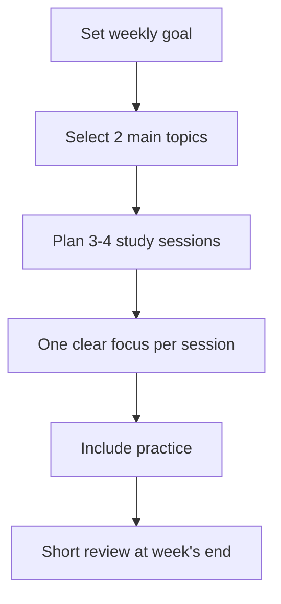
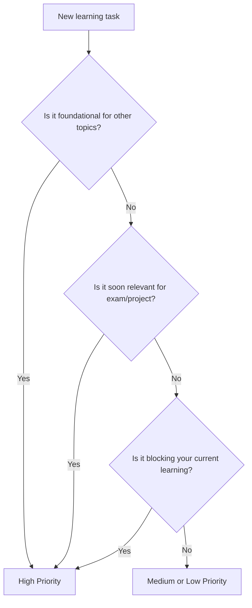
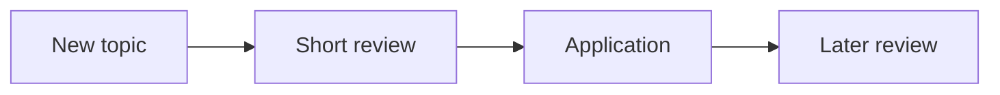

###### Topics

Time Management

- Developing a personal study plan
- Prioritizing learning tasks
- Realistic scheduling of study phases and breaks

Designing the Study Environment

- Optimizing the workspace (digital and analog)
- Minimizing distractions and building focusing strategies

   

# ⏰ Time Management

Time management in learning **does not** mean scheduling every single minute of your day perfectly. It mainly means that you **consciously** structure your time so that learning can happen regularly, realistically, and without constant stress. This is especially important for **Core Tech Fundamentals**—such as programming, networks, operating systems, Git, databases, or web basics—because these topics involve not just reading, but also **understanding, applying, revisiting, and debugging**.

Many people underestimate this: In technical topics, it's rarely enough to look at something just once. You need to understand concepts, recognize interconnections, try things yourself, and revisit them later. Learning research has shown for years that distributed learning over multiple sessions is much more effective than cramming everything in at once ([Improving Students’ Learning With Effective Learning Techniques](https://journals.sagepub.com/doi/10.1177/1529100612453266)).

Therefore, good time management in learning consists of three things:

1. You need a **personal study plan**.
2. You must **prioritize important learning tasks**.
3. You should **plan study phases and breaks realistically**.

---

   

## 🗺️ Developing a Personal Study Plan

A personal study plan is your **navigation system**. Without a plan, you often learn by mood, whim, or chance. This may feel relaxed in the short term, but it often leads to repeating easy or pleasant things too often and procrastinating on challenging or important topics.

A good study plan essentially answers four questions:

- **What** am I learning?
- **Why** am I learning it?
- **When** am I learning it?
- **How will I know** that I really understand it?

Especially in tech, the last point is crucial. “I watched the video” is **not** reliable proof of learning progress. “I can initialize a Git repository, commit, branch, and resolve a merge conflict” is real learning progress.

   

### 🎯 What a Study Plan Should Provide

Your study plan shouldn’t just contain appointments. It should **structure** your learning. This includes:

- **Learning goals**
- **Thematic blocks**
- **Time slots**
- **Repetitions**
- **Practical parts**
- **Buffer times**

Why are buffers so important? People regularly plan tasks too optimistically. This phenomenon is known as the **Planning Fallacy**—we systematically underestimate duration, effort, and obstacles ([Maps of Bounded Rationality: Psychology for Behavioral Economics](https://www.aeaweb.org/articles?id=10.1257/000282803322655392)). This is particularly common in learning, because “understood the topic” is not the same as “can really apply the topic.”

---

   

### 🧱 Building Blocks of a Good Study Plan

Here's what a thorough study plan should consist of:

| Component | Meaning | Example in Tech Context |
|---|---|---|
| Learning goal | What you want to be able to do at the end | “I can write SQL SELECTs with WHERE, ORDER BY, and JOIN” |
| Thematic package | A sensibly bounded content block | “Basics of SQL queries” |
| Study format | How you learn | Reading, video, note-taking, coding, flashcards, mini-project |
| Time slot | When you study | Mon, Wed, Fri each 18:00–19:30 |
| Success criterion | How you measure ability | “I solve 5 tasks without templates” |
| Repetition | When you revisit | 1 day later, 1 week later |
| Buffer | Reserve for delays | Saturday 60 minutes open |

---

   

### 🧠 How to Develop Your Personal Study Plan Step by Step

#### 1. Start with a Clear Learning Goal

A vague goal like “I want to get better at programming” is too unclear. Better would be:

- “I want to confidently use Python basics in 6 weeks.”
- “I want to use Git in daily life without fear of the console.”
- “I want to explain TCP/IP, DNS, and HTTP at a basic level.”

The clearer your goal, the easier it is to select appropriate study tasks.

#### 2. Break the Goal into Small Study Units

Big topics quickly create pressure. It's better to break them into small chunks.

Example for **Git**:

1. Understand repository and commit  
2. Confidently use status, add, commit  
3. Understand branches  
4. Resolve merge conflicts  
5. Remote repositories with GitHub  
6. Typical workflow in everyday situations

This turns a “huge topic” into a sequence of manageable steps.

#### 3. Plan Not Just Input, but Also Application

Many study plans fail because they mainly consist of consumption: reading, watching videos, clicking through tutorials. In technical subjects, however, you need **active processing**. Learning research shows that active recall and application are significantly more effective than just rereading ([Improving Students’ Learning With Effective Learning Techniques](https://journals.sagepub.com/doi/10.1177/1529100612453266)).

Therefore, plan at least these three types of units for every topic:

- **Understanding**: Absorbing the basics
- **Applying**: Trying things on your own
- **Repeating**: Recalling and explaining without help

#### 4. Use Fixed Time Slots Instead of Just Intentions

“I'll study sometime in the evening” is uncertain. “I'll study Mondays and Wednesdays from 19:00 to 20:30” is much more binding.

Fixed time slots ease your brain, since you don’t have to make that decision anew every day. This reduces decision fatigue and helps turn learning into a habit.

#### 5. Plan for Less Than You *Could* Accomplish in Theory

This may sound wrong at first, but it's actually smart. An overloaded plan fails quickly. A realistic plan lasts longer.

If you think you could learn 10 hours per week, perhaps only schedule 6 to 7 hours firmly. This leaves room for fatigue, daily life, illness, unexpected appointments, or tough topics.

---

   

### 🛠️ Example of a Realistic Weekly Study Plan

Suppose you're learning **Python basics and Git** alongside school, university, or work.

And as a concrete plan:

| Day | Time | Focus | Type of Session |
|---|---:|---|---|
| Monday | 18:30–19:45 | Python: Variables, Data Types, Input/Output | Understanding + small exercises |
| Wednesday | 18:30–19:45 | Python: if/else and loops | Applying |
| Friday | 18:00–19:15 | Git: init, add, commit, log | Practice on a test project |
| Saturday | 11:00–11:45 | Review Python + Git | Recall without notes |
| Saturday | 12:00–12:45 | Buffer | Open questions or catching up |

What matters here isn't the perfect template, but the logic behind it:
- few topics,
- fixed times,
- concrete goals,
- review,
- buffer.

---

   

## 🎯 Prioritizing Learning Tasks

Prioritizing means you consciously decide **what comes first** and **what comes later**. This is extremely important because you never have unlimited time, energy, or attention.

Many people make the mistake of prioritizing by feel:

- “I feel like this right now.”
- “That looks easy.”
- “That can be done quickly.”
- “I did this yesterday, so I'll do more of it.”

This is human, but not always sensible. For effective learning, instead ask:

- **How important is this topic for my overall understanding?**
- **Is it a foundation for other topics?**
- **Will I need to apply it soon?**
- **Is this topic currently blocking me?**

Especially in Core Tech Fundamentals, some topics are **foundational knowledge** that lots of other content builds upon. For example, if you don’t understand variables, conditions, and loops, more complicated Python topics won’t make sense. If you don’t grasp DNS, IP, and HTTP at least roughly, many web topics will remain fuzzy.

---

   

### 🧭 What Criteria Should You Use to Order Study Tasks

A good prioritization usually follows these four criteria:

| Criterion | Question | Why important |
|---|---|---|
| Relevance | How important is the topic for your goal? | Not everything is equally important |
| Dependency | Do later topics require this knowledge? | Learn the basics first |
| Urgency | Is there an exam, deadline, or project connection? | Time-critical topics come first |
| Difficulty | How much mental effort does this require? | Difficult topics need good time slots |

If a topic is **relevant, fundamental, and time-critical**, it should go near the top.

---

   

### 🧱 A Simple Prioritization Logic for Tech Topics

You can divide learning tasks into three groups:

#### A-Tasks: Learn First
These are topics that are foundational or currently crucial.

Examples:
- Understanding variables, loops, functions
- Git basics
- Basic SQL queries
- Network concepts like IP, DNS, HTTP

#### B-Tasks: Learn Afterwards
Important topics that don’t immediately block everything else.

Examples:
- More advanced string manipulation
- Git rebase
- SQL subqueries
- Basics of Linux file permissions

#### C-Tasks: Learn Later or Additionally
Useful, but not critical right now.

Examples:
- Perfecting editor themes
- Exotic tool features
- Complicated shortcuts you don’t currently need

This is crucial: **Prioritizing doesn’t mean C is unimportant.** It just means A comes first.

---

   

### ⚙️ How to Prioritize in Practice

Imagine you're learning web basics and have these to-dos:

- Understand HTTP methods
- Try CSS animations
- Be able to explain DNS
- Make your GitHub profile look nicer
- Learn to use browser DevTools
- Understand HTML forms

A sensible order would be:

1. Understand DNS  
2. Understand HTTP methods  
3. Understand HTML forms  
4. Learn to use DevTools  
5. CSS animations  
6. Beautify GitHub profile  

Why? Because the first points are more about **technical foundational understanding** and later topics build on that or are more frequently practical.

---

   

### 🧠 Why Wrong Prioritization Happens So Often

A common reason is that we gravitate toward activities that *feel* “productive” but are cognitively easier. For example:

- Making notes look nice
- Sorting folders
- Watching more videos
- Researching minor side topics

The problem: You spend time but don’t necessarily build the key skills.

Also, frequent switching between tasks is ineffective, because part of your attention stays with the previous task. This phenomenon is called **Attention Residue** ([Why Is It So Hard to Do My Work? The Challenge of Attention Residue When Switching Between Work Tasks](https://journals.aom.org/doi/10.5465/amj.2009.44261638)). For your learning, this means: If you constantly jump between five topics, your concentration quality usually drops.

---

   

### 🔀 A Simple Decision Diagram for Prioritization

This logic is deliberately simple. It's often enough in practice.

---

   

## ⏳ Planning Study Phases and Breaks Realistically

Realistic planning means accepting that learning costs mental energy. You are not a machine. Especially when learning technical topics, you need concentration, frustration tolerance, and time to process.

Many people plan like this:

- Study for 4 hours straight
- No breaks
- Work on every topic one after another
- No buffer time
- Tackle difficult topics late at night

This sounds ambitious but is usually unwise.

Distributed learning is more effective than massed (crammed) learning in one long block ([Improving Students’ Learning With Effective Learning Techniques](https://journals.sagepub.com/doi/10.1177/1529100612453266)). This doesn’t mean that longer sessions are always bad—but multiple suitable units throughout the week are, psychologically, usually better for learning than a Sunday marathon.

---

   

### ⌛ How Long Should a Study Session Be?

There is no perfect length; it depends on topic, the day, and your experience. But as practical guidance:

| Study type | Useful length | Typical use |
|---|---:|---|
| Short review | 15–30 min | Flashcards, recall terms, reading code |
| Standard session | 45–90 min | Learning and applying a new topic |
| Deep practice phase | 90–120 min | Programming, debugging, mini-project |
| Very long session | 2+ hrs | Only with planned break and clear goal |

For beginners, **45 to 90 minutes** is often a very good range. That’s long enough to get into a topic, but short enough to avoid burning out.

---

   

### ☕ Why Breaks Are Not a Waste of Time

Breaks are not the opposite of productive learning. They're a part of it.

If you keep working without a break, the following often drop:
- Attention,
- Accuracy,
- Patience,
- Error sensitivity.

Especially in technical topics, you'll notice this when you suddenly overlook simple syntax errors, stop reading documentation carefully, or mentally loop on a problem.

A break is particularly smart when you notice:

- You're rereading the same paragraph repeatedly,
- You're clicking around aimlessly,
- You're getting impatient,
- You're copying things you don't really understand,
- Your mind keeps wandering.

In those cases, a break is often more productive than “pushing harder.”

---

   

### 🧩 How to Plan Study Phases Realistically

#### For New, Difficult Topics
Better to plan for:
- **60–90 minutes of study**
- then **10–20 minutes break**

#### For Reviews
Often sufficient:
- **20–45 minutes**
- without excessive prep time

#### For Coding or Project Work
You can go longer here, but with a conscious checkpoint:
- pause briefly after **60–90 minutes**
- check: Am I still focused? Am I making progress? Am I stuck?

---

   

### 📅 A Sensible Rhythm Model

A good weekly pattern might look like this:

- **2 to 4 main sessions** per week for new content
- **2 short review sessions**
- **1 buffer slot**
- **1 practice block**

This way you combine understanding, application, and repetition instead of just input.

This temporal distribution supports stable retention better than single intensive learning sessions ([Improving Students’ Learning With Effective Learning Techniques](https://journals.sagepub.com/doi/10.1177/1529100612453266)).

---

   

# 🧠 Designing the Study Environment

Your study environment has a greater impact than most people think on **how easy or hard it is to concentrate**. If your workspace is chaotic, your phone is buzzing, ten tabs are open, and you're jumping between Discord, browser, YouTube, and editor, it costs not just time—it costs mental energy.

When learning technical fundamentals, your environment is especially important because you’re often working with a **high cognitive load**: new terms, complex interrelations, troubleshooting, precise thinking. A good study environment should therefore do one thing above all else: **reduce friction and make focus easier**.

---

   

## 🖥️ Optimizing the Workspace (Digital and Analog)

A good workspace doesn’t have to be perfect. It needs to help you **work calmly, clearly, and with enough sustained focus**.

There are two levels:

1. the **analog workspace**  
2. the **digital workspace**

Both should be set up so that you can get started quickly and don't have to search, rearrange, or keep switching context.

---

   

### 🪑 Improving the Analog Workspace

The analog workspace includes desk, chair, lighting, sitting position, and materials. The goal is not luxury but function.

Key points:

- **The screen should be visible right in front of you**, not twisted.
- **Keyboard and mouse** should be placed so that shoulders and wrists are relaxed.
- **The chair** should let you sit stably.
- **Lighting** should be bright enough but not glaring.
- Frequently used materials should be **within reach**.

Practical ergonomic tips for screen height, seating, and arm position are well summarized by the Mayo Clinic ([Office ergonomics: Your how-to guide](https://www.mayoclinic.org/healthy-lifestyle/adult-health/in-depth/office-ergonomics/art-20046169)).

Important for you as a learner: If your workspace is physically uncomfortable, learning becomes exhausting more quickly. You don’t just lose comfort but often patience and concentration, too.

---

   

### 💻 Improving the Digital Workspace

The digital workspace is often even more crucial than the physical for tech learning. Consider:

- File structure
- Browser tabs
- Notifications
- Learning materials
- Editor/IDE
- Notes
- Task management

A bad digital workspace often looks like this:
- 27 open tabs
- Downloads folder as a chaos zone
- Two different note apps with no structure
- Constant pop-ups
- Learning materials scattered everywhere

A good digital workspace, on the other hand, is **clear and minimal**.

#### Sensible Basic Structure

| Area | Best practice |
|---|---|
| Folders | One clean main folder per topic |
| Notes | One central note structure instead of five scattered places |
| Projects | Each learning project in its own folder/repository |
| Tabs | Only keep tabs open that you need for this session |
| Editor | Only relevant files open |
| Tasks | A small to-do list per session |

This is especially helpful for Core Tech Fundamentals, because otherwise in every session you have to think:
- Where was that code?
- Which documentation was key?
- Which tab had that tutorial?
- Where did I note my mistakes?

Each of these micro-interruptions costs focus.

---

   

### 🧰 What Should Be on the Workspace—and What Not

A good rule of thumb:

**Everything you need for this session should be within easy reach. Everything else should be out of sight.**

For a Python session, for example:

**Should be visible:**
- Laptop
- Editor/IDE
- Terminal
- Course handout or documentation
- Small notepad for questions

**Should be put away:**
- Smartphone
- Unnecessary gadgets
- Open chat windows
- Tabs on other topics
- Objects you fidget with unconsciously

This may sound trivial but is highly effective. The mere presence of your smartphone can reduce cognitive capacity—even when not in use ([Brain Drain: The Mere Presence of One’s Own Smartphone Reduces Available Cognitive Capacity](https://www.journals.uchicago.edu/doi/10.1086/691462)).

---

   

## 🔕 Minimizing Distractions and Building Focusing Strategies

A good study environment isn’t just tidy. It protects your focus.

Distractions come in two forms:

- **External distractions**: Phone, messages, noise, people, emails
- **Internal distractions**: Thoughts, restlessness, desire for distraction, urge to switch tabs

Both must be taken seriously. With demanding material, even small interruptions can break your train of thought.

---

   

### 🚫 Why Multitasking Doesn’t Work Well While Learning

What many call “multitasking” is actually rapid task-switching. This costs cognitive energy. Often, part of your attention stays with the previous task ([Why Is It So Hard to Do My Work? The Challenge of Attention Residue When Switching Between Work Tasks](https://journals.aom.org/doi/10.5465/amj.2009.44261638)).

For you, this means:

If you keep switching during study between
- code,
- chat,
- browser,
- video,
- music app,
- notifications,

you’re not working more efficiently, but more fragmented.

With technical subjects, this is especially problematic, since you often need a **deep work state**:
- Building connections,
- Understanding syntax,
- Troubleshooting,
- Linking concepts.

---

   

### 📵 Concrete Steps to Reduce Distractions

Clear, simple rules often help more than motivation.

#### Phone Rule
Put the smartphone:
- Out of reach,
- On silent,
- Ideally out of sight.

As mentioned, just having the phone nearby can reduce attention ([Brain Drain: The Mere Presence of One’s Own Smartphone Reduces Available Cognitive Capacity](https://www.journals.uchicago.edu/doi/10.1086/691462)).

#### Switch Off Notifications
For study periods, turn off:
- Messenger pop-ups
- Mail alerts
- Social media badges
- Desktop notifications

#### Single-Window Principle
Ideally, work with one main window:
- Code/editor
- Learning platform
- Notes

Don't have everything visible at once.

#### Tab Diet
Only open:
- The current task,
- Required documentation,
- At most one lookup window.

#### Fixed Focus Time
Set a clear start time:
- “From 19:00 to 19:45, only SQL.”
- “From 20:00 to 21:00, only Git practice.”

Not: “I’ll study a bit and see what happens.”

---

   

### 🧠 Focusing Strategies That Really Help

Focus is not just discipline. It’s often the result of a smart environment and a clear process.

#### 1. Build a Start Ritual
A starting ritual signals to your brain: Now it’s time to study.

For example:
- Put out water bottle
- Put phone away
- Close all unnecessary tabs
- Write down the session goal
- Start timer

If you repeat this ritual often, getting started becomes easier.

#### 2. Set a Clear Session Goal
Not:
- “I'll do some Python today.”

But:
- “Today I’ll write 8 small if/else examples.”
- “Today I’ll learn what `git status`, `git add`, and `git commit` really do.”

Clear goals reduce inner restlessness because you know what to focus on.

#### 3. Raise the Bar for Distraction
Make distraction a bit more inconvenient:
- Log out of social media
- Use website blockers
- Put your phone in a different room
- Activate your computer's work mode

#### 4. Offload Open Thoughts
If you think during a session:
- “I still need to reply to that”
- “I should google this later”
- “I must remember this”

then briefly jot it on a sticky note or in an inbox file and return. Now you don’t have to remember it in your head.

#### 5. Use Mini-Starts if You’re Restless
If starting is hard, make the entrance barrier extremely low:
- Start with just 10 minutes
- Open only one task
- Explain just one term
- Code a very small example

Often, starting is the hardest part. Once you’re in, focusing gets easier.

---

   

### 🎧 What About Music, Noise, and Background Input?

This depends a lot on you and the type of task. Roughly:

- For **simple, well-practiced activities**, quiet background music can be okay for some.
- For **demanding comprehension**, debugging, or new material, silence or very gentle background sound is usually better.

If you find yourself rereading passages, your audio setup is likely not helping.

Especially detrimental:
- Music with lyrics,
- Videos playing in the background,
- Streams,
- “Just quickly” having social media open.

In these cases, your brain has several competing information streams.

---

   

### 🧪 Signs of a Good Study Environment

Your study environment likely works well if you:

- Can start within a few minutes,
- Rarely have to search for things,
- Do less tab-switching,
- Think about your phone less,
- Stay longer on one task,
- Can clearly state what you achieved after a session.

If you instead constantly:
- Get up,
- Click around,
- Search for things,
- Rearrange,
- Jump between tools,
- Get distracted,

then the problem is usually not “lack of motivation,” but a poorly designed environment.

---

   

### 🧭 Connecting Time Management and Study Environment

Time management and study environment go hand in hand.

A study plan doesn’t help much if your environment is full of distractions.  
And a perfect workspace doesn’t help if you don’t know what to work on, or when.

The strongest combination is:

| Area | Goal |
|---|---|
| Study plan | Clearly define what is learned, when |
| Prioritization | Learn the right things first |
| Study phases | Realistically plan focus and breaks |
| Workspace | Lower friction and physical strain |
| Focus strategy | Limit interruptions and distractions |

That’s exactly when a learning practice arises that is especially strong for **technical fundamentals**: regular, clear, practical, and sustainable.