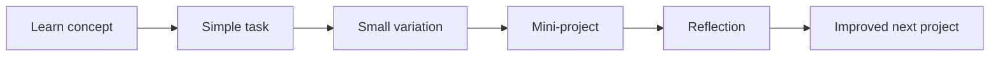
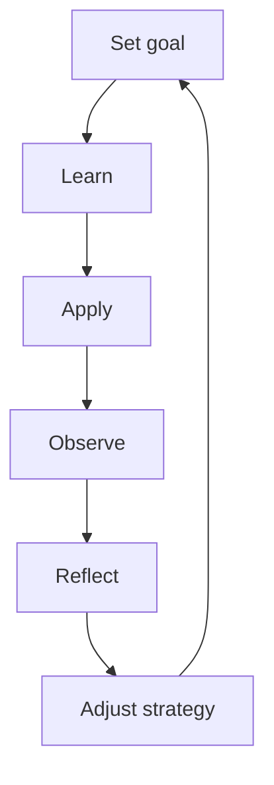

###### Topics

Learning Transfer to Practice

- Formulate your own learning goals
- Apply acquired knowledge to simple real-world tasks
- Implement learning content in small practice projects

Reflection and Further Development

- Analyze your own experiences with learning methods
- Review and adapt individual learning strategies

   
# 🚀 Learning Transfer to Practice

Learning transfer means: you take something you’ve learned and apply it **outside the learning situation** in a meaningful way. So not just “I have understood this,” but: **“I can use it.”** This specific step is crucial in technical learning. Especially in Core Tech Fundamentals, knowledge really becomes valuable only when you can transfer it to real situations — for example, to a small automation, a script, an API request, a file structure, a Git repository, or an error in a program.

Research in learning shows that transfer succeeds better when knowledge is not just learned by rote in isolation, but is **understood and applied in various contexts** ([How People Learn II: Learners, Contexts, and Cultures](https://nap.nationalacademies.org/catalog/24783/how-people-learn-ii-learners-contexts-and-cultures)). That’s what the three points in this area are about: setting good learning goals, transferring what’s been learned to small, real tasks, and building small projects from that.

   
## 🎯 Formulate Your Own Learning Goals

A learning goal is not just a wish like “I want to get better at Python” or “I finally want to understand networks.” That sounds motivating, but is too vague for practical purposes. A good learning goal describes **what you want to be able to do, how you will know you can do it, and in what context you want to apply it**.

This matters because our brain can work much better with clear goals. Research on goal setting shows that **specific and challenging goals** often improve performance much more than vague resolutions like “I’ll try my best” ([Building a Practically Useful Theory of Goal Setting and Task Motivation](https://doi.org/10.1037/0003-066X.57.9.705)).

A good learning goal in the technical field usually has four components:

1. **Topic or skill**  
   What exactly do you want to learn?
2. **Visible outcome**  
   How can you tell you’ve achieved it?
3. **Context of application**  
   Where or for what do you want to use it?
4. **Scope or timeframe**  
   By when or in which scope?

Instead of saying:

> “I’m learning Git.”

it’s much more helpful to say:

> “I want to understand Git well enough that I can initialize a small project, commit changes, create branches, and perform a merge without guidance.”

Or for programming:

> “I want to understand loops and conditions so well that I can write a small script that checks files and processes them differently depending on their file type.”

Such a goal is much more useful because it can be translated directly into action.

   
### 🧭 How to Recognize a Good Learning Goal

A strong learning goal is:

| Characteristic | Meaning | Weak Example | Strong Example |
|---|---|---|---|
| specific | The topic is clearly defined | “I want to learn web development” | “I want to understand how a browser sends an HTTP GET request to an API and processes the response” |
| observable | You can check if you can do it | “I want to understand arrays” | “I can loop through an array, filter it, and output the results” |
| practical | It is tied to a real activity | “I’m learning SQL” | “I can filter, sort, and aggregate data sets with SQL” |
| realistic | It matches your current level | “I’ll build a complete cloud platform in two days” | “I’ll deploy a small static website to a hosting service” |
| focused | It’s not too broad | “I’m learning computer science” | “I understand the difference between stack and heap at an introductory level” |

The big mistake many learners make is formulating goals by topic instead of by skill. Topics are headlines. Skills are what you actually need in the end.

“Learning TCP/IP” is a topic.  
“Being able to explain why a browser resolves an address via DNS, then establishes a connection, and only then loads data” is a skill.

   
### 🛠️ A Simple Formula for Good Learning Goals

A very useful way to phrase it is:

> **I want to understand [topic] well enough that I can independently implement or explain [specific task] in [context].**

Examples:

- “I want to understand variables, data types, and conditions well enough that I can write a small input program with plausibility checking.”
- “I want to understand HTTP well enough that I can explain request, response, status code, and header in a simple API scenario.”
- “I want to understand Git well enough that I can properly carry out a typical workflow with clone, branch, commit, merge, and push.”

This type of goal is strong because it links learning with capability.

   
### 🧱 Why Learning Goals are so Important in Technical Learning

In technical fields, it’s easy to get the feeling: “I’ve watched the tutorial, so I can do it.” This feeling is often deceptive. This is sometimes called an **illusion of understanding**. Only when you have a goal that requires real action do you realize whether the knowledge is already solid.

If your goal is:

> “I want to understand REST”

you can watch videos for a long time and still feel uncertain.

But if your goal is:

> “I want to call a public API, read JSON data, and print two values in the terminal”

then the learning becomes concrete. You know what you’re working toward, and you can realistically assess your progress.

   
## 🧪 Apply Acquired Knowledge to Simple Real-World Tasks

This is the crucial step between “learning” and “being able to do.” You should apply new knowledge to **small real tasks** as early as possible. Don’t wait until you’ve “understood everything.” It’s this early application that makes learning robust.

Learning research shows that knowledge becomes more retrievable if it is actively recalled and used in appropriate situations, instead of just repeatedly read ([Improving Students’ Learning With Effective Learning Techniques](https://journals.sagepub.com/doi/10.1177/1529100612453266)). In technical fields, this means: don’t just read notes, do something small with them.

The important word here is **simple**. Real-world tasks don’t have to be big, impressive, or production-ready at first. It’s enough for them to be real enough to serve a practical purpose or have a clear function.

   
### 🔩 What a “Simple Real-World Task” Is

A good real-world task has three features:

- It comes from a real usage context.
- It’s small enough to remain manageable.
- It requires you to **apply** knowledge, not just repeat it.

Examples from Core Tech Fundamentals:

| Learning Content | Simple Real-World Task | Why This Is Useful |
|---|---|---|
| Variables, conditions, inputs | A small program that checks age or password length | links logic with real input processing |
| Loops | Count files in a folder or process names from a list | shows why repetition is useful |
| Functions | Split a piece of code into reusable functions | trains structure instead of just syntax |
| HTTP and APIs | Call a public API and output a value | links networking basics with programming |
| JSON | Read response data and extract specific fields | makes data formats concrete |
| Git | Initialize a local project and save version states | shows real benefits of version control |
| File system | Create, rename, move files | strengthens the link to OS practice |
| Error handling | Respond to invalid inputs | makes software more robust and realistic |

These tasks are so good because they are close to practice, but don’t demand the full complexity of a real product.

   
### 🌍 Why Real Tasks Are More Powerful Than Pure Theory

If you only learn something theoretically, it often remains tied to the original learning situation. You may know the term but not its use. Real-world tasks force you to

- translate terms into decisions,
- turn knowledge into sequences,
- notice errors,
- check assumptions,
- and experience connections practically.

An example:  
You might know by heart that an HTTP request can consist of method, URL, headers, and body. But only when you make an API request yourself and see a 404 or 401 response do you realize why paths, authentication, or headers matter in practice.

These kinds of connections promote transfer, because knowledge is then stored not just as a definition but as a **tool** ([How People Learn II: Learners, Contexts, and Cultures](https://nap.nationalacademies.org/catalog/24783/how-people-learn-ii-learners-contexts-and-cultures)).

   
### ⚖️ The Right Level of Difficulty

A real-world task should challenge you, but not overwhelm you. If it’s too easy, you learn little new. If it’s too hard, you spend your energy battling complexity instead of reinforcing the actual learning content.

For good learning, the ideal space is where you:

- have understood the basic idea,
- but still need to make decisions yourself,
- make small mistakes,
- and don’t just copy the solution completely.

At the start, **near transfer** is more important than immediately jumping into complex applications.  
This means: First solve related tasks, then gradually move further away from the example.

Example:

1. You learn `if` conditions.
2. Then you build an input validation.
3. Next, you combine conditions with loops.
4. Later, you turn both into a small menu program.

This way, step by step, true competence for action grows from a small concept.

   
## 🧩 Implementing Learning Content in Small Practice Projects

A practice project is the next step after a single task. While a task often tests only one specific point, a small project links several building blocks together. This way you notice whether your knowledge already works together.

This is extremely important in technical learning. Many things seem individually understandable — variables, functions, files, requests, Git — but true competence only arises when these parts interact in a small whole.

A good practice project is **small, limited in scope, and has a clear goal**. It’s not about creating an impressive portfolio piece. It’s about implementing a learning content in such a way that you understand its practical structure.

   
### 🧱 What Makes a Good Small Practice Project

A meaningful mini-project usually has:

- **one main goal**, not five at once,
- **a clear output**,
- **limited scope**,
- **a visible end**,
- and **a link to real usage**.

Examples:

| Topic | Mini-Project | What You Really Learn |
|---|---|---|
| Python basics | Console program for a shopping list | Variables, lists, loops, inputs |
| File processing | Read a log file and filter error lines | Files, strings, conditions |
| Web basics | Small HTML/CSS profile page | Structure, styling, file structure |
| JavaScript | To-do list in the browser | DOM, events, state |
| APIs | Retrieve and display weather or country data | HTTP, JSON, error handling |
| Git | Version your learning notes and document changes | Commits, history, branches |
| SQL | Small database with queries for tasks or books | Tables, SELECT, WHERE, ORDER BY |

It’s not about “building the world,” but realizing a clear learning core.

   
### 🧭 Why Small Projects Are Better Than Overly Large Ventures

Many learners make the same mistake: they’ve just learned a basic concept and immediately start a huge project. That sounds motivating, but often leads to frustration. Then you’re no longer fighting with the learning content, but with a hundred side problems at once.

A small project protects you from this by keeping you focused. It forces you to set priorities:

- What is the actual learning subject here?
- What is just extra?
- Which parts are unnecessary for now?

If, for example, you’re currently learning functions, inputs, and lists, a simple console task manager is perfectly adequate. You don’t need user management, cloud sync, or a frontend. That would only be added complexity without additional learning benefit.

   
### 🔄 How Learning Gradually Becomes Practice

This order is didactically strong because it avoids overwhelm but still demands more and more independence.

The more often you work this way, the more something important happens: You start to see new knowledge not as isolated chapters, but as combinable tools.

   
### 🧠 How to Tell that a Practice Project Has Served Its Purpose

A mini-project was effective if afterwards you can not only say “It works,” but also:

- why you chose specific building blocks,
- where problems occurred,
- what you would do more cleanly the second time,
- and which concepts were truly understood.

Then the project wasn’t just busywork, but a real transfer step.

   
# 🔍 Reflection and Further Development

Learning doesn’t end with application. Anyone who wants to keep improving must also observe **how** they learn. That is exactly reflection. You don’t just look at the content, but at your own learning process.

In educational research, this is often called **metacognition** and **self-regulated learning**. It refers to the ability to plan, monitor, and adjust your own learning. This ability has been proven to have a strong influence on learning success ([Metacognition and Self-regulated Learning](https://educationendowmentfoundation.org.uk/education-evidence/guidance-reports/metacognition)).

Especially in technical learning this is important, because you can quickly spend a lot of time on ineffective methods — such as passively consuming tutorials, copying and pasting too soon, or constantly rereading notes without retrieval and application.

   
## 🪞 Analyze Your Own Experiences with Learning Methods

The crucial question is not:  
**“What did I do?”**  
but:  
**“What really helped me to understand, retain, and use something?”**

Many learning methods feel good but are not particularly effective. Rereading and highlighting often give a sense of familiarity, but that feeling is not the same as real competence. Research on learning techniques shows that methods like **active retrieval** and **spaced repetition** are usually much more effective than just rereading ([Improving Students’ Learning With Effective Learning Techniques](https://journals.sagepub.com/doi/10.1177/1529100612453266)).

When you analyze your learning methods, ideally you distinguish between three levels:

1. **Effort**  
   How much time and energy did the method cost?
2. **Subjective feeling**  
   Did it feel clear, easy, or motivating?
3. **Real impact**  
   Could you explain, remember, and apply it afterwards?

Especially the third level is crucial.

   
### 🔬 What You Should Really Observe With Learning Methods

A learning method is useful when it helps you improve at least one of these:

- **Understanding**  
  Can you explain the idea in your own words?
- **Retrievability**  
  Can you recall the knowledge later?
- **Application**  
  Can you do something practical with it?
- **Error detection**  
  Do you spot your knowledge gaps faster?
- **Transfer**  
  Can you use what you’ve learned in slightly changed situations?

For example, if you watched a tutorial and feel confident afterwards, but can’t build anything without a template, the method may have been pleasant, but not strong enough. If, on the other hand, you could solve a small task after learning and noticed your gaps, that was often much more valuable.

   
### ⚠️ Typical Misjudgments in Learning

When analyzing your own learning methods, the same errors in thinking often come up:

| Misjudgment | Why It's Problematic |
|---|---|
| “I recognize it, so I can do it.” | Recognition is much easier than free application |
| “The video was clear, so I learned it.” | Understanding while watching isn’t the same as doing it yourself |
| “I studied for a long time, so it was productive.” | Time spent isn’t proof of learning success |
| “If it was difficult, it was bad.” | Some effort is often a sign of active learning |
| “If it was easy, it was efficient.” | Ease can also be just surface familiarity |

Technical learning in particular requires not just motivation, but honest observation: Which method actually leads to capability for you?

   
### 🧠 Analysis Is Not Self-Criticism, but Pattern Recognition

Reflection is not there to be hard on yourself. It’s a tool to spot patterns. You might discover:

- You understand concepts well by reading,  
  **but** you forget them quickly without retrieval.
- You can recreate syntax from tutorials,  
  **but** free-form tasks are hard.
- You’re motivated by videos,  
  **but** real confidence arises only after mini-projects.

Such patterns are worth their weight in gold. Because then you know where your learning method needs to be complemented.

   
## ⚙️ Review and Adapt Individual Learning Strategies

A learning strategy is more than a single method. It’s your personal system:  
**How do you plan learning, how do you review, how do you test understanding, how do you deal with mistakes, and how do you bring knowledge into practice?**

This system shouldn’t be rigid. Good learners adjust it when they notice something is not working. That’s exactly what self-regulated learning means: planning, observing, evaluating, and readjusting ([Metacognition and Self-regulated Learning](https://educationendowmentfoundation.org.uk/education-evidence/guidance-reports/metacognition)).

   
### 🔧 When A Learning Strategy Should Be Adjusted

You should rethink your strategy if you notice signals like these:

- You understand content while learning, but can’t recall it later.
- You can explain the theory but can’t solve practical tasks.
- You can only move forward with a template.
- You make the same mistakes repeatedly.
- You study a lot but your sense of confidence hardly grows.
- You constantly get bogged down in too-big projects.

The problem usually isn’t lack of talent, but an ill-fitting strategy.

   
### 🧩 How Adjustment Looks in Practice

Here’s the important point: Strategy adjustment doesn’t mean throwing everything out. Usually, it’s enough to **add one missing element**.

| Problem | Possible Adaptation |
|---|---|
| You quickly forget content | More spaced repetition instead of single intense sessions |
| You understand passively but can’t work on your own | More retrieval without aids and small application tasks |
| You know single concepts but not the connections | More mini-projects with 2–3 combined components |
| You often feel overwhelmed | Smaller learning goals and smaller project scopes |
| You stay stuck in theory too long | Earlier application to real micro-tasks |
| You’re making progress but don’t notice it | Define visible criteria for learning goals |

This is very important didactically: Problems in learning are often not solved by “doing more,” but by doing things **differently**.

   
### 🔄 A Practical Learning Cycle

This cycle is especially powerful because it prevents you from working with an ineffective method for months. Instead, you learn adaptively.

   
### 🧭 Examples of Sensible Strategy Adjustments in Technical Learning

If you’re learning in Core Tech Fundamentals, adaptations can be very concrete.

**Case 1: You watch lots of tutorials but can’t program on your own.**  
You probably aren’t missing more explanations, but more **active application**. This means: Less just consuming, more writing yourself, deciding yourself, debugging yourself.

**Case 2: You can explain basics, but can’t solve real problems.**  
You probably need more **transfer tasks**. In other words, tasks that don’t look exactly like the learning example but require the same basic principle.

**Case 3: You constantly start big projects and abandon them.**  
Your strategy is probably too ambitiously scaled. Here, smaller practice projects with just one main goal help.

**Case 4: You understand everything while learning but forget it after a few days.**  
You’re probably missing structured review. Spaced learning is usually more effective than massed repetition in a single long session ([Improving Students’ Learning With Effective Learning Techniques](https://journals.sagepub.com/doi/10.1177/1529100612453266)).

   
### 🌱 What “Individual” Really Means Here

Individual learning strategies don’t mean that entirely different laws of nature apply to each person. There are robust principles of learning: active retrieval, application, spacing over time, and reflection. Individualization happens where you decide

- which type of application helps you,
- what size of project scope is ideal for you,
- how much guidance you need at the start,
- and where you most often fail.

In other words:  
The basic principles are often general, but the **implementation** must fit your current level, your subject, and your way of working.

That’s precisely why reflection is so valuable. It helps you translate general learning principles into a personal, functioning system.