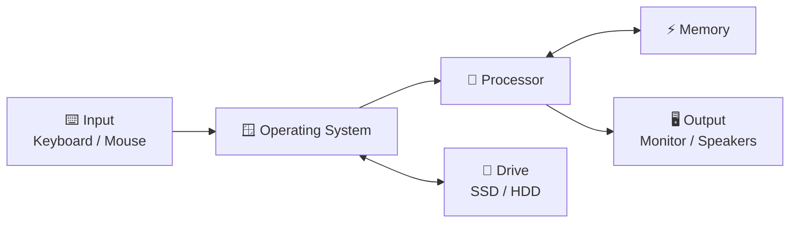

###### Topics

Computer Hardware

- Getting to know the components of a computer: processor, memory, drives, and peripherals
- Basic overview of how a computer works

Operating System Interface

- Recognize and use key controls: desktop, taskbar, and start menu
- Window management and basic navigation in the operating system

Elementary System Settings

- Adjust time, language, and display options
- Log in and log out of the system as well as shutting down and restarting

   
# 🖥️ Computer Hardware

If you want to understand computer hardware, a simple analogy helps: **A computer works like a team**. Each part has a specific task. Only together do they form a usable system.

   
## 🧩 The Most Important Components of a Computer

The four core areas you mentioned are especially important:

- **Processor**
- **Memory**
- **Drives**
- **Peripherals**

These parts perform different roles. Some **process calculations**, some **temporarily store data**, some **store data permanently**, and some allow you to **input data** or **see results**.

   
### 🧠 The Processor (CPU)

The **processor** or **CPU** is the computer’s computing unit. It processes commands, performs calculations, and controls many operations. That’s why it’s often called the “brain” of the computer ([Central processing unit](https://www.britannica.com/technology/central-processing-unit)).

Simply put:  
When you open a program, write text, or start a video, the processor is constantly handling tasks. It doesn't “decide” what makes sense, but it **executes commands extremely quickly and in the correct order**.

Important points:

- The processor works in very small calculation steps.
- It processes data provided by the operating system and programs.
- Depending on the model, it has multiple **cores**. More cores mean multiple tasks can be handled simultaneously.
- Speed is often given in **GHz**, but that's only part of its performance. Architecture, cache, and number of cores also matter.

A practical analogy:  
The processor is like a **chef in a kitchen**. He prepares the dishes, but to work quickly, the ingredients must be at hand. That’s exactly what memory is for.

   
### ⚡ Memory (RAM)

**Memory**, commonly called **RAM**, is the computer's short-term storage. Currently needed data and programs are kept here so the processor can quickly access them ([RAM](https://www.britannica.com/technology/RAM)).

This is a very important point:  
**RAM is fast but not permanent.** When the computer is turned off, the contents of memory are lost. That’s why you don’t save documents “in RAM,” but on a drive.

Why is RAM so important?

If you're running

- a browser,
- a word processor,
- music,
- and maybe a video call at the same time,

all these active data must be quickly accessible. That’s exactly what memory does.

A helpful analogy:  
RAM is like the **workspace on your desk**. What you’re currently using is laid out in front of you. If the desk is too small, you constantly have to put things away and fetch them again—that slows everything down.

   
### 💾 Drives (Permanent Storage)

**Drives** are the components where data is stored **permanently**. This includes:

- the operating system
- programs
- documents
- pictures
- videos
- downloads

Today, two types are especially important:

#### **SSD**
An **SSD** stores data electronically and has no moving parts. It is much faster, quieter, and often more robust than a classic hard drive ([Solid-State-Drive](https://en.wikipedia.org/wiki/Solid-state_drive)).

#### **HDD**
An **HDD** is a traditional hard disk drive. It stores data on spinning magnetic disks. It’s usually cheaper per gigabyte, but slower and mechanically more fragile ([Hard disk drive](https://en.wikipedia.org/wiki/Hard_disk_drive)).

For everyday use:

- With an **SSD**, Windows starts faster.
- Programs open more quickly.
- The computer feels more responsive and fluid overall.

The difference to RAM is crucial:

- **RAM** = fast, but only temporary
- **Drive** = permanent, but slower than RAM

A comparison helps:  
The drive is like a **filing cabinet or storage room**. Everything stays there, even when you leave work. RAM, on the other hand, is only the current working surface.

   
### 🖨️ Peripherals (Input and Output Devices)

**Peripherals** are devices connected to the computer that allow data to be input or output ([Peripheral device](https://www.britannica.com/technology/peripheral-device)).

These include, for example:

- **Keyboard** – enter text and commands
- **Mouse** – point, click, select
- **Monitor** – display output
- **Printer** – printouts
- **Speakers/Headphones** – sound output
- **Microphone** – voice input
- **Webcam** – image capture
- **USB stick** or external hard drive – additional storage

Peripherals are the connection between you and the computer.  
Without them, the machine could compute internally, but you could hardly interact usefully with it.

   
### 📋 Components at a Glance

| Component | Main Function | Stores Data? | For How Long? | Simple Analogy |
|---|---|---:|---|---|
| **Processor (CPU)** | Calculations and control | No, not as actual storage | – | Brain / Chef |
| **Memory (RAM)** | Quickly provides active data | Yes | Only while powered on | Desk/workspace |
| **Drive (SSD/HDD)** | Stores data permanently | Yes | Even without power | Filing cabinet |
| **Peripherals** | Enable input and output | Sometimes, depending on device | Varies | Connection to the outside world |

   
## 🔄 Basic Overview of How a Computer Works

Now comes the crucial connection:  
A computer doesn't work by having a single component do everything. Instead, tasks are **handled in a chain**.

Simply put, this is how it works:

1. You input something.  
   For example, you click on a program.

2. The operating system recognizes the input.  
   It knows which program should be opened.

3. The program is loaded from the drive.  
   The required data comes from the SSD or HDD.

4. The data goes into memory.  
   It's quickly available there.

5. The processor processes this data.  
   It executes the program's commands.

6. The result is output.  
   For example, a window appears on the monitor.

This is the basic idea behind almost everything that happens on a computer.

   
### 🔌 What Happens When You Power On

When you turn on the computer, a lot happens behind the scenes:

First, the hardware is powered up. Then basic firmware, usually **BIOS** or **UEFI**, starts up. It checks if the most important devices are present and starts the boot process. After that, the operating system is loaded from the drive into memory. Only then does the login interface or desktop appear.

It's important to understand:  
The operating system does not become “active” out of nowhere. It must be **read from permanent storage** and **loaded into RAM** so that the processor can work with it.

   
### 🔁 How the Parts Work Together

Here’s a very simplified diagram of their interaction:

This diagram shows something very important:

- **You do not interact directly with the hardware**, but mostly via the operating system.
- The **operating system organizes** the collaboration.
- The **processor handles calculations**.
- **RAM keeps current data accessible**.
- The **drive stores data permanently**.
- **Peripherals** provide input and output.

That’s why a computer can only run smoothly if these components work well together.

   
# 🪟 Operating System Interface

Hardware alone would be difficult for most people to use. That's why there is an **operating system**. It's the core software that manages hardware, launches programs, and provides a user interface ([Operating system](https://www.britannica.com/technology/operating-system)).

Since you're asking about **desktop**, **taskbar**, and **start menu**, I'll explain this part using **Windows** as an example.

   
## 🧭 What an Operating System Actually Does

An operating system is like the **organizer and mediator** of the computer.

Its tasks include:

- Recognizing and managing hardware.
- Launching programs.
- Managing files and folders.
- Allowing several programs to run at once.
- Providing an interface for you to work with.

Without an operating system, you'd have to interact with hardware much more directly and technically. For normal use, that would be impractical. The operating system turns all the technical components into a **usable working environment**.

   
## 🖼️ Recognizing and Using Desktop, Taskbar, and Start Menu

These three elements are the center of Windows operation. If you understand them, you’ll have a good grasp of the system.

   
### 🖥️ The Desktop (Working Surface)

The **desktop** is the large area you see after logging in—also called the **working surface**.

You’ll usually find:

- the background
- shortcuts to programs
- sometimes files or folders
- the recycle bin

So, the desktop is essentially your **workspace**.  
Here, windows appear, you click icons, and often start programs or open files.

It's important to know:  
An icon on the desktop is usually **not the actual program itself**, but only a **shortcut**. This points to the actual program or file.

   
### 📌 The Taskbar

The **taskbar** is usually at the bottom of the screen in Windows. It's one of the most important controls.

Typical elements:

- the **start button**
- pinned programs
- icons of open programs
- information area showing network, volume, battery
- clock and date

The taskbar is especially handy because you can:

- start programs
- switch between open windows
- quickly see what's active
- keep important system info in view

When a program is open, it appears in the taskbar. You can switch between several applications quickly.

   
### 🚪 The Start Menu

You open the **start menu** using the start button on the taskbar or the Windows key on your keyboard.

Here you’ll usually find:

- installed programs
- search function
- settings
- power options
- sometimes recently used files or recommendations

The start menu is the **main entry point** to Windows.  
If you’re looking for something and don't know where it is, the start menu is often the best place to start.

A good rule is:  
**If you’re looking for a program, setting, or system function, check the start menu or use the search there first.**

   
### 🧾 The Elements at a Glance

| Element | How to Recognize It | What You Use It For |
|---|---|---|
| **Desktop** | Large area with background and icons | Workspace, files, and shortcuts |
| **Taskbar** | Usually at the lower edge of the screen | Start programs, switch windows, see status |
| **Start Menu** | Menu behind the start button | Programs, search, settings, shut down |

   
## 🪟 Window Management and Basic Navigation in the Operating System

Once you start programs, you're mostly working with **windows**. Understanding these windows is one of the most important basic computer skills.

   
### 📐 Controlling Windows

A window shows the visible area of an open program or folder.

In the top right, you'll usually find three important buttons:

- **Minimize** – the window disappears from view but stays open
- **Maximize** – the window fills almost the entire screen
- **Close** – the window or program is closed

Additionally, you can:

- **move** a window  
  by clicking and dragging the title bar

- **resize** a window  
  by dragging the edge or corner

- **restore down** or return from full screen

It may sound simple, but in day-to-day use it’s extremely important. If you’re doing several things at once, you’ll need these window controls all the time.

   
### 🔄 Switching Between Windows

When multiple programs are open, you'll need to switch between them.

Ways to do this:

- **Click the program icon in the taskbar**
- **Alt + Tab** to cycle between open windows
- Select a visible window directly with the mouse

The reason:  
A computer can have several programs open at once, but you only work with the window that is currently **active**. The active window is in the foreground.

   
### 🗂️ Basic Navigation in the System

"Navigation" means moving through the system and finding things on purpose.

This includes:

- Opening programs
- Opening folders
- Finding files
- Browsing menus and settings
- Switching between views

Key actions are:

- **Single-click** – select
- **Double-click** – open
- **Right-click** – context menu with more options
- **Scroll** – move up and down in lists, websites, or documents
- **Drag and drop** – move or arrange things

Especially important is the **File Explorer**. It's the program you use to access folders, drives, and files. If you're “looking for something on the computer,” you'll often end up in the Explorer.

Think of it this way:  
The operating system is the whole environment. The Explorer is the tool you use to move through your stored content.

   
### 🧠 Why Window Management Is So Important

Many beginners underestimate this, but this is where most confidence with computers is built.

If you understand

- what is open,
- what is just minimized,
- what is active,
- how to get back to the desktop,
- and how to close programs deliberately,

you'll no longer feel “lost” on the system.

That’s why window management is a core computer skill.

   
# ⚙️ Elementary System Settings

Besides normal operation, you should be able to adjust simple basic settings. These are not special features, but things that adapt the computer to **your language, your time, and your screen**.

In Windows, many of these can be found in the **Settings** app.

   
## 🕒 Adjust Time, Language, and Display Options

These three areas are among the most common basic settings.

   
### 🕰️ Adjust Time and Date

The correct time is more important than it seems at first.

It affects, for example:

- File timestamps
- Calendar and appointments
- Emails
- some security features
- correct time zone display

Typical settings:

- **Set time automatically**
- **Select time zone**
- **Manually change date and time**
- **Adjust time format**

If the time is wrong, it can cause confusion in daily life, e.g., with appointments or files suddenly showing the wrong dates.

   
### 🌍 Adjust Language and Keyboard

Two things must be distinguished here:

1. **Display Language**  
   This is the language that menus, buttons, and system texts appear in.

2. **Keyboard Layout**  
   This determines which key produces which character.

This is important because language and keyboard are not always the same.  
For example, you might use a German Windows but have an English keyboard layout selected. Then keys like **Z** and **Y** are swapped, and special characters appear in strange places.

Typical adjustments:

- Change system language
- Add more languages
- Select keyboard layout
- Switch input languages

This is especially common for shared devices or international environments.

   
### 🖥️ Adjust Display Options

The display options control **how content appears on the screen**.

This includes, for example:

- **Resolution**  
  How many pixels are shown

- **Scaling**  
  How big text, icons, and windows appear

- **Brightness**  
  Especially important on laptops

- **Orientation**  
  Landscape or portrait mode

- **Multiple screens**  
  Extend, duplicate, or show only on one screen

The two most important concepts for beginners are usually:

#### **Resolution**
A higher resolution usually means a sharper image, but elements may appear smaller.

#### **Scaling**
Scaling increases or decreases the display size of text and interface elements without changing the physical screen size. This is especially helpful with high-resolution displays.

In practice:  
If everything seems **too small**, the problem is often not the resolution, but the **scaling**.

   
## 🔐 Logging In and Out of the System, Shutting Down, and Restarting

These functions sound simple, but are often confused. It’s helpful to distinguish them clearly.

   
### 👤 Logging In to the System

**Logging in** means you sign in as a user on the computer.

Logging in can be done using:

- Password
- PIN
- Fingerprint
- Face recognition
- on corporate networks, also via user account and domain

What happens?

After login, the system loads your **user profile**. This includes, for example:

- your desktop
- your personal settings
- saved accounts
- your folders
- your permissions

This means:  
After logging in, the computer knows **who you are** and **which environment should be loaded for you**.

   
### 🚪 Logging Out of the System

**Logging out** ends your user session, but the computer stays on.

This is useful if:

- another user wants to use the computer
- you want to properly log out of your account
- you're on a shared device

Caution:  
When logging out, open programs are usually closed. Unsaved changes may be lost. You should save your work first.

   
### ⏻ Shutting Down

**Shutting down** means the operating system ends its work and the computer turns off.

Open programs should be closed and data saved first. The system then powers down, and the computer goes off.

Shutting down is useful if:

- you won’t use the computer for a while
- you plan to transport it
- you want to save energy
- you want to fully close after work

Important:  
Memory contents are lost when powered off. Anything not saved is gone. That’s why saving before shutting down is so important.

   
### 🔄 Restarting

**Restarting** means: The computer does not simply turn off, but shuts down in a controlled manner and immediately starts up again.

This is especially useful:

- after software or system updates
- after installing drivers
- if the system has “frozen” or become unresponsive
- if a program or service isn’t working properly

A restart fixes many minor problems because processes are ended and reloaded properly. That’s why “Have you tried restarting?” is not a joke, but often a genuinely useful first step.

   
### 📊 Clearly Distinguishing the Differences

| Action | What Happens? | Computer Stays On? | Typical Purpose |
|---|---|---:|---|
| **Log in** | Your user session is started | Yes | Use your account |
| **Log out** | Your user session ends | Yes | Switch user, sign out cleanly |
| **Shut down** | System finishes and device turns off | No | Finish work, save energy |
| **Restart** | System finishes and immediately starts again | Briefly no, then yes | Updates, troubleshooting |

   
### 🧭 Where to Find These Functions

In Windows, you can access many of these functions via the **start menu**:

- **User icon** or account area → Log in or out
- **Power icon** → Shut down or restart

You can also find some options:

- On the login screen
- Using keyboard shortcuts
- By right-clicking the start button
- Via settings

The exact display may vary slightly by Windows version, but the core idea is the same.

   
### 🛡️ Why This Area Is So Important in Everyday Use

Especially when learning basic computer skills, this is crucial:  
You should not only know **where** to click, but also **what the action means technically and practically**.

For example:

If you confuse “closing a window” and “logging out,” it can lead to data loss or confusion. If you treat “shut down” and “restart” as the same, you won’t understand why some updates only work after a restart. And if you don't know that language and keyboard layout are separate, you’ll search for errors in the wrong place.

For these reasons, these seemingly simple functions are part of the true **foundations of safe computer use**.